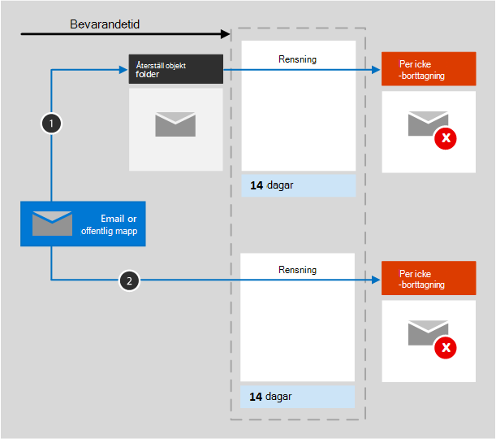

# Mer information om kvarhållning för ExchangeLearn about retention for Exchange

Informationen i den här artikeln kompletterar [Mer information om kvarhållning](retention.md) eftersom den innehåller specifik information för Exchange.The information in this article supplements [Learn about retention](retention.md) because it has information that's specific to Exchange.  För övriga arbetsbelastningar finns information i:For other workloads, see:

- [Mer information om kvarhållning för SharePoint och OneDriveLearn about retention for SharePoint and OneDrive](retention-policies-sharepoint.md)
- [Mer information om kvarhållning för Microsoft TeamsLearn about retention for Microsoft Teams](retention-policies-teams.md)
- [Mer information om kvarhållning för YammerLearn about retention for Yammer](retention-policies-yammer.md)

## Vad ingår för kvarhållning och borttagningWhat's included for retention and deletion

Följande Exchange-objekt kan kvarhållas och tas bort genom att använda kvarhållningsprinciper och kvarhållningsetiketter: E-postmeddelanden (inklusive utkast) med bifogade filer, uppgifter när de har ett slutdatum och anteckningar.The following Exchange items can be retained and deleted by using retention policies and retention labels: Mail messages (includes drafts) with any attachments, tasks when they have an end date, and notes. 

Kalenderobjekt som har ett slutdatum stöds för kvarhållningsprinciper, men stöds inte för kvarhållningsetiketter.Calendar items that have an end date are supported for retention policies but aren't supported for retention labels.

Kontakter och alla uppgifter och kalenderobjekt som inte har ett slutdatum stöds inte.Contacts, and any tasks and calendar items that don't have an end date are not supported.

Andra objekt som lagras i en postlåda, till exempel Skype- och Teams-meddelanden, ingår inte i kvarhållningsprinciper eller -etiketter för Exchange.Other items stored in a mailbox, such as Skype and Teams messages, aren't included in retention policies or labels for Exchange. De här objekten har sina egna kvarhållningsprinciper.These items have their own retention policies.

## Så fungerar kvarhållning för ExchangeHow retention works for Exchange

Både en postlåda och en offentlig mapp använder [mappen Återställningsbara objekt](/exchange/security-and-compliance/recoverable-items-folder/recoverable-items-folder) för att behålla objekt.Both a mailbox and a public folder use the [Recoverable Items folder](/exchange/security-and-compliance/recoverable-items-folder/recoverable-items-folder) to retain items. Bara personer som har tilldelats eDiscovery-behörigheter kan visa objekt i en annan användares mapp för Återställningsbara objekt.Only people who have been assigned eDiscovery permissions can view items in another user's Recoverable Items folder.
  
När en person tar bort ett meddelande i en annan mapp än mappen Borttaget flyttas meddelandet som standard till mappen Borttaget.When a person deletes a message in a folder other than the Deleted Items folder, by default, the message moves to the Deleted Items folder. När en person tar bort ett objekt i mappen Borttaget flyttas meddelandet till mappen Återställningsbara objekt.When a person deletes an item in the Deleted Items folder, the message is moved to the Recoverable Items folder. En användare kan dock ta bort ett objekt temporärt (Skift+Delete) i en mapp, vilket kringgår mappen Borttaget och flyttar objektet direkt till mappen Återställningsbara objekt.However, a user can soft delete an item (Shift+Delete) in any folder, which bypasses the Deleted Items folder and moves the item directly to the Recoverable Items folder.
  
När du tillämpar inställningarna för kvarhållning på Exchange-data utvärderar ett tidsinställt jobb regelbundet objekt i mappen Återställningsbara objekt.When you apply retention settings to Exchange data, a timer job periodically evaluates items in the Recoverable Items folder. Om ett objekt inte stämmer överens med reglerna för minst en kvarhållningsprincip eller kvarhållningsetikett tas objektet bort permanent från mappen Återställningsbara objekt.If an item doesn't match the rules of at least one retention policy or retention label, the item is permanently deleted (also called hard deleted) from the Recoverable Items folder.

Det kan ta upp till sju dagar att köra det tidsinställda jobbet och Exchange-platsen måste innehålla minst 10 MB.The timer job can take up to seven days to run and the Exchange location must contain at least 10 MB.
  
När en användare försöker ändra egenskaper för ett postlådeobjekt, t.ex. ämne, brödtext, bifogade filer, avsändare och mottagare, eller datumet då ett meddelande skickades eller togs emot – sparas en kopia av det ursprungliga objektet i mappen Återställningsbara objekt innan ändringen görs.When a user attempts to change properties of a mailbox item—such as the subject, body, attachments, senders and recipients, or date sent or received for a message—a copy of the original item is saved to the Recoverable Items folder before the change is committed. Den här åtgärden inträffar för varje efterföljande ändring.This action happens for each subsequent change. I slutet av kvarhållningsperioden tas kopior i mappen Återställningsbara objekt bort permanent.At the end of the retention period, copies in the Recoverable Items folder are permanently deleted.

När inställningarna för kvarhållning har tillämpats på Exchange-innehåll beror sökvägarna som innehållet tar på om kvarhållningsinställningarna ska behålla och ta bort, endast behålla eller endast ta bort.After retention settings are applied to Exchange content, the paths the content takes depend on whether the retention settings are to retain and delete, to retain only, or delete only.

När kvarhållningsinställningarna ska behålla och ta bort:When the retention settings are to retain and delete:

1. **Om objektet ändras eller tas bort permanent** av användaren (antingen SKIFT+DELETE eller borttaget från Borttagna objekt) under kvarhållningsperioden: Objektet flyttas (eller kopieras vid redigering) till mappen Återställningsbara objekt.**If the item is modified or permanently deleted** by the user (either SHIFT+DELETE or deleted from Deleted Items) during the retention period: The item is moved (or copied, in the case of edit) to the Recoverable Items folder. Där körs ett tidsinställt jobb regelbundet och identifierar objekt vars kvarhållningsperiod har upphört att gälla och dessa objekt tas bort permanent inom 14 dagar från det att kvarhållningsperioden upphört.There, a timer job runs periodically and identifies items whose retention period has expired, and these items are permanently deleted within 14 days of the end of the retention period. Observera att 14 dagar är standardinställningen, men det kan konfigureras upp till 30 dagar.Note that 14 days is the default setting, but it can be configured up to 30 days.

2. **Om objektet inte ändras eller tas bort** under kvarhållningsperioden: Samma process körs regelbundet på alla mappar i postlådan och identifierar objekt vars kvarhållningsperiod har gått ut och de objekten tas bort permanent inom 14 dagar efter att kvarhållningsperioden har gått ut.**If the item is not modified or deleted** during the retention period: The same process runs periodically on all folders in the mailbox and identifies items whose retention period has expired, and these items are permanently deleted within 14 days of the end of the retention period. Observera att 14 dagar är standardinställningen, men det kan konfigureras upp till 30 dagar.Note that 14 days is the default setting, but it can be configured up to 30 days. 

När inställningarna för kvarhållning endast ska behålla eller endast ta bort, är innehållssökvägarna varianter av kvarhålla eller ta bort:When the retention settings are retain-only, or delete-only, the contents paths are variations of retain and delete:

### Innehållssökvägar för kvarhållningsinställningar för endast kvarhållningContent paths for retain-only retention settings

1. **Om objektet ändras eller tas bort** under kvarhållningsperioden: En kopia av det ursprungliga objektet skapas i mappen Återställningsbara objekt och bevaras till slutet av kvarhållningsperioden, när kopian i mappen Återställningsbara objekt tas bort permanent inom 14 dagar efter att objektet upphört.**If the item is modified or deleted** during the retention period: A copy of the original item is created in the Recoverable Items folder and retained until the end of the retention period, when the copy in the Recoverable Items folder is permanently deleted within 14 days after the item expires. 

2. **Om objektet inte ändras eller tas bort** under kvarhållningsperioden: Ingenting händer före och efter kvarhållningsperioden, objektet förblir på sin ursprungliga plats.**If the item is not modified or deleted** during the retention period: Nothing happens before and after the retention period; the item remains in its original location.

### Innehållssökvägar för kvarhållningsinställningar för endast borttagningContent paths for delete-only retention settings

1. **Om objektet inte tas** under den konfigurerade perioden: I slutet av den konfigurerade perioden i kvarhållningsprincipen flyttas objektet till mappen Återställningsbara objekt.**If the item is not deleted** during the configured period: At the end of the configured period in the retention policy, the item is moved to the Recoverable Items folder. 

2. **Om objektet tas bort** under den konfigurerade perioden: Objektet flyttas direkt till mappen Återställningsbara objekt.**If the item is deleted** during the configured period: The item is immediately moved to the Recoverable Items folder. Om en användare tar bort objektet därifrån eller tömmer mappen Återställningsbara objekt tas objektet bort permanent.If a user deletes the item from there or empties the Recoverable Items folder, the item is permanently deleted. Annars tas objektet bort permanent efter att det legat i mappen Återställningsbara objekt i 14 dagar.Otherwise, the item is permanently deleted after being in the Recoverable Items folder for 14 days. 

## När en användare lämnar organisationenWhen a user leaves the organization 

Om en användare lämnar organisationen och användarens postlåda ingår i en kvarhållningsprincip blir postlådan en inaktiv postlåda när användarens Microsoft 365-konto tas bort.If a user leaves your organization and the user's mailbox is included in a retention policy, the mailbox becomes an inactive mailbox when the user's Microsoft 365 account is deleted. Innehållet i en inaktiv postlåda omfattas fortfarande av en kvarhållningsprincip som placerades på postlådan innan den inaktiverades, och innehållet är tillgängligt för eDiscovery-sökningar.The contents of an inactive mailbox are still subject to any retention policy that was placed on the mailbox before it was made inactive, and the contents are available to an eDiscovery search. Mer information finns under [Inaktiva postlådor i Exchange Online](inactive-mailboxes-in-office-365.md).For more information, see [Inactive mailboxes in Exchange Online](inactive-mailboxes-in-office-365.md).

## KonfigurationsvägledningConfiguration guidance

Om du är nybörjare på att konfigurera kvarhållning i Microsoft 365 läs mer på [Komma igång med kvarhållningsprinciper och kvarhållningsetiketter](get-started-with-retention.md).If you're new to configuring retention in Microsoft 365, see [Get started with retention policies and retention labels](get-started-with-retention.md).

Om du är redo att konfigurera en kvarhållningsprincip eller kvarhållningsetikett för Exchange följer du anvisningarna nedan:If you're ready to configure a retention policy or retention label for Exchange, see the following instructions:
- [Skapa och konfigurera kvarhållningsprinciperCreate and configure retention policies](create-retention-policies.md)
- [Skapa kvarhållningsetiketter och använda dem i apparCreate retention labels and apply them in apps](create-apply-retention-labels.md)
- [Använda en kvarhållningsetikett för innehåll automatisktApply a retention label to content automatically](apply-retention-labels-automatically.md)