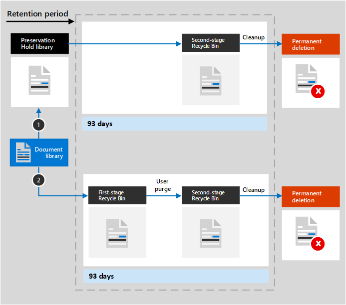

# Lär dig mer om kvarhållning för SharePoint och OneDrive

>*[Vägledning för säkerhet och efterlevnad med licensiering i Microsoft 365](/office365/servicedescriptions/microsoft-365-service-descriptions/microsoft-365-tenantlevel-services-licensing-guidance/microsoft-365-security-compliance-licensing-guidance).*

Informationen i den här artikeln kompletterar [Lär dig mer om kvarhållning](retention.md) eftersom här finns information som är specifik för SharePoint och OneDrive.

För andra arbetsbelastningar, se:

- [Lär dig mer om kvarhållning för Microsoft Teams](retention-policies-teams.md)
- [Lär dig mer om kvarhållning för Yammer](retention-policies-yammer.md)
- [Lär dig mer om kvarhållning för Exchange](retention-policies-exchange.md)

## Vad omfattas för kvarhållning och borttagning

Alla filer som lagras på SharePoint- eller OneDrive-webbplatser kan behållas genom att tillämpa en kvarhållningsprincip eller kvarhållningsetikett. 

Följande filer kan tas bort:

- När du använder en kvarhållningsprincip: Alla filer i dokumentbibliotek, vilket inkluderar alla automatiskt skapade SharePoint-dokumentbibliotek, till exempel **webbplatstillgångar**.
    
- När du använder kvarhållningsetiketter: Alla filer i alla dokumentbibliotek och alla filer på rotnivån som inte finns i en mapp.
    
> [!TIP]
> När du använder en [fråga med en princip som tillämpas automatiskt för en kvarhållningsetikett](apply-retention-labels-automatically.md#auto-apply-labels-to-content-with-keywords-or-searchable-properties) kan du utesluta specifika dokumentbibliotek genom att använda följande inmatning: `NOT(DocumentLink:"<URL to document library>")`

Listobjekt stöds inte av kvarhållningsprinciper, men stöds av kvarhållningsetiketter utom för objekt i systemlistor. Dessa är dolda listor som används av SharePoint för att hantera systemet och omfattar huvudsidekatalogen, lösningskatalogen och datakällorna. När du använder en kvarhållningsetikett på ett listobjekt som stöds och har en dokumentbilaga:
- För en standardkvarhållningsetikett (deklarerar inte att objektet är en arkivhandling):
    - Dokumentbilagan ärver inte automatiskt kvarhållningsinställningarna för etiketten, men kan märkas var för sig.
- För en kvarhållningsetikett som deklarerar objektet som en arkivhandling: 
    - Dokumentbilagan ärver automatiskt kvarhållningsinställningarna från etiketten om dokumentet inte redan är märkt.

Kvarhållningsinställningar från både kvarhållningsprinciper och kvarhållningsetiketter gäller inte för organisationsstrukturer som omfattar bibliotek, listor och mappar.

För kvarhållningsprinciper och automatiskt tillämpade etikettprinciper: SharePoint-webbplatser måste indexeras för att kvarhållningsinställningarna ska tillämpas. Om däremot objekt i SharePoint-dokumentbibliotek är konfigurerade att inte visas i sökresultat utesluter inte den här konfigurationen filer från kvarhållningsinställningarna.

## Så här fungerar kvarhållning för SharePoint och OneDrive

För att lagra innehåll som måste behållas skapar SharePoint och OneDrive ett bibliotek för bevarande av dokument om ett sådant inte finns. Du kan visa det här biblioteket på sidan **Webbplatsinnehåll** på webbplatsen på den översta nivån i webbplatssamlingen. De flesta användare kan inte visa biblioteket för bevarande av dokument eftersom det bara visas för administratörer för webbplatssamlingar.

För objekt i SharePoint som har en standardkvarhållningsetikett (deklarerar inte att objektet är en arkivhandling) behövs inte biblioteket för bevarande av dokument eftersom dessa objekt finns kvar på sin ursprungliga plats. I SharePoint kan användare inte ta bort objekt när den kvarhållningsetikett som används är konfigurerad att bevara innehållet. Versionshantering i SharePoint bevarar äldre versioner när objekt redigeras. Men för andra scenarier används biblioteket för bevarande av dokument när objekt måste bevaras:
- Objekt i OneDrive som har standardkvarhållningsetiketter
- Objekt i SharePoint eller OneDrive som har kvarhållningsetiketter som deklarerar dem som en arkivhandling och objektet är upplåst för redigering
- Objekt som omfattas av kvarhållningsprinciper

För att bevara det här innehållet när en användare försöker ändra eller ta bort det görs en kontroll om innehållet har ändrats sedan kvarhållningsinställningarna användes. Om det här är den första ändringen sedan kvarhållningsinställningarna användes kopieras innehållet till biblioteket för bevarande av dokument, där personen kan ändra eller ta bort det ursprungliga innehållet. Allt innehåll i en webbplatssamling kan kopieras till biblioteket för bevarande av dokument, oberoende av kvarhållningsinställningarna.
  
Ett tidsinställt jobb rensar regelbundet i biblioteket för bevarande av dokument. För innehåll som har legat i biblioteket för bevarande av dokument i mer än 30 dagar jämför det här jobbet innehållet med alla frågor som kvarhållningsinställningarna använt för innehållet. Innehåll som är äldre än dess konfigurerade kvarhållningsperiod tas sedan bort från biblioteket för bevarande av dokument och den ursprungliga platsen, om det fortfarande finns kvar där. Det här tidsinställda jobbet körs var sjunde dag, vilket innebär att det tillsammans med minimitiden på 30 dagar kan ta upp till 37 dagar för innehåll att tas bort från biblioteket för bevarande av dokument.

När filer bevaras i biblioteket för bevarande av dokument kan administratörer inte ta bort innehållets SharePoint-webbplats eller OneDrive-konto.

Det här beteendet med att kopiera filer till biblioteket för bevarande av dokument gäller för innehåll som finns när kvarhållningsinställningarna används. För kvarhållningsprinciper gäller även att allt nytt innehåll som skapats eller lagts till på webbplatsen efter att det inkluderats i principen bevaras i biblioteket för bevarande av dokument. Men nytt innehåll kopieras inte till biblioteket för bevarande av dokument första gången det redigeras, utan bara när det tas bort. Om du vill behålla alla versioner av en fil måste du aktivera [versionshantering](#how-retention-works-with-document-versions).
  
Användarna får ett felmeddelande om de försöker ta bort ett bibliotek, en lista, en mapp eller en webbplats som omfattas av kvarhållning. De kan ta bort en mapp om de först flyttar eller tar bort filer i mappen som omfattas av kvarhållning.

> [!NOTE]
> Eftersom biblioteket för bevarande av dokument bara skapas när det behövs, och inte när du använder en kvarhållningsprincip eller kvarhållningsetikett, måste du först redigera eller ta bort ett objekt som omfattas av kvarhållning för att se att det fungerar. Bläddra sedan till biblioteket för bevarande av dokument för att visa den bevarade kopian.
  
När inställningarna för kvarhållning tilldelas till innehåll i ett OneDrive-konto eller på en SharePoint-webbplats beror sökvägarna som innehållet tar på om kvarhållningsinställningarna ska behålla och ta bort, endast behålla eller endast ta bort.

När kvarhållningsinställningarna ska behålla och ta bort:

  
1. **Om innehållet ändras eller tas bort** under kvarhållningsperioden skapas en kopia i biblioteket för bevarande av dokument av det ursprungliga innehållet, så som det var när kvarhållningsinställningarna tilldelades. Där identifierar det tidsinställda jobbet objekt vars kvarhållningsperiod har upphört att gälla. De objekten flyttas till papperskorgen på andra nivån, där de tas bort permanent efter 93 dagar. Papperskorgen på andra nivån visas inte för slutanvändare (endast papperskorgen på första nivån visas), men administratörer för webbplatssamlingar kan visa och återställa innehåll därifrån.

    > [!NOTE]
    > För att förhindra oavsiktlig dataförlust tar vi inte längre bort innehåll permanent från biblioteket för bevarande av dokument. Istället tar vi bara bort innehåll permanent från papperskorgen, så nu går allt innehåll från biblioteket för bevarande av dokument genom papperskorgen på andra nivån.
    
2. **Om innehållet inte ändras eller tas bort** under kvarhållningsperioden flyttar det tidsinställda jobbet detta innehåll till papperskorgen på första nivån i slutet av kvarhållningsperioden. Om en användare tar bort innehållet därifrån eller tömmer den här papperskorgen (kallas även att rensa) flyttas dokumentet till papperskorgen på andra nivån. En 93 dagar lång kvarhållningsperiod sträcker sig över papperskorgen på både första och andra nivån. Efter 93 dagar tas dokumentet bort permanent från den plats där det finns, antingen i papperskorgen på första eller andra nivån. Papperskorgen indexeras inte och går därför inte att söka i. Därför kan en eDiscovery-sökning inte hitta något innehåll i papperskorgen för att placera ett bevarande.

När inställningarna för kvarhållning endast ska behålla eller endast ta bort, är innehållssökvägarna varianter av behålla eller ta bort:

### Innehållssökvägar för kvarhållningsinställningar för endast kvarhållning

1. **Om innehållet ändras eller tas bort** under kvarhållningsperioden: En kopia av det ursprungliga dokumentet skapas i biblioteket för bevarande av dokument och behålls till slutet av kvarhållningsperioden, då kopian i biblioteket för bevarande av dokument flyttas till papperskorgen på andra nivån och tas bort permanent efter 93 dagar.

2. **Om innehållet inte ändras eller tas bort** under kvarhållningsperioden: Ingenting händer före och efter kvarhållningsperioden, dokumentet förblir på sin ursprungliga plats.

### Innehållssökvägar för kvarhållningsinställningar för endast borttagning

1. **Om innehållet tas bort** under den konfigurerade perioden: Dokumentet flyttas till papperskorgen på första nivån. Om en användare tar bort dokumentet därifrån eller tömmer den här papperskorgen flyttas dokumentet till papperskorgen på andra nivån. En 93 dagar lång kvarhållningsperiod sträcker sig över papperskorgen på både första och andra nivån. Efter 93 dagar tas dokumentet bort permanent från den plats där det finns, antingen i papperskorgen på första eller andra nivån. Om innehållet ändras under den konfigurerade perioden följer det samma borttagningssökväg efter den konfigurerade perioden.

2. **Om innehållet inte tas bort** under den konfigurerade perioden: I slutet av den konfigurerade perioden i kvarhållningsprincipen flyttas dokumentet till papperskorgen på första nivån. Om en användare tar bort dokumentet därifrån eller tömmer den här papperskorgen (kallas även att rensa) flyttas dokumentet till papperskorgen på andra nivån. En 93 dagar lång kvarhållningsperiod sträcker sig över papperskorgen på både första och andra nivån. Efter 93 dagar tas dokumentet bort permanent från den plats där det finns, antingen i papperskorgen på första eller andra nivån. Papperskorgen indexeras inte och går därför inte att söka i. Därför kan en eDiscovery-sökning inte hitta något innehåll i papperskorgen för att placera ett bevarande.

## Så fungerar kvarhållning för OneNote-innehåll

När du använder en kvarhållningsprincip på en plats som innehåller OneNote-innehåll är de olika OneNote-avsnitten i själva verket enskilda filer. Det innebär att varje avsnitt behålls och tas bort individuellt, enligt de kvarhållningsinställningar du anger.

## Så fungerar kvarhållning med dokumentversioner

Versionshantering är en funktion i alla dokumentlistor och bibliotek i SharePoint och OneDrive. Som standard behåller versionshanteringen minst 500 högre versioner, men du kan öka den här gränsen. Mer information finns i [Aktivera och konfigurera versionshantering för en lista eller ett bibliotek](https://support.office.com/article/1555d642-23ee-446a-990a-bcab618c7a37) och [Så fungerar versionshantering i listor och bibliotek](https://support.microsoft.com/office/how-versioning-works-in-lists-and-libraries-0f6cd105-974f-44a4-aadb-43ac5bdfd247).
  
När ett dokument med versioner omfattas av kvarhållningsinställningar för att behålla innehållet, finns versioner som kopieras till biblioteket för bevarande av dokument som ett separat objekt. Om kvarhållningsinställningarna har konfigurerats för borttagning i slutet av kvarhållningsperioden:

- Om kvarhållningsperioden baseras på när innehållet skapades har varje version samma utgångsdatum som det ursprungliga dokumentet. Det ursprungliga dokumentet och dess versioner upphör att gälla samtidigt.

- Om kvarhållningsperioden baseras på när innehållet senast ändrades, har varje version ett eget utgångsdatum baserat på när det ursprungliga dokumentet ändrades för att skapa den versionen. Det ursprungliga dokumentet och dess versioner upphör att gälla oberoende av varandra.

> [!NOTE]
> De bevarade versionerna av dessa SharePoint- och OneDrive-dokument är inte sökbara med eDiscovery-verktyg.

När kvarhållningsåtgärden är att ta bort dokumentet tas alla versioner som inte finns i biblioteket för bevarande av dokument bort samtidigt enligt den aktuella versionen.

För objekt som omfattas av en kvarhållningsprincip (eller ett eDiscovery-bevarande) ignoreras gränserna för versionshantering för dokumentbiblioteket tills kvarhållningsperioden för dokumentet nås (eller eDiscovery-bevarandet släpps). I det här scenariot rensas inte gamla versioner automatiskt och användare hindras från att ta bort versioner.

Så är inte fallet för kvarhållningsetiketter när innehållet inte omfattas av en kvarhållningsprincip (eller ett eDiscovery-bevarande). Istället gäller gränserna för versionshantering så att äldre versioner tas bort automatiskt så att nya versioner får plats, men användarna hindras fortfarande från att ta bort versioner.

## När en användare lämnar organisationen

**SharePoint**:

När en användare lämnar organisationen påverkas inte innehåll som skapats av den användaren eftersom SharePoint betraktas som en samarbetsmiljö, till skillnad från en användares postlåda eller OneDrive-konto.

**OneDrive**:

Om en användare lämnar organisationen behålls alla filer som omfattas av en kvarhållningsprincip eller som har en kvarhållningsetikett så länge principen eller etiketten gäller. Under den tidsperioden fortsätter all delningsåtkomst att fungera. När kvarhållningsperioden upphör att gälla flyttas innehållet till webbplatssamlingens papperskorg och är inte åtkomligt för någon förutom administratören. Om ett dokument är markerat med en kvarhållningsetikett som en arkivhandling tas inte dokumentet bort förrän kvarhållningsperioden är slut och då tas innehållet bort permanent.

## Konfigurationsvägledning

Om du inte är bekant med att konfigurera kvarhållning i Microsoft 365 kan du läsa mer i [Komma igång med kvarhållningsprinciper och kvarhållningsetiketter](get-started-with-retention.md).

Om du är redo att konfigurera en kvarhållningsprincip eller kvarhållningsetikett för Exchange följer du anvisningarna nedan:
- [Skapa och konfigurera kvarhållningsprinciper](create-retention-policies.md)
- [Skapa kvarhållningsetiketter och använda dem i appar](create-apply-retention-labels.md)
- [Använda en kvarhållningsetikett på innehåll automatiskt](apply-retention-labels-automatically.md)