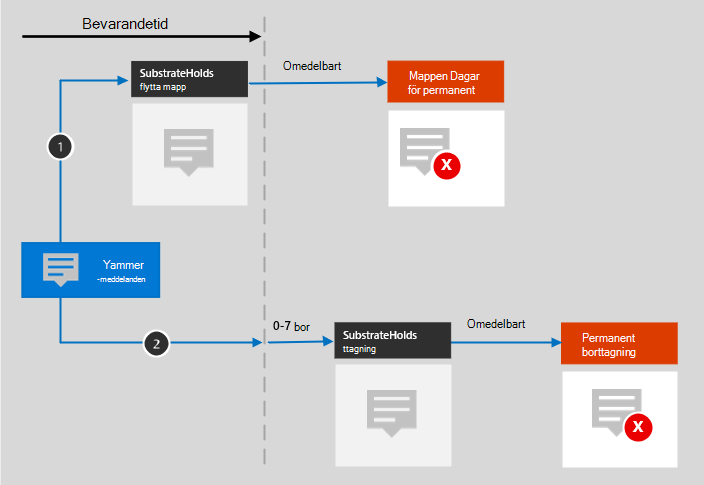

# Mer information om kvarhållning för Yammer

>*[Vägledning för säkerhet och efterlevnad med licensiering i Microsoft 365](/office365/servicedescriptions/microsoft-365-service-descriptions/microsoft-365-tenantlevel-services-licensing-guidance/microsoft-365-security-compliance-licensing-guidance).*

> [!NOTE]
> Den här funktionen är i förhandsversion och kan komma att ändras.

Informationen i den här artikeln kompletterar [Mer information om kvarhållning](retention.md) eftersom den innehåller specifik information för Yammer.

För andra arbetsbelastningar, se:

- [Mer information om kvarhållning för SharePoint och OneDrive](retention-policies-sharepoint.md)
- [Mer information om kvarhållning för Microsoft Teams](retention-policies-teams.md)
- [Lär dig mer om kvarhållning för Exchange](retention-policies-exchange.md)

## Vad ingår för kvarhållning och borttagning

Följande Yammer-objekt kan behållas och tas bort med kvarhållningsprinciper för Yammer: Communitymeddelanden och privata meddelanden.

Reaktioner från andra i form av uttryckssymboler tas inte med i dessa meddelanden.

## Så fungerar kvarhållning för Yammer

Du kan använda en kvarhållningsprincip för att behålla och ta bort communitymeddelanden och privata meddelanden i Yammer. Privata meddelanden lagras i en dold mapp i postlådan för varje användare som ingår i meddelandet och communitymeddelanden lagras i en liknande dold mapp i gruppostlådan för communityn.

Yammer-meddelanden påverkas inte av kvarhållningsprinciper som har konfigurerats för användar- eller gruppostlådor. Även om Yammer-meddelanden lagras i Exchange omfattas dessa Yammer-data endast av en kvarhållningsprincip som är konfigurerad för platserna **Community-meddelanden i Yammer** och **Användarmeddelanden i Yammer**.

> [!NOTE]
> Om en användare ingår i en aktiv kvarhållningsprincip som behåller Yammer-data och du tar bort postlådan för en användare som ingår i den principen, konverteras postlådan till en [inaktiv postlåda](inactive-mailboxes-in-office-365.md) för att Yammer-datan ska behållas. Om du inte behöver behålla Yammer-datan för användaren exkluderar du användarkontot från kvarhållningsprincipen innan du tar bort postlådan.

När en kvarhållningsprincip har konfigurerats för Yammer-meddelanden, utvärderar ett tidsinställt jobb från Exchange-tjänsten regelbundet objekt i den dolda mappen där dessa Yammer-meddelanden lagras. Det tidsinställda jobbet tar upp till sju dagar att köra. När kvarhållningsperioden för objekten har upphört flyttas de till mappen SubstrateHolds. Det är en dold mapp som finns i varje användar- eller gruppostlåda där ej permanent borttagna objekt lagras innan de tas bort permanent.

> [!NOTE]
> På grund av [första principen om kvarhållning](retention.md#the-principles-of-retention-or-what-takes-precedence)inaktiveras permanent borttagning alltid om samma objekt måste behållas på grund av en annan kvarhållningsprincip, eller om det finns eDiscovery som gäller för juridiska skäl eller av juridiska skäl.

När en kvarhållningsprincip har konfigurerats för Yammer-meddelanden beror sökvägarna till innehållet på om kvarhållningsprincipen ska behålla och sedan ta bort, endast behålla eller endast ta bort.

När kvarhållningsprincipen ska behålla och sedan ta bort:

För de två sökvägarna i diagrammet:

1. **Om ett Yammer-meddelande redigeras eller tas bort** av användaren under kvarhållningsperioden, kopieras det ursprungliga meddelandet omedelbart (om det redigeras) eller flyttas (om det tas bort) till mappen SubstrateHolds. Meddelandet lagras där tills kvarhållningsperioden upphör och meddelandet tas bort permanent.

2. **Om ett Yammer-meddelande inte tas bort** och för aktuella meddelanden efter redigering, flyttas meddelandet till mappen SubstrateHolds efter att kvarhållningsperioden har upphört. Den här åtgärden tar upp till sju dagar från utgångsdatumet. När meddelandet finns i mappen SubstrateHolds tas det omedelbart bort permanent. 

> [!NOTE]
> Meddelanden i mappen SubstrateHolds är sökbara med eDiscovery-verktyg. Tills meddelandena tas bort permanent (i mappen SubstrateHolds) förblir de sökbara med eDiscovery-verktyg.

När kvarhållningsprincipen endast ska behålla eller endast ta bort, är innehållssökvägarna varianter av att behålla eller ta bort.

### Innehållssökvägar för kvarhållningsprincip som endast behåller

1. **Om ett Yammer-meddelande redigeras eller tas bort**: En kopia av det ursprungliga meddelandet skapas omedelbart i mappen SubstrateHolds och behålls där tills kvarhållningsperioden upphör. Meddelandet tas sedan bort permanent från mappen SubstrateHolds omedelbart.

2. **Om Yammer-meddelandet inte ändras eller tas bort** och för aktuella meddelanden efter redigering under kvarhållningsperioden: Ingenting händer före och efter kvarhållningsperioden, meddelandet finns kvar på sin ursprungliga plats.

### Innehållssökvägar för kvarhållningsprincip som endast tar bort

1. **Om Yammer-meddelandet inte tas bort** under kvarhållningsperioden: Meddelandet flyttas till mappen SubstrateHolds efter kvarhållningsperioden. Den här åtgärden tar upp till sju dagar från utgångsdatumet. Meddelandet tas sedan bort permanent från mappen SubstrateHolds omedelbart.

2. **Om Yammer-meddelandet tas bort av användaren** under perioden flyttas objektet omedelbart till mappen SubstrateHolds där det tas bort omedelbart och permanent.

## Meddelanden och externa användare

Som standard gäller en kvarhållningsprincip för användarmeddelanden i Yammer alla användare i organisationen, men inte för externa användare. Du kan tillämpa en kvarhållningsprincip på externa användare om du använder **Välj användare** och anger deras konto. 

För närvarande stöds inte Azure B2B-gästanvändare.

## När en användare lämnar organisationen 

Om användare lämnar organisationen och deras Microsoft 365-konto tas bort, lagras deras Yammer-användarmeddelanden som ska behållas i en inaktiv postlåda. Meddelandena finns kvar enligt kvarhållningsprincipen för användaren innan postlådan inaktiverades och innehållet är tillgängligt för eDiscovery-sökningar. Mer information finns i [Inaktiva postlådor i Exchange Online](inactive-mailboxes-in-office-365.md). 

Om användaren har lagrat några filer i Yammer kan du se [motsvarande avsnitt](retention-policies-sharepoint.md#when-a-user-leaves-the-organization) för SharePoint och OneDrive.

## Begränsningar

För närvarande finns det en förhandsversion av Yammers kvarhållningsprinciper och vi arbetar kontinuerligt med att optimera kvarhållningsfunktionen. Under tiden bör du vara medveten om följande begränsning när du använder kvarhållning för Yammers communitymeddelanden och privata meddelanden:

- När du väljer **Välj användare** för platsen **Användarmeddelanden i Yammer** kan du se gäster och användare utan postlåda. Kvarhållningsprinciperna är inte avsedda för de här användarna, så välj dem inte.

## Konfigurationsvägledning

Om du inte är bekant med att konfigurera kvarhållning i Microsoft 365 kan du läsa mer i [Komma igång med kvarhållningsprinciper och kvarhållningsetiketter](get-started-with-retention.md).

Om du är redo att konfigurera en kvarhållningsprincip för Yammer kan du läsa [Skapa och konfigurera kvarhållningsprinciper](create-retention-policies.md).