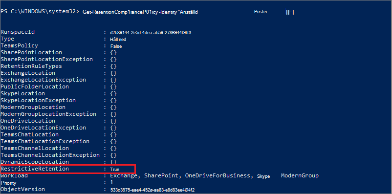

# <a name="use-preservation-lock-to-restrict-changes-to-retention-policies-and-retention-label-policies"></a>Använda bevarandelås för att begränsa ändringar av kvarhållningsprinciper och principer för kvarhållningsetiketter

>*[Vägledning för säkerhet och efterlevnad med licensiering i Microsoft 365](/office365/servicedescriptions/microsoft-365-service-descriptions/microsoft-365-tenantlevel-services-licensing-guidance/microsoft-365-security-compliance-licensing-guidance).*

Med bevarandelås låses en kvarhållningsprincip eller en kvarhållningsetikett så att ingen – inte ens en global administratör – kan stänga av principen, ta bort principen eller göra den mindre restriktiv. Den här konfigurationen kan krävas i regler och kan skydda mot otillåtna administratörer.

När en kvarhållningsprincip är låst:

- Ingen kan inaktivera principen eller ta bort den
- Platser kan läggas till men inte tas bort
- Du kan förlänga kvarhållningsperioden men inte minska den

När en princip för kvarhållningsetiketter är låst:

- Ingen kan inaktivera principen eller ta bort den
- Platser kan läggas till men inte tas bort
- Etiketter kan läggas till men inte tas bort

Sammanfattningsvis kan en låst princip utökas eller förlängas, men den kan inte minskas eller inaktiveras.

> [!IMPORTANT]
> Innan du låser en kvarhållningsprincip eller en princip för kvarhållningsetiketter är det viktigt att du förstår effekten och undersöker om den krävs för din organisation. Den kan till exempel krävas för att uppfylla regelkrav. Administratörer kan inte inaktivera eller ta bort dessa principer när bevarandelåset används.

Konfigurera bevarandelåset när du har skapat en [-kvarhållningsprincip](create-retention-policies.md)eller en princip för kvarhållningsetiketter som du [publicerar](create-apply-retention-labels.md) eller [använder automatiskt](apply-retention-labels-automatically.md). 

> [!NOTE]
> Att låsa en etikettprincip förhindrar inte att en administratör kan minska kvarhållningsperioden för en etikett som ingår i den låsta principen. Det kravet kan med andra begränsningar uppfyllas när du konfigurerar en etikett som markerar objekt som en [regelpost](records-management.md#records).

## <a name="how-to-lock-a-retention-policy-or-retention-label-policy"></a>Låsa en kvarhållningsprincip eller princip för kvarhållningsetiketter

Du måste använda PowerShell om du ska använda bevarandelås. Eftersom administratörer inte kan inaktivera eller ta bort en kvarhållningsprincip när låset används, är funktionen inte tillgänglig i användargränssnittet som skydd mot oavsiktlig konfiguration.

Alla principer för kvarhållning och med valfri konfiguration har stöd för bevarandelås.

1. [Ansluta till Säkerhets- och efterlevnadscenter i PowerShell](/powershell/exchange/connect-to-scc-powershell).

2. Leta reda på namnet på den princip som du vill låsa genom att köra [Get-RetentionCompliancePolicy](/powershell/module/exchange/get-retentioncompliancepolicy). Till exempel:
    
   

3. Om du vill ha ett bevarandelås i principen kör du cmdleten [Set-RetentionCompliancePolicy](/powershell/module/exchange/set-retentioncompliancepolicy) med namnet på principen och parametern *RestrictiveRetention* inställd på sant:
    
    ```powershell
    Set-RetentionCompliancePolicy -Identity "<Name of Policy>" –RestrictiveRetention $true
    ```
    
    Till exempel:
    
    
    
     När du uppmanas till det läser du och godkänner begränsningarna som medföljer konfigurationen genom att ange **J**:
    
   

Ett bevarandelås placeras nu i principen. För att bekräfta kör du `Get-RetentionCompliancePolicy` igen, men anger namnet på principen och visar principparametrarna:

```powershell
Get-RetentionCompliancePolicy -Identity "<Name of Policy>" |Fl
```

Du bör se att **RestrictiveRetention** är inställt på **Sant**. Till exempel:



## <a name="see-also"></a>Se även

[Resurser som hjälper dig att uppfylla regelkrav för informationsstyrning och hantering av arkivhandlingar](retention-regulatory-requirements.md).