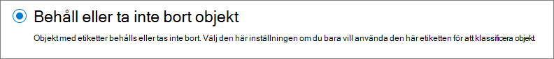
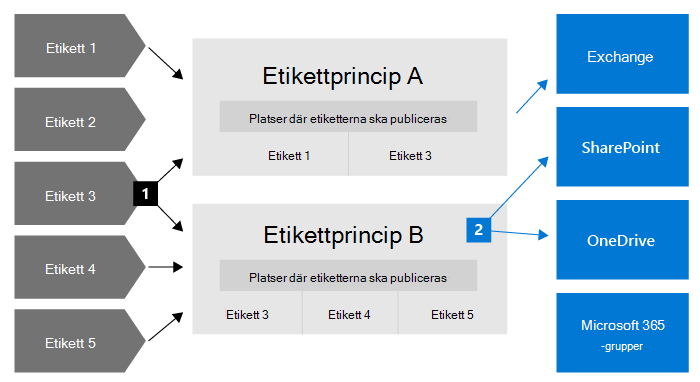
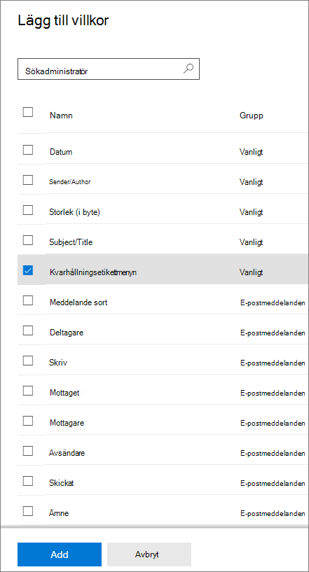
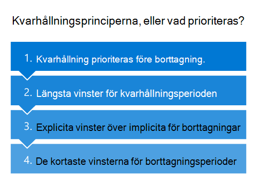

# Mer information om kvarhållningsprinciper och kvarhållningsetiketter

>*[Licensieringsvägledning för Microsoft 365 för säkerhet och efterlevnad](/office365/servicedescriptions/microsoft-365-service-descriptions/microsoft-365-tenantlevel-services-licensing-guidance/microsoft-365-security-compliance-licensing-guidance).*

> [!NOTE]
> Om du ser meddelanden om kvarhållningsprinciper i Teams eller har frågor om kvarhållningsetiketter i dina program kontaktar du IT-avdelningen för information om hur de har konfigurerats åt dig. Under tiden kan följande artiklar vara användbara:
> -  [Teams-meddelanden om kvarhållningsprinciper](https://support.microsoft.com/office/teams-messages-about-retention-policies-c151fa2f-1558-4cf9-8e51-854e925b483b)
> - [Använda kvarhållningsetiketter för filer i SharePoint eller OneDrive](https://support.microsoft.com/office/apply-retention-labels-to-files-in-sharepoint-or-onedrive-11a6835b-ec9f-40db-8aca-6f5ef18132df)
>
> Informationen på den här sidan är till för IT-administratörer som kan skapa kvarhållningsprinciper och kvarhållningsetiketter av efterlevnadsskäl.

För de flesta organisationer ökar volymen och komplexiteten i data varje dag – e-post, dokument, snabbmeddelanden med mera. Effektiv hantering eller styrning av den här informationen är viktig eftersom du behöver:

- **Arbeta proaktivt med branschföreskrifter och interna principer** som kräver att du behåller innehåll under en minimiperiod – Sarbanes-Oxley Act kan till exempel kräva att du behåller vissa typer av innehåll i sju år.

- **Minska din risk i händelse av tvister eller säkerhetsintrång** genom att permanent ta bort gammalt innehåll som du inte längre behöver behålla.

- **Hjälp din organisation att effektivt dela kunskap och vara mer flexibel** genom att se till att användarna bara arbetar med innehåll som är aktuellt och relevant för dem.

De inställningar för kvarhållning du konfigurerar kan hjälpa dig att uppnå dessa mål. Hantering av innehåll som ofta kräver två åtgärder:

| Åtgärd| Syfte |
|:-----|:-----|
|Behålla innehåll | Förhindra permanent borttagning och förblir tillgänglig för eDiscovery |
|Ta bort innehåll | Ta bort innehåll permanent från organisationen|

Med de här två kvarhållningsåtgärderna kan du konfigurera inställningar för kvarhållning för följande resultat:

- Endast kvarhållning: Behåll innehåll permanent eller under en angiven tidsperiod.
- Endast borttagning: Ta bort innehåll permanent efter en viss tidsperiod.
- Behåll och ta sedan bort: Behåll innehåll under en viss tidsperiod och ta sedan bort det permanent.

De här inställningarna för kvarhållning fungerar med innehåll som innebär extra kostnader för att skapa och konfigurera ytterligare lagringsutrymme när du behöver behålla innehåll av efterlevnadsskäl. Dessutom behöver du inte implementera anpassade processer för att kopiera och synkronisera dessa data.

I följande avsnitt får du lära dig mer om hur kvarhållningsprinciper och kvarhållningsetiketter fungerar, när de ska användas och hur de kompletterar varandra. Men om du är redo att komma igång och distribuera inställningar för kvarhållning för några vanliga scenarier kan du gå till [Komma igång med kvarhållningsprinciper och -etiketter](get-started-with-retention.md).

## Så här fungerar inställningar för kvarhållning av innehåll

När innehållet har tilldelats inställningar för kvarhållning finns innehållet kvar på sin ursprungliga plats. Andra kan fortsätta att arbeta med sina dokument eller e-postmeddelanden som om ingenting ändrats. Men om de redigerar eller tar bort innehåll som ingår i kvarhållningsprincipen sparas en kopia av innehållet automatiskt.
  
- För SharePoint- och OneDrive-webbplatser: Kopian behålls i biblioteket **för bevarande av dokument**.

- För Exchange-postlådor: Kopian behålls i mappen **Återställningsbara objekt**. 

- För Teams- och Yammer-meddelanden: Kopian behålls i en dold mapp med namnet **SubstrateHolds** som en undermapp i Exchange-mappen **Återställningsbara objekt**.

> [!NOTE]
> Biblioteket för bevarande av dokument använder lagringsutrymme som inte är undantaget från webbplatsens lagringskvot. Du kan behöva öka lagringsutrymmet när du använder inställningarna för kvarhållning för SharePoint- och Microsoft 365-grupper.
> 
De här säkra platserna och det innehåll som behålls är inte synligt för de flesta. I de flesta fall behöver man inte ens veta att innehållet ligger i inställningarna för kvarhållning.

Mer information om hur inställningar för kvarhållning fungerar för olika arbetsbelastningar finns i följande artiklar:

- [Mer information om kvarhållning för SharePoint och OneDrive](retention-policies-sharepoint.md)
- [Mer information om kvarhållning för Microsoft Teams](retention-policies-teams.md)
- [Mer information om kvarhållning för Yammer](retention-policies-yammer.md)
- [Lär dig mer om kvarhållning för Exchange](retention-policies-exchange.md)

## Kvarhållningsprinciper och -etiketter

Tilldela inställningar för kvarhållning till innehåll genom att använda **kvarhållningsprinciper** och **kvarhållningsetiketter med etikettprinciper**. Du kan bara använda en av dessa metoder eller kombinera dem.

Använd en kvarhållningsprincip för att tilldela samma kvarhållningsinställningar för innehåll på webbplats- eller postlådenivå och använd en kvarhållningsetikett för att tilldela kvarhållningsinställningar på objektnivå (mapp, dokument, e-post).

Om alla dokument på en SharePoint-webbplats till exempel ska behållas i fem år är det mer effektivt att göra det med en kvarhållningsprincip än att använda samma kvarhållningsetikett på alla dokument på webbplatsen. Men om vissa dokument på webbplatsen ska behållas i fem år och andra ska behållas i tio år kan en kvarhållningsprincip inte lösa det. Använd kvarhållningsetiketter när du behöver ange inställningar för kvarhållning på objektnivå. 

Till skillnad från kvarhållningsprinciper flyttas inställningar från kvarhållningsetiketter med innehållet om det flyttas till en annan plats i Microsoft 365-klientorganisationen. Kvarhållningsetiketter har dessutom följande funktioner som kvarhållningsprinciper inte stöder: 
 
- Alternativ för att starta kvarhållningsperioden från när innehållet märks eller baserat på en händelse, beroende på innehållets ålder eller när det senast ändrades.

- Använd [träningsbara klassificerare](classifier-learn-about.md) för att identifiera innehåll som ska märkas.

- Tillämpa en standardetikett för SharePoint-dokument.

- Stöd [borttagningsgranskning](./disposition.md) för att granska innehållet innan det tas bort permanent.

- Markera innehållet som en [post](records-management.md#records) som en del av etikettinställningarna och ha alltid [bevis på borttagningen](disposition.md#disposition-of-records) när innehåll tas bort i slutet av kvarhållningsperioden.

### Kvarhållningsprinciper

Kvarhållningsprinciper kan tillämpas på följande platser:
- Exchange-e-post
- SharePoint-webbplats
- OneDrive-konton
- Microsoft 365-grupper
- Skype för företag
- Gemensamma Exchange-mappar
- Teams-kanalmeddelanden
- Teams-chattar
- Community-meddelanden i Yammer
- Användarmeddelanden i Yammer

Du kan använda en enda princip på flera platser på ett mycket effektivt sätt, eller på specifika platser eller användare.

I början av kvarhållningsperioden kan du välja när innehållet skapades eller när det senast ändrades, men det senare stöds bara för filer och platser på SharePoint, OneDrive och Microsoft 365-grupper.

Objekt ärver inställningarna för kvarhållning från sina behållare som anges i kvarhållningsprincipen. Om de sedan flyttas utanför behållaren när principen har konfigurerats för att behålla innehåll behålls en kopia av objektet på arbetsbelastningens skyddade plats. Kvarhållningsinställningarna gäller dock inte för innehållet på den nya platsen. Använd kvarhållningsetiketter istället för kvarhållningsprinciper som så krävs.

### Kvarhållningsetiketter

Använd kvarhållningsetiketter för olika typer av innehåll som kräver olika inställningar för kvarhållning. Till exempel:
  
- Momsformulär som ska behållas under en minimiperiod. 
    
- Pressmaterial som ska tas bort permanent när de når en viss ålder. 
    
- Konkurrenskraftig forskning som måste behållas under en viss period och sedan tas bort permanent. 
    
- Arbetsvisum som måste markeras som en post så att de inte kan redigeras eller tas bort. 
    
I samtliga fall kan du använda kvarhållningsetiketter för kvarhållningsinställningar för styrningskontroll på objektnivå (dokument eller e-post).
  
Med kvarhållningsetiketter kan du:
  
- **Gör det möjligt för personer i organisationen att använda en kvarhållningsetikett manuellt** för innehåll i Outlook och Outlook på webben, OneDrive, SharePoint och Microsoft 365-grupper. Användare vet ofta bäst vilken typ av innehåll de arbetar med, så att de kan klassificera det och använda rätt inställningar för kvarhållning. 
    
- **Tillämpa kvarhållningsetiketter på innehåll automatiskt** om det uppfyller specifika villkor, till exempel när det innehåller: 
    - Specifika typer av känslig information.
    - Specifika nyckelord som matchar en fråga som du skapar.
    - Mönstermatchning för en träningsbar klassificerare.

- **Starta kvarhållningsperioden när innehållet etiketterades med** för dokument på SharePoint-webbplatser och OneDrive-konton, och till e-postobjekt med undantag för kalenderobjekt. Om du använder en kvarhållningsetikett med den här konfigurationen för ett kalenderobjekt börjar kvarhållningsperioden när den skickas.

- **Börja kvarhållningsperioden när en händelse inträffar**, till exempel anställda som lämnar organisationen eller när kontrakt upphör att gälla.

- **Tillämpa en standardkvarhållningsetikett på ett dokumentbibliotek, en mapp eller en dokumentuppsättning i** SharePoint, så att alla dokument som lagras på den platsen ärver standardetiketten för kvarhållning.

Kvarhållningsetiketter har dessutom stöd för [hantering av arkivhandlingar](records-management.md) för e-post och dokument i Microsoft 365-program och -tjänster. Du kan använda en kvarhållningsetikett för att markera objekt som en post. När det här händer och innehållet finns kvar i Microsoft 365 skapar etiketten ytterligare begränsningar på det innehåll som kan behövas av regelmässiga skäl. Mer information finns i [Jämföra begränsningar för vilka åtgärder som tillåts eller blockeras](records-management.md#compare-restrictions-for-what-actions-are-allowed-or-blocked).

Kvarhållningsetiketter, till skillnad från [känslighetsetiketter](sensitivity-labels.md), finns inte kvar om innehållet flyttas utanför Microsoft 365.

Det finns ingen gräns för antalet kvarhållningsetiketter som stöds för en klientorganisation. Det maximala antalet principer som stöds för en klientorganisation är dock 10 000, och det inkluderar de principer som använder etiketterna (principer för kvarhållningsetiketter och principer för automatiskt tillämpning av kvarhållningsprinciper) samt kvarhållningsprinciper.

#### Klassificera innehåll utan att vidta några åtgärder

Även om det huvudsakliga syftet med kvarhållningsetiketter är att behålla eller ta bort innehåll kan du också använda kvarhållningsetiketter utan att aktivera kvarhållning eller vidta andra åtgärder. I det här fallet kan du använda en kvarhållningsetikett som textetikett utan att vidta några åtgärder.
  
Du kan till exempel skapa och använda en kvarhållningsetikett som heter ”Review later” (Granska senare) utan åtgärder, och sedan använda den etiketten för att hitta innehållet senare.
  

#### Använda en kvarhållningsetikett som ett villkor i en DLP-princip

Du kan ange en kvarhållningsetikett som ett villkor i en DLP-princip (dataförlustskydd) för dokument i SharePoint. Konfigurera till exempel en DLP-princip för att förhindra att dokument delas utanför organisationen om de har en viss kvarhållningsetikett.

Mer information finns i [Använda en kvarhållningsetikett som ett villkor i en DLP-princip](data-loss-prevention-policies.md#using-a-retention-label-as-a-condition-in-a-dlp-policy).

#### Kvarhållningsetiketter och principer som tillämpar dem

När du publicerar kvarhållningsetiketter ingår de i en princip för kvarhållning **som gör** att administratörer och användare kan använda dem för innehåll. Som följande diagram visar:

1. En enstaka kvarhållningsetikett kan ingå i flera principer för kvarhållningsetiketter.

2. Principer för kvarhållningsetiketter anger vilka platser som kvarhållningsetiketterna ska publiceras på. Samma plats kan ingå i flera principer för kvarhållningsetiketter.

Du kan också skapa en eller flera **principer för kvarhållningsetiketter som används automatiskt**, som alla har en enstaka kvarhållningsetikett. Med den här principen används en kvarhållningsetikett automatiskt när villkor som du anger i principen uppfylls.

#### Kvarhållningsetiketter och platser

Olika typer av kvarhållningsetiketter kan publiceras på olika platser, beroende på vad kvarhållningsetiketten gör.
  
| Om kvarhållningsetiketten är... | Sedan kan etikettprincipen tillämpas på... |
|:-----|:-----|
|Publicerat till administratörer och slutanvändare    |Exchange, SharePoint, OneDrive, Microsoft 365-grupper    |
|Tillämpas automatiskt baserat på känsliga informationstyper eller träningsbara klassificerare    |Exchange (endast Alla postlådor), SharePoint, OneDrive    |
|Tillämpas automatiskt baserat på en fråga    |Exchange, SharePoint, OneDrive, Microsoft 365-grupper    |
   
I Exchange används de kvarhållningsetiketter som du tillämpar automatiskt endast på meddelanden som nyligen skickats (data under överföring), inte på alla objekt som finns i postlådan (vilande data). Tillämpa kvarhållningsetiketter automatiskt för typer av känslig information och träningsbara klassificerare gäller alla postlådor. Du kan inte välja specifika postlådor.
  
Gemensamma Exchange-mappar, Skype-, Teams- och Yammer-meddelanden har inte stöd för kvarhållningsetiketter. Om du vill behålla och ta bort innehåll från dessa platser kan du använda kvarhållningsprinciper i stället.

#### Endast en kvarhållningsetikett i taget

Ett e-postmeddelande eller ett dokument kan bara använda en kvarhållningsetikett i taget. En kvarhållningsetikett kan användas [manuellt](create-apply-retention-labels.md#manually-apply-retention-labels) av en slutanvändare eller administratör, eller automatiskt med någon av följande metoder:

- [Princip för automatisk tillämpning av etiketter](apply-retention-labels-automatically.md)
- [Modell för dokumenttolkning i Microsoft SharePoint Syntex](../contentunderstanding/apply-a-retention-label-to-a-model.md)
- [Standardetikett för SharePoint](create-apply-retention-labels.md#applying-a-default-retention-label-to-all-content-in-a-sharepoint-library-folder-or-document-set) eller [Outlook](create-apply-retention-labels.md#applying-a-default-retention-label-to-an-outlook-folder)
- [Outlook-regler](create-apply-retention-labels.md#automatically-applying-a-retention-label-to-email-by-using-rules)

För standardkvarhållningsetiketter (de markerar inte objekt som en [arkivhandling eller en regelbaserad arkivhandling](records-management.md#records)):

- Administratörer och slutanvändare kan manuellt ändra eller ta bort en befintlig kvarhållningsetikett som används i innehållet. 

- När en kvarhållningsetikett redan används i innehåll tas inte den befintliga etiketten bort automatiskt eller ersätts av en annan kvarhållningsetikett, med ett möjligt undantag: Den befintliga etiketten används som standardetikett.
    
    Mer information om etikettbeteendet när du använder en standardetikett finns här:
    - Standardetikett för SharePoint: [Etikettens beteende när du använder en standardetikett för SharePoint](create-apply-retention-labels.md#label-behavior-when-you-use-a-default-label-for-sharepoint)
    - Standardetikett för Outlook: [Tillämpa en standardkvarhållningsetikett på en Outlook-mapp](create-apply-retention-labels.md#applying-a-default-retention-label-to-an-outlook-folder)

- Om det finns flera automatiskt använda etikettprinciper som kan använda en kvarhållningsetikett och innehåll uppfyller villkoren för flera principer tillämpas kvarhållningsetiketten på den äldsta automatiska etikettprincipen (efter datum skapad).

När kvarhållningsetiketter markerar objekt som en post eller en regelpost ändras de här etiketterna aldrig automatiskt. Endast administratörer för behållaren kan manuellt ändra eller ta bort kvarhållningsetiketter som markerar objekt som en post, men inte regelposter. Mer information finns i [Jämföra begränsningar för vilka åtgärder som tillåts eller blockeras](records-management.md#compare-restrictions-for-what-actions-are-allowed-or-blocked).

#### Övervaka kvarhållningsetiketter

Från Microsoft 365 Efterlevnadscenter använder du **Dataklassificering** > **Översikt** för att övervaka hur kvarhållningsetiketterna används i klientorganisationen och identifiera var de märkta objekten finns. Mer information, inklusive viktiga krav, finns i [Få koll på dina data – en översikt över dataklassificering](data-classification-overview.md).

Du kan sedan öka detaljinformationen genom att använda [innehållsutforskaren](data-classification-content-explorer.md) och [aktivitetsutforskaren](data-classification-activity-explorer.md).

> [!TIP]
>Du kan använda några av de andra insikterna om dataklassificering, till exempel träningsbara klassificerare och typer av känslig information, som hjälper dig att identifiera innehåll som du kan behöva behålla eller ta bort eller hantera som arkivhandlingar.

I Säkerhets- och efterlevnadscenter för Office 365 finns motsvarande översiktsinformation för kvarhållningsetiketter från **Informationsstyrning** > **Instrumentpanel** och mer detaljerad information från **Informationsstyrning** > **Utforskaren för etikettaktivitet**. Mer information om hur du övervakar kvarhållningsetiketter från det här äldre administrationscentret finns i följande dokumentation:
- [Visa datastyrningsrapporter](view-the-data-governance-reports.md)
- [Komma igång med dataklassificering](data-classification-overview.md).
- [Visa etikettaktivitet för dokument](view-label-activity-for-documents.md)

#### Använda Innehållssökning för att hitta allt innehåll med en viss kvarhållningsetikett

När kvarhållningsetiketter har tillämpats på innehåll, antingen av användare eller automatiskt, kan du använda innehållssökning för att hitta alla objekt som har en särskild kvarhållningsetikett.

När du skapar en innehållssökning väljer du villkoret **Kvarhållningsetikett** och anger sedan hela namnet på kvarhållningsetiketten eller en del av det och använder ett jokertecken. Mer information finns i [Nyckelordsfrågor och sökvillkor för innehållssökning](keyword-queries-and-search-conditions.md).
  

## Jämföra funktioner för kvarhållningsprinciper och kvarhållningsetiketter

I följande tabell kan du avgöra om du ska använda en kvarhållningsprincip eller kvarhållningsetikett baserat på funktioner.

|Funktion|Kvarhållningsprincip |Kvarhållningsetikett|
|:-----|:-----|:-----|:-----|
|Kvarhållningsinställningar som kan behålla och sedan ta bort, behålla eller endast ta bort |Ja |Ja |
|Stöd för arbetsbelastningar:  – Exchange  – SharePoint  – OneDrive  – Microsoft 365-grupper  – Skype för företag  – Teams – Yammer|  Ja   Ja   Ja   Ja   Ja   Ja   Ja |   Ja, förutom gemensamma mappar   Ja   Ja   Ja   Nej   Nej   Nej |
|Kvarhållning tillämpas automatiskt | Ja | Ja |
|Kvarhållning baserat på villkor   – typer av känslig information, KQL-frågor och nyckelord, träningsbara klassificerare| Nej | Ja |
|Kvarhållning används manuellt | Nej | Ja |
|Gränssnittsnärvaro för slutanvändare | Nej | Ja |
|Finns kvar om innehållet flyttas | Nej | Ja, inom din Microsoft 365-klientorganisation |
|Deklarera objekt som en arkivpost| Nej | Ja |
|Starta kvarhållningsperioden när den etiketters eller baserat på en händelse | Nej | Ja |
|Borttagningsgranskning | Nej| Ja |
|Bevis på borttagningen i upp till sju år | Nej |Ja, när du använder borttagningsgranskning eller objekt markeras som en post|
|Granska aktiviteter för administratör| Ja | Ja|
|Granskningsåtgärder för datakvarhållning| Nej | Ja \* |
|Identifiera objekt som ska behållas:   – Innehållssökning   – Dataklassificeringssida, innehållsutforskaren, aktivitetsutforskaren |   Nej   Nej |   Ja   Ja|

**Fotnot:**

\* För etiketter för datakvarhållning som inte markerar innehållet som en post eller regelbaserad post begränsas granskningshändelser till när ett objekt i SharePoint har en etikett tillämpad, ändrad eller borttagen. Granskningsinformation för etiketter för datakvarhållning finns i avsnittet [Granskningsåtgärder för datakvarhållning](#auditing-retention-actions) på den här sidan.

### Kombinera principer och etiketter för datakvarhållning

Du behöver inte välja mellan att bara använda principer eller etiketter för datakvarhållning. Båda metoderna kan användas tillsammans och kompletterar i själva verket varandra för en mer omfattande lösning. Till exempel:

1. Du skapar och konfigurerar en kvarhållningsprincip som automatiskt tar bort innehåll fem år efter att det senast ändrades, och tillämpar principen på alla OneDrive-konton.

2. Du skapar och konfigurerar en kvarhållningsetikett som behåller innehåll permanent och lägger till den i en etikettprincip som du publicerar på alla OneDrive-konton. Du förklarar för användarna hur du manuellt kan använda den här etiketten för specifika dokument som ska undantas från automatisk borttagning om de inte ändras efter fem år.

Mer information om hur kvarhållningsprinciper och kvarhållningsetiketter fungerar tillsammans och hur du fastställer deras kombinerade resultat finns i nästa avsnitt där du får en förklaring av kvarhållningsprinciperna förklaras och vad som prioriteras.

## Kvarhållningsprinciperna, eller vad prioriteras?

Till skillnad från kvarhållningsetiketter kan du använda mer än en kvarhållningsprincip för samma innehåll. Varje kvarhållningsprincip kan resultera i en kvarhållningsåtgärd och att en borttagningsåtgärd. Dessutom kan det objektet påverkas av de här åtgärderna från en kvarhållningsetikett.

Vad prioriteras för att fastställa resultatet när objekt kan ha flera kvarhållningsinställningar som kan komma i konflikt med varandra i det här scenariot?

Resultatet betyder inte vilken enskild kvarhållningsprincip eller enskild kvarhållningsetikett som vinner, utan hur länge ett objekt behålls (om tillämpligt) och när ett objekt tas bort (om tillämpligt). De här två åtgärderna beräknas oberoende av varandra, från alla kvarhållningsinställningar som används för ett objekt.

Ett objekt kan till exempel ha en kvarhållningsprincip som är konfigurerad enbart för en borttagningsåtgärd och en annan kvarhållningsprincip som är konfigurerad för att behålla och sedan ta bort. Det här objektet har därför bara en kvarhållningsåtgärd men två borttagningsåtgärder. Kvarhållnings- och borttagningsåtgärderna kan vara i konflikt med varandra och de två borttagningsåtgärderna kan ha ett datum som står i konflikt. För att få reda på resultatet måste du tillämpa kvarhållningsprinciperna.

På hög nivå kan du vara säker på att kvarhållningen alltid prioriteras framför borttagningen, och att den längsta kvarhållningsperioden vinner. De här två enkla reglerna avgör alltid hur länge ett objekt ska behållas.

Det finns några fler faktorer som avgör när ett objekt kommer att tas bort, vilket omfattar att borttagningsåtgärden från en kvarhållningsetikett alltid har företräde framför borttagningsåtgärden från en kvarhållningsprincip.

I följande flöde kan du se resultatet av kvarhållning och borttagning för ett enskilt objekt, där varje nivå fungerar som tie-breaker för konflikter uppifrån och ned. Om resultatet bestäms av den första nivån på grund av att det inte finns några fler konflikter behöver du inte gå vidare till nästa nivå och så vidare.

> [!IMPORTANT]
> Om du använder kvarhållningsetiketter: Innan du använder det här flödet för att fastställa resultatet av flera kvarhållningsinställningar för samma objekt bör du kontrollera att du vet [vilken kvarhållningsetikett som används](#only-one-retention-label-at-a-time).

  
Förklaring av de fyra nivåerna:
  
1. **Kvarhållning prioriteras före borttagning.** Innehåll tas inte bort permanent när det även har kvarhållningsinställningar för att behålla det.  
    
    Exempel: För ett e-postmeddelande gäller en kvarhållningsprincip för Exchange, som är konfigurerad att ta bort objekt efter tre år, och där det även finns en kvarhållningsetikett som är konfigurerad att behålla objekt i fem år.
    
    E-postmeddelandet behålls i fem år eftersom kvarhållningsåtgärden prioriteras framför borttagning. E-postmeddelandet tas bort i slutet av de fem åren på grund av den uppskjutna borttagningsåtgärden.

2. **Den längsta kvarhållningsperioden vinner.** Om innehållet har flera kvarhållningsinställningar som behåller innehåll under olika tidsperioder behålls innehållet till slutet av den längsta kvarhållningsperioden.
    
    Exempel: Dokument på SharePoints marknadsföringswebbplats har två kvarhållningsprinciper. Den första har konfigurerats för alla SharePoint-webbplatser för att behålla objekt i fem år. Den andra har konfigurerats för specifika SharePoint-webbplatser för att behålla objekt i tio år.
    
    Dokument på den här SharePoint-webbplatsen för marknadsföring behålls i tio år eftersom det är den längsta kvarhållningsperioden.

3. **Explicit vinner över implicit för borttagningar.** När konflikter nu är lösta för kvarhållningen finns endast konflikter för borttagningar kvar: 
    
    1. En kvarhållningsetikett (oavsett hur den tillämpats) tillhandahåller explicit kvarhållning i jämförelse med kvarhållningsprinciper, eftersom kvarhållningsinställningarna används för ett enskilt objekt i stället för att tilldelas implicit från en behållare. Det innebär att en borttagningsåtgärd från en kvarhållningsetikett alltid har företräde framför en borttagningsåtgärd från en kvarhållningsprincip.
        
        Exempel: Ett dokument har två kvarhållningsprinciper som omfattar en borttagningsåtgärd på fem respektive tio år, samt en kvarhållningsetikett som har en borttagningsåtgärd på sju år.
        
        Dokumentet tas bort efter sju år eftersom borrtagningsåtgärden från kvarhållningsetiketten prioriteras.
    
    2. När du endast har kvarhållningsprinciper: Om en kvarhållningsprincip för en plats är begränsad till att använda en inkluderande konfiguration (t.ex. specifika användare för Exchange-e-post) har kvarhållningsprincipen företräde framför obegränsade kvarhållningsprinciper för samma plats.
        
        En obegränsad kvarhållningsprincip är där en plats väljs utan att ange specifika instanser. Till exempel är **e-post i Exchange** standardinställningen för **alla mottagare är** en obegränsad kvarhållningsprincip. Eller **SharePoint-webbplatser** och standardinställningen för **alla webbplatser**. När kvarhållningsprinciper är begränsade har de samma prioritet på den här nivån.
        
        Exempel 1: Ett e-postmeddelande har två kvarhållningsprinciper. Den första kvarhållningsprincipen är obegränsad och objekt tas bort efter tio år. Den andra kvarhållningsprincipen är begränsad till specifika postlådor och tar bort objekt efter fem år.
        
        E-postmeddelandet tas bort efter fem år eftersom borttagningsåtgärden från den begränsade kvarhållningsprincipen har företräde framför den obegränsade kvarhållningsprincipen.
        
        Exempel 2: Ett dokument i en användares OneDrive-konto lyder under två kvarhållningsprinciper. Den första kvarhållningsprincipen omfattar användarens OneDrive-konto och har en borttagningsåtgärd efter 10 år. Den andra kvarhållningsprincipen omfattar användarens OneDrive-konto och har en borttagningsåtgärd efter sju år.
        
        När dokumentet tas bort går inte att fastställa på den här nivån eftersom båda kvarhållningsprinciperna är begränsade.

4. **Den kortaste borttagningsperioden vinner.** Tillämplig för att avgöra när objekt kommer att tas bort från kvarhållningsprinciper och resultatet inte kunde lösas från den föregående nivån: Innehåll tas bort i slutet av den kortaste kvarhållningsperioden.
    
    Exempel: Ett dokument i en användares OneDrive-konto lyder under två kvarhållningsprinciper. Den första kvarhållningsprincipen omfattar användarens OneDrive-konto och har en borttagningsåtgärd efter 10 år. Den andra kvarhållningsprincipen omfattar användarens OneDrive-konto och har en borttagningsåtgärd efter sju år.
    
    Det här dokumentet tas bort efter sju år eftersom det är den kortaste kvarhållningsperioden för dessa två begränsade kvarhållningsprinciper.

Observera att även objekt som omfattas av eDiscovery-undantag även omfattas av den första kvarhållningsprincipen. De kan inte tas bort med någon kvarhållningsprincip eller kvarhållningsetikett. När undantaget släpps fortsätter kvarhållningsprinciperna att gälla för dem. De kan till exempel lyda under en kvarhållningsperiod som inte har löpt ut eller en uppskjuten borttagningsåtgärd.

Mer komplexa exempel som kombinerar åtgärder för kvarhållning och borttagning:

1. Ett objekt har följande kvarhållningsinställningar:
    
    - En kvarhållningsprincip för endast borttagning efter fem år
    - En kvarhållningsprincip som bevaras i tre år och sedan tas bort
    - En kvarhållningsetikett som endast behålls i sju år
    
    **Resultat**: Objektet behålls i sju år eftersom kvarhållningen prioriteras framför borttagningen och sju år är den längsta kvarhållningsperioden. I slutet av kvarhållningsperioden tas objektet bort på grund av borttagningsåtgärden från kvarhållningsprinciperna som sköts upp när objektet bevarades.
    
    Även om de två kvarhållningsprinciperna har olika datum för borttagningsåtgärderna kan objektet tidigast tas bort i slutet av den längsta kvarhållningsperioden, som är längre än båda borttagningsdatumen. I det här exemplet finns det ingen konflikt att lösa för borttagningsdatumen så alla konflikter löses av den andra nivån.

2.  Ett objekt har följande kvarhållningsinställningar:
    
    - En obegränsad kvarhållningsprincip som endast tas bort efter tio år
    - En omfattad kvarhållningsprincip som bevaras i fem år och sedan tas bort
    - En kvarhållningsetikett som bevaras i tre år och sedan tas bort
    
    **Resultat**: Objektet behålls i fem år eftersom det är den längsta kvarhållningsperioden. I slutet av kvarhållningsperioden tas objektet bort på grund av borttagningsåtgärden på tre år från kvarhållningsetiketten som sköts upp när objektet bevarades. Borttagning från kvarhållningsetiketter har företräde framför borttagning från alla kvarhållningsprinciper. I det här exemplet löses alla konflikter av den tredje nivån.

## Använda Bevarandelås för att begränsa ändringar av principer

Vissa organisationer kan behöva följa regler som definierats av regelverk som SEC-regeln (Securities and Exchange Commission) 17a-4, som kräver att en kvarhållningsprincip inte kan inaktiveras eller göras mindre restriktiv när den har inaktiverats. 

Med bevarandelås kan organisationen uppfylla sådana efterlevnadskrav eftersom det låser en kvarhållningsprincip eller en kvarhållningsetikett så att ingen – inte ens en administratör – kan stänga av principen, ta bort principen eller göra den mindre restriktiv.
  
Du använder Bevarandelås när kvarhållningsprincipen eller kvarhållningsetikettens princip har skapats. Mer information och instruktioner finns i [Använda bevarandelås för att begränsa ändringar av kvarhållningsprinciper och principer för kvarhållningsetiketter](retention-preservation-lock.md).

## Släppa en kvarhållningsprincip

När du tillhandahåller kvarhållningsprinciper som inte har något bevarandelås kan du ta bort principerna när som helst, vilket effektivt inaktiverar inställningarna för kvarhållning som använts tidigare. Du kan också behålla principen, men ta bort en webbplats för SharePoint eller ett konto för OneDrive, eller ändra platsstatus till av eller inaktivera principen.
 
När du vidtar någon av dessa åtgärder kommer allt SharePoint- eller OneDrive-innehåll som är lagrat från principen att behållas i 30 dagar för att förhindra oavsiktlig dataförlust. Under den här respitperioden på 30 dagar sparas borttagna filer fortfarande (filer läggs fortfarande till i biblioteket för bevarande av dokument), men det tidsinställda jobbet som regelbundet rensar biblioteket för bevarande av dokument är inaktiverat för dessa filer så att du kan återställa dem om det behövs.

Mer information om biblioteket för bevarande av dokument finns i [Hur bevarande fungerar för SharePoint och OneDrive](retention-policies-sharepoint.md#how-retention-works-for-sharepoint-and-onedrive).

På grund av beteendet under respitperioden kan principen återupptas utan att någon permanent dataförlust sker under tiden om du återaktiverar principen eller ändrar dess platsstatus inom 30 dagar.

## Granskning av konfiguration och åtgärder för datakvarhållning

När [granskning är aktiverat](turn-audit-log-search-on-or-off.md)stöds granskningshändelser för kvarhållning för både administrationskonfiguration (principer och etiketter för datakvarhållning) och åtgärder för datakvarhållning (endast etiketter för datakvarhållning).

### Granskning av konfiguration för datakvarhållning

Administratörskonfiguration av principer och etiketter för datakvarhållning loggas som granskningshändelser när en kvarhållningsprincip eller -etikett skapas, konfigureras om eller tas bort.

En fullständig lista över granskningshändelser finns i [aktiviteter för princip och etikett för datakvarhållning](search-the-audit-log-in-security-and-compliance.md#retention-policy-and-retention-label-activities).

### Granskning av åtgärder för kvarhållning

Åtgärder för datakvarhållning loggas som granskningshändelser är endast tillgängliga för etiketter för datakvarhållning och inte för principer för datakvarhållning:

- När en etikett för datakvarhållning används, ändras eller tas bort från ett objekt i SharePoint:
    - Välj **Ändrad kvarhållningsetikett för en fil** från **Fil- och sidaktiviteter**. 

- När ett etiketterat objekt i SharePoint markeras som en post och det låses upp eller låses av en användare:
    - Välj **Ändrade poststatus till låst** och **Ändrade poststatus till olåst** från **Fil- och sidaktiviteter**.

- När en etikett för datakvarhållning som markerar innehåll som en post eller regelpost tillämpas på ett objekt i Exchange:
    - Välj **Etiketterat meddelande som en post** från **Exchange postlådeaktiviteter**.

- När ett etiketterat objekt i SharePoint eller Exchange är markerat som en post eller regelpost och det tas bort permanent:
    - Välj **Borttagen fil markerad som en post** från **Fil- och sidaktiviteter**

## PowerShell-cmdletar för kvarhållningsprinciper och kvarhållningsetiketter

Om du vill använda cmdletar för kvarhållning måste du [ansluta till Office 365 Säkerhets- och efterlevnadscenter PowerShell](/powershell/exchange/connect-to-scc-powershell). Använd sedan någon av följande cmdletar:

- [Get-ComplianceTag](/powershell/module/exchange/get-compliancetag)

- [New-ComplianceTag](/powershell/module/exchange/new-compliancetag)

- [Remove-ComplianceTag](/powershell/module/exchange/remove-compliancetag)

- [Set-ComplianceTag](/powershell/module/exchange/set-compliancetag)

- [Enable-ComplianceTagStorage](/powershell/module/exchange/enable-compliancetagstorage)

- [Get-ComplianceTagStorage](/powershell/module/exchange/get-compliancetagstorage)

- [Get-RecordReviewNotificationTemplateConfig](/powershell/module/exchange/get-recordreviewnotificationtemplateconfig)

- [Get-RetentionCompliancePolicy](/powershell/module/exchange/get-retentioncompliancepolicy)

- [New-RetentionCompliancePolicy](/powershell/module/exchange/new-retentioncompliancepolicy)

- [Remove-RetentionCompliancePolicy](/powershell/module/exchange/remove-retentioncompliancepolicy)

- [Set-RecordReviewNotificationTemplateConfig](/powershell/module/exchange/set-recordreviewnotificationtemplateconfig )

- [Set-RetentionCompliancePolicy](/powershell/module/exchange/set-retentioncompliancepolicy)

- [Get-RetentionComplianceRule](/powershell/module/exchange/get-retentioncompliancerule)

- [New-RetentionComplianceRule](/powershell/module/exchange/new-retentioncompliancerule)

- [Remove-RetentionComplianceRule](/powershell/module/exchange/remove-retentioncompliancerule)

- [Set-RetentionComplianceRule](/powershell/module/exchange/set-retentioncompliancerule)

## När kvarhållningsprinciper och kvarhållningsetiketter eller eDiscovery-undantag ska användas

Även om inställningar för kvarhållning och [undantag som du har skapat med ett eDiscovery-fall](create-ediscovery-holds.md) både kan förhindra att data tas bort permanent, är de utformade för olika scenarier. Använd följande vägledning för att förstå skillnaderna och bestämma vad du ska använda:

- Kvarhållningsinställningar som du anger i kvarhållningsprinciper och kvarhållningsetiketter är utformade för en långsiktig informationsstyrningsstrategi för att behålla eller ta bort data för efterlevnadskrav. Omfattningen är vanligtvis bred och fokus är plats och innehåll i stället för enskilda användare. Det går att konfigurera början och slutet av kvarhållningsperioden med alternativet för att automatiskt ta bort innehåll utan ytterligare administratörsåtgärd.

- Undantag för eDiscovery (antingen Core eDiscovery- eller Advanced eDiscovery-fall) har utformats med begränsad varaktighet för att bevara data för juridisk undersökning. Omfattningen är specifik med fokus på innehåll som ägs av identifierade användare. Början och slutet av kvarhållningsperioden kan inte konfigureras, men är beroende av enskilda administratörsåtgärder, utan något alternativ för att automatiskt ta bort innehåll när undantaget släpps.

Sammanfattning som jämför kvarhållning med undantag:

|Att tänka på|Kvarhållning |eDiscovery-undantag|
|:-----|:-----|:-----|:-----|
|Affärsbehov: |Efterlevnad |Villkor |
|Tidsomfång: |Långsiktig |Kortsiktig |
|Fokus: |Bred, innehållsbaserad |Specifika, användarbaserade |
|Konfigurerbart start- och slutdatum: |Ja |Nej |
|Innehållsborttagning: |Ja (valfritt) |Nej |
|Administrativa kostnader: |Låg |Hög |

Om innehållet gäller både kvarhållningsinställningar och ett eDiscovery-undantag prioriteras alltid kvarhållning av innehåll för eDiscovery-undantaget. På så sätt utökas [kvarhållningsprinciperna](#the-principles-of-retention-or-what-takes-precedence) till eDiscovery-undantaget, eftersom de bevarar data tills en administratör manuellt upphäver undantaget. Trots denna prioritet ska du dock inte använda eDiscovery-undantag för långsiktig informationsstyrning. Om du är orolig för automatisk borttagning av data kan du konfigurera inställningar för kvarhållning för att behålla objekt permanent, eller använda [borttagningsgranskning](disposition.md#disposition-reviews) med kvarhållningsetiketter.

Om du använder äldre eDiscovery-verktyg för att bevara data kan du se följande resurser:

- Exchange: 
    - [Lokalt bevarande och bevarande av juridiska skäl](/exchange/security-and-compliance/in-place-and-litigation-holds)
    - [Identifiera typen av undantag som tillämpas på en Exchange Online-postlåda](./identify-a-hold-on-an-exchange-online-mailbox.md)

- SharePoint och OneDrive: 
    - [Lägga till innehåll till ett ärende och undanta källor i eDiscovery Center](/SharePoint/governance/add-content-to-a-case-and-place-sources-on-hold-in-the-ediscovery-center)

- [Utfasning av äldre eDiscovery-verktyg](legacy-ediscovery-retirement.md)

## Använda kvarhållningsprinciper och kvarhållningsetiketter istället för äldre funktioner

Om du proaktivt behöver behålla eller ta bort innehåll i Microsoft 365 för informationsstyrning rekommenderar vi att du använder kvarhållningsprinciper och kvarhållningsetiketter i stället för följande äldre funktioner.

Om du använder de här äldre funktionerna kommer de att fortsätta fungera sida vid sida med kvarhållningsprinciper och kvarhållningsetiketter. Vi rekommenderar dock att du i stället använder kvarhållningsprinciper och kvarhållningsetiketter. De ger dig en enda mekanism för att hantera både kvarhållning och borttagning av innehåll i Microsoft 365 centralt.

**Äldre funktioner från Exchange Online:**

- [Kvarhållningsetiketter och kvarhållningsprinciper, ](/exchange/security-and-compliance/messaging-records-management/retention-tags-and-policies), även kallat [messaging records management (MRM)](/exchange/security-and-compliance/messaging-records-management/messaging-records-management) (endast kvarhållning)

**Äldre funktioner från SharePoint och OneDrive:**

- [Dokumentborttagningsprinciper](https://support.office.com/article/Create-a-document-deletion-policy-in-SharePoint-Server-2016-4fe26e19-4849-4eb9-a044-840ab47458ff) (endast borttagning)
    
- [Konfigurera hantering av arkivhandlingar på plats](https://support.office.com/article/7707a878-780c-4be6-9cb0-9718ecde050a) (endast kvarhållning) 
    
- [Använda principer för att stänga och ta bort webbplatsen](https://support.microsoft.com/sv-SE/office/use-policies-for-site-closure-and-deletion-a8280d82-27fd-48c5-9adf-8a5431208ba5) (endast borttagning)
    
- [Principer för informationshantering](intro-to-info-mgmt-policies.md) (endast borttagning)
     
Om du har konfigurerat SharePoint-webbplatser för innehållstypprinciper eller informationshanteringsprinciper för att behålla innehåll för en lista eller ett bibliotek ignoreras dessa principer när en kvarhållningsprincip gäller. 

## Relaterad information

- [Begränsningar för SharePoint Online](/office365/servicedescriptions/sharepoint-online-service-description/sharepoint-online-limits)
- [Begränsningar och specifikationer för Microsoft Teams](/microsoftteams/limits-specifications-teams) 
- [Resurser som hjälper dig att uppfylla regelkrav för informationsstyrning och hantering av arkivhandlingar](retention-regulatory-requirements.md).

## Konfigurationsvägledning

Gå till [Komma igång med kvarhållningsprinciper och kvarhållningsetiketter](get-started-with-retention.md). Den här artikeln innehåller information om prenumerationer, behörigheter och länkar till konfigurationsvägledningen för scenarier med kvarhållning för slutpunkt till slutpunkt.