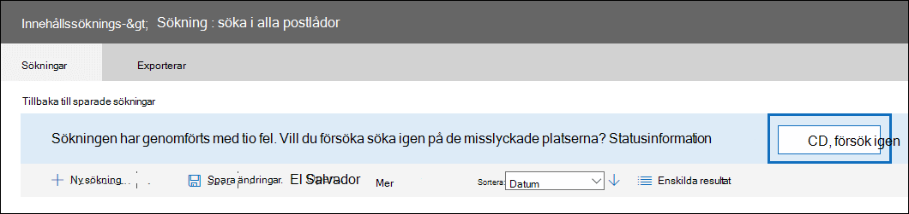

# <a name="retry-a-content-search-to-resolve-a-content-location-error"></a>Försök att försöka med en innehållssökning igen för att lösa ett innehållsplatsfel

När du använder Innehållssökning i säkerhets- och efterlevnadscentret för att söka i ett stort antal postlådor kan du få sökfel som liknar felet:

```text
Error


The search on the following locations failed:

User1@contoso.com: Problem in processing the request. Please try again later. If you keep getting this error, contact your admin. (CS008-009)

User2@contoso.com: Application error occurred. Please try again later. (CS012-002)
```

De här felen (med felkoder för CS001-002, CS003-002, CS008-009, CS012-002 och andra fel i formuläret CS0XX-0XX) anger att innehållssökning inte kunde söka efter specifika innehållsplatser. I det här exemplet genomsökdes inte två postlådor. De här felen visas på den utfällande sidan med statusinformation i Innehållssökning.

## <a name="cause-of-content-location-errors"></a>Orsak till platsfel

Vid sökning efter ett stort antal postlådor fördelas sökningen över tusentals servrar i ett Microsoft-datacenter. Vid en tidpunkt kan vissa servrar vara i omstartstillstånd eller under processen för redundens till redundanta kopior. I båda fallen tar innehållssökningens begäran att hämta data time out. I exemplet ovan visades felen för postlådorna som misslyckades på grund av tidsinställningen för sökningen.

## <a name="resolving-content-location-errors"></a>Lösa fel i innehållsplatser

Om du startar om sökningen resulterar det ofta i liknande fel på olika servrar. I stället för att starta om sökningen klickar **du på** knappen Försök igen som visas högst upp på sidan med sökresultat.



Resultatet blir att sökningen endast för postlådorna som misslyckades kommer att misslyckas. När du försöker söka igen behålls de andra resultat som returnerats.

## <a name="tips-to-avoid-content-location-errors"></a>Tips för att undvika fel vid innehållsplats

Här är ytterligare orsaker till fel på innehållsplatsen och några tips som hjälper dig att undvika dem när du söker i stora antal postlådor.

- Postlådan som genomsöks kan vara upptagen på grund av användaraktivitet. I det här fallet kan söktjänsten begränsa sig själv för att förhindra att postlådan blir otillgänglig. Försök att undvika detta genom att köra sökningar under icke-arbetstid.

- Sökfrågan kan hämta för mycket innehåll från postlådan. Om möjligt kan du försöka begränsa sökningens omfattning med hjälp av nyckelord, datumintervall och sökvillkor.

- För många nyckelord eller nyckelordsfraser när du skapar en sökfråga med hjälp av [nyckelordslistan](view-keyword-statistics-for-content-search.md#get-keyword-statistics-for-content-searches). När du kör en sökfråga som använder listan nyckelord kör tjänsten i princip en separat sökning för varje rad i nyckelordslistan så att statistik kan skapas. Om du använder nyckelordslistan i sökfrågor minimerar du antalet rader i nyckelordslistan eller delar upp antalet nyckelord i mindre listor och skapar olika sökningar för varje nyckelordslista.

  > [!NOTE]
  > För att minska problemen som orsakas av stora nyckelordslistor är du nu begränsad till högst 20 rader i nyckelordslistan för en sökfråga.

- För många sökningar utförs på samma postlåda samtidigt. Försök om möjligt att köra en sökning i taget på en postlåda.

- Söka i för många postlådor i en enda sökning. Sannolikheten för fel vid innehållsplats ökar vid sökning av ett stort antal postlådor. Försök om möjligt att köra flera sökningar så att varje sökning inkluderar en delmängd postlådor i organisationen.

- Obligatoriskt underhåll utförs för postlådan. Även om det här orsakar antagligen oregelvänt, vänta en stund efter att innehållsplatsen har mottagits och försök sedan igen.
