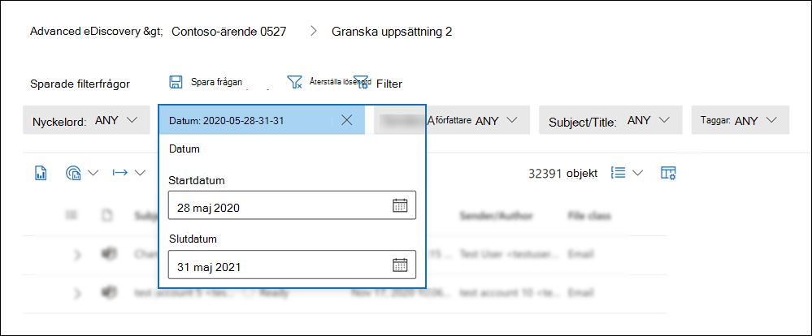
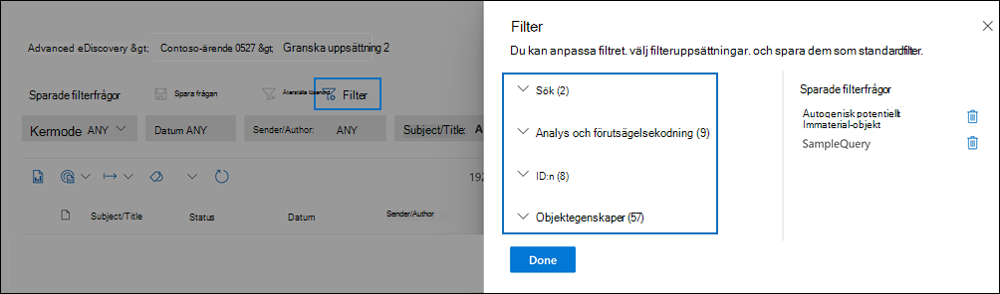
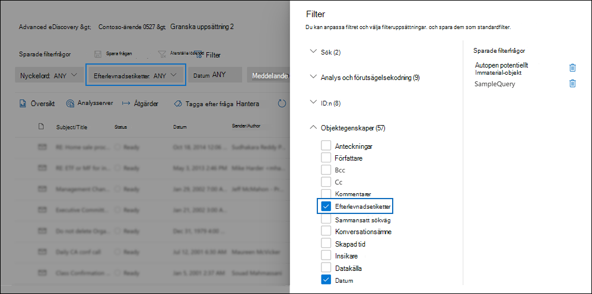
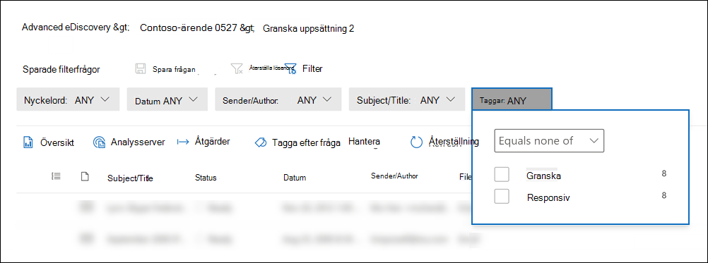
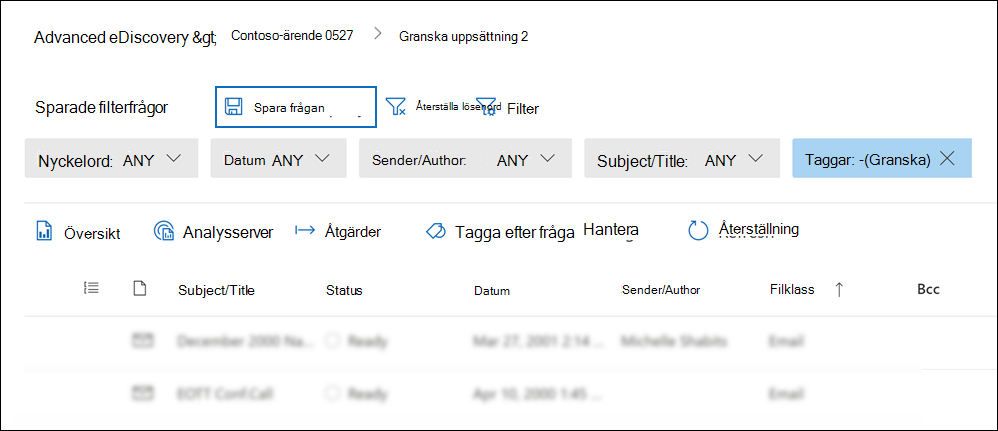
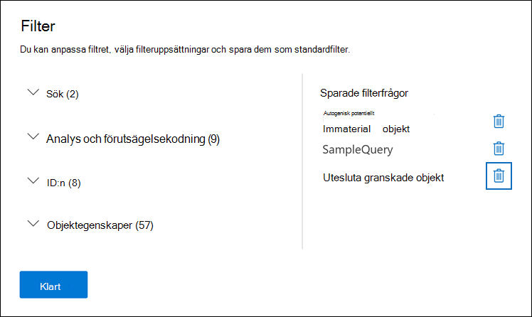
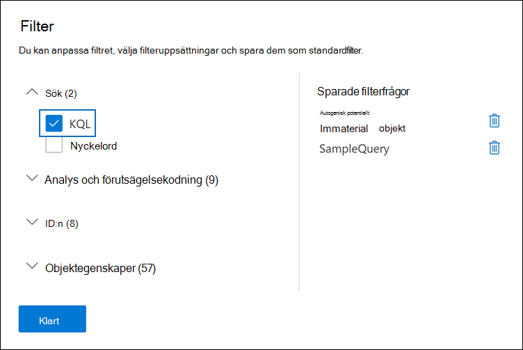
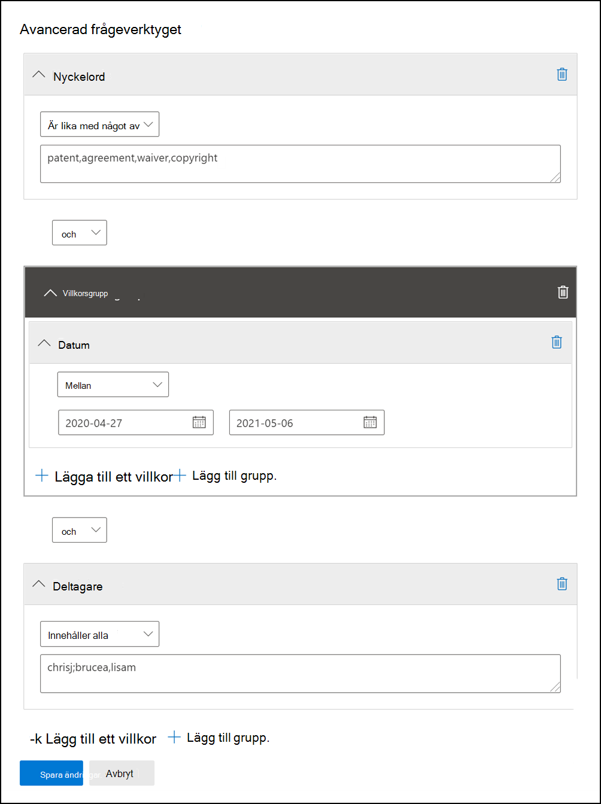

# Fråga och filtrera innehåll i en granskningsuppsättningQuery and filter content in a review set

I de flesta fall kan det vara bra att gå djupare in på innehållet i en granskningsuppsättning och ordna den för att underlätta en effektivare granskning.In most cases, it will be useful to dig deeper into the content in a review set and organize it to facilitate a more efficient review. Om du använder filter och frågor i en granskningsuppsättning kan du fokusera på en delmängd dokument som uppfyller villkoren för din granskning.Using filters and queries in a review set helps you focus on a subset of documents that meet the criteria of your review.

## StandardfilterDefault filters

I en granskningsuppsättning finns det fem standardfilter som är förinstallerade i granskningsuppsättningen:In a review set, there are five default filters that are pre-loaded in the review set:

- NyckelordKeywords
- DatumDate
- Avsändare/författareSender/Author
- Ämne/rubrikSubject/Title
- TaggarTags

Klicka på varje filter för att expandera det och tilldela ett värde.Click each filter to expand it and assign a value. Klicka utanför filtret så tillämpas filtret automatiskt på granskningsuppsättningen.Click outside the filter to automatically apply the filter to the review set. Följande skärmbild visar det datumfilter som har konfigurerats för att visa dokument inom ett datumintervall.The following screenshot shows the Date filter configured to show documents within a date range.

## Lägga till eller ta bort filterAdd or remove filters

Om du vill lägga till eller ta  bort filter som visas för granskningsuppsättningen väljer du Filter för att öppna filterpanelen, som visas på en utfällbladssida.To add or remove filters that are displayed for the review set, select **Filters** to open the filter panel, which is displayed on a flyout page. 

De tillgängliga filtren är ordnade i fyra avsnitt:The available filters are organized in four sections:

- **Sök:** Filter som ger olika sökfunktioner.**Search**: Filters that provide different search capabilities.

- **Analys &** förutsägelsekodning: Filter för egenskaper som genereras och läggs till i dokument när du kör dokumentet & e-postanalysjobb eller använder prediktiv kodningsmodeller. **Analytics & predictive coding**: Filters for properties generated and added to documents when you run the **Document & email analytic** job or use predictive coding models.

- **ID:n:** Filter för alla ID-egenskaper för dokument.**IDs**: Filters for all ID properties of documents.

- **Objektegenskaper:** Filter för dokumentegenskaper.**Item properties**: Filters for document properties. 

Expandera varje avsnitt och markera eller avmarkera filter för att lägga till eller ta bort dem i filteruppsättningen.Expand each section and select or deselect filters to add or remove them in the filter set. När du lägger till ett filter visas det i filteruppsättningen.When you add a filter, it's displayed in the filter set. 

> [!NOTE]
> När du expanderar ett avsnitt i filterpanelen märker du att standardfiltertyperna är markerade.When you expand a section in the filter panel, you'll notice that the default filter types are selected. Du kan behålla dessa markerade eller avmarkera dem och ta bort dem från filteruppsättningen.You can keep these selected or deselect them and removed them from the filter set. 

## FiltertyperFilter types

Alla sökbara fält i en granskningsuppsättning har ett motsvarande filter som du kan använda för att filtrera objekt baserat på ett visst fält.Every searchable field in a review set has a corresponding filter that you can use for filter items based on a specific field.

Det finns flera typer av filter:There are multiple types of filters:

- **Fritext**: Ett fritextfilter används på textfält som exempelvis "Ämne".**Freetext**: A freetext filter is applied to text fields such as "Subject". Du kan lista flera sökord genom att avgränsa dem med kommatecken.You can list multiple search terms by separating them with a comma.

- **Datum:** Ett datumfilter används för datumfält som "Senast ändrad, datum".**Date**: A date filter is used for date fields such as "Last modified date".

- **Sökalternativ:** Ett sökalternativfilter ger en lista med möjliga värden (varje värde visas med en kryssruta som du kan välja) för vissa fält i granskningen.**Search options**: A search options filter provides a list of possible values (each value is displayed with a checkbox that you can select) for particular fields in the review. Filtret används för fält, till exempel "Avsändare", där det finns ett ändlig antal möjliga värden i granskningsuppsättningen.This filter is used for fields, such as "Sender", where there is a finite number of possible values in the review set.

- **Nyckelord:** Ett nyckelordsvillkor är en specifik instans av fritextvillkor som du kan använda för att söka efter termer.**Keyword**: A keyword condition is a specific instance of freetext condition that you can use to search for terms. Du kan också använda KQL-liknande frågespråk i den här typen av filter.You can also use KQL-like query language in this type of filter. Mer information finns i avsnitten Frågespråk och Avancerat frågeverktyg i det här avsnittet.For more information, see the Query language and Advanced query builder sections in this topic.

## Inkludera och exkludera filterrelationerInclude and exclude filter relationships

Du kan ändra inkludera- och exkludera-relationen för ett visst filter.You have the option to change the include and exclude relationship for a particular filter. I filtret Taggar kan du till exempel utesluta objekt som är märkta med en viss tagg genom att välja **Är lika** med inget av i listrutan.For example, in the Tag filter, you can exclude items that are tagged with a particular tag by selecting **Equals none of** in the dropdown filter. 

## Spara filter som frågorSave filters as queries

När du är nöjd med dina filter kan du spara filterkombinationen som en filterfråga.After you are satisfied with your filters, you can save the filter combination as a filter query. Då kan du använda filtret i kommande granskningssessioner.This lets you apply the filter in the future review sessions.

Om du vill spara ett filter **väljer du Spara frågan** och ge den ett namn.To save a filter, select **Save the query** and name it. Du eller andra granskare kan köra tidigare sparade filterfrågor genom att välja listrutan Sparade filterfrågor och välja en filterfråga att tillämpa på dokument som **angetts.**You or other reviewers can run previously saved filter queries by selecting the **Saved filter queries** dropdown and selecting a filter query to apply to review set documents. 

Om du vill ta bort en filterfråga öppnar du filterpanelen och väljer papperskorgsikonen bredvid frågan.To delete a filter query, open the filter panel and select the trashcan icon next to the query.

## FrågespråkQuery language

Förutom att använda filter kan du också använda ett KQL-liknande frågespråk i filtret Nyckelord för att skapa din frågeuppsättning.In addition to using filters, you can also use a KQL-like query language in the Keywords filter to build your review set search query. Frågespråket för granskningsuppsättningsfrågor har stöd för booleska standardoperatorer som **AND,** **OR,** **NOT** och **NEAR.**The query language for review set queries supports standard Boolean operators, such as **AND**, **OR**, **NOT**, and **NEAR**. Det har också stöd för ett jokertecken (?) och ett jokertecken (\*).It also supports a single-character wildcard (?) and a multi-character wildcard (\*).

## Avancerat frågeverktygAdvanced query builder

Du kan också skapa mer avancerade frågor för att söka efter dokument i en granskningsuppsättning.You can also build more advanced queries to search for documents in a review set.

1. Öppna filterpanelen, välj **Filter** och expandera **avsnittet** Sök.Open the filter panel, select **Filters**, and expand the **Search** section.

  

2. Välj **KQL-filtret** och klicka på **Öppna frågeverktyget**.Select the **KQL** filter and click **Open query builder**.

   I den här panelen kan du skapa komplexa KQL-frågor med hjälp av frågeverktyget.In this panel, you can create complex KQL queries by using the query builder. Du kan lägga till villkor eller villkorsgrupper som består av flera villkor som är logiskt sammankopplade av **OCH-** eller **ELLER-relationer.**You can add conditions or add condition groups that are made up of multiple conditions that are logically connected by **AND** or **OR** relationships.

   
