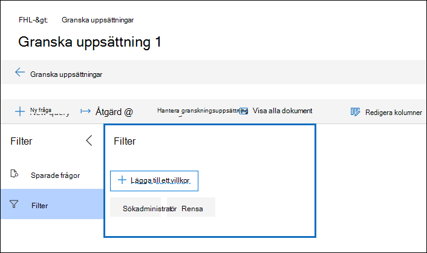

# Fråga data i en granskningsuppsättningQuery the data in a review set

I de flesta fall är det bra att kunna fördjupa sig i data i en granskningsuppsättning och ordna dessa data för att underlätta en effektivare granskning.In most cases, it will be useful to be able to dig deeper into the data in a review set and organize that data to facilitate a more efficient review. Med hjälp av Frågor i en granskningsuppsättning kan du fokusera på en delmängd dokument som uppfyller villkoren för din granskning.Using Queries in a review set helps you focus on a subset of documents that meet the criteria of your review.

## Skapa och köra en fråga i en granskningsuppsättningCreating and running a query in a review set

Om du vill skapa och köra en fråga på dokument i en granskningsuppsättning **väljer du Ny fråga** i granskningsuppsättningen.To create and run a query on the documents in a review set, select **New query** in the review set. När du har namn upp frågan och definierat villkoren väljer **du Spara** för att spara och köra frågan.After you name your query and define the conditions, select **Save** to save and run the query. Om du vill köra en fråga som har sparats tidigare väljer du en sparad fråga.To run a query that has been previously saved, select a saved query.

## Skapa en granskningsuppsättningsfrågaBuilding a review set query

Du kan skapa en fråga genom att använda en kombination av nyckelord, egenskaper och villkor i villkoret Nyckelord.You can build a query by using a combination of keywords, properties, and conditions in the Keywords condition. Du kan också gruppera villkor som ett block (kallas *villkorsgrupp)* för att skapa en mer komplex fråga.You can also group conditions as a block (called a *condition group*) to build a more complex query. En lista och en beskrivning av metadataegenskaper som du kan söka i finns i [Dokumentmetadatafält i Advanced eDiscovery](document-metadata-fields-in-Advanced-eDiscovery.md).For a list and description of metadata properties that you can search, see [Document metadata fields in Advanced eDiscovery](document-metadata-fields-in-Advanced-eDiscovery.md).

### VillkorConditions

Alla sökbara fält i en granskningsuppsättning har motsvarande villkor som du kan använda för att skapa frågan.Every searchable field in a review set has a corresponding condition that you can use to build your query.

Det finns flera typer av villkor:There are multiple types of conditions:

- Fritext: Ett fritextvillkor används för textfält som exempelvis ämne.Freetext: A freetext condition is used for text fields such as subject. Du kan lista flera sökord genom att avgränsa dem med kommatecken.You can list multiple search terms by separating them out with a comma.

- Datum: Ett datumvillkor används för datumfält som senast ändrad.Date: A date condition is used for date fields such as last modified date.

- Sökalternativ: Ett sökalternativvillkor tillhandahåller en lista med möjliga värden för det specifika fältet i din granskningsuppsättning.Search options: A search options condition will provide a list of possible values for the particular field in your review set. Det här används för fält, till exempel avsändare, där det finns ett ändlig antal möjliga värden i din granskningsuppsättning.This is used for fields, such as sender, where there is a finite number of possible values in your review set.

- Nyckelord: Ett nyckelordsvillkor är en specifik instans av fritextvillkor som du kan använda för att söka efter termer, eller använda KQL-liknande frågespråk.Keyword: A keyword condition is a specific instance of freetext condition that you can use to search for terms, or use KQL-like query language in. Se nedan för mer information.See below for more detail.

### FrågespråkQuery language

Utöver villkor kan du använda ett KQL-liknande frågespråk i villkoret Nyckelord för att skapa frågan.In addition to conditions, you can use a KQL-like query language in the Keywords condition to build your query. Frågespråket för granskningsuppsättningsfrågor har stöd för booleska standardoperatorer som **AND,** **OR,** **NOT** och **NEAR.**The query language for review set queries supports standard Boolean operators, such as **AND**, **OR**, **NOT**, and **NEAR**. Det har också stöd för ett jokertecken (?) och ett jokertecken (\*).It also supports a single-character wildcard (?) and a multi-character wildcard (\*).

## FilterFilters

Förutom frågor som du kan spara kan du använda granskningsuppsättningsfilter för att snabbt tillämpa ytterligare villkor på en frågeuppsättning.In addition to queries that you can save, you can use review set filters to quickly apply additional conditions to a review set query. Med hjälp av filter kan du förfina resultatet som visas i en granskningsuppsättningsfråga.Using filters help you further refine the results displayed by a review set query.

Filter skiljer sig från frågor på två väsentliga sätt:Filters differ from queries in two significant ways:

- Filter är tillfälliga.Filters are transient. De finns inte kvar efter den befintliga sessionen.They don't persist beyond the existing session. Med andra ord kan du inte spara ett filter.In other words, you can't save a filter. Frågor sparas i granskningsuppsättningen och du kommer åt dem när du öppnar granskningsuppsättningen.Queries are saved to the review set, and access them whenever you open the review set.

- Filter är alltid additiva.Filters are always additive. Filter används utöver den aktuella granskningsuppsättningsfrågan.Filters are applied in addition to the current review set query. Om du tillämpar en annan fråga ersätts resultatet som returneras av den aktuella frågan.Applying a different query will replace the results returned by the current query.
