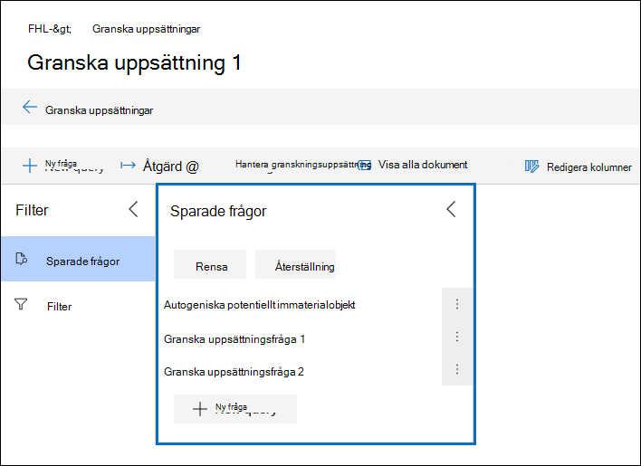

# Fråga data i en granskningsuppsättning

I de flesta fall är det bra att kunna fördjupa sig i data i en granskningsuppsättning och ordna dessa data för att underlätta en effektivare granskning. Med hjälp av Frågor i en granskningsuppsättning kan du fokusera på en delmängd dokument som uppfyller villkoren för din granskning.

## Skapa och köra en fråga i en granskningsuppsättning

Om du vill skapa och köra en fråga på dokument i en granskningsuppsättning **väljer du Ny fråga** i granskningsuppsättningen. När du har namn upp frågan och definierat villkoren väljer **du Spara** för att spara och köra frågan. Om du vill köra en fråga som har sparats tidigare väljer du en sparad fråga.

## Skapa en granskningsuppsättningsfråga

Du kan skapa en fråga genom att använda en kombination av nyckelord, egenskaper och villkor i villkoret Nyckelord. Du kan också gruppera villkor som ett block (kallas *villkorsgrupp)* för att skapa en mer komplex fråga. En lista och en beskrivning av metadataegenskaper som du kan söka i finns i [Dokumentmetadatafält i Advanced eDiscovery](document-metadata-fields-in-Advanced-eDiscovery.md).

### Villkor

Alla sökbara fält i en granskningsuppsättning har motsvarande villkor som du kan använda för att skapa frågan.

Det finns flera typer av villkor:

- Fritext: Ett fritextvillkor används för textfält som exempelvis ämne. Du kan lista flera sökord genom att avgränsa dem med kommatecken.

- Datum: Ett datumvillkor används för datumfält som senast ändrad.

- Sökalternativ: Ett sökalternativvillkor tillhandahåller en lista med möjliga värden för det specifika fältet i din granskningsuppsättning. Det här används för fält, till exempel avsändare, där det finns ett ändlig antal möjliga värden i din granskningsuppsättning.

- Nyckelord: Ett nyckelordsvillkor är en specifik instans av fritextvillkor som du kan använda för att söka efter termer, eller använda KQL-liknande frågespråk. Se nedan för mer information.

### Frågespråk

Utöver villkor kan du använda ett KQL-liknande frågespråk i villkoret Nyckelord för att skapa frågan. Frågespråket för granskningsuppsättningsfrågor har stöd för booleska standardoperatorer som **AND,** **OR,** **NOT** och **NEAR.** Det har också stöd för ett jokertecken (?) och ett jokertecken (*).

## Filter

Förutom frågor som du kan spara kan du använda granskningsuppsättningsfilter för att snabbt tillämpa ytterligare villkor på en frågeuppsättning. Med hjälp av filter kan du förfina resultatet som visas i en granskningsuppsättningsfråga.

Filter skiljer sig från frågor på två väsentliga sätt:

- Filter är tillfälliga. De finns inte kvar efter den befintliga sessionen. Med andra ord kan du inte spara ett filter. Frågor sparas i granskningsuppsättningen och du kommer åt dem när du öppnar granskningsuppsättningen.

- Filter är alltid additiva. Filter används utöver den aktuella granskningsuppsättningsfrågan. Om du tillämpar en annan fråga ersätts resultatet som returneras av den aktuella frågan.
