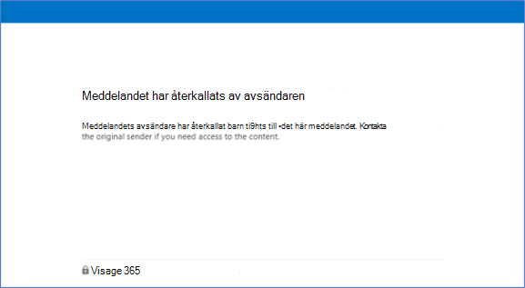

# <a name="revoke-email-encrypted-by-advanced-message-encryption"></a>Återkalla e-post som krypteras med avancerad meddelandekryptering

E-poståterkallning erbjuds som en del av Office 365 Advanced Message Encryption. Office 365 Advanced Message Encryption ingår i [Microsoft 365 Enterprise E5](https://www.microsoft.com/microsoft-365/enterprise/home), Office 365 E5, Microsoft 365 E5 (priser för ideella föreningar), Office 365 Enterprise E5 (priser för ideella föreningar) och Office 365 Education A5. Om organisationen har en prenumeration som inte inkluderar Office 365 Advanced Message Encryption kan du köpa den med SKU-tillägget för Microsoft 365 E5 Compliance för Microsoft 365 E3, Microsoft 365 E3 (priser för ideella föreningar) eller SKU-tillägget Office 365 Advanced Compliance för Microsoft 365 E3, Microsoft 365 E3 (priser för ideella föreningar) eller Office 365-SKU:er.

Den här artikeln är en del av en större serie artiklar om [Meddelandekryptering i Office 365](ome.md).

Om ett meddelande krypterades med Office 365 Advanced Message Encryption och du är en Microsoft 365-administratör eller du är meddelandets avsändare kan du återkalla meddelandet under vissa förhållanden. Administratörer återkallar meddelanden med hjälp av PowerShell. Som avsändare återkallar du ett meddelande som du skickat direkt Outlook på webben. I den här artikeln beskrivs under vilka omständigheter en återkallelse är möjlig och hur du gör det.
  
## <a name="encrypted-emails-that-you-can-revoke"></a>Krypterade e-postmeddelanden som du kan återkalla

Administratörer och avsändare kan återkalla krypterade e-postmeddelanden om mottagaren har fått ett länkbaserat, företagskrypterat e-postmeddelande. Om mottagaren har fått en inbyggd inbyggd upplevelse i en Outlook klient kan du inte återkalla meddelandet.

Om en mottagare får en länkbaserad upplevelse eller en direkt infogade upplevelse beror på mottagarens identitetstyp: mottagare av Office 365- och Microsoft-konton (till exempel outlook.com-användare) får en direkt upplevelse i de Outlook-klienter som stöds. Alla andra mottagartyper, till exempel Gmail- och Yahoo-mottagare, får en länkbaserad upplevelse.

Administratörer och avsändare kan återkalla meddelanden som krypteras med kryptering som används direkt Outlook på webben. Till exempel meddelanden som krypteras med alternativet Kryptera endast.

:::image type="content" source="../media/adhocencryptionrevoke.png" alt-text="Skärmbild som visar alternativet Endast kryptera Outlook på webben.":::

## <a name="recipient-experience-for-revoked-encrypted-emails"></a>Mottagarens upplevelse av återkallade krypterade e-postmeddelanden

När ett e-postmeddelande har återkallats får mottagaren ett felmeddelande när de öppnar det krypterade e-postmeddelandet via Meddelandekryptering i Office 365-portalen: "Meddelandet har återkallats av avsändaren".



## <a name="how-to-revoke-an-encrypted-message-that-you-sent"></a>Återkalla ett krypterat meddelande som du skickat

Du kan återkalla ett e-postmeddelande som du har skickat till en enskild mottagare som använder ett socialt konto, till exempel gmail.com eller yahoo.com. Med andra ord kan du återkalla ett e-postmeddelande som skickas till en enskild mottagare som fått den länkbaserade upplevelsen.

Du kan inte återkalla ett e-postmeddelande som du har skickat till en mottagare som använder ett arbets- eller skolkonto från Office 365 eller Microsoft 365 eller en användare som använder ett Microsoft-konto, till exempel ett outlook.com konto. 

Gör så här om du vill återkalla ett krypterat meddelande som du har skickat

1. I Outlook på webben går du till **mappen** Skickat och bläddrar till meddelandet som du vill återkalla.

   Om e-postmeddelandet kan återkallas visas länken "Ta bort extern åtkomst" högst upp i meddelandet.

    :::image type="content" source="../media/infoprotect-email-encryption/adhocencryptionrevokesentmsg.png" alt-text="Skärmbild som visar krypterad e-post som du vill återkalla Outlook på webben.":::

2. Klicka **på Ta bort extern** åtkomst om du vill återkalla meddelandet.

   Meddelandet visar att dess status har återkallats.

   :::image type="content" source="../media/adhocencryptionrevokedmsg.png" alt-text="Skärmbild som visar återkallat krypterat meddelande Outlook på webben.":::

## <a name="how-to-revoke-an-encrypted-message-as-an-administrator"></a>Återkalla ett krypterat meddelande som administratör

Microsoft 365 här allmänna anvisningarna för att återkalla ett berättigat krypterat e-postmeddelande:

- Hämta e-postmeddelandets meddelande-ID.
- Kontrollera att du kan återkalla meddelandet.
- Återkalla e-postmeddelandet.

### <a name="step-1-obtain-the-message-id-of-the-email"></a>Steg 1. Hämta e-postmeddelandets meddelande-ID

Innan du kan återkalla ett krypterat e-postmeddelande måste du samla in e-postmeddelandets meddelande-ID. Meddelande-ID:t är vanligtvis av följande format:

`<xxxxxxxxxxxxxxxxxxxxxxx@xxxxxx.xxxx.prod.outlook.com>`  

Det finns flera sätt att hitta meddelande-ID för e-postmeddelandet som du vill återkalla. I det här avsnittet beskrivs några olika alternativ, men du kan använda valfri metod som tillhandahåller ID:t.

#### <a name="to-identify-the-message-id-of-the-email-you-want-to-revoke-by-using-message-trace-in-the-security-amp-compliance-center"></a>Identifiera meddelande-ID för det e-postmeddelande som du vill återkalla med hjälp av Meddelandespårning i &amp; Säkerhetsefterlevnad

1. Sök efter e-postmeddelandet efter avsändare eller mottagare med [hjälp av Ny meddelandespårning i & Säkerhets- och efterlevnadscenter.](https://blogs.technet.microsoft.com/exchange/2018/05/02/new-message-trace-in-office-365-security-compliance-center/)

2. När du har hittat e-postmeddelandet väljer du det så att fönstret **Meddelandespårning visas.** Expandera **Mer information för** att hitta meddelande-ID.

#### <a name="to-identify-the-message-id-of-the-email-you-want-to-revoke-by-using-office-message-encryption-reports-in-the-security-amp-compliance-center"></a>Identifiera meddelande-ID för det e-postmeddelande som du vill återkalla med hjälp Office meddelandekrypteringsrapporter i &amp; Säkerhetsefterlevnadscenter

1. Gå till &amp; rapporten Meddelandekryptering i **Säkerhetsefterlevnadscenter.** Mer information om den här rapporten finns i [Visa säkerhetsrapporter för e-post i &amp; Säkerhetsefterlevnadscenter.](../security/defender-365-security/view-email-security-reports.md)

2. Välj tabellen **Visa information** och identifiera meddelandet som du vill återkalla.

3. Dubbelklicka på meddelandet för att visa information som innehåller meddelande-ID.

### <a name="step-2-verify-that-the-mail-is-revocable"></a>Steg 2. Kontrollera att e-postmeddelandet kan återkallas

Kontrollera om du kan återkalla ett meddelande genom att kontrollera om fältet Återkallelsestatus visas i rapporten Kryptering i tabellen **Information** i &amp; Säkerhetsefterlevnad.

Utför de här stegen för att verifiera om du kan återkalla ett visst e Windows PowerShell postmeddelande.

1. Om du använder ett arbets- eller skolkonto med global administratörsbehörighet i din organisation startar du Windows PowerShell en session och ansluter till Exchange Online. För instruktioner se: [Ansluta till Exchange Online PowerShell](/powershell/exchange/connect-to-exchange-online-powershell).

2. Kör Get-OMEMessageStatus cmdleten så här:

     ```powershell
     Get-OMEMessageStatus -MessageId "<message id>" | ft -a  Subject, IsRevocable
     ```

   Det här kommandot returnerar ämnet för meddelandet och om meddelandet kan återkallas. Ett exempel:

     ```console
     Subject        IsRevocable
     -------        -----------
     "Test message" True
     ```

### <a name="step-3-revoke-the-mail"></a>Steg 3. Återkalla e-postmeddelandet

När du vet meddelande-ID för e-postmeddelandet som du vill återkalla och du har verifierat att meddelandet kan återkallas kan du återkalla e-postmeddelandet med hjälp av Säkerhetsefterlevnad &amp; eller Windows PowerShell.

Så här återkallar du meddelandet med hjälp av &amp; Säkerhetsefterlevnadscenter

1. Använd ett arbets- eller skolkonto med global administratörsbehörighet i din organisation och anslut till Säkerhets- & efterlevnadscenter.

2. Välj **Återkalla meddelande** i **tabellen Information för** meddelandet i rapporten **Kryptering.**

Om du vill återkalla ett e-Windows PowerShell med hjälp av Set-OMEMessageRevocation-cmdleten.

1. Med ett arbets- eller skolkonto med global administratörsbehörighet i din organisation kan [du Anslut till Exchange Online PowerShell.](/powershell/exchange/connect-to-exchange-online-powershell)

2. Kör Set-OMEMessageRevocation cmdleten så här:

    ```powershell
    Set-OMEMessageRevocation -Revoke $true -MessageId "<messageId>"
    ```

3. Om du vill kontrollera om e-postmeddelandet har återkallats kör du cmdleten Get-OMEMessageStatus följande:

    ```powershell
    Get-OMEMessageStatus -MessageId "<messageId>" | ft -a  Subject, Revoked
    ```

    Om återkallelsen lyckades returnerar cmdleten följande resultat:  

     ```console
     Revoked: True
     ```

## <a name="more-information-about-office-365-advanced-message-encryption"></a>Mer information om Office 365 Advanced Message Encryption

- [Office 365 Advanced Message Encryption](ome-advanced-message-encryption.md)

- [Office 365 Advanced Message Encryption – förfallotid för e-post](ome-advanced-expiration.md)

- [Beskrivning av meddelandeprincip och efterlevnadstjänst](/office365/servicedescriptions/exchange-online-service-description/message-policy-and-compliance)