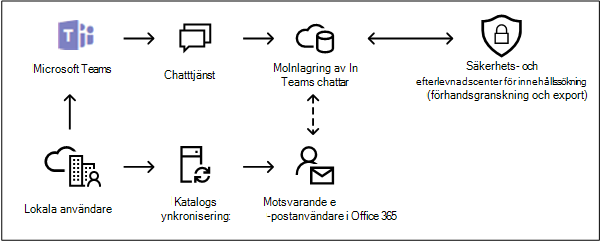

# <a name="search-for-teams-chat-data-for-on-premises-users"></a><span data-ttu-id="3197f-103">Söka efter Teams chattdata för lokala användare</span><span class="sxs-lookup"><span data-stu-id="3197f-103">Search for Teams chat data for on-premises users</span></span>

<span data-ttu-id="3197f-104">Om din organisation har en Exchange-hybridinstallation (eller om organisationen synkroniserar en lokal Exchange-organisation med Office 365) och har aktiverat Microsoft Teams, kan lokala användare använda Teams chattprogram för snabbmeddelanden.</span><span class="sxs-lookup"><span data-stu-id="3197f-104">If your organization has an Exchange hybrid deployment (or your organization synchronizes an on-premises Exchange organization with Office 365) and has enabled Microsoft Teams, on-premises users can use the Teams chat application for instant messaging.</span></span> <span data-ttu-id="3197f-105">För molnbaserade användare sparas Teams chattdata (kallas även *1x1- eller 1xN-chattar*) i den primära molnbaserade postlådan.</span><span class="sxs-lookup"><span data-stu-id="3197f-105">For a cloud-based user, Teams chat data (also called *1x1 or 1xN chats*) is saved to their primary cloud-based mailbox.</span></span> <span data-ttu-id="3197f-106">När en lokal användare använder Teams chattprogram kan deras chattmeddelanden inte lagras i den primära postlådan som finns lokalt.</span><span class="sxs-lookup"><span data-stu-id="3197f-106">When an on-premises user uses the Teams chat application, their chat messages can't be stored in their primary mailbox, which is located on-premises.</span></span> <span data-ttu-id="3197f-107">För att komma runt den här begränsningen har Microsoft släppt en ny funktion där ett molnbaserad lagringsområde skapas så att du kan använda eDiscovery-verktyg för att söka efter och exportera Teams chattdata för lokala användare.</span><span class="sxs-lookup"><span data-stu-id="3197f-107">To get around this limitation, Microsoft has released a new feature where a cloud-based storage area is created so that you use eDiscovery tools to search for and export Teams chat data for on-premises users.</span></span>
  
<span data-ttu-id="3197f-108">Här är kraven och begränsningarna för att aktivera molnbaserad lagring för lokala användare:</span><span class="sxs-lookup"><span data-stu-id="3197f-108">Here are the requirements and limitations for enabling cloud-based storage for on-premises users:</span></span>
  
- <span data-ttu-id="3197f-109">Användarkontona i den lokala katalogtjänsten (till exempel Active Directory) måste synkroniseras med katalogtjänsten Azure Active Directory i Microsoft 365.</span><span class="sxs-lookup"><span data-stu-id="3197f-109">The user accounts in your on-premises directory service (such as Active Directory) must be synchronized with Azure Active Directory, the directory service in Microsoft 365.</span></span> <span data-ttu-id="3197f-110">Det innebär att ett e-postkonto för användaren skapas i Microsoft 365 och kopplas till en användare vars primära postlåda finns i den lokala organisationen.</span><span class="sxs-lookup"><span data-stu-id="3197f-110">This means that a mail user account is created in Microsoft 365 and is associated with a user whose primary mailbox is located in the on-premises organization.</span></span>

- <span data-ttu-id="3197f-111">Den användare vars primära postlåda finns i den lokala organisationen måste tilldelas en Microsoft Teams-licens och en licens för minst Exchange Online, alternativ 1.</span><span class="sxs-lookup"><span data-stu-id="3197f-111">The user whose primary mailbox is located in the on-premises organization must be assigned a Microsoft Teams license and a minimum of an Exchange Online Plan 1 license.</span></span>

- <span data-ttu-id="3197f-112">Om din organisation inte har en Exchange-hybridinstallation, måste du synkronisera ditt lokala Exchange-schema till Azure Active Directory.</span><span class="sxs-lookup"><span data-stu-id="3197f-112">If your organization doesn't have an Exchange hybrid deployment, you must synchronize your on-premises Exchange schema to Azure Active Directory.</span></span> <span data-ttu-id="3197f-113">Om du inte gör det kan du riskera att skapa duplicerade molnbaserade postlådor i Exchange Online för användare som har en postlåda i din lokala Exchange-organisation.</span><span class="sxs-lookup"><span data-stu-id="3197f-113">If you don't do this, you might risk creating duplicate cloud-based mailboxes in Exchange Online for users that have a mailbox in your on-premises Exchange organization.</span></span>

- <span data-ttu-id="3197f-114">Det är bara Teams chattdata som är associerad med en lokal användare som lagras i det molnbaserade lagringsutrymmet.</span><span class="sxs-lookup"><span data-stu-id="3197f-114">Only the Teams chat data associated with an on-premises user is stored in the cloud-based storage area.</span></span> <span data-ttu-id="3197f-115">Den lokala användaren kan inte komma åt lagringsutrymmet på något sätt.</span><span class="sxs-lookup"><span data-stu-id="3197f-115">An on-premises user can't access this storage area in any way.</span></span>

> [!NOTE]
> <span data-ttu-id="3197f-116">Teams kanalkonversationer lagras alltid i den molnbaserade postlådan som är kopplad till gruppen, vilket innebär att du kan söka efter kanalkonversationer.</span><span class="sxs-lookup"><span data-stu-id="3197f-116">Teams channel conversations are always stored in the cloud-based mailbox that's associated with the Team, which means you can search for channel conversations.</span></span> <span data-ttu-id="3197f-117">Mer information om hur du söker efter Teams kanalkonversationer finns i [Söka i Microsoft Teams och Microsoft 365-grupper](content-search-reference.md#searching-microsoft-teams-and-microsoft-365-groups).</span><span class="sxs-lookup"><span data-stu-id="3197f-117">For more information about searching Teams channel conversations, see [Searching Microsoft Teams and Microsoft 365 Groups](content-search-reference.md#searching-microsoft-teams-and-microsoft-365-groups).</span></span>
  
## <a name="how-it-works"></a><span data-ttu-id="3197f-118">Så här fungerar det</span><span class="sxs-lookup"><span data-stu-id="3197f-118">How it works</span></span>

<span data-ttu-id="3197f-119">Om en Microsoft Teams-aktiverad användare har en lokal postlåda och användarens användarkonto/identitet har synkroniserats till molnet, skapar Microsoft molnbaserad lagring som den lokala användarens 1xN Teams chattdata kan associeras med.</span><span class="sxs-lookup"><span data-stu-id="3197f-119">If a Microsoft Teams-enabled user has an on-premises mailbox and their user account/identity has been synched to the cloud, Microsoft creates cloud-based storage to associate the on-premises user's 1xN Teams chat data with.</span></span> <span data-ttu-id="3197f-120">Teams chattdata för lokala användare indexeras för sökning.</span><span class="sxs-lookup"><span data-stu-id="3197f-120">Teams chat data for on-premises users is indexed for search.</span></span> <span data-ttu-id="3197f-121">Det innebär att du kan använda innehållssökning (och sökningar som är kopplade till Core eDiscovery- och Advanced eDiscovery-fall) för att söka, förhandsgranska och exportera Teams chattdata för lokala användare.</span><span class="sxs-lookup"><span data-stu-id="3197f-121">This lets you Use Content search (and searches associated with Core eDiscovery and Advanced eDiscovery cases) to search, preview, and export Teams chat data for on-premises users.</span></span> <span data-ttu-id="3197f-122">Du kan också använda cmdletar för **\*ComplianceSearch** i Säkerhets- och efterlevnadscenter för PowerShell till att söka efter Teams chattdata för lokala användare.</span><span class="sxs-lookup"><span data-stu-id="3197f-122">You can also use **\*ComplianceSearch** cmdlets in the Security & Compliance Center PowerShell to search for Teams chat data for on-premises users.</span></span>
  
<span data-ttu-id="3197f-123">Följande bild visar arbetsflödet för hur Teams chattdata för lokala användare är tillgänglig för sökning, förhandsgranskning och export.</span><span class="sxs-lookup"><span data-stu-id="3197f-123">The following graphic shows the workflow of how Teams chat data for on-premises users is available to search, preview, and export.</span></span>
  

  
<span data-ttu-id="3197f-125">Utöver den här funktionen kan du även använda eDiscovery-verktyg till att söka, förhandsgranska och exportera Teams-innehåll på den molnbaserade SharePoint-webbplatsen och i Exchange-postlådan som är kopplad till varje Microsoft Team och 1xN Teams chattdata i Exchange Online-postlådan för molnbaserade användare.</span><span class="sxs-lookup"><span data-stu-id="3197f-125">In addition to this capability, you can also use eDiscovery tools to search, preview, and export Teams content in the cloud-based SharePoint site and Exchange mailbox associated with each Microsoft Team and 1xN Teams chat data in the Exchange Online mailbox for cloud-based users.</span></span>

### <a name="how-this-feature-is-supported-in-content-search-and-core-ediscovery-search-tools"></a><span data-ttu-id="3197f-126">Den här funktionen stöds i sökverktygen för innehållssökning och Core eDiscovery</span><span class="sxs-lookup"><span data-stu-id="3197f-126">How this feature is supported in Content search and Core eDiscovery search tools</span></span>

<span data-ttu-id="3197f-127">Följande gränssnittselement i Innehållssökning samt i sökverktyget är kopplade till Core eDiscovery-fall i Microsoft 365 Efterlevnadscenter:</span><span class="sxs-lookup"><span data-stu-id="3197f-127">The following UI elements in Content search and in the search tool associated with Core eDiscovery cases in the Microsoft 365 compliance center:</span></span>
  
- <span data-ttu-id="3197f-128">Kryssrutan **Lägg till appinnehåll för lokala användare** visas på guidesidan **Platser** i verktyget Innehållssökning och är markerad som standard.</span><span class="sxs-lookup"><span data-stu-id="3197f-128">The **Add app content for on-premises users** checkbox is displayed on the **Locations** wizard page in Content search tool and selected by default.</span></span> <span data-ttu-id="3197f-129">Låt den här kryssrutan vara markerad för att inkludera det molnbaserade lagringsutrymmet för lokala användare vid innehållssökning.</span><span class="sxs-lookup"><span data-stu-id="3197f-129">Keep this checkbox selected to include the cloud-based storage for on-premises users in a content search.</span></span>

    
  
- <span data-ttu-id="3197f-131">Du kan söka efter lokala användare när du väljer att söka efter specifika användare.</span><span class="sxs-lookup"><span data-stu-id="3197f-131">You can search for on-premises users when you choose specific users to search for.</span></span>

## <a name="searching-for-teams-chat-content-for-on-premises-users"></a><span data-ttu-id="3197f-132">Söker efter chattinnehåll från Teams för lokala användare</span><span class="sxs-lookup"><span data-stu-id="3197f-132">Searching for Teams chat content for on-premises users</span></span>

<span data-ttu-id="3197f-133">Så här använder du innehållssökning i Microsoft 365 Efterlevnadscenter till att söka efter Teams chattdata för lokala användare.</span><span class="sxs-lookup"><span data-stu-id="3197f-133">Here's how to use Content search in the Microsoft 365 compliance center to search for Teams chat data for on-premises users.</span></span>
  
1. <span data-ttu-id="3197f-134">I Microsoft 365 Efterlevnadscenter går du till **Innehållssökning**.</span><span class="sxs-lookup"><span data-stu-id="3197f-134">In the Microsoft 365 compliance center, go to **Content search**.</span></span>

2. <span data-ttu-id="3197f-135">På fliken **Sökningar** klickar du på **Ny sökning** och anger den nya sökningen.</span><span class="sxs-lookup"><span data-stu-id="3197f-135">On the **Searches** tab, click **New search**, and name the new search.</span></span>

3. <span data-ttu-id="3197f-136">På sidan **Platser** ställer du in **På** för reglaget för Exchange-postlådor.</span><span class="sxs-lookup"><span data-stu-id="3197f-136">On the **Locations** page, set the toggle to **On** for Exchange mailboxes.</span></span> <span data-ttu-id="3197f-137">Se till att kryssrutan **Lägg till appinnehåll för lokala användare** visas och är markerad som standard.</span><span class="sxs-lookup"><span data-stu-id="3197f-137">Notice that the **Add app content for on-premises users** checkbox is displayed and selected by default.</span></span>

4. <span data-ttu-id="3197f-138">För att söka efter innehåll från Teams för specifika användare väljer du **Välj användare, grupp eller team** och väljer specifika användare som ska ingå i sökningen.</span><span class="sxs-lookup"><span data-stu-id="3197f-138">To search for Teams content for specific users, select **Choose user, groups, or teams** and choose specific users to include in the search.</span></span> <span data-ttu-id="3197f-139">För att söka efter innehåll från Teams för alla användare, inklusive lokala användare, klickar du på **Nästa**.</span><span class="sxs-lookup"><span data-stu-id="3197f-139">Otherwise, click **Next** to search for Teams content for all users, including  on-premises users</span></span>

5. <span data-ttu-id="3197f-140">På sidan **Definiera sökvillkor** skapar du en nyckelordsfråga och lägger till villkor i sökfrågan om det behövs.</span><span class="sxs-lookup"><span data-stu-id="3197f-140">On the **Define your search conditions** page, create a keyword query and add conditions to the search query if necessary.</span></span> <span data-ttu-id="3197f-141">För att endast söka efter data för teamchattar kan du lägga till följande fråga i rutan **Nyckelord**:</span><span class="sxs-lookup"><span data-stu-id="3197f-141">To only search for Team chats data, you can add the following query in the **Keywords** box:</span></span>

    ```text
    kind:im AND kind:microsoftteams
    ```

6. <span data-ttu-id="3197f-142">Spara och kör sökningen.</span><span class="sxs-lookup"><span data-stu-id="3197f-142">Submit and run the search.</span></span> <span data-ttu-id="3197f-143">Alla sökresultat för lokala användare kan förhandsgranskas på samma sätt som i andra sökresultat.</span><span class="sxs-lookup"><span data-stu-id="3197f-143">Any search results for on-premises users can be previewed like any other search results.</span></span> <span data-ttu-id="3197f-144">Du kan också exportera sökresultatet (inklusive Teams chattdata) till en PST-fil.</span><span class="sxs-lookup"><span data-stu-id="3197f-144">You can also export the search results (including any Teams chat data) to a PST file.</span></span> <span data-ttu-id="3197f-145">Mer information finns i:</span><span class="sxs-lookup"><span data-stu-id="3197f-145">For more information, see:</span></span>

    - [<span data-ttu-id="3197f-146">Skapa en sökning</span><span class="sxs-lookup"><span data-stu-id="3197f-146">Create a search</span></span>](content-search.md)

    - [<span data-ttu-id="3197f-147">Förhandsgranska sökresultat</span><span class="sxs-lookup"><span data-stu-id="3197f-147">Preview search results</span></span>](preview-ediscovery-search-results.md)

    - [<span data-ttu-id="3197f-148">Exportera sökresultaten</span><span class="sxs-lookup"><span data-stu-id="3197f-148">Export search results</span></span>](export-search-results.md)

## <a name="using-powershell-to-search-for-teams-chat-data-for-on-premises-users"></a><span data-ttu-id="3197f-149">Använda PowerShell till att söka efter chattdata för Teams för lokala användare</span><span class="sxs-lookup"><span data-stu-id="3197f-149">Using PowerShell to search for Teams chat data for on-premises users</span></span>

<span data-ttu-id="3197f-150">Du kan använda cmdletarna **New-ComplianceSearch** och **Set-ComplianceSearch** i Säkerhets- och efterlevnadscenter för PowerShell till att söka efter Teams chattdata för lokala användare.</span><span class="sxs-lookup"><span data-stu-id="3197f-150">You can use the **New-ComplianceSearch** and **Set-ComplianceSearch** cmdlets in the Security & Compliance Center PowerShell to search for Teams chat data for on-premises users.</span></span> <span data-ttu-id="3197f-151">Som tidigare beskrivits behöver du inte skicka någon supportbegäran om att använda PowerShell till att söka efter Teams chattdata för lokala användare.</span><span class="sxs-lookup"><span data-stu-id="3197f-151">As previously explained, you don't have to submit a support request to use PowerShell to search for Teams chat data for on-premises users.</span></span>
  
1. <span data-ttu-id="3197f-152">[Ansluta till Säkerhets- och efterlevnadscenter i PowerShell](/powershell/exchange/connect-to-scc-powershell).</span><span class="sxs-lookup"><span data-stu-id="3197f-152">[Connect to Security & Compliance Center PowerShell](/powershell/exchange/connect-to-scc-powershell).</span></span>

2. <span data-ttu-id="3197f-153">Kör följande PowerShell-kommando för att skapa en innehållssökning som söker efter Teams chattdata för lokala användare.</span><span class="sxs-lookup"><span data-stu-id="3197f-153">Run the following PowerShell command to create a content search that searches for Teams chat data for on-premises users.</span></span>

    ```powershell
    New-ComplianceSearch <name of new search> -ContentMatchQuery <search query> -ExchangeLocation <on-premises user> -IncludeUserAppContent $true -AllowNotFoundExchangeLocationsEnabled $true  
    ```

    <span data-ttu-id="3197f-154">Parametern *IncludeUserAppContent* används för att ange den molnbaserade lagringen för den eller de användare som anges av parametern *ExchangeLocation*.</span><span class="sxs-lookup"><span data-stu-id="3197f-154">The *IncludeUserAppContent*  parameter is used to specify the cloud-based storage for the user or users who are specified by the  *ExchangeLocation*  parameter.</span></span> <span data-ttu-id="3197f-155">Med *AllowNotFoundExchangeLocationsEnabled* kan du söka i det molnbaserade lagringsutrymmet efter lokala användare.</span><span class="sxs-lookup"><span data-stu-id="3197f-155">The *AllowNotFoundExchangeLocationsEnabled*  allows you to search the cloud-based storage for on-premises users.</span></span> <span data-ttu-id="3197f-156">När du använder `$true`-värdet för den här parametern verifierar inte sökningen att postlådan finns innan den körs.</span><span class="sxs-lookup"><span data-stu-id="3197f-156">When you use the `$true` value for this parameter, the search doesn't try to validate the existence of the mailbox before it runs.</span></span> <span data-ttu-id="3197f-157">Det här krävs för att kunna söka i den molnbaserade lagringen efter lokala användare, eftersom den molnbaserade lagringen inte fungerar som en vanlig molnbaserad postlåda.</span><span class="sxs-lookup"><span data-stu-id="3197f-157">This is required to search the cloud-based storage for on-premises users because this cloud-based storage doesn't resolve as a regular cloud-based mailbox.</span></span>

    <span data-ttu-id="3197f-158">Följande exempel söker efter chattar i Teams som innehåller nyckelordet "redstone" i den molnbaserade lagringen för Sara Davis, som är en lokal användare i Contoso-organisationen.</span><span class="sxs-lookup"><span data-stu-id="3197f-158">The following example searches for Teams chats that contain keyword "redstone" in the cloud-based storage for Sara Davis, who is an on-premises user in the Contoso organization.</span></span>
  
    ```powershell
    New-ComplianceSearch "Redstone_Search" -ContentMatchQuery "redstone AND (kind:im AND kind:microsoftteams)" -ExchangeLocation sarad@contoso.com -IncludeUserAppContent $true -AllowNotFoundExchangeLocationsEnabled $true  
    ```

   <span data-ttu-id="3197f-159">När du har skapat en sökning använder du cmdleten **Start-ComplianceSearch** för att köra sökningen.</span><span class="sxs-lookup"><span data-stu-id="3197f-159">After you create a search, be sure to use the **Start-ComplianceSearch** cmdlet to run the search.</span></span>
  
<span data-ttu-id="3197f-160">Mer information om hur du använder dessa cmdletar finns i:</span><span class="sxs-lookup"><span data-stu-id="3197f-160">For more information using these cmdlets, see:</span></span>
  
- [<span data-ttu-id="3197f-161">New-ComplianceSearch</span><span class="sxs-lookup"><span data-stu-id="3197f-161">New-ComplianceSearch</span></span>](/powershell/module/exchange/new-compliancesearch)

- [<span data-ttu-id="3197f-162">Set-ComplianceSearch</span><span class="sxs-lookup"><span data-stu-id="3197f-162">Set-ComplianceSearch</span></span>](/powershell/module/exchange/set-compliancesearch)

- [<span data-ttu-id="3197f-163">Start-ComplianceSearch</span><span class="sxs-lookup"><span data-stu-id="3197f-163">Start-ComplianceSearch</span></span>](/powershell/module/exchange/start-compliancesearch)

## <a name="known-issues"></a><span data-ttu-id="3197f-164">Kända problem</span><span class="sxs-lookup"><span data-stu-id="3197f-164">Known issues</span></span>

- <span data-ttu-id="3197f-165">För närvarande kan du söka efter, förhandsgranska och exportera Teams chattdata för lokala användare.</span><span class="sxs-lookup"><span data-stu-id="3197f-165">Currently, you can search, preview, and export Teams chat data for on-premises users.</span></span> <span data-ttu-id="3197f-166">Du kan också parkera Teams chattdata för en lokal användare som är kopplad till ett Core eller Advanced eDiscovery-ärende och tillämpa en kvarhållningsprincip för Teams chattar eller kanalmeddelanden för lokala användare.</span><span class="sxs-lookup"><span data-stu-id="3197f-166">You can also place the Teams chat data for an on-premises user on a hold associated with a Core or Advanced eDiscovery case, and apply a retention policy for Teams chats or channel messages for on-premises users.</span></span> <span data-ttu-id="3197f-167">För närvarande kan du dock inte tillämpa en kvarhållningsprincip för andra innehållsplatser (till exempel Exchange-postlådor och SharePoint-webbplatser) för lokala användare.</span><span class="sxs-lookup"><span data-stu-id="3197f-167">However at this time, you can't apply a retention policy for other content locations (such as Exchange mailboxes and SharePoint sites) for on-premises users.</span></span>

## <a name="frequently-asked-questions"></a><span data-ttu-id="3197f-168">Vanliga frågor och svar</span><span class="sxs-lookup"><span data-stu-id="3197f-168">Frequently asked questions</span></span>

<span data-ttu-id="3197f-169">**Måste jag skicka en supportbegäran för att söka efter chattmeddelanden för lokala användare?**</span><span class="sxs-lookup"><span data-stu-id="3197f-169">**Do I have to submit a support request to search for chat messages for on-premises users?**</span></span>

<span data-ttu-id="3197f-170">Nej.</span><span class="sxs-lookup"><span data-stu-id="3197f-170">No.</span></span> <span data-ttu-id="3197f-171">Den här funktionen är aktiverad som standard för alla organisationer.</span><span class="sxs-lookup"><span data-stu-id="3197f-171">This feature is enabled by default for all organizations.</span></span> <span data-ttu-id="3197f-172">Tidigare behövde du kontakta Microsoft Support, men det behöver du inte längre.</span><span class="sxs-lookup"><span data-stu-id="3197f-172">At one point, you did have to contact Microsoft Support but that is no longer the case.</span></span>
  
 <span data-ttu-id="3197f-173">**Kan eDiscovery-verktyg hitta äldre Teams chattdata för lokala användare innan funktionen aktiverades som standard för alla organisationer?**</span><span class="sxs-lookup"><span data-stu-id="3197f-173">**Can eDiscovery tools find older Teams chat data for on-premises users before the time that this feature was enabled by default for all organizations?**</span></span>
  
<span data-ttu-id="3197f-174">Microsoft började lagra Teams chattdata för lokala användare den 31 januari 2018.</span><span class="sxs-lookup"><span data-stu-id="3197f-174">Microsoft started storing the Teams chat data for on-premises users on January 31, 2018.</span></span> <span data-ttu-id="3197f-175">Om identiteten för en lokal Teams-användare har synkroniserats mellan din lokala Active Directory och Azure Active Directory i Microsoft 365 efter det här datumet lagras deras Teams chattdata i molnet och är sökbar med eDiscovery-verktyg.</span><span class="sxs-lookup"><span data-stu-id="3197f-175">So, if the identity of an on-premises Teams user has been synched between you on-premises Active Directory and Azure Active Directory in Microsoft 365 since this date, then their Teams chat data is stored in the cloud and is searchable using eDiscovery tools.</span></span>

 <span data-ttu-id="3197f-176">**Behöver lokala användare en licens för att kunna lagra Teams chattdata i molnet?**</span><span class="sxs-lookup"><span data-stu-id="3197f-176">**Do on-premises users need a license to store their Teams chat data in the cloud?**</span></span>
  
<span data-ttu-id="3197f-177">Ja.</span><span class="sxs-lookup"><span data-stu-id="3197f-177">Yes.</span></span> <span data-ttu-id="3197f-178">Om Teams chattdata ska lagras för en lokal användare i en molnbaserad lagring, måste användaren tilldelas en Microsoft Teams-licens och en licens för Exchange Online i Office 365 (eller Microsoft 365).</span><span class="sxs-lookup"><span data-stu-id="3197f-178">To store Teams chat data for an on-premises user in a cloud-based storage, the user must be assigned a Microsoft Teams license and an Exchange Online Plan license in Office 365 (or Microsoft 365).</span></span>

<span data-ttu-id="3197f-179">**Var finns den molnbaserade lagringen för lokala användare?**</span><span class="sxs-lookup"><span data-stu-id="3197f-179">**Where is the cloud-based storage for on-premises users located?**</span></span>
  
<span data-ttu-id="3197f-180">Teams chattdata lagras på den önskade dataplatsen (PDL) för en lokal användare.</span><span class="sxs-lookup"><span data-stu-id="3197f-180">Teams chat data is stored in the Preferred Data Location (PDL) for an on-premises user.</span></span> <span data-ttu-id="3197f-181">PDL används både i Single-Geo- och Multi-Geo-miljöer.</span><span class="sxs-lookup"><span data-stu-id="3197f-181">The PDL is honored in both Single-Geo and Multi-Geo environments.</span></span> <span data-ttu-id="3197f-182">Mer information finns i [Microsoft 365 Multi-Geo](../enterprise/microsoft-365-multi-geo.md).</span><span class="sxs-lookup"><span data-stu-id="3197f-182">For more information, see [Microsoft 365 Multi-Geo](../enterprise/microsoft-365-multi-geo.md).</span></span>

<span data-ttu-id="3197f-183">**Finns det någon risk att förlora Teams chattdata om användarens lokala postlåda migreras till molnet?**</span><span class="sxs-lookup"><span data-stu-id="3197f-183">**Is there a risk of losing the Teams chat data if the user's on-premises mailbox is migrated to the cloud?**</span></span>
  
<span data-ttu-id="3197f-184">Nej.</span><span class="sxs-lookup"><span data-stu-id="3197f-184">No.</span></span> <span data-ttu-id="3197f-185">När du migrerar en lokal användares primära postlåda till molnet migreras Teams chattdata för användaren till den nya molnbaserade primära postlådan.</span><span class="sxs-lookup"><span data-stu-id="3197f-185">When you migrate the primary mailbox of an on-premises user to the cloud, the Teams chat data for that user will be migrated to their new cloud-based primary mailbox.</span></span>
  
 <span data-ttu-id="3197f-186">**Kan jag tillämpa kvarhållningsprinciper för eDiscovery på lokala användare?**</span><span class="sxs-lookup"><span data-stu-id="3197f-186">**Can I apply an eDiscovery hold or retention policies to on-premises users?**</span></span>
  
<span data-ttu-id="3197f-187">Ja.</span><span class="sxs-lookup"><span data-stu-id="3197f-187">Yes.</span></span> <span data-ttu-id="3197f-188">Du kan tillämpa eDiscovery-kvarhållningsprinciper för Teams chattar och kanalmeddelanden för lokala användare.</span><span class="sxs-lookup"><span data-stu-id="3197f-188">You can apply eDiscovery holds or retention policies for Teams chats and channel messages of on-premises users.</span></span> <span data-ttu-id="3197f-189">Om du däremot vill bevara eller behålla Teams-innehåll för lokala användare måste den lokala användaren tilldelas en licens för Exchange Online, alternativ 2.</span><span class="sxs-lookup"><span data-stu-id="3197f-189">However, to preserve or retain Teams content for on-premises users, an on-premises user must be assigned an Exchange Online Plan 2 license.</span></span>
