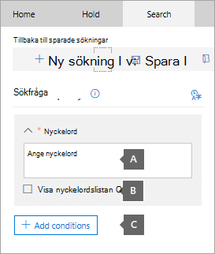
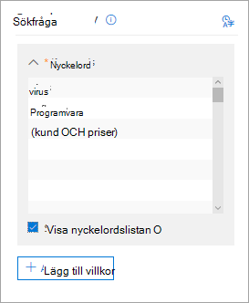
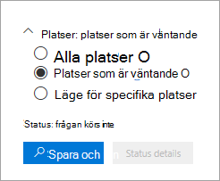
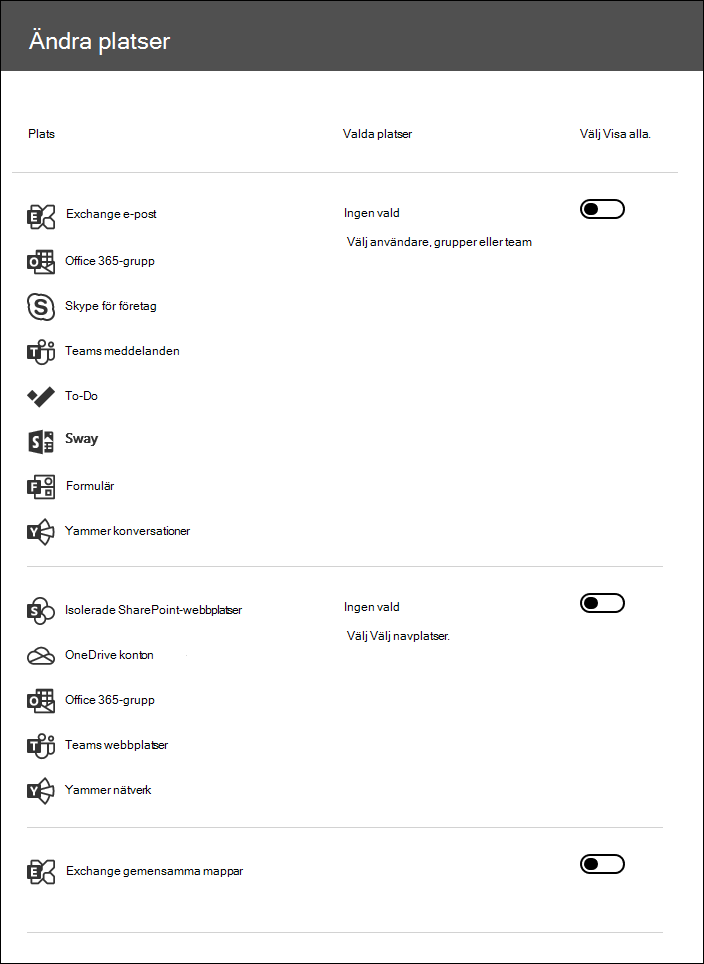

# Söka efter innehåll i ett grundläggande eDiscovery-ärendeSearch for content in a Core eDiscovery case

När ett grundläggande e-dataidentifieringsfall skapas och intressanta personer för ärendet ställs in på en plats kan du skapa och köra en eller flera sökningar efter innehåll som är relevant för ärendet.After a Core eDiscovery case is created and people of interest in the case are placed on hold, you can create and run one or more searches for content relevant to the case. Sökningar som är kopplade till ett grundläggande eDiscovery-ärende visas inte på sidan Innehållssökning i Microsoft 365 efterlevnadscenter. Searches associated with a Core eDiscovery case aren't listed on the **Content search** page in the Microsoft 365 compliance center. De här sökningarna visas på **sidan** Sökningar i det grundläggande eDiscover-fall som sökningarna är associerade med.These searches are listed on the **Searches** page of the Core eDiscover case the searches are associated with. Det innebär också att sökningar kopplade till ett ärende endast kan nås av ärendemedlemmarna.This also means that searches associated with a case can only be accessed by case members.

Så här skapar du en grundläggande eDiscovery-sökning:To create a Core eDiscovery search:
  
1. Gå till [https://compliance.microsoft.com](https://compliance.microsoft.com) och logga in med inloggningsuppgifterna för användarkontot som har tilldelats lämpliga eDiscovery-behörigheter.Go to [https://compliance.microsoft.com](https://compliance.microsoft.com) and sign in using the credentials for user account that has been assigned the appropriate eDiscovery permissions.

2. I det vänstra navigeringsfönstret i Microsoft 365 kompatibilitetscenter klickar du på Visa alla **och** sedan på **eDiscovery > Core**.In the left navigation pane of the Microsoft 365 compliance center, click **Show all**, and then click **eDiscovery > Core**.

3. På sidan **Bas-e-dataidentifiering** markerar du det ärende som du vill skapa en associerad sökning i och klickar sedan på **Öppna ärende.**On the **Core eDiscovery** page, select the case that you want to create an associated search, and then click **Open case**.

4. På **startsidan för** ärendet klickar du på **fliken** Sökningar.On the **Home** page for the case, click the **Searches** tab.
  
5. Klicka på **Ny** sökning på **sidan Sök.**On the **Search** page, click **New search**.

6. På sidan **Ny sökning** kan du lägga till nyckelord och villkor för att skapa sökfrågan.On the **New search** page, you can add keywords and conditions to create the search query. 

    
  
   a.a. Du kan ange nyckelord, meddelandeegenskaper, till exempel datum för skickade och mottagna meddelanden eller dokumentegenskaper, t.ex. filnamn eller det datum då ett dokument senast ändrades.You can specify keywords, message properties, such as sent and received dates, or document properties, such as file names or the date that a document was last changed. Du kan använda mer komplexa frågor som använder en boolesk operator, som **AND**, **OR,** **NOT** eller **NEAR.**You can use more complex queries that use a Boolean operator, such as **AND**, **OR**, **NOT**, or **NEAR**. Du kan också söka efter känslig information (till exempel personnummer) i dokument eller söka efter dokument som har delats externt.You can also search for sensitive information (such as social security numbers) in documents, or search for documents that have been shared externally. Om du lämnar nyckelordsrutan tom inkluderas allt innehåll på de angivna innehållsplatserna i sökresultatet.If you leave the keyword box empty, all content located in the specified content locations will be included in the search results.

   b.b. Du kan klicka på **kryssrutan Visa nyckelordslista** och skriva ett nyckelord på varje rad.You can click the **Show keyword list** check box and the type a keyword in each row. Om du gör det kopplas nyckelorden på varje rad av **operatorn** ELLER i sökfrågan som skapas.If you do this, the keywords on each row are connected by the **OR** operator in the search query that's created. Du kan ange högst 20 nyckelord i listan.You can enter a maximum of 20 keywords to the list.

    
  
    Varför ska jag använda nyckelordslistan?Why use the keyword list? Du kan få statistik som visar hur många objekt som matchar varje nyckelord.You can get statistics that show how many items match each keyword. Det kan hjälpa dig att snabbt identifiera vilka nyckelord som är mest (och minst) effektiva.This can help you quickly identify which keywords are the most (and least) effective. Du kan också använda en nyckelordsfras (omgivet av parenteser) i en rad.You can also use a keyword phrase (surrounded by parentheses) in a row. Mer information om sökstatistik finns i Visa [nyckelordsstatistik för innehållssökningsresultat](view-keyword-statistics-for-content-search.md).For more information about search statistics, see [View keyword statistics for Content Search results](view-keyword-statistics-for-content-search.md).

    Mer information om hur du använder listan nyckelord finns i [Skapa en sökfråga.](content-search.md#building-a-search-query)For more information about using the keywords list, see [Building a search query](content-search.md#building-a-search-query).

   c.c. Du kan klicka **på Villkor** och lägga till villkor i en sökfråga för att begränsa en sökning och returnera en mer förfinad uppsättning resultat.You can click **Conditions** and add conditions to a search query to narrow a search and return a more refined set of results. Varje villkor lägger till en sats i KQL-sökfrågan som skapas och körs när du startar sökningen.Each condition adds a clause to the KQL search query that is created and run when you start the search. Ett villkor är logiskt kopplat till nyckelordsfrågan (anges i nyckelordsrutan) av **operatorn OCH.**A condition is logically connected to the keyword query (specified in the keyword box) by the **AND** operator. Det innebär att objekt måste uppfylla både nyckelordsfrågan och varje villkor som ska tas med i resultatet.That means that items have to satisfy both the keyword query and each condition to be included in the results. Så här kan du begränsa resultatet.This is how conditions help to narrow your results.

    Mer information om hur du skapar en sökfråga och använder villkor finns [i Nyckelordsfrågor för innehållssökning.](keyword-queries-and-search-conditions.md)For more information about creating a search query and using conditions, see [Keyword queries for Content Search](keyword-queries-and-search-conditions.md).

7. Under **Platser: platser som är platser i** lager väljer du de innehållsplatser som du vill söka efter.Under **Locations: locations on hold**, choose the content locations that you want to search. Du kan söka i postlådor, webbplatser och gemensamma mappar i samma sökning.You can search mailboxes, sites, and public folders in the same search.

    
  
    - **Alla platser**.**All locations**. Välj det här alternativet om du vill söka på alla innehållsplatser i organisationen.Select this option to search all content locations in your organization. När du väljer det här alternativet kan du välja att söka i alla Exchange-postlådor (som innehåller postlådor för alla Microsoft Teams-, Yammer-grupper och Office 365-grupper), alla SharePoint- och OneDrive för företag-webbplatser (som innehåller webbplatser för alla Microsoft Teams-, Yammer-grupper och Office 365-grupper) och alla gemensamma mappar.When you select this option, you can choose to search all Exchange mailboxes (which includes the mailboxes for all Microsoft Teams, Yammer Groups, and Office 365 Groups), all SharePoint and OneDrive for Business sites (which includes the sites for all Microsoft Teams, Yammer Groups, and Office 365 Groups), and all public folders.
    
    - **Alla platser som är väntande**.**All locations on hold**. Välj det här alternativet om du vill söka igenom alla innehållsplatser som har satts på plats för e-dataidentifiering i det här fallet.Select this option to search all the content locations that have been placed on eDiscovery hold in the case. Om ärendet innehåller flera spärrade objekt genomsöks innehållsplatserna från alla platser.If the case contains multiple holds, the content locations from all holds will be searched. Om en innehållsplats dessutom har placerats på ett frågebaserat håll kommer endast objekt som är på plats att genomsökas när du kör den innehållssökning som du skapar i det här steget.Additionally, if a content location was placed on a query-based hold, only the items that are on hold will be searched when you run the content search that you're creating in this step. Om en användare till exempel placerades i ett frågebaserat ärende som bevarar objekt som skickades eller skapades före ett visst datum skulle bara de objekten genomsökas.For example, if a user was placed on query-based case hold that preserves items that were sent or created before a specific date, only those items would be searched. Detta sker genom att koppla frågan om ärendesök och innehållssökningsfrågan via en **OCH-operator.**This is accomplished by connecting the case hold query and the content search query by an **AND** operator. Mer information finns i [Söka efter platser vid eDiscovery-hold.](create-ediscovery-holds.md#search-locations-on-ediscovery-hold)For more information, see [Search locations on eDiscovery hold](create-ediscovery-holds.md#search-locations-on-ediscovery-hold).
    
    - **Specifika platser**.**Specific locations**. Välj det här alternativet för att välja de postlådor och webbplatser som du vill söka i.Select this option to select the mailboxes and sites that you want to search. När du väljer det här alternativet **och klickar på** Ändra visas en lista över platser.When you select this option and click **Modify**, a list of locations appears. Du kan välja att söka efter användare, grupper, team eller webbplatser.You can choose to search any or all users, groups, teams, or site locations. Du kan också söka i organisationens gemensamma mappar.You can also search the public folders in your organization.
    
      
  
     Om du väljer det här alternativet och söker efter en plats med innehåll som är på plats, tillämpas inte frågor från ett frågebaserat ärendeknöjt på sökfrågan.If you select this option and search any content location that's on hold, any query from a query-based case hold won't be applied to the search query. Med andra ord genomsöks allt innehåll, inte bara det innehåll som bevaras av ett frågebaserat ärendefrågek.In other words, all content is searched, not just the content that's preserved by a query-based case hold.

8. När du har valt innehållsplatser att söka på klickar du på **Klar** och sedan på **Spara**.After you select the content locations to search, click **Done** and then click **Save**.

9. På sidan **Ny sökning** klickar du på Spara **& kör** och anger sedan ett namn för sökningen.On the **New search** page, click **Save & run** and then type a name for the search. Sökningar som är kopplade till ett grundläggande eDiscovery-ärende måste ha namn som är unika i Office 365 organisation.Searches associated with a Core eDiscovery case must have names that are unique within your Office 365 organization.

10. Klicka **på** Spara för att spara sökinställningarna och starta sökningen.Click **Save** to save the search settings and start the search.

  När sökningen är klar kan du förhandsgranska sökresultaten.After the search is completed, you can preview the search results. Om det behövs klickar **du** på Uppdatera **på sidan** Sökningar för att visa sökningen som du skapade i listan.If necessary, click **Refresh** on the **Searches** page to display the search you created in the list.

11. Klicka på sökningen för att visa den utfällande sidan, som innehåller statistik om sökningen och för att utföra andra uppgifter som att visa sökstatistik och exportera sökresultaten.Click the search to display the flyout page, which contains statistics about the search and to perform other tasks such as viewing search statistics and exporting the search results.

## Mer information om hur du söker efter innehållsplatserMore information about searching content locations

- När du klickar **på Välj användare, grupper** eller team för att ange postlådor att söka i är postlådeväljaren som visas tom.When you click **Choose users, groups, or teams** to specify mailboxes to search, the mailbox picker that's displayed is empty. Det här är för att förbättra prestandan.This is by design to enhance performance. Om du vill lägga till mottagare i listan klickar du på Välj **användare,** grupper eller team , skriver ett namn (minst 3 tecken) i sökrutan, markerar kryssrutan bredvid namnet och klickar sedan på **Välj**.To add recipients to this list, click **Choose users, groups, or teams**, type a name (a minimum of 3 characters) in the search box, select the check box next to the name, and then click **Choose**.

- Du kan lägga till inaktiva postlådor, Microsoft Teams, Yammer-grupper, Office 365-grupper och distributionsgrupper i listan med postlådor att söka i.You can add inactive mailboxes, Microsoft Teams, Yammer Groups, Office 365 Groups, and distribution groups to the list of mailboxes to search. Dynamiska distributionsgrupper stöds inte.Dynamic distribution groups aren't supported. Om du lägger Microsoft Teams, Yammer Grupper eller Office 365 Grupper genomsöks grupp- eller grupppostlådan. Postlådorna för gruppmedlemmarna genomsöks inte.If you add Microsoft Teams, Yammer Groups, or Office 365 Groups, the group or team mailbox is searched; the mailboxes of the group members aren't searched.

- Om du vill lägga till **webbplatser klickar du** på Välj **webbplatser** , klickar på Välj webbplatser igen och skriver sedan webbadressen för varje webbplats som du vill söka efter.To add sites click **Choose sites**, click **Choose sites** again, and then type the URL for each site that you want to search. Du kan också lägga till URL-adressen för en SharePoint för ett Microsoft-team, en Yammer grupp eller en Office 365 grupp.You can also add the URL for the SharePoint site for a Microsoft Team, a Yammer Group, or an Office 365 Group.
