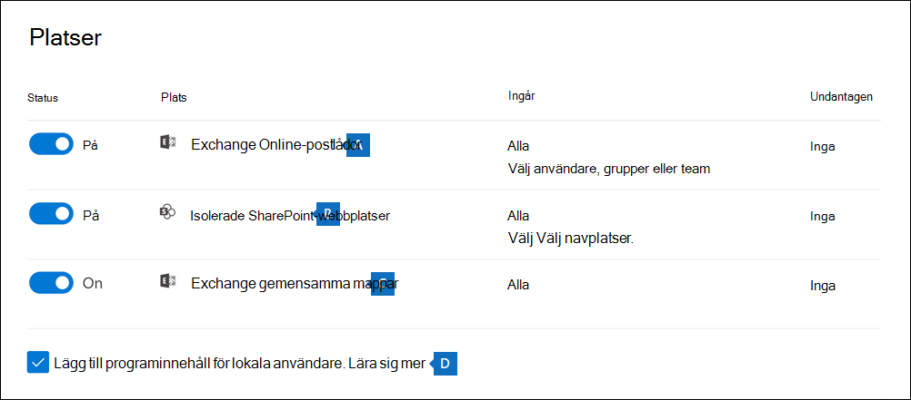

# Söka efter innehåll i ett grundläggande eDiscovery-ärende

När ett grundläggande e-dataidentifieringsfall skapas och intressanta personer för ärendet ställs in på en plats kan du skapa och köra en eller flera sökningar efter innehåll som är relevant för ärendet. Sökningar som är kopplade till ett grundläggande eDiscovery-ärende visas inte på sidan Innehållssökning i Microsoft 365 efterlevnadscenter.  De här sökningarna visas på **sidan** Sökningar i det grundläggande eDiscover-fall som sökningarna är associerade med. Det innebär också att sökningar kopplade till ett ärende endast kan nås av ärendemedlemmarna.

Så här skapar du en grundläggande eDiscovery-sökning:
  
1. Gå till och logga in med autentiseringsuppgifterna för användarkontot som har tilldelats lämpliga <https://compliance.microsoft.com> eDiscovery-behörigheter och är medlem i ärendet.

2. I det vänstra navigeringsfönstret i Microsoft 365 kompatibilitetscenter klickar du på Visa alla **och** sedan på **eDiscovery > Core**.

3. På sidan **Bas-e-dataidentifiering** markerar du det ärende som du vill skapa en associerad sökning i och klickar sedan på **Öppna ärende.**

4. På startsidan **för** ärendet klickar du på fliken **Sökningar** och sedan på **Ny sökning**.

   

   > [!NOTE]
   > Med **alternativet Sök efter ID kan** du söka efter specifika e-postmeddelanden och andra postlådeobjekt med hjälp av en lista Exchange ID:n. Om du vill skapa en sökning med en ID-lista skickar du en fil med kommaavgränsade värden (CSV) som identifierar de specifika postlådeobjekt som du vill söka efter. Anvisningar finns i [Förbereda en CSV-fil för en ID-listsökning](csv-file-for-an-id-list-content-search.md).

5. Skriv **ett namn för** sökningen i guiden Ny sökning och en valfri beskrivning som hjälper dig att identifiera sökningen. Namnet på sökningen måste vara unikt i din organisation.

6. På **sidan Platser** väljer du de innehållsplatser som du vill söka efter. Du kan söka i postlådor, webbplatser och gemensamma mappar.

    
  
   1. **Exchange postlådor**: Ställ in växlingsknappen på På och klicka sedan på Välj  **användare,** grupper eller team för att ange vilka postlådor som ska vara i paus. Använd sökrutan för att hitta användarnas postlådor och distributionsgrupper (för att skapa ett väntande på postlådorna för gruppmedlemmar). Du kan också söka i postlådan som är kopplad till ett Microsoft Team (efter kanalmeddelanden), Office 365 Grupp och Yammer Grupp. Mer information om programdata som lagras i postlådor finns i [Innehåll lagrat i postlådor för eDiscovery.](what-is-stored-in-exo-mailbox.md)

   2. **SharePoint webbplatser**: Ställ in växlingsknappen på  På och klicka sedan på Välj webbplatser för att SharePoint ange vilka OneDrive-konton som ska vara i paus.  Skriv URL-adressen för varje webbplats som du vill skapa en plats för. Du kan också lägga till URL-adressen för SharePoint-webbplats för ett Microsoft-team, en Office 365 grupp eller en Yammer grupp.
  
   3. **Exchange mappar :** Ställ in växlingsknappen på **På** om du vill att alla gemensamma mappar Exchange Online organisationen ska vara i holden. Du kan inte välja att vissa gemensamma mappar ska vara på plats. Låt växlingsknappen vara inaktiverad om du inte vill använda gemensamma mappar.
  
   4. Låt den här kryssrutan vara markerad för Teams innehåll för lokala användare. Om du till exempel söker i alla Exchange-postlådor i organisationen och den här kryssrutan är markerad inkluderas det molnbaserade lagringsutrymme som används för att lagra Teams-chattdata för lokala användare i sökningen. Mer information finns i [Söka efter Teams chattdata för lokala användare](search-cloud-based-mailboxes-for-on-premises-users.md).

7. På sidan **Definiera dina sökvillkor** skriver du en nyckelordsfråga och lägger till villkor i sökfrågan om det behövs.

   

   1. Ange nyckelord, meddelandeegenskaper som datum för skickade och mottagna meddelanden, eller dokumentegenskaper som filnamn eller datum då ett dokument senast ändrades. Du kan använda mer komplexa frågor som innehåller booleska operatorer som **AND**, **OR**, **NOT**, och **NEAR**. Om du lämnar nyckelordsrutan tom inkluderas allt innehåll på den angivna innehållsplatsen i sökresultatet. Mer information finns i [Nyckelordsfrågor och sökvillkor för eDiscovery.](keyword-queries-and-search-conditions.md)

   2. Alternativt kan du klicka på kryssrutan **Visa nyckelordlista** och skriva ett nyckelord på varje rad. Om du gör det kopplas nyckelorden på varje rad samman med en logisk operator (**c:s**) som fungerar ungefär som operatorn **OR** i sökfrågan som skapas.

      Varför ska jag använda nyckelordslistan? Du kan få statistik som visar hur många objekt som matchar varje nyckelord. Det kan hjälpa dig att snabbt ta reda på vilka nyckelord som är mest (och minst) effektiva. Du kan också använda en nyckelordsfras (omgiven av parenteser) på en rad. Mer information om nyckelordslistan och sökstatistik finns i Hämta [nyckelordsstatistik för sökningar](view-keyword-statistics-for-content-search.md#get-keyword-statistics-for-searches).

      > [!NOTE]
      > För att minska problemen som orsakas av stora nyckelordslistor är du begränsad till högst 20 rader i nyckelordslistan.

   3. Du kan lägga till sökvillkor för att begränsa sökningen och returnera en mer förfinad uppsättning resultat. Varje villkor lägger till en sats i sökfrågan som skapas och körs när du startar sökningen. Ett villkor kopplas till nyckelordsfrågan (anges i nyckelordsrutan) med en logisk operator (**c:c**) som fungerar ungefär som operatorn **AND**. Det innebär att objekten måste uppfylla både nyckelordsfrågan och ett eller flera villkor för att tas med i resultatet. Det är så du begränsar resultatet med hjälp av villkor. En lista och en beskrivning av villkoren som du kan använda i en sökfråga finns i [Sökvillkor](keyword-queries-and-search-conditions.md#search-conditions).

8. Granska sökinställningarna (och redigera om det behövs) och skicka sedan sökningen för att starta den.

När sökningen är klar kan du förhandsgranska sökresultaten. Om det behövs klickar **du på** Uppdatera på **sidan Sökningar** för att visa sökningen som du skapade.

## Mer information om hur du söker efter innehållsplatser

- När du klickar **på Välj användare, grupper** eller team för att ange postlådor att söka i är postlådeväljaren som visas tom. Det här är för att förbättra prestandan. Om du vill lägga till mottagare i listan klickar du på Välj **användare,** grupper eller team , skriver ett namn (minst tre tecken) i sökrutan, markerar kryssrutan bredvid namnet och klickar sedan på **Välj**.

- Du kan lägga till inaktiva postlådor, Microsoft Teams, Yammer-grupper, Office 365-grupper och distributionsgrupper i listan med postlådor att söka i. Dynamiska distributionsgrupper stöds inte. Om du lägger Microsoft Teams, Yammer Grupper eller Office 365 Grupper genomsöks grupp- eller grupppostlådan. Postlådorna för gruppmedlemmarna genomsöks inte.

- Om du vill lägga till webbplatser i sökningen aktiverar du växlingsknappen och klickar sedan på **Välj webbplatser**. Skriv URL:en för varje webbplats som du vill söka i. Du kan också lägga till URL-adressen för en SharePoint för ett Microsoft-team, en Yammer grupp eller en Office 365 grupp.
