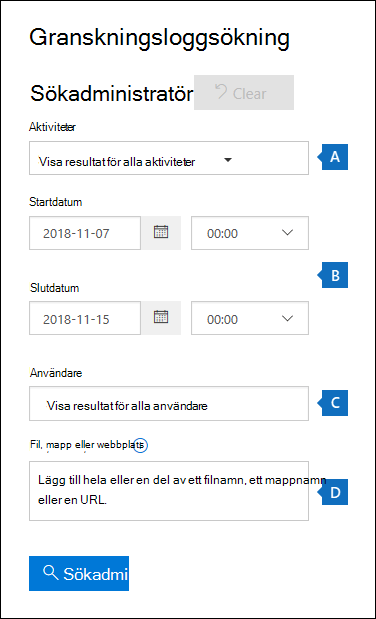
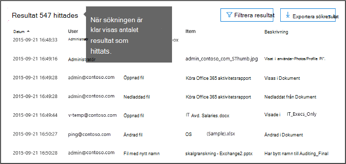
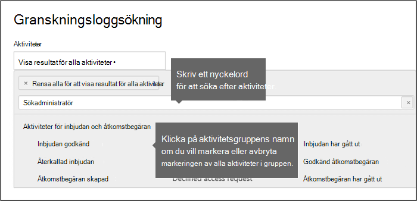
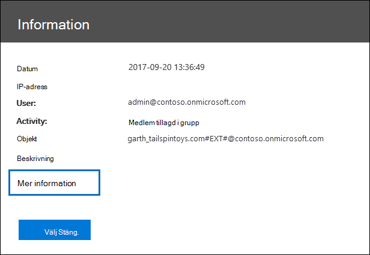
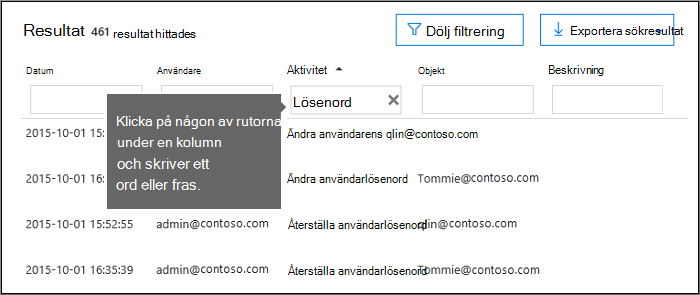
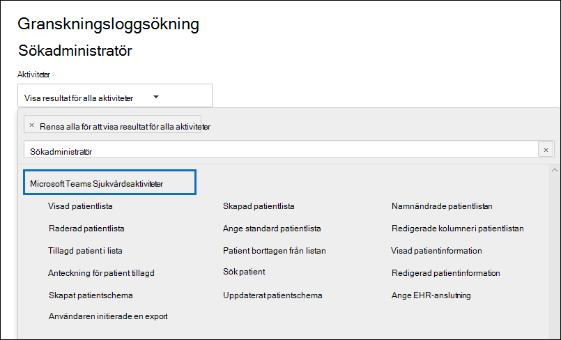
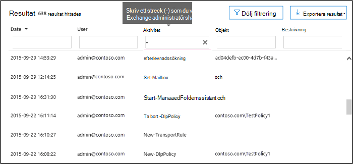

# <a name="search-the-audit-log-in-the-compliance-center"></a>Söka i granskningsloggen i Efterlevnadscenter

Behöver du ta reda på om en användare har visat ett visst dokument eller tagit bort ett objekt från postlådan? I så fall kan du använda Microsoft 365 Efterlevnadscenter för att söka i den enhetliga granskningsloggen för att visa användar- och administratörsaktivitet i organisationen. Varför en enhetlig granskningslogg? Därför att du kan söka efter följande typer av [användar- och administratörsaktivitet](#audited-activities) i Microsoft 365:

- Användaraktivitet i SharePoint Online och OneDrive för företag
- Användaraktivitet i Exchange Online (granskningsloggning för Exchange-postlåda)
- Administratörsaktivitet i SharePoint Online
- Administratörsaktivitet i Azure Active Directory (katalogtjänsten för Microsoft 365)
- Administratörsaktivitet i Exchange Online (granskningsloggning för Exchange-administratör)
- eDiscovery-aktiviteter i Säkerhets- och efterlevnadscenter
- Användar- och administratörsaktivitet i Power BI
- Användar- och administratörsaktivitet i Microsoft Teams
- Användar- och administratörsaktivitet i Dynamics 365
- Användar- och administratörsaktivitet i Yammer
- Användar- och administratörsaktivitet i Microsoft Power Automate
- Användar- och administratörsaktivitet i Microsoft Stream
- Analytiker- och administratörsaktivitet i Microsoft Workplace Analytics
- Användar- och administratörsaktivitet i Microsoft Power Apps
- Användar- och administratörsaktivitet i Microsoft Forms
- Användar- och administratörsaktivitet för känslighetsetiketter för webbplatser som använder SharePoint Online eller Microsoft Teams
- Administratörsaktivitet i Briefing-e-post och MyAnalytics

## <a name="requirements-to-search-the-audit-log"></a>Krav för att söka i granskningsloggen

Läs följande innan du börjar söka i granskningsloggen.

- Granskningsloggsökning är som standard aktiverat för Microsoft 365- och Office 365 Enterprise-organisationer. Det omfattar även organisationer med prenumerationer på E3/G3 eller E5/G5. Kontrollera att granskningsloggsökning är aktiverat genom att köra följande kommando i Exchange Online PowerShell:

  ```powershell
  Get-AdminAuditLogConfig | FL UnifiedAuditLogIngestionEnabled
  ```

  Värdet `True` för egenskapen *UnifiedAuditLogIngestionEnabled* anger att granskningsloggsökning är aktiverat. Du kan läsa mer i [Aktivera och inaktivera granskningsloggsökning](turn-audit-log-search-on-or-off.md).

- Du måste ha tilldelats rollen Skrivskyddade granskningsloggar eller Granskningsloggar i Exchange Online för att söka i granskningsloggen. Som standard tilldelas de här rollerna till rollgrupperna Efterlevnadshantering och Organisationshantering på sidan **Behörigheter** i administrationscentret för Exchange. Observera att globala administratörer i Office 365 och Microsoft 365 automatiskt läggs till som medlemmar i rollgruppen Organisationshantering i Exchange Online. Om du vill ge en användare möjlighet att söka i granskningsloggen med den lägsta graden av behörighet kan du skapa en anpassad rollgrupp i Exchange Online, lägga till rollen Skrivskyddade granskningsloggar eller Granskningsloggar och sedan lägga till användaren som medlem i den nya rollgruppen. Mer information finns i [Hantera rollgrupper i Exchange Online](/Exchange/permissions-exo/role-groups).

  > [!IMPORTANT]
  > Om du tilldelar en användare rollen Skrivskyddade granskningsloggar eller Granskningsloggar på sidan **Behörigheter** i Säkerhets- och efterlevnadscenter kan de inte söka i granskningsloggen. Du måste tilldela behörigheterna i Exchange Online. Det beror på att den underliggande cmdleten som används för att söka i granskningsloggen är en Exchange Online-cmdlet.

- När en granskad aktivitet utförs av en användare eller administratör skapas en granskningspost som lagras i granskningsloggen för organisationen. Hur länge en granskningspost behålls (och är sökbar i granskningsloggen) beror på din Office 365- eller Microsoft 365 Enterprise-prenumeration, och specifikt vilken typ av licens som tilldelas till specifika användare.

  - För användare som har tilldelats en Office 365 E5- eller Microsoft 365 E5-licens (eller användare med tilläggslicens för Microsoft 365 E5 Compliance eller Microsoft 365 E5 eDiscovery och granskning) behålls granskningsposter för Azure Active Directory-, Exchange- och SharePoint-aktiviteter i ett år som standard. Organisationer kan också skapa kvarhållningsprinciper för granskningsloggar för att behålla granskningsposter för aktiviteter i andra tjänster i upp till ett år. Mer information finns i [Hantera kvarhållningsprinciper för granskningsloggar](audit-log-retention-policies.md).

    > [!NOTE]
    > Om organisationen har deltagit i det privata förhandsgranskningsprogrammet för ett års bevarande av granskningsposter återställs inte kvarhållningens varaktighet för granskningsposter som skapades innan distributionsdatumet för allmän tillgänglighet.

  - För användare som tilldelats andra (inte E5) Office 365- eller Microsoft 365-licenser behålls granskningsposter i 90 dagar. En lista med Office 365- och Microsoft 365-prenumerationer med stöd för enhetlig granskningsloggning finns i [tjänstbeskrivningen för Säkerhets- och efterlevnadscenter](/office365/servicedescriptions/office-365-platform-service-description/office-365-securitycompliance-center).

    > [!NOTE]
    > Även när granskning av postlådor är aktiverad som standard kanske du märker att granskningshändelser för postlådor för vissa användare inte finns i granskningsloggsökningar i Säkerhets- och efterlevnadscenter eller via Office 365 Management Activity-API. Mer information finns i [Mer information om granskningsloggning för postlådor](enable-mailbox-auditing.md#more-information).

- Om du vill inaktivera granskningsloggsökning för organisationen kan du köra följande kommando i den fjärr-PowerShell som är ansluten till din Exchange Online-organisation:

  ```powershell
  Set-AdminAuditLogConfig -UnifiedAuditLogIngestionEnabled $false
  ```

    Om du vill aktivera granskningsloggsökningen igen kan du köra följande kommando i Exchange Online PowerShell:

  ```powershell
  Set-AdminAuditLogConfig -UnifiedAuditLogIngestionEnabled $true
  ```

  Mer information finns i [Inaktivera granskningsloggsökning](turn-audit-log-search-on-or-off.md).

- Som nämnts tidigare är den underliggande cmdleten som används för att söka i granskningsloggen en Exchange Online-cmdlet, som är **Search-UnifiedAuditLog**. Det betyder att du kan använda denna cmdlet för att söka i granskningsloggen istället för att använda sidan **Granskningsloggsökning** i Säkerhets- och efterlevnadscenter. Du måste köra denna cmdlet i en fjärr-PowerShell som är ansluten till din Exchange Online-organisation. Mer information finns i [Search-UnifiedAuditLog](/powershell/module/exchange/search-unifiedauditlog).

  Information om hur du exporterar sökresultatet som returneras av cmdleten **Search-UnifiedAuditLog** till en CSV-fil finns i avsnittet "Tips för att exportera och visa granskningsloggen" i [Exportera, konfigurera och visa granskningsloggposter](export-view-audit-log-records.md#tips-for-exporting-and-viewing-the-audit-log).

- Om du programmässigt vill ladda ned data från granskningsloggen rekommenderar vi att du använder Office 365 Management Activity-API istället för att använda ett PowerShell-skript. Office 365 Management Activity-API är en REST-webbtjänst som du kan använda för att utveckla övervakningslösningar för åtgärder, säkerhet och efterlevnad för din organisation. Mer information finns i [referensen för Office 365 Management Activity-API](/office/office-365-management-api/office-365-management-activity-api-reference).

- Det kan ta upp till 30 minuter eller upp till 24 timmar efter att en händelse inträffat innan motsvarande granskningsloggpost returneras i resultaten för en granskningsloggsökning. I följande tabell visas den tid det tar för olika tjänster i Office 365.

  <br>

  ****

  |Microsoft 365-tjänst eller -funktion|30 minuter|24 timmar|
  |---|:---:|:---:|
  |Defender för Office 365 och Threat Intelligence|||
  |Azure Active Directory (användarinloggningshändelser)|||
  |Azure Active Directory (administratörshändelser)|||
  |Dataförlustskydd|||
  |Dynamics 365 CRM|||
  |eDiscovery|||
  |Exchange Online|||
  |Microsoft Power Automate|||
  |Microsoft Project|||
  |Microsoft Stream|||
  |Microsoft Teams|||
  |Power Apps|||
  |Power BI|||
  |Säkerhets- och efterlevnadscenter|||
  |Känslighetsetiketter|||
  |SharePoint Online och OneDrive för företag|||
  |Workplace Analytics|||
  |Yammer|||
  |Microsoft Forms|||
  |

- Azure Active Directory (Azure AD) är katalogtjänsten för Office 365. Den enhetliga granskningsloggen innehåller användar-, grupp-, program-, domän- och katalogaktiviteter som utförts i administrationscentret för Microsoft 365 eller i Azure-hanteringsportalen. En fullständig lista över Azure AD-händelser finns i [Azure Active Directory-granskningsrapporthändelser](/azure/active-directory/reports-monitoring/concept-audit-logs).

- Granskningsloggning för Power BI är inte aktiverat som standard. Om du vill söka efter Power BI-aktiviteter i granskningsloggen måste du aktivera granskning i administrationsportalen för Power BI. Anvisningar finns i avsnittet "Granskningsloggar" i [Administrationsportal för Power BI](/power-bi/service-admin-portal#audit-logs).

## <a name="search-the-audit-log"></a>Söka i granskningsloggen

Så här söker du i granskningsloggen i Office 365.

[Steg 1: Kör en granskningsloggsökning](#step-1-run-an-audit-log-search)

[Steg 2: Visa sökresultatet](#step-2-view-the-search-results)

[Steg 3: Filtrera sökresultatet](#step-3-filter-the-search-results)

[Steg 4: Exportera sökresultatet till en fil](#step-4-export-the-search-results-to-a-file)

### <a name="step-1-run-an-audit-log-search"></a>Steg 1: Kör en granskningsloggsökning

1. Gå till [https://protection.office.com](https://protection.office.com).

    > [!TIP]
    > Använd en privat webbläsarsession (inte en vanlig session) för åtkomst till Säkerhets- och efterlevnadscenter eftersom det gör att de autentiseringsuppgifter du är inloggad med inte används. Om du vill öppna en session för InPrivate-surfning i Internet Explorer eller Microsoft Edge trycker du på Ctrl+Skift+P. Om du vill öppna en privat webbläsarsession i Google Chrome (kallas ett inkognitofönster) trycker du på Ctrl+Skift+N.

2. Logga in med ditt arbets- eller skolkonto.

3. I det vänstra fönstret i Säkerhets- och efterlevnadscenter klickar du på **Sök** och sedan på **Sökning i granskningslogg**.

    Sidan **Sökning i granskningslogg** visas.

    

    > [!NOTE]
    > Du måste först aktivera granskningsloggning innan du kan köra en granskningsloggsökning. Om länken **Starta inspelning av användar- och administratörsaktivitet** visas klickar du på den för att aktivera granskning. Om du inte ser länken har granskning redan aktiverats för organisationen.

4. Konfigurera följande sökvillkor:

   1. **Aktiviteter**: Klicka i listrutan för att visa de aktiviteter som du kan söka efter. Användar- och administratörsaktiviteter är ordnade i grupper av relaterade aktiviteter. Du kan markera specifika aktiviteter eller så kan du klicka på aktivitetsgruppnamnet för att markera alla aktiviteter i gruppen. Du kan också klicka på en markerad aktivitet för att ta bort markeringen. När du har kört sökningen visas bara granskningsloggposterna för de markerade aktiviteterna. Om du markerar **Visa resultat för alla aktiviteter** visas resultat för alla aktiviteter som utförts av den markerade användaren eller gruppen av användare.

      Över 100 användar- och administratörsaktiviteter loggas i granskningsloggen. Klicka på fliken **Granskade aktiviteter** i avsnittet i den här artikeln om du vill se beskrivningar av de olika aktiviteterna för de olika tjänsterna.

   1. **Startdatum** och **Slutdatum**: De senaste sju dagarna är valda som standard. Välj ett datum- och tidsintervall för att visa händelser som inträffat under perioden. Datum och tid visas i lokal tid. Det maximala datumintervall som du kan ange är 90 dagar. Ett felmeddelande visas om det valda datumintervallet är längre än 90 dagar.

      > [!TIP]
      > Om du använder det maximala datumintervallet 90 dagar väljer du aktuell tid som **Startdatum**. I annat fall får du ett felmeddelande om att startdatumet är tidigare än slutdatumet. Om du aktiverat granskningen inom de senaste 90 dagarna kan det maximala datumintervallet inte starta före det datum då granskningen aktiverades.

   1. **Användare**: Klicka i den här rutan och välj sedan en eller flera användare som du vill visa sökresultat för. I resultatlistan visas granskningsloggposterna för den valda aktiviteten som utförts av de användare som du valt i den här rutan. Lämna rutan tom för att returnera poster för alla användare (och tjänstkonton) i organisationen.

   1. **Fil, mapp eller webbplats**: Skriv en del av eller hela fil- eller mappnamnet för att söka efter en aktivitet relaterad till filen eller mappen som innehåller det angivna nyckelordet. Du kan också ange en URL-adress till en fil eller mapp. Se till att skriva den fullständiga URL-sökvägen om du använder en URL-adress. Om du skriver en del av URL-adressen ska du inte ta med några specialtecken eller blanksteg.

      Lämna rutan tom för att returnera poster för alla filer eller mappar i organisationen.

      > [!TIP]
      >
      > - Om du letar efter alla aktiviteter som är relaterade till en **webbplats** lägger du till jokerteckensymbolen (\*) efter URL-adressen för att returnera alla poster för webbplatsen, till exempel `"https://contoso-my.sharepoint.com/personal*"`.
      >
      > - Om du letar efter alla aktiviteter som är relaterade till en **fil** lägger du till jokerteckensymbolen (\*) före filnamnet för att returnera alla poster för filen, till exempel `"*Customer_Profitability_Sample.csv"`.

5. Klicka på **Sök** för att köra sökningen med dina sökvillkor.

   Sökresultaten läses in och efter en liten stund visas de under **Resultat**. När sökningen är klar visas antal hittade resultat. Högst 5 000 händelser visas i fönstret **Resultat** i steg om 150 händelser. Om fler än 5 000 händelser uppfyller sökvillkoren visas de senaste 5 000 händelserna.

   

#### <a name="tips-for-searching-the-audit-log"></a>Tips för att söka i granskningsloggen

- Genom att klicka på aktivitetsnamnet kan du välja specifika aktiviteter att söka efter. Du kan också söka efter alla aktiviteter i en grupp (till exempel **Fil- och mappaktiviteter**) genom att klicka på gruppnamnet. Om en aktivitet är markerad kan du klicka på den om du vill ta bort markeringen. Du kan också använda sökrutan för att visa de aktiviteter som innehåller nyckelordet som du skriver.

  

- Du måste markera **Visa resultat för alla aktiviteter** i listan **Aktiviteter** för att visa poster från granskningsloggen för Exchange-administratören. Händelser från den här granskningsloggen visar ett cmdlet-namn (till exempel **Set-Mailbox**) i kolumnen **Aktivitet** i resultatet. Om du vill ha mer information klickar du på fliken **Granskade aktiviteter** i det här avsnittet och klickar sedan på **Exchange-administratörsaktiviteter**.

  På samma sätt finns det vissa granskningsaktiviteter som inte har motsvarande objekt i listan **Aktiviteter**. Om du vet namnet på åtgärden för dessa aktiviteter kan du söka efter alla aktiviteter och sedan filtrera resultaten genom att skriva namnet på åtgärden i rutan för kolumnen **Aktivitet**. Läs [Steg 3: Filtrera sökresultatet](#step-3-filter-the-search-results) om du vill ha mer information om filtrering av resultaten.

- Klicka på **Rensa** för att ta bort aktuella sökvillkor. Datumintervallet återgår till standardvärdet som är de senaste sju dagarna. Du kan också klicka på **Avmarkera allt om du vill visa resultat för alla aktiviteter** för att avbryta alla markerade aktiviteter.

- Om 5 000 resultat hittas kan du antagligen förutsätta att det finns fler än 5 000 händelser som uppfyller sökvillkoren. Du kan förfina sökvillkoren och köra sökningen igen för att få färre sökresultat eller så kan du exportera alla sökresultat genom att välja **Exportera resultat** \> **Ladda ned alla resultat**.

### <a name="step-2-view-the-search-results"></a>Steg 2: Visa sökresultatet

Resultatet för en granskningslogg visas under **Resultat** på sidan **Granskningsloggsökning**. Som tidigare nämnt visas som högst 5 000 händelser (de senaste) i steg om 150 händelser. Om du vill visa fler händelser kan du använda rullningslisten i fönstret **Resultat** eller så kan du trycka på **Skift + End** för att visa de nästa 150 händelserna.

Resultatet innehåller följande information om varje händelse som returneras av sökningen:

- **Datum**: Datum och tid (i lokal tid) när händelsen inträffade.

- **IP-adress**: IP-adressen för den enhet som användes när aktiviteten loggades. IP-adressen visas i IPv4- eller IPv6-adressformat.

   > [!NOTE]
  > För vissa tjänster kan värdet som visas i det här fältet vara IP-adressen för ett betrott program (till exempel Office på webben-appar) som anropar tjänsten för en användare och inte IP-adressen för den enhet som används av personen som utförde aktiviteten. För en administratörsaktivitet (eller en aktivitet som utförs av ett systemkonto) för Azure Active Directory-relaterade händelser loggas inte IP-adressen, och värdet som visas i det här fältet är `null`.

- **Användare**: Användaren (eller tjänstkontot) som utförde åtgärden som utlöste händelsen.

- **Aktivitet**: Den aktivitet som användaren utförde. Det här värdet motsvarar de aktiviteter som du valde i listrutan **Aktiviteter**. För en händelse från granskningsloggen för Exchange-administratören är värdet i den här kolumnen en Exchange-cmdlet.

- **Objekt**: Objektet som skapades eller ändrades som ett resultat av motsvarande aktivitet. Exempelvis den fil som visades eller ändrades eller det användarkonto som uppdaterades. Alla aktiviteter har inte ett värde i den här kolumnen.

- **Information**: Ytterligare information om en aktivitet. Inte heller här har alla aktiviteter ett värde.

> [!TIP]
> Klicka på en kolumnrubrik under **Resultat** för att sortera resultatet. Du kan sortera resultatet från A till Ö eller Ö till A. Klicka på rubriken **Datum** för att sortera resultatet från äldst till nyast och nyast till äldst.

#### <a name="view-the-details-for-a-specific-event"></a>Visa information för en viss händelse

Du kan visa mer information om en händelse genom att klicka på händelseposten i listan med sökresultat. Sidan **Information** visas som innehåller detaljerade egenskaper från händelseposten. Vilka egenskaper som visas beror på tjänsten där händelsen inträffar. Klicka på **Mer information** om du vill visa denna information. Beskrivningar finns i [Detaljerade egenskaper i granskningsloggen](detailed-properties-in-the-office-365-audit-log.md).



### <a name="step-3-filter-the-search-results"></a>Steg 3: Filtrera sökresultatet

Förutom att sortera kan du också filtrera resultatet av en granskningsloggsökning. Det här är en användbar funktion som kan hjälpa dig att snabbt filtrera resultatet för en viss användare eller aktivitet. Du kan först skapa en bred sökning och sedan snabbt filtrera resultatet för att visa särskilda händelser. Därefter kan du begränsa sökvillkoren och köra sökningen igen för att få ett mer kortfattat resultat.

Så här filtrerar du resultatet:

1. Kör en granskningsloggsökning.

2. När resultatet visas klickar du på **Filtrera resultat**.

   Nyckelordsrutor visas under varje kolumnrubrik.

3. Klicka på någon av rutorna under en kolumnrubrik och skriv ett ord eller en fras, beroende på vilken kolumn du filtrerar på. Resultatet justeras dynamiskt och visar händelser som matchar filtret.

   

4. Om du vill rensa ett filter klickar du på **X** i filterrutan eller klickar på **Dölj filtrering**.

> [!TIP]
> Om du vill visa händelser från granskningsloggen för Exchange-administratören skriver du **-** (tankstreck) i filterrutan **Aktivitet**. Då visas cmdlet-namn som visas i kolumnen **Aktivitet** för Exchange-administratörshändelser. Du kan sedan sortera cmdlet-namnen i alfabetisk ordning.

### <a name="step-4-export-the-search-results-to-a-file"></a>Steg 4: Exportera sökresultatet till en fil

Du kan exportera resultatet av en granskningsloggsökning till en fil med kommaavgränsade värden (CSV) på den lokala datorn. Du kan öppna den här filen i Microsoft Excel och använda funktioner som att söka, sortera, filtrera och dela en enstaka kolumn (som innehåller flera egenskaper) i flera kolumner.

1. Kör en granskningsloggsökning och ändra sedan sökvillkoren tills du fått önskat resultat.

2. Klicka på **Exportera resultat** och välj något av följande alternativ:

   - **Spara inlästa resultat**: Välj det här alternativet om du vill exportera bara de poster som visas under **Resultat** på sidan **Sökning i granskningslogg**. CSV-filen som laddas ned innehåller samma kolumner (och data) som visas på sidan (Datum, Användare, Aktivitet, Objekt och Information). En extra kolumn (med namnet **Mer**) ingår i CSV-filen och innehåller mer information från granskningsloggposten. Eftersom du exporterar samma resultat som är inlästa (och går att visa) på sidan **Sökning i granskningslogg** exporteras högst 5 000 poster.

   - **Ladda ned alla resultat**: Välj det här alternativet om du vill exportera alla poster från granskningsloggen som uppfyller sökvillkoren. Om du har en stor uppsättning sökresultat väljer du det här alternativet för att ladda ned alla poster från granskningsloggen utöver de 5 000 granskningsposter som kan visas på sidan **Sökning i granskningslogg**. Det här alternativet laddar ned rådata från granskningsloggen till en CSV-fil och innehåller ytterligare information från granskningsloggposten i en kolumn med namnet **AuditData**. Det kan ta längre tid att ladda ned filen om du väljer det här exportalternativet eftersom filen kan vara mycket större än den som laddas ned om du väljer det andra alternativet.

     > [!IMPORTANT]
     > Du kan ladda ned högst 50 000 poster till en CSV-fil från en enstaka granskningsloggsökning. Om 50 000 poster laddas ned till CSV-filen kan du antagligen förutsätta att det finns fler än 50 000 händelser som uppfyller sökkriterierna. Om du vill exportera fler poster än så kan du prova att använda ett datumintervall för att minska antalet granskningsloggposter. Du kan behöva köra flera sökningar med mindre datumintervall för att exportera mer än 50 000 poster.

3. När du har valt exportalternativ visas ett meddelande längst ned i fönstret som uppmanar dig att öppna CSV-filen, spara den i mappen Hämtade filer eller spara den i en särskild mapp.

#### <a name="more-information-about-exporting-and-viewing-audit-log-search-results"></a>Mer information om hur du exporterar och visar resultat från en granskningsloggsökning

- Om du laddar ned alla sökresultat innehåller CSV-filen en kolumn med namnet **AuditData**, som innehåller ytterligare information om varje händelse. Data i den här kolumnen består av ett JSON-objekt som innehåller flera egenskaper från granskningsloggposten. Varje par med *egenskap:värde* i JSON-objektet avgränsas med kommatecken. Du kan använda transformeringsverktyget för JSON i Power Query-redigeraren i Excel för att dela **AuditData**-kolumnen i flera kolumner så att varje egenskap i JSON-objektet har en egen kolumn. Då kan du sortera och filtrera en eller flera av dessa egenskaper. Stegvisa instruktioner för hur du använder Power Query-redigeraren för att transformera JSON-objektet finns i [Exportera, konfigurera och visa granskningsloggposter](export-view-audit-log-records.md).

  När du delat kolumnen **AuditData** kan du filtrera på kolumnen **Åtgärder** för att visa detaljerade egenskaper för en viss typ av aktivitet.

- Alternativet **Ladda ned alla resultat** laddar ned rådata från granskningsloggen till en CSV-fil. Den här filen innehåller andra kolumnnamn (CreationDate, UserIds, Operation, AuditData) än filen som laddas ned om du väljer alternativet **Spara inlästa resultat**. Värdena i de två olika CSV-filerna för samma aktivitet kan också skilja sig. Till exempel kan aktiviteten i kolumnen **Åtgärd** i CSV-filen ha ett annat värde än det "användarvänliga" namn som visas i kolumnen **Aktivitet** på sidan **Sökning i granskningslogg**. Till exempel MailboxLogin kontra Användare loggade in i postlåda.

- När du laddar ned alla resultat från en sökfråga som innehåller händelser från olika tjänster innehåller kolumnen **AuditData** i CSV-filen olika egenskaper beroende på i vilken tjänst åtgärden utfördes. Poster från till exempel Exchange- och Azure AD-granskningsloggar innehåller en egenskap med namnet **ResultStatus** som anger om åtgärden lyckades eller inte. Den här egenskapen finns inte med för händelser i SharePoint. På samma sätt har SharePoint-händelser en egenskap som identifierar webbplatsadressen för fil- och mapprelaterade aktiviteter. Överväg att använda olika sökningar för att exportera resultat för aktiviteter från en enstaka tjänst för att minimera detta beteende.

  En beskrivning av många av de egenskaper som visas i kolumnen **AuditData** i CSV-filen när du laddar ned alla resultat samt vilken tjänst var och en gäller för finns i [Detaljerade egenskaper i granskningsloggen](detailed-properties-in-the-office-365-audit-log.md).

## <a name="audited-activities"></a>Granskade aktiviteter

I tabellerna i det här avsnittet beskrivs de aktiviteter som granskas i Office 365. Du kan söka efter de här händelserna genom att söka i granskningsloggen i Säkerhets- och efterlevnadscenter.

I de här tabellerna grupperas relaterade aktiviteter eller aktiviteterna från en viss tjänst. Tabellerna innehåller det visningsnamn som visas i listrutan **Aktiviteter** och namnet på tillhörande åtgärd som visas i den detaljerade informationen för en granskningspost och i CSV-filen när du exporterar sökresultatet. Beskrivningar av den detaljerade informationen finns i [Detaljerade egenskaper i granskningsloggen](detailed-properties-in-the-office-365-audit-log.md).

Klicka på någon av länkarna nedan om du vill gå till en viss tabell.

:::row:::
    :::column:::
        [Fil- och sidaktiviteter](#file-and-page-activities)
    :::column-end:::
    :::column:::
        [Mappaktiviteter](#folder-activities)
    :::column-end:::
    :::column:::
        [Aktiviteter för SharePoint-lista](#sharepoint-list-activities)
    :::column-end:::
:::row-end:::

:::row:::
    :::column:::
        [Aktiviteter för delning och åtkomstbegäran](#sharing-and-access-request-activities)
    :::column-end:::
    :::column:::
        [Synkroniseringsaktiviteter](#synchronization-activities)
    :::column-end:::
    :::column:::
        [Aktiviteter för webbplatsbehörigheter](#site-permissions-activities)
    :::column-end:::
:::row-end:::

:::row:::
    :::column:::
        [Aktiviteter för webbplatsadministration](#site-administration-activities)
    :::column-end:::
    :::column:::
        [Aktiviteter i Exchange-postlåda](#exchange-mailbox-activities)
    :::column-end:::
    :::column:::
        [Aktiviteter för användaradministration](#user-administration-activities)
    :::column-end:::
:::row-end:::

:::row:::
    :::column:::
        [Azure Active Directory-aktiviteter för gruppadministration](#azure-ad-group-administration-activities)
    :::column-end:::
    :::column:::
        [Aktiviteter för programadministration](#application-administration-activities)
    :::column-end:::
    :::column:::
        [Aktiviteter för rolladministration](#role-administration-activities)
    :::column-end:::
:::row-end:::

:::row:::
    :::column:::
        [Aktiviteter för katalogadministration](#directory-administration-activities)
    :::column-end:::
    :::column:::
        [eDiscovery-aktiviteter](#ediscovery-activities)
    :::column-end:::
    :::column:::
        [Advanced eDiscovery-aktiviteter](#advanced-ediscovery-activities)
    :::column-end:::
:::row-end:::

:::row:::
    :::column:::
        [Power BI-aktiviteter](#power-bi-activities)
    :::column-end:::
    :::column:::
        [Microsoft Workplace Analytics](#workplace-analytics-activities)
    :::column-end:::
    :::column:::
        [Microsoft Teams-aktiviteter](#microsoft-teams-activities)
    :::column-end:::
:::row-end:::

:::row:::
    :::column:::
        [Hälsovårdsaktiviteter i Microsoft Teams](#microsoft-teams-healthcare-activities)
    :::column-end:::
    :::column:::
        [Arbetspassaktiviteter i Microsoft Teams](#microsoft-teams-shifts-activities)
    :::column-end:::
    :::column:::
        [Yammer-aktiviteter](#yammer-activities)
    :::column-end:::
:::row-end:::

:::row:::
    :::column:::
        [Microsoft Power Automate-aktiviteter](#microsoft-power-automate-activities)
    :::column-end:::
    :::column:::
        [Microsoft Power Apps-aktiviteter](#microsoft-power-apps-activities)
    :::column-end:::
    :::column:::
        [Microsoft Stream-aktiviteter](#microsoft-stream-activities)
    :::column-end:::
:::row-end:::

:::row:::
    :::column:::
        [Aktiviteter i innehållsutforskaren](#content-explorer-activities)
    :::column-end:::
    :::column:::
        [Karantänaktiviteter](#quarantine-activities)
    :::column-end:::
    :::column:::
        [Microsoft Forms-aktiviteter](#microsoft-forms-activities)
    :::column-end:::
:::row-end:::

:::row:::
    :::column:::
        [Aktiviteter i känslighetsetiketter](#sensitivity-label-activities)
    :::column-end:::
    :::column:::
        [Aktiviteter för kvarhållningsprincip och kvarhållningsetikett](#retention-policy-and-retention-label-activities)
    :::column-end:::
    :::column:::
        [Aktiviteter för Briefing-e-post](#briefing-email-activities)
    :::column-end:::
:::row-end:::

:::row:::
    :::column:::
        [MyAnalytics-aktiviteter](#myanalytics-activities)
    :::column-end:::
    :::column:::
        [Aktiviteter för informationsbarriärer](#information-barriers-activities)
    :::column-end:::
    :::column:::
        [Aktiviteter för Exchange-administratör](#exchange-admin-audit-log)
    :::column-end:::
:::row-end:::

### <a name="file-and-page-activities"></a>Fil- och sidaktiviteter

I följande tabell beskrivs fil- och sidaktiviteterna i SharePoint Online och OneDrive för företag.

|Visningsnamn|Åtgärd|Beskrivning|
|:-----|:-----|:-----|
|Öppnad fil|FileAccessed|Användar- eller systemkontot öppnar en fil.|
|(inget)|FileAccessedExtended|Detta är relaterat till aktiviteten "Öppnad fil" (FileAccessed). En FileAccessedExtended-händelse loggas när samma person kontinuerligt har åtkomst till en fil under en längre tid (upp till 3 timmar). <br/><br/> Syftet med att logga FileAccessedExtended-händelser är att minska antalet FileAccessed-händelser som loggas när en fil används kontinuerligt. Det här hjälper till att minska bruset med flera FileAccessed-poster för vad som i princip är samma användaraktivitet, och gör att du kan fokusera på den initiala (och viktigare) FileAccessed-händelsen.|
|Ändrad kvarhållningsetikett för en fil|ComplianceSettingChanged|En kvarhållningsetikett har använts på eller tagits bort från ett dokument. Händelsen utlöses när en kvarhållningsetikett används manuellt eller automatiskt i ett meddelande.|
|Status ändrad till låst|LockRecord|Status för en kvarhållningsetikett som klassificerar ett dokument som en arkivhandling har låsts. Det innebär att dokumentet inte kan ändras eller tas bort. Endast användare som har tilldelats åtminstone behörigheten deltagare för en webbplats kan ändra ett dokuments status.|
|Status ändrad till olåst|UnlockRecord|Status för en kvarhållningsetikett som klassificerar ett dokument som en arkivhandling har låsts upp. Det innebär att dokumentet kan ändras eller tas bort. Endast användare som har tilldelats åtminstone behörigheten deltagare för en webbplats kan ändra ett dokuments status.|
|Incheckad fil|FileCheckedIn|Användaren checkar in ett dokument som de har checkat ut från ett dokumentbibliotek.|
|Utcheckad fil|FileCheckedOut|Användaren checkar ut ett dokument som finns i ett dokumentbibliotek. Användare kan checka ut och göra ändringar i dokument som har delats med dem.|
|Kopierad fil|FileCopied|Användaren kopierar ett dokument från en webbplats. Den kopierade filen kan sparas i en annan mapp på webbplatsen.|
|Borttagen fil|FileDeleted|Användaren tar bort ett dokument från en webbplats.|
|Borttagen fil från papperskorgen|FileDeletedFirstStageRecycleBin|Användaren tar bort en fil från papperskorgen på en webbplats.|
|Borttagen fil från papperskorgen på andra nivån|FileDeletedSecondStageRecycleBin|Användaren tar bort en fil från papperskorgen på andra nivån på en webbplats.|
|Borttagen fil som markerats som en arkivhandling|RecordDelete|Ett dokument eller e-postmeddelande som markerats som en arkivhandling har tagits bort. Ett objekt anses vara en arkivhandling när en kvarhållningsetikett som markerar objekt som en arkivhandling har använts på innehåll.|
|Identifierad felmatchning av dokumentkänslighet|DocumentSensitivityMismatchDetected|En användare laddar upp ett dokument till en webbplats som skyddas med en känslighetsetikett och dokumentet har en känslighetsetikett med högre prioritet än känslighetsetiketten som används på webbplatsen. Till exempel ett dokument med etiketten Konfidentiellt som laddas upp på en webbplats som har etiketten Allmänt.<br/><br/> Den här händelsen utlöses inte om dokumentet har en känslighetsetikett med lägre prioritet än känslighetsetiketten som används på webbplatsen. Till exempel ett dokument med etiketten Allmänt som laddas upp på en webbplats som har etiketten Konfidentiellt. Mer information om prioritet för känslighetsetiketter finns i [Etikettprioritet (ordningen har betydelse)](sensitivity-labels.md#label-priority-order-matters).|
|Identifierade skadlig kod i filen|FileMalwareDetected|SharePoint-antivirusmotorn upptäcker skadlig kod i en fil.|
|Filutcheckningen ignorerades|FileCheckOutDiscarded|Det innebär att alla ändringar de gjort i filen när den var utcheckad ignoreras och sparas inte i versionen av dokumentet i dokumentbiblioteket.|
|Hämtad fil|FileDownloaded|Användaren laddar ned ett dokument från en webbplats.|
|Ändrad fil|FileModified|Användar- eller systemkontot ändrar innehållet eller egenskaperna för ett dokument på en webbplats.|
|(inget)|FileModifiedExtended|Detta är relaterat till aktiviteten "Ändrad fil" (FileModified). En FileModifiedExtended-händelse loggas när samma person kontinuerligt ändrar en fil under en längre tid (upp till 3 timmar). <br/><br/> Syftet med att logga FileModifiedExtended-händelser är att minska antalet FileModified-händelser som loggas när en fil ändras kontinuerligt. Det här hjälper till att minska bruset med flera FileModified-poster för vad som i princip är samma användaraktivitet, och gör att du kan fokusera på den initiala (och viktigare) FileModified-händelsen.|
|Flyttad fil|FileMoved|Användaren flyttar ett dokument från dess aktuella plats på en webbplats till en ny plats.|
|(inget)|FilePreviewed|Användaren förhandsgranskar filer på en SharePoint- eller OneDrive för företag-webbplats. Händelserna inträffar vanligtvis för höga volymer baserade på en enda aktivitet, till exempel visning i ett bildgalleri.|
|Sökfråga utfördes|SearchQueryPerformed|Användar- eller systemkontot utför en sökning i SharePoint eller OneDrive för företag. Några vanliga scenarier där ett tjänstkonto utför en sökfråga är tillämpning av eDiscovery-bevaranden och kvarhållningsprincip på webbplatser och OneDrive-konton, och automatisk tillämpning av kvarhållnings- eller känslighetsetiketter på webbplatsinnehåll.|
|Återvann alla lägre versioner av filen|FileVersionsAllMinorsRecycled|Användaren tar bort alla delversioner från versionshistoriken för en fil. De borttagna versionerna flyttas till webbplatsens papperskorg.|
|Alla versioner av filen återanvänds|FileVersionsAllRecycled|Användaren tar bort alla versioner från filens versionshistorik. De borttagna versionerna flyttas till webbplatsens papperskorg.|
|Version av fil återanvänds|FileVersionRecycled|Användaren tar bort en version från filens versionshistorik. Den borttagna versionen flyttas till webbplatsens papperskorg.|
|Namnändrad fil|FileRenamed|Användaren ändrar namn på ett dokument på en webbplats.|
|Återställd fil|FileRestored|Användaren återställer ett dokument från papperskorgen på en webbplats. |
|Uppladdad fil|FileUploaded|Användaren laddar upp ett dokument till en mapp på en webbplats.|
|Visad sida|PageViewed|Användaren visar en sida på en webbplats. Det här omfattar inte att använda en webbläsare för att visa filer som finns i ett dokumentbibliotek.|
|(inget)|PageViewedExtended|Detta är relaterat till aktiviteten "Visad sida" (PageViewed). En PageViewedExtended-händelse loggas när samma person kontinuerligt visar en webbsida under en längre tid (upp till 3 timmar). <br/><br/> Syftet med att logga PageViewedExtended-händelser är att minska antalet PageViewed-händelser som loggas när en sida visas kontinuerligt. Det här hjälper till att minska bruset med flera PageViewed-poster för vad som i princip är samma användaraktivitet, och gör att du kan fokusera på den initiala (och viktigare) PageViewed-händelsen.|
|Visning signalerad av klienten|ClientViewSignaled|En användares klient (till exempel webbplats eller mobilapp) har signalerat att användaren har visat den angivna sidan. Den här aktiviteten loggas ofta efter en PagePrefetched-händelse för en sida. <br/><br/>**Obs!** Eftersom ClientViewSignaled-händelser signaleras av klienten, istället för av servern, är det möjligt att händelsen inte loggas av servern och därför kanske inte visas i granskningsloggen. Det är också möjligt att information i granskningsposten inte är tillförlitlig. Eftersom användarens identitet valideras av den token som används för att skapa signalen är dock användarens identitet som visas i motsvarande granskningspost korrekt. |
|(inget)|PagePrefetched|En användares klient (till exempel webbplats eller mobilapp) har begärt den angivna sida för att förbättra prestanda om användaren bläddrar till den. Händelsen loggas för att ange att sidans innehåll har tillhandahållits till användarens klient. Händelsen är inte en absolut indikation på att användaren har navigerat till sidan. <br/><br/> När sidinnehållet återges av klienten (enligt användarens begäran) bör en ClientViewSignaled-händelse skapas. Alla klienter har inte stöd för att ange en förhämtning, och därför kan vissa förhämtade aktiviteter istället loggas som PageViewed-händelser.|
||||

#### <a name="frequently-asked-questions-about-fileaccessed-and-filepreviewed-events"></a>Vanliga frågor och svar om FileAccessed- och FilePreviewed-händelser

**Kan valfria aktiviteter som inte är användarbaserade utlösa FilePreviewed-granskningsposter som innehåller en användaragent som "OneDriveMpc-Transform_Thumbnail"?**

Vi känner inte till scenarier där åtgärder som inte är användarbaserade genererar händelser som dessa. Användaråtgärder som att öppna ett profilkort (genom att klicka på användarens namn eller e-postadress i ett meddelande i Outlook på webben) skulle generera liknande händelser.

**Utlöses anrop till OneDriveMpc-Transform_Thumbnail alltid avsiktligt av användaren?**

Nej, men liknande händelser kan loggas som ett resultat av att webbläsaren hämtar dem i förväg.

**Om vi ser en FilePreviewed-händelse från en Microsoft-registrerad IP-adress, innebär det att förhandsgranskningen visades på användarens enhet?**

Nej, händelsen kan ha loggats som ett resultat av att webbläsaren hämtar den i förväg.

**Finns det scenarier där en användare som förhandsgranskar ett dokument genererar FileAccessed-händelser?**

Både FilePreviewed- och FileAccessed-händelser anger att en användares anrop har lett till en läsning av filen (eller en läsning av en miniatyråtergivning av filen). Även om händelserna är avsedda att överensstämma med förhandsgransknings- kontra åtkomstavsikten, är händelseskillnaden inte en garanti för användarens avsikt.

#### <a name="the-appsharepoint-user-in-audit-records"></a>Användaren app\@sharepoint i granskningsposter

I granskningsposter för vissa filaktiviteter (och andra SharePoint-relaterade aktiviteter) kanske du märker att användaren som utförde aktiviteten (identifieras i fälten Användare och Användar-ID) är app@sharepoint. Det här anger att "användaren" som utförde aktiviteten var ett program. I det här fallet har programmet beviljats behörigheter i SharePoint för att utföra åtgärder som gäller hela organisationen (till exempel att söka på en SharePoint-webbplats eller ett OneDrive-konto) åt en användare, administratör eller tjänst. Den här processen med att ge behörigheter till ett program kallas *SharePoint App-Only*-åtkomst. Detta anger att autentiseringen som presenteras för SharePoint för att utföra en åtgärd har gjorts av ett program istället för en användare. Det är därför app@sharepoint identifieras i vissa granskningsposter. Mer information finns i [Bevilja åtkomst via SharePoint App-Only](/sharepoint/dev/solution-guidance/security-apponly-azureacs).

Till exempel identifieras app@sharepoint ofta som användare för händelserna "Sökfråga utfördes" och "Öppnad fil". Det beror på att ett program med SharePoint App-Only-åtkomst i din organisation utför sökfrågor och öppnar filer när kvarhållningsprinciper används på webbplatser och OneDrive-konton.

Här är några andra scenarier där app@sharepoint kan identifieras i en granskningspost som den användare som utförde en aktivitet:

- Microsoft 365-grupper. När en användare eller administratör skapar en ny grupp genereras granskningsposter för att skapa en webbplatssamling, uppdatera listor och lägga till medlemmar i en SharePoint-grupp. De här uppgifterna utförs av ett program åt användaren som skapade gruppen.

- Microsoft Teams. Som i Microsoft 365-grupper genereras granskningsposter för att skapa en webbplatssamling, uppdatera listor och lägga till medlemmar i en SharePoint-grupp.

- Känslighetsetiketter. När en administratör implementerar efterlevnadsfunktioner, till exempel kvarhållningsprinciper, eDiscovery-bevarande och automatisk tillämpning av känslighetsetiketter.

I de här och andra scenarier ser du även att flera granskningsposter med app@sharepoint som angiven användare har skapats inom en kort tidsperiod, ofta inom några sekunder från varandra. Det här anger också att de antagligen utlöstes av samma användarinitierade aktivitet. Dessutom kan fälten ApplicationDisplayName och EventData i granskningsposten hjälpa dig att identifiera scenariot eller programmet som utlöste händelsen.

### <a name="folder-activities"></a>Mappaktiviteter

I följande tabell beskrivs mappaktiviteterna i SharePoint Online och OneDrive för företag. Som tidigare beskrivits anger granskningsposter för vissa SharePoint-aktiviteter att app@sharepoint utförde aktiviteten åt den användare eller administratör som initierade åtgärden. Mer information finns i [Användaren app\@sharepoint i granskningsposter](#the-appsharepoint-user-in-audit-records).

|Visningsnamn|Åtgärd|Beskrivning|
|:-----|:-----|:-----|
|Kopierad mapp|FolderCopied|Användaren kopierar en mapp från en webbplats till en annan plats i SharePoint eller OneDrive för företag.|
|Skapad mapp|FolderCreated|Användaren skapar en mapp på en webbplats.|
|Borttagen mapp|FolderDeleted|Användaren tar bort en mapp från en webbplats.|
|Borttagen mapp från papperskorgen|FolderDeletedFirstStageRecycleBin|Användaren tar bort en mapp från papperskorgen på en webbplats.|
|Borttagen mapp från papperskorgen på andra nivån|FolderDeletedSecondStageRecycleBin|Användaren tar bort en mapp från papperskorgen på andra nivån på en webbplats.|
|Ändrad mapp|FolderModified|Användaren ändrar en mapp på en webbplats. Det här omfattar att ändra mappmetadata, till exempel ändra taggar och egenskaper.|
|Flyttad mapp|FolderMoved|Användaren flyttar en mapp till en annan plats på en webbplats.|
|Namnändrad mapp|FolderRenamed|Användaren ändrar namn på en mapp på en webbplats.|
|Återställd mapp|FolderRestored|Användaren återställer en borttagen mapp från papperskorgen på en webbplats.|
||||

### <a name="sharepoint-list-activities"></a>Aktiviteter för SharePoint-lista

I följande tabell beskrivs aktiviteter som är relaterade till när användare interagerar med listor och listobjekt i SharePoint Online. Som tidigare beskrivits anger granskningsposter för vissa SharePoint-aktiviteter att app@sharepoint utförde aktiviteten åt den användare eller administratör som initierade åtgärden. Mer information finns i [Användaren app\@sharepoint i granskningsposter](#the-appsharepoint-user-in-audit-records).

|Visningsnamn|Åtgärd|Beskrivning|
|:-----|:-----|:-----|
|Skapad lista|ListCreated|En användare har skapat en SharePoint-lista.|
|Skapad listkolumn|ListColumnCreated|En användare har skapat en SharePoint-listkolumn. En listkolumn är en kolumn som är kopplad till en eller flera SharePoint-listor.|
|Skapad listinnehållstyp|ListContentTypeCreated|En användare har skapat en listinnehållstyp. En listinnehållstyp är en innehållstyp som är kopplad till en eller flera SharePoint-listor.|
|Skapat listobjekt|ListItemCreated|En användare har skapat ett objekt i en befintlig SharePoint-lista.|
|Skapad webbplatskolumn|SiteColumnCreated|En användare har skapat en SharePoint-webbplatskolumn. En webbplatskolumn är en kolumn som inte är kopplad till en lista. En webbplatskolumn är också en metadatastruktur som kan användas av alla listor på en viss webbplats.|
|Skapad webbplatsinnehållstyp|Site ContentType Created|En användare har skapat en webbplatsinnehållstyp. En webbplatsinnehållstyp är en innehållstyp som är kopplad till den överordnade webbplatsen.|
|Borttagen lista|ListDeleted|En användare har tagit bort en SharePoint-lista.|
|Borttagen listkolumn|List Column Deleted|En användare har tagit bort en SharePoint-listkolumn.|
|Borttagen listinnehållstyp|ListContentTypeDeleted|En användare har tagit bort en listinnehållstyp.|
|Borttaget listobjekt|List Item Deleted|En användare har tagit bort ett SharePoint-listobjekt.|
|Borttagen webbplatskolumn|SiteColumnDeleted|En användare har tagit bort en SharePoint-webbplatskolumn.|
|Borttagen webbplatsinnehållstyp|SiteContentTypeDeleted|En användare har tagit bort en webbplatsinnehållstyp.|
|Listobjekt flyttat till Papperskorgen|ListItemRecycled|En användare har flyttat ett SharePoint-listobjekt till Papperskorgen.|
|Återställd lista|ListRestored|En användare har återställt en SharePoint-lista från Papperskorgen.|
|Återställt listobjekt|ListItemRestored|En användare har återställt ett SharePoint-listobjekt från Papperskorgen.|
|Uppdaterad lista|ListUpdated|En användare har uppdaterat en SharePoint-lista genom att ändra en eller flera egenskaper.|
|Uppdaterad listkolumn|ListColumnUpdated|En användare har uppdaterat en SharePoint-listkolumn genom att ändra en eller flera egenskaper.|
|Uppdaterad listinnehållstyp|ListContentTypeUpdated|En användare har uppdaterat en listinnehållstyp genom att ändra en eller flera egenskaper.|
|Uppdaterat listobjekt|ListItemUpdated|En användare har uppdaterat ett SharePoint-listobjekt genom att ändra en eller flera egenskaper.|
|Uppdaterad webbplatskolumn|SiteColumnUpdated|En användare har uppdaterat en SharePoint-webbplatskolumn genom att ändra en eller flera egenskaper.|
|Uppdaterad webbplatsinnehållstyp|SiteContentTypeUpdated|En användare har uppdaterat en webbplatsinnehållstyp genom att ändra en eller flera egenskaper.|
||||

### <a name="sharing-and-access-request-activities"></a>Aktiviteter för delning och åtkomstbegäran

I följande tabell beskrivs användaraktiviteter för delning och åtkomstbegäran i SharePoint Online och OneDrive för företag. I kolumnen **Information** under **Resultat** identifieras, för delningshändelser, namnet på den användare eller grupp som objektet har delats med och om användaren eller gruppen är medlem eller gäst i organisationen. Mer information finns i [Använda delningsgranskning i granskningsloggen](use-sharing-auditing.md).

> [!NOTE]
> Användare kan vara *medlemmar* eller *gäster* baserat på egenskapen UserType i användarobjektet. En medlem är oftast en anställd och en gäst är vanligtvis en medarbetare utanför organisationen. När en användare accepterar en delningsinbjudan (och inte redan är en del av organisationen) skapas ett gästkonto åt dem i organisationens katalog. När en gästanvändare har ett konto i din katalog kan resurser delas direkt med dem (utan en inbjudan).

|Visningsnamn|Åtgärd|Beskrivning|
|:-----|:-----|:-----|
|Behörighetsnivå för webbplatssamling tillagd|PermissionLevelAdded|En behörighetsnivå har lagts till för en webbplatssamling.|
|Åtkomstbegäran godkänd|AccessRequestAccepted|En åtkomstbegäran till en webbplats, mapp eller dokument har godkänts och användaren som gjort begäran har beviljats åtkomst.|
|Delningsinbjudan godkänd|SharingInvitationAccepted|Användaren (medlem eller gäst) har godkänt en delningsinbjudan och har beviljats åtkomst till en resurs. Händelsen innehåller information om användaren som har bjudits in och den e-postadress som användes för att godkänna inbjudan (de kan vara olika). Den här aktiviteten åtföljs ofta av en andra händelse som beskriver hur användaren beviljades åtkomst till resursen, till exempel att användaren har lagts till i en grupp som har åtkomst till resursen.|
|Delningsinbjudan blockerad|SharingInvitationBlocked|En delningsinbjudan som har skickats av en användare i organisationen har blockerats på grund av en princip för extern delning som tillåter eller nekar extern delning baserat på målanvändarens domän. I det här fallet har delningsinbjudan blockerats eftersom: <br/> målanvändarens domän inte finns i listan över tillåtna domäner <br/> eller <br/> målanvändarens domän inte finns i listan över blockerade domäner. <br/> Mer information om att tillåta eller blockera extern delning baserat på domäner finns i [Begränsad delning av domäner i SharePoint Online och OneDrive för företag](/sharepoint/restricted-domains-sharing).|
|Åtkomstbegäran skapad|AccessRequestCreated|Användaren begär åtkomst till en webbplats, mapp eller dokument som de inte har behörighet att använda.|
|Delbar företagslänk skapad|CompanyLinkCreated|Användaren har skapat en företagsomfattande länk till en resurs. Företagsomfattande länkar kan endast användas av medlemmar i organisationen. De kan inte användas av gäster.|
|Anonym länk skapad|AnonymousLinkCreated|Användaren har skapat en anonym länk till en resurs. Alla med den här länken kan komma åt resursen utan att behöva autentiseras.|
|Säker länk skapad|SecureLinkCreated|En länk för säker delning skapades till det här objektet.|
|Delningsinbjudan skapad|SharingInvitationCreated|Användaren har delat en resurs i SharePoint Online eller OneDrive för företag med en användare som inte finns i organisationens katalog.|
|Säker länk borttagen|SecureLinkDeleted|En länk för säker delning togs bort.|
|Åtkomstbegäran nekad |AccessRequestDenied|En åtkomstbegäran till en webbplats, mapp eller dokument har nekats.|
|Delbar företagslänk borttagen|CompanyLinkRemoved|Användaren har tagit bort en företagsomfattande länk till en resurs. Länken kan inte längre användas för att få åtkomst till resursen.|
|Anonym länk borttagen|AnonymousLinkRemoved|Användaren har tagit bort en anonym länk till en resurs. Länken kan inte längre användas för att få åtkomst till resursen.|
|Fil, mapp eller webbplats delas|SharingSet|Användaren (medlem eller gäst) har delat en fil, mapp eller webbplats i SharePoint eller OneDrive för företag med en användare i organisationens katalog. Värdet i kolumnen **Information** för den här aktiviteten visar namnet på den användare som resursen delats med och om den här användaren är medlem eller gäst. <br/><br/> Den här aktiviteten åtföljs ofta av en andra händelse som beskriver hur användaren beviljades åtkomst till resursen, till exempel att användaren har lagts till i en grupp som har åtkomst till resursen.|
|Åtkomstbegäran uppdaterad|AccessRequestUpdated|En åtkomstbegäran till ett objekt har uppdaterats.|
|Anonym länk uppdaterad  |AnonymousLinkUpdated|Användaren har uppdaterat en anonym länk till en resurs. Det uppdaterade fältet ingår i egenskapen EventData när du exporterar sökresultatet.|
|Delningsinbjudan uppdaterad|SharingInvitationUpdated|En extern delningsinbjudan har uppdaterats.|
|Anonym länk används|AnonymousLinkUsed|En anonym användare har åtkomst till en resurs via en anonym länk. Användarens identitet kan vara okänd, men du kan få reda på annan information, till exempel användarens IP-adress.|
|Fil, mapp eller webbplats har slutat delas|SharingRevoked|Användaren (medlem eller gäst) har slutat dela en fil, mapp eller webbplats som tidigare delades med en annan användare.|
|Delbar företagslänk används|CompanyLinkUsed|Användaren har åtkomst till en resurs via en företagsomfattande länk.|
|Säker länk användes|SecureLinkUsed|En användare använde en säker länk.|
|Användare har lagts till för säker länk|AddedToSecureLink|En användare har lagts till i listan med enheter som kan använda en länk för säker delning.|
|Användaren togs bort från säker länk|RemovedFromSecureLink|En användare togs bort från listan med enheter som kan använda en länk för säker delning.|
|Delningsinbjudan återkallad|SharingInvitationRevoked|Användaren har återkallat en delningsinbjudan till en resurs.|
||||

### <a name="synchronization-activities"></a>Synkroniseringsaktiviteter

I följande tabell visas filsynkroniseringsaktiviteter i SharePoint Online och OneDrive för företag.

|Visningsnamn|Åtgärd|Beskrivning|
|:-----|:-----|:-----|
|Tillät dator att synkronisera filer|ManagedSyncClientAllowed|Användaren har upprättat en synkroniseringsrelation med en webbplats. Synkroniseringsrelationen lyckades eftersom användarens dator är medlem i en domän som lagts till i listan över domäner (kallas *listan Betrodda mottagare*) som kan komma åt dokumentbibliotek i organisationen. <br/><br/> Mer information om den här funktionen finns i [Använda Windows PowerShell-cmdlets för att aktivera OneDrive-synkronisering för domäner som finns med i listan Betrodda mottagare](/powershell/module/sharepoint-online/).|
|Blockerade dator från att synkronisera filer|UnmanagedSyncClientBlocked|Användaren försöker etablera en synkroniseringsrelation med en webbplats från en dator som inte är medlem i organisationens domän eller är medlem i en domän som inte har lagts till i listan över domäner (kallas *listan Betrodda mottagare)* som kan komma åt dokumentbibliotek i organisationen. Synkroniseringsrelationen är inte tillåten och användarens dator hindras från att synkronisera, ladda ned eller ladda upp filer till ett dokumentbibliotek. <br/><br/> Information om den här funktionen finns i [Använda Windows PowerShell-cmdlets för att aktivera OneDrive-synkronisering för domäner som finns med i listan Betrodda mottagare](/powershell/module/sharepoint-online/).|
|Laddade ned filer till datorn|FileSyncDownloadedFull|Användaren upprättar en synkroniseringsrelation och laddar ned filer för första gången till sin dator från ett dokumentbibliotek.|
|Laddade ned filändringar till datorn|FileSyncDownloadedPartial|Användaren laddar ned ändringar i filer från ett dokumentbibliotek. Den här aktiviteten anger att ändringar som har gjorts i filer i dokumentbiblioteket har laddats ned till användarens dator. Endast ändringar har laddats ned eftersom dokumentbiblioteket tidigare laddats ned av användaren (vilket anges av aktiviteten **Laddade ned filer till datorn**).|
|Laddade upp filer till dokumentbiblioteket|FileSyncUploadedFull|Användaren upprättar en synkroniseringsrelation och laddar upp filer för första gången från sin dator till ett dokumentbibliotek.|
|Laddade upp filändringar till dokumentbiblioteket|FileSyncUploadedPartial|Användaren laddar upp ändringar i filer till ett dokumentbibliotek. Den här händelsen anger att ändringar som gjorts i den lokala versionen av en fil från ett dokumentbibliotek laddats upp till dokumentbiblioteket. Endast ändringar laddas upp eftersom filerna tidigare laddats upp av användaren (vilket anges av aktiviteten **Laddade upp filer till dokumentbiblioteket**).|
||||

### <a name="site-permissions-activities"></a>Aktiviteter för webbplatsbehörigheter

I följande tabell visas händelser som är relaterade till att tilldela behörigheter i SharePoint och använda grupper för att ge (och återkalla) åtkomst till webbplatser. Som tidigare beskrivits anger granskningsposter för vissa SharePoint-aktiviteter att app@sharepoint utförde aktiviteten åt den användare eller administratör som initierade åtgärden. Mer information finns i [Användaren app\@sharepoint i granskningsposter](#the-appsharepoint-user-in-audit-records).

|Visningsnamn|Åtgärd|Beskrivning|
|:-----|:-----|:-----|
|Administratör för webbplatssamling tillagd|SiteCollectionAdminAdded|Administratören eller ägaren av webbplatssamlingen lägger till en person som webbplatssamlingsadministratör för en webbplats. Administratörer för webbplatssamlingar har fullständig behörighet för webbplatssamlingen och alla underwebbplatser. Den här aktiviteten loggas också när en administratör ger sig själv åtkomst till en användares OneDrive-konto (genom att redigera användarprofilen i administrationscentret för SharePoint eller [med hjälp av administrationscentret för Microsoft 365](/office365/admin/add-users/get-access-to-and-back-up-a-former-user-s-data)).|
|Användare eller grupp tillagd i SharePoint-grupp|AddedToGroup|Användaren lade till en medlem eller gäst i en SharePoint-grupp. Det kan ha varit en avsiktlig åtgärd eller resultatet av en annan aktivitet, till exempel en delningshändelse.|
|Arv av behörighetsnivå bruten|PermissionLevelsInheritanceBroken|Ett objekt har ändrats så att det inte längre ärver behörighetsnivåer från dess överordnade.|
|Delningsarv bruten|SharingInheritanceBroken|Ett objekt har ändrats så att det inte längre ärver delningsbehörigheter från dess överordnade.|
|Grupp skapad|GroupAdded|Webbplatsadministratören eller ägaren skapar en grupp för en webbplats eller utför en uppgift som resulterar i att en grupp skapas. Exempel: Första gången en användare skapar en länk för att dela en fil läggs en systemgrupp till på användarens OneDrive för företag-webbplats. Händelsen kan också vara ett resultat av att en användare skapar en länk med redigeringsbehörighet till en delad fil.|
|Grupp borttagen|GroupRemoved|Användaren tar bort en grupp från en webbplats.|
|Inställningar för åtkomstbegäran ändrades|WebRequestAccessModified|Inställningarna för åtkomstbegäran ändrades på en webbplats.|
|Inställningen "Medlemmar kan dela" ändrades|WebMembersCanShareModified|Inställningen **Medlemmar kan dela** ändrades på en webbplats.|
|Behörighetsnivå på webbplatssamling ändrades|PermissionLevelModified|En behörighetsnivå har ändrats på en webbplatssamling.|
|Webbplatsbehörigheter ändrades|SitePermissionsModified|Webbplatsadministratören eller ägaren (eller systemkontot) ändrar behörighetsnivån som tilldelats till en grupp på en webbplats. Den här aktiviteten loggas även om alla behörigheter tas bort från en grupp. <br/><br/> **Obs!** Den här åtgärden är borttagen från SharePoint Online. Om du vill hitta relaterade händelser kan du söka efter andra behörighetsrelaterade aktiviteter, till exempel **Administratör för webbplatssamling tillagd**, **Användare eller grupp tillagd i SharePoint-grupp**, **Användare tillåten att skapa grupper**, **Grupp skapad** och **Grupp borttagen**.|
|Behörighetsnivå borttagen från webbplatssamling|PermissionLevelRemoved|En behörighetsnivå har tagits bort från en webbplatssamling.|
|Administratör för webbplatssamling borttagen|SiteCollectionAdminRemoved|Administratören eller ägaren av webbplatssamlingen tar bort en person som webbplatssamlingsadministratör för en webbplats. Den här aktiviteten loggas även när en administratör tar bort sig själv från listan över administratörer för webbplatssamlingar för en användares OneDrive-konto (genom att redigera användarprofilen i administrationscentret för SharePoint).  Du måste söka efter alla aktiviteter för att returnera den här aktiviteten i granskningsloggens sökresultat.|
|Användare eller grupp borttagen från SharePoint-grupp|RemovedFromGroup|Användaren tog bort en medlem eller gäst från en SharePoint-grupp. Det kan ha varit en avsiktlig åtgärd eller resultatet av en annan aktivitet, till exempel att en händelse slutat delas.|
|Behörighet som webbplatsadministratör begärd|SiteAdminChangeRequest|Användaren begär att läggas till som administratör för en webbplatssamling. Administratörer för webbplatssamlingar har fullständig behörighet för webbplatssamlingen och alla underwebbplatser.|
|Delningsarv återställd|SharingInheritanceReset|En ändring har gjorts så att ett objekt ärver delningsbehörigheter från den överordnade.|
|Grupp uppdaterad|GroupUpdated|Webbplatsadministratören eller ägaren ändrar en grupps inställningar för en webbplats. Kan till exempel innefatta att ändra gruppens namn, vem som kan visa eller redigera gruppmedlemskapet och hur förfrågningar om medlemskap ska hanteras.|
||||

### <a name="site-administration-activities"></a>Aktiviteter för webbplatsadministration

I följande tabell visas de händelser som kommer från webbplatsadministrationsuppgifter i SharePoint Online. Som tidigare beskrivits anger granskningsposter för vissa SharePoint-aktiviteter att app@sharepoint utförde aktiviteten åt den användare eller administratör som initierade åtgärden. Mer information finns i [Användaren app\@sharepoint i granskningsposter](#the-appsharepoint-user-in-audit-records).

|Visningsnamn|Åtgärd|Beskrivning|
|:-----|:-----|:-----|
|Tillåten dataplats tillagd|AllowedDataLocationAdded|En SharePoint-administratör eller global administratör har lagt till en tillåten dataplats i en Multi-Geo-miljö.|
|Undantagen användaragent tillagd|ExemptUserAgentSet|En SharePoint-administratör eller global administratör har lagt till en användaragent i listan över undantagna användaragenter i administrationscentret för SharePoint.|
|Administratör för geoplats tillagd|GeoAdminAdded|En SharePoint-administratör eller global administratör har lagt till en användare som geoadministratör för en plats.|
|Användare tillåten att skapa grupper|AllowGroupCreationSet|Webbplatsadministratören eller ägaren lägger till en behörighetsnivå för en webbplats som tillåter att en användare som tilldelats behörigheten skapar en grupp för webbplatsen.|
|Geoflytt av webbplats avbruten|SiteGeoMoveCancelled|En SharePoint-administratör eller global administratör avbryter en geoflytt av en SharePoint- eller OneDrive-webbplats. Med Multi-Geo Capabilities kan en organisation täcka flera Microsoft-datacenterområden, som kallas geos. Mer information finns i artikeln om [Multi-Geo Capabilities i OneDrive och SharePoint Online](../enterprise/multi-geo-capabilities-in-onedrive-and-sharepoint-online-in-microsoft-365.md).|
|Delningsprincip ändrad|SharingPolicyChanged|En SharePoint-administratör eller global administratör har ändrat en SharePoint-delningsprincip med hjälp av Microsoft 365-administrationsportalen, SharePoint-administrationsportalen eller SharePoint Online Management Shell. Alla ändringar av inställningarna i delningsprincipen i organisationen loggas. Principen som ändrades identifieras i fältet **ModifiedProperties** i de detaljerade egenskaperna för händelseposten.|
|Princip för enhetsåtkomst ändrad|DeviceAccessPolicyChanged|En SharePoint-administratör eller global administratör har ändrat principen för ohanterade enheter för organisationen. Den här principen styr åtkomsten till SharePoint, OneDrive och Microsoft 365 från enheter som inte är anslutna till organisationen. För konfiguration av den här principen krävs en prenumeration på Enterprise Mobility + Security. Mer information finns i [Styra åtkomsten från ohanterade enheter](/sharepoint/control-access-from-unmanaged-devices).|
|Undantagna användaragenter ändrade|CustomizeExemptUsers|En SharePoint-administratör eller global administratör har anpassat listan över undantagna användaragenter i administrationscentret för SharePoint. Du kan ange vilka användaragenter som ska undantas från att ta emot en hel webbsida som ska indexeras. Det innebär att när en användaragent som du har angett som undantagen påträffar ett InfoPath-formulär returneras formuläret som en XML-fil istället för som en hel webbsida. Det gör indexeringen av InfoPath-formulär snabbare.|
|Princip för nätverksåtkomst ändrad|NetworkAccessPolicyChanged|En SharePoint-administratör eller global administratör har ändrat den platsbaserade åtkomstprincipen (kallas även gräns för betrott nätverk) i administrationscentret för SharePoint eller genom att använda SharePoint Online PowerShell. Den här typen av princip styr vilka som har åtkomst till SharePoint- och OneDrive-resurser i organisationen baserat på behöriga IP-adressintervall som du anger. Mer information finns i [Styr åtkomsten till data i SharePoint Online och OneDrive baserat på nätverksplats](/sharepoint/control-access-based-on-network-location).|
|Geoflytt av webbplats slutförd|SiteGeoMoveCompleted|En geoflytt av en webbplats som schemalagts av en global administratör i organisationen har slutförts. Med Multi-Geo Capabilities kan en organisation täcka flera Microsoft-datacenterområden, som kallas geos. Mer information finns i artikeln om [Multi-Geo Capabilities i OneDrive och SharePoint Online i Office 365](../enterprise/multi-geo-capabilities-in-onedrive-and-sharepoint-online-in-microsoft-365.md).|
|Skicka till-anslutning skapad|SendToConnectionAdded|En SharePoint-administratör eller global administratör skapar en ny Skicka till-anslutning på sidan Hantering av arkivhandlingar i administrationscentret för SharePoint. En Skicka till-anslutning anger inställningar för en dokumentlagringsplats eller ett arkivhandlingscenter. När du skapar en Skicka till-anslutning kan Ordna innehåll skicka dokument till den angivna platsen.|
|Webbplatssamling skapad|SiteCollectionCreated|En SharePoint-administratör eller global administratör skapar en webbplatssamling i SharePoint Online-organisationen, eller en användare tillhandahåller sin OneDrive för företag-webbplats.|
|Överblivna navplatser borttagna|HubSiteOrphanHubDeleted|En SharePoint-administratör eller global administratör har tagit bort en överbliven navplats, det vill säga en navplats som inte har några webbplatser kopplade till sig. Ett överblivet nav orsakas troligen av att den ursprungliga navplatsen tagits bort.|
|Skicka till-anslutning borttagen|SendToConnectionRemoved|En SharePoint-administratör eller global administratör tar bort en Skicka till-anslutning på sidan Hantering av arkivhandlingar i administrationscentret för SharePoint.|
|Borttagen webbplats|SiteDeleted|Webbplatsadministratören tar bort en webbplats.|
|Förhandsgranskning av dokument aktiverad|PreviewModeEnabledSet|Webbplatsadministratören aktiverar förhandsgranskning av dokument för en webbplats.|
|Äldre arbetsflöde aktiverat|LegacyWorkflowEnabledSet|Webbplatsadministratören eller ägaren lägger till innehållstypen SharePoint 2013-arbetsflödesuppgift på webbplatsen. Globala administratörer kan också aktivera arbetsflöden för hela organisationen i administrationscentret för SharePoint.|
|Office på begäran aktiverat|OfficeOnDemandSet|Webbplatsadministratören aktiverar Office på begäran, vilket gör att användare får åtkomst till den senaste versionen av Office-datorprogram. Office på begäran aktiveras i administrationscentret för SharePoint och kräver en Microsoft 365-prenumeration som omfattar fullständiga, installerade Office-program.|
|Resultatkälla för personsökningar aktiverad|PeopleResultsScopeSet|Webbplatsadministratören skapar resultatkällan för personsökningar för en webbplats.|
|RSS-feeds aktiverade|NewsFeedEnabledSet|Webbplatsadministratören eller ägaren aktiverar RSS-feeds för en webbplats. Globala administratörer kan aktivera RSS-feeds för hela organisationen i administrationscentret för SharePoint.|
|Webbplats ansluten till navplats|HubSiteJoined|En webbplatsägare kopplar webbplatsen till en navplats.|
|Navplats registrerad|HubSiteRegistered|En SharePoint-administratör eller global administratör skapar en navplats. Resultatet är att webbplatsen är registrerad som en navplats.|
|Tillåten dataplats borttagen|AllowedDataLocationDeleted|En SharePoint-administratör eller global administratör har tagit bort en tillåten dataplats i en Multi-Geo-miljö.|
|Administratör för geoplats borttagen|GeoAdminDeleted|En SharePoint-administratör eller global administratör har tagit bort en användare som geoadministratör för en plats.|
|Namn på webbplats ändrat|SiteRenamed|Webbplatsadministratören eller ägaren ändrar namn på en webbplats|
|Geoflytt av webbplats schemalagd|SiteGeoMoveScheduled|En SharePoint-administratör eller global administratör schemalägger en geoflytt av en SharePoint- eller OneDrive-webbplats. Med Multi-Geo Capabilities kan en organisation täcka flera Microsoft-datacenterområden, som kallas geos. Mer information finns i artikeln om [Multi-Geo Capabilities i OneDrive och SharePoint Online i Office 365](../enterprise/multi-geo-capabilities-in-onedrive-and-sharepoint-online-in-microsoft-365.md).|
|Värdwebbplats inställd|HostSiteSet|En SharePoint-administratör eller global administratör ändrar den avsedda webbplatsen till att vara värd för personliga webbplatser eller OneDrive för företag-webbplatser.|
|Lagringskvot för geoplats inställd|GeoQuotaAllocated|En SharePoint-administratör eller global administratör har konfigurerat lagringskvoten för en geoplats i en Multi-Geo-miljö.|
|Webbplats bortkopplad från navplats|HubSiteUnjoined|En webbplatsägare kopplar bort webbplatsen från en navplats.|
|Navplats avregistrerad|HubSiteUnregistered|En SharePoint-administratör eller global administratör avregistrerar en webbplats som en navplats. När en navplats är avregistrerad fungerar den inte längre som en navplats.|
||||

### <a name="exchange-mailbox-activities"></a>Aktiviteter i Exchange-postlåda

I följande tabell visas de aktiviteter som kan loggas av granskningsloggning för postlådor. Postlådeaktiviteter som utförs av postlådans ägare, en delegerad användare eller en administratör loggas automatiskt i granskningsloggen i upp till 90 dagar. En administratör kan inaktivera granskningsloggning för postlådor för alla användare i organisationen. I det här fallet loggas inga postlådeåtgärder för någon användare. Mer information finns i [Hantera postlådegranskning](enable-mailbox-auditing.md).

 Du kan också söka efter postlådeaktiviteter med hjälp av cmdleten [Search-MailboxAuditLog](/powershell/module/exchange/search-mailboxauditlog) i Exchange Online PowerShell.

|Visningsnamn|Åtgärd|Beskrivning|
|:-----|:-----|:-----|
|Postlådeobjekt öppnade|MailItemsAccessed|Meddelanden har lästs eller öppnats i postlådan. Granskningsposter för den här aktiviteten utlöses på ett av två sätt: när en e-postklient (till exempel Outlook) utför en bindningsåtgärd på meddelanden eller när e-postprotokoll (till exempel Exchange ActiveSync eller IMAP) synkroniserar objekt i en e-postmapp. Den här aktiviteten loggas bara för användare med en licens för Office 365 eller Microsoft 365 E5. Att analysera granskningsposter för den här aktiviteten är användbart när du undersöker ett komprometterat e-postkonto. Mer information finns i avsnittet "Åtkomst till viktiga händelser för undersökningar" i [Avancerad granskning](advanced-audit.md#access-to-crucial-events-for-investigations). |
|Behörigheter för delegerade postlådor har lagts till|Add-MailboxPermission|En administratör tilldelade en användare postlådebehörigheten FullAccess (kallas även ombud) till en annan persons postlåda. Med behörigheten FullAccess tillåts ombudet öppna den andra personens postlåda och läsa och hantera innehållet i postlådan.|
|Användare med ombudsåtkomst till kalendermapp har lagts till eller tagits bort|UpdateCalendarDelegation|En användare har lagts till eller tagits bort som ett ombud för kalendern för en annan användares postlåda. Kalenderdelegering ger någon annan i samma organisation behörighet att hantera postlådeägarens kalender.|
|Behörighet tillagd i mapp|AddFolderPermissions|En mappbehörighet har lagts till. Mappbehörigheten avgör vilka användare i organisationen som kan komma åt mappar i en postlåda och meddelanden som finns i dessa mappar.|
|Meddelanden kopierades till en annan mapp|Copy|Ett meddelande kopierades till en annan mapp.|
|E-postobjekt skapades|Create|Ett objekt skapas i mappen Kalender, Kontakter, Anteckningar eller Uppgifter i postlådan. Till exempel att en ny mötesförfrågan skapas. Åtgärden att skapa, skicka eller ta emot ett meddelande granskas inte. Åtgärden att skapa en e-postmapp granskas inte heller.|
|Ny inkorgsregel skapades i Outlook Web App|New-InboxRule|En postlådeägare eller en annan användare med åtkomst till postlådan skapade en inkorgsregel i Outlook Web App.|
|Meddelanden togs bort från mappen Borttaget|SoftDelete|Ett meddelande togs bort permanent eller togs bort från mappen Borttaget. Objekten flyttas till mappen Återställningsbara objekt. Meddelanden flyttas även till mappen Återställningsbara objekt när en användare markerar det och trycker på **Skift+Delete**.|
|Meddelande märktes som en arkivhandling|ApplyRecordLabel|Ett meddelande klassificeras som en arkivhandling. Detta inträffar när en kvarhållningsetikett som klassificerar innehåll som en arkivhandling manuellt eller automatiskt används på ett meddelande.|
|Meddelanden flyttades till en annan mapp|Move|Ett meddelande flyttades till en annan mapp.|
|Meddelanden flyttades till mappen Borttaget|MoveToDeletedItems|Ett meddelande togs bort och flyttades till mappen Borttaget.|
|Ändrad mappbehörighet|UpdateFolderPermissions|En mappbehörighet har ändrats. Mappbehörigheten avgör vilka användare i organisationen som kan komma åt postlådemappar och meddelanden i mappen.|
|Inkorgsregel från Outlook Web App ändrad|Set-InboxRule|En postlådeägare eller en annan användare med åtkomst till postlådan ändrade en inkorgsregel med hjälp av Outlook Web App.|
|Meddelanden togs bort från postlådan|HardDelete|En meddelande togs bort från mappen Återställningsbara objekt (togs bort permanent från postlådan).|
|Behörigheter för delegerade postlådor har tagits bort|Remove-MailboxPermission|En administratör tog bort behörigheten FullAccess (som hade tilldelats ett ombud) från en persons postlåda. När behörigheten FullAccess har tagits bort kan ombudet inte öppna den andra personens postlåda eller få åtkomst till innehållet.|
|Behörighet borttagen från mapp|RemoveFolderPermissions|En mappbehörighet har tagits bort. Mappbehörigheten avgör vilka användare i organisationen som kan komma åt mappar i en postlåda och meddelanden som finns i dessa mappar.|
|Meddelande skickat|Send|Ett meddelande skickades, besvarades eller vidarebefordrades. Den här aktiviteten loggas bara för användare med en licens för Office 365 eller Microsoft 365 E5. Mer information finns i avsnittet "Åtkomst till viktiga händelser för undersökningar" i [Avancerad granskning](advanced-audit.md#access-to-crucial-events-for-investigations).|
|Meddelande skickades med behörigheten Skicka som|SendAs|Ett meddelande skickades med behörigheten Skicka som. Det innebär att en annan användare skickade meddelandet som om det kom från postlådans ägare.|
|Meddelande skickades med behörigheten Skicka för|SendOnBehalf|Ett meddelande skickades med behörigheten Skicka för. Det innebär att en annan användare skickade meddelandet åt postlådans ägare. Vem meddelandet skickades för och vem som faktiskt skickade meddelandet visas för mottagaren i meddelandet.|
|Inkorgsregler uppdaterades från Outlook-klienten|UpdateInboxRules|En postlådeägare eller en annan användare med åtkomst till postlådan ändrade en inkorgsregel i Outlook-klienten.|
|Meddelande uppdaterades|Update|Ett meddelande eller dess egenskaper har ändrats.|
|Användare loggade in i postlåda|MailboxLogin|Användaren loggade in i sin postlåda.|
|Märk meddelande som en arkivhandling||En användare har använt en kvarhållningsetikett i ett e-postmeddelande och den etiketten har konfigurerats för att markera objektet som en arkivhandling. |
||||

### <a name="user-administration-activities"></a>Aktiviteter för användaradministration

I följande tabell visas aktiviteter för användaradministration som loggas när en administratör lägger till eller ändrar ett användarkonto med hjälp av administrationscentret för Microsoft 365 eller Azure-hanteringsportalen.

> [!NOTE]
> Åtgärdsnamnen som visas i kolumnen **Åtgärd** i tabellen nedan innehåller en punkt (`.`). Du måste ta med punkten i åtgärdsnamnet om du anger åtgärden i ett PowerShell-kommando när du söker i granskningsloggen, skapar kvarhållningsprinciper för granskning, skapar aviseringsprinciper eller skapar aktivitetsaviseringar. Se även till att använda dubbla citattecken (`" "`) kring åtgärdsnamnet.

|Aktivitet|Åtgärd|Beskrivning|
|:-----|:-----|:-----|
|Användare tillagd|Lägg till användare.|Ett användarkonto har skapats.|
|Användarlicens ändrad|Ändra användarlicens.|Licensen som tilldelats en användare har ändrats. Vilka licenser som har ändrats hittar du i motsvarande **Användare uppdaterad**-aktivitet.|
|Användarlösenord ändrat|Ändra användarlösenord.|En användare ändrar sitt lösenord. Självbetjäning för återställning av lösenord måste vara aktiverat (för alla eller valda användare) i organisationen så att användare kan återställa sina lösenord. Du kan också spåra självbetjäning för återställning av lösenord i Azure Active Directory. Mer information finns i [Rapporteringsalternativ för lösenordshantering i Azure AD](/azure/active-directory/authentication/howto-sspr-reporting).
|Användare borttagen|Ta bort användare.|Ett användarkonto har tagits bort.|
|Återställa användarlösenord|Återställ användarlösenord.|Administratören återställer lösenordet för en användare.|
|Ställa in egenskap som tvingar användaren att ändra lösenord|Ställ in så att användaren tvingas ändra lösenord.|Administratören har ställt in egenskapen som tvingar en användare att ändra sitt lösenord nästa gång användaren loggar in på Office 365.|
|Ställa in licensegenskaper|Ställ in licensegenskaper.|Administratören ändrar egenskaperna för en licens som tilldelats till en användare.|
|Användare uppdaterad|Uppdatera användare.|En administratör ändrar en eller flera egenskaper för ett användarkonto. En lista över användaregenskaper som kan uppdateras finns i avsnittet "Uppdatera användarattribut" i [Azure Active Directory-granskningsrapporthändelser](/azure/active-directory/reports-monitoring/concept-audit-logs).|
||||

### <a name="azure-ad-group-administration-activities"></a>Azure AD-aktiviteter för gruppadministration

I följande tabell visas aktiviteter för gruppadministration som loggas när en administratör eller en användare skapar eller ändrar en Microsoft 365-grupp eller när en administratör skapar en säkerhetsgrupp med hjälp av administrationscentret för Microsoft 365 eller Azure-hanteringsportalen. Mer information om grupper i Office 365 finns i [Visa, skapa och ta bort grupper i administrationscentret för Microsoft 365](../admin/create-groups/create-groups.md).

> [!NOTE]
> Åtgärdsnamnen som visas i kolumnen **Åtgärd** i tabellen nedan innehåller en punkt (`.`). Du måste ta med punkten i åtgärdsnamnet om du anger åtgärden i ett PowerShell-kommando när du söker i granskningsloggen, skapar kvarhållningsprinciper för granskning, skapar aviseringsprinciper eller skapar aktivitetsaviseringar. Se även till att använda dubbla citattecken (`" "`) kring åtgärdsnamnet.

|Visningsnamn|Åtgärd|Beskrivning|
|:-----|:-----|:-----|
|Grupp tillagd|Lägg till grupp.|En grupp har skapats.|
|Medlem tillagd i grupp|Lägg till medlem i grupp.|En medlem har lagts till i en grupp.|
|Grupp borttagen|Ta bort grupp.|En grupp har tagits bort.|
|Medlem borttagen från grupp|Ta bort medlem från grupp.|En medlem har tagits bort från en grupp.|
|Grupp uppdaterad|Uppdatera grupp.|En egenskap för en grupp har ändrats.|
||||

### <a name="application-administration-activities"></a>Aktiviteter för programadministration

I följande tabell visas aktiviteter för programadministration som loggas när en administratör lägger till eller ändrar ett program som är registrerat i Azure AD. Ett program som använder Azure AD för autentisering måste registreras i katalogen.

> [!NOTE]
> Åtgärdsnamnen som visas i kolumnen **Åtgärd** i tabellen nedan innehåller en punkt (`.`). Du måste ta med punkten i åtgärdsnamnet om du anger åtgärden i ett PowerShell-kommando när du söker i granskningsloggen, skapar kvarhållningsprinciper för granskning, skapar aviseringsprinciper eller skapar aktivitetsaviseringar. Se även till att använda dubbla citattecken (`" "`) kring åtgärdsnamnet.

|Visningsnamn|Åtgärd|Beskrivning|
|:-----|:-----|:-----|
|Delegeringspost tillagd|Lägg till delegeringspost.|En autentiseringsbehörighet har skapats/beviljats för ett program i Azure AD.|
|Tjänstens huvudnamn tillagt|Lägg till tjänstens huvudnamn.|Ett program har registrerats i Azure AD. Ett program representeras av en tjänsts huvudnamn i katalogen.|
|Autentiseringsuppgifter tillagda i en tjänsts huvudnamn|Lägg till autentiseringsuppgifter i tjänstens huvudnamn.|Autentiseringsuppgifter har lagts till i en tjänsts huvudnamn i Azure AD. En tjänsts huvudnamn representerar ett program i katalogen.|
|Delegeringspost borttagen|Ta bort delegeringspost.|En autentiseringsbehörighet har tagits bort från ett program i Azure AD.|
|Tjänsts huvudnamn borttaget från katalogen|Ta bort tjänstens huvudnamn.|Ett program har tagits bort/avregistrerats från Azure AD. Ett program representeras av en tjänsts huvudnamn i katalogen.|
|Autentiseringsuppgifter borttagna från en tjänsts huvudnamn|Ta bort autentiseringsuppgifter från tjänstens huvudnamn.|Autentiseringsuppgifter har tagits bort från en tjänsts huvudnamn i Azure AD. En tjänsts huvudnamn representerar ett program i katalogen.|
|Delegeringspost angiven|Ange delegeringspost.|En autentiseringsbehörighet har uppdaterats för ett program i Azure AD.|
||||

### <a name="role-administration-activities"></a>Aktiviteter för rolladministration

I följande tabell visas aktiviteter för rolladministration i Azure AD som loggas när en administratör hanterar administratörsroller i administrationscentret för Microsoft 365 eller Azure-hanteringsportalen.

> [!NOTE]
> Åtgärdsnamnen som visas i kolumnen **Åtgärd** i tabellen nedan innehåller en punkt (`.`). Du måste ta med punkten i åtgärdsnamnet om du anger åtgärden i ett PowerShell-kommando när du söker i granskningsloggen, skapar kvarhållningsprinciper för granskning, skapar aviseringsprinciper eller skapar aktivitetsaviseringar. Se även till att använda dubbla citattecken (`" "`) kring åtgärdsnamnet.

|Visningsnamn|Åtgärd|Beskrivning|
|:-----|:-----|:-----|
|Medlem tillagd i roll|Lägg till medlem i roll.|Lade till en användare till en administratörsroll i Microsoft 365.|
|Användare borttagen från en katalogroll|Ta bort medlem från roll.|Tog bort en användare från en administratörsroll i Microsoft 365.|
|Kontaktinformation för företag angiven|Ange kontaktinformation för företag.|Uppdaterade kontaktinställningar på företagsnivå för organisationen. Det omfattar e-postadresser för prenumerationsrelaterad e-post som skickas av Microsoft 365 och tekniska aviseringar om tjänster.|
||||

### <a name="directory-administration-activities"></a>Aktiviteter för katalogadministration

I följande tabell visas katalog- och domänrelaterade aktiviteter i Azure AD som loggas när en administratör hanterar sin organisation i administrationscentret för Microsoft 365 eller i Azure-hanteringsportalen.

> [!NOTE]
> Åtgärdsnamnen som visas i kolumnen **Åtgärd** i tabellen nedan innehåller en punkt (`.`). Du måste ta med punkten i åtgärdsnamnet om du anger åtgärden i ett PowerShell-kommando när du söker i granskningsloggen, skapar kvarhållningsprinciper för granskning, skapar aviseringsprinciper eller skapar aktivitetsaviseringar. Se även till att använda dubbla citattecken (`" "`) kring åtgärdsnamnet.

|Visningsnamn|Åtgärd|Beskrivning|
|:-----|:-----|:-----|
|Domän tillagd i företag|Lägg till domän i företag.|Lade till en domän i organisationen.|
|Partner tillagd i katalogen|Lägg till partner i företag.|Lade till en partner (delegerad administratör) i organisationen.|
|Domän borttagen från företag|Ta bort domän från företag.|Tog bort en domän från organisationen.|
|Partner borttagen från katalogen|Ta bort partner från företag.|Tog bort en partner (delegerad administratör) från organisationen.|
|Företagsinformation angiven|Ange företagsinformation.|Det omfattar e-postadresser för prenumerationsrelaterad e-post som skickas via Microsoft 365 och tekniska aviseringar om Microsoft 365-tjänster.|
|Domänautentisering angiven|Ange domänautentisering.|Ändrade inställningen för domänautentisering för organisationen.|
|Federationsinställningarna för en domän uppdaterade|Ange federationsinställningar för domän.|Ändrade federationsinställningarna (extern delning) för organisationen.|
|Lösenordsprincip angiven|Ange lösenordsprincip.|Ändrade längd- och teckenbegränsningar för användarlösenord i organisationen.|
|Azure AD-synkronisering aktiverad|Ange DirSyncEnabled-flagga.|Angav egenskapen som aktiverar en katalog för Azure AD Sync.|
|Domän uppdaterad|Uppdatera domän.|Uppdaterade inställningarna för en domän i organisationen.|
|Domän verifierad|Verifiera domän.|Verifierade att organisationen är ägare till en domän.|
|E-postverifierad domän verifierad|Verifiera e-postverifierad domän.|Använde e-postverifiering för att verifiera att organisationen är ägare till en domän.|
||||

### <a name="ediscovery-activities"></a>eDiscovery-aktiviteter

Aktiviteter för innehållssökning och eDiscovery-relaterade aktiviteter som utförs i Säkerhets- och efterlevnadscenter eller genom att köra motsvarande PowerShell-cmdlets som loggas i granskningsloggen. Detta inkluderar följande aktiviteter:

- Skapa och hantera eDiscovery-ärenden

- Skapa, starta och redigera innehållssökning

- Utföra innehållssökningsåtgärder, till exempel att förhandsgranska, exportera och ta bort sökresultat

- Konfigurera behörighetsfiltrering för innehållssökning

- Hantera eDiscovery-administratörsrollen

En lista med och en detaljerad beskrivning av eDiscovery-aktiviteterna som loggas finns i [Söka efter eDiscovery-aktiviteter i granskningsloggen](search-for-ediscovery-activities-in-the-audit-log.md).

> [!NOTE]
> Det tar upp till 30 minuter innan händelser som kommer från aktiviteter som listas under **eDiscovery-aktiviteter** och **Advanced eDiscovery-aktiviteter** i listrutan **Aktiviteter** visas i sökresultatet. Och det tar upp till 24 timmar innan motsvarande händelser från eDiscovery-cmdlet-aktiviteter visas i sökresultatet.

### <a name="advanced-ediscovery-activities"></a>Advanced eDiscovery-aktiviteter

Du kan också söka i granskningsloggen efter aktiviteter i Advanced eDiscovery. En beskrivning av de här aktiviteterna finns i avsnittet "Advanced eDiscovery-aktiviteter" i [Söka efter eDiscovery-aktiviteter i granskningsloggen](search-for-ediscovery-activities-in-the-audit-log.md#advanced-ediscovery-activities).

### <a name="power-bi-activities"></a>Power BI-aktiviteter

Du kan söka i granskningsloggen efter aktiviteter i Power BI. Mer information om Power BI-aktiviteter finns i avsnittet "Aktiviteter som granskas av Power BI" i [Använda granskning i organisationen](/power-bi/service-admin-auditing#activities-audited-by-power-bi).

Granskningsloggning för Power BI är inte aktiverat som standard. Om du vill söka efter Power BI-aktiviteter i granskningsloggen måste du aktivera granskning i administrationsportalen för Power BI. Anvisningar finns i avsnittet "Granskningsloggar" i [Administrationsportal för Power BI](/power-bi/service-admin-portal#audit-logs).

### <a name="workplace-analytics-activities"></a>Workplace Analytics-aktiviteter

Workplace Analytics ger insikter i hur grupper samarbetar i organisationen. I följande tabell visas aktiviteter som utförts av användare som har tilldelats administratörsrollen eller analytikerrollen i Workplace Analytics. Användare som tilldelats analytikerrollen har full åtkomst till alla tjänstfunktioner och till att använda produkten för analys. Användare som tilldelats administratörsrollen kan konfigurera sekretessinställningar och systemstandarder och kan förbereda, ladda upp och verifiera organisationsdata i Workplace Analytics. Mer information finns i [Workplace Analytics](/workplace-analytics/index-orig).

|Visningsnamn|Åtgärd|Beskrivning|
|:-----|:-----|:-----|
|OData-länk använd|AccessedOdataLink|Analytikern har använt OData-länken för en fråga.|
|Fråga avbruten|CanceledQuery|Analytikern har avbrutit en fråga som körs.|
|Mötesundantag skapat|MeetingExclusionCreated|Analytikern har skapat en regel för mötesundantag.|
|Resultat borttaget|DeletedResult|Analytikern har tagit bort ett frågeresultat.|
|Rapport nedladdad|DownloadedReport|Analytikern laddade ned en frågeresultatfil.|
|Fråga kördes|ExecutedQuery|Analytikern körde en fråga.|
|Dataåtkomstinställning uppdaterad|UpdatedDataAccessSetting|Administratören uppdaterade inställningar för dataåtkomst.|
|Sekretessinställning uppdaterad|UpdatedPrivacySetting|Administratören uppdaterade sekretessinställningar, till exempel minsta gruppstorlek.|
|Organisationsdata uppladdad|UploadedOrgData|Administratören laddade upp en organisationsdatafil.|
|Utforska visad|ViewedExplore|Analytikern har visat visualiseringar på en eller flera av flikarna på sidan Utforska.|
||||

### <a name="microsoft-teams-activities"></a>Microsoft Teams-aktiviteter

Du kan söka i granskningsloggen efter användar- och administratörsaktiviteter i Microsoft Teams. Teams är en chattcentrerad arbetsyta i Office 365. Här samlas ett teams konversationer, möten, filer och anteckningar på en enda plats. Beskrivningar av Teams-aktiviteter som granskas finns i [Söka i granskningsloggen efter händelser i Microsoft Teams](/microsoftteams/audit-log-events#teams-activities).

### <a name="microsoft-teams-healthcare-activities"></a>Hälsovårdsaktiviteter i Microsoft Teams

Om organisationen använder programmet [Patienter](/MicrosoftTeams/expand-teams-across-your-org/healthcare/patients-app-overview) i Microsoft Teams kan du söka i granskningsloggen efter aktiviteter relaterade till användningen av appen Patienter. Om miljön är konfigurerad för att stödja appen Patienter finns ytterligare en aktivitetsgrupp för dessa aktiviteter i listan **Aktiviteter**.



En beskrivning av aktiviteterna i appen Patienter finns i [Granskningsloggar för appen Patienter](/MicrosoftTeams/expand-teams-across-your-org/healthcare/patients-audit).

### <a name="microsoft-teams-shifts-activities"></a>Arbetspassaktiviteter i Microsoft Teams

Om organisationen använder programmet Arbetspass i Microsoft Teams kan du söka i granskningsloggen efter aktiviteter relaterade till användningen av appen Arbetspass. Om miljön är konfigurerad för att stödja appen Arbetspass finns ytterligare en aktivitetsgrupp för dessa aktiviteter i listan **Aktiviteter**.

En beskrivning av aktiviteter i appen Arbetspass finns i [Söka i granskningsloggen efter händelser i Microsoft Teams](/microsoftteams/audit-log-events#shifts-in-teams-activities).

### <a name="yammer-activities"></a>Yammer-aktiviteter

I följande tabell visas användar- och administratörsaktiviteter i Yammer som loggas i granskningsloggen. Om du vill returnera Yammer-relaterade aktiviteter från granskningsloggen måste du markera **Visa resultat för alla aktiviteter** i listan **Aktiviteter**. Använd rutorna för datumintervall och listan **Användare** för att begränsa sökresultaten.

|Visningsnamn|Åtgärd|Beskrivning|
|:-----|:-----|:-----|
|Policy för datalagring ändrad|SoftDeleteSettingsUpdated|En verifierad administratör uppdaterar nätverkets policyinställning för datalagring till antingen Permanent borttagning eller Mjuk borttagning. Endast verifierade administratörer kan utföra den här åtgärden.|
|Nätverkskonfiguration ändrad|NetworkConfigurationUpdated|En nätverksadministratör eller verifierad administratör ändrar på nätverkskonfiguration för Yammer. Det omfattar bland annat inställningar för dataexportsintervall och chattaktivering.|
|Nätverksprofilsinställningar ändrade|ProcessProfileFields|Nätverksadministratörer eller verifierade administratörer ändrar informationen som visas i medlemsprofiler för nätverksanvändare.|
|Läge för privat innehåll ändrat|SupervisorAdminToggled|En verifierad administratör aktiverar eller inaktiverar *läget för privat innehåll*. I detta läge kan administratörer läsa inlägg i privata grupper och se privata meddelanden mellan enskilda användare (eller grupper av användare). Endast verifierade administratörer kan utföra den här åtgärden.|
|Säkerhetskonfiguration ändrad|NetworkSecurityConfigurationUpdated|En verifierad administratör uppdaterar säkerhetskonfigurationen för Yammer-nätverket. Det omfattar även policyer för lösenords giltighetstid och begränsningar för IP-adresser. Endast verifierade administratörer kan utföra den här åtgärden.|
|Fil skapad|FileCreated|En användare överför en fil.|
|Grupp skapad|GroupCreation|En användare skapar en grupp.|
|Grupp borttagen|GroupDeletion|En grupp tas bort från Yammer.|
|Meddelande borttaget|MessageDeleted|En användare tar bort ett meddelande.|
|Hämtad fil|FileDownloaded|En användare hämtar en fil.|
|Data exporterade|DataExport|En verifierad administratör exporterar Yammer-nätverksdata. Endast verifierade administratörer kan utföra den här åtgärden.|
|Fil delad|FileShared|En användare delar en fil med en annan användare.|
|Nätverksanvändare avstängd|NetworkUserSuspended|En nätverksadministratör och verifierad administratör stänger av (inaktiverar) en användare från Yammer.|
|Användare inaktiverad|UserSuspension|Ett användarkonto har stängts av (inaktiverats).|
|Filbeskrivning uppdaterad|FileUpdateDescription|En användare ändrar filbeskrivningen.|
|Filnamn uppdaterat|FileUpdateName|En användare ändrar namnet på en fil.|
|Fil visad|FileVisited|En användare visar en fil.|
||||

### <a name="microsoft-power-automate-activities"></a>Microsoft Power Automate-aktiviteter

Du kan söka i granskningsloggen efter aktiviteter i Power Automate (kallades tidigare Microsoft Flow). Dessa aktiviteter omfattar att skapa, redigera och ta bort flöden och ändra flödesbehörigheter. Mer information om granskning för Power Automate-aktiviteter finns i bloggen [Microsoft Flow-granskningshändelser är nu tillgängliga i Säkerhets- och efterlevnadscenter](https://flow.microsoft.com/blog/security-and-compliance-center).

### <a name="microsoft-power-apps-activities"></a>Microsoft Power Apps-aktiviteter

Du kan söka i granskningsloggen efter apprelaterade aktiviteter i Power Apps. Dessa aktiviteter omfattar att skapa, starta och publicera en app. Tilldelning av behörigheter till appar granskas också. En beskrivning av alla Power Apps-aktiviteter finns i [Aktivitetsloggning för Power Apps](/power-platform/admin/logging-powerapps#what-events-are-audited).

### <a name="microsoft-stream-activities"></a>Microsoft Stream-aktiviteter

Du kan söka i granskningsloggen efter aktiviteter i Microsoft Stream. De här aktiviteterna omfattar videoaktiviteter som utförs av användare, aktiviteter från gruppkanaler och administratörsaktiviteter, till exempel hantera användare, hantera organisationens inställningar och exportera rapporter. En beskrivning av de här aktiviteterna finns i avsnittet "Åtgärder som loggas i Stream" i [Granskningsloggar i Microsoft Stream](/stream/audit-logs#actions-logged-in-stream).

### <a name="content-explorer-activities"></a>Aktiviteter i innehållsutforskaren

I följande tabell visas de aktiviteter i innehållsutforskaren som loggas i granskningsloggen. Innehållsutforskaren nås via verktyget Dataklassificeringar i Microsoft 365 Efterlevnadscenter. Mer information finns i [Använda innehållsutforskaren i Dataklassificeringar](data-classification-content-explorer.md).

|Visningsnamn|Åtgärd|Beskrivning|
|:-----|:-----|:-----|
|Objekt öppnat|LabelContentExplorerAccessedItem|En administratör (eller en användare som är medlem i rollgruppen Innehållshanterare för innehållsutforskaren) använder innehållsutforskaren för att visa ett e-postmeddelande eller ett SharePoint-/OneDrive-dokument.|
||||

### <a name="quarantine-activities"></a>Karantänaktiviteter

I följande tabell visas de karantänaktiviteter som du kan söka efter i granskningsloggen. Mer information om karantän finns i [Placera e-postmeddelanden i karantän i Office 365](../security/office-365-security/quarantine-email-messages.md).

|Visningsnamn|Åtgärd|Beskrivning|
|:-----|:-----|:-----|
|Karantänmeddelande borttaget|QuarantineDelete|En användare har tagit bort ett e-postmeddelande som bedömts som skadligt.|
|Karantänmeddelande exporterat|QuarantineExport|En användare har exporterat ett e-postmeddelande som bedömts som skadligt.|
|Karantänmeddelande förhandsgranskat|QuarantinePreview|En användare har förhandsgranskat ett e-postmeddelande som bedömts som skadligt.|
|Karantänmeddelande släppt|QuarantineRelease|En användare har släppt ett e-postmeddelande från karantänen som bedömts som skadligt.|
|Karantänmeddelandets huvud visat|QuarantineViewHeader|En användare har visat huvudet för ett e-postmeddelande som bedömts som skadligt.|
||||

### <a name="microsoft-forms-activities"></a>Microsoft Forms-aktiviteter

I följande tabell visas användar- och administratörsaktiviteter i Microsoft Forms som loggas i granskningsloggen. Microsoft Forms är ett formulär-/test-/undersökningsverktyg som används för att samla in data för analys. 

Där så anges i beskrivningarna nedan innehåller vissa åtgärder ytterligare aktivitetsparametrar.

> [!NOTE]
> Om en aktivitet i Forms utförts av en medförfattare eller en anonym svarare loggas den på ett något annorlunda sätt. Mer information finns i avsnittet [Aktiviteter i Forms som utförts av medförfattare och anonyma svarare](#forms-activities-performed-by-coauthors-and-anonymous-responders).

|Visningsnamn|Åtgärd|Beskrivning|
|:-----|:-----|:-----|
|Kommentar skapad|CreateComment|En formulärägare lägger till en kommentar eller poäng i ett test.|
|Formulär skapat|CreateForm|Formulärägaren skapar ett nytt formulär.|
|Formulär redigerat|EditForm|Formulärägaren redigerar ett formulär, till exempel för att skapa, ta bort eller redigera en fråga. Egenskapen *EditOperation:string* anger namnet på redigeringsåtgärden. Möjliga åtgärder är:<br/>– CreateQuestion<br/>– CreateQuestionChoice <br/>– DeleteQuestion <br/>– DeleteQuestionChoice <br/>– DeleteFormImage <br/>– DeleteQuestionImage <br/>– UpdateQuestion <br/>– UpdateQuestionChoice <br/>– UploadFormImage/Bing/Onedrive <br/>– UploadQuestionImage <br/>– ChangeTheme <br><br>FormImage omfattar alla områden i Forms där användaren kan ladda upp en bild, till exempel i en fråga eller som ett bakgrundstema.|
|Formulär flyttat|MoveForm|Formulärägaren flyttar ett formulär. <br><br>Egenskapen DestinationUserId:string anger användar-ID:t för den person som flyttade formuläret. Egenskapen NewFormId:string är det nya ID:t för det nyligen kopierade formuläret.|
|Formulär borttaget|DeleteForm|Formulärägaren tar bort ett formulär. Det omfattar SoftDelete (borttagningsalternativ används och formuläret flyttas till papperskorgen) och HardDelete (papperskorgen töms).|
|Formulär visat (designtillfälle)|ViewForm|Formulärägaren öppnar ett befintligt formulär för redigering.|
|Formulär förhandsgranskat|PreviewForm|Formulärägaren förhandsgranskar ett formulär med funktionen Förhandsgranskning.|
|Formulär exporterat|ExportForm|Formulärägaren exporterar resultaten till Excel. <br><br>Egenskapen ExportFormat:string anger om Excel-filen är Hämta eller Online.|
|Delningsformulär för kopiering tillåtet|AllowShareFormForCopy|Formulärägaren skapar en mallänk för att dela formuläret med andra användare. Händelsen loggas när formulärägaren klickar för att skapa URL för mallen.|
|Delningsformulär för kopiering inte tillåtet|DisallowShareFormForCopy|Formulärägaren tar bort mallänk.|
|Medförfattare av formulär tillagd|AddFormCoauthor|En användare använder en samarbetslänk för att utforma för/visa svar. Händelsen loggas när en användare använder en URL för samarbete (inte när URL för samarbete först skapas).|
|Medförfattare av formulär borttagen|RemoveFormCoauthor|Formulärägaren tar bort en samarbetslänk.|
|Svarssida visad|ViewRuntimeForm|Användaren har öppnat en svarssida för visning. Händelsen loggas oavsett om användaren skickar ett svar eller inte.|
|Svar skapat|CreateResponse|Påminner om att få ett nytt svar.  En användare har skickat ett svar för ett formulär. <br><br>Egenskapen ResponseId:string och Property ResponderId:string anger vilket resultat som visas. <br><br>För en anonym svarare blir egenskapen ResponderId null.|
|Svar uppdaterat|UpdateResponse|Formulärägaren har uppdaterat en kommentar eller poäng i ett test. <br><br>Egenskapen ResponseId:string och Property ResponderId:string anger vilket resultat som visas. <br><br>För en anonym svarare blir egenskapen ResponderId null.|
|Alla svar borttagna|DeleteAllResponses|Formulärägaren tar bort alla svarsdata.|
|Svar borttaget|DeleteResponse|Formulärägaren tar bort ett svar. <br><br>Egenskapen ResponseId:string anger svaret som tas bort.|
|Svar visade|ViewResponses|Formulärägaren visar den aggregerade listan med svar. <br><br>Egenskapen ViewType:string anger om formulärägaren visar Detalj eller Aggregerad|
|Svar visat|ViewResponse|Formulärägaren visar ett visst svar. <br><br>Egenskapen ResponseId:string och Property ResponderId:string anger vilket resultat som visas. <br><br>För en anonym svarare blir egenskapen ResponderId null.|
|Sammanfattningslänk skapad|GetSummaryLink|Formulärägaren skapar en länk för sammanfattningsresultat för att dela resultat.|
|Sammanfattningslänk borttagen|DeleteSummaryLink|Formulärägaren tar bort länken för sammanfattningsresultat.|
|Nätfiskestatus för formulär uppdaterad|UpdatePhishingStatus|Händelsen loggas när det detaljerade värdet för den interna säkerhetsstatusen ändras, oavsett om detta ändrade den slutliga säkerhetsstatusen (till exempel att formuläret nu är stängt eller öppet). Det innebär att du kan se dubbletthändelser utan att få en slutgiltig ändring av säkerhetsstatus. Möjliga statusvärden för den här händelsen är:<br/>– Ta ned <br/>– Ta ned av administratör <br/>– Administratör tog bort blockering <br/>– Automatisk blockering <br/>– Automatisk borttagning av blockering <br/>– Kundrapporterad <br/>– Återställa kundrapporterad|
|Nätfiskestatus för användare uppdaterad|UpdateUserPhishingStatus|Händelsen loggas när värdet för användarens säkerhetsstatus ändras. Värdet på användarstatusen i granskningsposten är **Bekräftad som uppgiftsfiskare** när användaren skapade ett nätfiskeformulär som togs ned av Microsoft Onlines säkerhetsteam. Om en administratör tar bort blockeringen för användaren anges värdet för användarens status till **Återställd som normal användare**.|
|Forms Pro-inbjudan skickad|ProInvitation|Användaren klickar för att aktivera en utvärderingsversion av Pro.|
|Formulärinställning uppdaterad|UpdateFormSetting|Formulärägaren uppdaterar en formulärinställning. <br><br>Egenskapen FormSettingName:string anger inställningens namn och nya värde.|
|Användarinställning uppdaterad|UpdateUserSetting|Formulärägaren uppdaterar en användarinställning. <br><br>Egenskapen UserSettingName:string anger inställningens namn och nya värde|
|Formulär i lista|ListForms|Formulärägaren visar en lista med formulär. <br><br>Egenskapen ViewType:string anger vilken vy formulärägaren tittar på: Alla formulär, Delas med mig eller Gruppformulär|
|Svar skickat|SubmitResponse|En användare skickar ett svar för ett formulär. <br><br>Egenskapen IsInternalForm:boolean anger om svararen finns i samma organisation som formulärets ägare.|
||||

#### <a name="forms-activities-performed-by-coauthors-and-anonymous-responders"></a>Formuläraktiviteter som utförs av medförfattare och anonyma svarare

Forms har stöd för samarbete när formulär utformas och när svar analyseras. En formulärmedarbetare kallas för *medförfattare*. Medförfattare kan göra allt som en formulärägare kan göra, förutom att ta bort eller flytta ett formulär. I Forms kan du också skapa ett formulär som kan besvaras anonymt. Det innebär att svararen inte behöver vara inloggad i din organisation för att svara på ett formulär.

I följande tabell beskrivs granskningsaktiviteterna och informationen i granskningsposten för aktiviteter som utförts av medförfattare och anonyma svarare.

|Aktivitetstyp|Intern eller extern användare|Användar-ID som loggas|Organisation inloggad på|Användartyp för formulär|
|:-----|:-----|:-----|:-----|:-----|
|Medförfattaraktiviteter|Intern|UPN|Formulärägarens organisation|Medförfattare|
|Medförfattaraktiviteter|Extern|UPN<br>|Medförfattarens organisation<br>|Medförfattare|
|Medförfattaraktiviteter|Extern|`urn:forms:coauthor#a0b1c2d3@forms.office.com`<br>(Den andra delen av ID:t är en hash som skiljer sig åt för olika användare)|Formulärägarens organisation<br>|Medförfattare|
|Svarsaktiviteter|Extern|UPN<br>|Svararens organisation<br>|Svarare|
|Svarsaktiviteter|Extern|`urn:forms:external#a0b1c2d3@forms.office.com`<br>(Den andra delen av användar-ID:t är en hash som skiljer sig åt för olika användare)|Formulärägarens organisation|Svarare|
|Svarsaktiviteter|Anonym|`urn:forms:anonymous#a0b1c2d3@forms.office.com`<br>(Den andra delen av användar-ID:t är en hash som skiljer sig åt för olika användare)|Formulärägarens organisation|Svarare|
||||

### <a name="sensitivity-label-activities"></a>Aktiviteter i känslighetsetiketter

I följande tabell visas händelser som kommer från etiketteringsaktiviteter för SharePoint Online- och Teams-webbplatser.

|Visningsnamn|Åtgärd|Beskrivning|
|:-----|:-----|:-----|
|Känslighetsetikett använd för webbplats|SensitivityLabelApplied|En känslighetsetikett har använts på en SharePoint- eller Teams-webbplats.|
|Känslighetsetikett borttagen från webbplats|SensitivityLabelRemoved|En känslighetsetikett har tagits bort från en SharePoint- eller Teams-webbplats.|
|Känslighetsetikett använd för fil|FileSensitivityLabelApplied|En känslighetsetikett har använts i ett dokument med hjälp av Office på webben eller en princip för automatiska etiketter.|
|Känslighetsetikett använd för fil är ändrad|FileSensitivityLabelChanged|En annan känslighetsetikett har använts i ett dokument med hjälp av Office på webben eller en princip för automatisk etikettering.|
|Känslighetsetikett borttagen från fil|FileSensitivityLabelRemoved|En känslighetsetikett har tagits bort från ett dokument med hjälp av Office på webben, en princip för automatisk etikettering eller med hjälp av cmdleten [Unlock-SPOSensitivityLabelEncryptedFile](/powershell/module/sharepoint-online/unlock-sposensitivitylabelencryptedFile).|
||||

### <a name="retention-policy-and-retention-label-activities"></a>Aktiviteter för kvarhållningsprincip och kvarhållningsetikett

|Visningsnamn|Åtgärd|Beskrivning|
|:-----|:-----|:-----|
| Inställningar för en kvarhållningsprincip konfigurerade |NewRetentionComplianceRule |Administratören har konfigurerat kvarhållningsinställningarna för en ny kvarhållningsprincip. Kvarhållningsinställningar omfattar hur länge objekt behålls och vad som händer med objekt när kvarhållningsperioden går ut (till exempel att ta bort objekt, behålla objekt eller behålla och sedan ta bort dem). Den här aktiviteten motsvarar också att köra cmdleten [New-RetentionComplianceRule](/powershell/module/exchange/new-retentioncompliancerule).|
| Kvarhållningsetikett skapad |NewComplianceTag |Administratören har skapat en ny kvarhållningsetikett.|
| Kvarhållningsprincip skapad |NewRetentionCompliancePolicy|Administratören har skapat en ny kvarhållningsprincip.|
| Inställningar borttagna från en kvarhållningsprincip| RemoveRetentionComplianceRule<br/>| Administratören tog bort konfigurationsinställningarna för en kvarhållningsprincip. Den här aktiviteten loggas förmodligen när en administratör tar bort en kvarhållningsprincip eller kör cmdleten [Remove-RetentionComplianceRule](/powershell/module/exchange/Remove-RetentionComplianceRule).|
| Kvarhållningsetikett borttagen |RemoveComplianceTag | Administratören har tagit bort en kvarhållningsetikett.|
| Kvarhållningsprincip borttagen |RemoveRetentionCompliancePolicy<br/> |Administratören har tagit bort en kvarhållningsprincip. |
| Alternativ för regelbaserad arkivhandling för kvarhållningsetiketter aktiverad<br/> |SetRestrictiveRetentionUI |Administratören körde cmdleten [Set-RegulatoryComplianceUI](/powershell/module/exchange/set-regulatorycomplianceui) så att en administratör kan välja konfigurationsalternativet för användargränssnitt för en kvarhållningsetikett för att markera innehåll som en regelbaserad arkivhandling.|
| Inställningar för en kvarhållningsprincip uppdaterade | SetRetentionComplianceRule | Administratören har ändrat kvarhållningsinställningarna för en befintlig kvarhållningsprincip. Kvarhållningsinställningar omfattar hur länge objekt behålls och vad som händer med objekt när kvarhållningsperioden går ut (till exempel att ta bort objekt, behålla objekt eller behålla och sedan ta bort dem). Den här aktiviteten motsvarar också att köra cmdleten [Set-RetentionComplianceRule](/powershell/module/exchange/set-retentioncompliancerule). |
| Kvarhållningsetikett uppdaterad |SetComplianceTag  | Administratören har uppdaterat en befintlig kvarhållningsetikett.|
| Kvarhållningsprincip uppdaterad |SetRetentionCompliancePolicy |Administratören har uppdaterat en befintlig kvarhållningsprincip. Uppdateringar som utlöser den här händelsen omfattar att lägga till eller exkludera innehållsplatser som kvarhållningsprincipen används på.|
||||

### <a name="briefing-email-activities"></a>Sammanfattning av e-postaktiviteter

I följande tabell visas de aktiviteter i sammanfattning av e-post som loggas i Office 365-granskningsloggen. Mer information om sammanfattning av e-post finns i:

- [Översikt över Briefing-e-post](/Briefing/be-overview)

- [Konfigurera Briefing-e-post](/Briefing/be-admin)

|**Visningsnamn**|**Åtgärd**|**Beskrivning**|
|:-----|:-----|:-----|
|Organisationens sekretessinställningar uppdaterade|UpdatedOrganizationBriefingSettings|Administratören uppdaterar organisationens sekretessinställningar för Briefing-e-post. |
|Användarens sekretessinställningar uppdaterade|UpdatedUserBriefingSettings|Administratören uppdaterar användarens sekretessinställningar för Briefing-e-post.
||||

### <a name="myanalytics-activities"></a>MyAnalytics-aktiviteter

I följande tabell visas de aktiviteter i MyAnalytics som loggas i Office 365-granskningsloggen. Mer information om MyAnalytics finns i [MyAnalytics för administratörer](/workplace-analytics/myanalytics/overview/mya-for-admins).

|**Visningsnamn**|**Åtgärd**|**Beskrivning**|
|:-----|:-----|:-----|
|Organisationens MyAnalytics-inställningar uppdaterade|UpdatedOrganizationMyAnalyticsSettings|Administratören uppdaterar inställningar på organisationsnivå för MyAnalytics. |
|Användarens MyAnalytics-inställningar uppdaterade|UpdatedUserMyAnalyticsSettings|Administratören uppdaterar användarens inställningar för MyAnalytics.|
||||

### <a name="information-barriers-activities"></a>Aktiviteter för informationsbarriärer

I följande tabell visas de aktiviteter i informationsbarriärer som loggas i Office 365-granskningsloggen. Mer information om informationsbarriärer finns i [Mer information om informationsbarriärer i Microsoft 365](information-barriers.md).

|**Visningsnamn**|**Åtgärd**|**Beskrivning**|
|:----------------|:------------|:--------------|
| Segment tillagda för en webbplats | SegmentsAdded | En SharePoint-administratör, global administratör eller webbplatsägare lade till ett eller flera informationsbarriärsegment för en webbplats. |
| Segment ändrade för en webbplats | SegmentsChanged | En SharePoint-administratör eller global administratör ändrade ett eller flera informationsbarriärsegment för en webbplats. |
| Segment borttagna från en webbplats | SegmentsRemoved | En SharePoint-administratör eller global administratör tog bort ett eller flera informationsbarriärsegment för en webbplats. |
||||

### <a name="exchange-admin-audit-log"></a>Granskningslogg för Exchange-administratör

Granskningsloggning för Exchange-administratör (som är aktiverat som standard i Office 365) loggar en händelse i granskningsloggen när en administratör (eller en användare som har tilldelats administratörsbehörighet) gör en ändring i Exchange Online-organisationen. Ändringar som gjorts med hjälp av administrationscentret för Exchange eller genom att köra en cmdlet i Exchange Online PowerShell loggas i granskningsloggen för Exchange-administratören. Cmdlets som börjar med verben **Get-**, **Search-** eller **Test-** loggas inte i granskningsloggen. Mer detaljerad information om administratörens granskningsloggning i Exchange finns i [Granskningsloggning för administratörer](/exchange/administrator-audit-logging-exchange-2013-help).

> [!IMPORTANT]
> Vissa Exchange Online-cmdlets loggas inte i granskningsloggen för Exchange-administratören (eller i granskningsloggen). Många av dessa cmdlets är relaterade till underhåll av Exchange Online-tjänsten och körs av Microsofts datacenterpersonal eller tjänstkonton. Dessa cmdlets loggas inte eftersom de skulle resultera i ett stort "brus" av granskningshändelser. Om det finns en Exchange Online-cmdlet som inte granskas kan du skicka ett förslag till [User Voice-forumet för Säkerhet och efterlevnad](https://office365.uservoice.com/forums/289138-office-365-security-compliance) och begära att den aktiveras för granskning. Du kan också skicka en begäran om designändring (DCR) till Microsoft Support.

Här är några tips för att söka efter Exchange-administratörsaktiviteter när du söker i granskningsloggen:

- Om du vill returnera poster från granskningsloggen för Exchange-administratören måste du markera **Visa resultat för alla aktiviteter** i listan **Aktiviteter**. Använd rutorna för datumintervall och listan **Användare** för att begränsa sökresultaten för cmdlets som körs av en viss Exchange-administratör inom ett visst datumintervall.

- Om du vill visa händelser från granskningsloggen för Exchange-administratören filtrerar du sökresultatet och skriver **-** (tankstreck) i filterrutan **Aktivitet**. Då visas cmdlet-namn som visas i kolumnen **Aktivitet** för Exchange-administratörshändelser. Du kan sedan sortera cmdlet-namnen i alfabetisk ordning.

  

- Om du vill ha information om vilken cmdlet som körts, vilka parametrar och parametervärden som använts och vilka objekt som påverkats kan du exportera sökresultatet genom att välja alternativet **Ladda ned alla resultat**. Mer information finns i [Exportera, konfigurera och visa granskningsloggposter](export-view-audit-log-records.md).

- Du kan också använda kommandot `Search-UnifiedAuditLog -RecordType ExchangeAdmin` i Exchange Online PowerShell för att endast returnera granskningsposter från granskningsloggen för Exchange-administratören. Det kan ta upp till 30 minuter efter att en Exchange-cmdlet körts för att motsvarande granskningsloggpost ska returneras i sökresultatet. Mer information finns i [Search-UnifiedAuditLog](/powershell/module/exchange/search-unifiedauditlog). Information om hur du exporterar sökresultatet som returneras av cmdleten **Search-UnifiedAuditLog** till en CSV-fil finns i avsnittet "Tips för att exportera och visa granskningsloggen" i [Exportera, konfigurera och visa granskningsloggposter](export-view-audit-log-records.md#tips-for-exporting-and-viewing-the-audit-log).

- Du kan också visa händelser i granskningsloggen för Exchange-administratören genom att använda administrationscentret för Exchange eller köra **Search-AdminAuditLog** i Exchange Online PowerShell. Det här är ett bra sätt att specifikt söka efter en aktivitet som utförts av Exchange Online-administratörer. Du hittar anvisningar i:

  - [Visa administratörens granskningslogg](/exchange/security-and-compliance/exchange-auditing-reports/view-administrator-audit-log)

  - [Search-AdminAuditLog](/powershell/module/exchange/search-adminauditlog)

   Kom ihåg att samma Exchange-administratörsaktiviteter loggas i både granskningsloggen för Exchange-administratören och granskningsloggen.

## <a name="frequently-asked-questions"></a>Vanliga frågor och svar

**Vilka olika Microsoft 365-tjänster granskas för närvarande?**

De mest använda tjänsterna som Exchange Online, SharePoint Online, OneDrive för företag, Azure Active Directory, Microsoft Teams, Dynamics 365, Defender för Office 365 och Power BI granskas. I [början av den här artikeln](search-the-audit-log-in-security-and-compliance.md) finns en lista med tjänster som granskas.

**Vilka aktiviteter granskas av granskningstjänsten i Office 365?**

I avsnittet [Granskade aktiviteter](#audited-activities) i den här artikeln finns en lista och en beskrivning av de aktiviteter som granskas.

**Hur lång tid tar det innan en granskningspost är tillgänglig efter att en händelse har inträffat?**

De flesta granskningsdata är tillgängliga inom 30 minuter men det kan ta upp till 24 timmar efter att en händelse inträffat innan motsvarande granskningsloggpost visas i sökresultatet. Se tabellen i avsnittet [Krav för att söka i granskningsloggen](#requirements-to-search-the-audit-log) i den här artikeln som visar den tid det tar för händelser i de olika tjänsterna att bli tillgängliga.

**Hur länge behålls granskningsposterna?**

Som tidigare beskrivits behålls granskningsposter för aktiviteter som utförts av användare som tilldelats en Office 365 E5- eller Microsoft E5-licens (eller användare med en Microsoft 365 E5-tilläggslicens) i ett år. För alla andra prenumerationer som har stöd för enhetlig granskningsloggning behålls granskningsposter i 90 dagar.

**Kan jag komma åt granskningsdata programmässigt?**

Ja. Office 365 Management Activity-API används för att programmässigt hämta granskningsloggarna.  Information om hur du kommer igång finns i [Komma igång med Office 365 Management API:er](/office/office-365-management-api/get-started-with-office-365-management-apis).

**Finns det andra sätt att hämta granskningsloggar än att använda Säkerhets- och efterlevnadscenter eller Office 365 Management Activity-API?**

Nej, det här är de enda två sätten att hämta data från granskningstjänsten.

**Behöver jag aktivera granskning individuellt i varje tjänst som jag vill samla in granskningsloggar för?**

I de flesta tjänster är granskning aktiverad som standard när du först aktiverat granskning för organisationen (så som beskrivs i avsnittet [Krav för att söka i granskningsloggen](#requirements-to-search-the-audit-log) i den här artikeln).

**Har granskningstjänsten stöd för omkopiering av poster?**

Nej, pipelinen för granskningstjänsten är nästan i realtid och kan därför inte stödja omkopiering.

**Flödar granskningsdata över olika geografier?**

Nej. Vi har för närvarande distributioner av granskningspipeline i regionerna NA (Nordamerika), EMEA (Europa, Mellanöstern och Afrika) och APAC (Asien och stillahavsområdet). Vi kan däremot flöda data över de här regionerna för belastningsutjämning och bara under problem med livewebbplatser. När vi utför de här aktiviteterna krypteras data under överföring.

**Krypteras granskningsdata?**

Granskningsdata lagras i Exchange-postlådor (vilande data) i samma region där den enhetliga granskningspipelinen har distribuerats. Vilande data i postlåda krypteras inte av Exchange. Kryptering på tjänstnivå krypterar emellertid alla postlådedata eftersom Exchange-servrar i Microsoft-datacenter krypteras via BitLocker. Mer information finns i [Office 365-kryptering för Skype för företag, OneDrive för företag, SharePoint Online och Exchange Online](/compliance/assurance/assurance-encryption-for-microsoft-365-services).

E-postdata under överföring är alltid krypterade.
