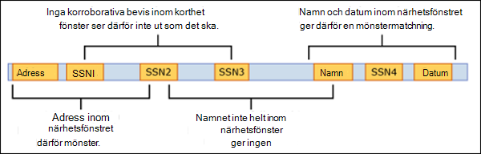

# <a name="learn-about-sensitive-information-types"></a><span data-ttu-id="59f85-102">Läs mer om typer av känslig information</span><span class="sxs-lookup"><span data-stu-id="59f85-102">Learn about sensitive information types</span></span>

<span data-ttu-id="59f85-103">Att identifiera och klassificera känsliga objekt som din organisation kontrollerar är det första steget i [informationsskyddsgrenen.](./information-protection.md)</span><span class="sxs-lookup"><span data-stu-id="59f85-103">Identifying and classifying sensitive items that are under your organizations control is the first step in the [Information Protection discipline](./information-protection.md).</span></span>  <span data-ttu-id="59f85-104">Microsoft 365 finns tre sätt att identifiera objekt så att de kan klassificeras:</span><span class="sxs-lookup"><span data-stu-id="59f85-104">Microsoft 365 provides three ways of identifying items so that they can be classified:</span></span>

- <span data-ttu-id="59f85-105">manuellt av användare</span><span class="sxs-lookup"><span data-stu-id="59f85-105">manually by users</span></span>
- <span data-ttu-id="59f85-106">automatiserad mönsterigenkänning, som typer av känslig information</span><span class="sxs-lookup"><span data-stu-id="59f85-106">automated pattern recognition, like sensitive information types</span></span>
- [<span data-ttu-id="59f85-107">maskininlärning</span><span class="sxs-lookup"><span data-stu-id="59f85-107">machine learning</span></span>](classifier-learn-about.md)

<span data-ttu-id="59f85-108">Känsliga informationstyper är mönsterbaserade klassificerare.</span><span class="sxs-lookup"><span data-stu-id="59f85-108">Sensitive information types are pattern-based classifiers.</span></span> <span data-ttu-id="59f85-109">De kan identifiera känslig information som personnummer, kreditkort eller bankkontonummer för att identifiera känsliga objekt i Definitioner av typer av [känslig information](sensitive-information-type-entity-definitions.md)</span><span class="sxs-lookup"><span data-stu-id="59f85-109">They detect sensitive information like social security, credit card, or bank account numbers to identify sensitive items, see [Sensitive information types entity definitions](sensitive-information-type-entity-definitions.md)</span></span>

## <a name="sensitive-information-types-are-used-in"></a><span data-ttu-id="59f85-110">Typer av känslig information används i</span><span class="sxs-lookup"><span data-stu-id="59f85-110">Sensitive information types are used in</span></span>

- [<span data-ttu-id="59f85-111">Principer för dataförlustskydd</span><span class="sxs-lookup"><span data-stu-id="59f85-111">Data loss prevention policies</span></span>](dlp-learn-about-dlp.md) 
- [<span data-ttu-id="59f85-112">Känslighetsetiketter</span><span class="sxs-lookup"><span data-stu-id="59f85-112">Sensitivity labels</span></span>](sensitivity-labels.md)
- [<span data-ttu-id="59f85-113">Kvarhållningsetiketter</span><span class="sxs-lookup"><span data-stu-id="59f85-113">Retention labels</span></span>](retention.md)
- [<span data-ttu-id="59f85-114">Hantering av insiderrisk</span><span class="sxs-lookup"><span data-stu-id="59f85-114">Insider risk management</span></span>](insider-risk-management.md)
- [<span data-ttu-id="59f85-115">Efterlevnad av kommunikation</span><span class="sxs-lookup"><span data-stu-id="59f85-115">Communication compliance</span></span>](communication-compliance.md)
- [<span data-ttu-id="59f85-116">Principer för automatiska policyer</span><span class="sxs-lookup"><span data-stu-id="59f85-116">Auto-labelling policies</span></span>](apply-sensitivity-label-automatically.md#how-to-configure-auto-labeling-for-office-apps)

## <a name="fundamental-parts-of-a-sensitive-information-type"></a><span data-ttu-id="59f85-117">Grundläggande delar av en typ av känslig information</span><span class="sxs-lookup"><span data-stu-id="59f85-117">Fundamental parts of a sensitive information type</span></span>

<span data-ttu-id="59f85-118">Alla typer av känslig information definieras av följande fält:</span><span class="sxs-lookup"><span data-stu-id="59f85-118">Every sensitive information type entity is defined by these fields:</span></span>

- <span data-ttu-id="59f85-119">namn: så här refereras typen av känslig information till</span><span class="sxs-lookup"><span data-stu-id="59f85-119">name: how the sensitive information type is referred to</span></span>
- <span data-ttu-id="59f85-120">beskrivning: beskriver vad typen av känslig information letar efter</span><span class="sxs-lookup"><span data-stu-id="59f85-120">description: describes what the sensitive information type is looking for</span></span>
- <span data-ttu-id="59f85-121">mönster: Ett mönster definierar vad en typ av känslig information identifierar.</span><span class="sxs-lookup"><span data-stu-id="59f85-121">pattern: A pattern defines what a sensitive information type detects.</span></span> <span data-ttu-id="59f85-122">Den består av följande komponenter</span><span class="sxs-lookup"><span data-stu-id="59f85-122">It consists of the following components</span></span>
    - <span data-ttu-id="59f85-123">Primärt element – huvudelementet som den typ av känslig information letar efter.</span><span class="sxs-lookup"><span data-stu-id="59f85-123">Primary element – the main element that the sensitive information type is looking for.</span></span> <span data-ttu-id="59f85-124">Det kan vara ett **vanligt uttryck** med eller utan en kontrollsummaverifiering, **en** nyckelordslista, en **nyckelordsordlista** eller en **funktion**.</span><span class="sxs-lookup"><span data-stu-id="59f85-124">It can be a **regular expression** with or without a checksum validation, a **keyword list**, a **keyword dictionary**, or a **function**.</span></span>
    - <span data-ttu-id="59f85-125">Stödelement – element som fungerar som stöd bevis som bidrar till att öka matchningens förtroende.</span><span class="sxs-lookup"><span data-stu-id="59f85-125">Supporting element – elements that act as supporting evidence that help in increasing the confidence of the match.</span></span> <span data-ttu-id="59f85-126">Till exempel nyckelordet "SSN" i närheten av ett SSN-nummer.</span><span class="sxs-lookup"><span data-stu-id="59f85-126">For example, keyword “SSN” in proximity of an SSN number.</span></span> <span data-ttu-id="59f85-127">Det kan vara ett vanligt uttryck med eller utan en verifiering av kontrollsumma, nyckelordslista och nyckelordsordlista.</span><span class="sxs-lookup"><span data-stu-id="59f85-127">It can be a regular expression with or without a checksum validation, keyword list, keyword dictionary.</span></span>
    - <span data-ttu-id="59f85-128">Konfidensnivå – Konfidensnivåer (hög, medium, låg) återspeglar hur mycket stöd bevis upptäcktes tillsammans med det primära elementet.</span><span class="sxs-lookup"><span data-stu-id="59f85-128">Confidence Level - Confidence levels (high, medium, low) reflect how much supporting evidence was detected along with the primary element.</span></span> <span data-ttu-id="59f85-129">Ju mer understödjande bevis ett objekt innehåller, desto högre förtroende för att ett matchat objekt innehåller den känsliga information du letar efter.</span><span class="sxs-lookup"><span data-stu-id="59f85-129">The more supporting evidence an item contains, the higher the confidence that a matched item contains the sensitive info you're looking for.</span></span>
    - <span data-ttu-id="59f85-130">Närhet – antal tecken mellan primärt element och stödelement</span><span class="sxs-lookup"><span data-stu-id="59f85-130">Proximity – Number of characters between primary and supporting element</span></span>



<span data-ttu-id="59f85-132">Lär dig mer om konfidensnivåer i den här videon</span><span class="sxs-lookup"><span data-stu-id="59f85-132">Learn more about confidence levels in this video</span></span>


 > [!VIDEO https://www.microsoft.com/videoplayer/embed/RE4Hx60]  

### <a name="example-sensitive-information-type"></a><span data-ttu-id="59f85-133">Exempel på typ av känslig information</span><span class="sxs-lookup"><span data-stu-id="59f85-133">Example sensitive information type</span></span>


## <a name="argentina-national-identity-dni-number"></a><span data-ttu-id="59f85-134">Argentinas national identity (DNI) number</span><span class="sxs-lookup"><span data-stu-id="59f85-134">Argentina national identity (DNI) number</span></span>

### <a name="format"></a><span data-ttu-id="59f85-135">Format</span><span class="sxs-lookup"><span data-stu-id="59f85-135">Format</span></span>

<span data-ttu-id="59f85-136">Åtta siffror avgränsade med punkter</span><span class="sxs-lookup"><span data-stu-id="59f85-136">Eight digits separated by periods</span></span>

### <a name="pattern"></a><span data-ttu-id="59f85-137">Mönster</span><span class="sxs-lookup"><span data-stu-id="59f85-137">Pattern</span></span>

<span data-ttu-id="59f85-138">Åtta siffror:</span><span class="sxs-lookup"><span data-stu-id="59f85-138">Eight digits:</span></span>
- <span data-ttu-id="59f85-139">två siffror</span><span class="sxs-lookup"><span data-stu-id="59f85-139">two digits</span></span>
- <span data-ttu-id="59f85-140">en punkt</span><span class="sxs-lookup"><span data-stu-id="59f85-140">a period</span></span>
- <span data-ttu-id="59f85-141">tre siffror</span><span class="sxs-lookup"><span data-stu-id="59f85-141">three digits</span></span>
- <span data-ttu-id="59f85-142">en punkt</span><span class="sxs-lookup"><span data-stu-id="59f85-142">a period</span></span>
- <span data-ttu-id="59f85-143">tre siffror</span><span class="sxs-lookup"><span data-stu-id="59f85-143">three digits</span></span>

### <a name="checksum"></a><span data-ttu-id="59f85-144">Kontrollsumma</span><span class="sxs-lookup"><span data-stu-id="59f85-144">Checksum</span></span>

<span data-ttu-id="59f85-145">Nej</span><span class="sxs-lookup"><span data-stu-id="59f85-145">No</span></span>

### <a name="definition"></a><span data-ttu-id="59f85-146">Definition</span><span class="sxs-lookup"><span data-stu-id="59f85-146">Definition</span></span>

<span data-ttu-id="59f85-147">En DLP-princip har med medelhög säkerhet identifierat den här typen av känslig information om följande inifrån 300 tecken:</span><span class="sxs-lookup"><span data-stu-id="59f85-147">A DLP policy has medium confidence that it's detected this type of sensitive information if, within a proximity of 300 characters:</span></span>
- <span data-ttu-id="59f85-148">Det reguljära uttrycket Regex_argentina_national_id hittar innehåll som matchar mönstret.</span><span class="sxs-lookup"><span data-stu-id="59f85-148">The regular expression Regex_argentina_national_id finds content that matches the pattern.</span></span>
- <span data-ttu-id="59f85-149">Ett nyckelord från Keyword_argentina_national_id hittas.</span><span class="sxs-lookup"><span data-stu-id="59f85-149">A keyword from Keyword_argentina_national_id is found.</span></span>

```xml
<!-- Argentina National Identity (DNI) Number -->
<Entity id="eefbb00e-8282-433c-8620-8f1da3bffdb2" recommendedConfidence="75" patternsProximity="300">
   <Pattern confidenceLevel="75">
      <IdMatch idRef="Regex_argentina_national_id"/>
      <Match idRef="Keyword_argentina_national_id"/>
  </Pattern>
</Entity>
```

### <a name="keywords"></a><span data-ttu-id="59f85-150">Nyckelord</span><span class="sxs-lookup"><span data-stu-id="59f85-150">Keywords</span></span>

#### <a name="keyword_argentina_national_id"></a><span data-ttu-id="59f85-151">Keyword_argentina_national_id</span><span class="sxs-lookup"><span data-stu-id="59f85-151">Keyword_argentina_national_id</span></span>

- <span data-ttu-id="59f85-152">Argentina National Identity Number</span><span class="sxs-lookup"><span data-stu-id="59f85-152">Argentina National Identity number</span></span> 
- <span data-ttu-id="59f85-153">Identitet</span><span class="sxs-lookup"><span data-stu-id="59f85-153">Identity</span></span> 
- <span data-ttu-id="59f85-154">Identification National Identity Card</span><span class="sxs-lookup"><span data-stu-id="59f85-154">Identification National Identity Card</span></span> 
- <span data-ttu-id="59f85-155">DNI</span><span class="sxs-lookup"><span data-stu-id="59f85-155">DNI</span></span> 
- <span data-ttu-id="59f85-156">NIC National Registry of Persons</span><span class="sxs-lookup"><span data-stu-id="59f85-156">NIC National Registry of Persons</span></span> 
- <span data-ttu-id="59f85-157">Documento Nacional de Identidad</span><span class="sxs-lookup"><span data-stu-id="59f85-157">Documento Nacional de Identidad</span></span> 
- <span data-ttu-id="59f85-158">Registro Nacional de las Personas</span><span class="sxs-lookup"><span data-stu-id="59f85-158">Registro Nacional de las Personas</span></span> 
- <span data-ttu-id="59f85-159">Identidad</span><span class="sxs-lookup"><span data-stu-id="59f85-159">Identidad</span></span> 
- <span data-ttu-id="59f85-160">Identificación</span><span class="sxs-lookup"><span data-stu-id="59f85-160">Identificación</span></span> 

### <a name="more-on-confidence-levels"></a><span data-ttu-id="59f85-161">Mer om konfidensnivåer</span><span class="sxs-lookup"><span data-stu-id="59f85-161">More on confidence levels</span></span>

<span data-ttu-id="59f85-162">I en definition av typen känslig information **återspeglar konfidensnivån** hur mycket stödbevis som identifieras utöver det primära elementet.</span><span class="sxs-lookup"><span data-stu-id="59f85-162">In a sensitive information type entity definition, **confidence level** reflects how much supporting evidence is detected in addition to the primary element.</span></span> <span data-ttu-id="59f85-163">Ju mer understödjande bevis ett objekt innehåller, desto högre förtroende för att ett matchat objekt innehåller den känsliga information du letar efter.</span><span class="sxs-lookup"><span data-stu-id="59f85-163">The more supporting evidence an item contains, the higher the confidence that a matched item contains the sensitive info you're looking for.</span></span> <span data-ttu-id="59f85-164">Exempelvis innehåller matchningar med hög konfidensnivå fler stödbevis i nära närhet till det primära elementet, medan matchningar med låg konfidensnivå inte skulle innehålla några stödbevis i nära närhet.</span><span class="sxs-lookup"><span data-stu-id="59f85-164">For example, matches with a high confidence level will contain more supporting evidence in close proximity of the primary element, whereas matches with a low confidence level would contain little to no supporting evidence in close proximity.</span></span> 

<span data-ttu-id="59f85-165">En hög konfidensnivå returnerar de minsta falska positiva talen men kan ge fler falska negativa resultat.</span><span class="sxs-lookup"><span data-stu-id="59f85-165">A high confidence level returns the fewest false positives but might result in more false negatives.</span></span> <span data-ttu-id="59f85-166">Låga eller medelhöga konfidensnivåer returnerar fler falska positiva tal, men några till noll negativa tal.</span><span class="sxs-lookup"><span data-stu-id="59f85-166">Low or medium confidence levels returns more false positives but few to zero false negatives.</span></span>

- <span data-ttu-id="59f85-167">**låg konfidens:** Värdet 65, matchade objekt innehåller färre falska negativa men mest falska positiva värden.</span><span class="sxs-lookup"><span data-stu-id="59f85-167">**low confidence**: Value of 65, matched items will contain the fewest false negatives but the most false positives.</span></span> <span data-ttu-id="59f85-168">Med lågt förtroende returneras alla matchningar med låg, medel och hög konfidens.</span><span class="sxs-lookup"><span data-stu-id="59f85-168">Low confidence returns all low, medium, and high confidence matches.</span></span>
- <span data-ttu-id="59f85-169">**medelförtroende:** Värdet 75, matchade objekt innehåller en genomsnittlig mängd falska positiva värden och falska negativa värden.</span><span class="sxs-lookup"><span data-stu-id="59f85-169">**medium confidence**: Value of 75, matched items will contain an average amount of false positives and false negatives.</span></span> <span data-ttu-id="59f85-170">Medelhög konfidens returnerar alla medelhöga och högförtroende matchningar.</span><span class="sxs-lookup"><span data-stu-id="59f85-170">Medium confidence returns all medium, and high confidence matches.</span></span>  
- <span data-ttu-id="59f85-171">**hög** konfidens: Värdet 85, matchade objekt innehåller färre falska positiva resultat men mest falska negativa.</span><span class="sxs-lookup"><span data-stu-id="59f85-171">**high confidence**: Value of 85, matched items will contain the fewest false positives but the most false negatives.</span></span> <span data-ttu-id="59f85-172">Hög konfidens returnerar bara matchningar med hög konfidens.</span><span class="sxs-lookup"><span data-stu-id="59f85-172">High confidence only returns high confidence matches.</span></span>  

<span data-ttu-id="59f85-173">Du bör använda mönster med hög konfidensnivå med låga tal, t.ex. fem till tio, och mönster med låg konfidensnivå med högre antal, t.ex. 20 eller fler.</span><span class="sxs-lookup"><span data-stu-id="59f85-173">You should use high confidence level patterns with low counts, say five to ten, and low confidence patterns with higher counts, say 20 or more.</span></span>

> [!NOTE]
> <span data-ttu-id="59f85-174">Om du har befintliga principer eller anpassade typer av känslig information (SITs) som definierats med hjälp av nummerbaserade konfidensnivåer (som också är korrekta) mappas de automatiskt till de tre diskreta konfidensnivåerna. Med låg konfidens, medelhög konfidens och hög säkerhet i användargränssnittet för Säkerhets- och efterlevnadscenter.</span><span class="sxs-lookup"><span data-stu-id="59f85-174">If you have existing policies or custom sensitive information types (SITs) defined using number-based confidence levels (also know as accuracy), they will automatically be mapped to the three discrete confidence levels; low confidence, medium confidence, and high confidence, across the Security @ Compliance Center UI.</span></span>
> - <span data-ttu-id="59f85-175">Alla principer med minsta noggrannhet eller anpassade SIT-mönster med konfidensnivåer på mellan 76 och 100 mappas till högt förtroende.</span><span class="sxs-lookup"><span data-stu-id="59f85-175">All policies with minimum accuracy or custom SIT patterns with confidence levels of between 76 and 100 will be mapped to high confidence.</span></span> 
> - <span data-ttu-id="59f85-176">Alla principer med minsta precision eller anpassade SIT-mönster med konfidensnivåer mellan 66 och 75 mappas till medelhög konfidens.</span><span class="sxs-lookup"><span data-stu-id="59f85-176">All policies with minimum accuracy or custom SIT patterns with confidence levels of between 66 and 75 will be mapped to medium confidence.</span></span>
> - <span data-ttu-id="59f85-177">Alla principer med minsta noggrannhet eller anpassade SIT-mönster med konfidensnivåer som är mindre än eller lika med 65 mappas till ett lågt förtroende.</span><span class="sxs-lookup"><span data-stu-id="59f85-177">All policies with minimum accuracy or custom SIT patterns with confidence levels less than or equal to 65 will be mapped to low confidence.</span></span> 

## <a name="creating-custom-sensitive-information-types"></a><span data-ttu-id="59f85-178">Skapa anpassade typer av känslig information</span><span class="sxs-lookup"><span data-stu-id="59f85-178">Creating custom sensitive information types</span></span>

<span data-ttu-id="59f85-179">Om du vill skapa anpassade typer av känslig information & Säkerhets- och efterlevnadscenter kan du välja mellan flera alternativ:</span><span class="sxs-lookup"><span data-stu-id="59f85-179">To create custom sensitive information types in the Security & Compliance Center, you can choose from several options:</span></span>

- <span data-ttu-id="59f85-180">**Använda användargränssnittet** Du kan konfigurera en anpassad typ av känslig information med hjälp av användargränssnittet & Säkerhets- och efterlevnadscenter.</span><span class="sxs-lookup"><span data-stu-id="59f85-180">**Use the UI** You can set up a custom sensitive information type using the Security & Compliance Center UI.</span></span> <span data-ttu-id="59f85-181">Med den här metoden kan du använda reguljära uttryck, nyckelord och ordlistor.</span><span class="sxs-lookup"><span data-stu-id="59f85-181">With this method, you can use regular expressions, keywords, and keyword dictionaries.</span></span> <span data-ttu-id="59f85-182">Mer information finns i [Skapa en anpassad typ av känslig information.](create-a-custom-sensitive-information-type.md)</span><span class="sxs-lookup"><span data-stu-id="59f85-182">To learn more, see [Create a custom sensitive information type](create-a-custom-sensitive-information-type.md).</span></span>

- <span data-ttu-id="59f85-183">**Använda EDM** Du kan konfigurera anpassade typer av känslig information med hjälp av exakt datamatchning (EDM)-baserad klassificering.</span><span class="sxs-lookup"><span data-stu-id="59f85-183">**Use EDM** You can set up custom sensitive information types using Exact Data Match (EDM)-based classification.</span></span> <span data-ttu-id="59f85-184">Med den här metoden kan du skapa en dynamisk typ av känslig information med en säker databas som du kan uppdatera med jämna mellanrum.</span><span class="sxs-lookup"><span data-stu-id="59f85-184">This method enables you to create a dynamic sensitive information type using a secure database that you can refresh periodically.</span></span> <span data-ttu-id="59f85-185">Mer [information finns i Skapa en anpassad typ av känslig information med exakt datamatchning baserad klassificering.](create-custom-sensitive-information-types-with-exact-data-match-based-classification.md)</span><span class="sxs-lookup"><span data-stu-id="59f85-185">See [Create a custom sensitive information type with Exact Data Match based classification](create-custom-sensitive-information-types-with-exact-data-match-based-classification.md).</span></span>

- <span data-ttu-id="59f85-186">**Använda PowerShell** Du kan konfigurera anpassade typer av känslig information med PowerShell.</span><span class="sxs-lookup"><span data-stu-id="59f85-186">**Use PowerShell** You can set up custom sensitive information types using PowerShell.</span></span> <span data-ttu-id="59f85-187">Även om den här metoden är mer komplex än att använda gränssnittet har du fler konfigurationsalternativ.</span><span class="sxs-lookup"><span data-stu-id="59f85-187">Although this method is more complex than using the UI, you have more configuration options.</span></span> <span data-ttu-id="59f85-188">Se [Skapa en anpassad typ av känslig information i Security & Compliance Center PowerShell.](create-a-custom-sensitive-information-type-in-scc-powershell.md)</span><span class="sxs-lookup"><span data-stu-id="59f85-188">See [Create a custom sensitive information type in Security & Compliance Center PowerShell](create-a-custom-sensitive-information-type-in-scc-powershell.md).</span></span>


> [!NOTE]
> <span data-ttu-id="59f85-189">Förbättrade konfidensnivåer är tillgängliga för omedelbar användning inom dataförlustskydd för Microsoft 365-tjänster, Microsoft Information Protection för Microsoft 365-tjänster, kommunikationsefterlevnad, informationsstyrning och hantering av arkivhandlingar.</span><span class="sxs-lookup"><span data-stu-id="59f85-189">Improved confidence levels are available for immediate use within Data Loss Prevention for Microsoft 365 services, Microsoft Information Protection for Microsoft 365 services, Communication Compliance, Information Governance, and Records Management.</span></span>

> <span data-ttu-id="59f85-190">Microsoft 365 Informationsskydd har nu stöd för teckenuppsättningsspråk för förhandsgranskning med dubbla byte för:</span><span class="sxs-lookup"><span data-stu-id="59f85-190">Microsoft 365 Information Protection now  supports in preview double byte character set languages for:</span></span>
> - <span data-ttu-id="59f85-191">Kinesiska (förenklad)</span><span class="sxs-lookup"><span data-stu-id="59f85-191">Chinese (simplified)</span></span>
> - <span data-ttu-id="59f85-192">Kinesiska (traditionell)</span><span class="sxs-lookup"><span data-stu-id="59f85-192">Chinese (traditional)</span></span>
> - <span data-ttu-id="59f85-193">Korean</span><span class="sxs-lookup"><span data-stu-id="59f85-193">Korean</span></span>
> - <span data-ttu-id="59f85-194">Japanese</span><span class="sxs-lookup"><span data-stu-id="59f85-194">Japanese</span></span>

><span data-ttu-id="59f85-195">Det här stödet är tillgängligt för typer av känslig information.</span><span class="sxs-lookup"><span data-stu-id="59f85-195">This support is available for sensitive information types.</span></span> <span data-ttu-id="59f85-196">Mer information finns i Stöd för [informationsskydd](mip-dbcs-relnotes.md) för viktig information om teckenuppsättningar med dubbla byte (förhandsgranskning).</span><span class="sxs-lookup"><span data-stu-id="59f85-196">See, [Information protection support for double byte character sets release notes (preview)](mip-dbcs-relnotes.md) for more information.</span></span>

## <a name="for-further-information"></a><span data-ttu-id="59f85-197">Om du vill ha mer information</span><span class="sxs-lookup"><span data-stu-id="59f85-197">For further information</span></span>
- [<span data-ttu-id="59f85-198">Entitetsdefinitioner för typer av känslig information</span><span class="sxs-lookup"><span data-stu-id="59f85-198">Sensitive information type entity definitions</span></span>](sensitive-information-type-entity-definitions.md)
- [<span data-ttu-id="59f85-199">Skapa en anpassad typ av känslig information</span><span class="sxs-lookup"><span data-stu-id="59f85-199">Create a custom sensitive information type</span></span>](create-a-custom-sensitive-information-type.md)
- [<span data-ttu-id="59f85-200">Skapa en anpassad typ av känslig information i PowerShell</span><span class="sxs-lookup"><span data-stu-id="59f85-200">Create a custom sensitive information type in PowerShell</span></span>](create-a-custom-sensitive-information-type-in-scc-powershell.md)

<!-- fwlink for this topic https://go.microsoft.com/fwlink/?linkid=2135644-->