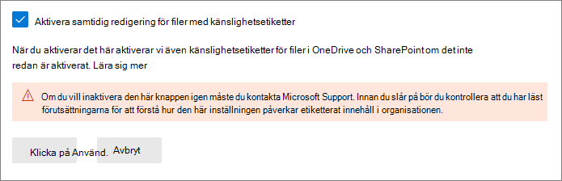
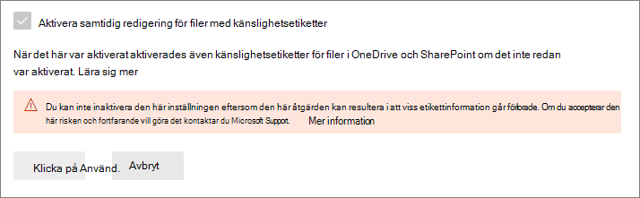

# <a name="enable-co-authoring-for-files-encrypted-with-sensitivity-labels"></a>Aktivera samtidig redigering för filer krypterade med känslighetsetiketter

>*[Licensieringsvägledning för Microsoft 365 för säkerhet och efterlevnad](/office365/servicedescriptions/microsoft-365-service-descriptions/microsoft-365-tenantlevel-services-licensing-guidance/microsoft-365-security-compliance-licensing-guidance).*

> [!NOTE]
> Den här funktionen är i förhandsversion och kan komma att ändras. 
>
> Aktivera den här funktionen i en testklientorganisation i stället för en produktionsklientorganisation eftersom:
> - Funktionen gör ändringar i etiketteringsmetadata och alla appar på alla plattformar stöder för närvarande inte den här ändringen
> - Du kan inte själv inaktivera den här funktionen när den är aktiverad

Aktivera inställningen för stöd för [samtidig redigering](https://support.office.com/article/ee1509b4-1f6e-401e-b04a-782d26f564a4) för Office-skrivbordsprogram så att flera användare kan redigera de här dokumenten samtidigt när dokument etiketteras och krypteras med [känslighetsetiketter](sensitivity-labels.md).

Om inte den här inställningen är aktiverad för klientorganisationen måste användarna checka ut ett krypterat dokument som lagrats i SharePoint eller OneDrive när de använder Office-skrivbordsprogram. Därmed kan de inte samarbeta i realtid. Eller så måste de använda Office på webben när [känslighetsetiketter är aktiverade för Office-filer i SharePoint och OneDrive](sensitivity-labels-sharepoint-onedrive-files.md).

Om du aktiverar den här funktionen blir dessutom funktionen [Spara automatiskt](https://support.office.com/article/what-is-autosave-6d6bd723-ebfd-4e40-b5f6-ae6e8088f7a5) tillgänglig för dessa etiketterade och krypterade filer.

Om du vill läsa lanseringsmeddelandet går du till blogginlägget [Vi presenterar samtidig redigering för Microsoft Information Protection-krypterade dokument och etiketter](https://techcommunity.microsoft.com/t5/microsoft-security-and/announcing-co-authoring-on-microsoft-information-protection/ba-p/2164162).

## <a name="metadata-changes-for-sensitivity-labels"></a>Metadataändringar för känslighetsetiketter

> [!IMPORTANT]
> När du har aktiverat inställningen för samtidig redigering sparas inte längre etiketteringsinformationen för okrypterade filer i de anpassade egenskaperna.
> 
> Aktivera inte den här inställningen om du använder appar, tjänster, skript eller verktyg som läser eller skriver etikettmetadata till den gamla platsen.

Innan du aktiverar inställningen för samtidig redigering för Office-skrivbordsprogram är det viktigt att förstå att den här åtgärden gör ändringar i de etikettmetadata som sparas i och läses från Office-filer.

Etikettmetadata innehåller information som identifierar din klientorganisation och den tillämpade känslighetsetiketten. Ändringen som den här inställningen gör gäller metadataformatet och platsen för Word-, Excel- och PowerPoint-filer. Du behöver inte vidta någon åtgärd för krypterade filer eller e-postmeddelanden. Metadataändringen för krypterade filer är bakåtkompatibel och det finns inga ändringar för e-postmeddelanden. Du måste dock vara medveten om metadataändringarna för krypterade filer som kan uppgraderas automatiskt men inte är bakåtkompatibla.

Den här ändringen påverkar både filer som nyligen har etiketterats och filer som redan är etiketterade. När du använder program och tjänster som har stöd för inställningen samtidig redigering:
- För filer som nyligen har etiketterats används bara det nya formatet och platsen för etikettmetadata.
- För filer som redan är etiketterade och har metadata i det gamla formatet och på den gamla platsen, kopieras de till det nya formatet och platsen nästa gång filen öppnas och sparas.

Du kan läsa mer om denna metadataändring i följande resurser:

- Blogginlägg: [Kommande ändringar av metadatalagring för Microsoft Information Protection](https://techcommunity.microsoft.com/t5/microsoft-security-and/upcoming-changes-to-microsoft-information-protection-metadata/ba-p/1904418)

- Öppna specifikationer: [2.6.3 Etikettinfo kontra anpassade dokumentegenskaper](/openspecs/office_file_formats/ms-offcrypto/13939de6-c833-44ab-b213-e0088bf02341)

Aktivera inte den här inställningen på grund av dessa ändringar om du har appar, tjänster, skript eller verktyg i organisationen som läser eller skriver etikettmetadata till den gamla platsen. Här är några exempel på konsekvenser om du skulle göra detta:

- Ett dokument som är etiketterat ser oetiketterat ut för användarna

- Ett dokument visar en inaktuell etikett för användarna

- Samtidig redigering och spara automatiskt fungerar inte för ett etiketterat och krypterat dokument om en annan användare har det öppet i ett Office-skrivbordsprogram som inte har stöd för de nya etikettmetadata

- En regel för e-postflöde i Exchange Online som [identifierar etiketter som anpassade egenskaper i Office-bilagor](/azure/information-protection/configure-exo-rules#example-2-rule-that-applies-the-encrypt-only-option-to-emails-when-they-have-attachments-that-are-labeled-confidential--partners-and-these-emails-are-sent-outside-the-organization) misslyckas med att kryptera e-postmeddelandet och den bifogade filen eller krypterar dem felaktigt

Se följande avsnitt för en lista med program och tjänster som har stöd för den här inställningen samt ändringar av etikettmetadata.

## <a name="prerequisites"></a>Förutsättningar

Se till att du förstår följande krav innan du aktiverar den här funktionen.

- Du måste använda en testklientorganisation för den här förhandsversionen.

- Du måste vara global administratör för att kunna aktivera den här funktionen.

- Känslighetsetiketter måste vara [aktiverade för Office-filer i SharePoint och OneDrive](sensitivity-labels-sharepoint-onedrive-files.md) för klientorganisationen. Om den här funktionen inte redan är aktiverad aktiveras den automatiskt när du väljer inställningen för att aktivera samtidig redigering för filer med känslighetsetiketter.

- Microsoft 365-appar för företag:
    - **Windows**: Förhandsversion: [Aktuell kanal (förhandsversion)](https://office.com/insider)
    - **macOS**: Förhandsversion: [Aktuell kanal (förhandsversion)](https://office.com/insider)
    - **iOS**: Stöds inte än
    - **Android**: Stöds inte än

- Alla program, tjänster och funktionsverktyg i klientorganisationen måste ha stöd för de nya [etiketteringsmetadata](#metadata-changes-for-sensitivity-labels). Om du använder något av följande kontrollerar du vilka lägsta versioner som krävs:
    
    - **Klient och skanner för enhetlig etikettering för Azure Information Protection**
        - En allmänt tillgänglig förhandsversion (med installationsnamnet AzInfoProtection_2.10.46_CoAuthoring_PublicPreview.exe) som du kan installera från [Microsoft Download Center](https://www.microsoft.com/en-us/download/details.aspx?id=53018)
    
    - **OneDrive-synkroniseringsprogram för Windows eller macOS:**
        - Lägsta version 19.002.0121.0008
    
    - **Dataförlustskydd för slutpunkter (Endpoint DLP)**
        - Windows 10 1809 med KB 4601383
        - Windows 10 1903 och 1909 med KB 4601380
        - Windows 10 2004 med KB 4601382
    
    - **Appar och tjänster som använder SDK för Microsoft Information Protection:** 
        - Lägsta version 1.7 

Microsoft 365-tjänsterna har automatiskt stöd för de nya etikettmetadata när du aktiverar den här funktionen. Till exempel:

- [Principer för automatisk etikettering](apply-sensitivity-label-automatically.md#how-to-configure-auto-labeling-policies-for-sharepoint-onedrive-and-exchange)
- [DLP-principer som använder känslighetsetiketter som villkor](dlp-sensitivity-label-as-condition.md)
- [Microsoft Cloud App Security som konfigurerats för att använda känslighetsetiketter](/cloud-app-security/best-practices#discover-classify-label-and-protect-regulated-and-sensitive-data-stored-in-the-cloud)

## <a name="limitations"></a>Begränsningar

Innan du aktiverar klientorganisationens inställning för samtidig redigering för filer som krypterats med känslighetsetiketter behöver du förstå följande begränsningar för den här funktionen.

- På grund av [ändringarna av etikettmetadata](#metadata-changes-for-sensitivity-labels) måste alla program, tjänster och driftverktyg i klientorganisationen ha stöd för de nya etikettmetadata för en konsekvent och tillförlitlig etikettering.
    
    Specifikt för Excel: Metadata för en känslighetsetikett som inte tillämpar kryptering kan tas bort från en fil om någon redigerar och sparar filen med hjälp av en version av Excel som inte har stöd för metadataändringarna för känslighetsetiketter.

- Samtidig redigering och spara automatiskt stöds inte och fungerar inte för etiketterade och krypterade Office-dokument som använder någon av följande [konfigurationer för kryptering](encryption-sensitivity-labels.md#configure-encryption-settings):
    - **Låt användare tilldela behörigheter när de använder etiketten** och kryssrutan **Uppmana användare att ange behörigheter i Word, PowerPoint och Excel** är markerad. Den här konfigurationen kallas ibland för ”användardefinierade behörigheter”.
    - **Användaråtkomst till innehåll upphör** har ställts in på ett annat värde än **Aldrig**.
    - **Kryptering med dubbla nycklar** har valts.
    
    För etiketter med någon av dessa krypteringskonfigurationer visas etiketterna i Office-appar. Men när användarna väljer etiketterna och ingen annan redigerar dokumentet får de en varning om att samtidig redigering och Spara automatiskt inte kommer att vara tillgängligt. Om någon annan redigerar dokumentet ser användarna ett meddelande om att etiketterna inte kan användas.

- Om du använder klienten för enhetlig etikettering i Azure Information Protection: Läs i dokumentationen för den här etiketteringsklienten om [fler krav eller begränsningar](/azure/information-protection/known-issues#known-issues-for-co-authoring-public-preview).

## <a name="known-issues-for-this-preview"></a>Kända problem för den här förhandsversionen

Den här förhandsversionen av samtidig redigering för filer som krypterats med känslighetsetiketter har följande kända problem:

- Användarna kan inte använda etiketter i Office för webben för Word-, Excel- och PowerPoint-filer som är större än 300 MB. För dessa filer kan du använda Office-skrivbordsprogram för att tillämpa en etikett, men du måste vara den enda personen som har filen öppen.

- När du använder [DLP-principer som använder känslighetsetiketter som villkor](dlp-sensitivity-label-as-condition.md) stöds inte okrypterade bifogade filer för e-postmeddelanden.

- Vissa dokument är inkompatibla med känslighetsetiketter på grund av funktioner som [lösenordsskydd](https://support.microsoft.com/office/require-a-password-to-open-or-modify-a-workbook-10579f0e-b2d9-4c05-b9f8-4109a6bce643), [delade arbetsböcker](https://support.microsoft.com/office/about-the-shared-workbook-feature-49b833c0-873b-48d8-8bf2-c1c59a628534) eller innehåll som innehåller ActiveX-kontroller. Andra orsaker har dokumenterats i [Felsöka samtidig redigering i Office](https://support.microsoft.com/office/troubleshoot-co-authoring-in-office-bd481512-3f3a-4b6d-b7eb-ebf9d3626ae7). För de här dokumenten visas meddelandet **Uppladdning misslyckades**, du bör då välja alternativet **Ignorera ändringar**. Tills problemet har åtgärdats bör du inte etikettera de dokument som identifierats med det här felmeddelandet.

- Office-appar för iOS och Android stöds inte.

## <a name="how-to-enable-co-authoring-for-files-with-sensitivity-labels"></a>Så här aktiverar du samtidig redigering för filer med känslighetsetiketter

> [!CAUTION]
> Att aktivera den här inställningen är en enkelriktad åtgärd. Med den här funktionen i förhandsversion ska du bara testa den i en icke-produktionsmiljö och bara när du har läst och förstått metadataändringarna, förutsättningar, begränsningar och kända problem som är dokumenterade på den här sidan.

Med förhandsversionen måste du använda en specifik URL för att komma åt den här inställningen i Microsoft 365 Efterlevnadscenter.

1. Logga in på Microsoft 365 Efterlevnadscenter som global administratör för testklientorganisationen med hjälp av följande länk:
    
    ```http
    https://compliance.microsoft.com/co-authoring_for_files_with_sensitivity_labels
    ```
    Den här länken tar dig direkt till klientorganisationens inställning, **Samtidig redigering för filer med känslighetsetiketter**.

    > [!IMPORTANT]
    > Innan du fortsätter kontrollerar du att du är inloggad på en testklientorganisation som inte påverkar användarna: 
    >
    > Välj cirkeln med dina kontoinitialer längst upp till höger i efterlevnadscentret och bekräfta att klientorganisationens namn visar den avsedda testklientorganisationen.
    
2. Läs sammanfattningsbeskrivningen, förutsättningarna, vad du kan förvänta dig och varningen om att du inte kan inaktivera den här inställningen när du har aktiverat den. Välj sedan **Aktivera samtidig redigering för filer med känslighetsetiketter** och **Använd**:
    
    

3. Vänta i 24 timmar på att den här inställningen replikeras i miljön innan du testar den här nya funktionen för samtidig redigering.

## <a name="contact-support-if-you-need-to-disable-this-feature"></a>Kontakta supporten om du behöver inaktivera funktionen

> [!IMPORTANT]
> Om du behöver inaktivera den här funktionen bör du tänka på att etiketteringsinformationen kan gå förlorad.

När du har aktiverat samtidig redigering för filer med känslighetsetiketter för klientorganisationen kan du inte inaktivera inställningen själv. Därför är det så viktigt att du kontrollerar och förstår förutsättningar, konsekvenser och begränsningar innan du aktiverar inställningen. Därför rekommenderar vi också att du testar funktionen med en testklientorganisation i stället för en produktionsklientorganisation.



Som du ser på skärmbilden när den här inställningen har aktiverats kan du kontakta [Microsoft Support](../business-video/get-help-support.md) och begära att inställningen inaktiveras. Den här begäran kan ta flera dagar och du måste bevisa att du är global administratör för klientorganisationen. Räkna med att vanliga supportavgifter tillämpas. 

Om en supporttekniker inaktiverar den här inställningen för klientorganisationen:

- För program och tjänster som har stöd för de nya etikettmetadata, återställs de nu till det ursprungliga metadataformatet och platsen när etiketterna läses eller sparas.

- Det nya metadataformatet och platsen för Office-dokument som användes när inställningen var aktiverad kopieras inte till det ursprungliga formatet och platsen. Därför förloras den här etikettinformationen för okrypterade Word-, Excel- och PowerPoint-filer.

- Samtidig redigering och Spara automatiskt fungerar inte längre i klientorganisationen för etiketterade och krypterade dokument.

- Känslighetsetiketter förblir aktiverade för Office-filer i OneDrive och SharePoint.