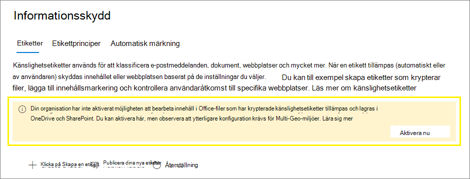

# <a name="enable-sensitivity-labels-for-office-files-in-sharepoint-and-onedrive"></a>Aktivera känslighetsetiketter för Office-filer i SharePoint och OneDrive

>*[Licensieringsvägledning för Microsoft 365 för säkerhet och efterlevnad](/office365/servicedescriptions/microsoft-365-service-descriptions/microsoft-365-tenantlevel-services-licensing-guidance/microsoft-365-security-compliance-licensing-guidance).*

Aktivera känslighetsetiketter för Office filer i SharePoint och OneDrive så att användare kan använda dina [känslighetsetiketter](sensitivity-labels.md) i Office för webben. När den här funktionen är aktiverad ser användare knappen Känslighet i **menyfliksområdet** så att de kan använda etiketter och se alla etikettnamn i statusfältet.

Om du aktiverar den här funktionen SharePoint och OneDrive att kunna bearbeta innehållet i filer som har krypterats med hjälp av en känslighetsetikett. Etiketten kan användas i Office för webben eller i program Office och laddas upp eller sparas i SharePoint och OneDrive. Tills dess att du aktiverar den här funktionen kan tjänsterna inte bearbeta krypterade filer, vilket innebär att samtidig sökning, eDiscovery, skydd mot dataförlust, sökning och andra samarbetsfunktioner inte fungerar för dessa filer.

När du har aktivera känslighetsetiketter för Office-filer i SharePoint och OneDrive, för nya och ändrade filer som har en känslighetsetikett som [](double-key-encryption.md)tillämpar kryptering med en molnbaserad nyckel (och inte använder dubbelnyckelkryptering):

- För Word Excel-, PowerPoint- och PowerPoint-filer känner SharePoint och OneDrive igen etiketten och kan nu bearbeta innehållet i den krypterade filen.

- När användare laddar ned eller öppnar filerna från SharePoint eller OneDrive tillämpas känslighetsetiketten och alla krypteringsinställningar från etiketten och ligger kvar på filen oavsett var den lagras. Se till att ge användarvägledning att bara använda etiketter för att skydda dokument. Mer information finns i [IRM-alternativ (Information Rights Management) och känslighetsetiketter.](sensitivity-labels-office-apps.md#information-rights-management-irm-options-and-sensitivity-labels)

- När användare laddar upp etiketterade och krypterade filer SharePoint eller OneDrive måste de minst ha visningsbehörighet till dessa filer. De kan till exempel öppna filerna utanför SharePoint. Om de inte har den här minsta användningen rätt lyckas överföringen, men tjänsten känner inte igen etiketten och kan inte bearbeta filinnehållet.

- Använd Office för webben (Word, Excel, PowerPoint) för att öppna och redigera Office filer som har känslighetsetiketter som använder kryptering. Behörigheterna som tilldelades med krypteringen tillämpas. Du kan också [använda automatisk etikett för](apply-sensitivity-label-automatically.md) dessa dokument.

- Externa användare kan komma åt dokument som är märkta med kryptering med hjälp av gästkonton. Mer information finns i [Stöd för externa användare och märkt innehåll.](sensitivity-labels-office-apps.md#support-for-external-users-and-labeled-content) 

- Office 365 eDiscovery har stöd för fullständig textsökning för dessa filer och DLP-principer (Data Loss Prevention) stöder innehåll i dessa filer.

> [!NOTE]
> Om kryptering har använts med en lokal nyckel (en nyckelhanteringstopologi som ofta kallas "håll din egen nyckel" eller HYOK), eller med dubbel [kryptering,](double-key-encryption.md)ändras inte tjänstbeteendet för bearbetning av filinnehållet. Därför fungerar inte samtidig sökning, eDiscovery, skydd mot dataförlust, sökning och andra samarbetsfunktioner för dessa filer.
>
> Beteendet SharePoint och OneDrive ändras inte heller för befintliga filer på dessa platser som är märkta med kryptering med en enda Azure-baserad nyckel. För att de här filerna ska dra nytta av de nya funktionerna när du har aktivera känslighetsetiketter för Office-filer i SharePoint och OneDrive måste filerna antingen laddas ned och laddas upp igen eller redigeras.

När du har aktivera känslighetsetiketter för Office-filer i SharePoint och [](search-the-audit-log-in-security-and-compliance.md#sensitivity-label-activities) OneDrive finns tre nya granskningshändelser tillgängliga för att övervaka känslighetsetiketter som tillämpas på dokument i SharePoint och OneDrive:
- **Känslighetsetikett använd för fil**
- **Känslighetsetikett använd för fil är ändrad**
- **Känslighetsetikett borttagen från fil**

Titta på följande video (inget ljud) om du vill se de nya funktionerna i praktiken:

> [!VIDEO https://www.microsoft.com/videoplayer/embed//RE4ornZ]

Du kan alltid inaktivera känslighetsetiketter för Office i SharePoint och OneDrive ([avanmäla)](#how-to-disable-sensitivity-labels-for-sharepoint-and-onedrive-opt-out)när som helst.

Om du för närvarande skyddar dokument i SharePoint med hjälp av SharePoint IRM (Information Rights Management SharePoint) kontrollerar du avsnittet [IRM (Information Rights Management)](#sharepoint-information-rights-management-irm-and-sensitivity-labels) och känslighetsetiketter på den här sidan. 

## <a name="requirements"></a>Krav

Dessa nya funktioner fungerar endast [med känslighetsetiketter.](sensitivity-labels.md) Om du för närvarande har Azure Information Protection-etiketter ska du först migrera dem till känslighetsetiketter så att du kan aktivera de här funktionerna för nya filer som du laddar upp. Instruktioner finns i artikeln om [hur du migrerar Azure Information Protection-etiketter till enhetliga känslighetsetiketter](/azure/information-protection/configure-policy-migrate-labels).

Använd OneDrive synkroniseringsapp version 19.002.0121.0008 eller senare på Windows och version 19.002.0107.0008 eller senare på Mac. Båda de här versionerna släpptes 28 januari 2019 och är för närvarande tillgängliga för alla ringar. Mer information finns i OneDrive [viktig information.](https://support.office.com/article/845dcf18-f921-435e-bf28-4e24b95e5fc0) När du har aktivera känslighetsetiketter för Office-filer i SharePoint och OneDrive uppmanas användare som kör en äldre version av synkroniseringsappen att uppdatera den.

## <a name="limitations"></a>Begränsningar

- SharePoint och OneDrive kan inte bearbeta vissa filer som är märkta och krypterade från Office-skrivbordsprogram när dessa filer innehåller PowerQuery-data, data som lagrats med anpassade tillägg eller anpassade XML-delar som egenskaper för försättsblad, innehållstypscheman, anpassad dokumentinformationspanel och anpassade XSN. Den här begränsningen gäller även filer där ett [dokument-ID](https://support.microsoft.com/office/enable-and-configure-unique-document-ids-ea7fee86-bd6f-4cc8-9365-8086e794c984) läggs till när de överförs.
    
    För de här filerna använder du antingen en etikett utan kryptering så att de senare kan öppnas i Office på webben eller instruera användarna att öppna filerna i sina skrivbordsprogram. Filer som bara är etiketterade och krypterade i Office på webben påverkas inte.

- SharePoint och OneDrive av känslighetsetiketter för befintliga filer som du redan har krypterat med hjälp av Azure Information Protection-etiketter. För att funktionerna ska fungera när du har Office känslighetsetiketter i SharePoint och OneDrive utför du följande uppgifter:
    
    1. Kontrollera att du har [migrerat Azure Information Protection-etiketter](/azure/information-protection/configure-policy-migrate-labels) till känslighetsetiketter och [publicerat dem](create-sensitivity-labels.md#publish-sensitivity-labels-by-creating-a-label-policy) från Microsoft 365 efterlevnadscenter.
    2. Ladda ned de etiketterade filerna och ladda sedan upp dem till sin ursprungliga plats i SharePoint eller OneDrive.

- SharePoint och OneDrive krypterade filer inte kan bearbeta krypterade filer när etiketten som tillämpat krypteringen har någon av följande [konfigurationer för kryptering:](encryption-sensitivity-labels.md#configure-encryption-settings)
    - **Låt användare tilldela behörigheter när de använder etiketten** och kryssrutan **Uppmana användare att ange behörigheter i Word, PowerPoint och Excel** är markerad. Den här inställningen kallas ibland för "användardefinierade behörigheter".
    - **Användaråtkomst till innehåll upphör** har ställts in på ett annat värde än **Aldrig**.
    - **Kryptering med dubbla nycklar** har valts.
    
    Etiketter med någon av dessa krypteringskonfigurationer visas inte etiketterna för användare i Office för webben. De nya funktionerna kan inte användas med etiketterade dokument som redan har de här krypteringsinställningarna. Exempelvis returneras de här dokumenten inte i sökresultat, även om de uppdateras.

- Av prestandaskäl kan det ta en stund innan kolumnen Känslighet i dokumentbiblioteket kan visas  när du överför eller sparar ett dokument till SharePoint och filens etikett inte använder kryptering. Faktor för den här fördröjningen om du använder skript eller automatisering som är beroende av etikettnamnet i den här kolumnen.

- Användare kan uppleva fördröjningar i att kunna öppna krypterade dokument i följande Spara som-scenario: Om du använder en skrivbordsversion av Office väljer en användare Spara som för ett dokument som har en känslighetsetikett som tillämpar kryptering. Användaren väljer SharePoint eller OneDrive för platsen och försöker sedan direkt öppna det dokumentet i Office för webben. Om tjänsten fortfarande bearbetar krypteringen ser användaren ett meddelande om att dokumentet måste öppnas i skrivbordsappen. Om de försöker igen om några minuter öppnas dokumentet i Office för webben. 

- För krypterade dokument stöds inte utskrift.

- För krypterade dokument som beviljar användare redigeringsbehörighet kan kopiering inte blockeras i webbversioner av Office program.

- Som standard Office skrivbordsappar och mobilappar inte stöd för samtidig redigering för filer som är märkta med kryptering. Dessa appar fortsätter att öppna etiketterade och krypterade filer i exklusivt redigeringsläge.
    
    > [!NOTE]
    > Samtidig redigering stöds nu i förhandsversionen. Mer information finns i [Aktivera samtidig redigering för filer som krypteras med känslighetsetiketter.](sensitivity-labels-coauthoring.md)

- Om en administratör ändrar inställningarna för en publicerad etikett som redan tillämpas på filer som laddats ned till användarnas synkroniseringsklient kanske användarna inte kan spara ändringar som de gör i filen i OneDrive-synkroniseringsmappen. Det här scenariot gäller filer som har etiketten med kryptering, och även när etikettändringen kommer från en etikett som inte använder kryptering på en etikett som tillämpar kryptering. Användarna ser en [röd cirkel med ett felmeddelande med en](https://support.office.com/article/what-do-the-onedrive-icons-mean-11143026-8000-44f8-aaa9-67c985aa49b3)vit korsikon och uppmanas att spara nya ändringar som en separat kopia. I stället kan de stänga och öppna filen igen eller använda Office för webben.

- Om ett dokument med etiketter laddas upp till SharePoint eller OneDrive och etiketten tillämpad kryptering med hjälp av ett konto från ett tjänsthuvudnamn, kan dokumentet inte öppnas i Office för webben. Exempelscenarier omfattar Microsoft Cloud App Security och en fil som skickas till Teams via e-post.

- Användare kan få problem med att spara när de går offline eller i viloläge när de i stället för att använda Office för webben använder skrivbords- och mobilapparna för Word, Excel och PowerPoint. För dessa användare: när de återupptar sin Office-appen-session och försöker spara ändringarna visas ett meddelande om överföringsfel med ett alternativ för att spara en kopia i stället för att spara den ursprungliga filen. 

- Dokument som har krypterats på följande sätt kan inte öppnas i Office för webben:
    - Kryptering som använder en lokal nyckel ("håll ned din egen nyckel" eller HYOK)
    - Kryptering som tillämpats med Dubbel [nyckelkryptering](double-key-encryption.md)
    - Kryptering som tillämpats oberoende av en etikett, till exempel genom att direkt tillämpa en mall för rättighetshanteringsskydd.

- Etiketter som har [konfigurerats för andra](create-sensitivity-labels.md#additional-label-settings-with-security--compliance-center-powershell) språk stöds inte och det visas endast det ursprungliga språket.

- Skärmdumpar kan inte förhindras för krypterade dokument. Mer information finns i [Kan rättighetshantering förhindra skärminspelningar?](/azure/information-protection/faqs-rms#can-rights-management-prevent-screen-captures)

- Om du tar bort en etikett som har använts på ett dokument i SharePoint eller OneDrive, i stället för att ta bort etiketten från den tillämpliga etikettprincipen, kommer dokumentet inte att märkas eller krypteras när det laddas ned. Om det etiketterade dokumentet lagras utanför SharePoint eller OneDrive krypteras dokumentet om etiketten tas bort. Observera att även om det kan hända att du tar bort etiketter under en testfas är det mycket ovanligt att en etikett tas bort i en produktionsmiljö.

## <a name="how-to-enable-sensitivity-labels-for-sharepoint-and-onedrive-opt-in"></a>Hur du aktiverar känslighetsetiketter för SharePoint och OneDrive (avanmälning)

Du kan aktivera de nya funktionerna med hjälp Microsoft 365 kompatibilitetscenter eller med PowerShell. Precis som med alla konfigurationsändringar på klientorganisationsnivå för SharePoint och OneDrive tar det ca 15 minuter innan ändringen verkställs.

### <a name="use-the-compliance-center-to-enable-support-for-sensitivity-labels"></a>Använda efterlevnadscentret för att aktivera stöd för känslighetsetiketter

Det här alternativet är det enklaste sättet att aktivera känslighetsetiketter för SharePoint och OneDrive, men du måste logga in som global administratör för klientorganisationen.

1. Logga in på [Microsoft 365 som](https://compliance.microsoft.com/) global administratör och gå till **Informationsskydd**  >  **för lösningar**
    
    Om du inte ser det här alternativet direkt väljer du först **Visa alla**. 

2. Om du ser ett meddelande om att aktivera möjligheten att bearbeta innehåll i Office-onlinefiler väljer **du Aktivera nu:**
    
    
    
    Kommandot körs direkt och när sidan uppdateras nästa gång visas inte längre meddelandet eller knappen.

> [!NOTE]
> Om du har Microsoft 365 Multi-Geo måste du använda PowerShell för att aktivera de här funktionerna för alla dina geoplatser. Se nästa avsnitt för mer information.

### <a name="use-powershell-to-enable-support-for-sensitivity-labels"></a>Använda PowerShell för att aktivera stöd för känslighetsetiketter

Som ett alternativ till att använda efterlevnadscentret kan du aktivera stöd för känslighetsetiketter med hjälp av [cmdleten Set-SPOTenant](/powershell/module/sharepoint-online/set-spotenant) från SharePoint Online PowerShell. 

Om du har Microsoft 365 Multi-Geo måste du använda PowerShell för att aktivera det här stödet för alla dina geoplatser.

#### <a name="prepare-the-sharepoint-online-management-shell"></a>Förbereda SharePoint Online Management Shell

Innan du kör PowerShell-kommandot för att aktivera känslighetsetiketter för Office-filer i SharePoint och OneDrive bör du kontrollera att du kör SharePoint Online Management Shell version 16.0.19418.12000 eller senare. Om du redan har den senaste versionen kan du gå vidare [till nästa procedur och](#run-the-powershell-command-to-enable-support-for-sensitivity-labels) köra PowerShell-kommandot.

1. Om du har installerat en tidigare version av SharePoint Online Management Shell från PowerShell-galleriet kan du uppdatera modulen genom att köra följande cmdlet.

    ```PowerShell
    Update-Module -Name Microsoft.Online.SharePoint.PowerShell
    ```

2. Om du har installerat en tidigare version av SharePoint Online Management Shell från Microsoft Download  Center kan du också gå till Lägga till eller ta bort program och avinstallera SharePoint Online Management Shell.

3. I en webbläsare går du till sidan Download Center och hämtar [den senaste versionen SharePoint Online Management Shell](https://go.microsoft.com/fwlink/p/?LinkId=255251).

4. Välj språk och klicka sedan på **Ladda ned**.

5. Välj mellan x64- och x86-.msi filen. Ladda ned x64-filen om du kör 64-bitarsversionen av Windows eller x86-filen om du kör 32-bitarsversionen. Om du inte vet vilken version av [operativsystemet Windows använder jag?](https://support.microsoft.com/help/13443/windows-which-operating-system)

6. När du har laddat ned filen kör du den och följer anvisningarna i Installationsguiden.

#### <a name="run-the-powershell-command-to-enable-support-for-sensitivity-labels"></a>Kör PowerShell-kommandot för att aktivera stöd för känslighetsetiketter

För att aktivera de nya funktionerna använder du [cmdleten Set-SPOTenant](/powershell/module/sharepoint-online/set-spotenant) med *parametern EnableAIPIntegration:*

1. Använd ett arbets- eller skolkonto med global administratör SharePoint administratörsbehörighet i Microsoft 365 ansluta till SharePoint. Mer information finns i Komma [igång med SharePoint Online Management Shell.](/powershell/sharepoint/sharepoint-online/connect-sharepoint-online)
    
    > [!NOTE]
    > Om du har Microsoft 365 Multi-Geo använder du parametern -URL med [Anslut-SPOService](/powershell/module/sharepoint-online/connect-sposervice)och anger webbadressen till webbplatsen SharePoint Online Administration Center för någon av dina geoplatser.

2. Kör följande kommando och tryck på **Y för** att bekräfta:

    ```PowerShell
    Set-SPOTenant -EnableAIPIntegration $true
    ```
3. Mer Microsoft 365 Multi-Geo: Upprepa steg 1 och 2 för var och en av dina återstående geoplatser.

## <a name="publishing-and-changing-sensitivity-labels"></a>Publicera och ändra känslighetsetiketter

När du använder känslighetsetiketter med SharePoint och OneDrive bör du tänka på att du måste tillåta replikeringstid när du publicerar nya känslighetsetiketter eller uppdaterar befintliga känslighetsetiketter. Det här är särskilt viktigt för nya etiketter som använder kryptering.

Till exempel: Du skapar och publicerar en ny känslighetsetikett som tillämpar kryptering och den visas mycket snabbt i en användares skrivbordsprogram. Användaren använder etiketten på ett dokument och laddar sedan upp det till SharePoint eller OneDrive. Om märkningsreplikeringen inte har slutförts för tjänsten kommer de nya funktionerna inte att tillämpas på det dokumentet vid uppladdning. Därför returneras inte dokumentet i sökningar eller efter eDiscovery och dokumentet kan inte öppnas i Office för webben.  

Följande ändringar replikeras inom en timme: Nya och borttagna känslighetsetiketter och principinställningar för känslighetsetiketter som innehåller vilka etiketter som finns i principen.

Följande ändringar replikeras inom 24 timmar: Ändringar av inställningarna för känslighetsetikett för befintliga etiketter.

Eftersom replikeringsfördröjningen endast är en timme för nya känslighetsetiketter kommer du inte att köras på scenariot i exemplet. Men för att skydda den rekommenderar vi att du publicerar nya etiketter till bara några testanvändare först, väntar en timme och kontrollerar sedan etikettbeteendet på SharePoint och OneDrive. Det sista steget är att göra etiketten tillgänglig för fler användare genom att antingen lägga till fler användare i den befintliga etikettprincipen eller lägga till etiketten i en befintlig etikettprincip för standardanvändarna. När standardanvändarna ser etiketten har den redan synkroniserats med en SharePoint och OneDrive.

## <a name="sharepoint-information-rights-management-irm-and-sensitivity-labels"></a>SharePoint IRM (Information Rights Management) och känslighetsetiketter

[SharePoint IRM (Information Rights Management)](set-up-irm-in-sp-admin-center.md) är en äldre teknik för att skydda filer på list- och biblioteksnivå genom att tillämpa kryptering och begränsningar när filer laddas ned. Den här äldre skyddstekniken har utformats för att förhindra obehöriga användare från att öppna filen när den är utanför SharePoint.

Känslighetsetiketter ger i jämförelse skyddsinställningarna för visuella markeringar (sidhuvuden, sidfötter, vattenstämplar) utöver kryptering. Krypteringsinställningarna stödjer alla [](/azure/information-protection/configure-usage-rights) användningsrättigheter för att begränsa vad användarna kan göra med innehållet, och samma känslighetsetiketter stöds för [många scenarier.](get-started-with-sensitivity-labels.md#common-scenarios-for-sensitivity-labels) Om du använder samma skyddsmetod med konsekventa inställningar för olika arbetsbelastningar och appar får du en enhetlig skyddsstrategi.

Du kan emellertid använda båda skyddslösningarna tillsammans och beteendet är följande: 

- Om du laddar upp en fil med känslighetsetikett som tillämpar kryptering kan SharePoint inte bearbeta innehållet i de här filerna så samtidig sökning, eDiscovery, DLP och sökning stöds inte för dessa filer.

- Om du etiketterar en Office för webben tillämpas alla krypteringsinställningar från etiketten. För dessa filer stöds samtidig sökning, eDiscovery, DLP och sökning.

- Om du laddar ned en fil som etiketteras med hjälp av Office för webben behålls etiketten och alla krypteringsinställningar från etiketten tillämpas i stället för inställningarna för IRM-begränsning.

- Om du laddar ned Office eller en PDF-fil som inte är krypterad med en känslighetsetikett tillämpas IRM-inställningar.

- Om du har aktiverat någon av de ytterligare inställningarna för IRM-bibliotek, som omfattar att hindra användare från att ladda upp dokument som inte stöder IRM, tillämpas de här inställningarna.

Med detta beteende kan du vara säker på att alla Office- och PDF-filer skyddas från obehörig åtkomst om de laddas ned, även om de inte har etiketterats. Men etiketterade filer som laddas upp kommer inte att dra nytta av de nya funktionerna.


## <a name="search-for-documents-by-sensitivity-label"></a>Söka efter dokument med känslighetsetikett

Använd den hanterade egenskapen **InformationProtectionLabelId** till att hitta alla dokument i SharePoint eller OneDrive som har en viss känslighetsetikett. Använd följande syntax: `InformationProtectionLabelId:<GUID>`

Om du till exempel vill söka efter alla dokument som har etiketterna "Konfidentiellt", och etiketten har GUID "8faca7b8-8d20-48a3-8ea2-0f96310a848e", skriver du:

```
InformationProtectionLabelId:8faca7b8-8d20-48a3-8ea2-0f96310a848e
```

Sökningen hittar inte etiketterade dokument i en komprimerad fil, till exempel en .zip fil.

Om du vill få GUID:er för dina känslighetsetiketter använder du cmdleten [Get-Label:](/powershell/module/exchange/get-label)    

1. Först ansluter [du till Office 365 Security & Compliance Center PowerShell.](/powershell/exchange/office-365-scc/connect-to-scc-powershell/connect-to-scc-powershell) 
   
    I en PowerShell-session som du kör som administratör kan du till exempel logga in med ett globalt administratörskonto.    

2. Kör sedan följande kommando:  

    ```powershell   
    Get-Label |ft Name, Guid    
    ``` 

Mer information om hur du använder hanterade egenskaper [finns i Hantera sökschemat i SharePoint](/sharepoint/manage-search-schema).

## <a name="remove-encryption-for-a-labeled-document"></a>Ta bort kryptering för ett etiketterat dokument

Det kan hända sällsynta tillfällen när en SharePoint administratör behöver ta bort kryptering från ett dokument som lagras i SharePoint. Alla användare som [](/azure/information-protection/configure-usage-rights#usage-rights-and-descriptions) har behörighetshanteringsanvändningen för Export eller Fullständig kontroll tilldelat till sig för dokumentet kan ta bort kryptering som tillämpats av Azure Rights Management-tjänsten från Azure Information Protection. Till exempel kan användare med någon av dessa användningsrättigheter ersätta en etikett som tillämpar kryptering med en etikett utan kryptering. En superanvändare [kan också ladda](/azure/information-protection/configure-super-users) ned filen och spara en lokal kopia utan kryptering.

Alternativt kan en global administratör eller [SharePoint-administratör](/sharepoint/sharepoint-admin-role) köra cmdleten [Unlock-SPOSensitivityLabelEncryptedFile,](/powershell/module/sharepoint-online/unlock-sposensitivitylabelencryptedFile) som tar bort både känslighetsetiketten och krypteringen. Den här cmdleten körs även om administratören inte har åtkomstbehörighet till webbplatsen eller filen, eller om Azure Rights Management-tjänsten inte är tillgänglig. 

Till exempel:

```powershell
Unlock-SPOSensitivityLabelEncryptedFile -FileUrl "https://contoso.com/sites/Marketing/Shared Documents/Doc1.docx" -JustificationText "Need to decrypt this file"
```

Krav:

- SharePoint Online Management Shell version 16.0.20616.12000 eller senare.

- Krypteringen har tillämpats av en känslighetsetikett med administratörsdefinierade krypteringsinställningar (tilldela [behörigheter nu](encryption-sensitivity-labels.md#assign-permissions-now) etikettinställningar). [Dubbel nyckelkryptering](encryption-sensitivity-labels.md#double-key-encryption) stöds inte för den här cmdleten.

Justeringstexten läggs till [](search-the-audit-log-in-security-and-compliance.md#sensitivity-label-activities) i granskningshändelsen för Tog bort känslighetsetikett från filen **och** dekrypteringsåtgärden registreras också i skyddanvändningsloggning för Azure [Information Protection.](/azure/information-protection/log-analyze-usage)

## <a name="how-to-disable-sensitivity-labels-for-sharepoint-and-onedrive-opt-out"></a>Inaktivera känslighetsetiketter för SharePoint och OneDrive (avanmälning)

Om du inaktiverar de här nya funktionerna kommer filer som du har laddat upp efter att du aktiverat känslighetsetiketter för SharePoint och OneDrive att fortsätta att skyddas av etiketten eftersom etikettinställningarna fortsätter att tillämpas. När du tillämpar känslighetsetiketter på nya filer efter att du har inaktiverat de här nya funktionerna kommer fulltextsökning, eDiscovery och samtidig sökning inte längre att fungera.

Om du vill inaktivera de här nya funktionerna måste du använda PowerShell. Med hjälp av SharePoint Online Management Shell och [set-SPOTenant-cmdleten](/powershell/module/sharepoint-online/set-spotenant) anger du samma *EnableAIPIntegration-parameter* som beskrivs i avsnittet Använda [PowerShell](#use-powershell-to-enable-support-for-sensitivity-labels) för att aktivera stöd för känslighetsetiketter. Men den här gången anger du parametervärdet falskt och trycker på **Y för** att bekräfta:

```PowerShell
Set-SPOTenant -EnableAIPIntegration $false
```

Om du har Microsoft 365 Multi-Geo måste du köra det här kommandot för var och en av dina geoplatser.

## <a name="next-steps"></a>Nästa steg

När du har aktiverat känslighetsetiketter för Office filer i SharePoint och OneDrive kan du överväga att automatiskt märka dessa filer genom att använda principer för automatisk märkning. Mer information finns i [Använd en känslighetsetikett på innehållet automatiskt.](apply-sensitivity-label-automatically.md)

Behöver du dela dina etiketterade och krypterade dokument med personer utanför organisationen?  Se [Dela krypterade dokument med externa användare](sensitivity-labels-office-apps.md#sharing-encrypted-documents-with-external-users).
