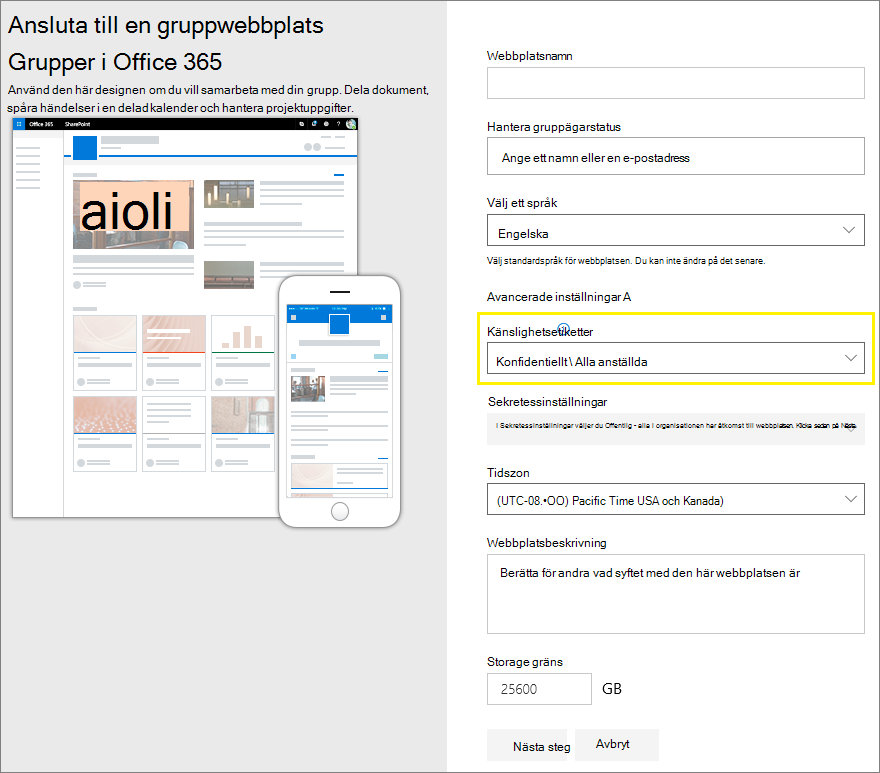
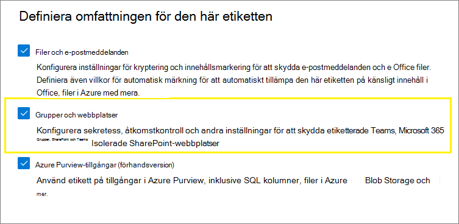
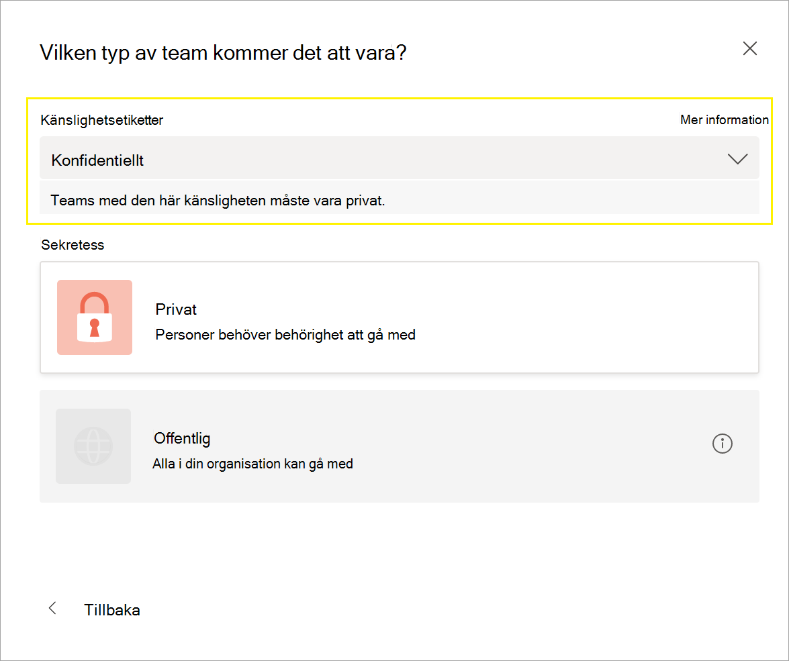
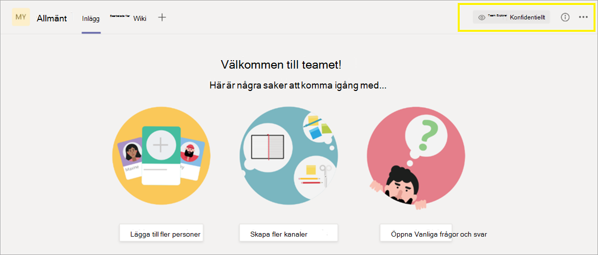
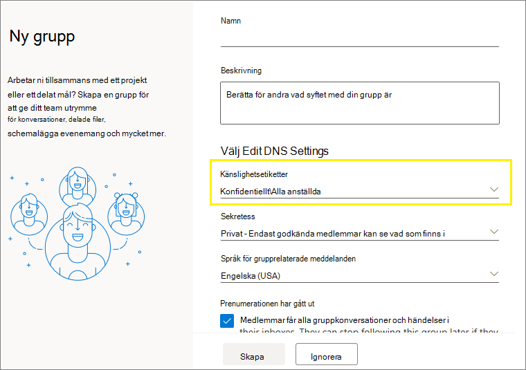
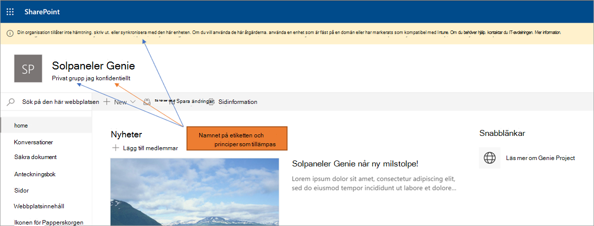

# <a name="use-sensitivity-labels-to-protect-content-in-microsoft-teams-microsoft-365-groups-and-sharepoint-sites"></a>Använd känslighetsetiketter för att skydda innehåll i Microsoft Teams, Microsoft 365-grupper och SharePoint-webbplatser

>*[Vägledning för säkerhet och efterlevnad med licensiering i Microsoft 365](/office365/servicedescriptions/microsoft-365-service-descriptions/microsoft-365-tenantlevel-services-licensing-guidance/microsoft-365-security-compliance-licensing-guidance).*

Förutom att använda [känslighetsetiketter](sensitivity-labels.md) för att klassificera och skydda dokument och e-postmeddelanden kan du också använda känslighetsetiketter för att skydda innehåll i följande behållare: Microsoft Teams-webbplatser, Microsoft 365-grupper ([kallades tidigare Office 365-grupper](https://techcommunity.microsoft.com/t5/microsoft-365-blog/office-365-groups-will-become-microsoft-365-groups/ba-p/1303601)) och SharePoint-webbplatser. Använd följande etikettinställningar för den här klassificeringen och det här skyddet på behållarnivå:

- Sekretess (offentlig eller privat) på Teams-webbplatser och i Microsoft 365-grupper
- Åtkomst för externa användare
- Extern delning från SharePoint-webbplatser
- Åtkomst från ohanterade enheter
- Autentiseringskontexter (i förhandsgranskning)

> [!IMPORTANT]
> Inställningarna för ohanterade enheter och autentiseringskontexter fungerar tillsammans med Villkorsstyrd åtkomst i Azure Active Directory. Du måste konfigurera den här beroende funktionen om du vill använda en känslighetsetikett för dessa inställningar. Ytterligare information finns i anvisningarna nedan.

När du använder den här känslighetsetiketten i en behållare som stöds, tillämpar etiketten automatiskt klassificeringen och de konfigurerade skyddsinställningarna på webbplatsen eller gruppen.

Innehållet i dessa behållare ärver dock inte etiketterna för klassificeringen eller inställningarna för filer och e-postmeddelanden, till exempel visuella markeringar och kryptering. Kontrollera att du [aktiverat känslighetsetiketter för Office-filer i SharePoint och OneDrive](sensitivity-labels-sharepoint-onedrive-files.md) så att användarna kan sätta etiketter på sina dokument på SharePoint-webbplatser eller på teamwebbplatser.

> [!NOTE]
> Känslighetsetiketter för behållare stöds inte med Microsoft Office 365 Content Delivery Network (CDN).

## <a name="using-sensitivity-labels-for-microsoft-teams-microsoft-365-groups-and-sharepoint-sites"></a>Använda känslighetsetiketter i Microsoft Teams, Microsoft 365-grupper och SharePoint-webbplatser

Innan du aktiverar känslighetsetiketter för behållare och konfigurerar känslighetsetiketter för de nya inställningarna kan användarna se och använda känslighetsetiketter i sina appar. Till exempel från Word:


När du har aktiverar och konfigurerat känslighetsetiketter för behållare kan användare även se och använda känslighetsetiketter för Microsoft Teams-webbplatser, Microsoft 365-grupper och SharePoint-webbplatser. Till exempel när du skapar en ny gruppwebbplats från SharePoint:



## <a name="how-to-enable-sensitivity-labels-for-containers-and-synchronize-labels"></a>Så här aktiverar du känslighetsetiketter för behållare och synkroniserar etiketter

Om du ännu inte har aktiverat känslighetsetiketter för behållare, ta följande steg som en engångsprocedur:

1. Eftersom den här funktionen använder funktioner från Microsoft Azure AD ska du följa anvisningarna i Microsoft Azure AD-dokumentationen för att aktivera stöd för känslighetsetiketter: [Tilldela känslighetsetiketter till Microsoft 365-grupper i Azure Active Directory](/azure/active-directory/users-groups-roles/groups-assign-sensitivity-labels).

2. Nu måste du synkronisera dina känslighetsetiketter till Microsoft Azure AD. Börja med att [ansluta till Säkerhets- och efterlevnadscentret i PowerShell](/powershell/exchange/office-365-scc/connect-to-scc-powershell/connect-to-scc-powershell).

   I en PowerShell-session som du kör som administratör kan du till exempel logga in med ett globalt administratörskonto.

3. Kör sedan följande kommando för att säkerställa att dina känslighetsetiketter kan användas tillsammans med Microsoft 365-grupper:

    ```powershell
    Execute-AzureAdLabelSync
    ```

## <a name="how-to-configure-groups-and-site-settings"></a>Hur man konfigurerar grupp- och webbplatsinställningar

Efter att känslighetsetiketter är aktiverade för behållare enligt beskrivningen i föregående avsnitt kan du sedan konfigurera skyddsinställningar för grupper och webbplatser i guiden för känslighetsetiketter. Innan känslighetsetiketter är aktiverade för behållare är inställningarna synliga i guiden men du kan inte konfigurera dem.

1. Följ de allmänna anvisningarna för att [skapa eller redigera en känslighetsetikett](create-sensitivity-labels.md#create-and-configure-sensitivity-labels) och se till att du väljer **Grupper och webbplatser** som etikettens omfång: 
    
    
    
    När endast det här omfånget har valts för etiketten visas inte etiketten i Office-appar som stöder känslighetsetiketter och kan inte tillämpas på filer och e-postmeddelanden. Den här avgränsningen mellan etiketter kan vara användbar för både användare och administratörer, men kan också göra etikettdistributionen mer komplex.
    
    Till exempel så behöver du granska din [etikettsortering](sensitivity-labels.md#label-priority-order-matters) noggrant eftersom SharePoint upptäcker när ett etiketterat dokument laddas upp till en etiketterad webbplats. I det här scenariot genereras en granskningshändelse och ett e-postmeddelande automatiskt när dokumentet har en känslig etikett med högre prioritet än webbplatsens etikett. Mer information finns i avsnittet [Granskning av händelser med känslighetsetiketter](#auditing-sensitivity-label-activities) på här sidan. 

2. Väljs sedan något eller båda alternativen på sidan **Definiera skyddsinställningar för grupper och webbplatser**:
    
    - **Inställningar för sekretess och åtkomst för externa användare** för att konfigurera **Sekretessen** och inställningarna för **Åtkomst för externa användare**. 
    - **Inställningar för extern delning och villkorsstyrd åtkomst** för att konfigurera **Kontrollera extern delning från namngivna SharePoint-webbplatser** och **Använda Azure AD villkorlig åtkomst för att skydda märkta SharePoint-webbplatser**.

3. Om du har valt **Inställningar för sekretess och åtkomst för externa användare** ska du nu konfigurera följande inställningar:
    
    - **Sekretess**: behåll standardinställningen **Offentlig** om du vill att alla i organisationen ska få åtkomst till teamets webbplats eller grupp där den här etiketten används.
        
        Välj **Privat** om du vill begränsa åtkomsten till endast godkända medlemmar i organisationen.
        
        Markera **Ingen** när du vill skydda innehåll i behållaren med hjälp av känslighetsetiketten, men ändå låta användarna konfigurera sekretessinställningen själva.
        
        Inställningarna för **Offentlig** eller **Privat** ställer in och låser sekretessinställningarna när du använder den här etiketten för behållaren. Den valda inställningen ersätter alla tidigare sekretessinställningar som kan konfigureras för teamet eller gruppen och låser sekretessvärdet så att det bara kan ändras genom att först ta bort känslighetsetiketten från behållaren. När du har tagit bort känslighetsetiketten finns sekretessinställningen från etiketten kvar och användarna kan nu ändra den igen.
    
    - **Åtkomst för externa användare**: kontrollera om gruppägaren kan [lägga till gäster i gruppen](/office365/admin/create-groups/manage-guest-access-in-groups).

4. Om du har valt **Inställningar för extern delning och enhetsåtkomst** ska du nu konfigurera följande inställningar:
    
    - **Styr extern delning från etiketterade SharePoint-webbplatser**: välj det här alternativet om du vill välja antingen extern delning för alla, nya och befintliga gäster, befintliga gäster eller bara personer i din organisation. Mer information om den här konfigurationen och inställningarna finns i SharePoint-dokumentationen [Aktivera eller inaktivera extern delning för en webbplats](/sharepoint/change-external-sharing-site).
    
    - **Använda Azure AD villkorlig åtkomst för att skydda märkta SharePoint-webbplatser**: Välj bara detta alternativ om din organisation har konfigurerat det och använder [Villkorsstyrd åtkomst i Azure Active Directory](/azure/active-directory/conditional-access/overview). Ändra sedan någon av följande inställningar:
    
        - **Avgör om användare kan komma åt SharePoint-webbplatser från ohanterade enheter**: det här alternativet använder SharePoint-funktionen som använder villkorlig åtkomst i Microsoft Azure AD för att blockera eller begränsa åtkomst till SharePoint- och OneDrive-innehåll från ohanterade enheter. Mer information finns i [Styr åtkomsten från ohanterade enheter](/sharepoint/control-access-from-unmanaged-devices) i Sharepoint-dokumentationen. Alternativet du anger för den här etikettinställningen är en motsvarighet till att köra ett PowerShell-kommando för en webbplats, enligt beskrivningen i steg 3–5 från avsnittet [Blockera eller begränsa åtkomst till en viss SharePoint-webbplats eller OneDrive](/sharepoint/control-access-from-unmanaged-devices#block-or-limit-access-to-a-specific-sharepoint-site-or-onedrive) i SharePoint-anvisningarna.
            
            Mer information om konfiguration finns i [Mer information om beroenden för alternativet ohanterade enheter](#more-information-about-the-dependencies-for-the-unmanaged-devices-option) i slutet av det här avsnittet.
            
        - **Välj en befintlig autentiseringskontext**: Detta alternativ som för närvarande är i förhandsversion låter dig tillämpa strängare åtkomstvillkor när användare öppnar SharePoint-webbplatser som har den här etiketten. Dessa villkor tillämpas när du väljer ett befintligt autentiseringskontext som har skapats och publicerats för din organisations distribution av villkorlig åtkomst. Om användare inte uppfyller de konfigurerade villkoren eller om de använder appar som inte stöder autentiseringskontexter nekas de åtkomst.
            
            Mer information om konfiguration finns i [Mer information om beroenden för alternativet autentiseringskontext](#more-information-about-the-dependencies-for-the-authentication-context-option) i slutet av det här avsnittet.
            
            Exempel på den här etikettkonfigurationen:
            
             - Du väljer ett autentiseringskontext som är konfigurerad att kräva [flerfaktorautentisering](/azure/active-directory/conditional-access/untrusted-networks). Den här etiketten appliceras sedan på en SharePoint-webbplats som innehåller mycket konfidentiella objekt. Som ett resultat, när användare från ett opålitligt nätverk försöker komma åt ett dokument på den här webbplatsen, ser de MFA-prompten som de måste slutföra innan de kan komma åt dokumentet.
             
             - Du kan välja en autentiseringskontext som är konfigurerad för [användningsvillkor](/azure/active-directory/conditional-access/terms-of-use). Den här etiketten appliceras sedan på en SharePoint-webbplats som innehåller objekt som kräver godkännande av användarvillkor på grund av juridiska eller efterlevnadsskäl. Som ett resultat, när användare försöker komma åt ett dokument på den här webbplatsen, ser de ett användardokument som de måste acceptera innan de kan få tillgång till originaldokumentet.

> [!IMPORTANT]
> Endast de här webbplats- och gruppinställningarna tillämpas när du använder etiketten för ett team, en grupp eller en webbplats. Andra etikettinställningar som kryptering och innehållsmarkering på innehållet i gruppen eller webbplatsen tillämpas inte om [etikettens omfång](sensitivity-labels.md#label-scopes) inkluderar filer och e-postmeddelanden.

Om känslighetsetiketten inte redan har publicerats publicerar du den nu genom att [lägga till den i en princip för känslighetsetiketter](create-sensitivity-labels.md#publish-sensitivity-labels-by-creating-a-label-policy). Användare som har tilldelats en princip för känslighetsetiketter som innehåller den här etiketten kan välja den för webbplatser och grupper.

##### <a name="more-information-about-the-dependencies-for-the-unmanaged-devices-option"></a>Mer information om beroenden för alternativet ohanterade enheter

Om du inte konfigurerar den beroende, villkorsstyrda åtkomstprincipen för SharePoint enligt det som dokumenteras i [Använd appbegränsningar](/sharepoint/app-enforced-restrictions)kommer det alternativ du anger här inte ha någon effekt. Den kommer dessutom inte att ha någon effekt om den är mindre restriktiv än en konfigurerad inställning på klientorganisationsnivån. Om du har konfigurerat en organisationsomfattande inställning för ohanterade enheter ska du välja en etikettinställning som är antingen likadan eller mer restriktiv

Om din klientorganisation till exempel har konfigurerats för **Tillåt begränsad åtkomst endast på webben** kommer inställningen för etiketter som ger fullständig åtkomst inte att ha någon effekt eftersom den är mindre restriktiv. För den här inställningen på klientorganisationsnivå ska du välja etikettinställningen för att blockera åtkomst (mer restriktiv) eller etikettinställningen för begränsad åtkomst (samma som inställningen för klientorganisationen).

Eftersom du kan konfigurera SharePoint-inställningarna separat från etikettkonfigurationen kontrollerar inte guiden för känslighetsetiketter om beroendena är korrekt inställda. Dessa beroenden kan konfigureras efter att etiketten skapats och publicerats, även efter att etiketten har använts. Om etiketten redan används kommer inställningen för etiketter inte användas förrän nästa gång användaren autentiserar.

##### <a name="more-information-about-the-dependencies-for-the-authentication-context-option"></a>Mer information om beroenden för alternativet autentiseringskontext

För att kunna visas i rullgardinsmenyn för val måste autentiseringskontexter skapas, konfigureras och publiceras som en del av din konfiguration av villkorsstyrd åtkomst i Azure Active Directory. Mer information och instruktioner finns i avsnittet [Konfigurera autentiseringskontexter](/azure/active-directory/conditional-access/concept-conditional-access-cloud-apps#configure-authentication-contexts) från dokumentationen för villkorsstyrd åtkomst i Azure Active Directory.

Alla appar har inte stöd för autentiseringskontexter. Om en användare med en app som inte stöds ansluter till webbplatsen som är konfigurerad för en autentiseringskontext, ser de antingen ett meddelande om åtkomst nekad eller så uppmanas de att autentisera men avvisas. Apparna som för närvarande stöder autentiseringskontexter:

- Office för webben, som inkluderar Outlook för webben

- Microsoft Planner

- Microsoft 365-applikationer för Word, Excel och PowerPoint, lägsta versioner:
    - Windows: 2103
    - macOS: 16.45.1202
    - iOS: 2.48.303
    - Android: 16.0.13924.10000

- Microsoft 365-applikationer för Outlook, lägsta versioner:
    - Windows: 2103
    - macOS: 16.45.1202
    - iOS: 4.2109.0
    - Android: 4.2025.1

- OneDrive-synkroniseringsappen, lägsta versioner:
    - Windows: 21.002
    - macOS: 21.002
    - iOS: lanseras i 12.30
    - Android: Stöds inte än

Kända begränsningar för den här förhandsversionen:

- För OneDrive-synkroniseringsappen, stöds endast för OneDrive, och inte andra webbplatser.

- Följande funktioner och appar kan vara oförenliga med autentiseringskontexter, så vi uppmuntrar dig att kontrollera att dessa fortsätter att fungera efter att en användare lyckats komma åt en webbplats genom att använda ett autentiseringskontext:
    
    - Arbetsflöden som använder PowerApps eller Power Automate
    - Appar från tredje part

## <a name="sensitivity-label-management"></a>Hantering av känslighetsetiketter

Använd följande vägledning för när du skapar, ändrar eller tar bort känslighetsetiketter som är konfigurerade för webbplatser och grupper.

### <a name="creating-and-publishing-labels-that-are-configured-for-sites-and-groups"></a>Skapa och publicera etiketter som är konfigurerade för webbplatser och grupper

När en ny känslighetsetikett skapas och publiceras visas den för användare i team, grupper och webbplatser inom en timme. Om du ändrar en befintlig etikett kan det dock ta upp till 24 timmar. Så här publicerar du en etikett för användarna när etiketten har konfigurerats för webbplats- och gruppinställningar:

1. När du har skapat och konfigurerat känslighetsetiketten kan du lägga till den här etiketten i en etikettprincip som bara gäller för några testanvändare.

2. Vänta tills ändringen replikeras:

   - Ny etikett: vänta i en timme.
   - Befintlig etikett: vänta i 24 timmar.

3. Efter den här perioden använder du något av testanvändarnas konton för att skapa en grupp, Microsoft 365-grupp eller SharePoint-webbplats med etiketten som du skapade i steg 1.

4. Om det inte finns några fel när du skapar den här åtgärden vet du att det är säkert att publicera etiketten till alla användare i klientorganisationen.

### <a name="modifying-published-labels-that-are-configured-for-sites-and-groups"></a>Modifiera publicerade etiketter som är konfigurerade för webbplatser och grupper

Det är bäst att inte ändra webbplats- och gruppinställningarna för en känslighetsetikett när etiketten har använts för team, grupper eller webbplatser. Om du gör det ska du komma ihåg att vänta i 24 timmar på att ändringarna ska replikeras till alla behållare som har etiketten tillämpad.

Om dina ändringar dessutom inkluderar inställningen **Åtkomst för externa användare**:

- Den nya inställningen gäller för nya användare men inte för befintliga användare. Om inställningen till exempel tidigare var vald och gästanvändarna hade åtkomst till webbplatsen kan de här gästanvändarna fortfarande komma åt webbplatsen efter att inställningen avmarkerats i etikettkonfigurationen.

- Sekretessinställningarna för gruppegenskaperna hiddenMembership och roleEnabled uppdateras inte.

### <a name="deleting-published-labels-that-are-configured-for-sites-and-groups"></a>Ta bort publicerade etiketter som är konfigurerade för webbplatser och grupper

Om du tar bort en känslighetsetikett där webbplats- och gruppinställningarna är aktiverade, och den etiketten ingår i en eller flera etikettprinciper, kan den här åtgärden resultera i fel för nya team, grupper och webbplatser. Använd följande riktlinjer för att undvika denna situation:

1. Ta bort känslighetsetiketten från alla etikettprinciper som innehåller etiketten.

2. Vänta i en timme.

3. Efter den här perioden kan du försöka skapa ett team, en grupp eller en webbplats och kontrollera att etiketten inte längre visas.

4. Om känslighetsetiketten inte visas kan du ta bort etiketten.

## <a name="how-to-apply-sensitivity-labels-to-containers"></a>Hur man lägger till känslighetsetiketter i behållare

Du är nu redo att använda känslighetsetiketten eller etiketterna i följande behållare:

- [Microsoft 365-grupp i Microsoft Azure AD](#apply-sensitivity-labels-to-microsoft-365-groups)
- [Teamwebbplats för Microsoft Teams](#apply-a-sensitivity-label-to-a-new-team)
- [Microsoft 365-grupp i Outlook på webben](#apply-a-sensitivity-label-to-a-new-group-in-outlook-on-the-web)
- [SharePoint-webbplats](#apply-a-sensitivity-label-to-a-new-site)

Du kan använda PowerShell om du behöver [använda en känslighetsetikett på flera webbplatser](#use-powershell-to-apply-a-sensitivity-label-to-multiple-sites).

### <a name="apply-sensitivity-labels-to-microsoft-365-groups"></a>Använda känslighetsetiketter i Microsoft 365-grupper

Du är nu redo att använda känslighetsetiketten eller etiketterna i Microsoft 365-grupper. Gå tillbaka till Microsoft Azure AD-dokumentationen för anvisningar:

- [Tilldela en etikett till en ny grupp i Microsoft Azure-portalen](/azure/active-directory/users-groups-roles/groups-assign-sensitivity-labels#assign-a-label-to-a-new-group-in-azure-portal)

- [Tilldela en etikett till en befintlig grupp i Microsoft Azure-portalen](/azure/active-directory/users-groups-roles/groups-assign-sensitivity-labels#assign-a-label-to-an-existing-group-in-azure-portal)

- [Ta bort en etikett från en befintlig grupp i Microsoft Azure-portalen](/azure/active-directory/users-groups-roles/groups-assign-sensitivity-labels#remove-a-label-from-an-existing-group-in-azure-portal).

### <a name="apply-a-sensitivity-label-to-a-new-team"></a>Använda en känslighetsetikett för ett nytt team

Användare kan välja känslighetsetiketter när de skapar nya team i Microsoft Teams. När de väljer etiketten i listrutan **Känslighet** kan sekretessinställningen ändras så att den återspeglar etikettkonfigurationen. Beroende på vilka externa användare som du har valt för etiketten antingen kan eller kan inte användarna lägga till personer utanför organisationen i gruppen.

[Läs mer om känslighetsetiketter för Teams](/microsoftteams/sensitivity-labels)



När du har skapat gruppen visas känslighetsetiketten i det övre högra hörnet i alla kanaler.



Tjänsten tillämpar automatiskt samma känslighetsetikett på Microsoft 365-gruppen och den anslutna SharePoint-teamwebbplatsen.

### <a name="apply-a-sensitivity-label-to-a-new-group-in-outlook-on-the-web"></a>Använda en känslighetsetikett för en ny grupp i Outlook på webben

När du skapar en ny grupp i Outlook på webben kan du välja eller ändra alternativet **känslighet** för publicerade etiketter:



### <a name="apply-a-sensitivity-label-to-a-new-site"></a>Använda en känslighetsetikett för en ny webbplats

Administratörer och slutanvändare kan välja känslighetsetiketter när de [skapa moderna team- och kommunikationswebbplatser](/sharepoint/create-site-collection)och expanderar **Avancerade inställningar**:


Listrutan visar etikettnamnen för markeringen och hjälpikonen visar alla etikettnamn med beskrivningen, vilket kan hjälpa användarna att fastställa vilken etikett de ska använda.

När etiketten används och användarna tar sig till webbplatsen ser de namnet på etiketten och de tillämpade principerna. Den här webbplatsen har till exempel fått etiketten **Konfidentiell** och sekretessinställningen är **Privat**:



### <a name="use-powershell-to-apply-a-sensitivity-label-to-multiple-sites"></a>Använd PowerShell för att använda en känslighetsetikett på flera webbplatser

Du kan använda cmdleten [Set-SPOSite](/powershell/module/sharepoint-online/set-sposite) och [Set-SPOTenant](/powershell/module/sharepoint-online/set-spotenant) med parametern *SensitivityLabel* från den aktuella [SharePoint Online Management Shell](/powershell/sharepoint/sharepoint-online/connect-sharepoint-online) för att använda en känslighetsetikett på flera webbplatser. Webbplatserna kan vara valfri samling av SharePoint-webbplatser eller en OneDrive-webbplats.

Kontrollera att du har version 16.0.19418.12000 eller senare av SharePoint Online Management Shell.

1. Öppna en PowerShell-session med alternativet **Kör som administratör**.

2. Om du inte känner till din etikett-GUID: [Anslut till säkerhets- och efterlevnadscentret för PowerShell](/powershell/exchange/connect-to-scc-powershell) och hämta listan över känslighetsetiketter och deras GUID.

   ```powershell
   Get-Label |ft Name, Guid
   ```

3. Sedan ska du [Ansluta till SharePoint Online PowerShell](/powershell/sharepoint/sharepoint-online/connect-sharepoint-online)och lagra din etikett-GUID som en variabel. Till exempel:

   ```powershell
   $Id = [GUID]("e48058ea-98e8-4940-8db0-ba1310fd955e")
   ```

4. Skapa en ny variabel som identifierar flera webbplatser som har en gemensam identifieringssträng i URL-adressen. Till exempel:

   ```powershell
   $sites = Get-SPOSite -IncludePersonalSite $true -Limit all -Filter "Url -like 'documents"
   ```

5. Kör följande kommando för att använda etiketten på dessa webbplatser. Med hjälp av våra exempel:

   ```powershell
   $sites | ForEach-Object {Set-SPOTenant $_.url -SensitivityLabel $Id}
   ```

Med den här raden kommandon kan du etikettera flera webbplatser i klientorganisationen med samma känslighetsetikett, och det är därför du använder cmdleten Set-SPOTenant istället för Set-SPOSite som används för konfigurationen per webbplats. Men du ska använda cmdleten Set-SPOSite när du behöver använda en annan etikett för specifika webbplatser genom att upprepa följande kommando för var och en av dessa webbplatser: `Set-SPOSite -Identity <URL> -SensitivityLabel "<labelguid>"`

## <a name="view-and-manage-sensitivity-labels-in-the-sharepoint-admin-center"></a>Visa och hantera känslighetsetiketter i administrationscentret för SharePoint

Om du vill visa, sortera och söka bland de känslighetsetiketter som används använder du sidan **Aktiva webbplatser** i det nya administrationscentret för SharePoint. Du kan först behöva lägga till kolumnen **Känslighet**:


Mer information om hur du hanterar webbplatser från sidan Aktiva webbplatser, inklusive hur du lägger till en kolumn, finns i [Hantera webbplatser i det nya administrationscentret för SharePoint](/sharepoint/manage-sites-in-new-admin-center).

Du kan också ändra och använda en etikett från den här sidan:

1. Öppna informationsfönstret genom att välja webbplatsnamnet.

2. Välj fliken **Principer** och välj sedan **Redigera** för att få fram inställningen **Känslighet**.

3. I fönstret **Redigera känslighetsinställningar** väljer du den känslighetsetikett som du vill använda på webbplatsen och väljer sedan **Spara**.

## <a name="support-for-sensitivity-labels"></a>Stöd för känslighetsetiketter.

Följande appar och tjänster stöder känslighetsetiketter som konfigurerats för webbplatser och gruppinställningar:

- Administrationscenter:

  - Administrationscentret för SharePoint
  - Azure Active Directory-portalen
  - Administrationscentret för Microsoft 365
  - Microsoft 365 Efterlevnadscenter, Microsoft 365 Säkerhetscenter, Säkerhets- och efterlevnadscenter

- Tjänster och appar för användare:

  - SharePoint
  - Teams
  - Outlook på webben och för Windows, macOS, iOS och Android
  - Forms
  - Stream
  - Planner 

Följande appar och tjänster stöder för nuvarande inte känslighetsetiketter som konfigurerats för webbplatser och gruppinställningar:

- Administrationscenter:

  - Administrationscentret för Teams
  - Administrationscentret för Exchange

- Tjänster och appar för användare:

  - Dynamics 365
  - Yammer
  - Project
  - Power BI

## <a name="classic-azure-ad-group-classification"></a>Klassisk gruppklassificering i Microsoft Azure AD

Microsoft 365 har inte längre stöd för de gamla klassificeringarna för nya Microsoft 365-grupper och SharePoint-webbplatser när du har aktiverar känslighetsetiketter för behållare. Befintliga grupper och webbplatser som stöder känslighetsetiketter visar dock fortfarande de gamla klassificeringsvärdena tills du konverterar dem till att använda känslighetsetiketter.

Som ett exempel på hur du kanske har använt den gamla gruppklassificeringen för SharePoint kan du läsa [Den moderna webbplatsklassificeringen i SharePoint](/sharepoint/dev/solution-guidance/modern-experience-site-classification).

De här klassificeringarna har konfigurerats med hjälp av Microsoft Azure AD PowerShell eller PnP-kärnbiblioteket och genom att definiera värden till `ClassificationList`-inställningen. Om din klientorganisation har definierat klassificeringsvärden visas de när du kör följande kommando från [PowerShell-modulen AzureADPreview](https://www.powershellgallery.com/packages/AzureADPreview):

```powershell
($setting["ClassificationList"])
```

Gör något av följande om du vill konvertera de gamla klassificeringarna till känslighetsetiketter:

- Använd befintliga etiketter: ange de etikettinställningar du vill använda för webbplatser och grupper genom att redigera befintliga känslighetsetiketter som redan har publicerats.

- Skapa nya etiketter: ange de etikettinställningar du vill använda för webbplatser och grupper genom att skapa och publicera nya känslighetsetiketter som har samma namn som dina befintliga klassificeringar.

Sedan:

1. Använd PowerShell för att använda känslighetsetiketterna i befintliga Microsoft 365-grupper och SharePoint-webbplatser genom att använda namnmappning. Se nästa avsnitt för instruktioner.

2. Ta bort de gamla klassificeringarna från befintliga grupper och webbplatser.

Även om du inte kan hindra användare från att skapa nya grupper i appar och tjänster som ännu inte stöder känslighetsetiketter kan du köra ett återkommande PowerShell-skript för att söka efter nya grupper som användare har skapat med de gamla klassificeringarna och konvertera dem till att använda känslighetsetiketter.

Mer information om hur du hanterar samexistensen för känslighetsetiketter och Microsoft Azure AD-klassificeringar för webbplatser och grupper finns i [Klassificering och känslighetsetiketter för Azure Active Directory för Microsoft 365-grupper](migrate-aad-classification-sensitivity-labels.md).

### <a name="use-powershell-to-convert-classifications-for-microsoft-365-groups-to-sensitivity-labels"></a>Använda PowerShell för att konvertera klassificeringar för Microsoft 365-grupper till känslighetsetiketter

1. Börja med att [ansluta till Säkerhets- och efterlevnadscentret i PowerShell](/powershell/exchange/office-365-scc/connect-to-scc-powershell/connect-to-scc-powershell).

   I en PowerShell-session som du kör som administratör kan du till exempel logga in med ett globalt administratörskonto:

2. Visa listan över känslighetsetiketter och deras GUID:er med hjälp av cmdleten [Get-Label](/powershell/module/exchange/get-label):

   ```powershell
   Get-Label |ft Name, Guid
   ```

3. Anteckna GUID:erna för de känslighetsetiketter som du vill använda för Microsoft 365-grupperna.

4. Sedan ska du [ansluta till Exchange Online PowerShell](/powershell/exchange/connect-to-exchange-online-powershell) i ett separat Windows PowerShell-fönster.

5. Använd följande kommando som ett exempel för att få listan över grupper som för närvarande har klassificeringen Allmänt:

   ```PowerShell
   $Groups= Get-UnifiedGroup | Where {$_.classification -eq "General"}
   ```

6. Lägg till den nya känslighetsetikettens GUID för varje grupp. Till exempel:

    ```PowerShell
    foreach ($g in $groups)
    {Set-UnifiedGroup -Identity $g.Identity -SensitivityLabelId "457fa763-7c59-461c-b402-ad1ac6b703cc"}
    ```

7. Upprepa steg 5 och 6 för de återstående gruppklassificeringarna.

## <a name="auditing-sensitivity-label-activities"></a>Granskning av händelser med känslighetsetiketter

> [!IMPORTANT]
> Om du använder etikettseparation genom att välja endast omfånget **Grupper och webbplatser** för etiketter som skyddar behållare: på grund av granskningshändelsen **Identifierade en felmatchning mellan dokumentens känsligheter** och e-postmeddelandet som beskrivs i det här avsnittet bör du överväga att [sortera etiketterna](sensitivity-labels.md#label-priority-order-matters) så de hamnar före etiketter som har omfånget **Filer och e-postmeddelanden**. 

Om någon överför ett dokument till en webbplats som är skyddad med en känslighetsetikett och dokumentet har en känslighetsetikett med [högre prioritet](sensitivity-labels.md#label-priority-order-matters) än känslighetsetiketten som används på webbplatsen blockeras inte den här åtgärden. Om du har till exempel använt etiketten **Allmänt** på en SharePoint-webbplats och någon laddar upp ett dokument med etiketten **Konfidentiellt** på den här webbplatsen. Eftersom en känslighetsetikett med högre prioritet identifierar innehåll som är mer känsligt än innehåll som har en lägre prioritet, kan det här vara ett säkerhetsproblem.

Även om åtgärden inte blockeras granskas den och genererar automatiskt ett e-postmeddelande till personen som har laddat upp dokumentet och webbplatsadministratören. På så sätt kan både användare och administratörer identifiera dokument som har den här felaktiga etikettprioriteringen och vid behov vidta åtgärder. Till exempel att bort eller flytta det uppladdade dokumentet från webbplatsen.

Det skulle inte vara ett säkerhetsproblem om dokumentet har en etikett med lägre prioritet än känslighetsetiketten som används på webbplatsen. Till exempel laddas ett dokument med etiketten **Allmänt** upp på en webbplats som har etiketten **Konfidentiellt**. I det här scenariot genereras ingen granskningshändelse och inget e-postmeddelande.

Om du vill söka i granskningsloggen efter den här händelsen ska du leta efter **Identifierade en felmatchning mellan dokumentens känsligheter** från kategorin **Fil- och sidaktiviteter**.

Det e-postmeddelande som genereras automatiskt har ämnesraden **Inkompatibel känslighetsetikett har upptäckts** och i e-postmeddelandet förklaras etikettfelet med en länk till det uppladdade dokumentet och webbplatsen. Det innehåller även en länk till dokumentationen som förklarar hur användare kan ändra känslighetsetiketten. För närvarande kan inte dessa automatiska e-postmeddelanden inaktiveras eller anpassas.

När någon lägger till eller tar bort en känslighetsetikett för en webbplats eller grupp granskas även den här aktiviteten, men utan att automatiskt generera ett e-postmeddelande.

Alla de här granskningshändelserna finns i [Aktiviteter kring känslighetsetiketter](search-the-audit-log-in-security-and-compliance.md#sensitivity-label-activities). Instruktioner för hur man kan söka i granskningsloggen finns i [Söka i granskningsloggen i Säkerhets- och efterlevnadscentret](search-the-audit-log-in-security-and-compliance.md).

## <a name="how-to-disable-sensitivity-labels-for-containers"></a>Hur man inaktiverar känslighetsetiketter för behållare

Du kan inaktivera känslighetsetiketterna för Microsoft Teams, Microsoft 365-grupper och SharePoint-webbplatser med hjälp av samma anvisningar som i [Aktivera stöd för känslighetsetiketter i PowerShell](/azure/active-directory/users-groups-roles/groups-assign-sensitivity-labels#enable-sensitivity-label-support-in-powershell). Men om du vill inaktivera funktionen anger du `$setting["EnableMIPLabels"] = "False"` i steg 5.

Förutom att göra alla inställningar otillgängliga för grupper och webbplatser när du skapar eller redigerar känslighetsetiketter, återställer den här åtgärden vilka egenskaper behållarna använder i sina konfigurationer. Att aktivera känslighetsetiketter för Microsoft Teams, Microsoft 365-grupper och SharePoint-webbplatser växlar egenskapen som används från **Klassificering** (används för [Microsoft Azure AD-gruppklassificering](#classic-azure-ad-group-classification)) till **Känslighet**. När du inaktiverar känslighetsetiketter för behållare ignorerar behållarna egenskapen Känslighet och använder egenskapen Klassificering igen.

Det innebär att inställningarna för etiketter från webbplatser och grupper som tidigare tillämpats på behållaren inte tillämpas och att etiketterna inte längre visas i behållaren.

Om dessa behållare har Microsoft Azure AD-klassificeringsvärden tillämpade återgår behållarna till att använda klassificeringarna igen. Tänk på att nya webbplatser eller grupper som skapats efter att du har aktiverar funktionen inte visar etiketter och inte har en klassificering. För dessa behållare och alla nya behållare kan du nu använda klassificeringsvärden. Mer information finns i [Moderna webbplatsklassificeringar för SharePoint](/sharepoint/dev/solution-guidance/modern-experience-site-classification) och [Skapa klassificeringar för Office-grupper i din organisation](../enterprise/manage-microsoft-365-groups-with-powershell.md).

## <a name="additional-resources"></a>Ytterligare resurser

Se inspelningen från webbseminariet och svar på frågor kring hur du kan [Använda känslighetsetiketter med Microsoft Teams, O365-grupper och SharePoint Online-webbplatser](https://techcommunity.microsoft.com/t5/security-privacy-and-compliance/using-sensitivity-labels-with-microsoft-teams-o365-groups-and/ba-p/1221885#M1380).

Webbseminariet spelades in med funktionens förhandsversion, så du kanske märker vissa skillnader i användargränssnittet. Informationen för den här funktionen är dock fortfarande korrekt och alla nya funktioner dokumenterats på den här sidan.