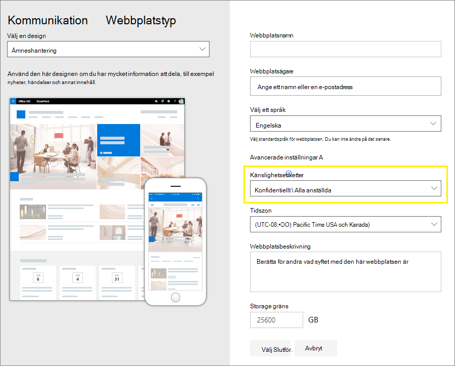

# <a name="use-sensitivity-labels-to-protect-content-in-microsoft-teams-microsoft-365-groups-and-sharepoint-sites"></a><span data-ttu-id="7fd0c-103">Använd känslighetsetiketter för att skydda innehåll i Microsoft Teams, Microsoft 365-grupper och SharePoint-webbplatser</span><span class="sxs-lookup"><span data-stu-id="7fd0c-103">Use sensitivity labels to protect content in Microsoft Teams, Microsoft 365 groups, and SharePoint sites</span></span>

><span data-ttu-id="7fd0c-104">*[Vägledning för säkerhet och efterlevnad med licensiering i Microsoft 365](/office365/servicedescriptions/microsoft-365-service-descriptions/microsoft-365-tenantlevel-services-licensing-guidance/microsoft-365-security-compliance-licensing-guidance).*</span><span class="sxs-lookup"><span data-stu-id="7fd0c-104">*[Microsoft 365 licensing guidance for security & compliance](/office365/servicedescriptions/microsoft-365-service-descriptions/microsoft-365-tenantlevel-services-licensing-guidance/microsoft-365-security-compliance-licensing-guidance).*</span></span>

<span data-ttu-id="7fd0c-105">Förutom att använda [känslighetsetiketter](sensitivity-labels.md) för att klassificera och skydda dokument och e-postmeddelanden kan du också använda känslighetsetiketter för att skydda innehåll i följande behållare: Microsoft Teams-webbplatser, Microsoft 365-grupper ([kallades tidigare Office 365-grupper](https://techcommunity.microsoft.com/t5/microsoft-365-blog/office-365-groups-will-become-microsoft-365-groups/ba-p/1303601)) och SharePoint-webbplatser.</span><span class="sxs-lookup"><span data-stu-id="7fd0c-105">In addition to using [sensitivity labels](sensitivity-labels.md) to classify and protect documents and emails, you can also use sensitivity labels to protect content in the following containers: Microsoft Teams sites, Microsoft 365 groups ([formerly Office 365 groups](https://techcommunity.microsoft.com/t5/microsoft-365-blog/office-365-groups-will-become-microsoft-365-groups/ba-p/1303601)), and SharePoint sites.</span></span> <span data-ttu-id="7fd0c-106">Använd följande etikettinställningar för den här klassificeringen och det här skyddet på behållarnivå:</span><span class="sxs-lookup"><span data-stu-id="7fd0c-106">For this container-level classification and protection, use the following label settings:</span></span>

- <span data-ttu-id="7fd0c-107">Sekretess (offentlig eller privat) på Teams-webbplatser och i Microsoft 365-grupper</span><span class="sxs-lookup"><span data-stu-id="7fd0c-107">Privacy (public or private) of teams sites and Microsoft 365 groups</span></span>
- <span data-ttu-id="7fd0c-108">Åtkomst för externa användare</span><span class="sxs-lookup"><span data-stu-id="7fd0c-108">External user access</span></span>
- <span data-ttu-id="7fd0c-109">Extern delning från SharePoint-webbplatser</span><span class="sxs-lookup"><span data-stu-id="7fd0c-109">External sharing from SharePoint sites</span></span>
- <span data-ttu-id="7fd0c-110">Åtkomst från ohanterade enheter</span><span class="sxs-lookup"><span data-stu-id="7fd0c-110">Access from unmanaged devices</span></span>
- <span data-ttu-id="7fd0c-111">Autentiseringskontexter (i förhandsgranskning)</span><span class="sxs-lookup"><span data-stu-id="7fd0c-111">Authentication contexts (in preview)</span></span>

> [!IMPORTANT]
> <span data-ttu-id="7fd0c-112">Inställningarna för ohanterade enheter och autentiseringskontexter fungerar tillsammans med Villkorsstyrd åtkomst i Azure Active Directory.</span><span class="sxs-lookup"><span data-stu-id="7fd0c-112">The settings for unmanaged devices and authentication contexts work in conjunction with Azure Active Directory Conditional Access.</span></span> <span data-ttu-id="7fd0c-113">Du måste konfigurera den här beroende funktionen om du vill använda en känslighetsetikett för dessa inställningar.</span><span class="sxs-lookup"><span data-stu-id="7fd0c-113">You must configure this dependent feature if you want to use a sensitivity label for these settings.</span></span> <span data-ttu-id="7fd0c-114">Ytterligare information finns i anvisningarna nedan.</span><span class="sxs-lookup"><span data-stu-id="7fd0c-114">Additional information is included in the instructions that follow.</span></span>

<span data-ttu-id="7fd0c-115">När du använder den här känslighetsetiketten i en behållare som stöds, tillämpar etiketten automatiskt klassificeringen och de konfigurerade skyddsinställningarna på webbplatsen eller gruppen.</span><span class="sxs-lookup"><span data-stu-id="7fd0c-115">When you apply this sensitivity label to a supported container, the label automatically applies the classification and configured protection settings to the site or group.</span></span>

<span data-ttu-id="7fd0c-116">Innehållet i dessa behållare ärver dock inte etiketterna för klassificeringen eller inställningarna för filer och e-postmeddelanden, till exempel visuella markeringar och kryptering.</span><span class="sxs-lookup"><span data-stu-id="7fd0c-116">Content in these containers however, do not inherit the labels for the classification or settings for files and emails, such as visual markings and encryption.</span></span> <span data-ttu-id="7fd0c-117">Kontrollera att du [aktiverat känslighetsetiketter för Office-filer i SharePoint och OneDrive](sensitivity-labels-sharepoint-onedrive-files.md) så att användarna kan sätta etiketter på sina dokument på SharePoint-webbplatser eller på teamwebbplatser.</span><span class="sxs-lookup"><span data-stu-id="7fd0c-117">So that users can label their documents in SharePoint sites or team sites, make sure you've [enabled sensitivity labels for Office files in SharePoint and OneDrive](sensitivity-labels-sharepoint-onedrive-files.md).</span></span>

> [!NOTE]
> <span data-ttu-id="7fd0c-118">Känslighetsetiketter för behållare stöds inte med Microsoft Office 365 Content Delivery Network (CDN).</span><span class="sxs-lookup"><span data-stu-id="7fd0c-118">Sensitivity labels for containers aren't supported with Office 365 Content Delivery Networks (CDNs).</span></span>

## <a name="using-sensitivity-labels-for-microsoft-teams-microsoft-365-groups-and-sharepoint-sites"></a><span data-ttu-id="7fd0c-119">Använda känslighetsetiketter i Microsoft Teams, Microsoft 365-grupper och SharePoint-webbplatser</span><span class="sxs-lookup"><span data-stu-id="7fd0c-119">Using sensitivity labels for Microsoft Teams, Microsoft 365 groups, and SharePoint sites</span></span>

<span data-ttu-id="7fd0c-p104">Innan du aktiverar känslighetsetiketter för behållare och konfigurerar känslighetsetiketter för de nya inställningarna kan användarna se och använda känslighetsetiketter i sina appar. Till exempel från Word:</span><span class="sxs-lookup"><span data-stu-id="7fd0c-p104">Before you enable sensitivity labels for containers and configure sensitivity labels for the new settings, users can see and apply sensitivity labels in their apps. For example, from Word:</span></span>


<span data-ttu-id="7fd0c-p105">När du har aktiverar och konfigurerat känslighetsetiketter för behållare kan användare även se och använda känslighetsetiketter för Microsoft Teams-webbplatser, Microsoft 365-grupper och SharePoint-webbplatser. Till exempel när du skapar en ny gruppwebbplats från SharePoint:</span><span class="sxs-lookup"><span data-stu-id="7fd0c-p105">After you enable and configure sensitivity labels for containers, users can additionally see and apply sensitivity labels to Microsoft team sites, Microsoft 365 groups, and SharePoint sites. For example, when you create a new team site from SharePoint:</span></span>


## <a name="how-to-enable-sensitivity-labels-for-containers-and-synchronize-labels"></a><span data-ttu-id="7fd0c-126">Så här aktiverar du känslighetsetiketter för behållare och synkroniserar etiketter</span><span class="sxs-lookup"><span data-stu-id="7fd0c-126">How to enable sensitivity labels for containers and synchronize labels</span></span>

<span data-ttu-id="7fd0c-127">Om du ännu inte har aktiverat känslighetsetiketter för behållare, ta följande steg som en engångsprocedur:</span><span class="sxs-lookup"><span data-stu-id="7fd0c-127">If you haven't yet enabled sensitivity labels for containers, do the following set of steps as a one-time procedure:</span></span>

1. <span data-ttu-id="7fd0c-128">Eftersom den här funktionen använder funktioner från Microsoft Azure AD ska du följa anvisningarna i Microsoft Azure AD-dokumentationen för att aktivera stöd för känslighetsetiketter: [Tilldela känslighetsetiketter till Microsoft 365-grupper i Azure Active Directory](/azure/active-directory/users-groups-roles/groups-assign-sensitivity-labels).</span><span class="sxs-lookup"><span data-stu-id="7fd0c-128">Because this feature uses Azure AD functionality, follow the instructions from the Azure AD documentation to enable sensitivity label support: [Assign sensitivity labels to Microsoft 365 groups in Azure Active Directory](/azure/active-directory/users-groups-roles/groups-assign-sensitivity-labels).</span></span>

2. <span data-ttu-id="7fd0c-129">Nu måste du synkronisera dina känslighetsetiketter till Microsoft Azure AD.</span><span class="sxs-lookup"><span data-stu-id="7fd0c-129">You now need to synchronize your sensitivity labels to Azure AD.</span></span> <span data-ttu-id="7fd0c-130">Börja med att [ansluta till Säkerhets- och efterlevnadscentret i PowerShell](/powershell/exchange/office-365-scc/connect-to-scc-powershell/connect-to-scc-powershell).</span><span class="sxs-lookup"><span data-stu-id="7fd0c-130">First, [connect to Security & Compliance Center PowerShell](/powershell/exchange/office-365-scc/connect-to-scc-powershell/connect-to-scc-powershell).</span></span>

   <span data-ttu-id="7fd0c-131">I en PowerShell-session som du kör som administratör kan du till exempel logga in med ett globalt administratörskonto.</span><span class="sxs-lookup"><span data-stu-id="7fd0c-131">For example, in a PowerShell session that you run as administrator, sign in with a global administrator account.</span></span>

3. <span data-ttu-id="7fd0c-132">Kör sedan följande kommando för att säkerställa att dina känslighetsetiketter kan användas tillsammans med Microsoft 365-grupper:</span><span class="sxs-lookup"><span data-stu-id="7fd0c-132">Then run the following command to ensure your sensitivity labels can be used with Microsoft 365 groups:</span></span>

    ```powershell
    Execute-AzureAdLabelSync
    ```

## <a name="how-to-configure-groups-and-site-settings"></a><span data-ttu-id="7fd0c-133">Hur man konfigurerar grupp- och webbplatsinställningar</span><span class="sxs-lookup"><span data-stu-id="7fd0c-133">How to configure groups and site settings</span></span>

<span data-ttu-id="7fd0c-134">Efter att känslighetsetiketter är aktiverade för behållare enligt beskrivningen i föregående avsnitt kan du sedan konfigurera skyddsinställningar för grupper och webbplatser i guiden för känslighetsetiketter.</span><span class="sxs-lookup"><span data-stu-id="7fd0c-134">After sensitivity labels are enabled for containers as described in the previous section, you can then configure protection settings for groups and sites in the sensitivity labeling wizard.</span></span> <span data-ttu-id="7fd0c-135">Innan känslighetsetiketter är aktiverade för behållare är inställningarna synliga i guiden men du kan inte konfigurera dem.</span><span class="sxs-lookup"><span data-stu-id="7fd0c-135">Until sensitivity labels are enabled for containers, the settings are visible in the wizard but you can't configure them.</span></span>

1. <span data-ttu-id="7fd0c-136">Följ de allmänna anvisningarna för att [skapa eller redigera en känslighetsetikett](create-sensitivity-labels.md#create-and-configure-sensitivity-labels) och se till att du väljer **Grupper och webbplatser** som etikettens omfång:</span><span class="sxs-lookup"><span data-stu-id="7fd0c-136">Follow the general instructions to [create or edit a sensitivity label](create-sensitivity-labels.md#create-and-configure-sensitivity-labels) and make sure you select **Groups & sites** for the label's scope:</span></span> 
    
    
    
    <span data-ttu-id="7fd0c-138">När endast det här omfånget har valts för etiketten visas inte etiketten i Office-appar som stöder känslighetsetiketter och kan inte tillämpas på filer och e-postmeddelanden.</span><span class="sxs-lookup"><span data-stu-id="7fd0c-138">When only this scope is selected for the label, the label won't be displayed in Office apps that support sensitivity labels and can't be applied to files and emails.</span></span> <span data-ttu-id="7fd0c-139">Den här avgränsningen mellan etiketter kan vara användbar för både användare och administratörer, men kan också göra etikettdistributionen mer komplex.</span><span class="sxs-lookup"><span data-stu-id="7fd0c-139">Having this separation of labels can be helpful for both users and administrators, but can also add to the complexity of your label deployment.</span></span>
    
    <span data-ttu-id="7fd0c-140">Till exempel så behöver du granska din [etikettsortering](sensitivity-labels.md#label-priority-order-matters) noggrant eftersom SharePoint upptäcker när ett etiketterat dokument laddas upp till en etiketterad webbplats.</span><span class="sxs-lookup"><span data-stu-id="7fd0c-140">For example, you need to carefully review your [label ordering](sensitivity-labels.md#label-priority-order-matters) because SharePoint detects when a labeled document is uploaded to a labeled site.</span></span> <span data-ttu-id="7fd0c-141">I det här scenariot genereras en granskningshändelse och ett e-postmeddelande automatiskt när dokumentet har en känslig etikett med högre prioritet än webbplatsens etikett.</span><span class="sxs-lookup"><span data-stu-id="7fd0c-141">In this scenario, an audit event and email are automatically generated when the document has a higher priority sensitivity label than the site's label.</span></span> <span data-ttu-id="7fd0c-142">Mer information finns i avsnittet [Granskning av händelser med känslighetsetiketter](#auditing-sensitivity-label-activities) på här sidan.</span><span class="sxs-lookup"><span data-stu-id="7fd0c-142">For more information, see the [Auditing sensitivity label activities](#auditing-sensitivity-label-activities) section on this page.</span></span> 

2. <span data-ttu-id="7fd0c-143">Väljs sedan något eller båda alternativen på sidan **Definiera skyddsinställningar för grupper och webbplatser**:</span><span class="sxs-lookup"><span data-stu-id="7fd0c-143">Then, on the **Define protection settings for groups and sites** page, select one or both of the available options:</span></span>
    
    - <span data-ttu-id="7fd0c-144">**Inställningar för sekretess och åtkomst för externa användare** för att konfigurera **Sekretessen** och inställningarna för **Åtkomst för externa användare**.</span><span class="sxs-lookup"><span data-stu-id="7fd0c-144">**Privacy and external user access settings** to configure the **Privacy** and **External users access** settings.</span></span> 
    - <span data-ttu-id="7fd0c-145">**Inställningar för extern delning och villkorsstyrd åtkomst** för att konfigurera **Kontrollera extern delning från namngivna SharePoint-webbplatser** och **Använda Azure AD villkorlig åtkomst för att skydda märkta SharePoint-webbplatser**.</span><span class="sxs-lookup"><span data-stu-id="7fd0c-145">**External sharing and Conditional Access settings** to configure the **Control external sharing from labeled SharePoint sites** and **Use Azure AD Conditional Access to protect labeled SharePoint sites** setting.</span></span>

3. <span data-ttu-id="7fd0c-146">Om du har valt **Inställningar för sekretess och åtkomst för externa användare** ska du nu konfigurera följande inställningar:</span><span class="sxs-lookup"><span data-stu-id="7fd0c-146">If you selected **Privacy and external user access settings**, now configure the following settings:</span></span>
    
    - <span data-ttu-id="7fd0c-147">**Sekretess**: behåll standardinställningen **Offentlig** om du vill att alla i organisationen ska få åtkomst till teamets webbplats eller grupp där den här etiketten används.</span><span class="sxs-lookup"><span data-stu-id="7fd0c-147">**Privacy**: Keep the default of **Public** if you want anyone in your organization to access the team site or group where this label is applied.</span></span>
        
        <span data-ttu-id="7fd0c-148">Välj **Privat** om du vill begränsa åtkomsten till endast godkända medlemmar i organisationen.</span><span class="sxs-lookup"><span data-stu-id="7fd0c-148">Select **Private** if you want access to be restricted to only approved members in your organization.</span></span>
        
        <span data-ttu-id="7fd0c-149">Markera **Ingen** när du vill skydda innehåll i behållaren med hjälp av känslighetsetiketten, men ändå låta användarna konfigurera sekretessinställningen själva.</span><span class="sxs-lookup"><span data-stu-id="7fd0c-149">Select **None** when you want to protect content in the container by using the sensitivity label, but still let users configure the privacy setting themselves.</span></span>
        
        <span data-ttu-id="7fd0c-150">Inställningarna för **Offentlig** eller **Privat** ställer in och låser sekretessinställningarna när du använder den här etiketten för behållaren.</span><span class="sxs-lookup"><span data-stu-id="7fd0c-150">The settings of **Public** or **Private** set and lock the privacy setting when you apply this label to the container.</span></span> <span data-ttu-id="7fd0c-151">Den valda inställningen ersätter alla tidigare sekretessinställningar som kan konfigureras för teamet eller gruppen och låser sekretessvärdet så att det bara kan ändras genom att först ta bort känslighetsetiketten från behållaren.</span><span class="sxs-lookup"><span data-stu-id="7fd0c-151">Your chosen setting replaces any previous privacy setting that might be configured for the team or group, and locks the privacy value so it can be changed only by first removing the sensitivity label from the container.</span></span> <span data-ttu-id="7fd0c-152">När du har tagit bort känslighetsetiketten finns sekretessinställningen från etiketten kvar och användarna kan nu ändra den igen.</span><span class="sxs-lookup"><span data-stu-id="7fd0c-152">After you remove the sensitivity label, the privacy setting from the label remains and users can now change it again.</span></span>
    
    - <span data-ttu-id="7fd0c-153">**Åtkomst för externa användare**: kontrollera om gruppägaren kan [lägga till gäster i gruppen](/office365/admin/create-groups/manage-guest-access-in-groups).</span><span class="sxs-lookup"><span data-stu-id="7fd0c-153">**External user access**: Control whether the group owner can [add guests to the group](/office365/admin/create-groups/manage-guest-access-in-groups).</span></span>

4. <span data-ttu-id="7fd0c-154">Om du har valt **Inställningar för extern delning och enhetsåtkomst** ska du nu konfigurera följande inställningar:</span><span class="sxs-lookup"><span data-stu-id="7fd0c-154">If you selected **Device external sharing and device access settings**, now configure the following settings:</span></span>
    
    - <span data-ttu-id="7fd0c-155">**Styr extern delning från etiketterade SharePoint-webbplatser**: välj det här alternativet om du vill välja antingen extern delning för alla, nya och befintliga gäster, befintliga gäster eller bara personer i din organisation.</span><span class="sxs-lookup"><span data-stu-id="7fd0c-155">**Control external sharing from labeled SharePoint sites**: Select this option to then select either external sharing for anyone, new and existing guests, existing guests, or only people in your organization.</span></span> <span data-ttu-id="7fd0c-156">Mer information om den här konfigurationen och inställningarna finns i SharePoint-dokumentationen [Aktivera eller inaktivera extern delning för en webbplats](/sharepoint/change-external-sharing-site).</span><span class="sxs-lookup"><span data-stu-id="7fd0c-156">For more information about this configuration and settings, see the SharePoint documentation, [Turn external sharing on or off for a site](/sharepoint/change-external-sharing-site).</span></span>
    
    - <span data-ttu-id="7fd0c-157">**Använda Azure AD villkorlig åtkomst för att skydda märkta SharePoint-webbplatser**: Välj bara detta alternativ om din organisation har konfigurerat det och använder [Villkorsstyrd åtkomst i Azure Active Directory](/azure/active-directory/conditional-access/overview).</span><span class="sxs-lookup"><span data-stu-id="7fd0c-157">**Use Azure AD Conditional Access to protect labeled SharePoint sites**: Select this option only if your organization has configured and is using [Azure Active Directory Conditional Access](/azure/active-directory/conditional-access/overview).</span></span> <span data-ttu-id="7fd0c-158">Ändra sedan någon av följande inställningar:</span><span class="sxs-lookup"><span data-stu-id="7fd0c-158">Then, select one of the following settings:</span></span>
    
        - <span data-ttu-id="7fd0c-159">**Avgör om användare kan komma åt SharePoint-webbplatser från ohanterade enheter**: det här alternativet använder SharePoint-funktionen som använder villkorlig åtkomst i Microsoft Azure AD för att blockera eller begränsa åtkomst till SharePoint- och OneDrive-innehåll från ohanterade enheter.</span><span class="sxs-lookup"><span data-stu-id="7fd0c-159">**Determine whether users can access SharePoint sites from unmanaged devices**: This option uses the SharePoint feature that uses Azure AD Conditional Access to block or limit access to SharePoint and OneDrive content from unmanaged devices.</span></span> <span data-ttu-id="7fd0c-160">Mer information finns i [Styr åtkomsten från ohanterade enheter](/sharepoint/control-access-from-unmanaged-devices) i Sharepoint-dokumentationen.</span><span class="sxs-lookup"><span data-stu-id="7fd0c-160">For more information, see [Control access from unmanaged devices](/sharepoint/control-access-from-unmanaged-devices) from the SharePoint documentation.</span></span> <span data-ttu-id="7fd0c-161">Alternativet du anger för den här etikettinställningen är en motsvarighet till att köra ett PowerShell-kommando för en webbplats, enligt beskrivningen i steg 3–5 från avsnittet [Blockera eller begränsa åtkomst till en viss SharePoint-webbplats eller OneDrive](/sharepoint/control-access-from-unmanaged-devices#block-or-limit-access-to-a-specific-sharepoint-site-or-onedrive) i SharePoint-anvisningarna.</span><span class="sxs-lookup"><span data-stu-id="7fd0c-161">The option you specify for this label setting is the equivalent of running a PowerShell command for a site, as described in steps 3-5 from the [Block or limit access to a specific SharePoint site or OneDrive](/sharepoint/control-access-from-unmanaged-devices#block-or-limit-access-to-a-specific-sharepoint-site-or-onedrive) section from the SharePoint instructions.</span></span>
            
            <span data-ttu-id="7fd0c-162">Mer information om konfiguration finns i [Mer information om beroenden för alternativet ohanterade enheter](#more-information-about-the-dependencies-for-the-unmanaged-devices-option) i slutet av det här avsnittet.</span><span class="sxs-lookup"><span data-stu-id="7fd0c-162">For additional configuration information, see [More information about the dependencies for the unmanaged devices option](#more-information-about-the-dependencies-for-the-unmanaged-devices-option) at the end of this section.</span></span>
            
        - <span data-ttu-id="7fd0c-163">**Välj en befintlig autentiseringskontext**: Detta alternativ som för närvarande är i förhandsversion låter dig tillämpa strängare åtkomstvillkor när användare öppnar SharePoint-webbplatser som har den här etiketten.</span><span class="sxs-lookup"><span data-stu-id="7fd0c-163">**Choose an existing authentication context**: Currently in preview, this option lets you enforce more stringent access conditions when users access SharePoint sites that have this label applied.</span></span> <span data-ttu-id="7fd0c-164">Dessa villkor tillämpas när du väljer ett befintligt autentiseringskontext som har skapats och publicerats för din organisations distribution av villkorlig åtkomst.</span><span class="sxs-lookup"><span data-stu-id="7fd0c-164">These conditions are enforced when you select an existing authentication context that has been created and published for your organization's Conditional Access deployment.</span></span> <span data-ttu-id="7fd0c-165">Om användare inte uppfyller de konfigurerade villkoren eller om de använder appar som inte stöder autentiseringskontexter nekas de åtkomst.</span><span class="sxs-lookup"><span data-stu-id="7fd0c-165">If users don't meet the configured conditions or if they use apps that don't support authentication contexts, they are denied access.</span></span>
            
            <span data-ttu-id="7fd0c-166">Mer information om konfiguration finns i [Mer information om beroenden för alternativet autentiseringskontext](#more-information-about-the-dependencies-for-the-authentication-context-option) i slutet av det här avsnittet.</span><span class="sxs-lookup"><span data-stu-id="7fd0c-166">For additional configuration information, see [More information about the dependencies for the authentication context option](#more-information-about-the-dependencies-for-the-authentication-context-option) at the end of this section.</span></span>
            
            <span data-ttu-id="7fd0c-167">Exempel på den här etikettkonfigurationen:</span><span class="sxs-lookup"><span data-stu-id="7fd0c-167">Examples for this label configuration:</span></span>
            
             - <span data-ttu-id="7fd0c-168">Du väljer ett autentiseringskontext som är konfigurerad att kräva [flerfaktorautentisering](/azure/active-directory/conditional-access/untrusted-networks).</span><span class="sxs-lookup"><span data-stu-id="7fd0c-168">You choose an authentication context that is configured to require [multi-factor authentication (MFA)](/azure/active-directory/conditional-access/untrusted-networks).</span></span> <span data-ttu-id="7fd0c-169">Den här etiketten appliceras sedan på en SharePoint-webbplats som innehåller mycket konfidentiella objekt.</span><span class="sxs-lookup"><span data-stu-id="7fd0c-169">This label is then applied to a SharePoint site that contains highly confidential items.</span></span> <span data-ttu-id="7fd0c-170">Som ett resultat, när användare från ett opålitligt nätverk försöker komma åt ett dokument på den här webbplatsen, ser de MFA-prompten som de måste slutföra innan de kan komma åt dokumentet.</span><span class="sxs-lookup"><span data-stu-id="7fd0c-170">As a result, when users from an untrusted network attempt to access a document in this site, they see the MFA prompt that they must complete before they can access the document.</span></span>
             
             - <span data-ttu-id="7fd0c-171">Du kan välja en autentiseringskontext som är konfigurerad för [användningsvillkor](/azure/active-directory/conditional-access/terms-of-use).</span><span class="sxs-lookup"><span data-stu-id="7fd0c-171">You choose an authentication context that is configured for [terms of use (ToU) policies](/azure/active-directory/conditional-access/terms-of-use).</span></span> <span data-ttu-id="7fd0c-172">Den här etiketten appliceras sedan på en SharePoint-webbplats som innehåller objekt som kräver godkännande av användarvillkor på grund av juridiska eller efterlevnadsskäl.</span><span class="sxs-lookup"><span data-stu-id="7fd0c-172">This label is then applied to a SharePoint site that contains items that require a terms of use acceptance for legal or compliance reasons.</span></span> <span data-ttu-id="7fd0c-173">Som ett resultat, när användare försöker komma åt ett dokument på den här webbplatsen, ser de ett användardokument som de måste acceptera innan de kan få tillgång till originaldokumentet.</span><span class="sxs-lookup"><span data-stu-id="7fd0c-173">As a result, when users attempt to access a document in this site, they see a terms of use document that they must accept before they can access the original document.</span></span>

> [!IMPORTANT]
> <span data-ttu-id="7fd0c-174">Endast de här webbplats- och gruppinställningarna tillämpas när du använder etiketten för ett team, en grupp eller en webbplats.</span><span class="sxs-lookup"><span data-stu-id="7fd0c-174">Only these site and group settings take effect when you apply the label to a team, group, or site.</span></span> <span data-ttu-id="7fd0c-175">Andra etikettinställningar som kryptering och innehållsmarkering på innehållet i gruppen eller webbplatsen tillämpas inte om [etikettens omfång](sensitivity-labels.md#label-scopes) inkluderar filer och e-postmeddelanden.</span><span class="sxs-lookup"><span data-stu-id="7fd0c-175">If the [label's scope](sensitivity-labels.md#label-scopes) includes files and emails, other label settings such as encryption and content marking aren't applied to the content within the team, group, or site.</span></span>

<span data-ttu-id="7fd0c-176">Om känslighetsetiketten inte redan har publicerats publicerar du den nu genom att [lägga till den i en princip för känslighetsetiketter](create-sensitivity-labels.md#publish-sensitivity-labels-by-creating-a-label-policy).</span><span class="sxs-lookup"><span data-stu-id="7fd0c-176">If your sensitivity label isn't already published, now publish it by [adding it to a sensitivity label policy](create-sensitivity-labels.md#publish-sensitivity-labels-by-creating-a-label-policy).</span></span> <span data-ttu-id="7fd0c-177">Användare som har tilldelats en princip för känslighetsetiketter som innehåller den här etiketten kan välja den för webbplatser och grupper.</span><span class="sxs-lookup"><span data-stu-id="7fd0c-177">The users who are assigned a sensitivity label policy that includes this label will be able to select it for sites and groups.</span></span>

##### <a name="more-information-about-the-dependencies-for-the-unmanaged-devices-option"></a><span data-ttu-id="7fd0c-178">Mer information om beroenden för alternativet ohanterade enheter</span><span class="sxs-lookup"><span data-stu-id="7fd0c-178">More information about the dependencies for the unmanaged devices option</span></span>

<span data-ttu-id="7fd0c-179">Om du inte konfigurerar den beroende, villkorsstyrda åtkomstprincipen för SharePoint enligt det som dokumenteras i [Använd appbegränsningar](/sharepoint/app-enforced-restrictions)kommer det alternativ du anger här inte ha någon effekt.</span><span class="sxs-lookup"><span data-stu-id="7fd0c-179">If you don't configure the dependent conditional access policy for SharePoint as documented in [Use app-enforced restrictions](/sharepoint/app-enforced-restrictions), the option you specify here will have no effect.</span></span> <span data-ttu-id="7fd0c-180">Den kommer dessutom inte att ha någon effekt om den är mindre restriktiv än en konfigurerad inställning på klientorganisationsnivån.</span><span class="sxs-lookup"><span data-stu-id="7fd0c-180">Additionally, it will have no effect if it's less restrictive than a configured setting at the tenant level.</span></span> <span data-ttu-id="7fd0c-181">Om du har konfigurerat en organisationsomfattande inställning för ohanterade enheter ska du välja en etikettinställning som är antingen likadan eller mer restriktiv</span><span class="sxs-lookup"><span data-stu-id="7fd0c-181">If you have configured an organization-wide setting for unmanaged devices, choose a label setting that's either the same or more restrictive</span></span>

<span data-ttu-id="7fd0c-182">Om din klientorganisation till exempel har konfigurerats för **Tillåt begränsad åtkomst endast på webben** kommer inställningen för etiketter som ger fullständig åtkomst inte att ha någon effekt eftersom den är mindre restriktiv.</span><span class="sxs-lookup"><span data-stu-id="7fd0c-182">For example, if your tenant is configured for **Allow limited, web-only access**, the label setting that allows full access will have no effect because it's less restrictive.</span></span> <span data-ttu-id="7fd0c-183">För den här inställningen på klientorganisationsnivå ska du välja etikettinställningen för att blockera åtkomst (mer restriktiv) eller etikettinställningen för begränsad åtkomst (samma som inställningen för klientorganisationen).</span><span class="sxs-lookup"><span data-stu-id="7fd0c-183">For this tenant-level setting, choose the label setting to block access (more restrictive) or the label setting for limited access (the same as the tenant setting).</span></span>

<span data-ttu-id="7fd0c-184">Eftersom du kan konfigurera SharePoint-inställningarna separat från etikettkonfigurationen kontrollerar inte guiden för känslighetsetiketter om beroendena är korrekt inställda.</span><span class="sxs-lookup"><span data-stu-id="7fd0c-184">Because you can configure the SharePoint settings separately from the label configuration, there's no check in the sensitivity label wizard that the dependencies are in place.</span></span> <span data-ttu-id="7fd0c-185">Dessa beroenden kan konfigureras efter att etiketten skapats och publicerats, även efter att etiketten har använts.</span><span class="sxs-lookup"><span data-stu-id="7fd0c-185">These dependencies can be configured after the label is created and published, and even after the label is applied.</span></span> <span data-ttu-id="7fd0c-186">Om etiketten redan används kommer inställningen för etiketter inte användas förrän nästa gång användaren autentiserar.</span><span class="sxs-lookup"><span data-stu-id="7fd0c-186">However, if the label is already applied, the label setting won't take effect until after the user next authenticates.</span></span>

##### <a name="more-information-about-the-dependencies-for-the-authentication-context-option"></a><span data-ttu-id="7fd0c-187">Mer information om beroenden för alternativet autentiseringskontext</span><span class="sxs-lookup"><span data-stu-id="7fd0c-187">More information about the dependencies for the authentication context option</span></span>

<span data-ttu-id="7fd0c-188">För att kunna visas i rullgardinsmenyn för val måste autentiseringskontexter skapas, konfigureras och publiceras som en del av din konfiguration av villkorsstyrd åtkomst i Azure Active Directory.</span><span class="sxs-lookup"><span data-stu-id="7fd0c-188">To display in the drop-down list for selection, authentication contexts must be created, configured, and published as part of your Azure Active Directory Condition Access configuration.</span></span> <span data-ttu-id="7fd0c-189">Mer information och instruktioner finns i avsnittet [Konfigurera autentiseringskontexter](/azure/active-directory/conditional-access/concept-conditional-access-cloud-apps#configure-authentication-contexts) från dokumentationen för villkorsstyrd åtkomst i Azure Active Directory.</span><span class="sxs-lookup"><span data-stu-id="7fd0c-189">For more information and instructions, see the [Configure authentication contexts](/azure/active-directory/conditional-access/concept-conditional-access-cloud-apps#configure-authentication-contexts) section from the Azure AD Conditional Access documentation.</span></span>

<span data-ttu-id="7fd0c-p123">Alla appar har inte stöd för autentiseringskontexter. Om en användare med en app som inte stöds ansluter till webbplatsen som är konfigurerad för en autentiseringskontext, ser de antingen ett meddelande om åtkomst nekad eller så uppmanas de att autentisera men avvisas. Apparna som för närvarande stöder autentiseringskontexter:</span><span class="sxs-lookup"><span data-stu-id="7fd0c-p123">Not all apps support authentication contexts. If a user with an unsupported app connects to the site that's configured for an authentication context, they see either an access denied message or they are prompted to authenticate but rejected. The apps that currently support authentication contexts:</span></span>

- <span data-ttu-id="7fd0c-193">Office för webben, som inkluderar Outlook för webben</span><span class="sxs-lookup"><span data-stu-id="7fd0c-193">Office for the web, which includes Outlook for the web</span></span>

- <span data-ttu-id="7fd0c-194">Microsoft Planner</span><span class="sxs-lookup"><span data-stu-id="7fd0c-194">Microsoft Planner</span></span>

- <span data-ttu-id="7fd0c-195">Microsoft 365-applikationer för Word, Excel och PowerPoint, lägsta versioner:</span><span class="sxs-lookup"><span data-stu-id="7fd0c-195">Microsoft 365 Apps for Word, Excel, and PowerPoint; minimum versions:</span></span>
    - <span data-ttu-id="7fd0c-196">Windows: 2103</span><span class="sxs-lookup"><span data-stu-id="7fd0c-196">Windows: 2103</span></span>
    - <span data-ttu-id="7fd0c-197">macOS: 16.45.1202</span><span class="sxs-lookup"><span data-stu-id="7fd0c-197">macOS: 16.45.1202</span></span>
    - <span data-ttu-id="7fd0c-198">iOS: 2.48.303</span><span class="sxs-lookup"><span data-stu-id="7fd0c-198">iOS: 2.48.303</span></span>
    - <span data-ttu-id="7fd0c-199">Android: 16.0.13924.10000</span><span class="sxs-lookup"><span data-stu-id="7fd0c-199">Android: 16.0.13924.10000</span></span>

- <span data-ttu-id="7fd0c-200">Microsoft 365-applikationer för Outlook, lägsta versioner:</span><span class="sxs-lookup"><span data-stu-id="7fd0c-200">Microsoft 365 Apps for Outlook; minimum versions:</span></span>
    - <span data-ttu-id="7fd0c-201">Windows: 2103</span><span class="sxs-lookup"><span data-stu-id="7fd0c-201">Windows: 2103</span></span>
    - <span data-ttu-id="7fd0c-202">macOS: 16.45.1202</span><span class="sxs-lookup"><span data-stu-id="7fd0c-202">macOS: 16.45.1202</span></span>
    - <span data-ttu-id="7fd0c-203">iOS: 4.2109.0</span><span class="sxs-lookup"><span data-stu-id="7fd0c-203">iOS: 4.2109.0</span></span>
    - <span data-ttu-id="7fd0c-204">Android: 4.2025.1</span><span class="sxs-lookup"><span data-stu-id="7fd0c-204">Android: 4.2025.1</span></span>

- <span data-ttu-id="7fd0c-205">OneDrive-synkroniseringsappen, lägsta versioner:</span><span class="sxs-lookup"><span data-stu-id="7fd0c-205">OneDrive sync app, minimum versions:</span></span>
    - <span data-ttu-id="7fd0c-206">Windows: 21.002</span><span class="sxs-lookup"><span data-stu-id="7fd0c-206">Windows: 21.002</span></span>
    - <span data-ttu-id="7fd0c-207">macOS: 21.002</span><span class="sxs-lookup"><span data-stu-id="7fd0c-207">macOS: 21.002</span></span>
    - <span data-ttu-id="7fd0c-208">iOS: lanseras i 12.30</span><span class="sxs-lookup"><span data-stu-id="7fd0c-208">iOS: Rolling out in 12.30</span></span>
    - <span data-ttu-id="7fd0c-209">Android: Stöds inte än</span><span class="sxs-lookup"><span data-stu-id="7fd0c-209">Android: Not yet supported</span></span>

<span data-ttu-id="7fd0c-210">Kända begränsningar för den här förhandsversionen:</span><span class="sxs-lookup"><span data-stu-id="7fd0c-210">Known limitations for this preview:</span></span>

- <span data-ttu-id="7fd0c-211">Den här funktionen distribueras fortfarande till vissa klientorganisationer.</span><span class="sxs-lookup"><span data-stu-id="7fd0c-211">This feature is still rolling out to some tenants.</span></span> <span data-ttu-id="7fd0c-212">Om principen Villkorsstyrd åtkomst\* med ditt valda autentiseringskontext inte verkställs när en användare öppnar webbplatsen kan du använda PowerShell för att bekräfta att konfigurationen är korrekt och att alla krav uppfylls.</span><span class="sxs-lookup"><span data-stu-id="7fd0c-212">If the Conditional Access policy with your selected authentication context is not taking effect when a user accesses the site, you can use PowerShell to confirm that your configuration is correct and all prerequisites are met.</span></span> <span data-ttu-id="7fd0c-213">Du måste ta bort känslighetsetiketten från webbplatsen och sedan konfigurera webbplatsen för autentiseringskontext med hjälp av cmdleten [Set-SPOSite](/powershell/module/sharepoint-online/set-sposite) från aktuell [SharePoint Online Management Shell](/powershell/sharepoint/sharepoint-online/connect-sharepoint-online).</span><span class="sxs-lookup"><span data-stu-id="7fd0c-213">You'll need to remove the sensitivity label from the site and then configure the site for the authentication context by using the [Set-SPOSite](/powershell/module/sharepoint-online/set-sposite) cmdlet from the current [SharePoint Online Management Shell](/powershell/sharepoint/sharepoint-online/connect-sharepoint-online).</span></span> <span data-ttu-id="7fd0c-214">Om den här metoden fungerar bör du vänta några dagar till innan du försöker använda känslighetsetiketten igen.</span><span class="sxs-lookup"><span data-stu-id="7fd0c-214">If this method works, wait a few more days before you try to apply the sensitivity label again.</span></span>
    
    <span data-ttu-id="7fd0c-215">Så här testar du autentiseringskontext med PowerShell:</span><span class="sxs-lookup"><span data-stu-id="7fd0c-215">To test the authentication context by using PowerShell:</span></span>
    
    ```powershell
    Set-SPOSite -Identity <site url> -ConditionalAccessPolicy AuthenticationContext -AuthenticationContextName "Name of authentication context"
    ```
    
    <span data-ttu-id="7fd0c-216">Om du vill ta bort autentiseringskontext så att du kan prova att använda känslighetsetiketten igen:</span><span class="sxs-lookup"><span data-stu-id="7fd0c-216">To remove the authentication context so you can try to apply the sensitivity label again:</span></span>
    
    ```powershell
    Set-SPOSite -Identity <site url> -ConditionalAccessPolicy AuthenticationContext -AuthenticationContextName ""
    ```

- <span data-ttu-id="7fd0c-217">För OneDrive-synkroniseringsappen, stöds endast för OneDrive, och inte andra webbplatser.</span><span class="sxs-lookup"><span data-stu-id="7fd0c-217">For the OneDrive sync app, supported for OneDrive only and not for other sites.</span></span>

- <span data-ttu-id="7fd0c-218">Följande funktioner och appar kan vara oförenliga med autentiseringskontexter, så vi uppmuntrar dig att kontrollera att dessa fortsätter att fungera efter att en användare lyckats komma åt en webbplats genom att använda ett autentiseringskontext:</span><span class="sxs-lookup"><span data-stu-id="7fd0c-218">The following features and apps might be incompatible with authentication contexts, so we encourage you to check that these continue to work after a user successfully accesses  a site by using an authentication context:</span></span>
    
    - <span data-ttu-id="7fd0c-219">Arbetsflöden som använder PowerApps eller Power Automate</span><span class="sxs-lookup"><span data-stu-id="7fd0c-219">Workflows that use PowerApps or Power Automate</span></span>
    - <span data-ttu-id="7fd0c-220">Appar från tredje part</span><span class="sxs-lookup"><span data-stu-id="7fd0c-220">Third-party apps</span></span>

## <a name="sensitivity-label-management"></a><span data-ttu-id="7fd0c-221">Hantering av känslighetsetiketter</span><span class="sxs-lookup"><span data-stu-id="7fd0c-221">Sensitivity label management</span></span>

<span data-ttu-id="7fd0c-222">Använd följande vägledning för när du skapar, ändrar eller tar bort känslighetsetiketter som är konfigurerade för webbplatser och grupper.</span><span class="sxs-lookup"><span data-stu-id="7fd0c-222">Use the following guidance for when you create, modify, or delete sensitivity labels that are configured for sites and groups.</span></span>

### <a name="creating-and-publishing-labels-that-are-configured-for-sites-and-groups"></a><span data-ttu-id="7fd0c-223">Skapa och publicera etiketter som är konfigurerade för webbplatser och grupper</span><span class="sxs-lookup"><span data-stu-id="7fd0c-223">Creating and publishing labels that are configured for sites and groups</span></span>

<span data-ttu-id="7fd0c-224">När en ny känslighetsetikett skapas och publiceras visas den för användare i team, grupper och webbplatser inom en timme.</span><span class="sxs-lookup"><span data-stu-id="7fd0c-224">When a new sensitivity label is created and published, it's visible for users in teams, groups, and sites within one hour.</span></span> <span data-ttu-id="7fd0c-225">Om du ändrar en befintlig etikett kan det dock ta upp till 24 timmar.</span><span class="sxs-lookup"><span data-stu-id="7fd0c-225">However, if you modify an existing label, allow up to 24 hours.</span></span> <span data-ttu-id="7fd0c-226">Så här publicerar du en etikett för användarna när etiketten har konfigurerats för webbplats- och gruppinställningar:</span><span class="sxs-lookup"><span data-stu-id="7fd0c-226">Use the following guidance to publish a label for your users when that label is configured for site and group settings:</span></span>

1. <span data-ttu-id="7fd0c-227">När du har skapat och konfigurerat känslighetsetiketten kan du lägga till den här etiketten i en etikettprincip som bara gäller för några testanvändare.</span><span class="sxs-lookup"><span data-stu-id="7fd0c-227">After you create and configure the sensitivity label, add this label to a label policy that applies to just a few test users.</span></span>

2. <span data-ttu-id="7fd0c-228">Vänta tills ändringen replikeras:</span><span class="sxs-lookup"><span data-stu-id="7fd0c-228">Wait for the change to replicate:</span></span>

   - <span data-ttu-id="7fd0c-229">Ny etikett: vänta i en timme.</span><span class="sxs-lookup"><span data-stu-id="7fd0c-229">New label: Wait for one hour.</span></span>
   - <span data-ttu-id="7fd0c-230">Befintlig etikett: vänta i 24 timmar.</span><span class="sxs-lookup"><span data-stu-id="7fd0c-230">Existing label: Wait for 24 hours.</span></span>

3. <span data-ttu-id="7fd0c-231">Efter den här perioden använder du något av testanvändarnas konton för att skapa en grupp, Microsoft 365-grupp eller SharePoint-webbplats med etiketten som du skapade i steg 1.</span><span class="sxs-lookup"><span data-stu-id="7fd0c-231">After this wait period, use one of the test user accounts to create a team, Microsoft 365 group, or SharePoint site with the label that you created in step 1.</span></span>

4. <span data-ttu-id="7fd0c-232">Om det inte finns några fel när du skapar den här åtgärden vet du att det är säkert att publicera etiketten till alla användare i klientorganisationen.</span><span class="sxs-lookup"><span data-stu-id="7fd0c-232">If there are no errors during this creation operation, you know it's safe to publish the label to all users in your tenant.</span></span>

### <a name="modifying-published-labels-that-are-configured-for-sites-and-groups"></a><span data-ttu-id="7fd0c-233">Modifiera publicerade etiketter som är konfigurerade för webbplatser och grupper</span><span class="sxs-lookup"><span data-stu-id="7fd0c-233">Modifying published labels that are configured for sites and groups</span></span>

<span data-ttu-id="7fd0c-234">Det är bäst att inte ändra webbplats- och gruppinställningarna för en känslighetsetikett när etiketten har använts för team, grupper eller webbplatser.</span><span class="sxs-lookup"><span data-stu-id="7fd0c-234">As a best practice, don't change the site and group settings for a sensitivity label after the label has been applied to teams, groups, or sites.</span></span> <span data-ttu-id="7fd0c-235">Om du gör det ska du komma ihåg att vänta i 24 timmar på att ändringarna ska replikeras till alla behållare som har etiketten tillämpad.</span><span class="sxs-lookup"><span data-stu-id="7fd0c-235">If you do, remember to wait for 24 hours for the changes to replicate to all containers that have the label applied.</span></span>

<span data-ttu-id="7fd0c-236">Om dina ändringar dessutom inkluderar inställningen **Åtkomst för externa användare**:</span><span class="sxs-lookup"><span data-stu-id="7fd0c-236">In addition, if your changes include the **External users access** setting:</span></span>

- <span data-ttu-id="7fd0c-p127">Den nya inställningen gäller för nya användare men inte för befintliga användare. Om inställningen till exempel tidigare var vald och gästanvändarna hade åtkomst till webbplatsen kan de här gästanvändarna fortfarande komma åt webbplatsen efter att inställningen avmarkerats i etikettkonfigurationen.</span><span class="sxs-lookup"><span data-stu-id="7fd0c-p127">The new setting applies to new users but not to existing users. For example, if this setting was previously selected and as a result, guest users accessed the site, these guest users can still access the site after this setting is cleared in the label configuration.</span></span>

- <span data-ttu-id="7fd0c-239">Sekretessinställningarna för gruppegenskaperna hiddenMembership och roleEnabled uppdateras inte.</span><span class="sxs-lookup"><span data-stu-id="7fd0c-239">The privacy settings for the group properties hiddenMembership and roleEnabled aren't updated.</span></span>

### <a name="deleting-published-labels-that-are-configured-for-sites-and-groups"></a><span data-ttu-id="7fd0c-240">Ta bort publicerade etiketter som är konfigurerade för webbplatser och grupper</span><span class="sxs-lookup"><span data-stu-id="7fd0c-240">Deleting published labels that are configured for sites and groups</span></span>

<span data-ttu-id="7fd0c-p128">Om du tar bort en känslighetsetikett där webbplats- och gruppinställningarna är aktiverade, och den etiketten ingår i en eller flera etikettprinciper, kan den här åtgärden resultera i fel för nya team, grupper och webbplatser. Använd följande riktlinjer för att undvika denna situation:</span><span class="sxs-lookup"><span data-stu-id="7fd0c-p128">If you delete a sensitivity label that has the site and group settings enabled, and that label is included in one or more label policies, this action can result in creation failures for new teams, groups, and sites. To avoid this situation, use the following guidance:</span></span>

1. <span data-ttu-id="7fd0c-243">Ta bort känslighetsetiketten från alla etikettprinciper som innehåller etiketten.</span><span class="sxs-lookup"><span data-stu-id="7fd0c-243">Remove the sensitivity label from all label policies that include the label.</span></span>

2. <span data-ttu-id="7fd0c-244">Vänta i en timme.</span><span class="sxs-lookup"><span data-stu-id="7fd0c-244">Wait for one hour.</span></span>

3. <span data-ttu-id="7fd0c-245">Efter den här perioden kan du försöka skapa ett team, en grupp eller en webbplats och kontrollera att etiketten inte längre visas.</span><span class="sxs-lookup"><span data-stu-id="7fd0c-245">After this wait period, try creating a team, group, or site and confirm that the label is no longer visible.</span></span>

4. <span data-ttu-id="7fd0c-246">Om känslighetsetiketten inte visas kan du ta bort etiketten.</span><span class="sxs-lookup"><span data-stu-id="7fd0c-246">If the sensitivity label isn't visible, you can now safely delete the label.</span></span>

## <a name="how-to-apply-sensitivity-labels-to-containers"></a><span data-ttu-id="7fd0c-247">Hur man lägger till känslighetsetiketter i behållare</span><span class="sxs-lookup"><span data-stu-id="7fd0c-247">How to apply sensitivity labels to containers</span></span>

<span data-ttu-id="7fd0c-248">Du är nu redo att använda känslighetsetiketten eller etiketterna i följande behållare:</span><span class="sxs-lookup"><span data-stu-id="7fd0c-248">You're now ready to apply the sensitivity label or labels to the following containers:</span></span>

- [<span data-ttu-id="7fd0c-249">Microsoft 365-grupp i Microsoft Azure AD</span><span class="sxs-lookup"><span data-stu-id="7fd0c-249">Microsoft 365 group in Azure AD</span></span>](#apply-sensitivity-labels-to-microsoft-365-groups)
- [<span data-ttu-id="7fd0c-250">Teamwebbplats för Microsoft Teams</span><span class="sxs-lookup"><span data-stu-id="7fd0c-250">Microsoft Teams team site</span></span>](#apply-a-sensitivity-label-to-a-new-team)
- [<span data-ttu-id="7fd0c-251">Microsoft 365-grupp i Outlook på webben</span><span class="sxs-lookup"><span data-stu-id="7fd0c-251">Microsoft 365 group in Outlook on the web</span></span>](#apply-a-sensitivity-label-to-a-new-group-in-outlook-on-the-web)
- [<span data-ttu-id="7fd0c-252">SharePoint-webbplats</span><span class="sxs-lookup"><span data-stu-id="7fd0c-252">SharePoint site</span></span>](#apply-a-sensitivity-label-to-a-new-site)

<span data-ttu-id="7fd0c-253">Du kan använda PowerShell om du behöver [använda en känslighetsetikett på flera webbplatser](#use-powershell-to-apply-a-sensitivity-label-to-multiple-sites).</span><span class="sxs-lookup"><span data-stu-id="7fd0c-253">You can use PowerShell if you need to [apply a sensitivity label to multiple sites](#use-powershell-to-apply-a-sensitivity-label-to-multiple-sites).</span></span>

### <a name="apply-sensitivity-labels-to-microsoft-365-groups"></a><span data-ttu-id="7fd0c-254">Använda känslighetsetiketter i Microsoft 365-grupper</span><span class="sxs-lookup"><span data-stu-id="7fd0c-254">Apply sensitivity labels to Microsoft 365 groups</span></span>

<span data-ttu-id="7fd0c-255">Du är nu redo att använda känslighetsetiketten eller etiketterna i Microsoft 365-grupper.</span><span class="sxs-lookup"><span data-stu-id="7fd0c-255">You're now ready to apply the sensitivity label or labels to Microsoft 365 groups.</span></span> <span data-ttu-id="7fd0c-256">Gå tillbaka till Microsoft Azure AD-dokumentationen för anvisningar:</span><span class="sxs-lookup"><span data-stu-id="7fd0c-256">Return to the Azure AD documentation for instructions:</span></span>

- [<span data-ttu-id="7fd0c-257">Tilldela en etikett till en ny grupp i Microsoft Azure-portalen</span><span class="sxs-lookup"><span data-stu-id="7fd0c-257">Assign a label to a new group in Azure portal</span></span>](/azure/active-directory/users-groups-roles/groups-assign-sensitivity-labels#assign-a-label-to-a-new-group-in-azure-portal)

- [<span data-ttu-id="7fd0c-258">Tilldela en etikett till en befintlig grupp i Microsoft Azure-portalen</span><span class="sxs-lookup"><span data-stu-id="7fd0c-258">Assign a label to an existing group in Azure portal</span></span>](/azure/active-directory/users-groups-roles/groups-assign-sensitivity-labels#assign-a-label-to-an-existing-group-in-azure-portal)

- <span data-ttu-id="7fd0c-259">[Ta bort en etikett från en befintlig grupp i Microsoft Azure-portalen](/azure/active-directory/users-groups-roles/groups-assign-sensitivity-labels#remove-a-label-from-an-existing-group-in-azure-portal).</span><span class="sxs-lookup"><span data-stu-id="7fd0c-259">[Remove a label from an existing group in Azure portal](/azure/active-directory/users-groups-roles/groups-assign-sensitivity-labels#remove-a-label-from-an-existing-group-in-azure-portal).</span></span>

### <a name="apply-a-sensitivity-label-to-a-new-team"></a><span data-ttu-id="7fd0c-260">Använda en känslighetsetikett för ett nytt team</span><span class="sxs-lookup"><span data-stu-id="7fd0c-260">Apply a sensitivity label to a new team</span></span>

<span data-ttu-id="7fd0c-261">Användare kan välja känslighetsetiketter när de skapar nya team i Microsoft Teams.</span><span class="sxs-lookup"><span data-stu-id="7fd0c-261">Users can select sensitivity labels when they create new teams in Microsoft Teams.</span></span> <span data-ttu-id="7fd0c-262">När de väljer etiketten i listrutan **Känslighet** kan sekretessinställningen ändras så att den återspeglar etikettkonfigurationen.</span><span class="sxs-lookup"><span data-stu-id="7fd0c-262">When they select the label from the **Sensitivity** dropdown, the privacy setting might change to reflect the label configuration.</span></span> <span data-ttu-id="7fd0c-263">Beroende på vilka externa användare som du har valt för etiketten antingen kan eller kan inte användarna lägga till personer utanför organisationen i gruppen.</span><span class="sxs-lookup"><span data-stu-id="7fd0c-263">Depending on the external users access setting you selected for the label, users can or can't add people outside the organization to the team.</span></span>

[<span data-ttu-id="7fd0c-264">Läs mer om känslighetsetiketter för Teams</span><span class="sxs-lookup"><span data-stu-id="7fd0c-264">Learn more about sensitivity labels for Teams</span></span>](/microsoftteams/sensitivity-labels)


<span data-ttu-id="7fd0c-266">När du har skapat gruppen visas känslighetsetiketten i det övre högra hörnet i alla kanaler.</span><span class="sxs-lookup"><span data-stu-id="7fd0c-266">After you create the team, the sensitivity label appears in the upper-right corner of all channels.</span></span>


<span data-ttu-id="7fd0c-268">Tjänsten tillämpar automatiskt samma känslighetsetikett på Microsoft 365-gruppen och den anslutna SharePoint-teamwebbplatsen.</span><span class="sxs-lookup"><span data-stu-id="7fd0c-268">The service automatically applies the same sensitivity label to the Microsoft 365 group and the connected SharePoint team site.</span></span>

### <a name="apply-a-sensitivity-label-to-a-new-group-in-outlook-on-the-web"></a><span data-ttu-id="7fd0c-269">Använda en känslighetsetikett för en ny grupp i Outlook på webben</span><span class="sxs-lookup"><span data-stu-id="7fd0c-269">Apply a sensitivity label to a new group in Outlook on the web</span></span>

<span data-ttu-id="7fd0c-270">När du skapar en ny grupp i Outlook på webben kan du välja eller ändra alternativet **känslighet** för publicerade etiketter:</span><span class="sxs-lookup"><span data-stu-id="7fd0c-270">In Outlook on the web, when you create a new group, you can select or change the **Sensitivity** option for published labels:</span></span>


### <a name="apply-a-sensitivity-label-to-a-new-site"></a><span data-ttu-id="7fd0c-272">Använda en känslighetsetikett för en ny webbplats</span><span class="sxs-lookup"><span data-stu-id="7fd0c-272">Apply a sensitivity label to a new site</span></span>

<span data-ttu-id="7fd0c-273">Administratörer och slutanvändare kan välja känslighetsetiketter när de [skapa moderna team- och kommunikationswebbplatser](/sharepoint/create-site-collection)och expanderar **Avancerade inställningar**:</span><span class="sxs-lookup"><span data-stu-id="7fd0c-273">Admins and end users can select sensitivity labels when they [create modern team sites and communication sites](/sharepoint/create-site-collection), and expand **Advanced settings**:</span></span>



<span data-ttu-id="7fd0c-275">Listrutan visar etikettnamnen för markeringen och hjälpikonen visar alla etikettnamn med beskrivningen, vilket kan hjälpa användarna att fastställa vilken etikett de ska använda.</span><span class="sxs-lookup"><span data-stu-id="7fd0c-275">The dropdown box displays the label names for the selection, and the help icon displays all the label names with their tooltip, which can help users determine the correct label to apply.</span></span>

<span data-ttu-id="7fd0c-276">När etiketten används och användarna tar sig till webbplatsen ser de namnet på etiketten och de tillämpade principerna.</span><span class="sxs-lookup"><span data-stu-id="7fd0c-276">When the label is applied, and users browse to the site, they see the name of the label and applied policies.</span></span> <span data-ttu-id="7fd0c-277">Den här webbplatsen har till exempel fått etiketten **Konfidentiell** och sekretessinställningen är **Privat**:</span><span class="sxs-lookup"><span data-stu-id="7fd0c-277">For example, this site has been labeled as **Confidential**, and the privacy setting is set to **Private**:</span></span>


### <a name="use-powershell-to-apply-a-sensitivity-label-to-multiple-sites"></a><span data-ttu-id="7fd0c-279">Använd PowerShell för att använda en känslighetsetikett på flera webbplatser</span><span class="sxs-lookup"><span data-stu-id="7fd0c-279">Use PowerShell to apply a sensitivity label to multiple sites</span></span>

<span data-ttu-id="7fd0c-280">Du kan använda cmdleten [Set-SPOSite](/powershell/module/sharepoint-online/set-sposite) och [Set-SPOTenant](/powershell/module/sharepoint-online/set-spotenant) med parametern *SensitivityLabel* från den aktuella [SharePoint Online Management Shell](/powershell/sharepoint/sharepoint-online/connect-sharepoint-online) för att använda en känslighetsetikett på flera webbplatser.</span><span class="sxs-lookup"><span data-stu-id="7fd0c-280">You can use the [Set-SPOSite](/powershell/module/sharepoint-online/set-sposite) and [Set-SPOTenant](/powershell/module/sharepoint-online/set-spotenant) cmdlet with the *SensitivityLabel* parameter from the current [SharePoint Online Management Shell](/powershell/sharepoint/sharepoint-online/connect-sharepoint-online) to apply a sensitivity label to many sites.</span></span> <span data-ttu-id="7fd0c-281">Webbplatserna kan vara valfri samling av SharePoint-webbplatser eller en OneDrive-webbplats.</span><span class="sxs-lookup"><span data-stu-id="7fd0c-281">The sites can be any SharePoint site collection, or a OneDrive site.</span></span>

<span data-ttu-id="7fd0c-282">Kontrollera att du har version 16.0.19418.12000 eller senare av SharePoint Online Management Shell.</span><span class="sxs-lookup"><span data-stu-id="7fd0c-282">Make sure you have version 16.0.19418.12000 or later of the SharePoint Online Management Shell.</span></span>

1. <span data-ttu-id="7fd0c-283">Öppna en PowerShell-session med alternativet **Kör som administratör**.</span><span class="sxs-lookup"><span data-stu-id="7fd0c-283">Open a PowerShell session with the **Run as Administrator** option.</span></span>

2. <span data-ttu-id="7fd0c-284">Om du inte känner till din etikett-GUID: [Anslut till säkerhets- och efterlevnadscentret för PowerShell](/powershell/exchange/connect-to-scc-powershell) och hämta listan över känslighetsetiketter och deras GUID.</span><span class="sxs-lookup"><span data-stu-id="7fd0c-284">If you don't know your label GUID: [Connect to Security & Compliance Center PowerShell](/powershell/exchange/connect-to-scc-powershell) and get the list of sensitivity labels and their GUIDs.</span></span>

   ```powershell
   Get-Label |ft Name, Guid
   ```

3. <span data-ttu-id="7fd0c-285">Sedan ska du [Ansluta till SharePoint Online PowerShell](/powershell/sharepoint/sharepoint-online/connect-sharepoint-online)och lagra din etikett-GUID som en variabel.</span><span class="sxs-lookup"><span data-stu-id="7fd0c-285">Now [connect to SharePoint Online PowerShell](/powershell/sharepoint/sharepoint-online/connect-sharepoint-online) and store your label GUID as a variable.</span></span> <span data-ttu-id="7fd0c-286">Till exempel:</span><span class="sxs-lookup"><span data-stu-id="7fd0c-286">For example:</span></span>

   ```powershell
   $Id = [GUID]("e48058ea-98e8-4940-8db0-ba1310fd955e")
   ```

4. <span data-ttu-id="7fd0c-p134">Skapa en ny variabel som identifierar flera webbplatser som har en gemensam identifieringssträng i URL-adressen. Till exempel:</span><span class="sxs-lookup"><span data-stu-id="7fd0c-p134">Create a new variable that identifies multiple sites that have an identifying string in common in their URL. For example:</span></span>

   ```powershell
   $sites = Get-SPOSite -IncludePersonalSite $true -Limit all -Filter "Url -like 'documents"
   ```

5. <span data-ttu-id="7fd0c-p135">Kör följande kommando för att använda etiketten på dessa webbplatser. Med hjälp av våra exempel:</span><span class="sxs-lookup"><span data-stu-id="7fd0c-p135">Run the following command to apply the label to these sites. Using our examples:</span></span>

   ```powershell
   $sites | ForEach-Object {Set-SPOTenant $_.url -SensitivityLabel $Id}
   ```

<span data-ttu-id="7fd0c-291">Med den här raden kommandon kan du etikettera flera webbplatser i klientorganisationen med samma känslighetsetikett, och det är därför du använder cmdleten Set-SPOTenant istället för Set-SPOSite som används för konfigurationen per webbplats.</span><span class="sxs-lookup"><span data-stu-id="7fd0c-291">This series of commands lets you label multiple sites across your tenant with the same sensitivity label, which is why you use the Set-SPOTenant cmdlet, rather than the Set-SPOSite cmdlet that's for per-site configuration.</span></span> <span data-ttu-id="7fd0c-292">Men du ska använda cmdleten Set-SPOSite när du behöver använda en annan etikett för specifika webbplatser genom att upprepa följande kommando för var och en av dessa webbplatser: `Set-SPOSite -Identity <URL> -SensitivityLabel "<labelguid>"`</span><span class="sxs-lookup"><span data-stu-id="7fd0c-292">However, use the Set-SPOSite cmdlet when you need to apply a different label to specific sites by repeating the following command for each of these sites: `Set-SPOSite -Identity <URL> -SensitivityLabel "<labelguid>"`</span></span>

## <a name="view-and-manage-sensitivity-labels-in-the-sharepoint-admin-center"></a><span data-ttu-id="7fd0c-293">Visa och hantera känslighetsetiketter i administrationscentret för SharePoint</span><span class="sxs-lookup"><span data-stu-id="7fd0c-293">View and manage sensitivity labels in the SharePoint admin center</span></span>

<span data-ttu-id="7fd0c-294">Om du vill visa, sortera och söka bland de känslighetsetiketter som används använder du sidan **Aktiva webbplatser** i det nya administrationscentret för SharePoint.</span><span class="sxs-lookup"><span data-stu-id="7fd0c-294">To view, sort, and search the applied sensitivity labels, use the **Active sites** page in the new SharePoint admin center.</span></span> <span data-ttu-id="7fd0c-295">Du kan först behöva lägga till kolumnen **Känslighet**:</span><span class="sxs-lookup"><span data-stu-id="7fd0c-295">You might need to first add the **Sensitivity** column:</span></span>


<span data-ttu-id="7fd0c-297">Mer information om hur du hanterar webbplatser från sidan Aktiva webbplatser, inklusive hur du lägger till en kolumn, finns i [Hantera webbplatser i det nya administrationscentret för SharePoint](/sharepoint/manage-sites-in-new-admin-center).</span><span class="sxs-lookup"><span data-stu-id="7fd0c-297">For more information about managing sites from the Active sites page, including how to add a column, see [Manage sites in the new SharePoint admin center](/sharepoint/manage-sites-in-new-admin-center).</span></span>

<span data-ttu-id="7fd0c-298">Du kan också ändra och använda en etikett från den här sidan:</span><span class="sxs-lookup"><span data-stu-id="7fd0c-298">You can also change and apply a label from this page:</span></span>

1. <span data-ttu-id="7fd0c-299">Öppna informationsfönstret genom att välja webbplatsnamnet.</span><span class="sxs-lookup"><span data-stu-id="7fd0c-299">Select the site name to open the details pane.</span></span>

2. <span data-ttu-id="7fd0c-300">Välj fliken **Principer** och välj sedan **Redigera** för att få fram inställningen **Känslighet**.</span><span class="sxs-lookup"><span data-stu-id="7fd0c-300">Select the **Policies** tab, and then select **Edit** for the **Sensitivity** setting.</span></span>

3. <span data-ttu-id="7fd0c-301">I fönstret **Redigera känslighetsinställningar** väljer du den känslighetsetikett som du vill använda på webbplatsen och väljer sedan **Spara**.</span><span class="sxs-lookup"><span data-stu-id="7fd0c-301">From the **Edit sensitivity setting** pane, select the sensitivity label you want to apply to the site, and then select **Save**.</span></span>

## <a name="support-for-sensitivity-labels"></a><span data-ttu-id="7fd0c-302">Stöd för känslighetsetiketter.</span><span class="sxs-lookup"><span data-stu-id="7fd0c-302">Support for sensitivity labels</span></span>

<span data-ttu-id="7fd0c-303">Följande appar och tjänster stöder känslighetsetiketter som konfigurerats för webbplatser och gruppinställningar:</span><span class="sxs-lookup"><span data-stu-id="7fd0c-303">The following apps and services support sensitivity labels configured for sites and group settings:</span></span>

- <span data-ttu-id="7fd0c-304">Administrationscenter:</span><span class="sxs-lookup"><span data-stu-id="7fd0c-304">Admin centers:</span></span>

  - <span data-ttu-id="7fd0c-305">Administrationscentret för SharePoint</span><span class="sxs-lookup"><span data-stu-id="7fd0c-305">SharePoint admin center</span></span>
  - <span data-ttu-id="7fd0c-306">Azure Active Directory-portalen</span><span class="sxs-lookup"><span data-stu-id="7fd0c-306">Azure Active Directory portal</span></span>
  - <span data-ttu-id="7fd0c-307">Administrationscentret för Microsoft 365</span><span class="sxs-lookup"><span data-stu-id="7fd0c-307">Microsoft 365 admin center</span></span>
  - <span data-ttu-id="7fd0c-308">Microsoft 365 Efterlevnadscenter, Microsoft 365 Säkerhetscenter, Säkerhets- och efterlevnadscenter</span><span class="sxs-lookup"><span data-stu-id="7fd0c-308">Microsoft 365 compliance center, Microsoft 365 security center, Security & Compliance Center</span></span>

- <span data-ttu-id="7fd0c-309">Tjänster och appar för användare:</span><span class="sxs-lookup"><span data-stu-id="7fd0c-309">User apps and services:</span></span>

  - <span data-ttu-id="7fd0c-310">SharePoint</span><span class="sxs-lookup"><span data-stu-id="7fd0c-310">SharePoint</span></span>
  - <span data-ttu-id="7fd0c-311">Teams</span><span class="sxs-lookup"><span data-stu-id="7fd0c-311">Teams</span></span>
  - <span data-ttu-id="7fd0c-312">Outlook på webben och för Windows, macOS, iOS och Android</span><span class="sxs-lookup"><span data-stu-id="7fd0c-312">Outlook on the web and for Windows, macOS, iOS, and Android</span></span>
  - <span data-ttu-id="7fd0c-313">Forms</span><span class="sxs-lookup"><span data-stu-id="7fd0c-313">Forms</span></span>
  - <span data-ttu-id="7fd0c-314">Stream</span><span class="sxs-lookup"><span data-stu-id="7fd0c-314">Stream</span></span>
  - <span data-ttu-id="7fd0c-315">Planner</span><span class="sxs-lookup"><span data-stu-id="7fd0c-315">Planner</span></span> 

<span data-ttu-id="7fd0c-316">Följande appar och tjänster stöder för nuvarande inte känslighetsetiketter som konfigurerats för webbplatser och gruppinställningar:</span><span class="sxs-lookup"><span data-stu-id="7fd0c-316">The following apps and services don't currently support sensitivity labels configured for sites and group settings:</span></span>

- <span data-ttu-id="7fd0c-317">Administrationscenter:</span><span class="sxs-lookup"><span data-stu-id="7fd0c-317">Admin centers:</span></span>

  - <span data-ttu-id="7fd0c-318">Administrationscentret för Teams</span><span class="sxs-lookup"><span data-stu-id="7fd0c-318">Teams admin center</span></span>
  - <span data-ttu-id="7fd0c-319">Administrationscentret för Exchange</span><span class="sxs-lookup"><span data-stu-id="7fd0c-319">Exchange admin center</span></span>

- <span data-ttu-id="7fd0c-320">Tjänster och appar för användare:</span><span class="sxs-lookup"><span data-stu-id="7fd0c-320">User apps and services:</span></span>

  - <span data-ttu-id="7fd0c-321">Dynamics 365</span><span class="sxs-lookup"><span data-stu-id="7fd0c-321">Dynamics 365</span></span>
  - <span data-ttu-id="7fd0c-322">Yammer</span><span class="sxs-lookup"><span data-stu-id="7fd0c-322">Yammer</span></span>
  - <span data-ttu-id="7fd0c-323">Project</span><span class="sxs-lookup"><span data-stu-id="7fd0c-323">Project</span></span>
  - <span data-ttu-id="7fd0c-324">Power BI</span><span class="sxs-lookup"><span data-stu-id="7fd0c-324">Power BI</span></span>

## <a name="classic-azure-ad-group-classification"></a><span data-ttu-id="7fd0c-325">Klassisk gruppklassificering i Microsoft Azure AD</span><span class="sxs-lookup"><span data-stu-id="7fd0c-325">Classic Azure AD group classification</span></span>

<span data-ttu-id="7fd0c-326">Microsoft 365 har inte längre stöd för de gamla klassificeringarna för nya Microsoft 365-grupper och SharePoint-webbplatser när du har aktiverar känslighetsetiketter för behållare.</span><span class="sxs-lookup"><span data-stu-id="7fd0c-326">Microsoft 365 no longer supports the old classifications for new Microsoft 365 groups and SharePoint sites after you enable sensitivity labels for containers.</span></span> <span data-ttu-id="7fd0c-327">Befintliga grupper och webbplatser som stöder känslighetsetiketter visar dock fortfarande de gamla klassificeringsvärdena tills du konverterar dem till att använda känslighetsetiketter.</span><span class="sxs-lookup"><span data-stu-id="7fd0c-327">However, existing groups and sites that support sensitivity labels still display the old classification values until you convert them to use sensitivity labels.</span></span>

<span data-ttu-id="7fd0c-328">Som ett exempel på hur du kanske har använt den gamla gruppklassificeringen för SharePoint kan du läsa [Den moderna webbplatsklassificeringen i SharePoint](/sharepoint/dev/solution-guidance/modern-experience-site-classification).</span><span class="sxs-lookup"><span data-stu-id="7fd0c-328">As an example of how you might have used the old group classification for SharePoint, see [SharePoint "modern" sites classification](/sharepoint/dev/solution-guidance/modern-experience-site-classification).</span></span>

<span data-ttu-id="7fd0c-329">De här klassificeringarna har konfigurerats med hjälp av Microsoft Azure AD PowerShell eller PnP-kärnbiblioteket och genom att definiera värden till `ClassificationList`-inställningen.</span><span class="sxs-lookup"><span data-stu-id="7fd0c-329">These classifications were configured by using Azure AD PowerShell or the PnP Core library and defining values for the `ClassificationList` setting.</span></span> <span data-ttu-id="7fd0c-330">Om din klientorganisation har definierat klassificeringsvärden visas de när du kör följande kommando från [PowerShell-modulen AzureADPreview](https://www.powershellgallery.com/packages/AzureADPreview):</span><span class="sxs-lookup"><span data-stu-id="7fd0c-330">If your tenant has classification values defined, they are shown when you run the following command from the [AzureADPreview PowerShell module](https://www.powershellgallery.com/packages/AzureADPreview):</span></span>

```powershell
($setting["ClassificationList"])
```

<span data-ttu-id="7fd0c-331">Gör något av följande om du vill konvertera de gamla klassificeringarna till känslighetsetiketter:</span><span class="sxs-lookup"><span data-stu-id="7fd0c-331">To convert your old classifications to sensitivity labels, do one of the following:</span></span>

- <span data-ttu-id="7fd0c-332">Använd befintliga etiketter: ange de etikettinställningar du vill använda för webbplatser och grupper genom att redigera befintliga känslighetsetiketter som redan har publicerats.</span><span class="sxs-lookup"><span data-stu-id="7fd0c-332">Use existing labels: Specify the label settings you want for sites and groups by editing existing sensitivity labels that are already published.</span></span>

- <span data-ttu-id="7fd0c-333">Skapa nya etiketter: ange de etikettinställningar du vill använda för webbplatser och grupper genom att skapa och publicera nya känslighetsetiketter som har samma namn som dina befintliga klassificeringar.</span><span class="sxs-lookup"><span data-stu-id="7fd0c-333">Create new labels: Specify the label settings you want for sites and groups by creating and publishing new sensitivity labels that have the same names as your existing classifications.</span></span>

<span data-ttu-id="7fd0c-334">Sedan:</span><span class="sxs-lookup"><span data-stu-id="7fd0c-334">Then:</span></span>

1. <span data-ttu-id="7fd0c-p140">Använd PowerShell för att använda känslighetsetiketterna i befintliga Microsoft 365-grupper och SharePoint-webbplatser genom att använda namnmappning. Se nästa avsnitt för instruktioner.</span><span class="sxs-lookup"><span data-stu-id="7fd0c-p140">Use PowerShell to apply the sensitivity labels to existing Microsoft 365 groups and SharePoint sites by using name mapping. See the next section for instructions.</span></span>

2. <span data-ttu-id="7fd0c-337">Ta bort de gamla klassificeringarna från befintliga grupper och webbplatser.</span><span class="sxs-lookup"><span data-stu-id="7fd0c-337">Remove the old classifications from the existing groups and sites.</span></span>

<span data-ttu-id="7fd0c-338">Även om du inte kan hindra användare från att skapa nya grupper i appar och tjänster som ännu inte stöder känslighetsetiketter kan du köra ett återkommande PowerShell-skript för att söka efter nya grupper som användare har skapat med de gamla klassificeringarna och konvertera dem till att använda känslighetsetiketter.</span><span class="sxs-lookup"><span data-stu-id="7fd0c-338">Although you can't prevent users from creating new groups in apps and services that don't yet support sensitivity labels, you can run a recurring PowerShell script to look for new groups that users have created with the old classifications, and convert these to use sensitivity labels.</span></span>

<span data-ttu-id="7fd0c-339">Mer information om hur du hanterar samexistensen för känslighetsetiketter och Microsoft Azure AD-klassificeringar för webbplatser och grupper finns i [Klassificering och känslighetsetiketter för Azure Active Directory för Microsoft 365-grupper](migrate-aad-classification-sensitivity-labels.md).</span><span class="sxs-lookup"><span data-stu-id="7fd0c-339">To help you manage the coexistence of sensitivity labels and Azure AD classifications for sites and groups, see [Azure Active Directory classification and sensitivity labels for Microsoft 365 groups](migrate-aad-classification-sensitivity-labels.md).</span></span>

### <a name="use-powershell-to-convert-classifications-for-microsoft-365-groups-to-sensitivity-labels"></a><span data-ttu-id="7fd0c-340">Använda PowerShell för att konvertera klassificeringar för Microsoft 365-grupper till känslighetsetiketter</span><span class="sxs-lookup"><span data-stu-id="7fd0c-340">Use PowerShell to convert classifications for Microsoft 365 groups to sensitivity labels</span></span>

1. <span data-ttu-id="7fd0c-341">Börja med att [ansluta till Säkerhets- och efterlevnadscentret i PowerShell](/powershell/exchange/office-365-scc/connect-to-scc-powershell/connect-to-scc-powershell).</span><span class="sxs-lookup"><span data-stu-id="7fd0c-341">First, [connect to Security & Compliance Center PowerShell](/powershell/exchange/office-365-scc/connect-to-scc-powershell/connect-to-scc-powershell).</span></span>

   <span data-ttu-id="7fd0c-342">I en PowerShell-session som du kör som administratör kan du till exempel logga in med ett globalt administratörskonto:</span><span class="sxs-lookup"><span data-stu-id="7fd0c-342">For example, in a PowerShell session that you run as administrator, sign in with a global administrator account:</span></span>

2. <span data-ttu-id="7fd0c-343">Visa listan över känslighetsetiketter och deras GUID:er med hjälp av cmdleten [Get-Label](/powershell/module/exchange/get-label):</span><span class="sxs-lookup"><span data-stu-id="7fd0c-343">Get the list of sensitivity labels and their GUIDs by using the [Get-Label](/powershell/module/exchange/get-label) cmdlet:</span></span>

   ```powershell
   Get-Label |ft Name, Guid
   ```

3. <span data-ttu-id="7fd0c-344">Anteckna GUID:erna för de känslighetsetiketter som du vill använda för Microsoft 365-grupperna.</span><span class="sxs-lookup"><span data-stu-id="7fd0c-344">Make a note of the GUIDs for the sensitivity labels you want to apply to your Microsoft 365 groups.</span></span>

4. <span data-ttu-id="7fd0c-345">Sedan ska du [ansluta till Exchange Online PowerShell](/powershell/exchange/connect-to-exchange-online-powershell) i ett separat Windows PowerShell-fönster.</span><span class="sxs-lookup"><span data-stu-id="7fd0c-345">Now [connect to Exchange Online PowerShell](/powershell/exchange/connect-to-exchange-online-powershell) in a separate Windows PowerShell window.</span></span>

5. <span data-ttu-id="7fd0c-346">Använd följande kommando som ett exempel för att få listan över grupper som för närvarande har klassificeringen Allmänt:</span><span class="sxs-lookup"><span data-stu-id="7fd0c-346">Use the following command as an example to get the list of groups that currently have the classification of "General":</span></span>

   ```PowerShell
   $Groups= Get-UnifiedGroup | Where {$_.classification -eq "General"}
   ```

6. <span data-ttu-id="7fd0c-p141">Lägg till den nya känslighetsetikettens GUID för varje grupp. Till exempel:</span><span class="sxs-lookup"><span data-stu-id="7fd0c-p141">For each group, add the new sensitivity label GUID. For example:</span></span>

    ```PowerShell
    foreach ($g in $groups)
    {Set-UnifiedGroup -Identity $g.Identity -SensitivityLabelId "457fa763-7c59-461c-b402-ad1ac6b703cc"}
    ```

7. <span data-ttu-id="7fd0c-349">Upprepa steg 5 och 6 för de återstående gruppklassificeringarna.</span><span class="sxs-lookup"><span data-stu-id="7fd0c-349">Repeat steps 5 and 6 for your remaining group classifications.</span></span>

## <a name="auditing-sensitivity-label-activities"></a><span data-ttu-id="7fd0c-350">Granskning av händelser med känslighetsetiketter</span><span class="sxs-lookup"><span data-stu-id="7fd0c-350">Auditing sensitivity label activities</span></span>

> [!IMPORTANT]
> <span data-ttu-id="7fd0c-351">Om du använder etikettseparation genom att välja endast omfånget **Grupper och webbplatser** för etiketter som skyddar behållare: på grund av granskningshändelsen **Identifierade en felmatchning mellan dokumentens känsligheter** och e-postmeddelandet som beskrivs i det här avsnittet bör du överväga att [sortera etiketterna](sensitivity-labels.md#label-priority-order-matters) så de hamnar före etiketter som har omfånget **Filer och e-postmeddelanden**.</span><span class="sxs-lookup"><span data-stu-id="7fd0c-351">If you use label separation by selecting just the **Groups & sites** scope for labels that protect containers: Because of the **Detected document sensitivity mismatch** audit event and email described in this section, consider [ordering these labels](sensitivity-labels.md#label-priority-order-matters) before labels that have a scope for **Files & emails**.</span></span> 

<span data-ttu-id="7fd0c-352">Om någon överför ett dokument till en webbplats som är skyddad med en känslighetsetikett och dokumentet har en känslighetsetikett med [högre prioritet](sensitivity-labels.md#label-priority-order-matters) än känslighetsetiketten som används på webbplatsen blockeras inte den här åtgärden.</span><span class="sxs-lookup"><span data-stu-id="7fd0c-352">If somebody uploads a document to a site that's protected with a sensitivity label and their document has a [higher priority](sensitivity-labels.md#label-priority-order-matters) sensitivity label than the sensitivity label applied to the site, this action isn't blocked.</span></span> <span data-ttu-id="7fd0c-353">Om du har till exempel använt etiketten **Allmänt** på en SharePoint-webbplats och någon laddar upp ett dokument med etiketten **Konfidentiellt** på den här webbplatsen.</span><span class="sxs-lookup"><span data-stu-id="7fd0c-353">For example, you've applied the **General** label to a SharePoint site, and somebody uploads to this site a document labeled **Confidential**.</span></span> <span data-ttu-id="7fd0c-354">Eftersom en känslighetsetikett med högre prioritet identifierar innehåll som är mer känsligt än innehåll som har en lägre prioritet, kan det här vara ett säkerhetsproblem.</span><span class="sxs-lookup"><span data-stu-id="7fd0c-354">Because a sensitivity label with a higher priority identifies content that is more sensitivity than content that has a lower priority order, this situation could be a security concern.</span></span>

<span data-ttu-id="7fd0c-355">Även om åtgärden inte blockeras granskas den och genererar automatiskt ett e-postmeddelande till personen som har laddat upp dokumentet och webbplatsadministratören.</span><span class="sxs-lookup"><span data-stu-id="7fd0c-355">Although the action isn't blocked, it is audited and automatically generates an email to the person who uploaded the document and the site administrator.</span></span> <span data-ttu-id="7fd0c-356">På så sätt kan både användare och administratörer identifiera dokument som har den här felaktiga etikettprioriteringen och vid behov vidta åtgärder.</span><span class="sxs-lookup"><span data-stu-id="7fd0c-356">As a result, both the user and administrators can identify documents that have this misalignment of label priority and take action if needed.</span></span> <span data-ttu-id="7fd0c-357">Till exempel att bort eller flytta det uppladdade dokumentet från webbplatsen.</span><span class="sxs-lookup"><span data-stu-id="7fd0c-357">For example, delete or move the uploaded document from the site.</span></span>

<span data-ttu-id="7fd0c-358">Det skulle inte vara ett säkerhetsproblem om dokumentet har en etikett med lägre prioritet än känslighetsetiketten som används på webbplatsen.</span><span class="sxs-lookup"><span data-stu-id="7fd0c-358">It wouldn't be a security concern if the document has a lower priority sensitivity label than the sensitivity label applied to the site.</span></span> <span data-ttu-id="7fd0c-359">Till exempel laddas ett dokument med etiketten **Allmänt** upp på en webbplats som har etiketten **Konfidentiellt**.</span><span class="sxs-lookup"><span data-stu-id="7fd0c-359">For example, a document labeled **General** is uploaded to a site labeled **Confidential**.</span></span> <span data-ttu-id="7fd0c-360">I det här scenariot genereras ingen granskningshändelse och inget e-postmeddelande.</span><span class="sxs-lookup"><span data-stu-id="7fd0c-360">In this scenario, an auditing event and email aren't generated.</span></span>

<span data-ttu-id="7fd0c-361">Om du vill söka i granskningsloggen efter den här händelsen ska du leta efter **Identifierade en felmatchning mellan dokumentens känsligheter** från kategorin **Fil- och sidaktiviteter**.</span><span class="sxs-lookup"><span data-stu-id="7fd0c-361">To search the audit log for this event, look for **Detected document sensitivity mismatch** from the **File and page activities** category.</span></span>

<span data-ttu-id="7fd0c-362">Det e-postmeddelande som genereras automatiskt har ämnesraden **Inkompatibel känslighetsetikett har upptäckts** och i e-postmeddelandet förklaras etikettfelet med en länk till det uppladdade dokumentet och webbplatsen.</span><span class="sxs-lookup"><span data-stu-id="7fd0c-362">The automatically generated email has the subject **Incompatible sensitivity label detected** and the email message explains the labeling mismatch with a link to the uploaded document and site.</span></span> <span data-ttu-id="7fd0c-363">Det innehåller även en länk till dokumentationen som förklarar hur användare kan ändra känslighetsetiketten.</span><span class="sxs-lookup"><span data-stu-id="7fd0c-363">It also contains a documentation link that explains how users can change the sensitivity label.</span></span> <span data-ttu-id="7fd0c-364">För närvarande kan inte dessa automatiska e-postmeddelanden inaktiveras eller anpassas.</span><span class="sxs-lookup"><span data-stu-id="7fd0c-364">Currently, these automated emails cannot be disabled or customized.</span></span>

<span data-ttu-id="7fd0c-365">När någon lägger till eller tar bort en känslighetsetikett för en webbplats eller grupp granskas även den här aktiviteten, men utan att automatiskt generera ett e-postmeddelande.</span><span class="sxs-lookup"><span data-stu-id="7fd0c-365">When somebody adds or removes a sensitivity label to or from a site or group, these activities are also audited but without automatically generating an email.</span></span>

<span data-ttu-id="7fd0c-366">Alla de här granskningshändelserna finns i [Aktiviteter kring känslighetsetiketter](search-the-audit-log-in-security-and-compliance.md#sensitivity-label-activities).</span><span class="sxs-lookup"><span data-stu-id="7fd0c-366">All these auditing events can be found in the [Sensitivity label activities](search-the-audit-log-in-security-and-compliance.md#sensitivity-label-activities) category.</span></span> <span data-ttu-id="7fd0c-367">Instruktioner för hur man kan söka i granskningsloggen finns i [Söka i granskningsloggen i Säkerhets- och efterlevnadscentret](search-the-audit-log-in-security-and-compliance.md).</span><span class="sxs-lookup"><span data-stu-id="7fd0c-367">For instructions to search the audit log, see [Search the audit log in the Security & Compliance Center](search-the-audit-log-in-security-and-compliance.md).</span></span>

## <a name="how-to-disable-sensitivity-labels-for-containers"></a><span data-ttu-id="7fd0c-368">Hur man inaktiverar känslighetsetiketter för behållare</span><span class="sxs-lookup"><span data-stu-id="7fd0c-368">How to disable sensitivity labels for containers</span></span>

<span data-ttu-id="7fd0c-369">Du kan inaktivera känslighetsetiketterna för Microsoft Teams, Microsoft 365-grupper och SharePoint-webbplatser med hjälp av samma anvisningar som i [Aktivera stöd för känslighetsetiketter i PowerShell](/azure/active-directory/users-groups-roles/groups-assign-sensitivity-labels#enable-sensitivity-label-support-in-powershell).</span><span class="sxs-lookup"><span data-stu-id="7fd0c-369">You can turn off sensitivity labels for Microsoft Teams, Microsoft 365 groups, and SharePoint sites by using the same instructions from [Enable sensitivity label support in PowerShell](/azure/active-directory/users-groups-roles/groups-assign-sensitivity-labels#enable-sensitivity-label-support-in-powershell).</span></span> <span data-ttu-id="7fd0c-370">Men om du vill inaktivera funktionen anger du `$setting["EnableMIPLabels"] = "False"` i steg 5.</span><span class="sxs-lookup"><span data-stu-id="7fd0c-370">However, to disable the feature, in step 5, specify `$setting["EnableMIPLabels"] = "False"`.</span></span>

<span data-ttu-id="7fd0c-371">Förutom att göra alla inställningar otillgängliga för grupper och webbplatser när du skapar eller redigerar känslighetsetiketter, återställer den här åtgärden vilka egenskaper behållarna använder i sina konfigurationer.</span><span class="sxs-lookup"><span data-stu-id="7fd0c-371">In addition to making all the settings unavailable for groups and sites when you create or edit sensitivity labels, this action reverts which property the containers use for their configuration.</span></span> <span data-ttu-id="7fd0c-372">Att aktivera känslighetsetiketter för Microsoft Teams, Microsoft 365-grupper och SharePoint-webbplatser växlar egenskapen som används från **Klassificering** (används för [Microsoft Azure AD-gruppklassificering](#classic-azure-ad-group-classification)) till **Känslighet**.</span><span class="sxs-lookup"><span data-stu-id="7fd0c-372">Enabling sensitivity labels for Microsoft Teams, Microsoft 365 groups, and SharePoint sites switches the property used from **Classification** (used for [Azure AD group classification](#classic-azure-ad-group-classification)) to **Sensitivity**.</span></span> <span data-ttu-id="7fd0c-373">När du inaktiverar känslighetsetiketter för behållare ignorerar behållarna egenskapen Känslighet och använder egenskapen Klassificering igen.</span><span class="sxs-lookup"><span data-stu-id="7fd0c-373">When you disable sensitivity labels for containers, the containers ignore the Sensitivity property and use the Classification property again.</span></span>

<span data-ttu-id="7fd0c-374">Det innebär att inställningarna för etiketter från webbplatser och grupper som tidigare tillämpats på behållaren inte tillämpas och att etiketterna inte längre visas i behållaren.</span><span class="sxs-lookup"><span data-stu-id="7fd0c-374">This means that any label settings from sites and groups previously applied to containers won't be enforced, and containers no longer display the labels.</span></span>

<span data-ttu-id="7fd0c-375">Om dessa behållare har Microsoft Azure AD-klassificeringsvärden tillämpade återgår behållarna till att använda klassificeringarna igen.</span><span class="sxs-lookup"><span data-stu-id="7fd0c-375">If these containers have Azure AD classification values applied to them, the containers revert to using the classifications again.</span></span> <span data-ttu-id="7fd0c-376">Tänk på att nya webbplatser eller grupper som skapats efter att du har aktiverar funktionen inte visar etiketter och inte har en klassificering.</span><span class="sxs-lookup"><span data-stu-id="7fd0c-376">Be aware that any new sites or groups that were created after enabling the feature won't display a label or have a classification.</span></span> <span data-ttu-id="7fd0c-377">För dessa behållare och alla nya behållare kan du nu använda klassificeringsvärden.</span><span class="sxs-lookup"><span data-stu-id="7fd0c-377">For these containers, and any new containers, you can now apply classification values.</span></span> <span data-ttu-id="7fd0c-378">Mer information finns i [Moderna webbplatsklassificeringar för SharePoint](/sharepoint/dev/solution-guidance/modern-experience-site-classification) och [Skapa klassificeringar för Office-grupper i din organisation](../enterprise/manage-microsoft-365-groups-with-powershell.md).</span><span class="sxs-lookup"><span data-stu-id="7fd0c-378">For more information, see [SharePoint "modern" sites classification](/sharepoint/dev/solution-guidance/modern-experience-site-classification) and [Create classifications for Office groups in your organization](../enterprise/manage-microsoft-365-groups-with-powershell.md).</span></span>

## <a name="additional-resources"></a><span data-ttu-id="7fd0c-379">Ytterligare resurser</span><span class="sxs-lookup"><span data-stu-id="7fd0c-379">Additional resources</span></span>

<span data-ttu-id="7fd0c-380">Se inspelningen från webbseminariet och svar på frågor kring hur du kan [Använda känslighetsetiketter med Microsoft Teams, O365-grupper och SharePoint Online-webbplatser](https://techcommunity.microsoft.com/t5/security-privacy-and-compliance/using-sensitivity-labels-with-microsoft-teams-o365-groups-and/ba-p/1221885#M1380).</span><span class="sxs-lookup"><span data-stu-id="7fd0c-380">See the webinar recording and answered questions for [Using Sensitivity labels with Microsoft Teams, O365 Groups and SharePoint Online sites](https://techcommunity.microsoft.com/t5/security-privacy-and-compliance/using-sensitivity-labels-with-microsoft-teams-o365-groups-and/ba-p/1221885#M1380).</span></span>

<span data-ttu-id="7fd0c-381">Webbseminariet spelades in med funktionens förhandsversion, så du kanske märker vissa skillnader i användargränssnittet.</span><span class="sxs-lookup"><span data-stu-id="7fd0c-381">This webinar was recorded when the feature was still in preview, so you might notice some discrepancies in the UI.</span></span> <span data-ttu-id="7fd0c-382">Informationen för den här funktionen är dock fortfarande korrekt och alla nya funktioner dokumenterats på den här sidan.</span><span class="sxs-lookup"><span data-stu-id="7fd0c-382">However, the information for this feature is still accurate, with any new capabilities documented on this page.</span></span>