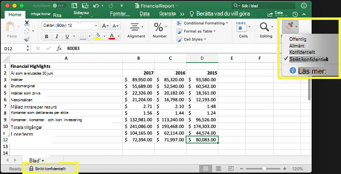
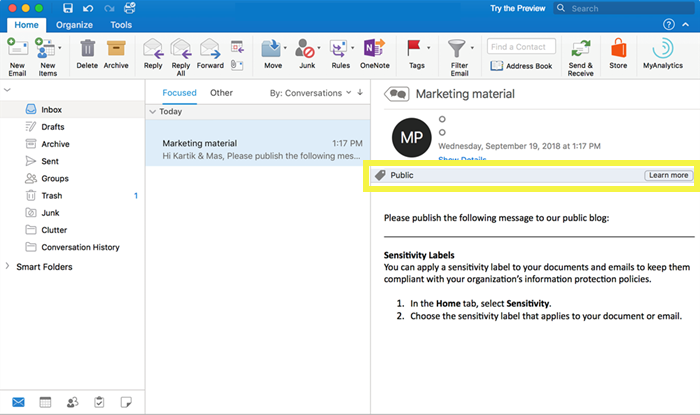
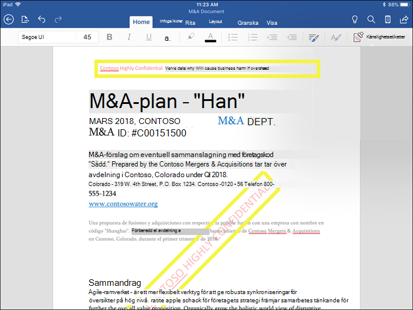
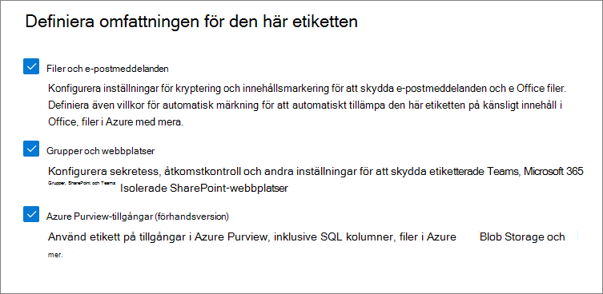
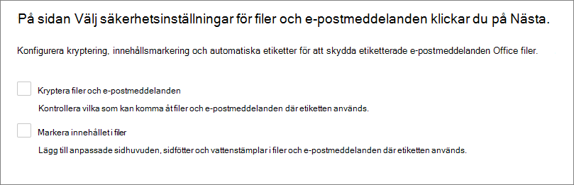
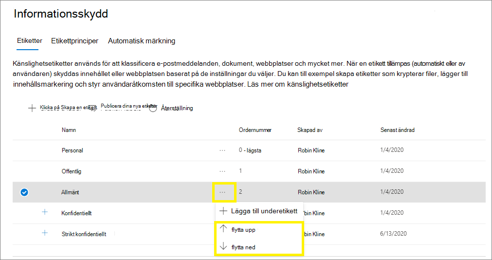
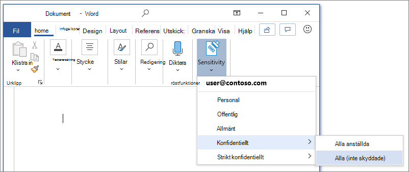
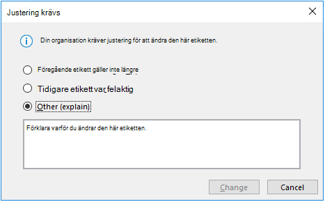
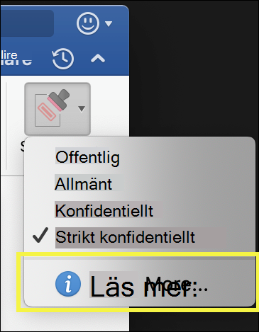
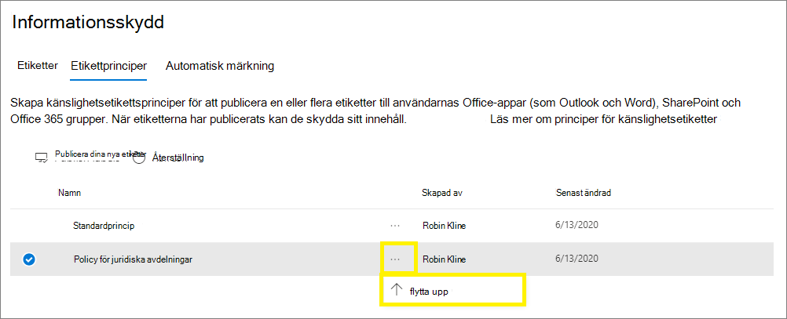

# Lär dig mer om känslighetsetiketter

>*[Licensieringsvägledning för Microsoft 365 för säkerhet och efterlevnad](/office365/servicedescriptions/microsoft-365-service-descriptions/microsoft-365-tenantlevel-services-licensing-guidance/microsoft-365-security-compliance-licensing-guidance).*

> [!NOTE]
> Mer information om känslighetsetiketter som visas i Office-apparna finns i [Använda känslighetsetiketter för filer och e-postmeddelanden i Office](https://support.microsoft.com/topic/apply-sensitivity-labels-to-your-files-and-email-in-office-2f96e7cd-d5a4-403b-8bd7-4cc636bae0f9).
>
> Informationen på den här sidan är avsedd för IT-administratörer som kan skapa och konfigurera etiketterna.

För att få jobbet gjort samarbetar personer i organisationen med andra personer både inom och utanför organisationen. Det här leder till att innehållet inte längre ligger bakom en brandvägg – det kan överföras överallt, på olika enheter och i olika appar och tjänster. När det överförs på det här sättet behöver du se till att det gör det på ett säkert och skyddat sätt som följer organisationens affärs- och efterlevnadsprinciper.

Med känslighetsetiketter från Microsoft Information Protection-lösningen kan du klassificera och skydda organisationens data samtidigt som du ser till att användarnas produktivitet och möjlighet att samarbeta inte förhindras.

Exempel som visar tillgängliga känslighetsetiketter i Excel, från fliken **Start** i menyfliksområdet. I det här exemplet visas den använda etiketten i statusfältet:

För att använda känslighetsetiketter måste användarna vara inloggade med ett arbets- eller skolkonto för Microsoft 365.

> [!NOTE]
> Känslighetsetiketter stöds nu för alla plattformar för klientorganisationer inom amerikanska myndigheter:
> - För GCC- och GCC High-miljöer: Viktig information om [Office för Windows](/officeupdates/current-channel#version-2101-january-26) och [Office för Mac](/officeupdates/release-notes-office-for-mac#feature-updates-2)
> - För DoD-miljöer: Viktig information för [Office för Windows](/officeupdates/current-channel#version-2103-march-30)
>
> Om du använder Azure Information Protection-klienten för enhetlig etikettering och skannern för de här miljöerna hittar du mer information i [Tjänstbeskrivning för Azure Information Protection Premium Government](/enterprise-mobility-security/solutions/ems-aip-premium-govt-service-description).

Du kan använda känslighetsetiketter för att göra följande:
  
- **Ange skyddsinställningar som omfattar kryptering och märkning av innehåll.** Du kan till exempel använda etiketten ”Konfidentiellt” för ett dokument eller e-postmeddelande. Etiketten krypterar innehållet och lägger till vattenstämpeln ”Konfidentiellt”. Märkning av innehåll omfattar sidhuvuden och sidfötter samt vattenstämplar, och kryptering kan också begränsa vilka åtgärder behöriga användare kan utföra med innehållet.

- **Skydda innehåll i Office-appar på olika plattformar och enheter.** Stöds av Word, Excel, PowerPoint och Outlook i Office-datorprogrammen och Office på webben. Stöds på Windows, macOS, iOS och Android.

- **Skydda innehåll i appar och tjänster från tredje part** med Microsoft Cloud App Security. Med Cloud App Security kan du identifiera, klassificera, sätta en etikett på och skydda innehåll i appar och tjänster från tredje part, till exempel SalesForce, Box eller DropBox, även om appen eller tjänsten från tredje part inte läser eller stöder känslighetsetiketter.

- **Skydda behållare** som omfattar Teams, Microsoft 365-grupper och SharePoint-webbplatser. Du kan till exempel ange sekretessinställningar, extern användaråtkomst och extern delning samt åtkomst från ohanterade enheter.

- **Utöka känslighetsetiketterna till Power BI**: När du aktiverar den här funktionen kan du använda och visa etiketter i Power BI, och skydda data när de sparas utanför tjänsten.

- **Utöka känslighetsetiketterna till resurser i Azure Purview**: När du aktiverar den här funktionen, för närvarande tillgänglig som förhandsversion, kan du använda känslighetsetiketter för resurser som SQL-kolumner, filer i Azure Blob Storage med mera. 

- **Utöka känslighetsetiketter till appar och tjänster från tredje part.** Med SDK:t för Microsoft Information Protection kan appar från tredje part läsa känslighetsetiketter och tillämpa skyddsinställningar.

- **Klassificera innehåll utan att använda skyddsinställningar.** Du kan också helt enkelt tilldela en etikett som ett resultat av att innehållet klassificeras. Det här gör att användarna får en visuell mappning av klassificering för organisationens etikettnamn och kan använda etiketterna för att generera användningsrapporter och visa aktivitetsdata för känsligt innehåll. Baserat på den här informationen kan du alltid välja att använda skyddsinställningar senare.

I alla dessa fall kan känslighetsetiketter i Microsoft 365 hjälpa dig att vidta rätt åtgärder för rätt innehåll. Med känslighetsetiketter kan du klassificera data i organisationen och tillämpa skyddsinställningar baserat på den klassificeringen.

Mer information om dessa och andra scenarier som stöds av känslighetsetiketter finns i [Vanliga scenarier för känslighetsetiketter](get-started-with-sensitivity-labels.md#common-scenarios-for-sensitivity-labels). Nya funktioner som stöder känslighetsetiketter utvecklas hela tiden, så det kan också vara bra att läsa [Översikten över Microsoft 365](https://aka.ms/MIPC/Roadmap).

## Det här är en känslighetsetikett

När du tilldelar en känslighetsetikett till innehållet är det som att använda en stämpel som är följande:

- **Anpassningsbar.** Du kan skapa kategorier för olika nivåer av känsligt innehåll i organisationen som är specifika för din organisation och verksamhetens behov. Till exempel Privat, Offentligt, Allmänt, Konfidentiellt och Strikt konfidentiellt.

- **I klartext.** Eftersom en etikett lagras i klartext i metadata för filer och e-postmeddelanden, kan appar och tjänster från tredje part läsa den och tillämpa sina egna skyddsåtgärder, om det behövs.

- **Beständig.** Eftersom etiketten lagras i metadata för filer och e-postmeddelanden överförs etiketten med innehållet, oavsett var det sparas eller lagras. Den unika etikettidentifieringen blir grunden för att använda och tillämpa de principer du konfigurerar.

När användare ser en känslighetsetikett visas den som en tagg för appar som de använder, och den kan enkelt integreras i deras befintliga arbetsflöden.

För varje objekt som har stöd för känslighetsetiketter kan en känslighetsetikett användas. Dokument och e-postmeddelanden kan ha både en använd känslighetsetikett och [kvarhållningsetikett](retention.md#retention-labels).

> [!div class="mx-imgBorder"]
> 

## Det här kan känslighetsetiketter göra

När en känslighetsetikett används för ett e-postmeddelande eller dokument tillämpas alla konfigurerade skyddsinställningar för den etiketten på innehållet. Du kan konfigurera en känslighetsetikett så att följande görs:

- **Kryptera** e-postmeddelanden och dokument för att förhindra obehöriga personer från att komma åt dessa data. Du kan dessutom välja vilka användare eller grupper som ska ha behörighet att utföra specifika åtgärder och hur länge. Du kan till exempel välja att tillåta alla användare i organisationen att ändra ett dokument medan en viss grupp i en annan organisation bara kan visa det. Istället för administratörsdefinierade behörigheter kan du också tillåta att användarna tilldelar behörigheter till innehållet när de använder etiketten. 
    
    Mer information om inställningarna för **kryptering** när du skapar eller redigerar en känslighetsetikett finns i [Begränsa åtkomst till innehåll med hjälp av kryptering i känslighetsetiketter](encryption-sensitivity-labels.md).

- **Märk innehållet** när du använder Office-appar genom att lägga till vattenstämplar, sidhuvuden och sidfötter i e-postmeddelanden eller dokument där etiketten används. Vattenstämplar kan användas i dokument men inte i e-post. Exempel på sidhuvud och vattenstämpel:
    
    
    
    Behöver du kontrollera när märkning av innehåll används? Läs [När Office-program använder innehållsmarkering och kryptering](sensitivity-labels-office-apps.md#when-office-apps-apply-content-marking-and-encryption).
    
    Vissa, men inte alla appar, har stöd för dynamisk märkning med hjälp av variabler. Du kan till exempel infoga etikettens namn eller dokumentets namn i sidhuvudet, sidfoten eller vattenstämpeln. Mer information finns i [Dynamiska markeringar med variabler](sensitivity-labels-office-apps.md#dynamic-markings-with-variables).
    
    Stränglängder: Vattenstämplar är begränsade till 255 tecken. Sidhuvuden och sidfötter är begränsade till 1 024 tecken, förutom i Excel. Excel har en totalgräns på 255 tecken för sidhuvuden och sidfötter, men den här gränsen inkluderar tecken som inte är synliga, till exempel formateringskoder. Om gränsen nås visas inte strängen du anger i Excel.

- **Skydda innehåll i behållare som webbplatser och grupper** när du aktiverar funktionen för att [använda känslighetsetiketter med Microsoft Teams, Microsoft 365-grupper och SharePoint-webbplatser](sensitivity-labels-teams-groups-sites.md).
    
    Du kan inte konfigurera skyddsinställningar för grupper och webbplatser förrän du aktiverar den här funktionen. Den här etikettkonfigurationen leder inte till att dokument eller e-postmeddelanden får etiketter automatiskt, utan etikettinställningarna skyddar istället innehåll genom att kontrollera åtkomsten till den behållare där innehåll kan lagras. De här inställningarna omfattar sekretessinställningar, extern användaråtkomst och extern delning samt åtkomst från ohanterade enheter.

- **Använd etiketten automatiskt för filer och e-postmeddelanden, eller rekommendera en etikett.** Välj hur känslig information som du vill sätta en etikett på ska identifieras. Etiketten kan användas automatiskt eller så kan du uppmana användarna att använda den etikett du rekommenderar. Om du rekommenderar en etikett visas den text du väljer i uppmaningen. Till exempel:
    
    
    
    Mer information om inställningarna för **Automatisk etikettering av filer och e-postmeddelanden** när du skapar eller redigerar en känslighetsetikett finns i [Använda en känslighetsetikett för innehåll automatiskt](apply-sensitivity-label-automatically.md) för Office-appar och [Automatisk etikettering av data i Azure Purview](/azure/purview/create-sensitivity-label).

### Etikettomfattningar

När du skapar en känslighetsetikett uppmanas du att konfigurera etikettens omfattning som avgör två saker:
- Vilka etikettinställningar du kan konfigurera för etiketten
- Var etiketten kommer att visas för användare

Med den här omfattningskonfigurationen kan du använda känslighetsetiketter som bara är avsedda för dokument och e-postmeddelanden och inte kan väljas för behållare. Och på samma sätt kan du använda känslighetsetiketter som bara är avsedda för behållare och inte kan väljas för dokument och e-postmeddelanden. Med en ny funktion som för närvarande är tillgänglig som en förhandsversion kan du även välja omfattningen för Azure Purview-resurser:

Som standard är omfattningen **Filer och e-postmeddelanden** alltid vald. Andra omfattningar väljs som standard när funktionerna har aktiverats för klientorganisationen:

- **Grupper och webbplatser**: [Aktivera känslighetsetiketter för behållare och synkronisera etiketter](sensitivity-labels-teams-groups-sites.md#how-to-enable-sensitivity-labels-for-containers-and-synchronize-labels)

- **Azure Purview-resurser (förhandsversion)**: [Automatisk etikettering av innehåll i Azure Purview](/azure/purview/create-sensitivity-label)

Om du ändrar standardinställningarna så att alla omfattningar inte är valda visas den första sidan för konfigurationsinställningarna för omfattningar som du inte har valt, men du kan inte konfigurera inställningarna. Om till exempel omfattningen för filer och e-postmeddelanden inte har valts kan du inte välja alternativen på nästa sida:

För de här sidorna som har otillgängliga alternativ väljer du **Nästa** när du vill fortsätta. Eller så väljer du **Tillbaka** om du vill ändra etikettens omfattning.

### Etikettprioritet (ordningen är viktig)

När du skapar dina känslighetsetiketter i administrationscentret visas de i en lista på fliken **Känslighet** på sidan **Etiketter**. Etiketternas ordning i den här listan är viktig eftersom den återspeglar deras prioritet. Din mest restriktiva känslighetsetikett, till exempel Strikt konfidentiellt, ska visas **längst ned** i listan, och din minst restriktiva känslighetsetikett, till exempel Offentligt, ska visas **längst upp**.

Du kan bara använda en enda känslighetsetikett för ett objekt, till exempel ett dokument, ett e-postmeddelande eller en behållare. Om du anger ett alternativ som kräver att användarna anger en motivering för att en etikett ska ändras till en lägre klassificering identifierar ordningen i den här listan de lägre klassificeringarna. Det här alternativet gäller ändå inte för underetiketter.

Men ordning för underetiketter används med [automatiska etiketter](apply-sensitivity-label-automatically.md). När du konfigurerar etiketterna så att de används automatiskt eller som en rekommendation kan flera matchningar resultera i fler än en etikett. För att bestämma vilken etikett som ska användas eller rekommenderas används etikettordningen: den sista känsliga etiketten väljs och sedan, om tillämpligt, den sista underetiketten.

### Underetiketter (gruppering av etiketter)

Med underetiketter kan du gruppera en eller flera etiketter under en överordnad etikett som en användare ser i en Office-app. Under Konfidentiellt kan organisationen till exempel använda flera olika etiketter för specifika typer av den klassificeringen. I det här exemplet är den överordnade etiketten Konfidentiellt en textetikett utan skyddsinställningar, och eftersom den innehåller underetiketter kan den inte användas på innehåll. Istället måste användarna välja Konfidentiellt för att visa underetiketterna, och sedan kan de välja en underetikett som ska användas för innehållet.

Underetiketter är bara ett sätt att presentera etiketter för användare i logiska grupper. Underetiketter ärver inga inställningar från sin överordnade etikett. När du publicerar en underetikett för en användare kan den användaren sedan använda underetiketten för innehållet, men kan inte använda bara den överordnade etiketten.

Välj inte en överordnad etikett som standardetikett och konfigurera inte en överordnad etikett så att den används automatiskt (eller rekommenderas). Om du gör det används inte den överordnade etiketten på innehållet.

Exempel på hur underetiketter visas för användare:

### Redigera eller ta bort en känslighetsetikett

Om du tar bort en känslighetsetikett från administrationscentret tas inte etiketten bort från innehållet automatiskt, och eventuella skyddsinställningar fortsätter att tillämpas på innehåll som har använt den etiketten.

Om du redigerar en känslighetsetikett tillämpas den version av etiketten som användes på innehållet på det innehållet.

## Det här kan etikettprinciper göra

När du har skapat känslighetsetiketterna måste du publicera dem för att göra dem tillgängliga för personer och tjänster i organisationen. Känslighetsetiketterna kan sedan användas i Office-dokument och e-postmeddelanden och andra objekt som stöder känslighetsetiketter. 

Till skillnad från kvarhållningsetiketter, som publiceras på platser som alla Exchange-postlådor, publiceras känslighetsetiketter till användare eller grupper. Appar som har stöd för känslighetsetiketter kan sedan visa dem som använda etiketter för de här användarna och grupperna, eller som etiketter som de kan använda.

När du konfigurerar en etikettprincip kan du göra följande:

- **Välj vilka användare och grupper som ska se etiketterna.** Etiketter kan publiceras till en viss användare eller e-postaktiverad säkerhetsgrupp, distributionsgrupp eller Microsoft 365-grupp (som kan ha [dynamiskt medlemskap](/azure/active-directory/users-groups-roles/groups-create-rule)) i Azure AD.

- **Ange en standardetikett** för nya dokument, omärkta e-postmeddelanden och nya behållare (när du har [aktiverat känslighetsetiketter för Microsoft Teams, Microsoft 365-grupper och SharePoint-webbplatser](sensitivity-labels-teams-groups-sites.md)). Du kan ange samma etikett för alla tre objektstyper eller olika etiketter. När du anger en standardetikett för dokument tillämpar Azure Information Protection-klienten för enhetlig etikettering även samma etikett på befintliga dokument som är omärkta. Användare kan alltid ändra standardetiketten om det inte är rätt etikett för dokumentet eller e-postmeddelandet.
    
    Överväg att använda en standardetikett för att ange en grundnivå för skyddsinställningar som du vill använda för allt innehåll. Men utan användarutbildning och andra kontroller kan den här inställningen också leda till felaktiga etiketter. Det är oftast en dålig idé att välja en etikett som tillämpar kryptering som standardetikett för dokument. Många organisationer behöver till exempel skicka och dela dokument med externa användare som kanske inte har program som stöder krypteringen eller som kanske inte använder ett konto som kan auktoriseras. Mer information om det här scenariot finns i [Dela krypterade dokument med externa användare](sensitivity-labels-office-apps.md#sharing-encrypted-documents-with-external-users).

- **Kräv en motivering för att ändra en etikett.** Om en användare försöker ta bort en etikett eller ersätta den med en etikett med ett lägre ordningsnummer kan du kräva att användaren anger en motivering för att utföra den här åtgärden. En användare öppnar till exempel ett dokument med etiketten Konfidentiellt (ordningsnummer 3) och ersätter etiketten med en som heter Offentligt (ordningsnummer 1). Administratörer kan läsa motiveringen tillsammans med etikettändringen i [aktivitetsutforskaren](data-classification-activity-explorer.md).

    

- **Kräv att användare anger en etikett** för dokument och e-postmeddelanden, bara dokument och för behållare. De här alternativen, som även kallas obligatorisk etikettering, gör att en etikett måste användas innan användarna kan spara dokument och skicka e-postmeddelanden och skapa nya grupper eller webbplatser.
    
    För dokument och e-postmeddelanden kan en etikett tilldelas manuellt av användaren, automatiskt som ett resultat av ett villkor som du konfigurerar eller tilldelas som standard (standardalternativet för etiketter som beskrevs tidigare). Ett exempel på en uppmaning som visas i Outlook när en användare måste tilldela en etikett:

    
    
    > [!NOTE]
    > Obligatoriska etiketter för dokument och e-postmeddelanden är inte tillgängligt för alla appar eller alla plattformar. Mer information finns i [Kräva att användare använder en etikett för sin e-post och dokument](sensitivity-labels-office-apps.md#require-users-to-apply-a-label-to-their-email-and-documents).
    
    För behållare måste en etikett tilldelas när gruppen eller webbplatsen skapas.
    
    Överväg att använda det här alternativet för att bidra till ökad användning av etiketter. Men utan användarutbildning kan de här inställningarna resultera i felaktiga etiketter. Om du inte också anger en motsvarande standardetikett kan obligatoriska etiketter dessutom frustrera användarna med de många uppmaningarna.

- **Ange hjälplänk till en anpassad hjälpsida.** Om användarna är osäkra på vad dina känslighetsetiketter betyder eller hur de ska användas kan du ange en webbadress för mer information som visas längst ned på menyn **Känslighetsetikett** i Office-apparna:

    

När du har skapat en etikettprincip som tilldelar nya känslighetsetiketter till användare och grupper börjar användarna se etiketterna i Office-apparna. De kan ta upp till 24 timmar för de senaste ändringarna att replikeras i hela organisationen.

Det finns ingen gräns för hur många känslighetsetiketter du kan skapa och publicera, med ett undantag: om etiketten tillämpar kryptering som anger användare och behörigheter kan du skapa högst 500 etiketter i den här konfigurationen. Men för att minska administrationsarbetet och komplexiteten för användarna rekommenderar vi att du försöker hålla nere antalet etiketter. I verkliga distributioner har effektiviteten minskat betydligt när användare har fler än fem huvudetiketter eller fler än fem underetiketter per huvudetikett.

### Prioritet för etikettprincip (ordningen är viktig)

Du gör känslighetsetiketterna tillgängliga för användarna genom att publicera dem i en princip för känslighetsetiketter som visas i en lista på fliken **Känslighetsprinciper** på sidan **Etikettprinciper**. Precis som känslighetsetiketter (se [Etikettprioritet (ordningen är viktig)](#label-priority-order-matters)) är ordningen för principer för känslighetsetiketter viktig eftersom den återspeglar deras prioritet. Etikettprincipen med lägst prioritet visas **längst upp** och etikettprincipen med högst prioritet visas **längst ned**.

En etikettprincip består av:

- En uppsättning etiketter.
- De användare och grupper som tilldelas principen med etiketter.
- Principens omfattning och principinställningarna för omfattningen (till exempel standardetikett för filer och e-postmeddelanden).

Du kan lägga till en användare i flera etikettprinciper, och användaren kommer att få alla känslighetsetiketter och inställningar från dessa principer. Om inställningarna från flera principer leder till en konflikt används inställningen från principen med högst prioritet (lägst position). Med andra ord vinner den högsta prioriteten för varje inställning.

Om du inte får det inställningsbeteende för etiketterna eller etikettprinciperna som du förväntar dig för en användare eller grupp kontrollerar du ordningen för principerna för känslighetsetiketter. Du kan behöva flytta ned principen. Om du vill ändra ordning på etikettprinciperna väljer du en princip för känslighetsetiketter > väljer ellipsen till höger > **Flytta nedåt** eller **Flytta uppåt**.

> [!NOTE]
> Kom ihåg: Om inställningarna för en användare som har flera principer tilldelade till sig leder till en konflikt används inställningen från principen med högst prioritet (lägst position).

## Känslighetsetiketter och Azure Information Protection

När du använder känslighetsetiketter i Microsoft 365-appar på Windows-datorer kan du välja att använda etiketteringen som är inbyggd i Office-apparna eller Azure Information Protection-klienten.

Som standard är inbyggd etikettering inaktiverad i de här apparna när Azure Information Protection-klienten har installerats. Mer information, bland annat hur du ändrar det här standardbeteendet, finns i [Office inbyggda etiketteringsklient och Azure Information Protection-klienten](sensitivity-labels-office-apps.md#office-built-in-labeling-client-and-the-azure-information-protection-client).

Även om du använder inbyggd etikettering i Office-appar kan du också använda Azure Information Protection-klienten för enhetlig etikettering med känslighetsetiketter för följande:

- En skanner för att identifiera känslig information som lagras lokalt och sedan, om du vill, sätta en etikett på innehållet

- Alternativ med högerklick i Utforskaren så att användare kan använda etiketter för alla filtyper

- Ett visningsprogram för att visa krypterade filer för text, bilder eller PDF-dokument

- En PowerShell-modul för att identifiera känslig information i lokala filer och använda eller ta bort etiketter och kryptering från dessa filer.

Om du är en ny Azure Information Protection-användare, eller om du är en befintlig Azure Information Protection-kund som nyligen har migrerat dina etiketter, kan du läsa [Välj din Windows-etikettlösning](/azure/information-protection/rms-client/use-client#choose-your-windows-labeling-solution) i dokumentationen för Azure Information Protection.

### Azure Information Protection-etiketter

> [!NOTE]
> Etiketthantering för Azure Information Protection-etiketter i Azure-portalen har blivit inaktuellt **31 mars 2021**. Läs mer i det officiella [utfasningsmeddelandet](https://techcommunity.microsoft.com/t5/azure-information-protection/announcing-timelines-for-sunsetting-label-management-in-the/ba-p/1226179).

Om klientorganisationen inte finns på [plattformen för enhetlig etikettering](/azure/information-protection/faqs#how-can-i-determine-if-my-tenant-is-on-the-unified-labeling-platform) än måste du först aktivera enhetlig etikettering innan du kan använda känslighetsetiketter. Instruktioner finns i artikeln om [hur du migrerar Azure Information Protection-etiketter till enhetliga känslighetsetiketter](/azure/information-protection/configure-policy-migrate-labels). 

## Känslighetsetiketter och SDK:t för Microsoft Information Protection

Eftersom en känslighetsetikett lagras i ett dokuments metadata kan appar och tjänster från tredje part läsa från och skriva till dessa etikettmetadata som ett tillägg till din etikettdistribution. Programvaruutvecklare kan dessutom använda[SDK:t för Microsoft Information Protection](/information-protection/develop/overview#microsoft-information-protection-sdk) till att helt stöda etikett- och krypteringsfunktioner på flera olika plattformar. Mer information finns i [meddelandet om allmän tillgänglighet på Tech Community-bloggen](https://techcommunity.microsoft.com/t5/Microsoft-Information-Protection/Microsoft-Information-Protection-SDK-Now-Generally-Available/ba-p/263144). 

Du kan också ta reda på mer om [partnerlösningar som är integrerade med Microsoft Information Protection](https://techcommunity.microsoft.com/t5/Azure-Information-Protection/Microsoft-Information-Protection-showcases-integrated-partner/ba-p/262657).

## Distributionsvägledning

Mer information om planering och vägledning för distributionen med licensieringsinformation, behörigheter, distributionsstrategi, en lista över scenarier som stöds och slutanvändardokumentation finns i [Kom igång med känslighetsetiketter](get-started-with-sensitivity-labels.md).

Information om hur du använder känslighetsetiketter för att följa datasekretessföreskrifter finns i [Distribuera informationsskydd för datasekretessföreskrifter med Microsoft 365](../solutions/information-protection-deploy.md)  (aka.ms/m365dataprivacy).