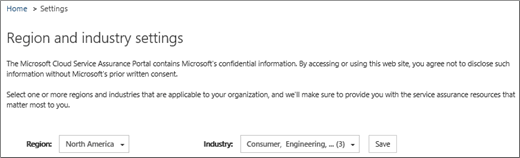
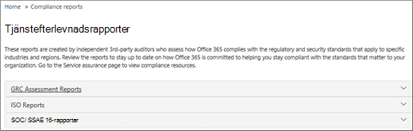
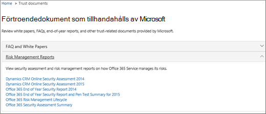

# Tjänstgranskning i Säkerhets- och efterlevnadscenterService assurance in the Security & Compliance Center

Använd Tjänstgranskning i Säkerhets- & säkerhets- och efterlevnadscenter för att komma åt dokument som beskriver en mängd olika ämnen, till exempel:Use Service assurance in the Security & Compliance Center to access documents that describe a variety of topics, including: 
  
- Microsofts säkerhetsrutiner för kunddata som lagras i Office 365.Microsoft security practices for customer data that is stored in Office 365. 
    
- Oberoende granskningsrapporter från tredje Office 365.Independent third-party audit reports of Office 365. 
    
- Implementerings- och testdetaljer för säkerhets-, sekretess- och efterlevnadskontroller som Office 365 använder för att skydda dina data.Implementation and testing details for security, privacy, and compliance controls that Office 365 uses to protect your data. 
    
Du kan också ta reda på Office 365 kan hjälpa kunder att följa standarder, lagar och bestämmelser i branscher, till exempel:You can also find out how Office 365 can help customers comply with standards, laws, and regulations across industries, such as the:
  
-  Internationella standardiseringsorganisationen (ISO) 27001 och 27018International Organization for Standardization (ISO) 27001 and 27018 
    
- Health Insurance Portability and Accountability Act från 1996 (HIPAA)Health Insurance Portability and Accountability Act of 1996 (HIPAA)
    
- Federal Risk and Authorization Management Program (FedRAMP)Federal Risk and Authorization Management Program (FedRAMP)
    
## Vem åtkomst Office 365 Tjänstgranskning, och hur?Who can access Office 365 Service assurance, and how?

 Nya kunder och kunder som utvärderar **Microsofts onlinetjänster** kan använda Tjänstgranskning. Tjänstgranskning ingår i abonnemangen Office 365 Enterprise E3 och E5 (både utvärderingsversion och betalda prenumerationer).**New customers, and customers evaluating Microsoft online services** can access Service assurance which is included with Office 365 Enterprise E3 and E5 plans (both trial and paid subscriptions). Om du inte har något av dessa abonnemang och vill prova Tjänstgranskning kan du registrera dig för en utvärderingsversion av [Office 365 Enterprise E5.](https://go.microsoft.com/fwlink/p/?LinkID=698279)If you don't have one of these plans and want to try Service assurance, you can [sign-up for a trial of Office 365 Enterprise E5](https://go.microsoft.com/fwlink/p/?LinkID=698279).
  
 **Medlemmar i en O365-prenumeration** har åtkomst till avsnittet Tjänstgranskning Office 365 Säkerhetscenter som standard.**O365 Subscription Members** can access the Service assurance section in the Office 365 Protection Center by default. Tjänstgranskning tillhandahåller rapporter och dokument som beskriver Microsofts säkerhetsrutiner för kunddata som lagras i Office 365.Service assurance provides reports and documents that describe Microsoft's security practices for customer data that's stored in Office 365. Den tillhandahåller även granskningsrapporter från oberoende tredje part om Office 365.It also provides independent third-party audit reports on Office 365.
 
## Välj bransch och nationella inställningarChoose your industry and regional settings

När du går till Tjänstgranskning första gången är det första du gör att konfigurera inställningar för branschen och nationella inställningar.When you access Service assurance for the first time, the first step is to configure your industry and regional settings. Du kan ändra de här inställningarna när som helst.You can change these settings at any time. Genom att konfigurera de här inställningarna kan Tjänstgranskning förse dig med innehåll som är mest relevant för din organisation.Configuring these settings enables Service assurance to provide you with content that is most relevant to your organization. Så här konfigurerar du inställningar för branschen och region:To configure your industry and region settings:
  
1. När du har öppnar Tjänstgranskning väljer **Inställningar** inställningar så visas sidan med region- och branschinställningar enligt följande skärmbild.After you access Service assurance, select **Settings** and the Region and industry settings page displays as shown in the following screenshot. 
    
    
  
2. På **Inställningar** väljer du nedåtpilen bredvid **Region och** markerar lämpliga områden för din organisation.On the **Settings** page, select the down arrow next to **Region** and check the appropriate regions for your organization. 
    
3. Välj nedåtpilen bredvid **Bransch och** markera de branscher som gäller för din organisation.Select the down arrow next to **Industry** and check the appropriate industries for your organization. 
    
4. När du har valt områden och branscher väljer du **Spara**.Once you have selected regions and industries, select **Save**.
    
## Hitta, granska och ladda ned innehåll om efterlevnad och förtroendeFind, review, and download compliance and trust content

Välj ett alternativ i navigeringsfönstret om du vill granska och ladda ned innehåll:To review and download content, select an option from the navigation pane:
  
- **Efterlevnadsrapporter** för att visa oberoende granskningar och utvärderingar av Office 365 och andra Microsoft-molntjänster, enligt följande skärmbild.**Compliance reports** to view independent audits and assessments of Office 365 and other Microsoft cloud services as shown in the following screen shot. 
    
    
  
- **Förtroendedokument** för att visa information om hur Microsoft sköter Office 365 se följande skärmbild.**Trust documents** to view information about how Microsoft operates Office 365 as shown in the following screen shot. 
    
    
  
- **Granskade kontroller för** att visa information om hur Office 365 uppfyller säkerhets-, efterlevnads- och sekretesskrav, enligt följande skärmbild.**Audited controls** to view information about how Office 365 controls meet security, compliance, and privacy requirements, as shown in the following screen shot. 
    
    
  
Välj den rapport som du vill ladda ned och välj **Spara för** att ladda ned den till datorn.Select the report you want to download, and select **Save** to download it to your computer. För granskade kontroller väljer du den rapport du vill ha och väljer sedan **Ladda ned**.For Audited controls, select the report you want and then select **Download**. I tabellen nedan beskrivs de rapporter som du hittar på sidorna i Tjänstgranskning.The table below describes the reports you can find on each Service assurance page. 
  
> [!NOTE]
> Tjänstgranskningsrapporter och -dokument finns att ladda ned åtminstone tolv månader efter publicering eller tills en ny version av dokumentet blir tillgänglig.Service assurance reports and documents are available to download for at least twelve months after publishing or until a new version of the document becomes available. 
  
|**Tjänstgranskningssida****Service assurance page**|**Tillgängligt innehåll****Content available**|**Beskrivning****Description**|
|:-----|:-----|:-----|
|EfterlevnadsrapporterCompliance reports    | FedRampFedRamp     GRC-bedömningGRC Assessment     ISOISO     SOC/SSAESOC/SSAE    |Använd tjänstefterlevnadsrapporter för att granska bedömningar som gjorts av oberoende tredjepartsg granskare Office 365 tjänstleveransåtgärder.Use service compliance reports to review audit assessments performed by third-party independent auditors of Office 365 Service Delivery Operations.    |
|FörtroendedokumentTrust documents    | Vanliga frågor och vitböckerFAQ and White Papers     RiskhanteringsrapporterRisk Management Reports    |Använd vitböcker, vanliga frågor och svar, årsslutsrapporter och andra Microsoft-konfidentiella resurser som finns tillgängliga under sekretessavtal för din granskning/riskbedömning.Use white papers, FAQs, end-of-year reports and other Microsoft Confidential resources that are made available to you under non-disclosure agreement for your review / risk assessments.    |
|Granskade kontrollerAudited controls    |Globala standarder och föreskrifter som Office 365 har implementerat.Global standards and regulations that Office 365 has implemented.    | Hjälp med riskbedömning när du utvärderar, börjar eller använder Office 365 tjänster.Help with risk-assessment when you're evaluating, onboarding, or using Office 365 services. Komma på:Find out:     - hur Office 365 uppfyller säkerhets-, efterlevnads- och sekretesskrav.- How Office 365 controls meet security, compliance, and privacy requirements.   - Om testning av kontroller i Office 365, resultaten av dessa tester och när de slutförts.-  About testing of controls in Office 365, results of these tests, and when they were completed.    |
   
Beroende på din specifika konfigurerad kan de alternativ som ingår i vyn ha vissa skillnader.Depending on your specific set-up, options included in your view might have some differences.
    
## Få hjälp med TjänstgranskningGet help with Service assurance

[Kontakta supporten för företagsprodukter – hjälp för administratörer](../business-video/get-help-support.md).[Contact support for business products - Admin Help](../business-video/get-help-support.md).
  
## Vanliga frågorFrequently Asked Questions

 **Varför visas ett felmeddelande om att dokument från Tjänstgranskning är skadade?****Why am I getting an error saying that documents from Service assurance are corrupted?**
  
De flesta dokument i Tjänstgranskning är i PDF-format.Most Service assurance documents are in PDF format. Välj **Spara** för att spara dessa filer i, och sedan öppna dem från, din lokala dator.Choose **Save** to save these files to, and then open them up from, your local computer.