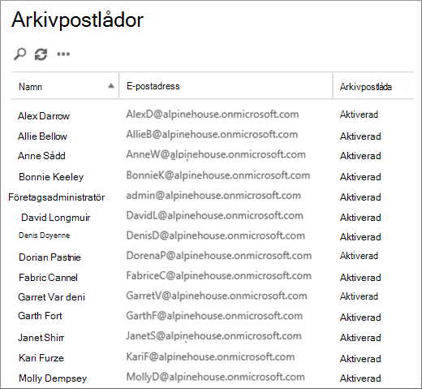
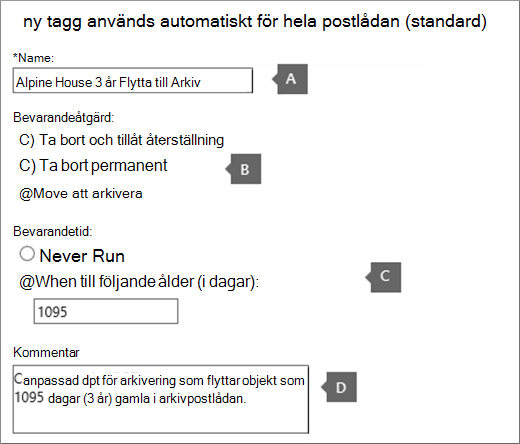
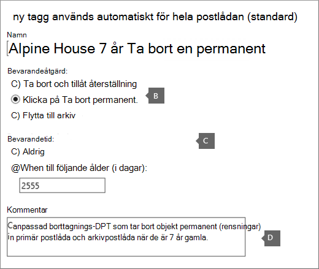
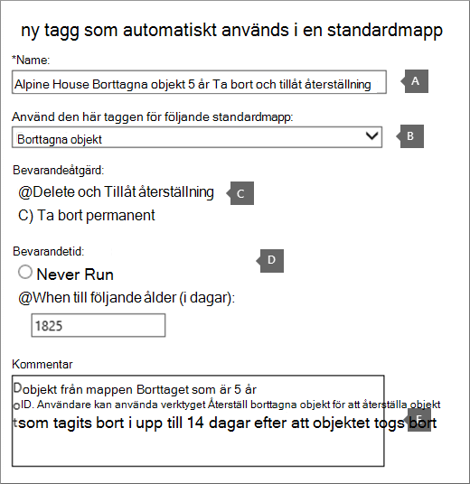
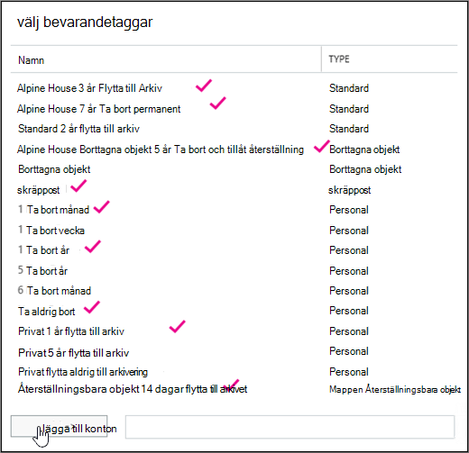
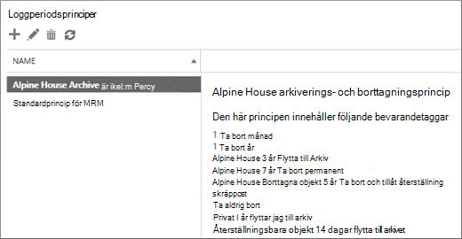

# <a name="set-up-an-archive-and-deletion-policy-for-mailboxes-in-your-organization"></a>Konfigurera en princip för arkivering och borttagning för postlådor i din organisation

I Microsoft 365 kan administratörer skapa en princip för arkivering och borttagning som automatiskt flyttar objekt till en användares arkivpostlåda och automatiskt tar bort objekt från postlådan. Administratören gör detta genom att skapa en bevarandeprincip som tilldelas till postlådor och flytta objekt till en användares arkivpostlåda efter en viss tidsperiod och som även tar bort objekt från postlådan när de har nått en viss åldersgräns. De faktiska reglerna som avgör vilka objekt som flyttas eller tas bort och när det händer kallas bevarandetaggar. Bevarandetaggar är kopplade till en bevarandeprincip som i sin tur tilldelas till en användares postlåda. En bevarandetagg tillämpar bevarandeinställningar på enskilda meddelanden och mappar i en användares postlåda. Den definierar hur länge ett meddelande finns kvar i postlådan och vilken åtgärd som vidtas när meddelandet uppnår angiven bevarandetid. När ett meddelande uppnår sin bevarandetid flyttas det antingen till användarens arkivpostlåda eller så tas det bort.
  
Med stegen i den här artikeln kan du konfigurera en princip arkivering och kvarhållning för det fiktiva företaget Alpine House. Du kan konfigurera den här principen på följande sätt:
  
- Aktivera en arkivpostlåda för varje användare i organisationen. Det ger användarna ytterligare lagringsutrymme för e-post och är nödvändigt för att bevarandeprincipen ska kunna flytta objekt till arkivpostlådan. Dessutom kan användare spara arkiveringsinformation genom att flytta objekt till arkivpostlådan.

- Skapa tre anpassade bevarandetaggar som gör följande:

  - Automatiskt flytta objekt som är äldre än 3 år till användarens arkivpostlåda. När objekt flyttas till arkivpostlådan frigörs utrymme i användarens primära postlåda.

  - Automatiskt ta bort objekt som är äldre än 5 år från mappen Borttaget. Det här frigör också utrymme i användarens primära postlåda. Användaren har möjlighet att återställa de här objekten om det behövs. Mer information finns i [fotnoten i](#more-information) avsnittet Mer information. 

  - Automatiskt (och permanent) ta bort objekt som är äldre än 7 år från både den primära postlådan och arkivpostlådan. På grund av regelefterlevnad måste en del organisationer bevara e-post under en viss tidsperiod. Efter den här perioden kanske organisationen vill ta bort de här objekten permanent från användarnas postlådor.

- Skapa en ny bevarandeprincip och lägg till de nya anpassade bevarandetaggarna i den. Dessutom kommer du att lägga till inbyggda bevarandetaggar i den nya bevarandeprincipen. Det här omfattar personliga taggar som användare kan tilldela till objekt i postlådan. Du kommer också att lägga till en bevarandetagg som flyttar objekt från mappen Återställningsbara objekt i användarens primära postlåda till mappen Återställningsbara objekt i arkivpostlådan. Det här hjälper till att frigöra utrymme i mappen Återställningsbara objekt när användarens postlåda sätts på en parkering.

Du kan följa vissa eller alla stegen i den här artikeln om du vill konfigurera en princip för arkivering och borttagning för postlådor i din egen organisation. Vi rekommenderar att du testar processen på några postlådor innan du implementerar den för alla postlådor i organisationen.
  
## <a name="before-you-set-up-an-archive-and-deletion-policy"></a>Innan du konfigurera en princip för arkivering och borttagning

- Du måste vara global administratör i organisationen för att utföra stegen i det här avsnittet. 

- När du skapar ett nytt användarkonto och tilldelar användaren Exchange Online licens skapas en postlåda automatiskt för användaren. När postlådan skapas tilldelas den automatiskt en standardbevarandeprincip med namnet Standardprincip för MRM. I den här artikeln skapar du en ny bevarandeprincip och tilldelar den sedan till användarnas postlådor, där du ersätter standardprincipen för MRM. En postlåda kan bara ha en tilldelad bevarandeprincip åt gången.

- Mer information om bevarandetaggar och bevarandeprinciper i Exchange Online finns i [Bevarandetaggar och bevarandeprinciper.](/exchange/security-and-compliance/messaging-records-management/retention-tags-and-policies)

## <a name="step-1-enable-archive-mailboxes-for-users"></a>Steg 1: Aktivera arkivpostlådor för användare

Det första steget är att aktivera arkivpostlådan för varje användare i organisationen. En användares arkivpostlåda måste aktiveras så att en bevarandetagg med bevarandeåtgärden Flytta till arkiv kan flytta objektet när det har blivit förfallen.
  
> [!NOTE]
> Du kan aktivera arkivpostlådor när som helst under den här processen, så länge de är aktiverade någon gång innan du slutför processen. Om en arkivpostlåda inte är aktiverad så vidtas inga åtgärder på objekt som tilldelats en princip för arkivering eller borttagning.
  
1. Gå till [https://protection.office.com](https://protection.office.com).

2. Logga in med ditt globala administratörskonto.
    
3. Gå till Arkiv för & informationsstyrning i Säkerhets- **och efterlevnadscenter.** \> 

    En lista med postlådor i din organisation visas och om motsvarande arkivpostlåda är aktiverad eller inaktiverad.

4. Markera alla postlådor genom att klicka på den första  postlådan i listan, hålla ned Skift och sedan klicka på den sista postlådan i listan.

    > [!TIP]
    > I det här steget förutsätts att inga arkivpostlådor är aktiverade. Om det finns postlådor där arkivet  är aktiverat håller du ned Ctrl-tangenten och klickar på varje postlåda som har en inaktiverad arkivpostlåda. Du kan också klicka **på** kolumnrubriken Arkivpostlåda och sortera raderna baserat på om arkivpostlådan är aktiverad eller inaktiverad för att göra det enklare att välja postlådor.
  
5. Klicka på Aktivera under **Massredigering i** **informationsfönstret.**

    En varning visas om att objekt som är äldre än två år kommer att flyttas till den nya arkivpostlådan. Det beror på att standardprincipen för bevarande som tilldelas till nya användares postlådor när de skapas har en standardprinciptagg för arkivering med en bevarandetid på 2 år. Den anpassade standardprinciptagg för arkivering som du skapar i steg 2 bevarande i 3 år. Det innebär att objekt som är äldre än 3 år flyttas till arkivpostlådan.

6. Klicka **på** Ja för att stänga varningsmeddelandet och starta processen för att aktivera arkivpostlådan för varje markerad postlåda.

7. När processen är klar klickar du **på Uppdatera** för att uppdatera listan  **sidan** Arkivera.

    Arkivpostlådan aktiveras för alla användare i organisationen.

    

## <a name="step-2-create-new-retention-tags-for-the-archive-and-deletion-policies"></a>Steg 2: Skapa nya bevarandetaggar för principer för arkivering och borttagning

I det här steget ska du skapa de tre anpassade bevarandetaggar som beskrevs tidigare.
  
- Alpine House 3 år Flytta till Arkiv (anpassad arkiveringsprincip)

- Alpine House 7 år Ta bort permanent (anpassad borttagningsprincip)

- Alpine House Borttaget 5 år Ta bort och tillåt återställning (anpassad tagg för mappen Borttaget)

Om du vill skapa nya bevarandetaggar använder Exchange (EAC) i organisationen Exchange Online bevarande. Se till att använda den klassiska versionen av EAC.
  
1. Gå till [https://admin.protection.outlook.com/ecp/](https://admin.protection.outlook.com/ecp/) och logga in med dina autentiseringsuppgifter.
  
2. Gå till Bevarandetaggar för efterlevnadshantering **i** EAC  >  

    En lista med organisationens bevarandetaggar visas.

### <a name="create-a-custom-archive-default-policy-tag"></a>Skapa en anpassad standardprinciptagg för arkivering
  
Först skapar du en anpassad standardprinciptagg för arkivering som flyttar objekt till arkivpostlådan efter 3 år.
  
1. Klicka på **Ny tagg** ny ikon på **sidan Bevarandetaggar** och välj sedan används automatiskt för hela  **postlådan (standard).**

2. Fyll i **följande fält på sidan Ny tagg som** automatiskt används för hela postlådan (standard): 

    
  
   1. **Namn** Ange ett namn för den nya bevarandetaggen. 

   2. **Bevarandeåtgärd** Välj **Flytta till arkiv så** flyttas objekten till arkivpostlådan när de blir kvar.

   3. **Bevarandetid** Välj **När objektet uppnår följande ålder (i dagar)** och ange hur lång bevarandetiden ska vara. I det här scenariot flyttas objekt till arkivpostlådan efter 1 095 dagar (3 år).

   4. **Kommentar** (valfritt) Skriv en kommentar som förklarar syftet med den anpassade bevarandetaggen.

3. Klicka **på Spara** så att den anpassade dpt-länken för arkivering skapas.

    Den nya bevarandeprinciptaggen för arkivering visas i listan med bevarandetaggar.

### <a name="create-a-custom-deletion-default-policy-tag"></a>Skapa en anpassad standardprinciptagg för borttagning
  
Nästa steg är att skapa ytterligare en anpassad princip för borttagning, men det här kommer att vara en borttagningsprincip som tar bort objekt permanent efter sju år.
  
1. Klicka på **Ny tagg** ny ikon på **sidan Bevarandetaggar** och välj sedan används automatiskt för hela  **postlådan (standard).**

2. Fyll i **följande fält på sidan Ny tagg som** automatiskt används för hela postlådan (standard): 

    
  
   1. **Namn** Ange ett namn för den nya bevarandetaggen. 

   2. **Bevarandeåtgärd** Välj **Ta bort permanent** för att tömma objekt från postlådan när de blir kvar.

   3. **Bevarandetid** Välj **När objektet uppnår följande ålder (i dagar)** och ange hur lång bevarandetiden ska vara. I det här scenariot kommer objekt att rensas efter 2 555 dagar (7 år).

   4. **Kommentar** (valfritt) Skriv en kommentar som förklarar syftet med den anpassade bevarandetaggen. 

3. Klicka **på Spara** för att skapa den anpassade kompa en kod för borttagning. 

    Den nya bevarandeprinciptaggen för borttagning visas i listan med bevarandetaggar.

### <a name="create-a-custom-retention-policy-tag-for-the-deleted-items-folder"></a>Skapa en anpassad bevarandeprinciptagg för mappen Borttaget
  
Den sista bevarandetagg du kommer att skapa är en anpassad bevarandeprinciptagg för mappen Borttaget. Den här taggen tar bort objekt i mappen Borttaget efter 5 år och ger en återställningsperiod då användare kan använda verktyget Återställ borttagna objekt för att återställa ett objekt.
  
1. På sidan **Bevarandetaggar** klickar du **på Ny tagg** ny ikon och väljer sedan används automatiskt för en  **standardmapp**.

2. Fyll **i följande fält på sidan Ny tagg som automatiskt** används i en standardmapp:

    
  
   1. **Namn** Ange ett namn för den nya bevarandetaggen. 

   2. **Använd den här taggen för följande standardmapp** Välj Borttagna objekt **i listrutan.**

   3. **Bevarandeåtgärd** Välj  Ta bort och tillåt återställning om du vill ta bort objekt när de blir kvar, men tillåta användare att återskapa ett borttagna objekt under en apostreringsperiod (standardvärdet är 14 dagar).

   4. **Bevarandetid** Välj **När objektet uppnår följande ålder (i dagar)** och ange hur lång bevarandetiden ska vara. I det här scenariot tas objekt bort efter 1 825 dagar (5 år).

   5. **Kommentar** (valfritt) Skriv en kommentar som förklarar syftet med den anpassade bevarandetaggen. 

3. Klicka **på** Spara för att skapa den anpassade datakatalogen för mappen Borttaget.

    Den nya bevarandeprinciptaggen visas i listan med bevarandetaggar.

## <a name="step-3-create-a-new-retention-policy"></a>Steg 3: Skapa en ny bevarandeprincip

När du har skapat de anpassade bevarandetaggarna är nästa steg att skapa en ny bevarandeprincip och lägga till bevarandetaggarna. Du kommer att lägga till de tre anpassade bevarandetaggar du skapade i steg 2 och de inbyggda taggar som nämndes i det första avsnittet. I steg 4 tilldelar du den här nya bevarandeprincipen till användarnas postlådor.
  
1. I EAC går du till **Bevarandeprinciper för**  >  **efterlevnadshantering.**

2. Klicka på **Ny ny** ikon på **sidan** 

3. Ange ett **namn** på den nya bevarandeprincipen i rutan Namn. Till exempel **Alpine House arkiverings- och borttagningsprincip.**

4. Klicka **på Lägg till ny** ikon under **Bevarandetaggar.** 

    En lista med organisationens bevarandetaggar visas. Observera att de anpassade taggar du skapade i steg 2 visas.

5. Lägg till de 9 bevarandetaggar som är markerade i följande skärmbild (dessa taggar beskrivs mer ingående i [avsnittet Mer information).](#more-information) Om du vill lägga till en bevarandetagg markerar du den och klickar på Lägg **till**.

    
  
    > [!TIP]
    > Du kan markera flera bevarandetaggar genom att hålla ned **Ctrl-tangenten** och sedan klicka på varje tagg. 
  
6. När du har lagt till bevarandetaggarna klickar du på **OK.**

7. Klicka på **Spara på sidan Ny** bevarandeprincip **så** att den nya principen skapas.

    Den nya bevarandeprincipen visas i listan. Markera den för att visa de bevarandetaggar som är kopplade till den i informationsfönstret.

    
  
## <a name="step-4-assign-the-new-retention-policy-to-user-mailboxes"></a>Steg 4: Tilldela den nya bevarandeprincipen till användarnas postlådor

När en ny postlåda skapas tilldelas som standard en bevarandeprincip med namnet Standardprincip för MRM. I det här steget kommer du att ersätta den här bevarandeprincipen (eftersom en postlåda bara kan ha en tilldelad bevarandeprincip) genom att tilldela den nya bevarandeprincip du skapade i steg 3 till användarnas postlådor. I det här steget förutsätts att du ska tilldela den nya principen till alla postlådor i organisationen.
  
1. Gå till Mottagare av postlådor **i**  >  EAC.

    En lista över alla användarpostlådor i organisationen visas.

2. Markera alla postlådor genom att klicka på den första  postlådan i listan, hålla ned Skift och sedan klicka på den sista postlådan i listan. 

3. Klicka på Fler alternativ under Massredigering i informationsfönstret **till** **höger** i EAC.

4. Klicka **på Uppdatera under** **Bevarandeprincip.**

5. Välj den **bevarandeprincip du** skapade  i steg 3 i listrutan Välj den bevarandeprincip som du skapade i steg 3 på sidan Mass tilldela bevarandeprincip. Till exempel **Alpine House arkiverings- och bevarandeprincip.**

6. Spara **den nya** bevarandeprinciptilldelningen genom att klicka på Spara.

7. Så här kontrollerar du att den nya bevarandeprincipen har tilldelats postlådor:

   1. Välj en postlåda på **sidan Postlådor** och klicka sedan på **Redigera**  redigera.

   2. Klicka på Postlådefunktioner på sidan med **postlådeegenskaper för den valda användaren.**

   Namnet på den nya princip som tilldelats postlådan visas i **listrutan** Bevarandeprincip.

## <a name="optional-step-5-run-the-managed-folder-assistant-to-apply-the-new-settings"></a>(Valfritt) Steg 5: Kör assistenten för hanterade mappar för att tillämpa de nya inställningarna

När du tillämpar den nya bevarandeprincipen på postlådorna i steg 4 kan det ta upp till 7 dagar i Exchange Online innan de nya bevarandeinställningarna tillämpas på postlådorna. Det beror på att assistenten för *hanterade mappar* bearbetar postlådor minst en gång var 7:e dag. I stället för att vänta på att assistenten för hanterade mappar körs kan du tvinga det att ske genom att köra cmdleten **Start-ManagedFolderAssistant** i Exchange Online PowerShell.

 **Vad händer när du kör assistenten för hanterade mappar?** Bevarandeprincipen börjar gälla och objekt i postlådan inspekteras för att se om de ska behållas. Objekten stämplas med motsvarande bevarandetagg och angivna bevarandeåtgärder vidtas sedan på objekt som är äldre än deras bevarandetid.
  
Här är stegen för att ansluta Exchange Online PowerShell och sedan köra assistenten för hanterade mappar för varje postlåda i organisationen.

1. [Ansluta till Exchange Online PowerShell](/powershell/exchange/connect-to-exchange-online-powershell).
  
2. Kör följande två kommandon för att starta assistenten för hanterade mappar för alla användarpostlådor i organisationen.

    ```powershell
    $Mailboxes = Get-Mailbox -ResultSize Unlimited -Filter {RecipientTypeDetails -eq "UserMailbox"}
    ```

    ```powershell
    $Mailboxes.Identity | Start-ManagedFolderAssistant
    ```

Nu är det allt! Du har nu skapat en princip för arkivering och borttagning för organisationen Alpine House.

> [!NOTE]
> Som tidigare nämnts bearbetar Assistenten för hanterade mappar postlådor minst en gång var 7:e dag. Det är därför möjligt att en postlåda kan bearbetas av assistenten för hanterade mappar oftare. Dessutom kan administratörer inte förutse nästa gång en postlåda bearbetas av assistenten för hanterade mappar, vilket är en orsak till att du kanske vill köra den manuellt. Men om du tillfälligt vill förhindra assistenten för hanterade mappar från att tillämpa de nya bevarandeinställningarna på en postlåda kan du köra kommandot för att tillfälligt inaktivera assistenten för hanterade mappar från att bearbeta en `Set-Mailbox -ElcProcessingDisabled $true` postlåda. Om du vill återaktivera assistenten för hanterade mappar för en postlåda kör du `Set-Mailbox -ElcProcessingDisabled $false` kommandot. Slutligen kommer vi inte att bearbeta åtgärden flytta objekt till arkivering för den postlådan om en postlådeanvändare har ett inaktiverat konto.
  
## <a name="optional-step-6-make-the-new-retention-policy-the-default-for-your-organization"></a>(Valfritt) Steg 6: Gör den nya bevarandeprincipen till standardinställning för organisationen

I steg 4 måste du tilldela den nya bevarandeprincipen till befintliga postlådor. Men du kan Exchange Online så att den nya bevarandeprincipen tilldelas till nya postlådor som skapas i framtiden. Det gör du genom att Exchange Online PowerShell och uppdatera organisationens standardpostlådeplan. En *postlådeplan* är en mall som automatiskt konfigurerar egenskaper för nya postlådor.  I det här valfria steget kan du ersätta den nuvarande bevarandeprincip som tilldelats till postlådeplanen (standardprincipen för MRM) med den bevarandeprincip du skapade i steg 3. När du har uppdaterat postlådeplanen tilldelas den nya bevarandeprincipen till nya postlådor.

1. [Ansluta till Exchange Online PowerShell](/powershell/exchange/connect-to-exchange-online-powershell).

2. Kör följande kommando för att visa information om postlådeplaner i din organisation.

    ```powershell
    Get-MailboxPlan | Format-Table DisplayName,RetentionPolicy,IsDefault
    ```

    Observera det postlådeabonnemang som angetts som standard.

3. Kör följande kommando för att tilldela den nya bevarandeprincip som du skapade i steg 3 (till exempel **Alpine House** arkiverings- och bevarandeprincip) till standardpostlådeplanen. Det här exemplet förutsätter att namnet på standardpostlådeplanen är **ExchangeOnlineEnterprise.**

    ```powershell
    Set-MailboxPlan "ExchangeOnlineEnterprise" -RetentionPolicy "Alpine House Archive and Retention Policy"
    ```

4. Du kan köra kommandot igen i steg 2 för att verifiera att bevarandeprincipen som tilldelats standardpostlådeplanen har ändrats.

## <a name="more-information"></a>Mer information

- Hur beräknas bevarandeåldern? Bevarandeåldern för postlådeobjekt beräknas från leveransdatumet eller datumet då objekten skapades, till exempel utkast som inte skickas men skapas av användaren. När assistenten för hanterade mappar bearbetar objekt i en postlåda stämplas ett startdatum och ett utgångsdatum för alla objekt som har bevarandetaggar med bevarandeåtgärden Ta bort och tillåt återställning eller Ta bort permanent. Objekt som har en arkivtagg stämplas med ett flyttdatum. 

- Följande tabell innehåller mer information om varje bevarandetagg som läggs till i den anpassade bevarandeprincip som skapades genom att följa stegen i det här avsnittet.

    | Bevarandetagg | Vad taggen gör | Inbyggd eller anpassad? | Typ |
    |:-----|:-----|:-----|:-----|
    |Alpine House 3 år Flytta till Arkiv  <br/> |Flyttar objekt som är 1 095 dagar (3 år) gamla till arkivpostlådan.  <br/> |Anpassad (se [Steg 2: Skapa nya bevarandetaggar för principer för arkivering och borttagning](#step-2-create-new-retention-tags-for-the-archive-and-deletion-policies))  <br/> |Standardprinciptagg (arkivering). Den här taggen tillämpas automatiskt på hela postlådan.  <br/> |
    |Alpine House 7 år Ta bort permanent  <br/> |Tar bort objekt permanent från den primära postlådan eller arkivpostlådan när de är 7 år gamla.  <br/> |Anpassad (se [Steg 2: Skapa nya bevarandetaggar för principer för arkivering och borttagning](#step-2-create-new-retention-tags-for-the-archive-and-deletion-policies))  <br/> |Standardprinciptagg (borttagning). Den här taggen tillämpas automatiskt på hela postlådan.  <br/> |
    |Alpine House Borttagna objekt 5 år Ta bort och tillåt återställning  <br/> |Tar bort objekt som är äldre än 5 år från mappen Borttaget. Användare kan återskapa dessa objekt i upp till 14 dagar efter att de tagits bort.<sup>\*</sup> <br/> |Anpassad (se [Steg 2: Skapa nya bevarandetaggar för principer för arkivering och borttagning](#step-2-create-new-retention-tags-for-the-archive-and-deletion-policies))  <br/> |Bevarandeprinciptagg (Borttagna objekt). Den här taggen tillämpas automatiskt på objekt i mappen Borttaget.  <br/> |
    |Återställningsbara objekt 14 dagar Flytta till arkiv  <br/> |Flyttar objekt som legat i mappen Återställningsbara objekt i 14 dagar till mappen Återställningsbara objekt i arkivpostlådan.  <br/> |Inbyggd  <br/> |Bevarandeprinciptagg (återställningsbara objekt). Den här taggen tillämpas automatiskt på objekt i mappen för återställningsbara objekt.  <br/> |
    |Skräppost  <br/> |Tar bort objekt som legat i mappen Skräppost i 30 dagar permanent. Användare kan återskapa dessa objekt i upp till 14 dagar efter att de tagits bort.<sup>\*</sup> <br/> |Inbyggd  <br/> |Bevarandeprinciptagg (skräppost). Den här taggen tillämpas automatiskt på objekt i mappen Skräppost.  <br/> |
    |1 månad Ta bort  <br/> |Tar bort objekt som är 30 dagar gamla permanent. Användare kan återskapa dessa objekt i upp till 14 dagar efter att de tagits bort.<sup>\*</sup> <br/> |Inbyggd  <br/> |Personligt; den här taggen kan tillämpas av användarna.  <br/> |
    |1 år Ta bort  <br/> |Tar bort objekt som är 365 dagar gamla permanent. Användare kan återskapa dessa objekt i upp till 14 dagar efter att de tagits bort.<sup>\*</sup> <br/> |Inbyggd  <br/> |Personligt; den här taggen kan tillämpas av användarna.  <br/> |
    |Ta aldrig bort  <br/> |Den här taggen förhindrar att objekt tas bort av en bevarandeprincip.  <br/> |Inbyggd  <br/> |Personligt; den här taggen kan tillämpas av användarna.  <br/> |
    |Privat 1 år flytta till arkiv  <br/> |Flyttar objekt till arkivpostlådan efter 1 år.  <br/> |Inbyggd  <br/> |Personligt; den här taggen kan tillämpas av användarna.  <br/> |

    > <sup>\*</sup>Användare kan använda verktyget Återställ borttagna objekt i Outlook och Outlook på webben (kallades tidigare Outlook Web App) för att återställa ett borttagna objekt inom en bevarandeperiod för borttagna objekt, som standard är 14 dagar i Exchange Online. En administratör kan Windows PowerShell till att öka lagringstiden för borttagna objekt till högst 30 dagar. Mer information finns i: Återställa borttagna objekt i [Outlook för Windows](https://support.office.com/article/49e81f3c-c8f4-4426-a0b9-c0fd751d48ce) och Ändra kvarhållningstiden för borttagna objekt för en postlåda i [Exchange Online](/exchange/recipients-in-exchange-online/manage-user-mailboxes/change-deleted-item-retention)
  
- Med **bevarandetaggen Återställningsbara objekt 14** dagar Flytta till Arkiv frigörs lagringsutrymme i mappen Återställningsbara objekt i användarens primära postlåda. Det här är användbart när en användares postlåda är satt på en hold-plats, vilket innebär att ingenting tas bort permanent från användarens postlåda. Utan att flytta objekt till arkivpostlådan kan lagringskvoten för mappen Återställningsbara objekt i den primära postlådan uppnås. Mer information om det här och hur du undviker det finns i [Öka lagringskvoten](./increase-the-recoverable-quota-for-mailboxes-on-hold.md)för återställningsbara objekt för postlådor.
