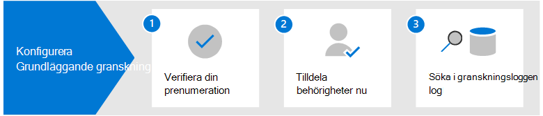

# Ställ in Grundläggande granskning i Microsoft 365

Med grundläggande granskning Microsoft 365 kan du söka efter granskningsposter för aktiviteter som utförs i de olika Microsoft 365 tjänster av användare och administratörer. Eftersom Grundläggande granskning är aktiverat som standard för de flesta Microsoft 365- och Office 365-organisationer finns det bara några få saker du behöver göra innan du och andra i organisationen kan söka i granskningsloggen.

I den här artikeln beskrivs följande steg som krävs för att konfigurera grundläggande granskning.

De här stegen omfattar att säkerställa rätt organisationsprenumerationer och användarlicensiering som krävs för att generera och bevara granskningsposter och tilldela behörigheter till gruppmedlemmar i dina säkerhetsåtgärder, IT, efterlevnad och juridiska team så att du kan söka i granskningsloggen.

Mer information finns i [Grundläggande granskning i Microsoft 365](auditing-solutions-overview.md#basic-audit).

## Steg 1: Verifiera organisationsprenumeration och användarlicensiering

Licensiering för grundläggande granskning kräver lämplig organisationsprenumeration som ger åtkomst till granskningsloggsökningsverktyg och licensiering per användare som krävs för att logga och behålla granskningsposter.

När en granskad aktivitet utförs av en användare eller administratör skapas en granskningspost som lagras i granskningsloggen för organisationen. I Grundläggande granskning behålls och sökes granskningsposter i granskningsloggen i 90 dagar.

En lista över prenumerations- och licensieringskrav för grundläggande granskning finns [i Granska lösningar i Microsoft 365](auditing-solutions-overview.md#licensing-requirements).

## Steg 2: Tilldela behörigheter för att söka i granskningsloggen

Administratörer och medlemmar i utredningsteam måste tilldelas rollen View-Only granskningsloggar eller granskningsloggar i Exchange Online för att söka i granskningsloggen. Som standard tilldelas de här rollerna till rollgrupperna Efterlevnadshantering och Organisationshantering på sidan **Behörigheter** i administrationscentret för Exchange. Globala administratörer i Office 365 och Microsoft 365 läggs automatiskt till som medlemmar i rollgruppen Organisationshantering i Exchange Online. Om du vill ge en användare möjlighet att söka i granskningsloggen med den lägsta graden av behörighet kan du skapa en anpassad rollgrupp i Exchange Online, lägga till rollen Skrivskyddade granskningsloggar eller Granskningsloggar och sedan lägga till användaren som medlem i den nya rollgruppen. Mer information finns i [Hantera rollgrupper i Exchange Online](/Exchange/permissions-exo/role-groups).

Följande skärmbild visar de två granskningsrelaterade roller som tilldelats rollgruppen Organisationshantering i Exchange administrationscentret.

## Steg 3: Sök i granskningsloggen

Nu är du redo att söka i granskningsloggen i Microsoft 365 efterlevnadscenter.

1. Gå till <https://compliance.microsoft.com> och logga in med ett konto som har tilldelats lämpliga granskningsbehörigheter.

2. Klicka på Visa alla i det vänstra navigeringsfönstret i Microsoft 365 efterlevnadscenter **och** klicka sedan på **Granska**.

3. Konfigurera **sökningen** med följande villkor på fliken Sök på **sidan** Granskning. 

   

   1. **Datum- och tidsintervall**. Välj ett datum- och tidsintervall för att visa händelser som inträffat under perioden. Datum och tid visas i lokal tid. De senaste sju dagarna har valts som standard.
  
   2. **Aktiviteter**. Välj de aktiviteter du vill söka efter. Använd sökrutan för att söka efter aktiviteter att lägga till i listan. En partiell lista över granskade aktiviteter finns i [Granskade aktiviteter](search-the-audit-log-in-security-and-compliance.md#audited-activities). Lämna den här rutan tom för att returnera poster för alla granskade aktiviteter.
  
   3. **Användare**.  Klicka i den här rutan och börja skriva namnet på användare som sökresultaten ska visas för. Granskningsloggposterna för de valda aktiviteter som utförs av de användare du väljer i den här rutan visas i resultatlistan. Lämna rutan tom för att returnera poster för alla användare (och tjänstkonton) i organisationen.
  
   4. **Fil, mapp eller webbplats**. Skriv en del av eller alla av ett fil- eller mappnamn för att söka efter aktivitet relaterad till mappfilen som innehåller det angivna nyckelordet. Du kan också ange en URL-adress till en fil eller mapp. Om du använder en URL till en fil eller mapp kontrollerar du att den fullständiga URL-sökvägen eller om du skriver en del av URL:en inte innehåller några specialtecken eller blanksteg. Lämna rutan tom för att returnera poster för alla filer eller mappar i organisationen.

4. Klicka **på Sök** för att köra sökningen.

En ny sida visas som visar att granskningsloggsökningen körs. När sökningen är klar visas granskningsposter på sidan. Klicka på en post om du vill visa en utfällningssida med detaljerade egenskaper.

Mer detaljerade instruktioner finns i Söka [i granskningsloggen i efterlevnadscentret](search-the-audit-log-in-security-and-compliance.md).
