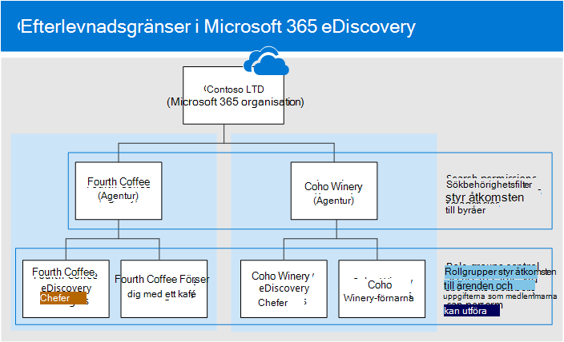

# <a name="set-up-compliance-boundaries-for-ediscovery-investigations"></a>Konfigurera efterlevnadsgränser för eDiscovery-undersökningar

Vägledningen i den här artikeln kan tillämpas när du använder antingen Bas-e-dataidentifiering eller Advanced eDiscovery att hantera undersökningar.

Efterlevnadsgränser skapar logiska gränser inom en organisation som styr användarinnehållsplatserna (till exempel postlådor, OneDrive-konton och SharePoint-webbplatser) som eDiscovery-hanterare kan söka i. Efterlevnadsgränser styr också vem som kan komma åt eDiscovery-ärenden som används för att hantera juridiska ärenden, personalavdelningen och andra undersökningar inom organisationen. Behovet av efterlevnadsgränser är ofta nödvändigt för multinationella företag som måste respektera geografiska myndigheter och myndigheter, som ofta är indelade i olika myndigheter. I Microsoft 365 hjälper efterlevnadsgränser dig att uppfylla de här kraven när du utför innehållssökningar och hanterar undersökningar med e-dataidentifieringsärenden.
  
Vi använder exemplet i följande bild för att förklara hur efterlevnadsgränser fungerar.
  

  
I det här exemplet är Contoso LTD en organisation som består av två dotterbolag, Fourth Coffee och Coho Winery. Företaget kräver att eDiscovery- hela hela företaget och kunder bara kan söka i Exchange-postlådor, OneDrive-konton och SharePoint-webbplatser i sin agentur. Dessutom kan eDiscovery-hanterare och administratörer bara se eDiscovery-ärenden i sin agentur, och de kan bara komma åt de ärenden de är medlemmar i. I det här scenariot kan företag inte heller placera innehållsplatser som på platser som är i lager eller exportera innehåll från ett ärende. Så här uppfyller efterlevnadsgränser de här kraven.
  
- Filtreringsfunktionen för sökbehörigheter i Innehållssökning styr de innehållsplatser som eDiscovery-hanterare och eDiscovery-hanterare kan söka på. Det innebär att eDiscovery-hanterare och medarbetare på den fjärde kaffebyrå bara kan söka efter innehållsplatser i det fjärde kaffeföreställningen. Samma begränsning gäller för dotterbolaget Coho Winery.

- Rollgrupper har följande funktioner för efterlevnadsgränser:

  - Kontrollera vilka som kan se eDiscovery-ärendena i säkerhets- & efterlevnadscenter. Det innebär att eDiscovery-hanterare och administratörer bara kan se eDiscovery-ärenden i sin agentur.

  - Kontrollera vilka som kan tilldela medlemmar till ett e-dataidentifieringsfall. Det innebär att eDiscovery-hanterare och administratörer endast kan tilldela medlemmar till ärenden som de själva är medlemmar i.

  - Kontrollera de eDiscovery-relaterade uppgifter som medlemmar kan utföra genom att lägga till eller ta bort roller som tilldelar specifika behörigheter.

Här är processen för att konfigurera efterlevnadsgränser:
  
[Steg 1: Identifiera ett användarattribut för att definiera dina byråer](#step-1-identify-a-user-attribute-to-define-your-agencies)

[Steg 2: Arkivera en begäran med Microsoft Support om att synkronisera användarattributet till OneDrive konton](#step-2-file-a-request-with-microsoft-support-to-synchronize-the-user-attribute-to-onedrive-accounts)

[Steg 3: Skapa en rollgrupp för varje agentur](#step-3-create-a-role-group-for-each-agency)

[Steg 4: Skapa ett sökbehörighetsfilter för att tillämpa efterlevnadsgränsen](#step-4-create-a-search-permissions-filter-to-enforce-the-compliance-boundary)

[Steg 5: Skapa ett eDiscovery-ärende för en årsbyråundersökning](#step-5-create-an-ediscovery-case-for-intra-agency-investigations)

## <a name="before-you-set-up-compliance-boundaries"></a>Innan du anger efterlevnadsgränser

Du måste uppfylla följande krav innan attributet Azure Active Directory (Azure AD) som du identiteten (i steg 1) kan synkroniseras till en användares OneDrive-konto (i steg 2):

- Användarna måste tilldelas en licens Exchange Online och en licens SharePoint Online.

- Användarpostlådor måste vara minst 10 MB stora. Om en användares postlåda är mindre än 10 MB synkroniseras inte attributet som används för att definiera dina byråer till användarens OneDrive konto.

- Efterlevnadsgränser och attributen som används för att skapa sökbehörighetsfilter kräver att Azure Active Directory-attribut (Azure AD) synkroniseras till användarnas postlådor. Verifiera att attributen som du vill använda har synkroniserats genom att köra [cmdlet:en Get-User](/powershell/module/exchange/get-user) i Exchange Online PowerShell. Utdata för den här cmdleten visar Azure AD-attributen som synkroniseras till Exchange Online.

## <a name="step-1-identify-a-user-attribute-to-define-your-agencies"></a>Steg 1: Identifiera ett användarattribut för att definiera dina byråer

Det första steget är att välja ett Azure AD-attribut som definierar dina byråer. Det här attributet används för att skapa filtret för sökbehörigheter som begränsar en eDiscovery-hanterare till att endast söka efter innehållsplatser för användare som har tilldelats ett visst värde för det här attributet. Anta till exempel att Contoso bestämmer sig för att använda **attributet Department.** Värdet för det här attributet för användare i det fjärde coffee-dotterbolaget skulle vara och värdet för användare i dotterbolaget  `FourthCoffee`  Coho Winery skulle vara `CohoWinery` . I steg 4 använder du det här paret (till exempel  `attribute:value` *Avdelning:FourthCoffee*) för att begränsa platserna för användarinnehåll som eDiscovery-hanterare kan söka i. 
  
Här är en lista över Azure AD-användarattribut som du kan använda för efterlevnadsgränser:
  
- Company

- CustomAttribute1 – CustomAttribute15

- Department

- Office

- C (landskod med två bokstäver) <sup>*</sup>

  > [!NOTE]
  > <sup>*</sup>Det här attributet mappas till egenskapen CountryOrRegion som returneras genom att köra cmdleten **Get-User** Exchange Online PowerShell. Cmdleten returnerar det lokaliserade landnamnet, som översätts från landskoden på två bokstäver. Mer information finns i parameterbeskrivningen för CountryOrRegion i cmdleten [Set-User](/powershell/module/exchange/set-user) reference article.

Även om fler användarattribut är tillgängliga, särskilt Exchange postlådor, är attributen som anges ovan de enda som för närvarande stöds av OneDrive.
  
## <a name="step-2-file-a-request-with-microsoft-support-to-synchronize-the-user-attribute-to-onedrive-accounts"></a>Steg 2: Arkivera en begäran med Microsoft Support om att synkronisera användarattributet till OneDrive konton

Nästa steg är att arkivera en begäran med Microsoft Support för att synkronisera Azure AD-attributet som du valde i steg 1 till alla OneDrive-konton i organisationen. När synkroniseringen sker mappas attributet (och dess värde) som du valde i steg 1 till en dold hanterad egenskap med namnet `ComplianceAttribute` . Du använder det här attributet för att skapa filtret för sökbehörigheter OneDrive i steg 4.
  
Inkludera följande information när du skickar begäran till Microsoft Support:
  
- Organisationens standarddomännamn

- Namnet på Azure AD-attributet (från steg 1)

- Följande rubrik eller beskrivning av syftet med supportbegäran: "Aktivera OneDrive för företag med Azure AD för säkerhetsfilter för efterlevnad". Det här hjälper till att dirigera begäran till det tekniska teamet för eDiscovery som implementerar begäran.

När den tekniska ändringen har gjorts och attributet synkroniserats med OneDrive skickar Microsoft Support det versionsnummer som ändringen gjordes i och ett beräknat distributionsdatum. Distributionsprocessen tar vanligtvis 4–6 veckor efter att du skickat in supportbegäran.
  
> [!IMPORTANT]
> Du kan slutföra steg 3 till steg 5 innan den här attributändringen distribueras. Men när du kör innehållssökningar returneras inte dokument OneDrive-konton som anges i ett filter för sökbehörigheter förrän attributsynch har distribuerats.
  
## <a name="step-3-create-a-role-group-for-each-agency"></a>Steg 3: Skapa en rollgrupp för varje agentur

Nästa steg är att skapa rollgrupper i Säkerhets- & efterlevnadscenter som kommer att justeras mot dina byråer. Vi rekommenderar att du skapar en rollgrupp genom att kopiera den inbyggda gruppen för eDiscovery-hanterare, lägga till rätt medlemmar och ta bort roller som kanske inte är tillämpliga för dina behov. Mer information om eDiscovery-relaterade roller finns i [Tilldela eDiscovery-behörigheter.](assign-ediscovery-permissions.md)
  
Skapa rollgrupper genom att  gå till sidan Behörigheter i Efterlevnadscenter för säkerhet & och skapa en rollgrupp för varje team i varje agentur som ska använda efterlevnadsgränser och eDiscovery-ärenden för att hantera undersökningar.
  
Med scenariot Contosos efterlevnadsgränser måste fyra rollgrupper skapas och lämpliga medlemmar måste läggas till i var och en.
  
- Fourth Coffee eDiscovery Managers

- Fourth Coffee Förser dig med ett kafé

- Coho Winery eDiscovery-hanterare

- Coho Winery-förnarna
  
För att uppfylla kraven i Scenariot för Contoso-efterlevnadsgränser tar du även bort rollerna Behåll och Exportera från de här rollgrupperna för att förhindra att innehåll placeras på innehållsplatser och exporterar innehåll från ett ärende.  

## <a name="step-4-create-a-search-permissions-filter-to-enforce-the-compliance-boundary"></a>Steg 4: Skapa ett sökbehörighetsfilter för att tillämpa efterlevnadsgränsen

När du har skapat rollgrupper för varje agentur är nästa steg att skapa sökbehörighetsfilter som kopplar varje rollgrupp till den specifika agenturen och definierar själva efterlevnadsgränsen. Du måste skapa ett sökbehörighetsfilter för varje agentur. Mer information om hur du skapar filter för säkerhetsbehörigheter finns [i Konfigurera behörighetsfiltrering för innehållssökning](permissions-filtering-for-content-search.md).
  
Här är syntaxen som används för att skapa ett sökbehörighetsfilter som används för efterlevnadsgränser.

```powershell
New-ComplianceSecurityFilter -FilterName <name of filter> -Users <role groups> -Filters "Mailbox_<ComplianceAttribute>  -eq '<AttributeVale> '", "Site_<ComplianceAttribute>  -eq '<AttributeValue>' -or Site_Path -like '<SharePointURL>*'" -Action <Action >
```

Här är en beskrivning av varje parameter i kommandot:
  
- `FilterName`: Anger namnet på filtret. Använd ett namn som beskriver eller identifierar agenturen som filtret används i.

- `Users`: Anger vilka användare eller grupper som får filtret tillämpat på de sökåtgärder de utför. För efterlevnadsgränser anger den här parametern rollgrupperna (som du skapade i steg 3) i den agentur som du skapar filtret för. Observera att det här är en parameter med flera värden så att du kan ta med en eller flera rollgrupper, avgränsade med kommatecken.

- `Filters`: Anger sökvillkoren för filtret. Definiera följande filter för efterlevnadsgränser. Var och en gäller för en innehållsplats. 

    - `Mailbox`: Anger postlådorna som rollgrupperna som definieras i  `Users` parametern kan söka. För efterlevnadsgränser  *är ComplianceAttribute*  samma attribut som du identifierade i steg 1 och  *Attributvärde*  anger agenturen. Med det här filtret kan medlemmar i rollgruppen bara söka i postlådor på en viss agentur. till exempel `"Mailbox_Department -eq 'FourthCoffee'"` . 

    - `Site`: Anger vilka OneDrive som rollgrupperna som definieras i `Users` parametern kan söka. För OneDrive filter använder du själva strängen `ComplianceAttribute` . Det här mappas till samma attribut som du identifierade i steg 1 och som är synkroniserat med OneDrive-konton på grund av supportbegäran som du skickade i steg 2. *AttributeValue* anger agenturen. Med det här filtret kan medlemmar i rollgruppen söka i endast de OneDrive-kontona på en viss agentur. till exempel `"Site_ComplianceAttribute -eq 'FourthCoffee'"` .

    - `Site_Path`: Anger vilka SharePoint som rollgrupperna som definieras i `Users` parametern kan söka. *SharePointURL* anger webbplatser i agenturen som medlemmar i rollgruppen kan söka i. Till exempel  `"Site_Path -like 'https://contoso.sharepoint.com/sites/FourthCoffee*'"` . Observera att `Site` `Site_Path` filtren är kopplade via en **-eller-operator.**

     > [!NOTE]
     > Syntaxen för `Filters` parametern innehåller en *filterlista*. En filterlista är ett filter som innehåller ett postlådefilter och ett webbplatsfilter avgränsade med kommatecken. I exemplet ovan ser du att ett kommatecken skiljer Mailbox_ComplianceAttribute **och** **Site_ComplianceAttribute** `-Filters "Mailbox_<ComplianceAttribute>  -eq '<AttributeVale> '", "Site_ComplianceAttribute  -eq '<AttributeValue>' -or Site_Path -like '<SharePointURL>*'"` : När det här filtret bearbetas vid en innehållssökning skapas två sökbehörighetsfilter från filterlistan: ett postlådefilter och ett webbplatsfilter. Ett alternativ till att använda en filterlista är att skapa två separata sökbehörighetsfilter för varje agentur: ett filter med sökbehörigheter för postlådans attribut och ett filter för webbplatsattributen. I båda fallen blir resultatet detsamma. Det spelar ingen roll om du använder en filterlista eller skapar separata sökbehörighetsfilter.

- `Action`: Anger vilken typ av sökåtgärd filtret ska tillämpas på. Till exempel  `-Action Search` används endast filtret när medlemmar i rollgruppen som definierats i `Users` parametern kör en sökning. I det här fallet används inte filtret när du exporterar sökresultat. För efterlevnadsgränser använder  `-Action All` du så att filtret gäller för alla sökåtgärder. 

    En lista med sökåtgärder finns i avsnittet "New-ComplianceSecurityFilter" i [Konfigurera behörighetsfiltrering för innehållssökning.](permissions-filtering-for-content-search.md#new-compliancesecurityfilter)

Här är exempel på de två sökbehörighetsfilter som skulle skapas för att stödja Contosos efterlevnadsgränser. I båda dessa exempel finns en lista med kommaavgränsade filter där postlådan och webbplatsfilter ingår i samma sökbehörighetsfilter och avgränsas med kommatecken.
  
### <a name="fourth-coffee"></a>Fourth Coffee

```powershell
New-ComplianceSecurityFilter -FilterName "Fourth Coffee Security Filter" -Users "Fourth Coffee eDiscovery Managers", "Fourth Coffee Investigators" -Filters "Mailbox_Department -eq 'FourthCoffee'", "Site_ComplianceAttribute -eq 'FourthCoffee' -or Site_Path -like 'https://contoso.sharepoint.com/sites/FourthCoffee*'" -Action ALL
```

### <a name="coho-winery"></a>Coho Winery

```powershell
New-ComplianceSecurityFilter -FilterName "Coho Winery Security Filter" -Users "Coho Winery eDiscovery Managers", "Coho Winery Investigators" -Filters "Mailbox_Department -eq 'CohoWinery'", "Site_ComplianceAttribute -eq 'CohoWinery' -or Site_Path -like 'https://contoso.sharepoint.com/sites/CohoWinery*'" -Action ALL
```

## <a name="step-5-create-an-ediscovery-case-for-intra-agency-investigations"></a>Steg 5: Skapa ett eDiscovery-ärende för årsundersökningar

Det sista steget är att skapa ett grundläggande eDiscovery-ärende eller Advanced eDiscovery-ärende i efterlevnadscentret för Microsoft 365 och sedan lägga till rollgruppen som du skapade i steg 3 som medlem i ärendet. Det här resulterar i två viktiga egenskaper hos användning av efterlevnadsgränser:
  
- Endast medlemmar i rollgruppen som läggs till i ärendet kan se och komma åt ärendet i Säkerhets- & Efterlevnadscenter. Om till exempel rollgruppen Fjärde kaffemedlemmar är den enda medlemmen i ett ärende kan inte medlemmar i rollgruppen Fourth Coffee eDiscovery Managers (eller medlemmar i någon annan rollgrupp) se eller komma åt ärendet.

- När en medlem i rollgruppen som är tilldelad till ett ärende kör en sökning som är kopplad till ärendet kan de bara söka på innehållsplatser i sin agentur (som definieras av filtret för sökbehörigheter som du skapade i steg 4.)

Så här skapar du ett ärende och tilldelar medlemmar:

1. Gå till sidan **Core eDiscovery** **eller Advanced eDiscovery** i Microsoft 365 och skapa ett ärende.

2. Klicka på namnet på det ärende du skapade i listan med ärenden.

3. Lägg till rollgrupper som medlemmar i ärendet. Instruktioner finns i följande artiklar:

   - [Lägga till medlemmar i ett grundläggande eDiscovery-ärende](get-started-core-ediscovery.md#step-4-optional-add-members-to-a-core-ediscovery-case)

   - [Lägga till medlemmar i ett Advanced eDiscovery ärende](add-or-remove-members-from-a-case-in-advanced-ediscovery.md)

> [!NOTE]
> När du lägger till en rollgrupp i ett ärende kan du bara lägga till de rollgrupper där du är medlem.

## <a name="searching-and-exporting-content-in-multi-geo-environments"></a>Söka efter och exportera innehåll i Multi-Geo-miljöer

Med sökbehörighetsfilter kan du också styra vart innehåll dirigeras för export och vilka datacenter som kan sökas när du söker på innehållsplatser i [en SharePoint Multi-Geo miljö.](../enterprise/multi-geo-capabilities-in-onedrive-and-sharepoint-online-in-microsoft-365.md)
  
- **Exportera sökresultat:** Du kan exportera sökresultatet från en Exchange, webbplatser SharePoint och konton OneDrive ett särskilt datacenter. Det innebär att du kan ange platsen för datacentret som sökresultatet ska exporteras från.

    Använd **parametern Region** för **cmdlets för New-ComplianceSecurityFilter** eller **Set-ComplianceSecurityFilter** för att skapa eller ändra vilket datacenter exporten ska dirigeras till.
  
    |**Parametervärde**|**Datacenterplats**|
    |:-----|:-----|
    |NAM  <br/> |North American (datacenter finns i USA)  <br/> |
    |EUR  <br/> |Europa  <br/> |
    |APC  <br/> |Asien/Stillahavsområdet  <br/> |
    |CAN <br/> |Kanada|
    |||

- **Dirigera innehållssökningar:** Du kan dirigera innehållssökningar för webbplatser SharePoint och konton OneDrive ett satellitdatacenter. Det innebär att du kan ange datacenterplatsen där sökningarna ska köras.

    Använd något av följande värden för parametern **Region** för att styra platsen för det datacenter som sökningar körs i när du söker SharePoint webbplatser och OneDrive konton. 
  
    |**Parametervärde**|**Datacenterdirigeringsplatser för SharePoint**|
    |:-----|:-----|
    |NAM  <br/> |US  <br/> |
    |EUR  <br/> |Europa  <br/> |
    |APC  <br/> |Asien/Stillahavsområdet  <br/> |
    |CAN  <br/> |US  <br/> |
    |AUS  <br/> |Asien/Stillahavsområdet  <br/> |
    |KOR  <br/> |Organisationens standarddatacenter  <br/> |
    |GBR  <br/> |Europa  <br/> |
    |JPN  <br/> |Asien/Stillahavsområdet  <br/> |
    |IND  <br/> |Asien/Stillahavsområdet  <br/> |
    |Y.Y  <br/> |US  <br/> |
    |NOR  <br/> |Europa |
    |BRA  <br/> |Nordamerikas datacenter |
    |||

   Om du inte anger **parametern Region** för ett filter för sökbehörigheter genomsöks organisationens SharePoint region. Sökresultat exporteras till det närmaste datacentret.

   För att förenkla begreppet styr **regionparametern** det datacenter som används för att söka efter innehåll i SharePoint och OneDrive. Det här gäller inte vid sökning efter innehåll i Exchange eftersom Exchange av innehållssökningar inte är bundna av datacentrets geografiska plats. Dessutom kan samma **Region-parametervärde** diktera det datacenter som exporterar dirigeras genom. Detta är ofta nödvändigt för att styra dataförflyttningen mellan geografiska tavla.

> [!NOTE]
> Om du använder Advanced eDiscovery kontrollerar **inte parametern Region** det område som data exporteras från. Data exporteras från organisationens primära datacenter. Dessutom är sökning efter innehåll i SharePoint OneDrive datacentret inte bundet av datacentrets geografiska placering. Alla datacenter genomsöks. Mer information om Advanced eDiscovery finns i [Översikt över Advanced eDiscovery lösning i Microsoft 365.](overview-ediscovery-20.md)

Här är exempel på hur du använder **parametern Region** när du skapar sökbehörighetsfilter för efterlevnadsgränser. Detta förutsätter att dotterbolaget Fourth Coffee finns i Nordamerika och att Coho Winery finns i Europa. 
  
```powershell
New-ComplianceSecurityFilter -FilterName "Fourth Coffee Security Filter" -Users "Fourth Coffee eDiscovery Managers", "Fourth Coffee Investigators" -Filters "Mailbox_Department -eq 'FourthCoffee'", "Site_Department -eq 'FourthCoffee' -or Site_Path -like 'https://contoso.sharepoint.com/sites/FourthCoffee*'" -Action ALL -Region NAM
```

```powershell
New-ComplianceSecurityFilter -FilterName "Coho Winery Security Filter" -Users "Coho Winery eDiscovery Managers", "Coho Winery Investigators" -Filters "Mailbox_Department -eq 'CohoWinery'", "Site_Department -eq 'CohoWinery' -or Site_Path -like 'https://contoso.sharepoint.com/sites/CohoWinery*'" -Action ALL -Region EUR
```

Tänk på följande när du söker efter och exporterar innehåll i multigeobaserade miljöer.
  
- Parametern **Region** kontrollerar inte sökningar i Exchange-postlådor. Alla datacenter genomsöks när du söker i postlådor. Om du vill begränsa omfattningen för Exchange postlådor genomsöks använder du parametern **Filter** när du skapar eller ändrar ett filter för sökbehörigheter. 

- Om det är nödvändigt för en eDiscovery-hanterare att söka i flera SharePoint-regioner måste du skapa ett annat användarkonto för den eDiscovery-hanteraren att använda i filtret för sökbehörigheter för att ange den region där SharePoint-webbplatserna eller OneDrive-kontona finns. Mer information om hur du inställningar finns i avsnittet "Söka efter innehåll i SharePoint Multi-Geo miljö" i [Innehållssökning.](content-search-reference.md#searching-for-content-in-a-sharepoint-multi-geo-environment)

- När du söker efter innehåll i SharePoint och  OneDrive dirigerar regionparametern sökningar till antingen den primära platsen eller satellitplatsen där eDiscovery-chefen kommer att utföra eDiscovery-undersökningar. Om en eDiscovery-hanterare söker SharePoint och OneDrive webbplatser utanför den region som anges i filtret för sökbehörigheter returneras inga sökresultat.

- När du exporterar sökresultat överförs innehåll från alla innehållsplatser (inklusive Exchange, Skype för företag, SharePoint, OneDrive och andra tjänster som du kan söka i med hjälp av verktyget Innehållssökning) till den Azure Storage-plats i datacentret som anges av **parametern Region.** Det här hjälper organisationer att hålla sig inom efterlevnadsgränserna genom att inte tillåta att innehåll exporteras över styrda kantlinjer. Om ingen region anges i filtret för sökbehörigheter laddas innehåll upp till organisationens primära datacenter.

- Du kan redigera ett befintligt sökbehörighetsfilter för att lägga till eller ändra området genom att köra följande kommando:

    ```powershell
    Set-ComplianceSecurityFilter -FilterName <Filter name>  -Region <Region>
    ```

## <a name="using-compliance-boundaries-for-sharepoint-hub-sites"></a>Använda efterlevnadsgränser för SharePoint navplatser

[SharePoint navplatser](/sharepoint/dev/features/hub-site/hub-site-overview) anpassas ofta efter samma geografiska gränser eller agenturgränser som eDiscovery-efterlevnadsgränserna följer. Det innebär att du kan använda navwebbplatsens webbplats-ID-egenskap till att skapa en efterlevnadsgräns. Det gör du med cmdleten [Get-SPOHubSite](/powershell/module/sharepoint-online/get-spohubsite#examples) i SharePoint Online PowerShell för att hämta SiteId för navwebbplatsen och sedan använda det här värdet för egenskapen avdelnings-ID till att skapa ett filter för sökbehörigheter.

Använd följande syntax för att skapa ett sökbehörighetsfilter för en SharePoint navplats:

```powershell
New-ComplianceSecurityFilter -FilterName <Filter Name> -Users <User or Group> -Filters "Site_Departmentid -eq '{SiteId of hub site}'" -Action ALL
```

Här är ett exempel på hur du skapar ett sökbehörighetsfilter för en navwebbplats för Coho Winery-agenturen:

```powershell
New-ComplianceSecurityFilter -FilterName "Coho Winery Hub Site Security Filter" -Users "Coho Winery eDiscovery Managers", "Coho Winery Investigators" -Filters "Site_Departmentid -eq '44252d09-62c4-4913-9eb0-a2a8b8d7f863'" -Action ALL
```

## <a name="compliance-boundary-limitations"></a>Begränsningar av efterlevnadsgräns

Tänk på följande begränsningar när du hanterar eDiscovery-ärenden och undersökningar som använder efterlevnadsgränser.
  
- När du skapar och kör en sökning kan du välja innehållsplatser som finns utanför din agentur. Men på grund av filtret för sökbehörigheter inkluderas inte innehåll från dessa platser i sökresultaten.

- Efterlevnadsgränser gäller inte för eDiscovery-ärenden. Det innebär att en eDiscovery-chef på en agentur kan skapa en agentur i en annan agentur. Efterlevnadsgränsen tillämpas emellertid om eDiscovery-hanteraren söker igenom innehållsplatserna för användaren som var satt på en plats. Det innebär att eDiscovery-hanteraren inte kan söka på användarens innehållsplatser, även om de kunde placera användaren på en plats.

    Även statistik för att hålla kvar tillämpas endast på innehållsplatser i byrån.

- Sökbehörighetsfilter tillämpas inte på Exchange gemensamma mappar.

## <a name="more-information"></a>Mer information

- Om en postlåda avlicensieras eller tas bort mjukt synkroniseras inte längre Azure AD-attribut till postlådan. Om ett område hade placerats på postlådan när den togs bort omfattas fortfarande det innehåll som behålls i postlådan av en efterlevnadsgräns eller ett filter för sökbehörigheter baserat på den senaste gången Azure AD-attributen synkroniserades innan postlådan togs bort. 

    Dessutom upphör synkroniseringen mellan användarens postlåda och OneDrive om postlådan avlicensieras eller tas bort mjukt. Det senaste stämplade värdet för efterlevnadsattributet för OneDrive förblir fortsättningsvis i kraft.

- Efterlevnadsattributet synkroniseras från en användares e Exchange postlåda till sitt OneDrive var sjunde dag. Som tidigare nämnts inträffar den här synkroniseringen bara när användaren har tilldelats en licens för både Exchange Online och SharePoint Online och användarens postlåda är minst 10 MB.

- Om efterlevnadsgränser och sökbehörighetsfilter implementeras för både en användares postlåda och OneDrive-konto rekommenderar vi att du inte tar bort en användares postlåda och inte användarens OneDrive konto. Med andra ord, om du tar bort en användares postlåda bör du också ta bort användarens OneDrive konto.

- Det finns situationer (till exempel en återkommande anställd) där en användare kan ha två eller fler OneDrive konton. I dessa fall synkroniseras bara det OneDrive primära kontot som är kopplat till användaren i Azure AD.

- Efterlevnadsgränser och sökbehörighetsfilter beror på attribut som stämplas på innehåll i Exchange, OneDrive och SharePoint samt efterföljande indexering av det här stämplade innehållet. 

- Vi rekommenderar inte att du använder undantagsfilter (som att använda i ett filter för `-not()` sökbehörigheter) för en innehållsbaserad efterlevnadsgräns. Användning av ett undantagsfilter kan få oväntade resultat om innehåll med nyligen uppdaterade attribut inte har indexerats. 

## <a name="frequently-asked-questions"></a>Vanliga frågor och svar

**Vem kan skapa och hantera sökbehörighetsfilter (med New-ComplianceSecurityFilter och Set-ComplianceSecurityFilter cmdlets)?**
  
Om du vill skapa, visa och ändra sökbehörighetsfilter måste du vara medlem i rollgruppen Organisationshantering i säkerhets- och & Efterlevnadscenter.
  
**Om en eDiscovery-hanterare har tilldelats fler än en rollgrupp som spänner över flera byråer, hur gör de för att söka efter innehåll i en agentur eller den andra?**
  
EDiscovery-hanteraren kan lägga till parametrar i sina sökfrågor som begränsar sökningen till en specifik agentur. Om en organisation till exempel har angett egenskapen **CustomAttribute10** för att skilja mellan byråer kan de lägga till följande i sina sökfrågor för att söka i postlådor och OneDrive-konton i en viss agentur: `CustomAttribute10:<value> AND Site_ComplianceAttribute:<value>` .
  
**Vad händer om värdet för attributet som används som efterlevnadsattribut i ett filter för sökbehörigheter ändras?**
  
Det tar upp till tre dagar för ett filter med sökbehörigheter att tillämpa efterlevnadsgränsen om värdet för attributet som används i filtret ändras. Anta till exempel i Contoso-scenariot att en användare i Fourth Coffee-byrån överförs till Coho Winery-byrån. Därför ändras värdet för attributet **Avdelning** i användarobjektet från *FourthCoffee* till *CohoWinery.* I det här fallet får Fourth Coffee eDiscovery och investerare sökresultat för den användaren i upp till tre dagar efter att attributet ändras. På samma sätt tar det upp till tre dagar innan Coho Winery-eDiscovery-hanterare och administratörer får sökresultat för användaren.
  
**Kan en eDiscovery-hanterare se innehåll från två separata efterlevnadsgränser?**
  
Ja, det kan du göra när du söker Exchange postlådor genom att lägga till eDiscovery-hanteraren i rollgrupper som har insyn i båda byråerna. Men när en eDiscovery-hanterare söker SharePoint webbplatser och OneDrive-konton kan du bara söka efter innehåll i olika efterlevnadsgränser om byråerna befinner sig i samma region eller geo plats. **Obs!** Den här begränsningen för webbplatser gäller inte i Advanced eDiscovery eftersom sökning efter innehåll i SharePoint och OneDrive inte är bunden av geografisk plats.
  
**Fungerar filter för sökbehörigheter för eDiscovery-fall som sätts i Microsoft 365 bevarandeprinciper eller DLP?**
  
Nej, inte för stunden.
  
**Om jag anger ett område som styr vart innehåll exporteras, men jag har ingen SharePoint organisation i det området, kan jag ändå söka i SharePoint?**
  
Om området som anges i filtret för sökbehörigheter inte finns i organisationen genomsöks standardområdet.
  
**Vad är det maximala antalet sökbehörighetsfilter som kan skapas i en organisation?**
  
Det finns ingen gräns för antalet sökbehörighetsfilter som kan skapas i en organisation. Men sökprestandan påverkas när det finns fler än 100 sökbehörighetsfilter. Om du vill hålla antalet sökbehörighetsfilter i organisationen så få som möjligt skapar du filter som kombinerar regler för Exchange, SharePoint och OneDrive i ett enda sökbehörighetsfilter när det är möjligt.