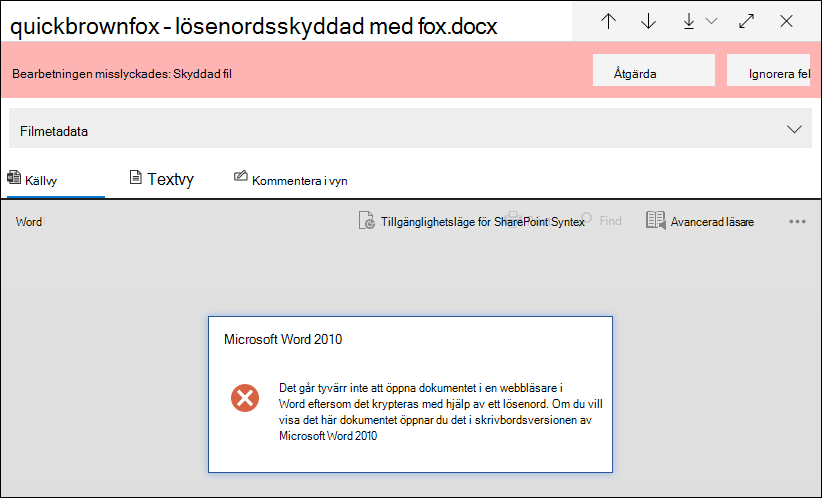
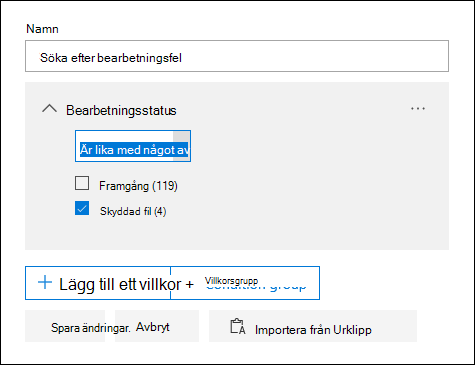
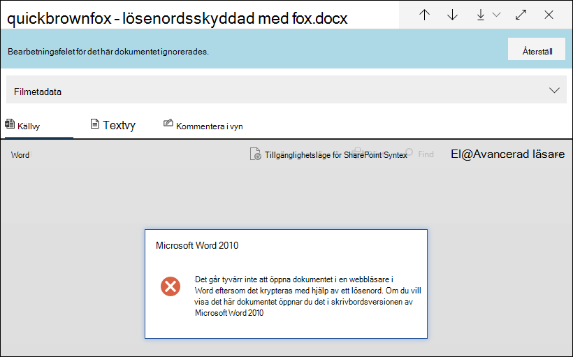
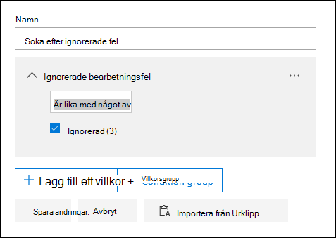
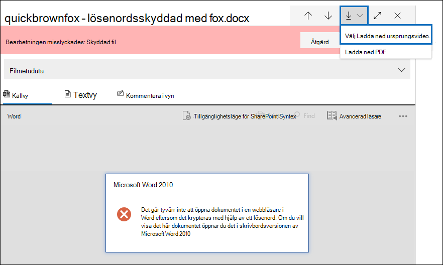
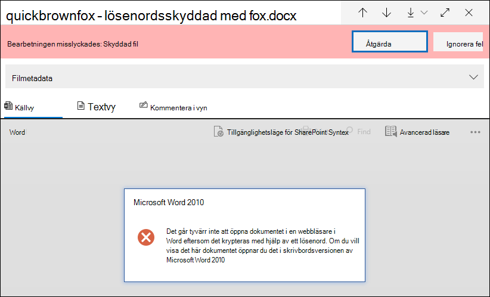
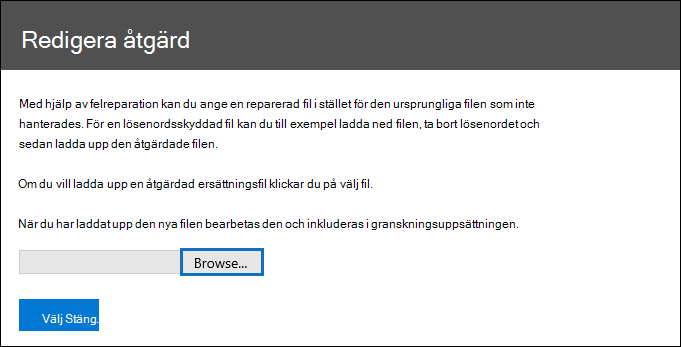
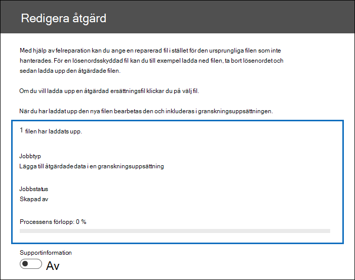
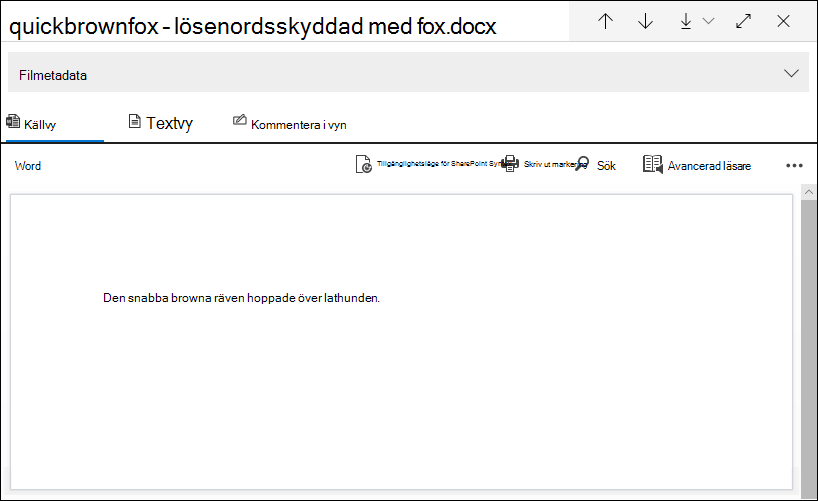

# Åtgärd för enstaka objektfel i Advanced eDiscovery

Felreparation ger Advanced eDiscovery möjlighet att hantera dataproblem som hindrar Advanced eDiscovery att bearbeta innehållet på rätt sätt. Till exempel kan inte lösenordsskyddade filer bearbetas eftersom filerna är låsta eller krypterade. Tidigare kunde du bara massreklarera fel med hjälp av det [här arbetsflödet.](error-remediation-when-processing-data-in-advanced-ediscovery.md) Men ibland är det inte rimligt att åtgärda fel i flera filer när du är osäker på om någon av filerna svarar på det ärende du undersöker. Det kanske inte heller är meningsfullt att åtgärda fel innan du har haft möjlighet att granska filens metadata (till exempel filplats eller vem som har åtkomst) för att hjälpa dig att fatta snabba beslut om tillgänglighet. En ny  funktion som kallas åtgärd för enstaka objekt ger eDiscovery-hanterare möjlighet att visa metadata för filer med ett bearbetningsfel och vid behov åtgärda felet direkt i granskningsuppsättningen. I artikeln beskrivs hur du identifierar, ignorerar och åtgärdar filer med bearbetningsfel i en granskningsuppsättning.

## Identifiera dokument med fel

Dokument med bearbetningsfel i en granskningsuppsättning identifieras nu (med en banderoll). Du kan åtgärda eller ignorera felet. Följande skärmbild visar en banderoll med bearbetningsfel för ett Word-dokument i en granskningsuppsättning som är lösenordsskyddad. Observera också att du kan visa filens metadata i dokument med bearbetningsfel.

Du kan också söka efter dokument som har bearbetningsfel genom att använda **villkoret Bearbetningsstatus** när du frågar dokumenten i [en granskningsuppsättning.](review-set-search.md)

### Ignorera fel

Du kan ignorera ett bearbetningsfel genom att klicka på **Ignorera** i banderollen för bearbetningsfel. När du ignorerar ett fel tas dokumentet bort från arbetsflödet [för massfelreparation.](error-remediation-when-processing-data-in-advanced-ediscovery.md) När ett fel ignoreras ändrar dokumentbanderollen färg och anger att bearbetningsfelet ignorerades. Du kan när som helst återställa beslutet att ignorera felet genom att klicka på **Återställ**.

Du kan också söka efter alla dokument som hade ett bearbetningsfel som ignorerades med hjälp av villkoret Ignorerad bearbetning när dokument i en *granskningsuppsättning* körs.

## Åtgärda fel i ett dokument

Ibland kan du behöva åtgärda ett bearbetningsfel i dokument (genom att ta bort ett lösenord, dekryptera en krypterad fil eller återställa ett skadat dokument) och sedan lägga till det åtgärdade dokumentet i granskningsuppsättningen. På så sätt kan du granska och exportera feldokumentet tillsammans med de andra dokumenten i granskningsuppsättningen. 

För att åtgärda ett enskilt dokument gör du så här:

1. Klicka **på Ladda** ned  >  **original** för att ladda ned en kopia av filen till en lokal dator.

   

2. Åtgärda felet i filen offline. För krypterade filer, som skulle kräva dekrypteringsprogramvara, för att ta bort lösenordsskydd, antingen tillhandahålla lösenordet och spara filen eller använda en lösenordsruckare. När du har åtgärdat filen går du till nästa steg.

3. Markera filen med det åtgärdade bearbetningsfelet i granskningsuppsättningen och klicka sedan **på Åtgärd.**

   

4. Klicka **på** Bläddra , gå till platsen för den åtgärdade filen på den lokala datorn och markera sedan filen.

   

    När du har valt den åtgärdade filen laddas den automatiskt upp till granskningsuppsättningen. Du kan spåra filens bearbetningsstatus.

    

   När bearbetningen är klar kan du visa det åtgärdade dokumentet.

    

Mer information om vad som händer när ett dokument åtgärdas finns i [Vad händer när filer åtgärdas.](error-remediation-when-processing-data-in-advanced-ediscovery.md#what-happens-when-files-are-remediated)

## Söka efter åtgärdade dokument

Du kan söka efter alla dokument i en granskningsuppsättning som har åtgärdats med hjälp av **villkoret Nyckelord** och ange följande egenskap:värdepar: **IsFromErrorRemediation:true.** Den här egenskapen är också tillgänglig i inläsningsfilen för export när du exporterar dokument från en granskningsuppsättning.
