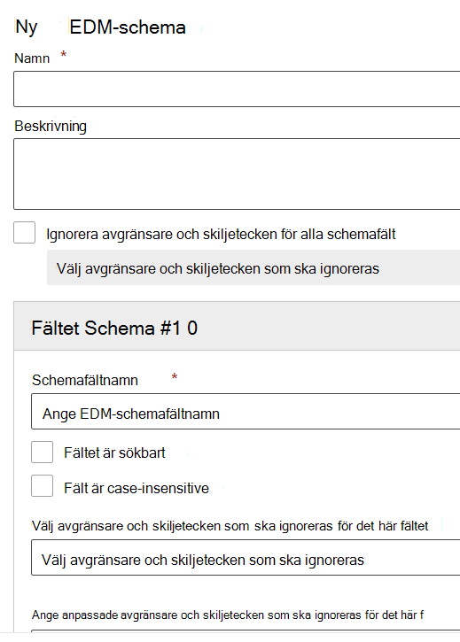

# Använd Exact Data Match-schemat och guiden för typ av känslig informationUse the Exact Data Match Schema and Sensitive Information Type Wizard

[Att skapa en anpassad typ av känslig information med EDM-baserad (Exact Data Match) klassificering](create-custom-sensitive-information-types-with-exact-data-match-based-classification.md) innefattar flera steg.[Creating a custom sensitive information type with Exact Data Match (EDM) based classification](create-custom-sensitive-information-types-with-exact-data-match-based-classification.md)  involves many steps.  Du kan använda guiden till att skapa mönsterfiler för schemat och typen av känslig information (regelpaket) som förenklar processen.You can use this wizard to create your schema and sensitive information type pattern (rule package) files to help simplify the process.

> [!NOTE]
> Exact Data Match-schemat och guiden för typ av känslig information är endast tillgänglig för World Wide- och GCC-molnen.The Exact Data Match Schema and Sensitive Information Type Wizard is only available for the World Wide and GCC clouds only.

Guiden kan användas i stället för:This wizard can be used instead of the:

- [Definiera schemat för databasen med känslig informationDefine the schema for your database of sensitive information](create-custom-sensitive-information-types-with-exact-data-match-based-classification.md#define-the-schema-for-your-database-of-sensitive-information)
- [Konfigurera ett mönster (regelpaket)Set up a pattern (rule package)](create-custom-sensitive-information-types-with-exact-data-match-based-classification.md#set-up-a-rule-package)

steg i [del 1: Konfigurera EDM-baserad klassificering](create-custom-sensitive-information-types-with-exact-data-match-based-classification.md#part-1-set-up-edm-based-classification).steps in [Part 1: Set up EDM-based classification](create-custom-sensitive-information-types-with-exact-data-match-based-classification.md#part-1-set-up-edm-based-classification).

## FörutsättningarPre-requisites

1. Bekanta dig med stegen för att skapa en anpassad typ av känslig information med EDM:s [arbetsflöde i korthet](create-custom-sensitive-information-types-with-exact-data-match-based-classification.md#the-work-flow-at-a-glance).Familiarize yourself with the steps to create a custom sensitive information type with EDM [work flow at a glance](create-custom-sensitive-information-types-with-exact-data-match-based-classification.md#the-work-flow-at-a-glance).

2. Utför stegen i avsnittet [Spara känsliga data i .csv-format](create-custom-sensitive-information-types-with-exact-data-match-based-classification.md#save-sensitive-data-in-csv-format).Perform the steps in the [Save sensitive data in .csv format](create-custom-sensitive-information-types-with-exact-data-match-based-classification.md#save-sensitive-data-in-csv-format) section.

## Använda Exact Data Match-schemat och mönsterguiden för typ av känslig informationUse the exact data match schema and sensitive information type pattern wizard

1. I Microsoft 365 Efterlevnadscenter för klientorganisationen går du till **Dataklassificering** > **Exakta datamatchningar**.In the Microsoft 365 Compliance center for your tenant go to **Data classification** > **Exact data matches**.

2. Välj **Skapa EDM-schema** för att öppna schemaguidens utfällbara konfiguration.Choose **Create EDM schema** to open the schema wizard configuration flyout.

3. Fyll i **Namn** och **Beskrivning**.Fill in an appropriate **Name** and **Description**.

4. Välj **Ignorera avgränsare och skiljetecken för alla schemafält** om du vill ha den funktionen.Choose **Ignore delimiters and punctuations for all schema fields** if you want that behavior. Mer information om hur du konfigurerar att EDM ignorerar skiftlägen eller avgränsare finns i [Skapa en anpassad typ av känslig information med EDM-baserad (Exact Data Match) klassificering](create-custom-sensitive-information-types-with-exact-data-match-based-classification.md).To learn more about configuring EDM to ignore case or delimitere, see [Creating a custom sensitive information type with Exact Data Match (EDM) based classification](create-custom-sensitive-information-types-with-exact-data-match-based-classification.md).

5. Fyll i önskade värden i **schemafältet och #1** lägg till fler fält efter behov.Fill in your desired values for your **Schema field #1** and add more fields as needed. 

> [!IMPORTANT]
> Minst ett men inte fler än fem av schemafälten måste anges som sökbara.At least one, but no more than five of your schema fields must be designated as searchable.

6. Välj Spara.Choose save. Schemat finns nu i listan.Your schema will now be listed.

7. Välj **EDM-typer av känslig information** och **Skapa EDM-typ av känslig information** för att öppna konfigurationsguiden för känsliga informationstyper.Choose **EDM sensitive info types** and **Create EDM sensitive info type** to open the sensitive info type configuration wizard.

8. Välj **Välj ett befintligt EDM-schema** och välj det schema som du skapade i steg 2–6 i listan.Choose **Choose an existing EDM schema** and choose the schema you created in steps 2-6 from the list.

9. Välj **Nästa** och **Skapa mönster**.Choose **Next** and choose **Create pattern**.

10. Välj **Konfidensnivå** och **Primärt element**.Choose the **Confidence level** and **Primary element**.  Mer information om hur du konfigurerar ett mönster finns i [Skapa en anpassad typ av känslig information i Microsoft 365 Efterlevnadscenter](create-a-custom-sensitive-information-type.md)To learn more about configuring a pattern, see [Create a custom sensitive information type in the Compliance Center](create-a-custom-sensitive-information-type.md)

11.  Välj **Det primära elementets typ av känslig information** att associera det med.Choose the **Primary element's sensitive info type** to associate it with. Se [Entitetsdefinitioner för typ av känslig information](sensitive-information-type-entity-definitions.md) för läsa mer om de tillgängliga typerna av känslig information.See [Sensitive Information Type Entity Definitions](sensitive-information-type-entity-definitions.md) to learn more about the available sensitive information types.

12. Välj **Klar**.Choose **Done**.

13. Välj önskad **Konfidensnivå och teckennärhet**.Choose your desired **Confidence level and character proximity**.  Detta blir standardvärdet för hela den EDM-känsliga informationstypenThis will be the default value for the whole EDM sensitive info type

13. Välj **Skapa mönster** om du vill skapa fler mönster för din EDM-känsliga informationstyp.Choose **Create pattern** if you want to creaet additional patterns for your EDM sensitive info type.

14. Välj **Nästa** och fyll i ett **Namn** och en **Beskrivning för administratörer**.Choose **Next** and fill in a **Name** and **Description for admins**.

15. Granska och välj **Skicka**.Review and choose **Submit**.

Du kan ta bort eller redigera mönstret för den känsliga informationstypen genom att markera det som visar redigerings- och borttagningskontrollerna.You can delete or edit the sensitive information type pattern by selecting it which surfaces the edit and delete controls.

> [!IMPORTANT]
> Om du vill ta bort ett schema som redan är associerat med en EDM-känslig informationstyp, måste du först ta bort den EDM-känsliga informationstypen. Sedan kan du ta bort schemat.If you want to remove a schema, and it is already associated with an EDM sensitive info type, you must first delete the EDM sensitive info type, then you can delete the schema.

## Publicera stegPost steps

När du har använt den här guiden för att skapa dina filer för EDM-schemat och mönstret (regelpaket), måste du fortfarande utföra stegen i [Del 2: Hasha och ladda upp känsliga data](create-custom-sensitive-information-types-with-exact-data-match-based-classification.md#part-2-hash-and-upload-the-sensitive-data) innan du kan använda den anpassade EDM-känsliga informationstypen.After you have used this wizard to create your EDM schema and pattern (rule package) files, you still have to perform the steps in [Part 2: Hash and upload the sensitive data](create-custom-sensitive-information-types-with-exact-data-match-based-classification.md#part-2-hash-and-upload-the-sensitive-data) before you can use the EDM custom sensitive information type.