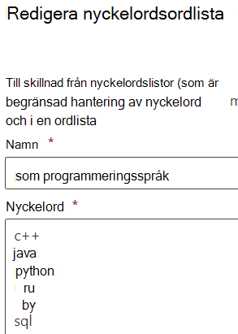

# <a name="modify-a-keyword-dictionary"></a><span data-ttu-id="69b75-103">Ändra en nyckelordsordlista</span><span class="sxs-lookup"><span data-stu-id="69b75-103">Modify a keyword dictionary</span></span>

<span data-ttu-id="69b75-104">Du kan behöva ändra nyckelord i någon av dina nyckelordsordlistor eller ändra någon av de inbyggda ordlistorna.</span><span class="sxs-lookup"><span data-stu-id="69b75-104">You might need to modify keywords in one of your keyword dictionaries, or modify one of the built-in dictionaries.</span></span> <span data-ttu-id="69b75-105">Du kan göra det via PowerShell eller via efterlevnadscentret.</span><span class="sxs-lookup"><span data-stu-id="69b75-105">You can do this through PowerShell or through the Compliance center.</span></span>

## <a name="modify-a-keyword-dictionary-in-compliance-center"></a><span data-ttu-id="69b75-106">Ändra en nyckelordsordlista i Efterlevnadscenter</span><span class="sxs-lookup"><span data-stu-id="69b75-106">Modify a keyword dictionary in Compliance center</span></span>

<span data-ttu-id="69b75-107">Nyckelordsordlistor kan användas som `Primary elements` `Supporting elements` eller i känslig informationstyp (SIT).</span><span class="sxs-lookup"><span data-stu-id="69b75-107">Keyword dictionaries can be used as `Primary elements` or `Supporting elements` in sensitive information type (SIT) patterns.</span></span> <span data-ttu-id="69b75-108">Du kan redigera en nyckelordsordlista när du skapar en SIT eller i en befintlig SIT.</span><span class="sxs-lookup"><span data-stu-id="69b75-108">You can edit a keyword dictionary while creating a SIT or in an existing SIT.</span></span> <span data-ttu-id="69b75-109">Så här redigerar du till exempel en befintlig nyckelordsordlista:</span><span class="sxs-lookup"><span data-stu-id="69b75-109">For example to edit an existing keyword dictionary:</span></span>

1. <span data-ttu-id="69b75-110">Öppna mönstret som har nyckelordsordlistan som du vill uppdatera.</span><span class="sxs-lookup"><span data-stu-id="69b75-110">Open the pattern that has the keyword dictionary you want to update.</span></span>
2. <span data-ttu-id="69b75-111">Leta upp nyckelordsordlistan som du vill uppdatera och välj redigera.</span><span class="sxs-lookup"><span data-stu-id="69b75-111">Find the keyword dictionary you want to update and choose edit.</span></span> 
3.  <span data-ttu-id="69b75-112">Gör dina ändringar med hjälp av ett nyckelord per rad.</span><span class="sxs-lookup"><span data-stu-id="69b75-112">Make your edits, using one keyword per line.</span></span>



4. <span data-ttu-id="69b75-114">Välj `Done` .</span><span class="sxs-lookup"><span data-stu-id="69b75-114">Choose `Done`.</span></span>

## <a name="modify-a-keyword-dictionary-using-powershell"></a><span data-ttu-id="69b75-115">Ändra en nyckelordsordlista med hjälp av PowerShell</span><span class="sxs-lookup"><span data-stu-id="69b75-115">Modify a keyword dictionary using PowerShell</span></span> 

<span data-ttu-id="69b75-116">Vi kommer till exempel att ändra vissa termer i PowerShell, spara termerna lokalt där du kan ändra dem i ett redigeringsprogram och sedan uppdatera de tidigare termerna.</span><span class="sxs-lookup"><span data-stu-id="69b75-116">For example, we'll modify some terms in PowerShell, save the terms locally where you can modify them in an editor, and then update the previous terms in place.</span></span> 

<span data-ttu-id="69b75-117">Hämta först ordlisteobjektet:</span><span class="sxs-lookup"><span data-stu-id="69b75-117">First, retrieve the dictionary object:</span></span>
  
```powershell
$dict = Get-DlpKeywordDictionary -Name "Diseases"
```

<span data-ttu-id="69b75-118">Om du skriver ut `$dict` visas de olika variablerna.</span><span class="sxs-lookup"><span data-stu-id="69b75-118">Printing  `$dict` will show the various variables.</span></span> <span data-ttu-id="69b75-119">Nyckelorden lagras i ett objekt i serverdelen, men `$dict.KeywordDictionary` innehåller en strängrepresentation av dem som du använder när du ändrar ordlistan.</span><span class="sxs-lookup"><span data-stu-id="69b75-119">The keywords themselves are stored in an object on the backend, but  `$dict.KeywordDictionary` contains a string representation of them, which you'll use to modify the dictionary.</span></span> 

<span data-ttu-id="69b75-120">Innan du ändrar ordlistan måste du omvandla strängen med termer till en matris med hjälp av `.split(',')`-metoden.</span><span class="sxs-lookup"><span data-stu-id="69b75-120">Before you modify the dictionary, you need to turn the string of terms back into an array using the  `.split(',')` method.</span></span> <span data-ttu-id="69b75-121">Sedan rensar du bort de oönskade blankstegen mellan nyckelorden med `.trim()`-metoden, så att bara nyckelorden finns kvar.</span><span class="sxs-lookup"><span data-stu-id="69b75-121">Then you'll clean up the unwanted spaces between the keywords with the  `.trim()` method, leaving just the keywords to work with.</span></span> 
  
```powershell
$terms = $dict.KeywordDictionary.split(',').trim()
```

<span data-ttu-id="69b75-122">Nu kan du ta bort vissa termer från ordlistan.</span><span class="sxs-lookup"><span data-stu-id="69b75-122">Now you'll remove some terms from the dictionary.</span></span> <span data-ttu-id="69b75-123">Eftersom exempelordlistan bara innehåller några få nyckelord kan du i stället gå vidare till att exportera ordlistan och redigera den i Anteckningar, men ordlistor innehåller vanligtvis en stor mängd text så du får först lära dig det här sättet att redigera dem enkelt i PowerShell.</span><span class="sxs-lookup"><span data-stu-id="69b75-123">Because the example dictionary has only a few keywords, you could as easily skip to exporting the dictionary and editing it in Notepad, but dictionaries generally contain a large amount of text, so you'll first learn this way to edit them easily in PowerShell.</span></span>
  
<span data-ttu-id="69b75-124">I det sista steget sparade du nyckelorden i en matris.</span><span class="sxs-lookup"><span data-stu-id="69b75-124">In the last step, you saved the keywords to an array.</span></span> <span data-ttu-id="69b75-125">Det finns flera sätt att [ta bort objekt från en matris](/previous-versions/windows/it-pro/windows-powershell-1.0/ee692802(v=technet.10)), men ett enkelt sätt är att skapa en matris med de termer som du vill ta bort från ordlistan och sedan endast kopiera ordlistetermerna som inte finns i listan med termer att ta bort.</span><span class="sxs-lookup"><span data-stu-id="69b75-125">There are several ways to [remove items from an array](/previous-versions/windows/it-pro/windows-powershell-1.0/ee692802(v=technet.10)), but as a straightforward approach, you'll create an array of the terms you want to remove from the dictionary, and then copy only the dictionary terms to it that aren't in the list of terms to remove.</span></span>
  
<span data-ttu-id="69b75-126">Kör kommandot `$terms` för att visa den aktuella listan med termer.</span><span class="sxs-lookup"><span data-stu-id="69b75-126">Run the command  `$terms` to show the current list of terms.</span></span> <span data-ttu-id="69b75-127">Kommandots utdata ser ut så här:</span><span class="sxs-lookup"><span data-stu-id="69b75-127">The output of the command looks like this:</span></span> 
  
`aarskog's syndrome`
`abandonment`
`abasia`
`abderhalden-kaufmann-lignac`
`abdominalgia`
`abduction contracture`
`abetalipoproteinemia`
`abiotrophy`
`ablatio`
`ablation`
`ablepharia`
`abocclusion`
`abolition`
`aborter`
`abortion`
`abortus`
`aboulomania`
`abrami's disease`

<span data-ttu-id="69b75-128">Kör kommandot för att ange de termer som du vill ta bort:</span><span class="sxs-lookup"><span data-stu-id="69b75-128">Run this command to specify the terms that you want to remove:</span></span>
  
```powershell
$termsToRemove = @('abandonment', 'ablatio')
```

<span data-ttu-id="69b75-129">Kör kommandot för att ta bort termerna från listan:</span><span class="sxs-lookup"><span data-stu-id="69b75-129">Run this command to actually remove the terms from the list:</span></span>
  
```powershell
$updatedTerms = $terms | Where-Object{ $_ -notin $termsToRemove }
```

<span data-ttu-id="69b75-130">Kör kommandot `$updatedTerms` för att visa den uppdaterade listan med termer.</span><span class="sxs-lookup"><span data-stu-id="69b75-130">Run the command  `$updatedTerms` to show the updated list of terms.</span></span> <span data-ttu-id="69b75-131">Kommandots utdata ser ut så här (de angivna termerna har tagits bort):</span><span class="sxs-lookup"><span data-stu-id="69b75-131">The output of the command looks like this (the specified terms have been removed):</span></span> 
  
`aarskog's syndrome`
`abasia`
`abderhalden-kaufmann-lignac`
`abdominalgia`
`abduction contracture`
`abetalipo proteinemia`
`abiotrophy`
`ablation`
`ablepharia`
`abocclusion`
`abolition`
`aborter`
`abortion`
`abortus`
`aboulomania`
`abrami's disease`
```

Now save the dictionary locally and add a few more terms. You could add the terms right here in PowerShell, but you'll still need to export the file locally to ensure it's saved with Unicode encoding and contains the BOM.
  
Save the dictionary locally by running the following:
  
```powershell
Set-Content $updatedTerms -Path "C:\myPath\terms.txt"
```

<span data-ttu-id="69b75-132">Öppna filen, lägg till dina andra termer och spara med Unicode-kodning (UTF-16).</span><span class="sxs-lookup"><span data-stu-id="69b75-132">Now open the file, add your other terms, and save with Unicode encoding (UTF-16).</span></span> <span data-ttu-id="69b75-133">Nu ska du ladda upp de uppdaterade termerna och uppdatera ordlistan på plats.</span><span class="sxs-lookup"><span data-stu-id="69b75-133">Now you'll upload the updated terms and update the dictionary in place.</span></span>
  
```powershell
PS> Set-DlpKeywordDictionary -Identity "Diseases" -FileData (Get-Content -Path "C:myPath\terms.txt" -Encoding Byte -ReadCount 0)
```

<span data-ttu-id="69b75-134">Nu har ordlistan uppdaterats.</span><span class="sxs-lookup"><span data-stu-id="69b75-134">Now the dictionary has been updated in place.</span></span> <span data-ttu-id="69b75-135">Fältet `Identity` hämtar namnet på ordlistan.</span><span class="sxs-lookup"><span data-stu-id="69b75-135">The  `Identity` field takes the name of the dictionary.</span></span> <span data-ttu-id="69b75-136">Om du även vill ändra namnet på ordlistan med cmdleten `set-`, behöver du bara lägga till parametern `-Name` i det som visas ovan med det nya ordlistenamnet.</span><span class="sxs-lookup"><span data-stu-id="69b75-136">If you wanted to also change the name of your dictionary using the  `set-` cmdlet, you would just need to add the  `-Name` parameter to what's above with your new dictionary name.</span></span> 

<span data-ttu-id="69b75-137">Se även</span><span class="sxs-lookup"><span data-stu-id="69b75-137">See Also</span></span>
- [<span data-ttu-id="69b75-138">Skapa en nyckelordsordlista</span><span class="sxs-lookup"><span data-stu-id="69b75-138">Create a keyword dictionary</span></span>](create-a-keyword-dictionary.md)
- [<span data-ttu-id="69b75-139">Skapa en anpassad känslig informationstyp</span><span class="sxs-lookup"><span data-stu-id="69b75-139">Create a custom sensitive information type</span></span>](create-a-custom-sensitive-information-type.md)
