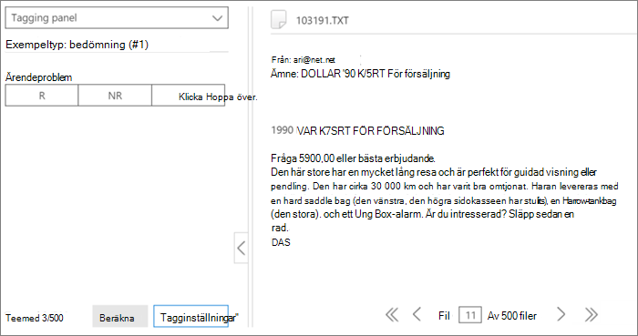
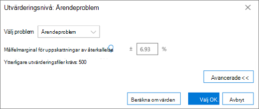
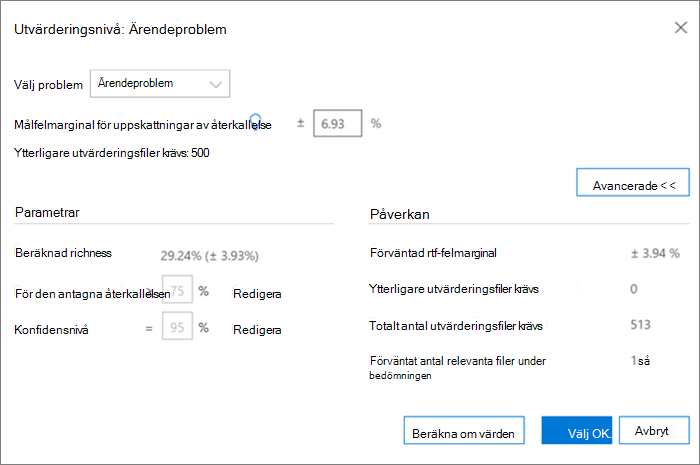

# Tagga och bedöma i modulen Relevans i Advanced eDiscovery
  
I det här avsnittet beskrivs proceduren för Bedömning i modulen Relevans i Advanced eDiscovery.
  
## Utföra utvärderingsutbildning och -analys

1. Klicka på **Utvärdering \> på fliken** Relevansspår **för att** starta fallutvärderingen.

    Till exempel i den här proceduren skapas ett exempel på en  utvärderingsuppsättning med 500 filer och fliken Tagg visas, som innehåller panelen Taggning, visat filinnehåll och andra taggningsalternativ. 

    
  
2. Granska varje fil i exemplet, fastställ filens relevans för varje ärendeproblem och tagga filen med hjälp av knapparna Relevans (R), Inte relevant (NR) och Hoppa över i fönstret **Taggning.** 

    > [!NOTE]
    >  För bedömningen krävs 500 taggade filer. Om filerna "hoppas över" får du fler filer att tagga. 
  
3. När du har taggt alla filer i exemplet klickar du på **Beräkna**.

    Den aktuella felmarginalen och relevansen för  Utvärdering beräknas och visas på fliken Relevansspår med utökad information per problem, enligt nedan. Mer information om den här dialogrutan finns i avsnittet [Granska utvärderingsresultat.](#reviewing-assessment-results)

    
  
    > [!TIP]
    > Som standard rekommenderar vi att du går vidare till standardsteget Nästa när indikatorn Utvärderingsstatus för problemet har slutförts, vilket indikerar att utvärderingsprovet har granskats och att tillräckliga relevanta filer har taggats. > Om du vill visa resultaten  för fliken Spåra och kontrollera felmarginalen och  nästa steg klickar du annars på Ändra intill Nästa steg **,** väljer Fortsätt utvärdering och klickar sedan på **OK.**
  
4. Klicka **på** Ändra till höger om kryssrutan **Utvärdering** för att visa och ange bedömningsparametrar per problem. En **dialogruta** på utvärderingsnivå för varje problem visas, som i följande exempel: 

    
  
    Följande parametrar för problemet beräknas och visas i **dialogrutan Utvärderingsnivå:** 

    **Målfelmarginal för uppskattningar av återkallelse**: Baserat på det här värdet beräknas det uppskattade antalet ytterligare filer som ska granskas. Den marginal som används för återkallelsen är större än 75 % och med en konfidensnivå på 95 %.

    **Ytterligare utvärderingsfiler** krävs: Anger hur många fler filer som behövs om den aktuella felmarginalens krav inte har uppfyllts. 

5. Justera den aktuella felmarginalen och se effekten av olika felmarginaler (per problem):

6. Välj **ett problem** i listan Välj problem. 

7. Ange **ett nytt värde i Målfelmarginal för** uppskattningar av återkallelse.

8. Klicka **på Uppdatera** värden om du vill se hur justeringarna kommer att påverkas. 

9. Klicka **på** Avancerat **i dialogrutan Bedömningsnivå** för att se följande ytterligare parametrar och information: 

    
  
    - **Beräknad richness**: Beräknad richness enligt de aktuella utvärderingsresultaten

    - **För den antagna** återkallelsen: Som standard gäller målfelmarginalen för återkallelsen över 75 %. Klicka **på** Redigera om du vill ändra den här parametern och kontrollera felmarginalen för ett annat intervall med återkallelsevärden. 

    - **Konfidensnivå:** Som standard är den rekommenderade felmarginalen för konfidens 95 %. Klicka **på** Redigera om du vill ändra den här parametern.

    - **Förväntad richness-felmarginal**: Det här är den förväntade felmarginalen när alla ytterligare utvärderingsfiler har granskats, givet de uppdaterade värdena.

    - **Ytterligare utvärderingsfiler** krävs: Med de uppdaterade värdena måste antalet ytterligare utvärderingsfiler granskas för att nå målet.

    - **Totalt antal utvärderingsfiler** krävs: Givet de uppdaterade värdena, totalt antal utvärderingsfiler som krävs för granskning.

    - **Förväntat antal relevanta filer under** bedömningen: Givet de uppdaterade värdena, visas det förväntade antalet relevanta filer i hela utvärderingen när alla ytterligare utvärderingsfiler har granskats.

10. Klicka **på Beräkna om värden** om parametrar ändras. När du är klar och det finns ett problem klickar  du på **OK** för att spara ändringarna (eller Nästa när det finns flera problem att granska eller ändra och sedan **Slutför**). 

    När det finns flera problem, och alla problem har granskats eller justerats, visas en dialogruta för **Bedömningsnivå:** sammanfattning, enligt följande exempel. 

    
  
    När utvärderingen är klar går du vidare till nästa steg i Relevansutbildning.

## Granska utvärderingsresultat

När ett utvärderingsexempel har taggats beräknas utvärderingsresultatet och visas på fliken Relevansspår.
  
Följande resultat visas i den utökade visningen av Spåra:
  
- Utvärdering av aktuella felmarginaler för uppskattningar av återkallelse

- Beräknad richness

- Ytterligare utvärderingsfiler krävs (för granskning)

Den aktuella utvärderingsfelmarginalen är den felmarginal som rekommenderas av Advanced eDiscovery. Talet som visas för de ytterligare utvärderingsfiler som krävs motsvarar den rekommendationen.
  
Utvärderingsförloppet visar nivån för utvärderingens slutförande med hänsyn till den aktuella felmarginalen. När utvärderingen pågår kommer användaren att tagga ett annat utvärderingsexempel.
  
När indikatorn för bedömningsförloppet visar utvärderingen som slutförd, innebär det att utvärderingsprovet har slutförts och att tillräckligt många relevanta filer har taggats. 
  
I den utökade visningen Spåra visas det rekommenderade nästa steget, utvärderingsstatistik och åtkomst till detaljerade resultat.
  
När du är mycket låg är antalet ytterligare utvärderingsfiler som behövs för att nå ett minimalt antal relevanta filer för att få fram användbar statistik mycket hög. Advanced eDiscovery du gå vidare till utbildningen. Utvärderingsförloppet kommer att skuggas och ingen statistik är tillgänglig.
  
Om ingen statistiskt baserad stabilitet används ger det resultat med lägre precision och konfidensnivå. Resultaten kan dock användas för att hitta relevanta filer när du inte behöver veta hur många procent av relevanta filer som hittats. På samma sätt kan den här statusen användas för att utbilda problem med låg relevans, där relevansresultat kan påskynda åtkomsten till filer som är relevanta för ett visst problem.
  
> [!TIP]
> På fliken **\> Relevansspår,** visa utökat problem, är följande visningsalternativ tillgängliga: 
> 
> Det rekommenderade nästa steget, till exempel Nästa **steg:** Du kan hoppa  över taggningen (per problem) genom att klicka på knappen Ändra till höger och sedan välja ett annat steg i **nästa steg.** När utvärderingens förloppsindikator inte har slutförts kommer en utvärdering att vara nästa rekommenderade alternativ, att tagga fler utvärderingsfiler och öka statistikprecisionen. 
> 
> Du kan ändra felmarginalen och bedöma dess påverkan genom att klicka på Ändra och i dialogrutan Utvärderingsnivå **,** ändra målfelmarginalen för uppskattningar av återkallelse **och** klicka på **Uppdatera värden.** I den här dialogrutan kan du också visa avancerade alternativ genom att klicka på **Avancerat.** 
> 
> Du kan visa ytterligare statistik för bedömningsnivån och deras påverkan genom att klicka på **Visa**. I dialogrutan Med informationsresultat är statistik tillgänglig per problem, när det finns minst 500 taggade utvärderingsfiler och minst 18 filer är märkta som relevanta för problemet. 
