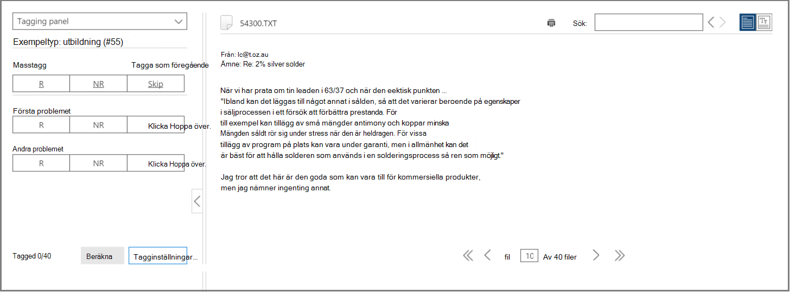
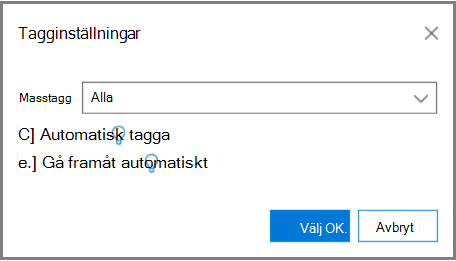
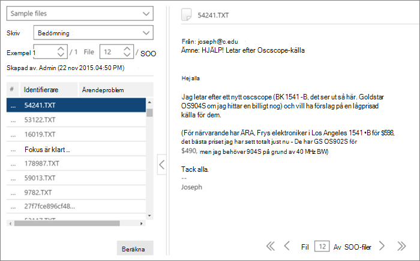

# Tagga och relevansutbildning i Advanced eDiscovery
  
I den här artikeln beskrivs proceduren för att arbeta med modulen Relevansutbildning i Advanced eDiscovery.
  
När utvärderingen har slutförts i Advanced eDiscovery, och du anger relevansutbildningssteget, infogas ett utbildningsexempel med 40 filer på fliken Tagg för märkning.
  
## Utföra relevansutbildning

1. På fliken **\> Relevanstagg** visas fönstret Märkning som standard i den vänstra rutan och exempelfilerna visas, en i taget för taggning.

    
  
    På **fliken** Tagg visas filens visningsnamn. Det kan vara sökvägen, e-postmeddelandets ämne, titel eller användardefinierade namn. ID, filsökväg eller textsökväg kan kopieras genom att högerklicka på filens sökväg.

    Statistik  för taggning av flikmarkeringar visar exempelnumret för filen (längst upp i den vänstra rutan), numret på den fil som visas för närvarande av det totala antalet filer i exemplet (längst ned till höger) och det aktuella totala antalet taggade filer i exemplet (längst ned i den vänstra rutan), som ändras när du taggar filer. Det här gäller för alla relevanstaggar som utförts, oavsett om det gäller utvärdering, utbildning, uppföljning eller test.

    Ikoner som visar att det finns kommentarer, taggar och familjefiler visas i filvyn i ett fält ovanför filen.

2. Fastställ filens relevans för ärendet och tagga filen med hjälp av ikonknapparna eller tangentbordsgenvägarna för taggningsalternativ, enligt följande tabell:

   |**Taggningsalternativ**|**Beskrivning**|**Tangentbordsgenväg**|**Masstaggar på tangentbordsgenväg (vid flera problem)**|
   |-----|-----|-----|-----|
   |R    |Relevant    |Z    |`Shift + Z`    |
   |NR    |Inte relevant    |X    |`Shift + X`    |
   |Hoppa över    |Hoppa över    |C    |`Shift + A`    |
   |||||

   - När det finns flera problem för en fil och du har taggt ett problem går markeringen vidare till nästa problem (om det finns några).  

   - Nyckelord som definierats av administratören eller Ärendehanteraren när nyckelord (relevansinställning markerade nyckelord) markeras visas (i angivna färger) för att hjälpa dig att identifiera relevanta filer medan \> du taggar. Om ett nyckelord har en dubbel understrykning kan du klicka på det för att visa ett verktygstips med nyckelordets beskrivning.

     Du kan också ange **följande alternativ** genom att klicka **på Tagginställningar** på fliken Flagga:

      
  
   - **Masstagg:** Använd det här alternativet om du  vill tilldela flera problem för en fil genom att välja Alla  och ange taggen för den valda filen för alla ärenden (åsidosätter redan taggade ärenden) eller genom att välja Resten för att tillämpa taggen på de återstående otaggade ärendena. Det valda alternativet gäller i alla användarens fall tills det ändras av den användaren (inställningen gäller för alla användarens ärenden).

   - **Automatisk tagg:** Markera den här kryssrutan om du vill ange andra problem för en fil som Inte relevant efter en enda relevant taggning.

   - **Automatisk vidareflyttning:** Markera den här kryssrutan om du vill flytta filmarkeringen till nästa fil vid taggning av det sista problemet eller bara ett problem som inte har spridts.

    Filer som hoppas över tas inte med i relevansutbildningen och relevansbedömningssyften.

3. Fritextkommentarer, som är associerade med en fil, kan visas och redigeras via alternativet Kommentar i den vänstra listrutan.  (valfritt)

4. Du kan visa riktlinjer för taggning genom att välja **alternativet Tagga riktlinjer** i listrutan till vänster.

5. När du är klar med taggningen av alla filer i listan och är redo att beräkna resultaten klickar du på **Beräkna.** Fliken **Spåra** visas.  

## Arbeta med listan med exempelfiler

I listan med exempelfiler kan du visa en lista över filerna i ett utbildningsexempel och utföra olika åtgärder på en eller flera filer. I fliken **Relevanstagg,** i det vänstra fönstret Exempelfiler, visas en lista över exempelfiler för bearbetning med processer för bedömning, utbildning, upp- och \>   inkonsekvenser.
  
1. På fliken **\> Relevanstagg** väljer du listrutan Exempelfiler i den vänstra rutan. Exempelfilerna visas i den vänstra rutan.

    
  
2. Välj ett specifikt exempel eller filnummer genom att ange eller välja dess nummer i **rutorna** Exempel **eller** Fil.

   - Ett filsekvensnummer visas i den vänstra kolumnen i listan över filer som visas på **fliken** Taggar. Genom att klicka på sidhuvudet återgår den ursprungliga visade ordningen för filerna till sin ursprungliga ordning.

   - När du klickar på en filrad visas dess innehåll i det högra fönstret.

   - Navigera mellan filer i det aktuella exemplet med hjälp av alternativen på den nedre menyraden. Dessutom finns navigeringstangentbordsgenvägar tillgängliga:
  
     - Så här går du till den första filen i exemplet: `Shift + Ctrl + <`

     - Så här går du till föregående fil i exemplet: `Shift + <`

     - Så här går du till nästa fil i exemplet: `Shift + >`

     - Så här går du till den sista filen i exemplet: `Shift + Ctrl + >`
