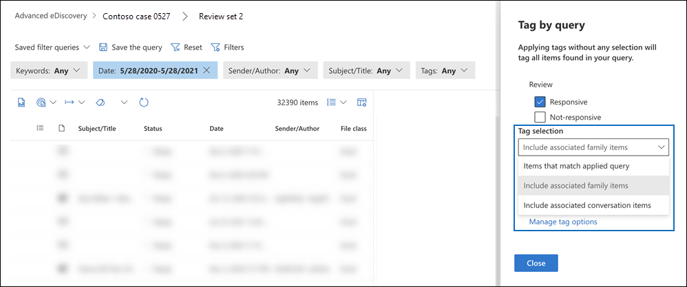

# Tagga dokument i en granskningsuppsättning i Advanced eDiscovery

Det är viktigt att ordna innehåll i en granskningsuppsättning för att slutföra olika arbetsflöden i eDiscovery-processen. Detta omfattar följande:

- Ta bort onödigt innehåll

- Identifiera relevant innehåll

- Identifiera innehåll som måste granskas av en expert eller jurist

När experter, jurister eller andra användare granskar innehåll i en granskningsuppsättning kan deras åsikter om innehållet fångas upp med hjälp av taggar. Om syftet till exempel är att undvika onödigt innehåll kan en användare tagga dokument med en tagg, till exempel "svarar inte". När innehåll har granskats och taggats kan du skapa en sökning med en granskningsuppsättning för att utesluta innehåll som är taggat som "icke-responsivt". Med den här processen elimineras det icke-responsiva innehållet från nästa steg i eDiscovery-arbetsflödet. Taggpanelen i en granskningsuppsättning kan anpassas för varje ärende så att taggarna stöder det avsedda granskningsarbetsflödet för ärendet.

> [!NOTE]
> Omfattningen av taggar är ett Advanced eDiscovery ärende. Det innebär att ett ärende bara kan ha en uppsättning taggar som granskare kan använda för att tagga dokument med uppsättningsdokument. Du kan inte konfigurera en annan uppsättning taggar för användning i olika granskningsuppsättningar i samma fall.

## Taggtyper

Advanced eDiscovery innehåller två typer av taggar:

- **Enkelvalstaggar:** Begränsar granskare att välja en enskild tagg i en grupp. Den här typen av taggar kan vara bra att se till att granskare inte väljer taggar i konflikt, till exempel "responsiv" och "svarar inte". Taggar för enstaka val visas som alternativknappar.

- **Flervalstaggar:** Tillåta granskningar att markera flera taggar i en grupp. Den här typen av taggar visas som kryssrutor.

## Taggstruktur

Förutom taggtyperna kan strukturen för hur taggar ordnas i taggpanelen användas för att göra taggningen av dokument mer intuitiv. Taggar är grupperade efter avsnitt. Med sökfunktionen för granskning kan du söka efter tagg och taggavsnitt. Det innebär att du kan skapa en granskningsuppsättningssökning för att hämta dokument som är märkta med valfri tagg i ett avsnitt.

Du kan ordna taggarna ytterligare genom att kapsla in dem i ett avsnitt. Om syftet till exempel är att identifiera och tagga behörighetsinnehåll kan kapsling användas för att göra det tydligt att granskare kan tagga ett dokument som "privilegierat" och välja typ av behörighet genom att markera rätt kapslad tagg.

## Skapa taggar

Innan du kan använda taggar i dokument i granskningsuppsättningen måste du skapa en taggstruktur.

1. Öppna en granskningsuppsättning, gå till kommandofältet och välj **Tagga efter fråga.**

2. Välj Hantera taggalternativ i **taggpanelen**

3. Välj **Lägg till taggavsnitt**.

4. Skriv en rubrik för tagggruppen och en valfri beskrivning och klicka sedan på **Spara**.

5. Markera den nedrullningsbara menyn med en tre punkt bredvid tagggruppens rubrik och klicka på **Lägg till kryssruta** eller **knappen Lägg till alternativ.**

6. Skriv ett namn och en beskrivning för kryssrutan eller alternativknappen.

7. Upprepa proceduren för att skapa nya taggavsnitt, taggalternativ och kryssrutor.

   

## Använda taggar

När taggstrukturen är på plats kan granskare använda taggar i dokument i en granskningsuppsättning. Det finns två olika sätt att använda taggar:

- Tagga filer

- Tagga efter fråga

### Tagga filer

Oavsett om du markerar ett enstaka objekt eller flera objekt i en granskningsuppsättning kan du tillämpa taggar på deras markering genom att klicka **på Tagga** filer i kommandofältet. I taggpanelen kan du välja en tagg och den tillämpas automatiskt på de markerade dokumenten.

> [!NOTE]
> Taggar kommer endast att tillämpas på markerade objekt i listan med objekt.

### Tagga efter fråga

Genom att tagga efter fråga kan du använda taggar för alla objekt som visas av en filterfråga som för närvarande används i granskningsuppsättningen.

1. Avmarkera alla objekt i granskningsuppsättningen, gå till kommandofältet och välj **Tagga efter fråga.**

2. Markera den tagg du vill använda i taggpanelen.

3. Under **listrutan Taggmarkering** finns det tre alternativ som avgör vilka objekt taggen ska användas för.

   - **Objekt som matchar tillämpad** fråga: Tillämpar taggar på specifika objekt som matchar filterfrågans villkor.

   - **Inkludera associerade familjeobjekt:** Tillämpar taggar på specifika objekt som matchar filterfrågans villkor och tillhörande familjeobjekt. *Familjeobjekt* är objekt som delar samma FamilyId-metadatavärde.  

   - **Ta med associerade konversationsobjekt:** Tillämpar taggar på objekt som matchar filterfrågans villkor och tillhörande konversationsobjekt. *Konversationsobjekt* är objekt som delar samma metadatavärden för ConversationId.

   

4. Klicka **på Starta taggningsjobbet** för att utlösa taggningsjobbet.

## Taggfilter

Använd taggfiltret i granskningsuppsättningen för att snabbt hitta eller exkludera objekt från frågeresultatet baserat på hur ett objekt är taggat. 

1. Välj **Filter** för att expandera filterpanelen.

2. Markera och expandera **Objektegenskaper**.

3. Rulla nedåt för att hitta filtret **med namnet Tagg**, markera kryssrutan och klicka sedan på **Klar**.

4. Om du vill inkludera eller exkludera objekt med en viss tagg från en fråga gör du något av följande:

   - **Inkludera objekt:** Välj taggvärdet och välj **Lika med något av** i den nedrullningsbara menyn.

      Eller

   - **Uteslut objekt:** Välj taggvärdet och välj **Är lika med inget av i** listrinsmenyn.

     

> [!NOTE]
> Uppdatera sidan så att taggfiltret visar de senaste ändringarna i taggstrukturen.
