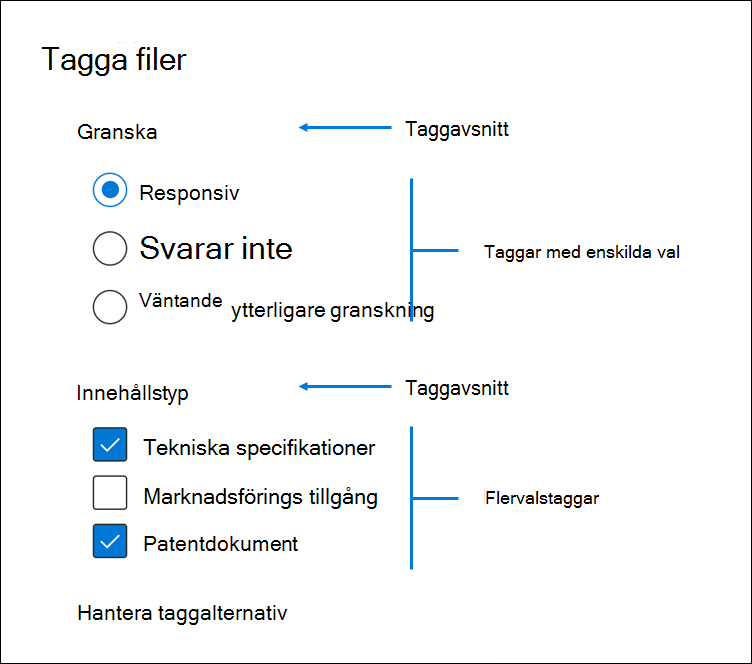

# Tagga dokument i en granskningsuppsättning i Advanced eDiscoveryTag documents in a review set in Advanced eDiscovery

Det är viktigt att ordna innehåll i en granskningsuppsättning för att slutföra olika arbetsflöden i eDiscovery-processen.Organizing content in a review set is important to complete various workflows in the eDiscovery process. Det omfattar:This includes:

- Ta bort onödigt innehållCulling unnecessary content

- Identifiera relevant innehållIdentifying relevant content
 
- Identifiera innehåll som måste granskas av en expert eller en juristIdentifying content that must be reviewed by an expert or an attorney

När experter, jurister eller andra användare granskar innehåll i en granskningsuppsättning kan deras åsikter om innehållet fångas upp med hjälp av taggar.When experts, attorneys, or other users review content in a review set, their opinions related to the content can be captured by using tags. Om syftet till exempel är att undvika onödigt innehåll kan en användare tagga dokument med en tagg, till exempel "svarar inte".For example, if the intent is to cull unnecessary content, a user can tag documents with a tag such as "non-responsive". När innehåll har granskats och taggats kan du skapa en granskningsuppsättningssökning för att utesluta innehåll som är taggat som "icke-responsivt", vilket eliminerar det här innehållet från nästa steg i eDiscovery-arbetsflödet.After content has been reviewed and tagged, a review set search can be created to exclude any content tagged as "non-responsive", which eliminates this content from the next steps in the eDiscovery workflow. Märkningspanelen kan anpassas för varje ärende så att taggarna kan stödja det avsedda granskningsarbetsflödet.The tag panel can be customized for every case so that the tags can support the intended review workflow.

## TaggtyperTag types

Advanced eDiscovery innehåller två typer av taggar:Advanced eDiscovery provides two types of tags:

- **Enkelvalstaggar** – Begränsar användare att välja en enskild tagg i en grupp.**Single choice tags** - Restricts users to select a single tag within a group. Det kan vara användbart för att säkerställa att användarna inte väljer taggar i konflikt, till exempel "responsiv" och "svarar inte".This can be useful to ensure users don't select conflicting tags such as "responsive" and "non-responsive". De visas som alternativknappar.These will appear as radio buttons.

- **Flervalstaggar** – tillåt användare att markera flera taggar i en grupp.**Multiple choice tags** - Allow users to select multiple tags within a group. De visas som kryssrutor.These will appear as checkboxes.

## TaggstrukturTag structure

Förutom taggtyperna kan strukturen för hur taggar ordnas i taggpanelen användas för att göra taggningen av dokument mer intuitiv.In addition to the tag types, the structure of how tags are organized in the tag panel can be used to make tagging documents more intuitive. Taggar är grupperade efter avsnitt.Tags are grouped by sections. Med sökfunktionen för granskning kan du söka efter tagg och taggavsnitt.Review set search supports the ability to search by tag and by tag section. Det innebär att du kan skapa en granskningsuppsättningssökning för att hämta dokument som är märkta med valfri tagg i ett avsnitt.This means you can create a review set search to retrieve documents tagged with any tag in a section.

Taggar kan ordnas ytterligare genom att kapsla in dem i ett avsnitt.Tags can be further organized by nesting them within a section. Om avsikten till exempel är att identifiera och tagga behörighetsinnehåll kan kapsling användas för att göra det tydligt att en användare kan tagga ett dokument som "behörig" och välja typ av behörighet genom att markera rätt kapslad tagg.For example, if the intent is to identify and tag privileged content, nesting can be used to make it clear that a user can tag a document as "Privileged" and select the type of privilege by checking the appropriate nested tag.

## Använda taggarApplying tags

Det finns flera sätt att använda en tagg på innehåll.There are several ways to apply a tag to content.

### Tagga ett enskilt dokumentTagging a single document

När du visar ett dokument i en granskningsuppsättning kan du visa de taggar som en granskning kan använda genom att klicka **på Taggningspanel**.When viewing a document in a review set, you can display the tags that a review can use by clicking **Tagging panel**.

Då kan du använda taggar i dokumentet som visas i visningsprogrammet.This will enable you to apply tags to the document displayed in the viewer.

### MasstaggarBulk tagging

Du kan masstagga genom att markera flera filer i resultatrutnätet och sedan använda taggarna i panelen Taggning som liknar taggning av enstaka dokument. Bulk tagging can be done by selecting multiple files in the results grid and then using the tags in the **Tagging panel** similar to tagging single documents. Massmarkering kan göras genom att markera taggar två gånger. Det första klicket använder taggen och det andra valet säkerställer att taggen är avmarkerad för alla valda filer.Bulk un-tagging can be done by selecting tags twice; the first click will apply the tag, and the second selection will ensure that tag is cleared for all selected files.

> [!NOTE]
> Vid masstaggar visar märkningspanelen antalet filer som är märkta för varje tagg i panelen.When bulk tagging, the tagging panel will display a count of files that are tagged for each tag in the panel.

### Tagga i andra granskningspanelerTagging in other review panels

När du granskar dokument kan du använda de andra granskningspanelerna för att granska andra egenskaper för dokument i resultatrutnätet.When reviewing documents, you can use the other review panels to review other characteristics of documents in the results grid. Det omfattar granskning av andra relaterade dokument, e-posttrådar, nära dubbletter och hash-dubbletter.This includes reviewing other related documents, email threads, near duplicates, and hash duplicates. När du till exempel granskar relaterade dokument  (med hjälp av panelen Dokumentfamiljgranskning) kan du minska granskningstiden avsevärt genom att masstagga relaterade dokument.For example, when you're reviewing related documents (by using the **Document family** review panel), you can significantly reduce review time by bulk tagging related documents. Till exempel om ett e-postmeddelande har flera bifogade filer och du vill vara säker på att hela familjen är taggad konsekvent.For example, if an email message has several attachments and you want to ensure that the entire family is tagged consistently.

Så här visar du till exempel panelen **Taggning när du** använder panelen **Dokumentfamiljgranskning:**For example, here's how to display the **Tagging panel** when using the **Document family** review panel:

1. Med granskningspanelen öppen för ett markerat dokument (om listan med  relaterat innehåll visas i granskningspanelen för dokumentfamilj klickar du till exempel på **Tagga** dokument under granskningspanelen för dokumentfamilj.With the review panel open for a selected document (for example, displaying the list of related content in the **Document family** review panel, click **Tag documents** under the document family review panel.

   Taggpanelen visas som ett popup-fönster.The tagging panel is displayed as a pop-up window.

2. Välj en eller flera taggar för att använda det valda dokumentet.Choose one or more tags to apply the selected document. 

3. Om du vill tagga alla  dokument markerar du alla dokument i dokumentfamiljpanelen, klickar på Tagga dokument och väljer sedan de taggar som ska gälla för hela dokumentfamiljen.To tag all documents, select all documents in the **Document family** panel, click **Tag documents**, and then choose the tags to apply to the entire family of documents.

