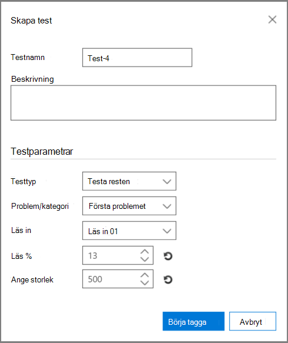
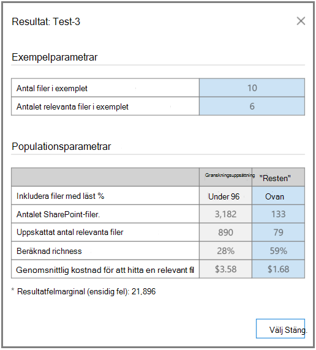

# Analys av testrelevans i Advanced eDiscovery
  
På fliken Test i Advanced eDiscovery du testa, jämföra och verifiera den övergripande bearbetningskvaliteten. Dessa tester utförs efter batchberäkning. Genom att tagga filerna i samlingen får en expert ett slutligt beslut om varje taggad fil är relevant för ärendet.
  
I scenarier med en eller flera problem utförs tester vanligtvis per problem. Resultaten kan visas efter varje test och testresultaten kan omarbetas med angivna exempeltestfiler.
  
## Testar resten

Testet "Testa resten" används för att verifiera beslut om validering, till exempel för att bara granska filer ovanför en viss poäng för relevansrensning baserat på det slutliga Advanced eDiscovery resultaten. Experten granskar ett urval filer under en vald poäng för att utvärdera antalet relevanta filer i uppsättningen.
  
Det här testet ger statistik och en jämförelse mellan uppsättningen Granska och testa restpopulationen. Resultatet av granskningsuppsättningen är de som beräknas efter Relevans under utbildning. Resultatet omfattar beräkningar baserade på inställningar och indataparametrar, till exempel:
  
- Testa exempelstatistik för antalet filer i ett urval och identifierade relevanta filer.

- Tabular comparison of the Population parameters of the Review set and the Rest, for example, the number of files, estimated number of relevant files, estimated richness, and the average cost of finding another relevant file. Inställningar för kostnadsparameter kan anges av administratören.

Så här kör du testet "Testa resten":

1. Öppna fliken **\> Relevanstest.**

2. Klicka på **Nytt** test på **fliken Test.** Dialogrutan **Skapa** test visas enligt följande exempel.

    
  
3. Skriv **namn och** beskrivning **i** Testnamn och Beskrivning.

4. I listan **Testtyp** väljer du **Testa resten**

5. Välj **namnet på problemet** i listan Problem/kategori.

6. I listan **Läs in** väljer du inläsningen. 

7. I **Läs %** godkänner du standardvärdet eller väljer ett värde för poäng för relevans för bryt skärning. 

8. I **Ange storlek** eller godkänn standardvärdet. Återställningsikonerna återställer standardvärdena.

9. Klicka **på Börja tagga**. Ett testexempel genereras.

10. Granska och tagga varje fil på fliken **Relevanstagg \>** och klicka på Beräkna när du är **klar.**

11. På fliken Test kan du klicka på **Visa resultat för** att visa testresultaten. Ett exempel visas i följande skärmbild.

    
  
I den föregående  skärmbilden innehåller avsnittet Exempelparametrar i tabellen information om antalet filer i exemplet som taggats av experten och antalet relevanta filer som hittades i exemplet.
  
Avsnittet **Population-parametrar** i tabellen innehåller testresultaten, inklusive en population av filer i granskningsuppsättningen med ett resultat under den valda filpopulationen och "Resten" i populationen med ett resultat över den valda filuppsättningen. För varje population visas följande resultat:
  
- Inkluderar filer med läst % – nämnt klipp

- Det totala antalet filer

- Det uppskattade antalet relevanta filer

- Uppskattad richness

- Den genomsnittliga granskningskostnaden för att hitta en annan relevant fil

## Testa utsnittet

Testet "Testa utsnittet" utför tester som liknar "Testa resten"-testet, men på ett segment av filuppsättningen som anges av Relevans läs %.

Så här kör du testet "Testa utsnittet":
  
1. Öppna fliken **\> Relevanstest.**

2. Klicka på **Nytt** test på **fliken Test.** Dialogrutan **Skapa** test visas.

3. I **Testnamn** **och Beskrivning** skriver du in informationen.

4. Välj **Testa utsnittet** **i listan Testtyp.**

5. Välj **namnet på** problemet i listan Problem.

6. I listan **Läs in** väljer du inläsningen.

7. Acceptera **de lägsta och högsta** värdena i Läs % mellan eller välj värden för resultat av brytvärde för relevans för brytvärde.

8. I **Ange storlek** väljer du ett värde eller godkänner standardvärdet.

    Återställningsikonerna återställer standardvärdet.

9. Klicka **på Börja tagga**. Ett testexempel genereras.

10. Granska och tagga varje fil på fliken **Relevanstagg \>** och klicka på Beräkna när du är **klar.**

11. På fliken Test kan du klicka på **Visa resultat för** att visa testresultaten.
