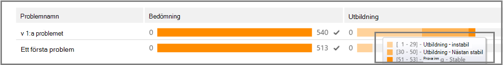
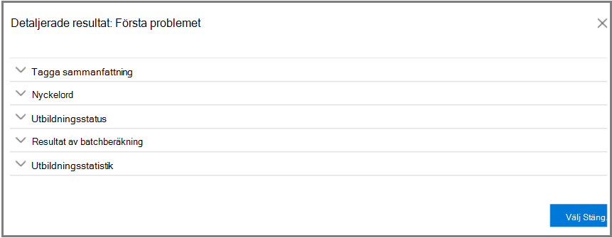
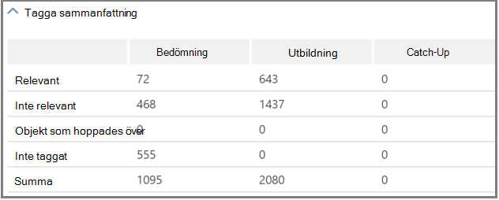
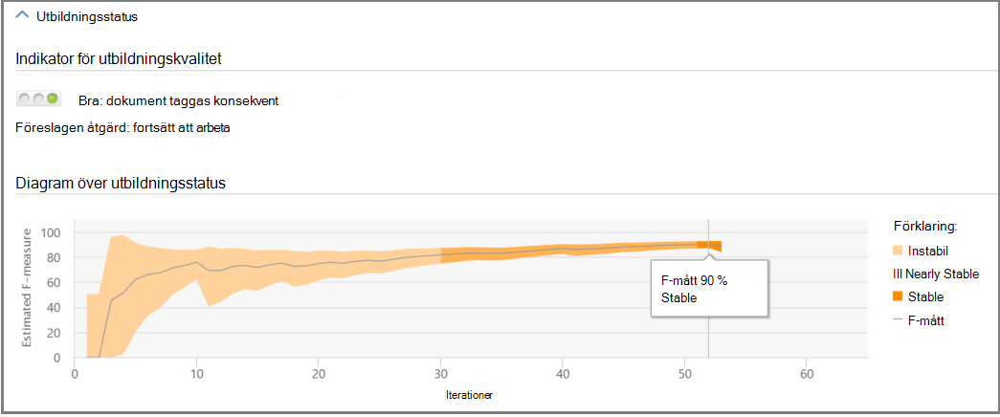
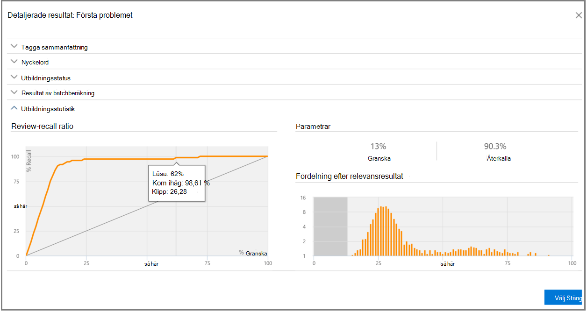

# Spåra relevansanalys i Advanced eDiscoveryTrack Relevance analysis in Advanced eDiscovery
  
I Advanced eDiscovery visas den beräknade giltigheten för relevansutbildningen som utförs på fliken Tagg på fliken Relevansspår på fliken Relevans och visar nästa steg att ta i den iterativa utbildningsprocessen i Relevans.In Advanced eDiscovery, the Relevance Track tab displays the calculated validity of the Relevance training performed in the Tag tab and indicates the next step to take in the iterative training process in Relevance. 
  
## Spåra relevansutbildningsstatusTracking Relevance training status

1. Visa följande information i Relevansspår för problem med ärendet, som du ser i följande exempel på dialogrutan **Problemnamn** nedan.View the following details in Relevance Track for the case issues, as shown in the following example of an **Issue name** dialog below.

   - **Utvärdering**: Den här förloppsindikatorn visar i vilken grad relevansutbildningen som utförts i det här läget har uppnått utvärderingsmålet när det gäller marginaler för fel.**Assessment**: This progress indicator shows to what degree the Relevance training performed to this point has achieved the assessment target in terms of margin of error. Relevansutbildningens relevansresultat visas också.The richness of the Relevance training results is also displayed.

   - **Utbildning:** Den här färgkodade förloppsindikatorn och knapptipset anger stabilitet för relevansutbildningsresultat och en numerisk skala som visar antalet exempel på relevansutbildning taggade för varje problem.**Training**: This color-coded progress indicator and tool-tip indicates the Relevance training results stability and a numeric scale showing the number of Relevance training samples tagged for each issue. Experten övervakar förloppet för iterativ relevans-utbildningsprocessen.The expert monitors the progress of the iterative Relevance training process. 
  
   - **Batchberäkning:** Den här förloppsindikatorn innehåller information om slutförande av batchberäkning.**Batch calculation**: This progress indicator provides information about the completion of Batch calculation.
  
   - **Nästa steg**: Visar rekommendationen för nästa steg som ska utföras.**Next step**: Displays the recommendation for the next step to be performed. 
  
    I exemplet visas en genomförd bedömning för ett problem, som anges med indikatorn för slutfört färgförloppet och bockmarkeringen.In the example, a successfully completed Assessment for an issue is shown, indicated by the completed color progress indicator and the checkmark. Taggningen pågår, men ärendet betraktas fortfarande som instabilt (stabilitetsstatus visas också i ett verktygstips).Tagging is underway, but the case is still considered unstable (stability status also shown in a tool-tip). Rekommendationen i nästa steg är "Utbildning".The next step recommendation is "Training". 
  
    
  
    I den utökade vyn visas ytterligare information och alternativ.The expanded view displays additional information and options. Den aktuella felmarginalen som visas är felmarginalen för återkallelsen under aktuell bedömningstillstånd, givet de befintliga (redan taggade) utvärderingsfilerna.The displayed current error margin is the error margin of the recall in the current state of assessment, given the existing (already tagged) assessment files.
  
    > [!NOTE]
    >  Du kan kringgå utvärderingssteget genom att avmarkera **kryssrutan** Utvärdering per problem och sedan för "alla problem".The Assessment stage can be bypassed by clearing the **Assessment** check box per issue and then for "all issues". Därför finns det ingen statistik för det här problemet.However, as a result, there will be no statistics for this issue. > Du **kan bara** avmarkera kryssrutan Utvärdering innan utvärderingen utförs.> Clearing the **Assessment** check box can only be done before assessment is performed. Om det finns flera ärenden i ett ärende kringgås bedömningen endast om kryssrutan avmarkeras för varje ärendeWhere multiple issues exist in a case, assessment is bypassed only if the check box is cleared for each issue 
  
    När utvärderingen inte är klar med den första exempeluppsättningen med filer kan utvärderingen vara nästa steg för att tagga fler filer.When assessment is not completed with the first sample set of files, assessment might be the next step for tagging more files.
  
    I  \> **Relevansspår** visar indikatorn och verktygstipset det uppskattade antalet ytterligare prover som behövs för att nå stabiliteten.In **Relevance** \> **Track**, the training progress indicator and tool-tip indicate the estimated number of additional samples needed to reach stability. Den här uppskattningen ger riktlinjer för den ytterligare utbildning som krävs.This estimate provides a guideline for the additional training needed.
  
    
  
2. När du är klar med taggningen och behöver fortsätta med utbildningen klickar du på **Utbildning.**When you're done tagging and if you need to continue training, click **Training**. Ett annat exempel på filer genereras från den inlästa filuppsättningen för ytterligare utbildning.Another sample set of files is generated from the loaded file set for additional training. Du kommer sedan tillbaka till fliken Tagga för att tagga och utbilda fler filer.You are then returned to the Tag tab to tag and train more files.

### Nå stabila utbildningsnivåerReaching stable training levels

När utvärderingsfilerna har besehållen en stabil nivå av utbildning är Advanced eDiscovery klar för batchberäkning.After the assessment files have attained a stable level of training, Advanced eDiscovery is ready for Batch calculation.
  
> [!NOTE]
> Efter tre stabila utbildningsexempel är vanligtvis nästa steg "Batchberäkning".Usually, after three stable training samples, the next step is "Batch calculation". Det kan finnas undantag, till exempel när det har gjorts ändringar av taggningen av filer från tidigare exempel eller när startfiler har lagts till.There may be exceptions, for example, when there were changes to the tagging of files from earlier samples or when seed files were added. 
  
### Utföra batchberäkningPerforming Batch calculation

Batchberäkning utförs som nästa steg när utbildningen har slutförts (när en stabil utbildningsstatus visas i förloppsfältet, en bockmarkering och en stabil status i verktygstipset.) Vid batchberäkning används kunskaper som förvärvats under relevansutbildningen för hela filpopulationen, för att bedöma filernas relevans och för att tilldela relevansresultat.Batch calculation is executed as the next step after training is successfully completed (when a stable training status is shown by the progress bar, a checkmark and stable status in the tool-tip.) Batch calculation applies the knowledge acquired during the Relevance training to the entire file population, to assess the files' relevance and to assign Relevance scores.
  
Om det finns mer än ett problem görs batchberäkningen per problem.When there is more than one issue, Batch calculation is done per issue. Vid batchberäkning övervakas förloppet under bearbetningen av alla filer.During Batch calculation, progress is monitored while processing all of the files. 
  
Här är det rekommenderade nästa steg "Ingen", vilket betyder att det inte krävs någon ytterligare iterativ relevansutbildning i det här läget.Here, the recommended next step is "None", which indicates that no additional iterative Relevance training is required at this point. Nästa fas är fliken **Relevans \> Bestäm.**The next phase is the **Relevance \> Decide** tab. 
  
Om du vill importera nya filer efter batchberäkningen kan administratören lägga till de importerade filerna i en ny inläsning.If you want to import new files after Batch calculation, the administrator can add the imported files to a new load.
  
> [!NOTE]
> Om du klickar **på** Avbryt under batchberäkningen sparar processen det som redan utfördes.If you click **Cancel** during Batch calculation, the process saves what was already executed. Om du kör Batchberäkning igen fortsätter processen från den senaste körningspunkten.If you run Batch calculation again, the process will continue from the last executed point. 
  
### Utvärdera taggningskonsekvensAssessing tagging consistency

Om det finns inkonsekvenser i filtaggarna kan det påverka analysen.If there are inconsistencies in file tagging, it can affect the analysis. Du Advanced eDiscovery att tagga konsekvensprocessen när resultaten inte är optimala eller om konsekvensen är osäker.The Advanced eDiscovery tagging consistency process can be used when results are not optimal or consistency is in doubt. En lista med möjliga inkonsekventa taggade filer returneras och de kan granskas och omtaggas vid behov.A list of possible inconsistently tagged files is returned, and they can be reviewed and retagged, as necessary.
  
> [!NOTE]
> Efter sju eller fler utbildningsrundar efter bedömningen  kan konsekvent märkning visas i Relevans spåra problem \>  \>  \> **Detaljerade resultat** \> **Utbildning:**After seven or more training rounds following assessment, tagging consistency can be viewed in **Relevance** \> **Track** \> **Issue** \> **Detailed results** \> **Training progress**. Den här granskningen är klar för ett problem i taget.This review is done for one issue at a time.
  
1. Utöka **raden \> för** ett problem i Relevansspår.In **Relevance \> Track**, expand an issue's row.
  
2. Klicka på Ändra **till höger om** Nästa **steg.**To the right of **Next step**, click **Modify**.
  
3. Välj **Tagga inkonsekvenser som** alternativet **Nästa steg,** efter sju utbildningsexempel och klicka på **OK.**Select **Tag inconsistencies** as the **Next step** option, after seven training samples and click **OK**.
  
4. Välj **Tagga inkonsekvenser**.Select **Tag inconsistencies**. Fliken **Flagga** öppnas och visar en lista över inkonsekvenser av att tagga om vid behov.The **Tag** tab opens displaying a list of the inconsistencies to retag as necessary.
  
5. Skicka **ändringarna** genom att klicka på Beräkna.Click **Calculate** to submit the changes. Nästa steg efter taggningen av inkonsekvenser är "Utbildning".The next step after tagging inconsistencies is "Training". 
  
## Visa och använda relevansresultatViewing and using Relevance results

På fliken **\> Relevansspår** expanderar du raden för ett problem och klickar på **Visa** bredvid Detaljerade **resultat.**In the **Relevance \> Track** tab, expand an issue's row, and next to **Detailed results**, click **View**. Detaljerade resultatfönster visas enligt beskrivningen nedan.The Detailed results panes are displayed, as shown and described below.
  

  
### Tagga sammanfattningTagging summary

 I exemplet nedan visar **taggningssammanfattningen** summor för varje process för bedömning, utbildning och uppföljningsfiltaggar.In the example shown below, the **Tagging summary** displays totals for each of Assessment, Training, and Catch-up file tagging processes.
  

  
### NyckelordKeywords

Ett nyckelord är en unik sträng, ett ord, en fras eller en sekvens av ord i en fil som identifieras av Advanced eDiscovery som en viktig indikator på om en fil är relevant.A keyword is a unique string, word, phrase, or sequence of words in a file identified by Advanced eDiscovery as a significant indicator of whether a file is relevant. Nyckelordet och vikterna för "Inkludera" i kolumner är märkta som relevanta och i kolumnerna "Uteslut" anges nyckelord och vikter i filer som är märkta som Inte relevanta.The "Include" columns list keyword and weights in files tagged as Relevant, and the "Exclude" columns lists keywords and weights in files tagged as Not relevant.
  
Advanced eDiscovery tilldelar negativa eller positiva viktvärden.Advanced eDiscovery assigns negative or positive keyword weight values. Ju högre vikt, desto högre sannolikhet är det att en fil där nyckelordet visas tilldelas ett högre relevansresultat vid batchberäkning.The higher the weight, the higher the likelihood that a file in which the keyword appears is assigned a higher Relevance score during Batch calculation.
  
Listan Advanced eDiscovery nyckelord kan användas för att komplettera en lista som skapats av en expert eller som en indirekt sanitetskontroll när som helst i filgranskningsprocessen.The Advanced eDiscovery list of keywords can be used to supplement a list built by an expert or as an indirect sanity check at any point in the file review process.
  
### UtbildningsstatusTraining progress

Fönstret **Utbildningsstatus** innehåller ett diagram för utbildningsstatus och en kvalitetsindikator, som visas i exemplet nedan.The **Training Progress** pane includes a training progress graph and quality indicator display, as shown in the example below.
  

  
**Indikator för utbildningskvalitet**: Visar klassificeringen av taggningskonsekvensen enligt följande:**Training quality indicator**: Displays the rating of the tagging consistency as follows:
  
- **Bra:** Filer är taggade konsekvent.**Good**: Files are tagged consistently. (Grön lampa visas)(Green light displayed)
  
- **Medel:** Vissa filer kan vara taggade inkonsekventa.**Medium**: Some files may be tagged inconsistently. (Gult ljus visas)(Yellow light displayed)

- **Varning!** Många filer kan vara taggade inkonsekventa.**Warning**: Many files may be tagged inconsistently. (Röd lampa visas)(Red light displayed)

**Diagram över utbildningsförlopp**: Visar graden av stabilitet för relevansutbildning efter många relevansutbildningscykler i jämförelse med värdet för F-mått.**Training progress graph**: Shows the degree of Relevance training stability after many Relevance training cycles in comparison to the F-measure value. När vi flyttar från vänster till höger över diagrammet för smalas konfidensintervallet och används, tillsammans med F-måttet, av Advanced eDiscovery Relevans för att säkerställa stabilitet när relevansutbildningsresultaten är optimerade.As we move from the left to the right across the graph, the confidence interval narrows and is used, along with the F-measure, by Advanced eDiscovery Relevance to determine stability when the Relevance training results are optimized.
  
> [!NOTE]
> Relevans använder F2, ett F-måttmått där Återkallelse får dubbelt så stor vikt som precision.Relevance uses F2, an F-measure metric where Recall receives twice as much weight as Precision. I fall med hög relevans (över 25 %) använder relevansen F1 (förhållandet 1:1).For cases with high richness (over 25%), Relevance uses F1 (1:1 ratio). F-måttförhållandet kan konfigureras i **Relevansinställning** \> **Avancerade inställningar.**The F-measure ratio can be configured in **Relevance setup** \> **Advanced settings**.
  
### Resultat av batchberäkningBatch calculation results

I **fönstret Batchberäkningsresultat** visas antalet filer som har poängts för relevans enligt följande:The **Batch calculation results** pane includes the number of files that were scored for Relevance, as follows: 
  
- **Lyckades****Success**
  
- **Tom:** Innehåller ingen text, till exempel endast blanksteg/tabbar**Empty**: Contains no text, for example, only spaces/tabs
  
- **Misslyckades:** På grund av för stor storlek eller kunde inte läsas**Failed**: Due to excessive size or could not be read
  
- **Ignoreras:** På grund av för stor storlek**Ignored**: Due to excessive size
  
- **Nebulous**: Innehåller meningslös text eller inga funktioner som är relevanta för problemet**Nebulous**: Contains meaningless text or no features relevant to the issue
  
> [!NOTE]
> Empty, Failed, Ignored eller Nebulous får relevansresultatet -1.Empty, Failed, Ignored, or Nebulous will receive a Relevance score of -1.
  
### UtbildningsstatistikTraining statistics

I **fönstret Statistik** för utbildning visas statistik och diagram utifrån resultat från Advanced eDiscovery Relevansutbildning.The **Training statistics** pane displays statistics and graphs based on results from Advanced eDiscovery Relevance training. 
  

  
I den här vyn visas följande:This view shows the following:
  
- **Review-recall ratio**: Jämförelse av resultat i enlighet med relevansresultat i en korrekt linjär granskning.**Review-recall ratio**: Comparison of results according to Relevance scores in a hypothetically linear review. Återkallandet beräknas givet den angivna storleken för granskningen.Recall is estimated given the review set size set.
  
- **Parametrar:** Kumulativ beräknad statistik som hör till granskningsuppsättningen i relation till filens population för hela ärendet.**Parameters**: Cumulative calculated statistics pertaining to the review set in relation to the file population for the entire case.
  
- **Granska:** Procentandel av filer som ska granskas baserat på den här brytningen.**Review**: Percentage of files to review based on this cutoff.
  
- **Återkalla:** Procentandel av relevanta filer i granskningsuppsättningen.**Recall**: Percentage of Relevant files in the review set. 
  
- **Fördelning efter relevansresultat:** Filer i den mörkgrå visningen till vänster är under brytresultatet.**Distribution by relevance score**: Files in the dark gray display to the left are below the cutoff score. I en verktygstips visas Relevansresultat och den relaterade procentandelen filer i granskningsfilen som angetts i förhållande till det totala antalet filer.A tool-tip displays the Relevance score and the related percentage of files in the review file set in relation to the total files.
