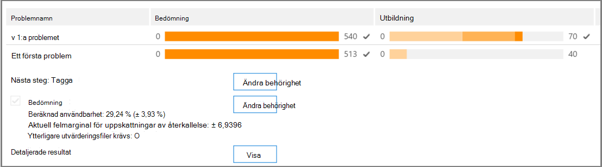

# Spåra relevansanalys i Advanced eDiscovery
  
I Advanced eDiscovery visas den beräknade giltigheten för relevansutbildningen som utförs på fliken Tagg på fliken Relevansspår på fliken Relevans och visar nästa steg att ta i den iterativa utbildningsprocessen i Relevans. 
  
## Spåra relevansutbildningsstatus

1. Visa följande information i Relevansspår för problem med ärendet, som du ser i följande exempel på dialogrutan **Problemnamn** nedan.

   - **Utvärdering**: Den här förloppsindikatorn visar i vilken grad relevansutbildningen som utförts i det här läget har uppnått utvärderingsmålet när det gäller marginaler för fel. Relevansutbildningens relevansresultat visas också.

   - **Utbildning:** Den här färgkodade förloppsindikatorn och knapptipset anger stabilitet för relevansutbildningsresultat och en numerisk skala som visar antalet exempel på relevansutbildning taggade för varje problem. Experten övervakar förloppet för iterativ relevans-utbildningsprocessen. 
  
   - **Batchberäkning:** Den här förloppsindikatorn innehåller information om slutförande av batchberäkning.
  
   - **Nästa steg**: Visar rekommendationen för nästa steg som ska utföras. 
  
    I exemplet visas en genomförd bedömning för ett problem, som anges med indikatorn för slutfört färgförloppet och bockmarkeringen. Taggningen pågår, men ärendet betraktas fortfarande som instabilt (stabilitetsstatus visas också i ett verktygstips). Rekommendationen i nästa steg är "Utbildning". 
  
    
  
    I den utökade vyn visas ytterligare information och alternativ. Den aktuella felmarginalen som visas är felmarginalen för återkallelsen under aktuell bedömningstillstånd, givet de befintliga (redan taggade) utvärderingsfilerna.
  
    > [!NOTE]
    >  Du kan kringgå utvärderingssteget genom att avmarkera **kryssrutan** Utvärdering per problem och sedan för "alla problem". Därför finns det ingen statistik för det här problemet. > Du **kan bara** avmarkera kryssrutan Utvärdering innan utvärderingen utförs. Om det finns flera ärenden i ett ärende kringgås bedömningen endast om kryssrutan avmarkeras för varje ärende 
  
    När utvärderingen inte är klar med den första exempeluppsättningen med filer kan utvärderingen vara nästa steg för att tagga fler filer.
  
    I  \> **Relevansspår** visar indikatorn och verktygstipset det uppskattade antalet ytterligare prover som behövs för att nå stabiliteten. Den här uppskattningen ger riktlinjer för den ytterligare utbildning som krävs.
  
    
  
2. När du är klar med taggningen och behöver fortsätta med utbildningen klickar du på **Utbildning.** Ett annat exempel på filer genereras från den inlästa filuppsättningen för ytterligare utbildning. Du kommer sedan tillbaka till fliken Tagga för att tagga och utbilda fler filer.

### Nå stabila utbildningsnivåer

När utvärderingsfilerna har besehållen en stabil nivå av utbildning är Advanced eDiscovery klar för batchberäkning.
  
> [!NOTE]
> Efter tre stabila utbildningsexempel är vanligtvis nästa steg "Batchberäkning". Det kan finnas undantag, till exempel när det har gjorts ändringar av taggningen av filer från tidigare exempel eller när startfiler har lagts till. 
  
### Utföra batchberäkning

Batchberäkning utförs som nästa steg när utbildningen har slutförts (när en stabil utbildningsstatus visas i förloppsfältet, en bockmarkering och en stabil status i verktygstipset.) Vid batchberäkning används kunskaper som förvärvats under relevansutbildningen för hela filpopulationen, för att bedöma filernas relevans och för att tilldela relevansresultat.
  
Om det finns mer än ett problem görs batchberäkningen per problem. Vid batchberäkning övervakas förloppet under bearbetningen av alla filer. 
  
Här är det rekommenderade nästa steg "Ingen", vilket betyder att det inte krävs någon ytterligare iterativ relevansutbildning i det här läget. Nästa fas är fliken **Relevans \> Bestäm.** 
  
Om du vill importera nya filer efter batchberäkningen kan administratören lägga till de importerade filerna i en ny inläsning.
  
> [!NOTE]
> Om du klickar **på** Avbryt under batchberäkningen sparar processen det som redan utfördes. Om du kör Batchberäkning igen fortsätter processen från den senaste körningspunkten. 
  
### Utvärdera taggningskonsekvens

Om det finns inkonsekvenser i filtaggarna kan det påverka analysen. Du Advanced eDiscovery att tagga konsekvensprocessen när resultaten inte är optimala eller om konsekvensen är osäker. En lista med möjliga inkonsekventa taggade filer returneras och de kan granskas och omtaggas vid behov.
  
> [!NOTE]
> Efter sju eller fler utbildningsrundar efter bedömningen  kan konsekvent märkning visas i Relevans spåra problem \>  \>  \> **Detaljerade resultat** \> **Utbildning:** Den här granskningen är klar för ett problem i taget.
  
1. Utöka **raden \> för** ett problem i Relevansspår.
  
2. Klicka på Ändra **till höger om** Nästa **steg.**
  
3. Välj **Tagga inkonsekvenser som** alternativet **Nästa steg,** efter sju utbildningsexempel och klicka på **OK.**
  
4. Välj **Tagga inkonsekvenser**. Fliken **Flagga** öppnas och visar en lista över inkonsekvenser av att tagga om vid behov.
  
5. Skicka **ändringarna** genom att klicka på Beräkna. Nästa steg efter taggningen av inkonsekvenser är "Utbildning". 
  
## Visa och använda relevansresultat

På fliken **\> Relevansspår** expanderar du raden för ett problem och klickar på **Visa** bredvid Detaljerade **resultat.** Detaljerade resultatfönster visas enligt beskrivningen nedan.
  

  
### Tagga sammanfattning

 I exemplet nedan visar **taggningssammanfattningen** summor för varje process för bedömning, utbildning och uppföljningsfiltaggar.
  

  
### Nyckelord

Ett nyckelord är en unik sträng, ett ord, en fras eller en sekvens av ord i en fil som identifieras av Advanced eDiscovery som en viktig indikator på om en fil är relevant. Nyckelordet och vikterna för "Inkludera" i kolumner är märkta som relevanta och i kolumnerna "Uteslut" anges nyckelord och vikter i filer som är märkta som Inte relevanta.
  
Advanced eDiscovery tilldelar negativa eller positiva viktvärden. Ju högre vikt, desto högre sannolikhet är det att en fil där nyckelordet visas tilldelas ett högre relevansresultat vid batchberäkning.
  
Listan Advanced eDiscovery nyckelord kan användas för att komplettera en lista som skapats av en expert eller som en indirekt sanitetskontroll när som helst i filgranskningsprocessen.
  
### Utbildningsstatus

Fönstret **Utbildningsstatus** innehåller ett diagram för utbildningsstatus och en kvalitetsindikator, som visas i exemplet nedan.
  

  
**Indikator för utbildningskvalitet**: Visar klassificeringen av taggningskonsekvensen enligt följande:
  
- **Bra:** Filer är taggade konsekvent. (Grön lampa visas)
  
- **Medel:** Vissa filer kan vara taggade inkonsekventa. (Gult ljus visas)

- **Varning!** Många filer kan vara taggade inkonsekventa. (Röd lampa visas)

**Diagram över utbildningsförlopp**: Visar graden av stabilitet för relevansutbildning efter många relevansutbildningscykler i jämförelse med värdet för F-mått. När vi flyttar från vänster till höger över diagrammet för smalas konfidensintervallet och används, tillsammans med F-måttet, av Advanced eDiscovery Relevans för att säkerställa stabilitet när relevansutbildningsresultaten är optimerade.
  
> [!NOTE]
> Relevans använder F2, ett F-måttmått där Återkallelse får dubbelt så stor vikt som precision. I fall med hög relevans (över 25 %) använder relevansen F1 (förhållandet 1:1). F-måttförhållandet kan konfigureras i **Relevansinställning** \> **Avancerade inställningar.**
  
### Resultat av batchberäkning

I **fönstret Batchberäkningsresultat** visas antalet filer som har poängts för relevans enligt följande: 
  
- **Lyckades**
  
- **Tom:** Innehåller ingen text, till exempel endast blanksteg/tabbar
  
- **Misslyckades:** På grund av för stor storlek eller kunde inte läsas
  
- **Ignoreras:** På grund av för stor storlek
  
- **Nebulous**: Innehåller meningslös text eller inga funktioner som är relevanta för problemet
  
> [!NOTE]
> Empty, Failed, Ignored eller Nebulous får relevansresultatet -1.
  
### Utbildningsstatistik

I **fönstret Statistik** för utbildning visas statistik och diagram utifrån resultat från Advanced eDiscovery Relevansutbildning. 
  

  
I den här vyn visas följande:
  
- **Review-recall ratio**: Jämförelse av resultat i enlighet med relevansresultat i en korrekt linjär granskning. Återkallandet beräknas givet den angivna storleken för granskningen.
  
- **Parametrar:** Kumulativ beräknad statistik som hör till granskningsuppsättningen i relation till filens population för hela ärendet.
  
- **Granska:** Procentandel av filer som ska granskas baserat på den här brytningen.
  
- **Återkalla:** Procentandel av relevanta filer i granskningsuppsättningen. 
  
- **Fördelning efter relevansresultat:** Filer i den mörkgrå visningen till vänster är under brytresultatet. I en verktygstips visas Relevansresultat och den relaterade procentandelen filer i granskningsfilen som angetts i förhållande till det totala antalet filer.
