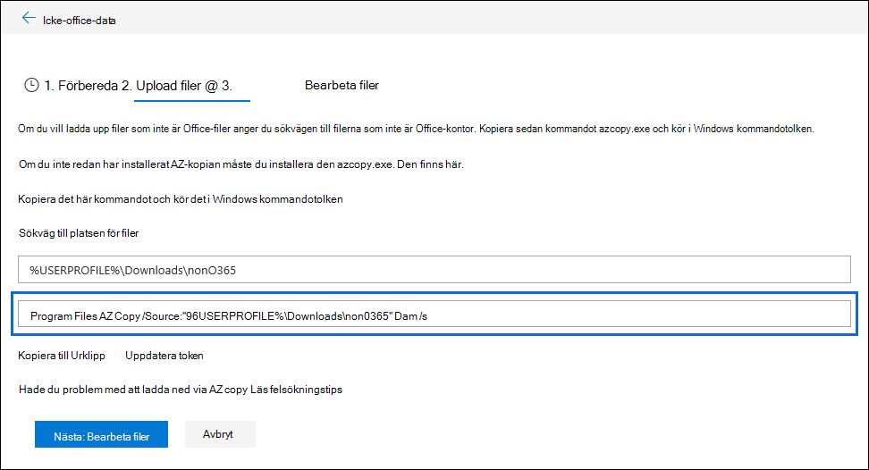

# Felsöka AzCopy i Advanced eDiscoveryTroubleshoot AzCopy in Advanced eDiscovery

När du läser in data eller dokument som inte är Microsoft 365 eller dokument för felreparation i Advanced eDiscovery tillhandahåller användargränssnittet ett Azure AzCopy-kommando som innehåller parametrarna för platsen där de filer du vill ladda upp lagras och azure-lagringsplatsen som filerna ska laddas upp till.When loading non-Microsoft 365 data or documents for error remediation in Advanced eDiscovery, the user interface supplies an Azure AzCopy command that contains parameters with the location of where the files that you want to upload are stored and the Azure storage location that the files will be uploaded to. Om du vill ladda upp dina dokument kopierar du det här kommandot och kör det sedan i en kommandotolk på den lokala datorn.To upload your documents, you copy this command and then run it in a Command Prompt on your local computer.  På följande skärmbild visas ett exempel på ett AzCopy-kommando:The follow screenshot shows an example of an AzCopy command:

Vanligtvis fungerar det kommando som tillhandahålls när du kör det.Usually the command that's provided works when you run it. Det kan dock finnas tillfällen när kommandot som visas inte körs.However, there may be cases when the command that's displayed will not run successfully. Här är några möjliga orsaker.Here's a few possible reasons.

## Den version av AzCopy som stöds är inte installerad på den lokala datornThe supported version of AzCopy isn't installed on the local computer

För stunden måste du använda AzCopy v8.1 för att läsa in icke-Microsoft 365-data i Advanced eDiscovery.At this time, you must use AzCopy v8.1 to load non-Microsoft 365 data in Advanced eDiscovery. Kommandot AzCopy som visas på **filsidan för Upload** som visas på föregående skärmbild returnerar ett fel om du inte använder AzCopy v8.1.The AzCopy command that's displayed on the **Upload files** page shown in the previous screenshot returns an error if you're not using AzCopy v8.1. Information om hur du installerar den [här versionen finns i Överföra data med AzCopy v8.1 på Windows](/previous-versions/azure/storage/storage-use-azcopy).To install this version, see [Transfer data with the AzCopy v8.1 on Windows](/previous-versions/azure/storage/storage-use-azcopy).

## AzCopy är inte installerat på den lokala datorn eller är inte installerat på standardplatsenAzCopy isn't installed on the local computer or it's not installed in the default location

Om AzCopy inte är installerat eller om det är installerat på en annan plats än standardplatsen för installation (d.v.s. ) kan följande felmeddelande visas när du kör `%ProgramFiles(x86)%` kommandot AzCopy:If AzCopy isn't installed or it's installed in a location other than the default install location (which is `%ProgramFiles(x86)%`), you may receive the following error when you run the AzCopy command:

> Det går inte att hitta den angivna sökvägen.The system cannot find the path specified.

Om AzCopy inte är installerat på den lokala datorn hittar du installationsinformationen under Överför data med [AzCopy v8.1 på Windows](/previous-versions/azure/storage/storage-use-azcopy).If AzCopy isn't installed on the local computer, you can find installation information in [Transfer data with the AzCopy v8.1 on Windows](/previous-versions/azure/storage/storage-use-azcopy). Se till att installera den på standardplatsen.Be sure to install it in the default location.

Om AzCopy är installerat, men det installeras på en annan plats än standardplatsen, kan du kopiera kommandot, klistra in det i en textfil och sedan ändra sökvägen till den plats där AzCopy är installerad.If AzCopy is installed, but it's installed in a location different than the default location, you can copy the command, paste it to a text file, and then change the path to the location where AzCopy is installed. Om Azcopy till exempel finns i kan du ändra den `%ProgramFiles%` första delen av kommandot från till `%ProgramFiles(x86)%\Microsoft SDKs\Azure\AzCopy.exe` `%ProgramFiles%\Microsoft SDKs\Azure\AzCopy` .For example, if Azcopy is located in `%ProgramFiles%`, then you can change the first part of the command from `%ProgramFiles(x86)%\Microsoft SDKs\Azure\AzCopy.exe` to `%ProgramFiles%\Microsoft SDKs\Azure\AzCopy`. När du har gör den här ändringen kopierar du den från textfilen och kör den i kommandotolken.After you make this change, copy it from the text file and then run it a Command Prompt.

> [!TIP]
> Om AzCopy är installerat på en annan plats än standardplatsen för installation bör du överväga att avinstallera det och sedan installera om det på standardplatsen.If AzCopy is installed in a location other then the default install location, consider uninstalling it and then re-installing it in the default location. Det här hjälper till att förhindra det här problemet i framtiden.This will help prevent this issue in the future.