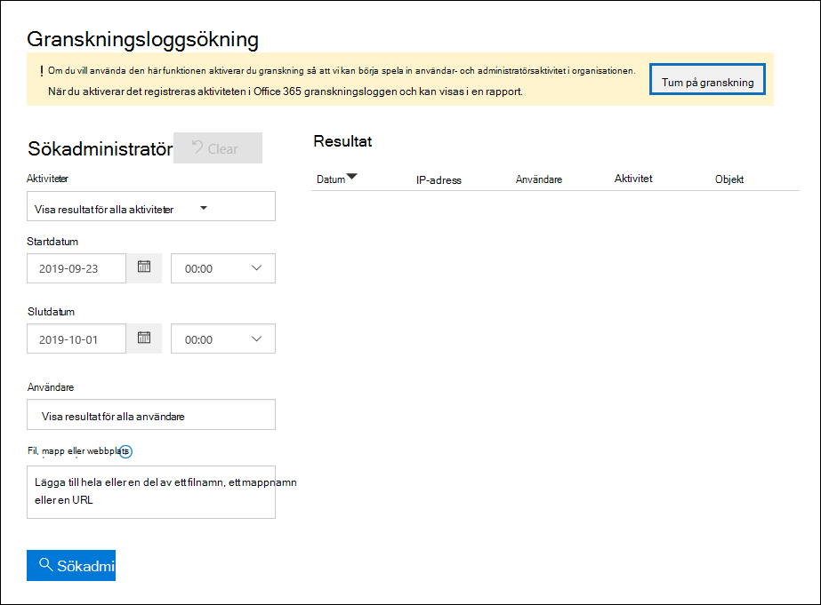

# <a name="turn-audit-log-search-on-or-off"></a>Aktivera och inaktivera granskningsloggsökning

Granskningsloggning är aktiverat som standard för Microsoft 365 och Office 365 företag. Detta omfattar organisationer med E3/G3 eller E5/G5-prenumerationer. När granskningsloggsökning i efterlevnadscentret är aktiverat registreras användar- och administratörsaktivitet från organisationen i granskningsloggen och behålls i 90 dagar och upp till ett år beroende på vilken licens användarna har tilldelats. Det kan dock finnas skäl för organisationen att inte registrera och behålla granskningsloggdata. I sådana fall kan en global administratör välja att inaktivera granskning i Microsoft 365.

> [!IMPORTANT]
> Om du inaktiverar granskningsloggsökning i Microsoft 365 kan du inte använda API:t för hanteringsaktivitet i Office 365 eller Azure Sentinel för att komma åt granskningsdata för organisationen. Om du inaktiverar granskningsloggsökning genom att följa stegen i den här artikeln innebär det att inga resultat returneras när du söker i granskningsloggen med hjälp av Säkerhets- och efterlevnadscenter för & eller när du kör cmdleten **Search-UnifiedAuditLog** i Exchange Online PowerShell. Det innebär också att granskningsloggar inte är tillgängliga via API:t för Office 365 managementaktivitet eller Azure Sentinel.
  
## <a name="before-you-turn-audit-log-search-on-or-off"></a>Innan du aktiverar eller inaktiverar granskningsloggsökning

- Du måste ha tilldelats rollen Granskningsloggar i Exchange Online aktivera eller inaktivera granskningsloggsökning i Microsoft 365 organisation. Som standard är den här rollen tilldelad rollgrupperna  Efterlevnadshantering och Organisationshantering på sidan Behörigheter Exchange administrationscentret. Globala administratörer i Microsoft 365 är medlemmar i rollgruppen Organisationshantering i Exchange Online. 
    
    > [!NOTE]
    > Användarna måste ha tilldelats behörigheter i Exchange Online att aktivera eller inaktivera granskningsloggsökning. Om du tilldelar användarna rollen  Granskningsloggar på sidan Behörigheter i Säkerhets- & efterlevnadscenter kan de inte aktivera eller inaktivera granskningsloggsökning. Det beror på att den underliggande cmdleten är en Exchange Online PowerShell-cmdlet. 
    
- Stegvisa instruktioner för hur du söker i granskningsloggen finns i Söka i [granskningsloggen i Säkerhets- & Efterlevnadscenter.](search-the-audit-log-in-security-and-compliance.md) Mer information om API för hanteringsaktivitet Microsoft 365 finns i Komma [igång Microsoft 365 Management API:er.](/office/office-365-management-api/get-started-with-office-365-management-apis)

- Du kan kontrollera att granskningsloggsökning är aktiverat genom att köra följande kommando Exchange Online PowerShell:

    ```powershell
    Get-AdminAuditLogConfig | FL UnifiedAuditLogIngestionEnabled
    ```

    Värdet för egenskapen  `True`  _UnifiedAuditLogIngestionEnabled_ anger att granskningsloggsökning är aktiverad. 
    
## <a name="turn-on-audit-log-search"></a>Aktivera granskningsloggsökning

Om granskningsloggsökning inte är aktiverat för organisationen kan du aktivera den i efterlevnadscentret eller med hjälp av Exchange Online PowerShell. Det kan ta flera timmar efter att du har aktiverar granskningsloggsökning innan du kan returnera resultat när du söker i granskningsloggen.
  
### <a name="use-the-compliance-center-to-turn-on-audit-log-search"></a>Använda efterlevnadscenter för att aktivera granskningsloggsökning

1. [Gå till efterlevnadscentret](https://protection.office.com) och logga in.

2. Gå till Sök granskningsloggsökning **i**  >  **efterlevnadscentret.**

   Om granskningsloggsökning inte är aktiverat för organisationen visas en banderoll som säger att granskning måste aktiveras för att registrera användar- och administratörsaktivitet.

3. Klicka **på Aktivera granskning.**

    
  
    Banderollen uppdateras för att säga att granskningsloggen förbereds och att du kan söka efter användar- och administratörsaktivitet om några timmar.

### <a name="use-powershell-to-turn-on-audit-log-search"></a>Använda PowerShell för att aktivera granskningsloggsökning

1. [Anslut till Exchange Online PowerShell](/powershell/exchange/connect-to-exchange-online-powershell)

2. Kör följande PowerShell-kommando för att aktivera granskningsloggsökning i Office 365.

    ```powershell
    Set-AdminAuditLogConfig -UnifiedAuditLogIngestionEnabled $true
    ```

    Ett meddelande visas om att det kan ta upp till 60 minuter innan ändringen verkställs.
  
## <a name="turn-off-audit-log-search"></a>Inaktivera granskningsloggsökning

Du måste använda Exchange Online PowerShell för att inaktivera granskningsloggsökning.
  
1. [Anslut till Exchange Online PowerShell](/powershell/exchange/connect-to-exchange-online-powershell)

2. Kör följande PowerShell-kommando för att inaktivera granskningsloggsökning.

    ```powershell
    Set-AdminAuditLogConfig -UnifiedAuditLogIngestionEnabled $false
    ```

3. Kontrollera efter ett tag att granskningsloggsökning är inaktiverat (inaktiverat). Du kan göra det på två sätt:

    - I Exchange Online PowerShell kör du följande kommando:

      ```powershell
      Get-AdminAuditLogConfig | FL UnifiedAuditLogIngestionEnabled
      ```

      Värdet för egenskapen  `False`  _UnifiedAuditLogIngestionEnabled_ anger att granskningsloggsökning är inaktiverad. 

    - Gå till [Sök i granskningsloggsökning](https://protection.office.com)i  \> **efterlevnadscentret.**

      En banderoll visas om att granskning måste aktiveras för att kunna registrera användar- och administratörsaktivitet.