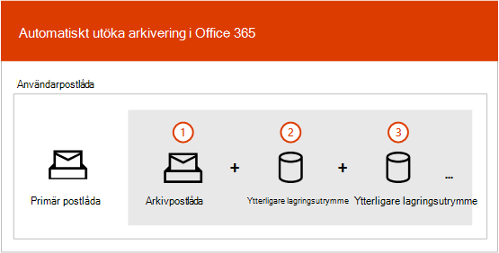
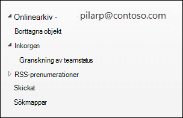
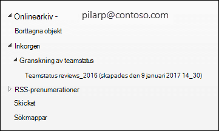

# Översikt över obegränsad arkivering

I Office 365 förser arkivpostlådor användarna med ytterligare lagringsutrymme. När en användares arkivpostlåda har aktiverats är upp till 100 GB extra lagringsutrymme tillgängligt. Tidigare var organisationer tvungna att kontakta Microsoft för att begära ytterligare lagringsutrymme för en arkivpostlåda när lagringskvoten på 100 GB nåddes. Så är inte längre fallet.

Den obegränsade arkiveringsfunktionen i Microsoft 365 (kallas *automatisk* arkivering) ger ytterligare lagringsutrymme i arkivpostlådor. När lagringskvoten i arkivpostlådan har nåtts ökar Microsoft 365 automatiskt storleken på arkivet, vilket innebär att användarna inte får slut på lagringsutrymmet i postlådan och administratörer behöver inte begära ytterligare lagringsutrymme för arkivpostlådor.

Stegvisa instruktioner för hur du aktiverar automatisk expandering av arkivering finns i [Aktivera obegränsad arkivering.](enable-unlimited-archiving.md)

> [!NOTE]
> Automatiskt expanderande arkivering som också har stöd för delade postlådor. För att aktivera arkivet för en delad postlåda krävs en Exchange Online abonnemang 2-licens eller en Exchange Online abonnemang 1-licens med Exchange Online - arkivering licens.

## Så här fungerar automatiskt expanderande arkivering

Som tidigare förklarats skapas ytterligare lagringsutrymme för postlådan när en användares arkivpostlåda aktiveras. När automatiskt expanderande arkivering är aktiverat Microsoft 365 med jämna mellanrum storleken på arkivpostlådan. När en arkivpostlåda når lagringsgränsen skapar Microsoft 365 automatiskt ytterligare lagringsutrymme för arkivet. Om användaren får slut på det extra lagringsutrymmet Microsoft 365 lägger du till mer lagringsutrymme i användarens arkiv. Den här processen sker automatiskt, vilket innebär att administratörer inte behöver begära ytterligare arkivlagring eller hantera automatiskt expanderande arkivering.

Här är en snabb överblick över processen.

1. Arkivering är aktiverat för en användarpostlåda eller en delad postlåda. En arkivpostlåda med 100 GB lagringsutrymme skapas och varningskvoten för arkivpostlådan är inställd på 90 GB.

2. En administratör aktiverar automatisk expandering av arkivering för postlådan. När arkivpostlådan (med mappen Återställningsbara objekt) når 90 GB konverteras den till ett automatiskt expanderande arkiv och Microsoft 365 lägger till lagringsutrymme i arkivet. Det kan ta upp till 30 dagar innan det extra lagringsutrymmet etableras.

   > [!NOTE]
   > Om en postlåda sätts på bevarande eller tilldelas en bevarandeprincip, ökas lagringskvoten för arkivpostlådan till 110 GB när automatisk utökad arkivering aktiveras. På samma sätt ökar lagringsvarningskvoten till 100 GB.

3. Microsoft 365 lägger automatiskt till mer lagringsutrymme när det behövs.

> [!IMPORTANT]
> Automatiskt expanderande arkiv stöds bara för postlådor som används för enskilda användare (eller delade postlådor) med en tillväxtfrekvens som inte överskrider 1 GB per dag. En användares arkivpostlåda är endast avsedd för den användaren. Du kan inte använda journaler, transportregler eller regler för automatisk vidarebefordran för att kopiera meddelanden till en arkivpostlåda. Microsoft förbehåller sig rätten att neka obegränsad arkivering i fall där en användares arkivpostlåda används till att lagra arkivdata för andra användare eller i andra fall av den olämpliga användningen.

## Vad flyttas till det extra arkivlagringsutrymmet?

Mappar kan flyttas för att du ska kunna använda automatiskt expanderande arkivlagring på ett effektivt sätt. Microsoft 365 avgör vilka mappar som flyttas när ytterligare lagringsutrymme läggs till i arkivet. Ibland när en mapp flyttas skapas en eller flera undermappar automatiskt och objekt från den ursprungliga mappen distribueras till dessa mappar för att underlätta flyttprocessen. När du visar arkivdelen av mapplistan i Outlook visas dessa undermappar under den ursprungliga mappen.  De namngivningskonventioner som Microsoft 365 använder för att namnge dessa undermappar är **\<folder name\> _yyyy (Skapad i mmm dd, yyyy h_mm),** där:

- **yyyy** är året som meddelanden i mappen togs emot.

- **dd mmm, yyyy h_m** är det datum och den tid som undermappen skapades av Office 365, i UTC-format, baserat på användarens tidszon och nationella inställningar i Outlook.

På följande skärmbilder visas en mapplista före och efter att meddelanden flyttas till ett automatiskt expanderat arkiv.

 **Innan ytterligare lagringsutrymme läggs till**

 **När ytterligare lagringsutrymme läggs till**

> [!NOTE]
> Som tidigare beskrivits flyttar Microsoft 365 objekt till undermappar (och namnger dem med namngivningskonventionerna som beskrivs ovan) för att distribuera innehåll till ett arkiv med arkiv för arkivering. Men det är inte alltid så att flytta objekt till undermappar. Ibland kan en hel mapp flyttas till ett arkiv för arkivering. I det här fallet behåller mappen det ursprungliga namnet.  Det syns inte i mapplistan i e Outlook att mappen har flyttats till ett arkiv för arkiv för arkivering.

## Outlook för åtkomst till objekt i ett automatiskt expanderat arkiv

För att komma åt meddelanden som lagras i ett automatiskt expanderat arkiv måste användarna använda någon av följande Outlook klienter:

- Outlook 2016 eller Outlook 2019 för Windows

- Outlook på webben

- Outlook 2016 eller Outlook 2019 för Mac

Här är några saker att tänka på när du använder Outlook eller Outlook på webben för att komma åt meddelanden som lagras i ett automatiskt expanderat arkiv.

- Du kan komma åt alla mappar i din arkivpostlåda, även sådana som har flyttats till det automatiskt utökade lagringsutrymmet.

- Sök efter automatiskt utökad arkivering är tillgänglig i Outlook för webben (OWA). På ungefär samma sätt som i onlinearkiv kan du söka efter objekt som har flyttats till ytterligare ett lagringsutrymme. När arkivet väljs som sökomfång i OWA genomsöks alla arkiv (inklusive automatiskt expanderade arkiv) och deras motsvarande undermappar.

- Automatiskt utökad arkivsökning är tillgänglig i Outlook i aktuell kanal (förhandsvisning). I den här förhandsversionen är den aktuella postlådans omfattning tillgänglig, vilket gör att du kan söka i det automatiskt utökade arkivet. Mer information om den här och andra supportfunktioner för Microsoft Search finns i hur Outlook [för Windows anslutna till Exchange Online använder Microsoft Search.](https://techcommunity.microsoft.com/t5/outlook-global-customer-service/how-outlook-for-windows-connected-to-exchange-online-utilizes/ba-p/1715045) 

- Objekträkning i Outlook och antalet lästa/olästa objekt (i Outlook och Outlook på webben) i ett automatiskt expanderat arkiv kanske inte är korrekt.

- Du kan ta bort objekt i en undermapp som pekar på ett automatiskt expanderat lagringsutrymme, men själva mappen kan inte tas bort.

- Du kan inte använda funktionen Återställ borttagna objekt till att återställa ett objekt som tagits bort från ett automatiskt expanderat lagringsutrymme.

## Automatiskt expanderande arkivering och andra efterlevnadsfunktioner

I det här avsnittet förklaras funktionen mellan automatiskt expanderande arkivering och andra funktioner för efterlevnad och datastyrning.

- **eDiscovery:** När du använder ett eDiscovery-verktyg, till exempel innehållssökning eller In-Place eDiscovery, genomsöks även de extra lagringsområdena i ett automatiskt expanderat arkiv.

- **Bevarande:** När du spärrar en postlåda med hjälp av verktyg som Bevarande av juridiska skäl i Exchange Online eller eDiscovery-ärenden samt bevarandeprinciper i säkerhets- och efterlevnadscentret, spärras även innehåll som finns i ett automatiskt expanderat arkiv.

- **Hantering av meddelandeposter (MRM):** Om du använder MRM-borttagningsprinciper i Exchange Online för att permanent ta bort in utgångna postlådeobjekt tas även in utgångna objekt i det automatiskt utökade arkivet bort.

- **Importtjänst:** Du kan använda Office 365 importtjänsten för att importera PST-filer till en användares automatiskt utökade arkiv. Du kan importera upp till 100 GB data från PST-filer till användarens arkivpostlåda.

## Mer information

Mer teknisk information om automatiskt expanderande arkivering finns i avsnittet arkivering [Microsoft 365: Vanliga](https://techcommunity.microsoft.com/t5/exchange-team-blog/office-365-auto-expanding-archives-faq/ba-p/607784)frågor och svar om automatiska arkiv .
