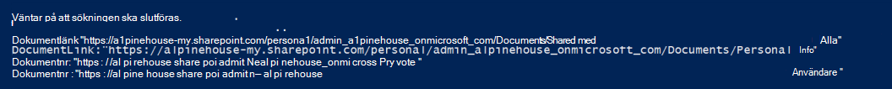

# <a name="use-content-search-for-targeted-collections"></a><span data-ttu-id="c6f9b-103">Använda innehållssökning för riktade samlingar</span><span class="sxs-lookup"><span data-stu-id="c6f9b-103">Use Content Search for targeted collections</span></span>

<span data-ttu-id="c6f9b-104">Funktionen Innehållssökning i kompatibilitetscentret för Microsoft 365 tillhandahåller inte något direkt sätt i användargränssnittet för att söka i specifika mappar i Exchange-postlådor eller på SharePoint och OneDrive för företag-webbplatser.</span><span class="sxs-lookup"><span data-stu-id="c6f9b-104">The Content Search feature in the Microsoft 365 compliance center doesn't provide a direct way in the UI to search specific folders in Exchange mailboxes or SharePoint and OneDrive for Business sites.</span></span> <span data-ttu-id="c6f9b-105">Du kan emellertid söka i specifika mappar (kallas för riktad *samling)* genom att ange egenskapen mapp-ID för e-post eller sökväg (DocumentLink) för webbplatser i den faktiska sökfrågesyntaxen.</span><span class="sxs-lookup"><span data-stu-id="c6f9b-105">However, it's possible to search specific folders (called a *targeted collection*) by specifying the folder ID property for email or path (DocumentLink) property for sites in the actual search query syntax.</span></span> <span data-ttu-id="c6f9b-106">Det kan vara användbart att använda innehållssökning för att utföra en riktad samling när du är säker på att objekt som svarar på ett ärende eller objekt med privilegierad åtkomst finns i en viss postlåda eller webbplatsmapp.</span><span class="sxs-lookup"><span data-stu-id="c6f9b-106">Using Content Search to perform a targeted collection is useful when you're confident that items responsive to a case or privileged items are located in a specific mailbox or site folder.</span></span> <span data-ttu-id="c6f9b-107">Du kan använda skriptet i den här artikeln för att hämta mapp-ID för postlådemappar eller sökvägen (DocumentLink) för mappar på en SharePoint och OneDrive för företag webbplats.</span><span class="sxs-lookup"><span data-stu-id="c6f9b-107">You can use the script in this article to obtain the folder ID for mailbox folders or the path (DocumentLink) for folders on a SharePoint and OneDrive for Business site.</span></span> <span data-ttu-id="c6f9b-108">Sedan kan du använda mapp-ID:t eller sökvägen i en sökfråga för att returnera objekt som finns i mappen.</span><span class="sxs-lookup"><span data-stu-id="c6f9b-108">Then you can use the folder ID or path in a search query to return items located in the folder.</span></span>

> [!NOTE]
> <span data-ttu-id="c6f9b-109">För att returnera innehåll som finns i en mapp på en SharePoint- eller OneDrive för företag-webbplats använder skriptet i det här avsnittet den hanterade DocumentLink-egenskapen i stället för egenskapen Path.</span><span class="sxs-lookup"><span data-stu-id="c6f9b-109">To return content located in a folder in a SharePoint or OneDrive for Business site, the script in this topic uses the DocumentLink managed property instead of the Path property.</span></span> <span data-ttu-id="c6f9b-110">Egenskapen DocumentLink är mer robust än egenskapen Path eftersom den returnerar allt innehåll i en mapp, medan egenskapen Path inte returnerar vissa mediefiler.</span><span class="sxs-lookup"><span data-stu-id="c6f9b-110">The DocumentLink property is more robust than the Path property because it will return all content in a folder, whereas the Path property won't return some media files.</span></span>

## <a name="before-you-run-a-targeted-collection"></a><span data-ttu-id="c6f9b-111">Innan du kör en riktad samling</span><span class="sxs-lookup"><span data-stu-id="c6f9b-111">Before you run a targeted collection</span></span>

- <span data-ttu-id="c6f9b-112">Du måste vara medlem i rollgruppen för eDiscovery Manager i Säkerhets- & kompatibilitetscenter för att köra skriptet i steg 1.</span><span class="sxs-lookup"><span data-stu-id="c6f9b-112">You have to be a member of the eDiscovery Manager role group in the Security & Compliance Center to run the script in Step 1.</span></span> <span data-ttu-id="c6f9b-113">Mer information finns i Tilldela [eDiscovery-behörigheter.](assign-ediscovery-permissions.md)</span><span class="sxs-lookup"><span data-stu-id="c6f9b-113">For more information, see [Assign eDiscovery permissions](assign-ediscovery-permissions.md).</span></span>

    <span data-ttu-id="c6f9b-114">Dessutom måste du vara tilldelad rollen E-postmottagare i Exchange Online organisation.</span><span class="sxs-lookup"><span data-stu-id="c6f9b-114">Additionally, you have to be assigned the Mail Recipients role in your Exchange Online organization.</span></span> <span data-ttu-id="c6f9b-115">Detta krävs för att köra cmdleten **Get-MailboxFolderStatistics,** som ingår i skriptet.</span><span class="sxs-lookup"><span data-stu-id="c6f9b-115">This is required to run the **Get-MailboxFolderStatistics** cmdlet, which is included in the script.</span></span> <span data-ttu-id="c6f9b-116">Som standard tilldelas rollen E-postmottagare rollgrupperna Organisationshantering och Mottagarhantering i Exchange Online.</span><span class="sxs-lookup"><span data-stu-id="c6f9b-116">By default, the Mail Recipients role is assigned to the Organization Management and Recipient Management role groups in Exchange Online.</span></span> <span data-ttu-id="c6f9b-117">Mer information om hur du tilldelar behörigheter Exchange Online i Hantera [rollgruppsmedlemmar.](/exchange/manage-role-group-members-exchange-2013-help)</span><span class="sxs-lookup"><span data-stu-id="c6f9b-117">For more information about assigning permissions in Exchange Online, see [Manage role group members](/exchange/manage-role-group-members-exchange-2013-help).</span></span> <span data-ttu-id="c6f9b-118">Du kan också skapa en anpassad rollgrupp, tilldela rollen E-postmottagare till den och sedan lägga till de medlemmar som behöver köra skriptet i steg 1.</span><span class="sxs-lookup"><span data-stu-id="c6f9b-118">You could also create a custom role group, assign the Mail Recipients role to it, and then add the members who need to run the script in Step 1.</span></span> <span data-ttu-id="c6f9b-119">Mer information finns i [Hantera rollgrupper.](/Exchange/permissions-exo/role-groups)</span><span class="sxs-lookup"><span data-stu-id="c6f9b-119">For more information, see [Manage role groups](/Exchange/permissions-exo/role-groups).</span></span>

- <span data-ttu-id="c6f9b-120">Skriptet i den här artikeln har stöd för modern autentisering.</span><span class="sxs-lookup"><span data-stu-id="c6f9b-120">The script in this article supports modern authentication.</span></span> <span data-ttu-id="c6f9b-121">Du kan använda skriptet som det är om du är en Microsoft 365 eller en Microsoft 365 GCC organisation.</span><span class="sxs-lookup"><span data-stu-id="c6f9b-121">You can use the script as-is if you are a Microsoft 365 or a Microsoft 365 GCC organization.</span></span> <span data-ttu-id="c6f9b-122">Om du är en Office 365 Germany-organisation, Microsoft 365 GCC High-organisation eller en Microsoft 365 DoD-organisation måste du redigera skriptet för att kunna köra det.</span><span class="sxs-lookup"><span data-stu-id="c6f9b-122">If you are an Office 365 Germany organization, a Microsoft 365 GCC High organization, or a Microsoft 365 DoD organization, you will have to edit the script to successfully run it.</span></span> <span data-ttu-id="c6f9b-123">Du måste specifikt redigera linjen och använda `Connect-ExchangeOnline` *ExchangeEnvironmentName-parametern* (och rätt värde för organisationstypen) för att ansluta till Exchange Online PowerShell.</span><span class="sxs-lookup"><span data-stu-id="c6f9b-123">Specifically, you have to edit the line `Connect-ExchangeOnline` and use the *ExchangeEnvironmentName* parameter (and the appropriate value for your organization type) to connect to Exchange Online PowerShell.</span></span>  <span data-ttu-id="c6f9b-124">Du måste också redigera linjen och använda parametrarna `Connect-IPPSSession` *ConnectionUri* och *AzureADAuthorizationEndpointUri* (och lämpliga värden för organisationstypen) för att ansluta till Security & Compliance Center PowerShell.</span><span class="sxs-lookup"><span data-stu-id="c6f9b-124">Also, you have to edit the line `Connect-IPPSSession` and use the *ConnectionUri* and *AzureADAuthorizationEndpointUri* parameters (and the appropriate values for your organization type) to connect to Security & Compliance Center PowerShell.</span></span> <span data-ttu-id="c6f9b-125">Mer information finns i exemplen i [PowerShell Anslut](/powershell/exchange/connect-to-exchange-online-powershell#connect-to-exchange-online-powershell-without-using-mfa) Exchange Online och Anslut till PowerShell för [& Compliance Center.](/powershell/exchange/connect-to-scc-powershell#connect-to-security--compliance-center-powershell-without-using-mfa)</span><span class="sxs-lookup"><span data-stu-id="c6f9b-125">For more information, see the examples in [Connect to Exchange Online PowerShell](/powershell/exchange/connect-to-exchange-online-powershell#connect-to-exchange-online-powershell-without-using-mfa) and [Connect to Security & Compliance Center PowerShell](/powershell/exchange/connect-to-scc-powershell#connect-to-security--compliance-center-powershell-without-using-mfa).</span></span>

- <span data-ttu-id="c6f9b-126">Varje gång du kör skriptet skapas en ny fjärrsession för PowerShell.</span><span class="sxs-lookup"><span data-stu-id="c6f9b-126">Each time you run the script, a new remote PowerShell session is created.</span></span> <span data-ttu-id="c6f9b-127">Det innebär att du kan använda alla tillgängliga PowerShell-fjärrsessioner.</span><span class="sxs-lookup"><span data-stu-id="c6f9b-127">That means you can use up all the remote PowerShell sessions available to you.</span></span> <span data-ttu-id="c6f9b-128">Om du vill förhindra att det händer kör du följande kommando för att koppla bort de aktiva fjärrsessionerna i PowerShell.</span><span class="sxs-lookup"><span data-stu-id="c6f9b-128">To prevent this from happening, run the following command to disconnect your active remote PowerShell sessions.</span></span>

  ```powershell
  Get-PSSession | Remove-PSSession
  ```

    <span data-ttu-id="c6f9b-129">Mer information finns i Anslut [till Exchange Online PowerShell.](/powershell/exchange/connect-to-exchange-online-powershell)</span><span class="sxs-lookup"><span data-stu-id="c6f9b-129">For more information, see [Connect to Exchange Online PowerShell](/powershell/exchange/connect-to-exchange-online-powershell).</span></span>

- <span data-ttu-id="c6f9b-130">Skriptet innehåller minimal felhantering.</span><span class="sxs-lookup"><span data-stu-id="c6f9b-130">The script includes minimal error handling.</span></span> <span data-ttu-id="c6f9b-131">Det primära syftet med skriptet är att snabbt visa en lista med mapp-ID:er för postlådor eller webbplatssökvägar som kan användas i sökfrågesyntaxen för en innehållssökning för att utföra en riktad samling.</span><span class="sxs-lookup"><span data-stu-id="c6f9b-131">The primary purpose of the script is to quickly display a list of mailbox folder IDs or site paths that can be used in the search query syntax of a Content Search to perform a targeted collection.</span></span>

- <span data-ttu-id="c6f9b-132">Exempelskriptet som tillhandahålls i det här avsnittet stöds inte under något standardsupportprogram eller någon standardsupporttjänst från Microsoft.</span><span class="sxs-lookup"><span data-stu-id="c6f9b-132">The sample script provided in this topic isn't supported under any Microsoft standard support program or service.</span></span> <span data-ttu-id="c6f9b-133">Exempelskriptet tillhandahålls i SIN FORM utan några som helst garantier.</span><span class="sxs-lookup"><span data-stu-id="c6f9b-133">The sample script is provided AS IS without warranty of any kind.</span></span> <span data-ttu-id="c6f9b-134">Vidare frånsäger sig Microsoft alla underförstådda garantier, inklusive, utan begränsning, alla underförstådda garantier om säljbarhet eller lämplighet för ett visst ändamål.</span><span class="sxs-lookup"><span data-stu-id="c6f9b-134">Microsoft further disclaims all implied warranties including, without limitation, any implied warranties of merchantability or of fitness for a particular purpose.</span></span> <span data-ttu-id="c6f9b-135">Hela risken i samband med användningen av eller prestandan hos exempelskriptet och dokumentationen ligger kvar hos dig.</span><span class="sxs-lookup"><span data-stu-id="c6f9b-135">The entire risk arising out of the use or performance of the sample script and documentation remains with you.</span></span> <span data-ttu-id="c6f9b-136">Under inga omständigheter ska Microsoft, dess upphovspersoner eller någon annan som är involverad i skapandet, produktionen eller leveransen av skripten hållas ansvariga för någon som helst skada (inklusive, men inte begränsat till, skador för vinstförlust, driftavbrott, förlust av affärsinformation eller annan ekonomisk skada) som uppstår till följd av användning eller oförmåga att använda exempelskripten eller dokumentationen, även om Microsoft har fått information om att sådana skador kan uppstå.</span><span class="sxs-lookup"><span data-stu-id="c6f9b-136">In no event shall Microsoft, its authors, or anyone else involved in the creation, production, or delivery of the scripts be liable for any damages whatsoever (including, without limitation, damages for loss of business profits, business interruption, loss of business information, or other pecuniary loss) arising out of the use of or inability to use the sample scripts or documentation, even if Microsoft has been advised of the possibility of such damages.</span></span>

## <a name="step-1-run-the-script-to-get-a-list-of-folders-for-a-mailbox-or-site"></a><span data-ttu-id="c6f9b-137">Steg 1: Kör skriptet för att få en lista med mappar för en postlåda eller webbplats</span><span class="sxs-lookup"><span data-stu-id="c6f9b-137">Step 1: Run the script to get a list of folders for a mailbox or site</span></span>

<span data-ttu-id="c6f9b-138">Skriptet som du kör i det här första steget returnerar en lista över postlådemappar eller e SharePoint- OneDrive för företag postmappar och motsvarande mapp-ID eller mappsökväg för varje mapp.</span><span class="sxs-lookup"><span data-stu-id="c6f9b-138">The script that you run in this first step will return a list of mailbox folders or SharePoint and OneDrive for Business folders, and the corresponding folder ID or path for each folder.</span></span> <span data-ttu-id="c6f9b-139">När du kör det här skriptet uppmanas du att ange följande information.</span><span class="sxs-lookup"><span data-stu-id="c6f9b-139">When you run this script, it will prompt you for the following information.</span></span>

- <span data-ttu-id="c6f9b-140">**E-postadress eller webbplats-URL:** Skriv en e-postadress till den som är dokumenterade för att returnera en lista Exchange postlådemappar och mapp-ID.</span><span class="sxs-lookup"><span data-stu-id="c6f9b-140">**Email address or site URL**: Type an email address of the custodian to return a list of Exchange mailbox folders and folder IDs.</span></span> <span data-ttu-id="c6f9b-141">Eller skriv URL:en för en SharePoint webbplats eller en OneDrive för företag för att returnera en lista med sökvägar för den angivna webbplatsen.</span><span class="sxs-lookup"><span data-stu-id="c6f9b-141">Or type the URL for a SharePoint site or a OneDrive for Business site to return a list of paths for the specified site.</span></span> <span data-ttu-id="c6f9b-142">Här är några exempel:</span><span class="sxs-lookup"><span data-stu-id="c6f9b-142">Here are some examples:</span></span>

  - <span data-ttu-id="c6f9b-143">**Exchange**: stacig@contoso.onmicrosoft <spam> <spam> .com</span><span class="sxs-lookup"><span data-stu-id="c6f9b-143">**Exchange**: stacig@contoso.onmicrosoft<spam><spam>.com</span></span>

  - <span data-ttu-id="c6f9b-144">**SharePoint:** https <span>://</span>contoso.sharepoint.com/sites/marketing</span><span class="sxs-lookup"><span data-stu-id="c6f9b-144">**SharePoint**: https<span>://</span>contoso.sharepoint.com/sites/marketing</span></span>

  - <span data-ttu-id="c6f9b-145">**OneDrive för företag**: https <span>://</span>contoso-my.sharepoint.com/personal/stacig_contoso_onmicrosoft_com</span><span class="sxs-lookup"><span data-stu-id="c6f9b-145">**OneDrive for Business**: https<span>://</span>contoso-my.sharepoint.com/personal/stacig_contoso_onmicrosoft_com</span></span>

- <span data-ttu-id="c6f9b-146">**Dina användarautentiseringsuppgifter:** Skriptet använder dina autentiseringsuppgifter för att ansluta till Exchange Online PowerShell eller Säkerhets- & PowerShell med modern autentisering.</span><span class="sxs-lookup"><span data-stu-id="c6f9b-146">**Your user credentials**: The script will use your credentials to connect to Exchange Online PowerShell or Security & Compliance Center PowerShell using modern authentication.</span></span> <span data-ttu-id="c6f9b-147">Som tidigare förklarats måste du ha rätt behörighet för att kunna köra det här skriptet.</span><span class="sxs-lookup"><span data-stu-id="c6f9b-147">As previously explained, you have to be assigned the appropriate permissions to successfully run this script.</span></span>

<span data-ttu-id="c6f9b-148">Så här visar du en lista över postlådemappar eller webbplatsdokumentlänknamn (sökväg):</span><span class="sxs-lookup"><span data-stu-id="c6f9b-148">To display a list of mailbox folders or site documentlink (path) names:</span></span>

1. <span data-ttu-id="c6f9b-149">Spara följande text i en Windows PowerShell skriptfil med hjälp av ett filnamnssuffix .ps1; till exempel `GetFolderSearchParameters.ps1` .</span><span class="sxs-lookup"><span data-stu-id="c6f9b-149">Save the following text to a Windows PowerShell script file by using a filename suffix of .ps1; for example, `GetFolderSearchParameters.ps1`.</span></span>

   ```powershell
   #########################################################################################################
   # This PowerShell script will prompt you for:                                #
   #    * Admin credentials for a user who can run the Get-MailboxFolderStatistics cmdlet in Exchange    #
   #      Online and who is an eDiscovery Manager in the Security & Compliance Center.            #
   # The script will then:                                            #
   #    * If an email address is supplied: list the folders for the target mailbox.            #
   #    * If a SharePoint or OneDrive for Business site is supplied: list the documentlinks (folder paths) #
   #    * for the site.                                                                                    #
   #    * In both cases, the script supplies the correct search properties (folderid: or documentlink:)    #
   #      appended to the folder ID or documentlink to use in a Content Search.                #
   # Notes:                                                #
   #    * For SharePoint and OneDrive for Business, the paths are searched recursively; this means the     #
   #      the current folder and all sub-folders are searched.                        #
   #    * For Exchange, only the specified folder will be searched; this means sub-folders in the folder    #
   #      will not be searched.  To search sub-folders, you need to use the specify the folder ID for    #
   #      each sub-folder that you want to search.                                #
   #    * For Exchange, only folders in the user's primary mailbox will be returned by the script.        #
   #########################################################################################################
   # Collect the target email address or SharePoint Url
   $addressOrSite = Read-Host "Enter an email address or a URL for a SharePoint or OneDrive for Business site"
   # Authenticate with Exchange Online and the Security & Compliance Center (Exchange Online Protection - EOP)
   if ($addressOrSite.IndexOf("@") -ige 0)
   {
      # List the folder Ids for the target mailbox
      $emailAddress = $addressOrSite
      # Connect to Exchange Online PowerShell
      if (!$ExoSession)
      {
          Import-Module ExchangeOnlineManagement
          Connect-ExchangeOnline
      }
      $folderQueries = @()
      $folderStatistics = Get-MailboxFolderStatistics $emailAddress
      foreach ($folderStatistic in $folderStatistics)
      {
          $folderId = $folderStatistic.FolderId;
          $folderPath = $folderStatistic.FolderPath;
          $encoding= [System.Text.Encoding]::GetEncoding("us-ascii")
          $nibbler= $encoding.GetBytes("0123456789ABCDEF");
          $folderIdBytes = [Convert]::FromBase64String($folderId);
          $indexIdBytes = New-Object byte[] 48;
          $indexIdIdx=0;
          $folderIdBytes | select -skip 23 -First 24 | %{$indexIdBytes[$indexIdIdx++]=$nibbler[$_ -shr 4];$indexIdBytes[$indexIdIdx++]=$nibbler[$_ -band 0xF]}
          $folderQuery = "folderid:$($encoding.GetString($indexIdBytes))";
          $folderStat = New-Object PSObject
          Add-Member -InputObject $folderStat -MemberType NoteProperty -Name FolderPath -Value $folderPath
          Add-Member -InputObject $folderStat -MemberType NoteProperty -Name FolderQuery -Value $folderQuery
          $folderQueries += $folderStat
      }
      Write-Host "-----Exchange Folders-----"
      $folderQueries |ft
   }
   elseif ($addressOrSite.IndexOf("http") -ige 0)
   {
      $searchName = "SPFoldersSearch"
      $searchActionName = "SPFoldersSearch_Preview"
      # List the folders for the SharePoint or OneDrive for Business Site
      $siteUrl = $addressOrSite
      # Connect to Security & Compliance Center PowerShell
      if (!$SccSession)
      {
          Import-Module ExchangeOnlineManagement
          Connect-IPPSSession
      }
      # Clean-up, if the script was aborted, the search we created might not have been deleted.  Try to do so now.
      Remove-ComplianceSearch $searchName -Confirm:$false -ErrorAction 'SilentlyContinue'
      # Create a Content Search against the SharePoint Site or OneDrive for Business site and only search for folders; wait for the search to complete
      $complianceSearch = New-ComplianceSearch -Name $searchName -ContentMatchQuery "contenttype:folder" -SharePointLocation $siteUrl
      Start-ComplianceSearch $searchName
      do{
          Write-host "Waiting for search to complete..."
          Start-Sleep -s 5
          $complianceSearch = Get-ComplianceSearch $searchName
      }while ($complianceSearch.Status -ne 'Completed')
      if ($complianceSearch.Items -gt 0)
      {
          # Create a Compliance Search Action and wait for it to complete. The folders will be listed in the .Results parameter
          $complianceSearchAction = New-ComplianceSearchAction -SearchName $searchName -Preview
          do
          {
              Write-host "Waiting for search action to complete..."
              Start-Sleep -s 5
              $complianceSearchAction = Get-ComplianceSearchAction $searchActionName
          }while ($complianceSearchAction.Status -ne 'Completed')
          # Get the results and print out the folders
          $results = $complianceSearchAction.Results
          $matches = Select-String "Data Link:.+[,}]" -Input $results -AllMatches
          foreach ($match in $matches.Matches)
          {
              $rawUrl = $match.Value
              $rawUrl = $rawUrl -replace "Data Link: " -replace "," -replace "}"
              Write-Host "DocumentLink:""$rawUrl"""
          }
      }
      else
      {
          Write-Host "No folders were found for $siteUrl"
      }
      Remove-ComplianceSearch $searchName -Confirm:$false -ErrorAction 'SilentlyContinue'
   }
   else
   {
      Write-Error "Couldn't recognize $addressOrSite as an email address or a site URL"
   }
   ```

2. <span data-ttu-id="c6f9b-150">Öppna den lokala datorn Windows PowerShell gå till mappen där du sparade skriptet.</span><span class="sxs-lookup"><span data-stu-id="c6f9b-150">On your local computer, open Windows PowerShell and go to the folder where you saved the script.</span></span>

3. <span data-ttu-id="c6f9b-151">Kör skriptet. till exempel:</span><span class="sxs-lookup"><span data-stu-id="c6f9b-151">Run the script; for example:</span></span>

   ```powershell
   .\GetFolderSearchParameters.ps1
   ```

4. <span data-ttu-id="c6f9b-152">Ange den information som skriptet uppmanar dig att ange.</span><span class="sxs-lookup"><span data-stu-id="c6f9b-152">Enter the information that the script prompts you for.</span></span>

    <span data-ttu-id="c6f9b-153">Skriptet visar en lista över postlådemappar eller webbplatsmappar för den angivna användaren.</span><span class="sxs-lookup"><span data-stu-id="c6f9b-153">The script displays a list of mailbox folders or site folders for the specified user.</span></span> <span data-ttu-id="c6f9b-154">Lämna det här fönstret öppet så att du kan kopiera ett mapp-ID eller ett namn på dokumentlänken och klistra in det i en sökfråga i steg 2.</span><span class="sxs-lookup"><span data-stu-id="c6f9b-154">Leave this window open so that you can copy a folder ID or documentlink name and paste it in to a search query in Step 2.</span></span>

    > [!TIP]
    > <span data-ttu-id="c6f9b-155">I stället för att visa en lista med mappar på datorskärmen kan du dirigera skriptets utdata till en textfil igen.</span><span class="sxs-lookup"><span data-stu-id="c6f9b-155">Instead of displaying a list of folders on the computer screen, you can re-direct the output of the script to a text file.</span></span> <span data-ttu-id="c6f9b-156">Den här filen sparas i mappen där skriptet finns.</span><span class="sxs-lookup"><span data-stu-id="c6f9b-156">This file will be saved to the folder where the script is located.</span></span> <span data-ttu-id="c6f9b-157">Om du till exempel vill omdirigera skriptutdata till en textfil kör du följande kommando i steg 3: Sedan kan du kopiera ett mapp-ID eller en dokumentlänk från filen för användning i en  `.\GetFolderSearchParameters.ps1 > StacigFolderIds.txt` sökfråga.</span><span class="sxs-lookup"><span data-stu-id="c6f9b-157">For example, to redirect the script output to a text file, run the following command in Step 3:  `.\GetFolderSearchParameters.ps1 > StacigFolderIds.txt` Then you can copy a folder ID or documentlink from the file to use in a search query.</span></span>

### <a name="script-output-for-mailbox-folders"></a><span data-ttu-id="c6f9b-158">Skriptresultat för postlådemappar</span><span class="sxs-lookup"><span data-stu-id="c6f9b-158">Script output for mailbox folders</span></span>

<span data-ttu-id="c6f9b-159">Om du får mapp-ID:n för postlådor ansluter skriptet till Exchange Online PowerShell, kör cmdleten **Get-MailboxFolderStatisics** och visar sedan listan med mappar från den angivna postlådan.</span><span class="sxs-lookup"><span data-stu-id="c6f9b-159">If you're getting mailbox folder IDs, the script connects to Exchange Online PowerShell, runs the **Get-MailboxFolderStatisics** cmdlet, and then displays the list of the folders from the specified mailbox.</span></span> <span data-ttu-id="c6f9b-160">För varje mapp i postlådan visar skriptet namnet på mappen i kolumnen **FolderPath** och mapp-ID:t i **kolumnen Mappfråga.**</span><span class="sxs-lookup"><span data-stu-id="c6f9b-160">For every folder in the mailbox, the script displays the name of the folder in the **FolderPath** column and the folder ID in the **FolderQuery** column.</span></span> <span data-ttu-id="c6f9b-161">Skriptet lägger dessutom till prefixet **folderId** (som är namnet på postlådeeegenskapen) i mapp-ID: t.</span><span class="sxs-lookup"><span data-stu-id="c6f9b-161">Additionally, the script adds the prefix of **folderId** (which is the name of the mailbox property) to the folder ID.</span></span> <span data-ttu-id="c6f9b-162">Eftersom **egenskapen folderid** är en sökbar egenskap använder du i en sökfråga i  `folderid:<folderid>` steg 2 för att söka i mappen.</span><span class="sxs-lookup"><span data-stu-id="c6f9b-162">Because the **folderid** property is a searchable property, you'll use  `folderid:<folderid>` in a search query in Step 2 to search that folder.</span></span> <span data-ttu-id="c6f9b-163">Skriptet visar högst 100 postlådemappar.</span><span class="sxs-lookup"><span data-stu-id="c6f9b-163">The script displays a maximum of 100 mailbox folders.</span></span>

> [!IMPORTANT]
> <span data-ttu-id="c6f9b-164">Skriptet i den här artikeln innehåller kodningslogik som konverterar mapp-ID-värdena med 64 tecken som returneras av **Get-MailboxFolderStatistics** till samma format på 48 tecken som indexeras för sökning.</span><span class="sxs-lookup"><span data-stu-id="c6f9b-164">The script in this article includes encoding logic that converts the 64-character folder Id values that are returned by **Get-MailboxFolderStatistics** to the same 48-character format that is indexed for search.</span></span> <span data-ttu-id="c6f9b-165">Om du bara kör cmdleten **Get-MailboxFolderStatistics** i PowerShell för att hämta ett mapp-ID (i stället för att köra skriptet i den här artikeln), misslyckas en sökfråga som använder det mapp-ID-värdet.</span><span class="sxs-lookup"><span data-stu-id="c6f9b-165">If you just run the **Get-MailboxFolderStatistics** cmdlet in PowerShell to obtain a folder Id (instead of running the script in this article), a search query that uses that folder Id value will fail.</span></span> <span data-ttu-id="c6f9b-166">Du måste köra skriptet för att få korrekt formaterade mapp-ID:n som kan användas i en innehållssökning.</span><span class="sxs-lookup"><span data-stu-id="c6f9b-166">You have to run the script to get the correctly-formatted folder Ids that can be used in a Content Search.</span></span>

<span data-ttu-id="c6f9b-167">Här är ett exempel på resultatet som returneras av skriptet för postlådemappar.</span><span class="sxs-lookup"><span data-stu-id="c6f9b-167">Here's an example of the output returned by the script for mailbox folders.</span></span>


<span data-ttu-id="c6f9b-169">I exemplet i steg 2 visas den fråga som används för att söka i undermappen Rensningar i användarens Återställningsbara objekt-mapp.</span><span class="sxs-lookup"><span data-stu-id="c6f9b-169">The example in Step 2 shows the query used to search the Purges subfolder in the user's Recoverable Items folder.</span></span>

### <a name="script-output-for-site-folders"></a><span data-ttu-id="c6f9b-170">Skriptresultat för webbplatsmappar</span><span class="sxs-lookup"><span data-stu-id="c6f9b-170">Script output for site folders</span></span>

<span data-ttu-id="c6f9b-171">Om du får sökvägen  till dokumentlänkegenskapen från SharePoint- eller OneDrive för företag-webbplatser ansluter skriptet till Security & Compliance PowerShell, skapar en ny innehållssökning som söker efter mappar på webbplatsen och visar sedan en lista över de mappar som finns på den angivna webbplatsen.</span><span class="sxs-lookup"><span data-stu-id="c6f9b-171">If you're getting the path of the **documentlink** property from SharePoint or OneDrive for Business sites, the script connects to Security & Compliance PowerShell, creates a new Content Search that searches the site for folders, and then displays a list of the folders located in the specified site.</span></span> <span data-ttu-id="c6f9b-172">Skriptet visar namnet på varje mapp och lägger till prefixet för **dokumentlänken till** mappens URL.</span><span class="sxs-lookup"><span data-stu-id="c6f9b-172">The script displays the name of each folder and adds the prefix of **documentlink** to the folder URL.</span></span> <span data-ttu-id="c6f9b-173">Eftersom egenskapen **documentlink** är en sökbar egenskap använder du property:value pair i en sökfråga i `documentlink:<path>` steg 2 för att söka i mappen.</span><span class="sxs-lookup"><span data-stu-id="c6f9b-173">Because the **documentlink** property is a searchable property, you'll use `documentlink:<path>` property:value pair in a search query in Step 2 to search that folder.</span></span> <span data-ttu-id="c6f9b-174">Skriptet visar högst 200 webbplatsmappar.</span><span class="sxs-lookup"><span data-stu-id="c6f9b-174">The script displays a maximum of 200 site folders.</span></span> <span data-ttu-id="c6f9b-175">Om det finns fler än 200 webbplatsmappar visas de senaste.</span><span class="sxs-lookup"><span data-stu-id="c6f9b-175">If there are more than 200 site folders, the newest ones are displayed.</span></span>

<span data-ttu-id="c6f9b-176">Här är ett exempel på resultatet som returneras av skriptet för webbplatsmappar.</span><span class="sxs-lookup"><span data-stu-id="c6f9b-176">Here's an example of the output returned by the script for site folders.</span></span>



## <a name="step-2-use-a-folder-id-or-documentlink-to-perform-a-targeted-collection"></a><span data-ttu-id="c6f9b-178">Steg 2: Använd ett mapp-ID eller en dokumentlänk för att utföra en riktad samling</span><span class="sxs-lookup"><span data-stu-id="c6f9b-178">Step 2: Use a folder ID or documentlink to perform a targeted collection</span></span>

<span data-ttu-id="c6f9b-179">När du har kört skriptet för att samla in en lista med mapp-ID eller dokumentlänkar för en viss användare går du till efterlevnadscentret för Microsoft 365 och skapar en ny innehållssökning för att söka efter en särskild mapp.</span><span class="sxs-lookup"><span data-stu-id="c6f9b-179">After you've run the script to collect a list of folder IDs or document links for a specific user, the next step to go to the Microsoft 365 compliance center and create a new Content Search to search a specific folder.</span></span> <span data-ttu-id="c6f9b-180">Du använder värdeparet eller i sökfrågan som du konfigurerar i rutan Nyckelord för innehållssökning (eller som värde för parametern ContentMatchQuery om du använder `folderid:<folderid>` `documentlink:<path>` cmdleten **New-ComplianceSearch).** </span><span class="sxs-lookup"><span data-stu-id="c6f9b-180">You'll use the  `folderid:<folderid>` or  `documentlink:<path>` property:value pair in the search query that you configure in the Content Search keyword box (or as the value for the  *ContentMatchQuery*  parameter if you use the **New-ComplianceSearch** cmdlet).</span></span> <span data-ttu-id="c6f9b-181">Du kan kombinera egenskapen  `folderid`  `documentlink` eller med andra sökparametrar eller sökvillkor.</span><span class="sxs-lookup"><span data-stu-id="c6f9b-181">You can combine the  `folderid` or  `documentlink` property with other search parameters or search conditions.</span></span> <span data-ttu-id="c6f9b-182">Om du bara tar med egenskapen eller i frågan returneras alla objekt i den  `folderid`  `documentlink` angivna mappen.</span><span class="sxs-lookup"><span data-stu-id="c6f9b-182">If you only include the  `folderid` or  `documentlink` property in the query, the search will return all items located in the specified folder.</span></span>

1. <span data-ttu-id="c6f9b-183">Gå till <https://compliance.microsoft.com> och logga in med det konto och de autentiseringsuppgifter som du använde för att köra skriptet i steg 1.</span><span class="sxs-lookup"><span data-stu-id="c6f9b-183">Go to <https://compliance.microsoft.com> and sign in using the account and credentials that you used to run the script in Step 1.</span></span>

2. <span data-ttu-id="c6f9b-184">I det vänstra fönstret i efterlevnadscentret klickar du på **Visa all**  >  **innehållssökning** och sedan på **Ny sökning.**</span><span class="sxs-lookup"><span data-stu-id="c6f9b-184">In the left pane of the compliance center, click **Show all** > **Content search**, and then click **New search**.</span></span>

3. <span data-ttu-id="c6f9b-185">I rutan **Nyckelord** klistrar du in `folderid:<folderid>` det eller det värde som  `documentlink:<path>` returnerades av skriptet i steg 1.</span><span class="sxs-lookup"><span data-stu-id="c6f9b-185">In the **Keywords** box, paste the `folderid:<folderid>` or  `documentlink:<path>` value that was returned by the script in Step 1.</span></span>

    <span data-ttu-id="c6f9b-186">Frågan på följande skärmbild söker till exempel efter alla objekt i undermappen Rensningar i användarens Återställningsbara objekt-mapp (egenskapens värde för undermappen Rensningar visas på skärmbilden i `folderid` steg 1):</span><span class="sxs-lookup"><span data-stu-id="c6f9b-186">For example, the query in the following screenshot will search for any item in the Purges subfolder in the user's Recoverable Items folder (the value of the `folderid` property for the Purges subfolder is shown in the screenshot in Step 1):</span></span>

    

4. <span data-ttu-id="c6f9b-188">Under **Platser väljer** du Specifika platser **och** klickar sedan på **Ändra**.</span><span class="sxs-lookup"><span data-stu-id="c6f9b-188">Under **Locations**, select **Specific locations** and then click **Modify**.</span></span>

5. <span data-ttu-id="c6f9b-189">Gör något av följande, beroende på om du söker i en postlådemapp eller i en webbplatsmapp:</span><span class="sxs-lookup"><span data-stu-id="c6f9b-189">Do one of the following, based on whether you're searching a mailbox folder or a site folder:</span></span>

    - <span data-ttu-id="c6f9b-190">Bredvid **e Exchange klickar** du på Välj **användare,** grupper eller team och lägger sedan till samma postlåda som du angav när du körde skriptet i steg 1.</span><span class="sxs-lookup"><span data-stu-id="c6f9b-190">Next to **Exchange email**, click **Choose users, groups, or teams** and then add the same mailbox that you specified when you ran the script in Step 1.</span></span>

      <span data-ttu-id="c6f9b-191">Eller</span><span class="sxs-lookup"><span data-stu-id="c6f9b-191">Or</span></span>

    - <span data-ttu-id="c6f9b-192">Bredvid SharePoint **klickar du**  på Välj webbplatser och lägger sedan till samma webbadress som du angav när du körde skriptet i steg 1.</span><span class="sxs-lookup"><span data-stu-id="c6f9b-192">Next to **SharePoint sites**, click **Choose sites** and then add the same site URL that you specified when you ran the script in Step 1.</span></span>

6. <span data-ttu-id="c6f9b-193">När du har sparat innehållsplatsen som ska sökas klickar du på **Spara**&  kör , anger ett namn på Innehållssökning och klickar sedan på Spara för att starta sökningen i den riktade samlingen.</span><span class="sxs-lookup"><span data-stu-id="c6f9b-193">After you save the content location to search, click **Save & run**, type a name for the Content Search, and then click **Save** to start the targeted collection search.</span></span>

### <a name="examples-of-search-queries-for-targeted-collections"></a><span data-ttu-id="c6f9b-194">Exempel på sökfrågor för riktade samlingar</span><span class="sxs-lookup"><span data-stu-id="c6f9b-194">Examples of search queries for targeted collections</span></span>

<span data-ttu-id="c6f9b-195">Här är några exempel på hur du kan  `folderid` använda egenskaperna och i en  `documentlink` sökfråga för att utföra en riktad samling.</span><span class="sxs-lookup"><span data-stu-id="c6f9b-195">Here are some examples of using the  `folderid` and  `documentlink` properties in a search query to perform a targeted collection.</span></span> <span data-ttu-id="c6f9b-196">Platshållare används för och  `folderid:<folderid>` för  `documentlink:<path>` att spara utrymme.</span><span class="sxs-lookup"><span data-stu-id="c6f9b-196">Placeholders are used for  `folderid:<folderid>` and  `documentlink:<path>` to save space.</span></span>

- <span data-ttu-id="c6f9b-197">I det här exemplet genomsöks tre olika postlådemappar.</span><span class="sxs-lookup"><span data-stu-id="c6f9b-197">This example searches three different mailbox folders.</span></span> <span data-ttu-id="c6f9b-198">Du kan använda liknande frågesyntax för att söka i de dolda mapparna i en användares Återställningsbara objekt-mapp.</span><span class="sxs-lookup"><span data-stu-id="c6f9b-198">You could use similar query syntax to search the hidden folders in a user's Recoverable Items folder.</span></span>

  ```powershell
  folderid:<folderid> OR folderid:<folderid> OR folderid:<folderid>
  ```

- <span data-ttu-id="c6f9b-199">I det här exemplet genomsöks en postlådemapp efter objekt som innehåller en exakt fras.</span><span class="sxs-lookup"><span data-stu-id="c6f9b-199">This example searches a mailbox folder for items that contain an exact phrase.</span></span>

  ```powershell
  folderid:<folderid> AND "Contoso financial results"
  ```

- <span data-ttu-id="c6f9b-200">I det här exemplet genomsöks en webbplatsmapp (och eventuella undermappar) efter dokument som innehåller bokstäverna "SEKRETESS" i rubriken.</span><span class="sxs-lookup"><span data-stu-id="c6f9b-200">This example searches a site folder (and any subfolders) for documents that contain the letters "NDA" in the title.</span></span>

  ```powershell
  documentlink:<path> AND filename:nda
  ```

- <span data-ttu-id="c6f9b-201">I det här exemplet genomsöks en webbplatsmapp (och eventuella undermappar) efter dokument som har ändrats inom ett datumintervall.</span><span class="sxs-lookup"><span data-stu-id="c6f9b-201">This example searches a site folder (and any subfolder) for documents there were changed within a date range.</span></span>

  ```powershell
  documentlink:<path> AND (lastmodifiedtime>=01/01/2017 AND lastmodifiedtime<=01/21/2017)
  ```

## <a name="more-information"></a><span data-ttu-id="c6f9b-202">Mer information</span><span class="sxs-lookup"><span data-stu-id="c6f9b-202">More information</span></span>

<span data-ttu-id="c6f9b-203">Tänk på följande när du använder skriptet i den här artikeln för att utföra riktade samlingar.</span><span class="sxs-lookup"><span data-stu-id="c6f9b-203">Keep the following things in mind when using the script in this article to perform targeted collections.</span></span>

- <span data-ttu-id="c6f9b-204">Skriptet tar inte bort några mappar från resultatet.</span><span class="sxs-lookup"><span data-stu-id="c6f9b-204">The script doesn't remove any folders from the results.</span></span> <span data-ttu-id="c6f9b-205">Vissa mappar som visas i resultatet kanske inte går att söka efter (eller returnera noll objekt) eftersom de innehåller systemgenererat innehåll eller eftersom de bara innehåller undermappar och inte postlådeobjekt.</span><span class="sxs-lookup"><span data-stu-id="c6f9b-205">So some folders listed in the results might be unsearchable (or return zero items) because they contain system-generated content or because they only contain subfolders and not mailbox items.</span></span>

- <span data-ttu-id="c6f9b-206">Det här skriptet returnerar bara mappinformation för användarens primära postlåda.</span><span class="sxs-lookup"><span data-stu-id="c6f9b-206">This script only returns folder information for the user's primary mailbox.</span></span> <span data-ttu-id="c6f9b-207">Den returnerar inte information om mappar i användarens arkivpostlåda.</span><span class="sxs-lookup"><span data-stu-id="c6f9b-207">It doesn't return information about folders in the user's archive mailbox.</span></span> <span data-ttu-id="c6f9b-208">Om du vill returnera information om mappar i användarens arkivpostlåda kan du redigera skriptet.</span><span class="sxs-lookup"><span data-stu-id="c6f9b-208">To return information about folders in the user's archive mailbox, you can edit the script.</span></span> <span data-ttu-id="c6f9b-209">Det gör du genom att ändra raden `$folderStatistics = Get-MailboxFolderStatistics $emailAddress` `$folderStatistics = Get-MailboxFolderStatistics $emailAddress -Archive` till, spara och köra det redigerade skriptet.</span><span class="sxs-lookup"><span data-stu-id="c6f9b-209">To do this, change the line `$folderStatistics = Get-MailboxFolderStatistics $emailAddress` to `$folderStatistics = Get-MailboxFolderStatistics $emailAddress -Archive` and then save and run the edited script.</span></span> <span data-ttu-id="c6f9b-210">Den här ändringen returnerar mapp-ID:erna för mappar och undermappar i användarens arkivpostlåda.</span><span class="sxs-lookup"><span data-stu-id="c6f9b-210">This change will return the folder IDs for folders and subfolders in the user's archive mailbox.</span></span> <span data-ttu-id="c6f9b-211">Om du vill söka i hela arkivpostlådan kan du ansluta alla egenskapsnamn för mapp-ID:värdepar med `OR` en operator i en sökfråga.</span><span class="sxs-lookup"><span data-stu-id="c6f9b-211">To search the entire archive mailbox, you can connect all folder ID property:value pairs with an `OR` operator in a search query.</span></span>

- <span data-ttu-id="c6f9b-212">När du söker i postlådemappar genomsöks endast den angivna mappen (identifieras med dess egenskap), undermappar `folderid` genomsöks inte.</span><span class="sxs-lookup"><span data-stu-id="c6f9b-212">When searching mailbox folders, only the specified folder (identified by its `folderid` property) will be searched; subfolders won't be searched.</span></span> <span data-ttu-id="c6f9b-213">Om du vill söka i undermappar måste du använda mapp-ID:t för den undermapp som du vill söka i.</span><span class="sxs-lookup"><span data-stu-id="c6f9b-213">To search subfolders, you need to use the  folder ID for the subfolder that you want to search.</span></span>

- <span data-ttu-id="c6f9b-214">När du söker i webbplatsmappar genomsöks mappen (identifieras med `documentlink` egenskapen) och alla undermappar.</span><span class="sxs-lookup"><span data-stu-id="c6f9b-214">When searching site folders, the folder (identified by its `documentlink` property) and all subfolders will be searched.</span></span>

- <span data-ttu-id="c6f9b-215">När du exporterar resultatet av en sökning där du endast angav egenskapen i sökfrågan kan du välja det första exportalternativet, "Alla objekt, utom sådana som har ett okänt format, krypteras eller inte indexeras av andra `folderid` orsaker".</span><span class="sxs-lookup"><span data-stu-id="c6f9b-215">When exporting the results of a search in which you only specified the `folderid` property in the search query, you can choose the first export option, "All items, excluding ones that have an unrecognized format, are encrypted, or weren't indexed for other reasons."</span></span> <span data-ttu-id="c6f9b-216">Alla objekt i mappen exporteras alltid oavsett indexeringsstatus eftersom mapp-ID:t alltid indexeras.</span><span class="sxs-lookup"><span data-stu-id="c6f9b-216">All items in the folder will always be exported regardless of their indexing status because the folder ID is always indexed.</span></span>
