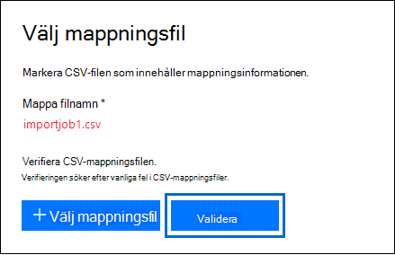

# <a name="use-drive-shipping-to-import-your-organizations-pst-files"></a><span data-ttu-id="4e716-103">Använd skicka in en hårddisk för att importera organisationens PST-filer</span><span class="sxs-lookup"><span data-stu-id="4e716-103">Use drive shipping to import your organization's PST files</span></span>

<span data-ttu-id="4e716-104">**Den här artikeln är för administratörer. Försöker du importera PST-filer till din egen postlåda? Läs [Importera e-post, kontakter och kalender från en Outlook PST-fil](https://go.microsoft.com/fwlink/p/?LinkID=785075)**</span><span class="sxs-lookup"><span data-stu-id="4e716-104">**This article is for administrators. Are you trying to import PST files to your own mailbox? See [Import email, contacts, and calendar from an Outlook .pst file](https://go.microsoft.com/fwlink/p/?LinkID=785075)**</span></span>
   
<span data-ttu-id="4e716-105">Använd tjänsten Office 365 och skicka in en hårddisk för att massimportering av PST-filer till användarnas postlådor.</span><span class="sxs-lookup"><span data-stu-id="4e716-105">Use the Office 365 Import service and drive shipping to bulk-import PST files to user mailboxes.</span></span> <span data-ttu-id="4e716-106">Skicka in en hårddisk innebär att du kopierar PST-filerna till en hårddisk och sedan skickar den fysiskt till Microsoft.</span><span class="sxs-lookup"><span data-stu-id="4e716-106">Drive shipping means that you copy the PST files to a hard disk drive and then physically ship the drive to Microsoft.</span></span> <span data-ttu-id="4e716-107">När Microsoft får hårddisken kopierar datacenterpersonal data från hårddisken till ett lagringsutrymme i Microsoft-molnet.</span><span class="sxs-lookup"><span data-stu-id="4e716-107">When Microsoft receives your hard drive, data center personnel copies the data from the hard drive to a storage area in the Microsoft cloud.</span></span> <span data-ttu-id="4e716-108">Sedan har du möjlighet att trimma de PST-data som importeras till målpostlådorna genom att ange filter som styr vilka data som importeras.</span><span class="sxs-lookup"><span data-stu-id="4e716-108">Then you have the opportunity to trim the PST data that's imported to the target mailboxes by setting filters that control what data gets imported.</span></span> <span data-ttu-id="4e716-109">När du startar importjobbet importerar importtjänsten PST-data från lagringsplatsen till användarnas postlådor.</span><span class="sxs-lookup"><span data-stu-id="4e716-109">After you start the import job, the Import service imports the PST data from the storage area to user mailboxes.</span></span> <span data-ttu-id="4e716-110">Att använda hårddiskleverans för att importera PST-filer till användarpostlådor är ett sätt att migrera organisationens e-post till Office 365.</span><span class="sxs-lookup"><span data-stu-id="4e716-110">Using drive shipping to import PST files to user mailboxes is one way to migrate your organization's email to Office 365.</span></span>
  
<span data-ttu-id="4e716-111">Här är stegen som krävs för att använda hårddiskleverans för att importera PST-filer Microsoft 365 postlådor:</span><span class="sxs-lookup"><span data-stu-id="4e716-111">Here are the steps required to use drive shipping to import PST files to Microsoft 365 mailboxes:</span></span>
  
[<span data-ttu-id="4e716-112">Steg 1: Ladda ned nyckel för säker lagring och verktyget PST-import</span><span class="sxs-lookup"><span data-stu-id="4e716-112">Step 1: Download the secure storage key and PST Import tool</span></span>](#step-1-download-the-secure-storage-key-and-pst-import-tool)

[<span data-ttu-id="4e716-113">Steg 2: Kopiera PST-filerna till hårddisken</span><span class="sxs-lookup"><span data-stu-id="4e716-113">Step 2: Copy the PST files to the hard drive</span></span>](#step-2-copy-the-pst-files-to-the-hard-drive)

[<span data-ttu-id="4e716-114">Steg 3: Skapa mappningsfilen för PST-import</span><span class="sxs-lookup"><span data-stu-id="4e716-114">Step 3: Create the PST Import mapping file</span></span>](#step-3-create-the-pst-import-mapping-file)

[<span data-ttu-id="4e716-115">Steg 4: Skapa ett PST-importjobb i Office 365</span><span class="sxs-lookup"><span data-stu-id="4e716-115">Step 4: Create a PST Import job in Office 365</span></span>](#step-4-create-a-pst-import-job-in-office-365)

[<span data-ttu-id="4e716-116">Steg 5: Skicka hårddisken till Microsoft</span><span class="sxs-lookup"><span data-stu-id="4e716-116">Step 5: Ship the hard drive to Microsoft</span></span>](#step-5-ship-the-hard-drive-to-microsoft)

[<span data-ttu-id="4e716-117">Steg 6: Filtrera data och starta PST-importjobbet</span><span class="sxs-lookup"><span data-stu-id="4e716-117">Step 6: Filter data and start the PST Import job</span></span>](#step-6-filter-data-and-start-the-pst-import-job)
  
> [!IMPORTANT]
> <span data-ttu-id="4e716-118">Du måste utföra steg 1 en gång för att läsa in säker lagringsnyckel och importverktyget.</span><span class="sxs-lookup"><span data-stu-id="4e716-118">You have to perform Step 1 once to down load the secure storage key and the import tool.</span></span> <span data-ttu-id="4e716-119">När du har utför de här stegen följer du steg 2 till steg 6 varje gång du vill skicka en hårddisk till Microsoft.</span><span class="sxs-lookup"><span data-stu-id="4e716-119">After you perform these steps, follow Step 2 through Step 6 each time you want to ship a hard drive to Microsoft.</span></span> 
  
<span data-ttu-id="4e716-120">Vanliga frågor och svar om hur du använder hårddiskleverans för att importera PST-filer till Office 365 finns i Vanliga frågor och svar om hur du använder hårddiskleverans [för att importera PST-filer.](./faqimporting-pst-files-to-office-365.yml#using-drive-shipping-to-import-pst-files)</span><span class="sxs-lookup"><span data-stu-id="4e716-120">For frequently asked questions about using drive shipping to import PST files to Office 365, see [FAQs for using drive shipping to import PST files](./faqimporting-pst-files-to-office-365.yml#using-drive-shipping-to-import-pst-files).</span></span> 
  
## <a name="before-you-import-pst-files"></a><span data-ttu-id="4e716-121">Innan du importerar PST-filer</span><span class="sxs-lookup"><span data-stu-id="4e716-121">Before you import PST files</span></span>

- <span data-ttu-id="4e716-122">Du måste vara tilldelad rollen Importera och exportera postlåda i Exchange Online importera PST-filer till Microsoft 365 postlådor.</span><span class="sxs-lookup"><span data-stu-id="4e716-122">You have to be assigned the Mailbox Import Export role in Exchange Online to import PST files to Microsoft 365 mailboxes.</span></span> <span data-ttu-id="4e716-123">Som standard är den här rollen inte tilldelad någon rollgrupp i Exchange Online.</span><span class="sxs-lookup"><span data-stu-id="4e716-123">By default, this role isn't assigned to any role group in Exchange Online.</span></span> <span data-ttu-id="4e716-124">Du kan lägga till rollen Importera och exportera postlåda i rollgruppen Organisationshantering.</span><span class="sxs-lookup"><span data-stu-id="4e716-124">You can add the Mailbox Import Export role to the Organization Management role group.</span></span> <span data-ttu-id="4e716-125">Du kan också skapa en rollgrupp, tilldela rollen Importera och exportera postlåda och sedan lägga till dig själv som medlem.</span><span class="sxs-lookup"><span data-stu-id="4e716-125">Or you can create a role group, assign the Mailbox Import Export role, and then add yourself as a member.</span></span> <span data-ttu-id="4e716-126">Mer information finns i avsnitten "Lägga till en roll i rollgrupp" och "Skapa en rollgrupp" i [Hantera rollgrupper.](/Exchange/permissions-exo/role-groups)</span><span class="sxs-lookup"><span data-stu-id="4e716-126">For more information, see the "Add a role to a role group" or the "Create a role group" sections in [Manage role groups](/Exchange/permissions-exo/role-groups).</span></span>
    
    <span data-ttu-id="4e716-127">Om du vill skapa importjobb i Säkerhets- & säkerhets- och efterlevnadscenter måste dessutom något av följande stämma:</span><span class="sxs-lookup"><span data-stu-id="4e716-127">Additionally, to create import jobs in the Security & Compliance Center, one of the following must be true:</span></span>
    
  - <span data-ttu-id="4e716-128">Du måste ha tilldelats rollen E-postmottagare i Exchange Online.</span><span class="sxs-lookup"><span data-stu-id="4e716-128">You have to be assigned the Mail Recipients role in Exchange Online.</span></span> <span data-ttu-id="4e716-129">Som standard är den här rollen tilldelad rollgrupperna Organisationshantering och Mottagarhantering.</span><span class="sxs-lookup"><span data-stu-id="4e716-129">By default, this role is assigned to the Organization Management and Recipient Management roles groups.</span></span>
    
    <span data-ttu-id="4e716-130">Eller</span><span class="sxs-lookup"><span data-stu-id="4e716-130">Or</span></span>
    
  - <span data-ttu-id="4e716-131">Du måste vara global administratör i organisationen.</span><span class="sxs-lookup"><span data-stu-id="4e716-131">You have to be a global administrator in your organization.</span></span>
    
    > [!TIP]
    > <span data-ttu-id="4e716-132">Du kan skapa en ny rollgrupp i Exchange Online som är specifikt avsedd att importera PST-filer till Office 365.</span><span class="sxs-lookup"><span data-stu-id="4e716-132">Consider creating a new role group in Exchange Online that's specifically intended for importing PST files to Office 365.</span></span> <span data-ttu-id="4e716-133">För den lägsta nivån av behörighet som krävs för att importera PST-filer tilldelar du rollerna Importera och exportera postlåda och E-postmottagare till den nya rollgruppen och lägger sedan till medlemmar.</span><span class="sxs-lookup"><span data-stu-id="4e716-133">For the minimum level of privileges required to import PST files, assign the Mailbox Import Export and Mail Recipients roles to the new role group, and then add members.</span></span> 
  
- <span data-ttu-id="4e716-134">Du måste lagra PST-filer som du vill kopiera till en hårddisk på en filserver eller delad mapp i organisationen.</span><span class="sxs-lookup"><span data-stu-id="4e716-134">You need to store the PST files that you want to copy to a hard drive on a file server or shared folder in your organization.</span></span> <span data-ttu-id="4e716-135">I steg 2 kör du verktyget Azure Import Export (WAImportExport.exe) som kopierar de PST-filer som lagras på den här filservern eller den delade mappen till hårddisken.</span><span class="sxs-lookup"><span data-stu-id="4e716-135">In Step 2, you run the Azure Import Export tool (WAImportExport.exe) that copies the PST files that are stored on this file server or shared folder to the hard drive.</span></span>

- <span data-ttu-id="4e716-136">Stora PST-filer kan påverka prestandan för PST-importprocessen.</span><span class="sxs-lookup"><span data-stu-id="4e716-136">Large PST files may impact the performance of the PST import process.</span></span> <span data-ttu-id="4e716-137">Vi rekommenderar därför att varje PST-fil du kopierar till hårddisken i steg 2 inte ska vara större än 20 GB.</span><span class="sxs-lookup"><span data-stu-id="4e716-137">So we recommend that each PST file you copy to the hard drive in Step 2 should be no larger than 20 GB.</span></span>
    
- <span data-ttu-id="4e716-138">Endast 2,5-tums SSD (Solid-state Drives) eller 2,5- eller 3,5-tums SATA II/III interna hårddiskar stöds för användning med Office 365-importtjänsten.</span><span class="sxs-lookup"><span data-stu-id="4e716-138">Only 2.5-inch solid-state drives (SSDs) or 2.5-inch or 3.5-inch SATA II/III internal hard drives are supported for use with the Office 365 Import service.</span></span> <span data-ttu-id="4e716-139">Du kan använda hårddiskar på upp till 10 TB.</span><span class="sxs-lookup"><span data-stu-id="4e716-139">You can use hard drives up to 10 TB.</span></span> <span data-ttu-id="4e716-140">För importjobb är det endast den första datavolymen på hårddisken som bearbetas.</span><span class="sxs-lookup"><span data-stu-id="4e716-140">For import jobs, only the first data volume on the hard drive will be processed.</span></span> <span data-ttu-id="4e716-141">Datavolymen måste vara formaterad med NTFS.</span><span class="sxs-lookup"><span data-stu-id="4e716-141">The data volume must be formatted with NTFS.</span></span> <span data-ttu-id="4e716-142">När du kopierar data till en hårddisk kan du ansluta den direkt med en 2,5-tums SSD- eller 2,5- eller 3,5-tums SATA II/III-koppling eller så kan du ansluta den externt med hjälp av en extern 2,5-tums SSD- eller 2,5- eller 3,5-tums SATA II/III USB-adapter.</span><span class="sxs-lookup"><span data-stu-id="4e716-142">When copying data to a hard drive, you can attach it directly using a 2.5-inch SSD or 2.5-inch or 3.5-inch SATA II/III connector or you can attach it externally using an external 2.5-inch SSD or 2.5-inch or 3.5-inch SATA II/III USB adaptor.</span></span>
    
    > [!IMPORTANT]
    > <span data-ttu-id="4e716-143">Externa hårddiskar som har en inbyggd USB-adapter stöds inte av Office 365 Import-tjänsten.</span><span class="sxs-lookup"><span data-stu-id="4e716-143">External hard drives that come with an built-in USB adaptor aren't supported by the Office 365 Import service.</span></span> <span data-ttu-id="4e716-144">Det går inte att använda disken inuti en extern hårddisks hölje.</span><span class="sxs-lookup"><span data-stu-id="4e716-144">Additionally, the disk inside the casing of an external hard drive can't be used.</span></span> <span data-ttu-id="4e716-145">Skicka inte in externa hårddiskar.</span><span class="sxs-lookup"><span data-stu-id="4e716-145">Please don't ship external hard drives.</span></span> 
  
- <span data-ttu-id="4e716-146">Hårddisken där du kopierar PST-filerna till måste vara krypterad med BitLocker.</span><span class="sxs-lookup"><span data-stu-id="4e716-146">The hard drive that you copy the PST files to must be encrypted with BitLocker.</span></span> <span data-ttu-id="4e716-147">Verktyget WAImportExport.exe som du kör i steg 2 hjälper dig att konfigurera BitLocker.</span><span class="sxs-lookup"><span data-stu-id="4e716-147">The WAImportExport.exe tool that you run in Step 2 will help you set up BitLocker.</span></span> <span data-ttu-id="4e716-148">Den genererar också en BitLocker-krypteringsnyckel som Microsofts datacenterpersonal använder för att komma åt enheten för att ladda upp PST-filer till Azure Storage-området i Microsoft-molnet.</span><span class="sxs-lookup"><span data-stu-id="4e716-148">It also generates a BitLocker encryption key that Microsoft data center personnel use to access the drive to upload the PST files to the Azure Storage area in the Microsoft cloud.</span></span>
    
- <span data-ttu-id="4e716-149">Skicka in en hårddisk är tillgänglig via en Microsoft-företagsavtal (EA).</span><span class="sxs-lookup"><span data-stu-id="4e716-149">Drive shipping is available through a Microsoft Enterprise Agreement (EA).</span></span> <span data-ttu-id="4e716-150">Hårddiskleverans är inte tillgängligt via ett MPSA-avtal (Microsoft Products and Services Agreement).</span><span class="sxs-lookup"><span data-stu-id="4e716-150">Drive shipping isn't available through a Microsoft Products and Services Agreement (MPSA).</span></span>
    
- <span data-ttu-id="4e716-151">Kostnaden för att importera PST-filer Microsoft 365 postlådor som använder leverans är 2 USD per GB data.</span><span class="sxs-lookup"><span data-stu-id="4e716-151">The cost to import PST files to Microsoft 365 mailboxes using drive shipping is $2 USD per GB of data.</span></span> <span data-ttu-id="4e716-152">Om du till exempel skickar in en hårddisk som innehåller 1 000 GB (1 TB) PST-filer är kostnaden 2 000 USD.</span><span class="sxs-lookup"><span data-stu-id="4e716-152">For example, if you ship a hard drive that contains 1,000 GB (1 TB) of PST files, the cost is $2,000 USD.</span></span> <span data-ttu-id="4e716-153">Du kan samarbeta med en partner för att betala importavgiften.</span><span class="sxs-lookup"><span data-stu-id="4e716-153">You can work with a partner to pay the import fee.</span></span> <span data-ttu-id="4e716-154">Information om hur du hittar en partner finns i [Hitta en Microsoft-partner eller återförsäljare.](../admin/manage/find-your-partner-or-reseller.md)</span><span class="sxs-lookup"><span data-stu-id="4e716-154">For information about finding a partner, see [Find your Microsoft partner or reseller](../admin/manage/find-your-partner-or-reseller.md).</span></span>
    
- <span data-ttu-id="4e716-155">Du eller din organisation måste ha ett konto hos FedEx eller DHL.</span><span class="sxs-lookup"><span data-stu-id="4e716-155">You or your organization must have an account with FedEx or DHL.</span></span>
    
  - <span data-ttu-id="4e716-156">Organisationer i USA, Brasilien och Europa måste ha FedEx-konton.</span><span class="sxs-lookup"><span data-stu-id="4e716-156">Organizations in the United States, Brazil, and Europe must have FedEx accounts.</span></span>
    
  - <span data-ttu-id="4e716-157">Organisationer i Östasien, Sydostasien, Japan, Republiken Korea och Australien måste ha DHL-konton.</span><span class="sxs-lookup"><span data-stu-id="4e716-157">Organizations in East Asia, Southeast Asia, Japan, Republic of Korea, and Australia must have DHL accounts.</span></span>
    
    <span data-ttu-id="4e716-158">Microsoft använder (och debiterar) det här kontot för att returnera hårddisken till dig.</span><span class="sxs-lookup"><span data-stu-id="4e716-158">Microsoft uses (and charges) this account to return the hard drive back to you.</span></span>
    
- <span data-ttu-id="4e716-159">Hårddisken som du skickar till Microsoft kan korsa internationella gränslinjer.</span><span class="sxs-lookup"><span data-stu-id="4e716-159">The hard drive that you ship to Microsoft may cross international borders.</span></span> <span data-ttu-id="4e716-160">I det här fallet är du ansvarig för att säkerställa att hårddisken och de data den innehåller importeras och/eller exporteras i enlighet med gällande lagstiftning.</span><span class="sxs-lookup"><span data-stu-id="4e716-160">In this case, you're responsible for ensuring that the hard drive and the data it contains are imported and/or exported in accordance with the applicable laws.</span></span> <span data-ttu-id="4e716-161">Kontrollera med dina rådgivare att din hårddisk och dina data lagligt kan skickas till det identifierade Microsoft-datacentret innan du skickar hårddisken.</span><span class="sxs-lookup"><span data-stu-id="4e716-161">Before shipping a hard drive, check with your advisors to verify that your drive and data can legally be shipped to the identified Microsoft data center.</span></span> <span data-ttu-id="4e716-162">På så sätt kan du se till att det når Microsoft i tid.</span><span class="sxs-lookup"><span data-stu-id="4e716-162">This helps to ensure that it reaches Microsoft in a timely manner.</span></span>
    
- <span data-ttu-id="4e716-163">I den här proceduren ingår att kopiera och spara en säker lagringsnyckel och BitLocker krypteringsnyckel.</span><span class="sxs-lookup"><span data-stu-id="4e716-163">This procedure involves copying and saving a secure storage key and a BitLocker encryption key.</span></span> <span data-ttu-id="4e716-164">Se till att vidta vissa åtgärder för att skydda dessa nycklar på samma sätt som du skyddar lösenord eller annan säkerhetsrelaterad information.</span><span class="sxs-lookup"><span data-stu-id="4e716-164">Be sure to take precautions to protect these keys like you would protect passwords or other security-related information.</span></span> <span data-ttu-id="4e716-165">Du kan till exempel spara dem i ett lösenordsskyddat Microsoft Word eller spara dem på en krypterad USB-enhet.</span><span class="sxs-lookup"><span data-stu-id="4e716-165">For example, you might save them to a password-protected Microsoft Word document or save them to an encrypted USB drive.</span></span> <span data-ttu-id="4e716-166">I avsnittet [Mer information](#more-information) finns ett exempel på dessa nycklar.</span><span class="sxs-lookup"><span data-stu-id="4e716-166">See the [More information](#more-information) section for an example of these keys.</span></span> 
    
- <span data-ttu-id="4e716-167">När PST-filer importerats till Microsoft 365 postlåda aktiveras inställningen för bevarande av postlådan under en obegränsad tid.</span><span class="sxs-lookup"><span data-stu-id="4e716-167">After PST files are imported to a Microsoft 365 mailbox, the retention hold setting for the mailbox is turned on for an indefinite duration.</span></span> <span data-ttu-id="4e716-168">Det innebär att bevarandeprincipen som tilldelats postlådan inte bearbetas förrän du inaktiverar bevarandet eller anger ett datum för att inaktivera bevarandet.</span><span class="sxs-lookup"><span data-stu-id="4e716-168">This means that the retention policy assigned to the mailbox won't be processed until you turn off the retention hold or set a date to turn off the hold.</span></span> <span data-ttu-id="4e716-169">Varför gör vi det här?</span><span class="sxs-lookup"><span data-stu-id="4e716-169">Why do we do this?</span></span> <span data-ttu-id="4e716-170">Om meddelanden som importerats till en postlåda är gamla kan de tas bort permanent (rensas) eftersom deras kvarhållningsperiod har upphört att gälla baserat på de bevarandeinställningar som konfigurerats för postlådan.</span><span class="sxs-lookup"><span data-stu-id="4e716-170">If messages imported to a mailbox are old, they might be permanently deleted (purged) because their retention period has expired based on the retention settings configured for the mailbox.</span></span> <span data-ttu-id="4e716-171">Om postlådan är i bevarandetid kan postlådans ägare hantera dessa nyligen importerade meddelanden eller ge dig tid att ändra bevarandeinställningarna för postlådan.</span><span class="sxs-lookup"><span data-stu-id="4e716-171">Placing the mailbox on retention hold gives the mailbox owner time to manage these newly imported messages or give you time to change the retention settings for the mailbox.</span></span> <span data-ttu-id="4e716-172">I avsnittet [Mer information finns](#more-information) förslag om hur du hanterar bevarandet.</span><span class="sxs-lookup"><span data-stu-id="4e716-172">See the [More information](#more-information) section for suggestions about managing the retention hold.</span></span> 
    
- <span data-ttu-id="4e716-173">Som standard är den största meddelandestorlek som kan tas emot av en e Microsoft 365 postlåda 35 MB.</span><span class="sxs-lookup"><span data-stu-id="4e716-173">By default, the maximum message size that can be received by a Microsoft 365 mailbox is 35 MB.</span></span> <span data-ttu-id="4e716-174">Det beror på att standardvärdet för egenskapen  *MaxReceiveSize*  för en postlåda är 35 MB.</span><span class="sxs-lookup"><span data-stu-id="4e716-174">That's because the default value for the  *MaxReceiveSize*  property for a mailbox is set to 35 MB.</span></span> <span data-ttu-id="4e716-175">Gränsen för maximal meddelandestorlek i e-postmeddelanden är Microsoft 365 150 MB.</span><span class="sxs-lookup"><span data-stu-id="4e716-175">However, the limit for the maximum message receive size in Microsoft 365 is 150 MB.</span></span> <span data-ttu-id="4e716-176">Så om du importerar en PST-fil som innehåller ett objekt som är större än 35 MB ändrar vi automatiskt värdet för egenskapen *MaxReceiveSize* i målpostlådan till 150 MB i tjänsten Office 365 Import.</span><span class="sxs-lookup"><span data-stu-id="4e716-176">So if you import a PST file that contains an item larger than 35 MB, the Office 365 Import service we will automatically change the value of the  *MaxReceiveSize*  property on the target mailbox to 150 MB.</span></span> <span data-ttu-id="4e716-177">Då kan meddelanden på upp till 150 MB importeras till användarnas postlådor.</span><span class="sxs-lookup"><span data-stu-id="4e716-177">This allows messages up to 150 MB to be imported to user mailboxes.</span></span> 
    
    > [!TIP]
    > <span data-ttu-id="4e716-178">Identifiera meddelandets mottagningsstorlek för en postlåda genom att köra det här kommandot Exchange Online PowerShell: `Get-Mailbox <user mailbox> | FL MaxReceiveSize` .</span><span class="sxs-lookup"><span data-stu-id="4e716-178">To identify the message receive size for a mailbox, you can run this command in Exchange Online PowerShell:  `Get-Mailbox <user mailbox> | FL MaxReceiveSize`.</span></span> 
  
- <span data-ttu-id="4e716-179">Du kan importera PST-filer till en inaktiv postlåda i Office 365.</span><span class="sxs-lookup"><span data-stu-id="4e716-179">You can import PST files to an inactive mailbox in Office 365.</span></span> <span data-ttu-id="4e716-180">Det gör du genom att ange GUID för den inaktiva postlådan i  `Mailbox` parametern i PST Import-mappningsfilen.</span><span class="sxs-lookup"><span data-stu-id="4e716-180">You do this by specifying the GUID of the inactive mailbox in the  `Mailbox` parameter in the PST Import mapping file.</span></span> <span data-ttu-id="4e716-181">Mer [information finns i Steg 3: Skapa mappningsfilen](#step-3-create-the-pst-import-mapping-file) för PST-import.</span><span class="sxs-lookup"><span data-stu-id="4e716-181">See [Step 3: Create the PST Import mapping file](#step-3-create-the-pst-import-mapping-file) for more information.</span></span> 
    
- <span data-ttu-id="4e716-182">I en Exchange-hybriddistribution kan du importera PST-filer till en molnbaserad arkivpostlåda för en användare vars primära postlåda är lokal.</span><span class="sxs-lookup"><span data-stu-id="4e716-182">In an Exchange hybrid deployment, you can import PST files to a cloud-based archive mailbox for a user whose primary mailbox is on-premises.</span></span> <span data-ttu-id="4e716-183">Det gör du genom att göra följande i mappningsfilen för PST-import:</span><span class="sxs-lookup"><span data-stu-id="4e716-183">You do this by doing the following in the PST Import mapping file:</span></span>
    
  - <span data-ttu-id="4e716-184">Ange e-postadressen för användarens lokala postlåda i  `Mailbox` parametern.</span><span class="sxs-lookup"><span data-stu-id="4e716-184">Specify the email address for the user's on-premises mailbox in the  `Mailbox` parameter.</span></span> 
    
  - <span data-ttu-id="4e716-185">Ange **värdet SANT** i  `IsArchive` parametern.</span><span class="sxs-lookup"><span data-stu-id="4e716-185">Specify the **TRUE** value in the  `IsArchive` parameter.</span></span> 
    
    <span data-ttu-id="4e716-186">Mer [information finns i Steg 3: Skapa mappningsfilen](#step-3-create-the-pst-import-mapping-file) för PST-import.</span><span class="sxs-lookup"><span data-stu-id="4e716-186">See [Step 3: Create the PST Import mapping file](#step-3-create-the-pst-import-mapping-file) for more information.</span></span> 

## <a name="step-1-download-the-secure-storage-key-and-pst-import-tool"></a><span data-ttu-id="4e716-187">Steg 1: Ladda ned nyckel för säker lagring och verktyget PST-import</span><span class="sxs-lookup"><span data-stu-id="4e716-187">Step 1: Download the secure storage key and PST Import tool</span></span>

<span data-ttu-id="4e716-188">Det första steget är att ladda ned den säkra lagringsnyckeln och verktyget, och att du använder det i steg 2, för att kopiera PST-filer till hårddisken.</span><span class="sxs-lookup"><span data-stu-id="4e716-188">The first step is to download the secure storage key and the tool and that you use in Step 2 to copy PST files to the hard drive.</span></span>
  
> [!IMPORTANT]
> <span data-ttu-id="4e716-189">Du måste använda Azure Import/Export tool version 1 (WAimportExportV1) för att kunna importera PST-filer med metoden för att skicka in en hårddisk.</span><span class="sxs-lookup"><span data-stu-id="4e716-189">You have to use Azure Import/Export tool version 1 (WAimportExportV1) to successfully import PST files by using the drive shipping method.</span></span> <span data-ttu-id="4e716-190">Version 2 av Azure Import/Export stöds inte och användning av det leder till att hårddisken förbereds felaktigt för importjobbet.</span><span class="sxs-lookup"><span data-stu-id="4e716-190">Version 2 of the Azure Import/Export tool isn't supported and using it will result in incorrectly preparing the hard drive for the import job.</span></span> <span data-ttu-id="4e716-191">Se till att ladda ned Azure Import/Export-verktyget från Security & Compliance Center genom att följa procedurerna i det här steget.</span><span class="sxs-lookup"><span data-stu-id="4e716-191">Be sure to download the Azure Import/Export tool from the Security & Compliance Center by following the procedures in this step.</span></span> 
  
1. <span data-ttu-id="4e716-192">Gå till [https://protection.office.com/](https://protection.office.com/) och logga in med autentiseringsuppgifterna för ett administratörskonto i din organisation.</span><span class="sxs-lookup"><span data-stu-id="4e716-192">Go to [https://protection.office.com/](https://protection.office.com/) and sign in using the credentials for an administrator account in your organization.</span></span> 
    
2. <span data-ttu-id="4e716-193">I den vänstra rutan i säkerhets- & säkerhets- och efterlevnadscenter klickar du på **Importera** PST-filer \> **med** \> **informationsstyrning.**</span><span class="sxs-lookup"><span data-stu-id="4e716-193">In the left pane of the Security & Compliance Center, click **Information governance** \> **Import** \> **Import PST files**.</span></span>
    
    > [!NOTE]
    > <span data-ttu-id="4e716-194">Som tidigare nämnts måste du ha rätt behörighet för att komma åt sidan **Importera** i Säkerhets- & säkerhets- och efterlevnadscenter.</span><span class="sxs-lookup"><span data-stu-id="4e716-194">As previously stated, you have to be assigned the appropriate permissions to access the **Import** page in the Security & Compliance Center.</span></span> 
  
3. <span data-ttu-id="4e716-195">Klicka på **Lägg till nytt importjobb** på sidan Importera  **PST-filer.**</span><span class="sxs-lookup"><span data-stu-id="4e716-195">On the **Import PST files** page, click  **New import job**.</span></span>
    
4. <span data-ttu-id="4e716-196">Ange ett namn för PST-importjobbet i guiden för importjobbet och klicka sedan på **Nästa.**</span><span class="sxs-lookup"><span data-stu-id="4e716-196">In the import job wizard, type a name for the PST import job, and then click **Next**.</span></span> <span data-ttu-id="4e716-197">Använd gemener, siffror, bindestreck och understreck.</span><span class="sxs-lookup"><span data-stu-id="4e716-197">Use lowercase letters, numbers, hyphens, and underscores.</span></span> <span data-ttu-id="4e716-198">Du kan inte använda versaler eller blanksteg i namnet.</span><span class="sxs-lookup"><span data-stu-id="4e716-198">You can't use uppercase letters or include spaces in the name.</span></span>
    
5. <span data-ttu-id="4e716-199">På sidan **Välj typ av importjobb** klickar du på Skicka hårddiskar **till en av våra fysiska platser** och klickar sedan på **Nästa.**</span><span class="sxs-lookup"><span data-stu-id="4e716-199">On the **Choose import job type** page, click **Ship hard drives to one of our physical locations** and then click **Next**.</span></span>
    
    
  
6. <span data-ttu-id="4e716-201">Gör **följande på** sidan Importera data:</span><span class="sxs-lookup"><span data-stu-id="4e716-201">On the **Import data** page, do the following two things:</span></span> 
    
    
  
    <span data-ttu-id="4e716-203">a.</span><span class="sxs-lookup"><span data-stu-id="4e716-203">a.</span></span> <span data-ttu-id="4e716-204">I steg 2 klickar du **på Kopiera nyckeln för säker lagring.**</span><span class="sxs-lookup"><span data-stu-id="4e716-204">In step 2, click **Copy the secure storage key**.</span></span> <span data-ttu-id="4e716-205">När lagringsnyckeln visas klickar du på Kopiera till **Urklipp** och klistrar sedan in den och sparar den i en fil så att du kan komma åt den senare.</span><span class="sxs-lookup"><span data-stu-id="4e716-205">After the storage key is displayed, click **Copy to clipboard** and then paste it and save it to a file so you can access it later.</span></span>
    
    <span data-ttu-id="4e716-206">b.</span><span class="sxs-lookup"><span data-stu-id="4e716-206">b.</span></span> <span data-ttu-id="4e716-207">I steg 3 laddar **du ned Azure Import/Export-verktyget för** att ladda ned och installera verktyget Azure Import/Export (version 1).</span><span class="sxs-lookup"><span data-stu-id="4e716-207">In step 3, **Download the Azure Import/Export tool** to download and install the Azure Import/Export (version 1) tool.</span></span>
    
    - <span data-ttu-id="4e716-208">I popup-fönstret klickar du på **Spara** \> **spara som för** att spara WaImportExportV1.zip i en mapp på den lokala datorn.</span><span class="sxs-lookup"><span data-stu-id="4e716-208">In the pop-up window, click **Save** \> **Save as** to save the WaImportExportV1.zip file to a folder on your local computer.</span></span> 
    
    - <span data-ttu-id="4e716-209">Extrahera WaImportExportV1.zip filen.</span><span class="sxs-lookup"><span data-stu-id="4e716-209">Extract the WaImportExportV1.zip file.</span></span>
    
7. <span data-ttu-id="4e716-210">Stäng **guiden genom** att klicka på Avbryt.</span><span class="sxs-lookup"><span data-stu-id="4e716-210">Click **Cancel** to close the wizard.</span></span> 
    
    <span data-ttu-id="4e716-211">Du kommer tillbaka till **sidan Importera** i Säkerhets- & Säkerhets- och efterlevnadscenter när du skapar importjobbet i steg 4.</span><span class="sxs-lookup"><span data-stu-id="4e716-211">You come back to the **Import** page in the Security & Compliance Center when you create the import job in Step 4.</span></span> 

## <a name="step-2-copy-the-pst-files-to-the-hard-drive"></a><span data-ttu-id="4e716-212">Steg 2: Kopiera PST-filerna till hårddisken</span><span class="sxs-lookup"><span data-stu-id="4e716-212">Step 2: Copy the PST files to the hard drive</span></span>

<span data-ttu-id="4e716-213">Nästa steg är att använda verktyget WAImportExport.exe kopiera PST-filer till hårddisken.</span><span class="sxs-lookup"><span data-stu-id="4e716-213">The next step is to use the WAImportExport.exe tool to copy PST files to the hard drive.</span></span> <span data-ttu-id="4e716-214">Verktyget krypterar hårddisken med BitLocker, kopierar PST-filer till hårddisken och skapar en journalfil som lagrar information om kopieringsprocessen.</span><span class="sxs-lookup"><span data-stu-id="4e716-214">This tool encrypts the hard drive with BitLocker, copies the PSTs to the hard drive, and creates a journal file that stores information about the copy process.</span></span> <span data-ttu-id="4e716-215">För att genomföra det här steget måste PST-filerna finnas på en filresurs eller filserver i organisationen.</span><span class="sxs-lookup"><span data-stu-id="4e716-215">To complete this step, the PST files have to be located in a file share or file server in your organization.</span></span> <span data-ttu-id="4e716-216">Det här kallas för källkatalogen i följande procedur.</span><span class="sxs-lookup"><span data-stu-id="4e716-216">This is known as the source directory in the following procedure.</span></span> 

 <span data-ttu-id="4e716-217">Som tidigare nämnts ska varje PST-fil som du kopierar till hårddisken inte vara större än 20 GB.</span><span class="sxs-lookup"><span data-stu-id="4e716-217">As previously stated, each PST file that you copy to the hard drive should be no larger than 20 GB.</span></span> <span data-ttu-id="4e716-218">PST-filer som är större än 20 GB kan påverka prestandan för PST-importen som du startar i steg 6.</span><span class="sxs-lookup"><span data-stu-id="4e716-218">PST files larger than 20 GB may impact the performance of the PST import process that you start in Step 6.</span></span>
  
> [!IMPORTANT]
> <span data-ttu-id="4e716-219">När du kör WAImportExport.exe första gången för en hårddisk måste du använda olika syntax varje gång.</span><span class="sxs-lookup"><span data-stu-id="4e716-219">After you run the WAImportExport.exe tool the first time for a hard drive, you have to use a different syntax each time after that.</span></span> <span data-ttu-id="4e716-220">Den här syntaxen förklaras i steg 4 i den här proceduren för att kopiera PST-filer till hårddisken.</span><span class="sxs-lookup"><span data-stu-id="4e716-220">This syntax is explained in step 4 of this procedure to copy PST files to the hard drive.</span></span> 
  
1. <span data-ttu-id="4e716-221">Öppna kommandotolken på den lokala datorn.</span><span class="sxs-lookup"><span data-stu-id="4e716-221">Open a Command Prompt on your local computer.</span></span>
    
    > [!TIP]
    > <span data-ttu-id="4e716-222">Om du kör kommandotolken som administratör (genom att välja Kör som administratör när du öppnar det) visas felmeddelanden i kommandotolken.</span><span class="sxs-lookup"><span data-stu-id="4e716-222">If you run the command prompt as an administrator (by selecting "Run as administrator" when you open it) error messages will be displayed in the command prompt window.</span></span> <span data-ttu-id="4e716-223">Det kan hjälpa dig att felsöka problem med att WAImportExport.exe verktyget.</span><span class="sxs-lookup"><span data-stu-id="4e716-223">This can help you troubleshoot problems running the WAImportExport.exe tool.</span></span> 
  
2. <span data-ttu-id="4e716-224">Gå till katalogen där du installerade WAImportExport.exe i steg 1.</span><span class="sxs-lookup"><span data-stu-id="4e716-224">Go to the directory where you installed the WAImportExport.exe tool in Step 1.</span></span>
    
3. <span data-ttu-id="4e716-225">Kör följande kommando första gången du använder kommandot WAImportExport.exe kopiera PST-filer till en hårddisk.</span><span class="sxs-lookup"><span data-stu-id="4e716-225">Run the following command the first time that you use the WAImportExport.exe to copy PST files to a hard drive.</span></span>

    ```powershell
    WAImportExport.exe PrepImport /j:<Name of journal file> /t:<Drive letter> /id:<Name of session> /srcdir:<Location of PST files> /dstdir:<PST file path> /sk:<Storage account key> /blobtype:BlockBlob /encrypt /logdir:<Log file location>
    ```

    <span data-ttu-id="4e716-226">I följande tabell beskrivs parametrarna och deras obligatoriska värden.</span><span class="sxs-lookup"><span data-stu-id="4e716-226">The following table describes the parameters and their required values.</span></span>
    
    |<span data-ttu-id="4e716-227">**Parameter**</span><span class="sxs-lookup"><span data-stu-id="4e716-227">**Parameter**</span></span>|<span data-ttu-id="4e716-228">**Beskrivning**</span><span class="sxs-lookup"><span data-stu-id="4e716-228">**Description**</span></span>|<span data-ttu-id="4e716-229">**Exempel**</span><span class="sxs-lookup"><span data-stu-id="4e716-229">**Example**</span></span>|
    |:-----|:-----|:-----|
    | `/j:` <br/> |<span data-ttu-id="4e716-230">Anger namnet på journalfilen.</span><span class="sxs-lookup"><span data-stu-id="4e716-230">Specifies the name of the journal file.</span></span> <span data-ttu-id="4e716-231">Den här filen sparas i samma mapp där WAImportExport.exe finns.</span><span class="sxs-lookup"><span data-stu-id="4e716-231">This file is saved to the same folder where the WAImportExport.exe tool is located.</span></span> <span data-ttu-id="4e716-232">Varje hårddisk som du skickar till Microsoft måste ha en journalfil.</span><span class="sxs-lookup"><span data-stu-id="4e716-232">Each hard drive you ship to Microsoft must have one journal file.</span></span> <span data-ttu-id="4e716-233">Varje gång du kör WAImportTool.exe för att kopiera PST-filer till en hårddisk läggs information till i journalfilen för enheten.</span><span class="sxs-lookup"><span data-stu-id="4e716-233">Every time you run the WAImportTool.exe to copy PST files to a hard drive, information will be appended to the journal file for that drive.</span></span>  <br/> <span data-ttu-id="4e716-234">Microsofts datacenterpersonal använder informationen i journalfilen för att associera hårddisken med importjobbet som du skapade i steg 4 och för att ladda upp PST-filerna till Azure Storage-området i Microsoft-molnet.</span><span class="sxs-lookup"><span data-stu-id="4e716-234">Microsoft data center personnel use the information in the journal file to associate the hard drive with the import job that you create in Step 4, and to upload the PST files to the Azure Storage area in the Microsoft cloud.</span></span>  <br/> | `/j:PSTHDD1.jrn` <br/> |
    | `/t:` <br/> |<span data-ttu-id="4e716-235">Anger enhetsbeteckningen för hårddisken när den är ansluten till den lokala datorn.</span><span class="sxs-lookup"><span data-stu-id="4e716-235">Specifies the drive letter of the hard drive when it's connected to your local computer.</span></span>  <br/> | `/t:h` <br/> |
    | `/id:` <br/> |<span data-ttu-id="4e716-236">Anger namnet på kopieringssessionen.</span><span class="sxs-lookup"><span data-stu-id="4e716-236">Specifies the name of the copy session.</span></span> <span data-ttu-id="4e716-237">En session definieras som varje gång du kör WAImportExport.exe för att kopiera filer till hårddisken.</span><span class="sxs-lookup"><span data-stu-id="4e716-237">A session is defined as each time you run the WAImportExport.exe tool to copy files to the hard drive.</span></span> <span data-ttu-id="4e716-238">PST-filerna kopieras till en mapp med sessionsnamnet som anges av den här parametern.</span><span class="sxs-lookup"><span data-stu-id="4e716-238">The PST files are copied to a folder named with the session name specified by this parameter.</span></span>  <br/> | `/id:driveship1` <br/> |
    | `/srcdir:` <br/> |<span data-ttu-id="4e716-239">Anger källkatalogen i organisationen som innehåller PST-filerna som ska kopieras under sessionen.</span><span class="sxs-lookup"><span data-stu-id="4e716-239">Specifies the source directory in your organization that contains the PST files that will be copied during the session.</span></span> <span data-ttu-id="4e716-240">Se till att omge värdet för den här parametern med dubbla citattecken (" ").</span><span class="sxs-lookup"><span data-stu-id="4e716-240">Be sure to surround the value of this parameter with double-quotation marks (" ").</span></span>  <br/> | `/srcdir:"\\FILESERVER01\PSTs"` <br/> |
    | `/dstdir:` <br/> |<span data-ttu-id="4e716-241">Anger målkatalogen i det Azure Storage i Microsoft-molnet dit PST-filer ska laddas upp.</span><span class="sxs-lookup"><span data-stu-id="4e716-241">Specifies the destination directory in the Azure Storage area in the Microsoft cloud where the PSTs will be uploaded.</span></span> <span data-ttu-id="4e716-242">Du måste använda värdet  `ingestiondata/` .</span><span class="sxs-lookup"><span data-stu-id="4e716-242">You must use the value  `ingestiondata/`.</span></span> <span data-ttu-id="4e716-243">Se till att omge värdet för den här parametern med dubbla citattecken (" ").</span><span class="sxs-lookup"><span data-stu-id="4e716-243">Be sure to surround the value of this parameter with double-quotation marks (" ").</span></span>  <br/> <span data-ttu-id="4e716-244">Du kan också lägga till en extra sökväg till parameterns värde.</span><span class="sxs-lookup"><span data-stu-id="4e716-244">Optionally, you can also add an extra file path to the value of this parameter.</span></span> <span data-ttu-id="4e716-245">Du kan till exempel använda filsökvägen för källkatalogen på hårddisken (konverteras till ett URL-format), som anges i  `/srcdir:` parametern.</span><span class="sxs-lookup"><span data-stu-id="4e716-245">For example, you can use the file path of the source directory on the hard drive (converted to a URL format), which is specified in the  `/srcdir:` parameter.</span></span> <span data-ttu-id="4e716-246">Ändras till  `\\FILESERVER01\PSTs` exempel till  `FILESERVER01/PSTs` .</span><span class="sxs-lookup"><span data-stu-id="4e716-246">For example,  `\\FILESERVER01\PSTs` is changed to  `FILESERVER01/PSTs`.</span></span> <span data-ttu-id="4e716-247">I det här fallet måste du fortfarande inkludera  `ingestiondata` i sökvägen.</span><span class="sxs-lookup"><span data-stu-id="4e716-247">In this case, you still must include  `ingestiondata` in the file path.</span></span> <span data-ttu-id="4e716-248">I det här exemplet skulle parametervärdet  `/dstdir:` alltså vara  `"ingestiondata/FILESERVER01/PSTs"` .</span><span class="sxs-lookup"><span data-stu-id="4e716-248">So in this example, the value for the  `/dstdir:` parameter would be  `"ingestiondata/FILESERVER01/PSTs"`.</span></span>  <br/> <span data-ttu-id="4e716-249">En orsak till att lägga till den extra sökvägen är om du har PSTs-filer med samma filnamn.</span><span class="sxs-lookup"><span data-stu-id="4e716-249">One reason to add the additional file path is if you have PSTs files with the same filename.</span></span>  <br/> <span data-ttu-id="4e716-250">> [!NOTE]> Om du tar med den valfria sökvägen innehåller namnområdet för en PST-fil efter att den laddats upp till Azure Storage-området sökvägen och namnet på PST-filen. till exempel `FILESERVER01/PSTs/annb.pst` .</span><span class="sxs-lookup"><span data-stu-id="4e716-250">> [!NOTE]> If you include the optional pathname, the namespace for a PST file after it's uploaded to the Azure Storage area includes the pathname and the name of the PST file; for example,  `FILESERVER01/PSTs/annb.pst`.</span></span> <span data-ttu-id="4e716-251">Om du inte har ett sökväg är namnområdet bara PST-filnamnet. till exempel  `annb.pst` .</span><span class="sxs-lookup"><span data-stu-id="4e716-251">If you don't include a pathname, the namespace is only the PST filename; for example  `annb.pst`.</span></span>           | `/dstdir:"ingestiondata/"` <br/> <span data-ttu-id="4e716-252">Eller</span><span class="sxs-lookup"><span data-stu-id="4e716-252">Or</span></span>  <br/>  `/dstdir:"ingestiondata/FILESERVER01/PSTs"` <br/> |
    | `/sk:` <br/> |<span data-ttu-id="4e716-253">Anger lagringskontonyckeln som du fick i steg 1.</span><span class="sxs-lookup"><span data-stu-id="4e716-253">Specifies the storage account key that you obtained in Step 1.</span></span> <span data-ttu-id="4e716-254">Se till att omge värdet för den här parametern med dubbla citattecken (" ").</span><span class="sxs-lookup"><span data-stu-id="4e716-254">Be sure to surround the value of this parameter with double-quotation marks (" ").</span></span>  <br/> | `"yaNIIs9Uy5g25Yoak+LlSHfqVBGOeNwjqtBEBGqRMoidq6/e5k/VPkjOXdDIXJHxHvNoNoFH5NcVUJXHwu9ZxQ=="` <br/> |
    | `/blobtype:` <br/> |Anger vilken typ av blobbar i området Azure Storage ska importera PST-filerna till. För att importera PST-filer använder du värdet **BlockBlob.** <span data-ttu-id="4e716-257">Den här parametern är obligatorisk.</span><span class="sxs-lookup"><span data-stu-id="4e716-257">This parameter is required.</span></span>   <br/> | `/blobtype:BlockBlob` <br/> |
    | `/encrypt` <br/> |<span data-ttu-id="4e716-258">Den här växeln BitLocker för hårddisken.</span><span class="sxs-lookup"><span data-stu-id="4e716-258">This switch turns on BitLocker for the hard drive.</span></span> <span data-ttu-id="4e716-259">Den här parametern krävs första gången du kör det WAImportExport.exe verktyget.</span><span class="sxs-lookup"><span data-stu-id="4e716-259">This parameter is required the first time you run the WAImportExport.exe tool.</span></span>  <br/> <span data-ttu-id="4e716-260">Krypteringsnyckeln BitLocker kopieras till journalfilen och loggfilen som skapas om du använder `/logfile:` parametern.</span><span class="sxs-lookup"><span data-stu-id="4e716-260">The BitLocker encryption key is copied to the journal file and the log file that is created if you use the  `/logfile:` parameter.</span></span> <span data-ttu-id="4e716-261">Som tidigare förklarats sparas journalfilen i samma mapp där WAImportExport.exe finns.</span><span class="sxs-lookup"><span data-stu-id="4e716-261">As previously explained, the journal file is saved to the same folder where the WAImportExport.exe tool is located.</span></span>  <br/> | `/encrypt` <br/> |
    | `/logdir:` <br/> |<span data-ttu-id="4e716-262">Den här valfria parametern anger en mapp där loggfilerna ska sparas.</span><span class="sxs-lookup"><span data-stu-id="4e716-262">This optional parameter specifies a folder to save log files to.</span></span> <span data-ttu-id="4e716-263">Om den inte anges sparas loggfilerna i samma mapp där WAImportExport.exe finns.</span><span class="sxs-lookup"><span data-stu-id="4e716-263">If not specified, the log files are saved to the same folder where the WAImportExport.exe tool is located.</span></span> <span data-ttu-id="4e716-264">Se till att omge värdet för den här parametern med dubbla citattecken (" ").</span><span class="sxs-lookup"><span data-stu-id="4e716-264">Be sure to surround the value of this parameter with double-quotation marks (" ").</span></span>  <br/> | `/logdir:"c:\users\admin\desktop\PstImportLogs"` <br/> |
   
    <span data-ttu-id="4e716-265">Här är ett exempel på syntaxen för verktyget WAImportExport.exe faktiska värden för varje parameter:</span><span class="sxs-lookup"><span data-stu-id="4e716-265">Here's an example of the syntax for the WAImportExport.exe tool using actual values for each parameter:</span></span>
    
    ```powershell
    WAImportExport.exe PrepImport /j:PSTHDD1.jrn /t:f /id:driveship1 /srcdir:"\\FILESERVER01\PSTs" /dstdir:"ingestiondata/" /sk:"yaNIIs9Uy5g25Yoak+LlSHfqVBGOeNwjqtBEBGqRMoidq6/e5k/VPkjOXdDIXJHxHvNoNoFH5NcVUJXHwu9ZxQ==" blobtype:BlockBlob /encrypt /logdir:"c:\users\admin\desktop\PstImportLogs"
    ```

    <span data-ttu-id="4e716-266">När du har kört kommandot visas statusmeddelanden som visar förloppet för kopiering av PST-filer till hårddisken.</span><span class="sxs-lookup"><span data-stu-id="4e716-266">After you run the command, status messages are displayed that show the progress of copying the PST files to the hard drive.</span></span> <span data-ttu-id="4e716-267">Ett slutligt statusmeddelande visar det totala antalet filer som har kopierats.</span><span class="sxs-lookup"><span data-stu-id="4e716-267">A final status message shows the total number of files that were successfully copied.</span></span>
    
4. <span data-ttu-id="4e716-268">Kör det här kommandot varje gång du kör verktyget WAImportExport.ext för att kopiera PST-filer till samma hårddisk.</span><span class="sxs-lookup"><span data-stu-id="4e716-268">Run this command each subsequent time you run the WAImportExport.ext tool to copy PST files to the same hard drive.</span></span>

    ```powershell
    WAImportExport.exe PrepImport /j:<Name of journal file> /id:<Name of new session> /srcdir:<Location of PST files> /dstdir:<PST file path> /blobtype:BlockBlob 
    ```

    <span data-ttu-id="4e716-269">Här är ett exempel på syntaxen för att köra efterföljande sessioner för att kopiera PST-filer till samma hårddisk.</span><span class="sxs-lookup"><span data-stu-id="4e716-269">Here's an example of the syntax for running subsequent sessions to copy PST files to the same hard drive.</span></span>

    ```powershell
    WAImportExport.exe PrepImport /j:PSTHDD1.jrn /id:driveship2 /srcdir:"\\FILESERVER01\PSTs\SecondBatch" /dstdir:"ingestiondata/" /blobtype:BlockBlob
    ```

## <a name="step-3-create-the-pst-import-mapping-file"></a><span data-ttu-id="4e716-270">Steg 3: Skapa mappningsfilen för PST-import</span><span class="sxs-lookup"><span data-stu-id="4e716-270">Step 3: Create the PST Import mapping file</span></span>

<span data-ttu-id="4e716-271">När Microsofts datacenterpersonal har laddat upp PST-filerna från hårddisken till Azure Storage-området använder importtjänsten informationen i PST-importmappningsfilen, som är en fil med kommaavgränsade värden (CSV), som anger till vilka användarpostlådor PST-filerna importeras.</span><span class="sxs-lookup"><span data-stu-id="4e716-271">After Microsoft data center personnel upload the PST files from the hard drive to the Azure Storage area, the Import service will use the information in the PST Import mapping file, which is a comma-separated value (CSV) file, that specifies which user mailboxes the PST files are imported to.</span></span> <span data-ttu-id="4e716-272">Du skickar den här CSV-filen i nästa steg när du skapar ett PST-importjobb.</span><span class="sxs-lookup"><span data-stu-id="4e716-272">You will submit this CSV file in the next step when you create a PST Import job.</span></span>
  
1. <span data-ttu-id="4e716-273">[Ladda ned en kopia av mappningsfilen för PST-import.](https://go.microsoft.com/fwlink/p/?LinkId=544717)</span><span class="sxs-lookup"><span data-stu-id="4e716-273">[Download a copy of the PST Import mapping file](https://go.microsoft.com/fwlink/p/?LinkId=544717).</span></span>
    
2. <span data-ttu-id="4e716-274">Öppna eller spara CSV-filen på den lokala datorn.</span><span class="sxs-lookup"><span data-stu-id="4e716-274">Open or save the CSV file to your local computer.</span></span> <span data-ttu-id="4e716-275">I följande exempel visas en slutförd mappningsfil för PST-import (öppnad i Anteckningar).</span><span class="sxs-lookup"><span data-stu-id="4e716-275">The following example shows a completed PST Import mapping file (opened in NotePad).</span></span> <span data-ttu-id="4e716-276">Det är mycket enklare att använda Microsoft Excel att redigera CSV-filen.</span><span class="sxs-lookup"><span data-stu-id="4e716-276">It's much easier to use Microsoft Excel to edit the CSV file.</span></span>

    ```text
    Workload,FilePath,Name,Mailbox,IsArchive,TargetRootFolder,ContentCodePage,SPFileContainer,SPManifestContainer,SPSiteUrl
    Exchange,FILESERVER01/PSTs,annb.pst,annb@contoso.onmicrosoft.com,FALSE,/,,,,
    Exchange,FILESERVER01/PSTs,annb_archive.pst,annb@contoso.onmicrosoft.com,TRUE,/ImportedPst,,,,
    Exchange,FILESERVER01/PSTs,donh.pst,donh@contoso.onmicrosoft.com,FALSE,/,,,,
    Exchange,FILESERVER01/PSTs,donh_archive.pst,donh@contoso.onmicrosoft.com,TRUE,/ImportedPst,,,,
    Exchange,FILESERVER01/PSTs,pilarp.pst,pilarp@contoso.onmicrosoft.com,FALSE,/,,,,
    Exchange,FILESERVER01/PSTs,pilarp_archive.pst,pilarp@contoso.onmicrosoft.com,TRUE,/ImportedPst,,,,
    Exchange,,tonyk.pst,tonyk@contoso.onmicrosoft.com,FALSE,/,,,,
    Exchange,,tonyk_archive.pst,tonyk@contoso.onmicrosoft.com,TRUE,,,,,
    Exchange,,zrinkam.pst,zrinkam@contoso.onmicrosoft.com,FALSE,/,,,,
    Exchange,,zrinkam_archive.pst,zrinkam@contoso.onmicrosoft.com,TRUE,,,,,
    ```

    <span data-ttu-id="4e716-277">CSV-filens första rad, eller rubrikraden, innehåller de parametrar som kommer att användas av PST-importtjänsten för att importera PST-filerna till användarnas postlådor.</span><span class="sxs-lookup"><span data-stu-id="4e716-277">The first row, or header row, of the CSV file lists the parameters that will be used by the PST Import service to import the PST files to user mailboxes.</span></span> <span data-ttu-id="4e716-278">Varje parameternamn avgränsas av ett kommatecken.</span><span class="sxs-lookup"><span data-stu-id="4e716-278">Each parameter name is separated by a comma.</span></span> <span data-ttu-id="4e716-279">Varje rad under rubrikraden representerar parametervärdena för import av en PST-fil till en viss postlåda.</span><span class="sxs-lookup"><span data-stu-id="4e716-279">Each row under the header row represents the parameter values for importing a PST file to a specific mailbox.</span></span> <span data-ttu-id="4e716-280">Du behöver en rad för varje PST-fil som kopierades till hårddisken.</span><span class="sxs-lookup"><span data-stu-id="4e716-280">You need a row for each PST file that was copied to the hard drive.</span></span> <span data-ttu-id="4e716-281">Se till att ersätta platshållardata i mappningsfilen med faktiska data.</span><span class="sxs-lookup"><span data-stu-id="4e716-281">Be sure to replace the placeholder data in the mapping file with your actual data.</span></span>

    > [!NOTE]
    > <span data-ttu-id="4e716-282">Ändra inget i rubrikraden, inklusive parametrarna SharePoint rubrikraden. de ignoreras under PST-importen.</span><span class="sxs-lookup"><span data-stu-id="4e716-282">Don't change anything in the header row, including the SharePoint parameters; they will be ignored during the PST Import process.</span></span> 
  
3. <span data-ttu-id="4e716-283">Använd informationen i följande tabell för att fylla CSV-filen med den information som behövs.</span><span class="sxs-lookup"><span data-stu-id="4e716-283">Use the information in the following table to populate the CSV file with the required information.</span></span>
    
    |<span data-ttu-id="4e716-284">**Parameter**</span><span class="sxs-lookup"><span data-stu-id="4e716-284">**Parameter**</span></span>|<span data-ttu-id="4e716-285">**Beskrivning**</span><span class="sxs-lookup"><span data-stu-id="4e716-285">**Description**</span></span>|<span data-ttu-id="4e716-286">**Exempel**</span><span class="sxs-lookup"><span data-stu-id="4e716-286">**Example**</span></span>|
    |:-----|:-----|:-----|
    | `Workload` <br/> |<span data-ttu-id="4e716-287">Anger vilken tjänst som data ska importeras till.</span><span class="sxs-lookup"><span data-stu-id="4e716-287">Specifies the service that data will be imported to.</span></span> <span data-ttu-id="4e716-288">Importera PST-filer till användarnas postlådor med hjälp av  `Exchange` .</span><span class="sxs-lookup"><span data-stu-id="4e716-288">To import PST files to user mailboxes, use  `Exchange`.</span></span>  <br/> | `Exchange` <br/> |
    | `FilePath` <br/> | <span data-ttu-id="4e716-289">Anger mappplatsen i området Azure Storage som PST-filer kopieras till när hårddisken levereras till Microsoft.</span><span class="sxs-lookup"><span data-stu-id="4e716-289">Specifies the folder location in the Azure Storage area that PST files will be copied to when the hard drive is shipped to Microsoft.</span></span>  <br/>  <span data-ttu-id="4e716-290">Vad du lägger till i den här kolumnen i CSV-filen beror på vad du angav  `/dstdir:` för parametern i föregående steg.</span><span class="sxs-lookup"><span data-stu-id="4e716-290">What you add in this column in the CSV file depends on what you specified in for the  `/dstdir:` parameter in the previous step.</span></span> <span data-ttu-id="4e716-291">Om det finns undermappar på källplatsen måste värdet i parametern innehålla den relativa sökvägen för undermappen, till exempel `FilePath` /mapp1/användare1/.</span><span class="sxs-lookup"><span data-stu-id="4e716-291">If you have subfolders on the source location, then the value in the `FilePath` parameter must contain the relative path for the subfolder; for example, /folder1/user1/.</span></span>  <br/>  <span data-ttu-id="4e716-292">Om du använde  `/dstdir:"ingestiondata/"` lämna den här parametern tom i CSV-filen.</span><span class="sxs-lookup"><span data-stu-id="4e716-292">If you used  `/dstdir:"ingestiondata/"`, then leave this parameter blank in the CSV file.</span></span>  <br/>  <span data-ttu-id="4e716-293">Om du inkluderade ett valfritt sökväg för parameterns värde (till exempel , använder du det sökvägen (utan att inkludera  `/dstdir:`  `/dstdir:"ingestiondata/FILESERVER01/PSTs"` "ingestiondata") för den här parametern i CSV-filen.</span><span class="sxs-lookup"><span data-stu-id="4e716-293">If you included an optional pathname for the value of the  `/dstdir:` parameter (for example,  `/dstdir:"ingestiondata/FILESERVER01/PSTs"`, then use that pathname (not including "ingestiondata") for this parameter in the CSV file.</span></span> <span data-ttu-id="4e716-294">Värdet för den här parametern är fallkänsligt.</span><span class="sxs-lookup"><span data-stu-id="4e716-294">The value for this parameter is case-sensitive.</span></span>  <br/>  <span data-ttu-id="4e716-295">Oavsett vilket så *ska du inte* inkludera "ingestiondata" i parametervärdet. `FilePath`</span><span class="sxs-lookup"><span data-stu-id="4e716-295">Either way,  *don't*  include "ingestiondata" in the value for the  `FilePath` parameter.</span></span> <span data-ttu-id="4e716-296">Lämna parametern tom eller ange bara det valfria sökvägen.</span><span class="sxs-lookup"><span data-stu-id="4e716-296">Leave this parameter blank or specify only the optional pathname.</span></span>  <br/> <span data-ttu-id="4e716-297">> [!IMPORTANT]> Namnet på sökvägen för filen måste vara samma sak som du angav  `/dstdir:` i parametern i föregående steg.</span><span class="sxs-lookup"><span data-stu-id="4e716-297">> [!IMPORTANT]>  The case for the file path name must be the same case that you specified in the  `/dstdir:` parameter in the previous step.</span></span> <span data-ttu-id="4e716-298">Om du till exempel använde för undermappens namn i föregående steg, men sedan använde den i parametern i  `"ingestiondata/FILESERVER01/PSTs"`  `fileserver01/psts`  `FilePath` CSV-filen, misslyckas importen för PST-filen.</span><span class="sxs-lookup"><span data-stu-id="4e716-298">For example, if you used  `"ingestiondata/FILESERVER01/PSTs"` for the subfolder name in the previous step, but then used  `fileserver01/psts` in the  `FilePath` parameter in CSV file, the import for the PST file will fail.</span></span> <span data-ttu-id="4e716-299">Se till att använda samma ärende i båda instanserna.</span><span class="sxs-lookup"><span data-stu-id="4e716-299">Be sure to use the same case in both instances.</span></span>           |<span data-ttu-id="4e716-300">(lämna tomt)</span><span class="sxs-lookup"><span data-stu-id="4e716-300">(leave blank)</span></span>  <br/> <span data-ttu-id="4e716-301">Eller</span><span class="sxs-lookup"><span data-stu-id="4e716-301">Or</span></span>  <br/>  `FILESERVER01/PSTs` <br/> |
    | `Name` <br/> |<span data-ttu-id="4e716-302">Anger namnet på pst-filen som ska importeras till användarpostlådan.</span><span class="sxs-lookup"><span data-stu-id="4e716-302">Specifies the name of the PST file that will be imported to the user mailbox.</span></span> <span data-ttu-id="4e716-303">Värdet för den här parametern är fallkänsligt.</span><span class="sxs-lookup"><span data-stu-id="4e716-303">The value for this parameter is case-sensitive.</span></span>  <br/> <span data-ttu-id="4e716-304">> [!IMPORTANT]> Namnet på PST-filen i CSV-filen måste vara detsamma som den PST-fil som laddades upp till platsen för Azure Storage i steg 2.</span><span class="sxs-lookup"><span data-stu-id="4e716-304">> [!IMPORTANT]> The case for the PST file name in the CSV file must be the same as the PST file that was uploaded to the Azure Storage location in Step 2.</span></span> <span data-ttu-id="4e716-305">Om du till exempel använder i parametern i CSV-filen, men namnet på den faktiska PST-filen är , misslyckas importen för den  `annb.pst`  `Name`  `AnnB.pst` PST-filen.</span><span class="sxs-lookup"><span data-stu-id="4e716-305">For example, if you use  `annb.pst` in the  `Name` parameter in the CSV file, but the name of the actual PST file is  `AnnB.pst`, the import for that PST file will fail.</span></span> <span data-ttu-id="4e716-306">Se till att namnet på PST i CSV-filen använder samma sak som den faktiska PST-filen.</span><span class="sxs-lookup"><span data-stu-id="4e716-306">Be sure that the name of the PST in the CSV file uses the same case as the actual PST file.</span></span>           | `annb.pst` <br/> |
    | `Mailbox` <br/> |<span data-ttu-id="4e716-307">Anger e-postadressen till postlådan som PST-filen ska importeras till.</span><span class="sxs-lookup"><span data-stu-id="4e716-307">Specifies the email address of the mailbox that the PST file will be imported to.</span></span> <span data-ttu-id="4e716-308">Du kan inte ange en offentlig mapp eftersom PST-importtjänsten inte har stöd för att importera PST-filer till gemensamma mappar.</span><span class="sxs-lookup"><span data-stu-id="4e716-308">You can't specify a public folder because the PST Import Service doesn't support importing PST files to public folders.</span></span>  <br/> <span data-ttu-id="4e716-309">Om du vill importera en PST-fil till en inaktiv postlåda måste du ange postlådans GUID för den här parametern.</span><span class="sxs-lookup"><span data-stu-id="4e716-309">To import a PST file to an inactive mailbox, you have to specify the mailbox GUID for this parameter.</span></span> <span data-ttu-id="4e716-310">Om du vill ha det här GUID:t kör du följande PowerShell-kommando i Exchange Online:`Get-Mailbox <identity of inactive mailbox> -InactiveMailboxOnly | FL Guid`</span><span class="sxs-lookup"><span data-stu-id="4e716-310">To obtain this GUID, run the following PowerShell command in Exchange Online:  `Get-Mailbox <identity of inactive mailbox> -InactiveMailboxOnly | FL Guid`</span></span> <br/> <span data-ttu-id="4e716-311">> [!NOTE]> Ibland kan du ha flera postlådor med samma e-postadress, där en postlåda är en aktiv postlåda och den andra är i ett mjukt borttagna (eller inaktiva) tillstånd.</span><span class="sxs-lookup"><span data-stu-id="4e716-311">> [!NOTE]> Sometimes, you may have multiple mailboxes with the same email address, where one mailbox is an active mailbox and the other mailbox is in a soft-deleted (or inactive) state.</span></span> <span data-ttu-id="4e716-312">I sådana fall måste du ange ett GUID för postlådan som unikt identifierar postlådan som PST-filen ska importeras till.</span><span class="sxs-lookup"><span data-stu-id="4e716-312">In these situations, you have to specify the mailbox GUID to uniquely identify the mailbox to import the PST file to.</span></span> <span data-ttu-id="4e716-313">Om du vill ha det här GUID för aktiva postlådor kör du följande PowerShell-kommando:  `Get-Mailbox <identity of active mailbox> | FL Guid` .</span><span class="sxs-lookup"><span data-stu-id="4e716-313">To obtain this GUID for active mailboxes, run the following PowerShell command:  `Get-Mailbox <identity of active mailbox> | FL Guid`.</span></span> <span data-ttu-id="4e716-314">Om du vill hämta GUID för mjukt borttagna (eller inaktiva) postlådor kör du det här kommandot:  `Get-Mailbox <identity of soft-deleted or inactive mailbox> -SoftDeletedMailbox | FL Guid` .</span><span class="sxs-lookup"><span data-stu-id="4e716-314">To obtain the GUID for soft-deleted (or inactive) mailboxes, run this command:  `Get-Mailbox <identity of soft-deleted or inactive mailbox> -SoftDeletedMailbox | FL Guid`.</span></span>           | `annb@contoso.onmicrosoft.com` <br/> <span data-ttu-id="4e716-315">Eller</span><span class="sxs-lookup"><span data-stu-id="4e716-315">Or</span></span>  <br/>  `2d7a87fe-d6a2-40cc-8aff-1ebea80d4ae7` <br/> |
    | `IsArchive` <br/> | <span data-ttu-id="4e716-316">Anger om PST-filen ska importeras till användarens arkivpostlåda.</span><span class="sxs-lookup"><span data-stu-id="4e716-316">Specifies whether to import the PST file to the user's archive mailbox.</span></span> <span data-ttu-id="4e716-317">Det finns två alternativ:</span><span class="sxs-lookup"><span data-stu-id="4e716-317">There are two options:</span></span>  <br/> <span data-ttu-id="4e716-318">**FALSE** Importerar PST-filen till användarens primära postlåda.</span><span class="sxs-lookup"><span data-stu-id="4e716-318">**FALSE** Imports the PST file to the user's primary mailbox.</span></span>  <br/> <span data-ttu-id="4e716-319">**TRUE** Importerar PST-filen till användarens arkivpostlåda.</span><span class="sxs-lookup"><span data-stu-id="4e716-319">**TRUE** Imports the PST file to the user's archive mailbox.</span></span> <span data-ttu-id="4e716-320">Detta förutsätter att [användarens arkivpostlåda har aktiverats.](enable-archive-mailboxes.md)</span><span class="sxs-lookup"><span data-stu-id="4e716-320">This assumes that the [user's archive mailbox is enabled](enable-archive-mailboxes.md).</span></span> <span data-ttu-id="4e716-321">Om du ställer in den här parametern på och användarens arkivpostlåda inte är aktiverad kommer  `TRUE` importen för den användaren att misslyckas.</span><span class="sxs-lookup"><span data-stu-id="4e716-321">If you set this parameter to  `TRUE` and the user's archive mailbox isn't enabled, the import for that user will fail.</span></span> <span data-ttu-id="4e716-322">Om en import misslyckas för en användare (eftersom arkivet inte är aktiverat och den här egenskapen anges till ) påverkas inte de andra användarna i  `TRUE` importjobbet.</span><span class="sxs-lookup"><span data-stu-id="4e716-322">If an import fails for one user (because their archive isn't enabled and this property is set to  `TRUE`), the other users in the import job won't be affected.</span></span>  <br/>  <span data-ttu-id="4e716-323">Om du låter parametern vara tom importeras PST-filen till användarens primära postlåda.</span><span class="sxs-lookup"><span data-stu-id="4e716-323">If you leave this parameter blank, the PST file is imported to the user's primary mailbox.</span></span>  <br/> <span data-ttu-id="4e716-324">**Obs!** Om du vill importera en PST-fil till en molnbaserad arkivpostlåda för en användare vars primära postlåda är lokal, anger du bara för den här parametern och e-postadressen till användarens lokala postlåda för  `TRUE`  `Mailbox` parametern.</span><span class="sxs-lookup"><span data-stu-id="4e716-324">**Note:** To import a PST file to a cloud-based archive mailbox for a user whose primary mailbox is on-premises, just specify  `TRUE` for this parameter and specify the email address for the user's on-premises mailbox for the  `Mailbox` parameter.</span></span>  <br/> | `FALSE` <br/> <span data-ttu-id="4e716-325">Eller</span><span class="sxs-lookup"><span data-stu-id="4e716-325">Or</span></span>  <br/>  `TRUE` <br/> |
    | `TargetRootFolder` <br/> | <span data-ttu-id="4e716-326">Anger postlådans mapp som PST-filen importeras till.</span><span class="sxs-lookup"><span data-stu-id="4e716-326">Specifies the mailbox folder that the PST file is imported to.</span></span>  <br/>  <span data-ttu-id="4e716-327">Om du låter den här parametern vara tom  importeras PST-filen till en ny mapp med namnet Importerad, på rotnivån i postlådan (samma nivå som mappen Inkorgen och de andra standardmapparna i postlådan).</span><span class="sxs-lookup"><span data-stu-id="4e716-327">If you leave this parameter blank, the PST will be imported to a new folder named **Imported** located at the root level of the mailbox (the same level as the Inbox folder and the other default mailbox folders).</span></span>  <br/>  <span data-ttu-id="4e716-328">Om du  `/` anger importeras objekt i PST-filen direkt till användarens inkorgsmapp.</span><span class="sxs-lookup"><span data-stu-id="4e716-328">If you specify  `/`, items in the PST file will be imported directly in to the user's Inbox folder.</span></span>  <br/>  <span data-ttu-id="4e716-329">Om du anger  `/<foldername>` kommer objekt i PST-filen att importeras till en mapp med namnet  *\<foldername\>* .</span><span class="sxs-lookup"><span data-stu-id="4e716-329">If you specify  `/<foldername>`, items in the PST file will be imported to a folder named  *\<foldername\>*.</span></span> <span data-ttu-id="4e716-330">Om du till exempel använder  `/ImportedPst` , importeras objekt till en mapp med namnet **ImportedPst**.</span><span class="sxs-lookup"><span data-stu-id="4e716-330">For example, if you use  `/ImportedPst`, items would be imported to a folder named **ImportedPst**.</span></span> <span data-ttu-id="4e716-331">Den här mappen finns i användarens postlåda på samma nivå som mappen Inkorgen.</span><span class="sxs-lookup"><span data-stu-id="4e716-331">This folder will be located in the user's mailbox at the same level as the Inbox folder.</span></span>  <br/> |<span data-ttu-id="4e716-332">(lämna tomt)</span><span class="sxs-lookup"><span data-stu-id="4e716-332">(leave blank)</span></span>  <br/> <span data-ttu-id="4e716-333">Eller</span><span class="sxs-lookup"><span data-stu-id="4e716-333">Or</span></span>  <br/>  `/` <br/> <span data-ttu-id="4e716-334">Eller</span><span class="sxs-lookup"><span data-stu-id="4e716-334">Or</span></span>  <br/>  `/ImportedPst` <br/> |
    | `ContentCodePage` <br/> |<span data-ttu-id="4e716-335">Den här valfria parametern anger ett numeriskt värde för den kodsida som ska användas för att importera PST-filer i ANSI-filformatet.</span><span class="sxs-lookup"><span data-stu-id="4e716-335">This optional parameter specifies a numeric value for the code page to use for importing PST files in the ANSI file format.</span></span> <span data-ttu-id="4e716-336">Den här parametern används för att importera PST-filer från kinesiska, japanska och koreanska (CJK) organisationer eftersom dessa språk vanligtvis använder en DBCS-teckenuppsättning (Double Byte Character Set) för teckenkodning.</span><span class="sxs-lookup"><span data-stu-id="4e716-336">This parameter is used for importing PST files from Chinese, Japanese, and Korean (CJK) organizations because these languages typically use a double byte character set (DBCS) for character encoding.</span></span> <span data-ttu-id="4e716-337">Om den här parametern inte används för att importera PST-filer för språk som använder DBCS för postlådemappnamn är mappnamnen ofta förvrängda när de har importerats.</span><span class="sxs-lookup"><span data-stu-id="4e716-337">If this parameter isn't used to import PST files for languages that use DBCS for mailbox folder names, the folder names are often garbled after they're imported.</span></span>  <br/> <span data-ttu-id="4e716-338">En lista över värden som stöds för den här parametern finns i [Kodsideidentifierare](/windows/win32/intl/code-page-identifiers).</span><span class="sxs-lookup"><span data-stu-id="4e716-338">For a list of supported values to use for this parameter, see [Code Page Identifiers](/windows/win32/intl/code-page-identifiers).</span></span>  <br/> <span data-ttu-id="4e716-339">> [!NOTE]> ovan är det här en valfri parameter och du behöver inte inkludera den i CSV-filen.</span><span class="sxs-lookup"><span data-stu-id="4e716-339">> [!NOTE]> As previously stated, this is an optional parameter and you don't have to include it in the CSV file.</span></span> <span data-ttu-id="4e716-340">Du kan också ta med det och lämna värdet tomt för en eller flera rader.</span><span class="sxs-lookup"><span data-stu-id="4e716-340">Or you can include it and leave the value blank for one or more rows.</span></span>           |<span data-ttu-id="4e716-341">(lämna tomt)</span><span class="sxs-lookup"><span data-stu-id="4e716-341">(leave blank)</span></span>  <br/> <span data-ttu-id="4e716-342">Eller</span><span class="sxs-lookup"><span data-stu-id="4e716-342">Or</span></span>  <br/>  <span data-ttu-id="4e716-343">`932` (som är kodsidans identifierare för ANSI-/OEM-japanska)</span><span class="sxs-lookup"><span data-stu-id="4e716-343">`932` (which is the code page identifier for ANSI/OEM Japanese)</span></span>  <br/> |
    | `SPFileContainer` <br/> |<span data-ttu-id="4e716-344">Lämna den här parametern tom vid PST-import.</span><span class="sxs-lookup"><span data-stu-id="4e716-344">For PST Import, leave this parameter blank.</span></span>  <br/> |<span data-ttu-id="4e716-345">Ej tillämpligt</span><span class="sxs-lookup"><span data-stu-id="4e716-345">Not applicable</span></span>  <br/> |
    | `SPManifestContainer` <br/> |<span data-ttu-id="4e716-346">Lämna den här parametern tom vid PST-import.</span><span class="sxs-lookup"><span data-stu-id="4e716-346">For PST Import, leave this parameter blank.</span></span>  <br/> |<span data-ttu-id="4e716-347">Ej tillämpligt</span><span class="sxs-lookup"><span data-stu-id="4e716-347">Not applicable</span></span>  <br/> |
    | `SPSiteUrl` <br/> |<span data-ttu-id="4e716-348">Lämna den här parametern tom vid PST-import.</span><span class="sxs-lookup"><span data-stu-id="4e716-348">For PST Import, leave this parameter blank.</span></span>  <br/> |<span data-ttu-id="4e716-349">Ej tillämpligt</span><span class="sxs-lookup"><span data-stu-id="4e716-349">Not applicable</span></span>  <br/> |

## <a name="step-4-create-a-pst-import-job-in-office-365"></a><span data-ttu-id="4e716-350">Steg 4: Skapa ett PST-importjobb i Office 365</span><span class="sxs-lookup"><span data-stu-id="4e716-350">Step 4: Create a PST Import job in Office 365</span></span>

<span data-ttu-id="4e716-351">Nästa steg är att skapa PST-importjobbet i importtjänsten i Office 365.</span><span class="sxs-lookup"><span data-stu-id="4e716-351">The next step is to create the PST Import job in the Import service in Office 365.</span></span> <span data-ttu-id="4e716-352">Som tidigare förklarats skickar du mappningsfilen för PST-import som du skapade i steg 3.</span><span class="sxs-lookup"><span data-stu-id="4e716-352">As previously explained, you submit the PST Import mapping file that you created in Step 3.</span></span> <span data-ttu-id="4e716-353">När du har skapat jobbet använder importtjänsten informationen i mappningsfilen för att importera PST-filerna till den angivna användarpostlådan när PST-filerna kopieras från hårddisken till Azure Storage-området och du skapar och startar importjobbet.</span><span class="sxs-lookup"><span data-stu-id="4e716-353">After you create the job, the Import service will use the information in the mapping file to import the PST files to the specified user mailbox after the PST files are copied from the hard drive to the Azure Storage area and you create and start the import job.</span></span>
  
1. <span data-ttu-id="4e716-354">Gå till [https://protection.office.com](https://protection.office.com) och logga in med autentiseringsuppgifterna för ett administratörskonto i din organisation.</span><span class="sxs-lookup"><span data-stu-id="4e716-354">Go to [https://protection.office.com](https://protection.office.com) and sign in using the credentials for an administrator account in your organization.</span></span> 
    
2. <span data-ttu-id="4e716-355">I den vänstra rutan i säkerhets- & säkerhets- och efterlevnadscenter klickar du på **Importera** PST-filer \> **med** \> **informationsstyrning.**</span><span class="sxs-lookup"><span data-stu-id="4e716-355">In the left pane of the Security & Compliance Center, click **Information governance** \> **Import** \> **Import PST files**.</span></span>
    
3. <span data-ttu-id="4e716-356">Klicka på **Lägg till nytt importjobb** på sidan Importera  **PST-filer.**</span><span class="sxs-lookup"><span data-stu-id="4e716-356">On the **Import PST files** page, click  **New import job**.</span></span>
    
    > [!NOTE]
    > <span data-ttu-id="4e716-357">Som tidigare nämnts måste du ha rätt behörighet för att komma åt sidan **Importera** i Säkerhets- & säkerhets- och efterlevnadscenter.</span><span class="sxs-lookup"><span data-stu-id="4e716-357">As previously stated, you have to be assigned the appropriate permissions to access the **Import** page in the Security & Compliance Center.</span></span> 
  
4. <span data-ttu-id="4e716-358">Ange ett namn för PST-importjobbet och klicka sedan på **Nästa.**</span><span class="sxs-lookup"><span data-stu-id="4e716-358">Type a name for the PST import job, and then click **Next**.</span></span> <span data-ttu-id="4e716-359">Använd gemener, siffror, bindestreck och understreck.</span><span class="sxs-lookup"><span data-stu-id="4e716-359">Use lowercase letters, numbers, hyphens, and underscores.</span></span> <span data-ttu-id="4e716-360">Du kan inte använda versaler eller blanksteg i namnet.</span><span class="sxs-lookup"><span data-stu-id="4e716-360">You can't use uppercase letters or include spaces in the name.</span></span>
    
5. <span data-ttu-id="4e716-361">På sidan **Välj typ av importjobb** klickar du på Skicka hårddiskar **till en av våra fysiska platser** och klickar sedan på **Nästa.**</span><span class="sxs-lookup"><span data-stu-id="4e716-361">On the **Choose import job type** page, click **Ship hard drives to one of our physical locations** and then click **Next**.</span></span>
    
    
  
6. <span data-ttu-id="4e716-363">I steg 6  klickar du på kryssrutorna Jag har förberett  mina hårddiskar och har åtkomst till nödvändiga journalfiler och jag har åtkomst till kryssrutorna för mappningsfilen och klickar sedan på **Nästa.**</span><span class="sxs-lookup"><span data-stu-id="4e716-363">In step 6, click the **I've prepared my hard drives and have access to the necessary drive journal files** and **I have access to the mapping file** check boxes, and then click **Next**.</span></span>
    
    
  
7. <span data-ttu-id="4e716-365">På sidan **Välj enhetsfil** klickar du på Välj **enhetsfil** och går sedan till den mapp där WAImportExport.exe finns.</span><span class="sxs-lookup"><span data-stu-id="4e716-365">On the **Select the drive file** page, click **Select drive file**, and then go to the same folder where the WAImportExport.exe tool is located.</span></span> <span data-ttu-id="4e716-366">Journalfilen som skapades i steg 2 kopierades till den här mappen.</span><span class="sxs-lookup"><span data-stu-id="4e716-366">The journal file that was created in Step 2 was copied to this folder.</span></span>
    
    
  
8. <span data-ttu-id="4e716-368">Välj journalfilen. till exempel `PSTHDD1.jrn` .</span><span class="sxs-lookup"><span data-stu-id="4e716-368">Select the journal file; for example, `PSTHDD1.jrn`.</span></span>
    
    > [!TIP]
    > <span data-ttu-id="4e716-369">När du körde WAImportExport.exe i steg 2 angavs namnet på journalfilen av  `/j:` parametern.</span><span class="sxs-lookup"><span data-stu-id="4e716-369">When you ran the WAImportExport.exe tool in Step 2, the name of the journal file was specified by the  `/j:` parameter.</span></span> 
  
9. <span data-ttu-id="4e716-370">När namnet på enhetsfilen visas under Drive **filnamn klickar** du på **Verifiera** för att leta efter fel i enhetsfilen.</span><span class="sxs-lookup"><span data-stu-id="4e716-370">After the name of the drive file appears under **Drive file name**, click **Validate** to check your drive file for errors.</span></span> 
    
    
  
    <span data-ttu-id="4e716-372">Enhetsfilen måste valideras för att skapa ett PST-importjobb.</span><span class="sxs-lookup"><span data-stu-id="4e716-372">The drive file has to be successfully validated to create a PST Import job.</span></span> <span data-ttu-id="4e716-373">Observera att filnamnet ändras till grönt när det har validerats.</span><span class="sxs-lookup"><span data-stu-id="4e716-373">Note that the file name is changed to green after it's successfully validated.</span></span> <span data-ttu-id="4e716-374">Om verifieringen misslyckas klickar du på **länken Visa** logg.</span><span class="sxs-lookup"><span data-stu-id="4e716-374">If the validation fails, click the **View log** link.</span></span> <span data-ttu-id="4e716-375">En verifieringsfelrapport öppnas med ett felmeddelande med information om varför filen misslyckades.</span><span class="sxs-lookup"><span data-stu-id="4e716-375">A validation error report is opened, with an error message with information about why the file failed.</span></span> 
    
    > [!NOTE]
    > <span data-ttu-id="4e716-376">Du måste lägga till och verifiera en journalfil för varje hårddisk som du skickar till Microsoft.</span><span class="sxs-lookup"><span data-stu-id="4e716-376">You must add and validate a journal file for each hard drive you ship to Microsoft.</span></span> 
  
10. <span data-ttu-id="4e716-377">När du har lagt till och validerat en journalfil för varje hårddisk som du skickar till Microsoft klickar du på **Nästa.**</span><span class="sxs-lookup"><span data-stu-id="4e716-377">After adding and validating a journal file for each hard drive that you ship to Microsoft, click **Next**.</span></span>
    
11. <span data-ttu-id="4e716-378">Klicka  **mappningsfil** för att skicka PST-importmappningsfilen som du skapade i steg 3.</span><span class="sxs-lookup"><span data-stu-id="4e716-378">Click  **Select mapping file** to submit the PST Import mapping file that you created in Step 3.</span></span> 
    
    
  
12. <span data-ttu-id="4e716-380">När namnet på CSV-filen visas under **Mappa** filnamn klickar du på Verifiera **för** att leta efter fel i CSV-filen.</span><span class="sxs-lookup"><span data-stu-id="4e716-380">After the name of the CSV file appears under **Mapping file name**, click **Validate** to check your CSV file for errors.</span></span> 
    
    
  
    <span data-ttu-id="4e716-382">CSV-filen måste vara validerad för att du ska kunna skapa ett PST-importjobb.</span><span class="sxs-lookup"><span data-stu-id="4e716-382">The CSV file has to be successfully validated to create a PST Import job.</span></span> <span data-ttu-id="4e716-383">Observera att filnamnet ändras till grönt när det har validerats.</span><span class="sxs-lookup"><span data-stu-id="4e716-383">Note that the file name is changed to green after it's successfully validated.</span></span> <span data-ttu-id="4e716-384">Om verifieringen misslyckas klickar du på **länken Visa** logg.</span><span class="sxs-lookup"><span data-stu-id="4e716-384">If the validation fails, click the **View log** link.</span></span> <span data-ttu-id="4e716-385">En verifieringsfelrapport öppnas med ett felmeddelande för varje rad i filen som misslyckades.</span><span class="sxs-lookup"><span data-stu-id="4e716-385">A validation error report is opened, with an error message for each row in the file that failed.</span></span> 
    
13. <span data-ttu-id="4e716-386">När PST-mappningsfilen har verifierats klickar du på **Nästa.**</span><span class="sxs-lookup"><span data-stu-id="4e716-386">After the PST mapping file is successfully validated, click **Next**.</span></span>
    
14. <span data-ttu-id="4e716-387">På sidan **Ange kontaktinformation** skriver du din kontaktinformation i tillämpliga rutor.</span><span class="sxs-lookup"><span data-stu-id="4e716-387">On the **Provide contact information** page, type your contact information in the applicable boxes.</span></span> 
    
    <span data-ttu-id="4e716-388">Adressen till den Microsoft-plats du skickar hårddisken till visas.</span><span class="sxs-lookup"><span data-stu-id="4e716-388">The address for the Microsoft location that you ship your hard drives to is displayed.</span></span> <span data-ttu-id="4e716-389">Den här adressen genereras automatiskt baserat på din Microsoft-datacenterplats.</span><span class="sxs-lookup"><span data-stu-id="4e716-389">This address is auto-generated based on your Microsoft datacenter location.</span></span> <span data-ttu-id="4e716-390">Kopiera adressen till en fil eller ta en skärmbild.</span><span class="sxs-lookup"><span data-stu-id="4e716-390">Copy this address to a file or take a screenshot.</span></span>
    
15. <span data-ttu-id="4e716-391">Läs villkoren i dokumentet, klicka på kryssrutan och klicka sedan på Spara **för** att skicka importjobbet.</span><span class="sxs-lookup"><span data-stu-id="4e716-391">Read the terms and conditions document, click the checkbox, and then click **Save** to submit the import job.</span></span> 
    
    <span data-ttu-id="4e716-392">När importjobbet har skapats visas en statussida som förklarar nästa steg i processen för att skicka in en hårddisk.</span><span class="sxs-lookup"><span data-stu-id="4e716-392">When the import job is successfully created, a status page is displayed that explains the next steps of the drive shipping process.</span></span>
    
16. <span data-ttu-id="4e716-393">På sidan **Importera PST-filer** klickar du på Uppdatera ikon Uppdatera för att visa det nya importjobbet för att skicka in en   importjobb.</span><span class="sxs-lookup"><span data-stu-id="4e716-393">On the **Import PST files** page, click  **Refresh** to displayed the new drive shipping import job in the list of import jobs.</span></span> <span data-ttu-id="4e716-394">Statusen är inställd på **Väntar på spårningsnummer**.</span><span class="sxs-lookup"><span data-stu-id="4e716-394">The status is set to **Waiting for tracking number**.</span></span> <span data-ttu-id="4e716-395">Du kan också klicka på importjobbet för att visa den utfällade statussidan, som innehåller mer detaljerad information om importjobbet.</span><span class="sxs-lookup"><span data-stu-id="4e716-395">You can also click the import job to display the status flyout page, which contains more detailed information about the import job.</span></span>
 
## <a name="step-5-ship-the-hard-drive-to-microsoft"></a><span data-ttu-id="4e716-396">Steg 5: Skicka hårddisken till Microsoft</span><span class="sxs-lookup"><span data-stu-id="4e716-396">Step 5: Ship the hard drive to Microsoft</span></span>

<span data-ttu-id="4e716-397">Nästa steg är att skicka hårddisken till Microsoft och sedan ange spårningsnumret för leveransen och skicka tillbaka leveransinformationen för jobbet för hårddiskleveransen.</span><span class="sxs-lookup"><span data-stu-id="4e716-397">The next step is to ship the hard drive to Microsoft, and then provide the tracking number for the shipment and return shipment information for the drive shipping job.</span></span> <span data-ttu-id="4e716-398">När enheten tagits emot av Microsoft tar det mellan 7 och 10 arbetsdagar för datacenterpersonalen att ladda upp dina PST-filer till Azure Storage för din organisation.</span><span class="sxs-lookup"><span data-stu-id="4e716-398">After the drive is received by Microsoft, it will take between 7 and 10 business days for data center personnel to upload your PST files to the Azure Storage area for your organization.</span></span>
  
> [!NOTE]
> <span data-ttu-id="4e716-399">Om du inte anger spårningsnummer och returnerar leveransinformation inom 14 dagar efter att importjobbet har skapats, upphör importjobbet att gälla.</span><span class="sxs-lookup"><span data-stu-id="4e716-399">If you don't provide the tracking number and return shipment information within 14 days of creating the import job, the import job will be expired.</span></span> <span data-ttu-id="4e716-400">Om det händer måste du skapa ett nytt importjobb för att skicka in en hårddisk (se steg 4: Skapa ett [PST-importjobb](#step-4-create-a-pst-import-job-in-office-365)i Office 365) och skicka in enhetsfilen och PST-importmappningsfilen igen.</span><span class="sxs-lookup"><span data-stu-id="4e716-400">If this happens, you'll have to create a new drive shipping import job (see [Step 4: Create a PST Import job in Office 365](#step-4-create-a-pst-import-job-in-office-365)) and re-submit the drive file and the PST import mapping file.</span></span> 
  
### <a name="ship-the-hard-drive"></a><span data-ttu-id="4e716-401">Skicka hårddisken</span><span class="sxs-lookup"><span data-stu-id="4e716-401">Ship the hard drive</span></span>

<span data-ttu-id="4e716-402">Tänk på följande när du skickar hårddiskar till Microsoft:</span><span class="sxs-lookup"><span data-stu-id="4e716-402">Keep the following things in mind when you ship hard drives to Microsoft:</span></span>
  
- <span data-ttu-id="4e716-403">Skicka inte SATA-till-USB-adaptern. du behöver bara skicka hårddisken.</span><span class="sxs-lookup"><span data-stu-id="4e716-403">Don't ship the SATA-to-USB adapter; you only have to ship the hard drive.</span></span>
    
- <span data-ttu-id="4e716-404">Paketera hårddisken på rätt sätt. Du kan till exempel använda en anti-statisk bag eller bubbelbyte.</span><span class="sxs-lookup"><span data-stu-id="4e716-404">Package the hard drive properly; for example, use an anti-static bag or bubble wrap.</span></span>
    
- <span data-ttu-id="4e716-405">Använd valfri leveransoperatör för att skicka hårddisken till Microsoft.</span><span class="sxs-lookup"><span data-stu-id="4e716-405">Use a delivery carrier of your choice to ship the hard drive to Microsoft.</span></span>
    
- <span data-ttu-id="4e716-406">Skicka hårddisken till adressen för Microsoft-platsen som visades när du skapade importjobbet i steg 4.</span><span class="sxs-lookup"><span data-stu-id="4e716-406">Ship the hard drive to the address for the Microsoft location that was displayed when you created the import job in Step 4.</span></span> <span data-ttu-id="4e716-407">Se till att inkludera "Office 365 importtjänsten" i leveransadressen.</span><span class="sxs-lookup"><span data-stu-id="4e716-407">Be sure to include "Office 365 Import Service" in the ship-to address.</span></span>
    
- <span data-ttu-id="4e716-408">När du har skickar in hårddisken skriver du ned namnet på leveransoperatören och spårningsnumret.</span><span class="sxs-lookup"><span data-stu-id="4e716-408">After you ship the hard drive, be sure to write down the name of the delivery carrier and the tracking number.</span></span> <span data-ttu-id="4e716-409">Du anger dem i nästa steg.</span><span class="sxs-lookup"><span data-stu-id="4e716-409">You'll provide these in the next step.</span></span>
    
### <a name="enter-the-tracking-number-and-other-shipping-information"></a><span data-ttu-id="4e716-410">Ange spårningsnummer och annan leveransinformation</span><span class="sxs-lookup"><span data-stu-id="4e716-410">Enter the tracking number and other shipping information</span></span>

<span data-ttu-id="4e716-411">När du har skickat hårddisken till Microsoft slutför du följande procedur på sidan Importera tjänst.</span><span class="sxs-lookup"><span data-stu-id="4e716-411">After you've shipped the hard drive to Microsoft, complete the following procedure on the Import service page.</span></span>
  
1. <span data-ttu-id="4e716-412">Gå till [https://protection.office.com](https://protection.office.com) och logga in med autentiseringsuppgifterna för ett administratörskonto i din organisation.</span><span class="sxs-lookup"><span data-stu-id="4e716-412">Go to [https://protection.office.com](https://protection.office.com) and sign in using the credentials for an administrator account in your organization.</span></span> 
    
2. <span data-ttu-id="4e716-413">I den vänstra rutan klickar du på **Informationsstyrning > importera > PST-filer.**</span><span class="sxs-lookup"><span data-stu-id="4e716-413">In the left pane, click **Information governance > Import > Import PST files**.</span></span>
    
3. <span data-ttu-id="4e716-414">På sidan **Importera PST-filer** klickar du på jobbet för den enhetsleverans som du vill ange spårningsnumret för.</span><span class="sxs-lookup"><span data-stu-id="4e716-414">On the **Import PST files** page, click the job for the drive shipment that you want to enter the tracking number for.</span></span> 
    
4. <span data-ttu-id="4e716-415">På den utfällade statussidan klickar du **på Ange spårningsnummer**.</span><span class="sxs-lookup"><span data-stu-id="4e716-415">On the status flyout page, click **Enter tracking number**.</span></span>
    
5. <span data-ttu-id="4e716-416">Ange följande leveransinformation:</span><span class="sxs-lookup"><span data-stu-id="4e716-416">Provide the following shipping information:</span></span>
    
1. <span data-ttu-id="4e716-417">**Leveransoperatör** Skriv namnet på den leveransoperatör som du använde för att skicka hårddisken till Microsoft.</span><span class="sxs-lookup"><span data-stu-id="4e716-417">**Delivery carrier** Type the name of the delivery carrier that you used to ship the hard drive to Microsoft.</span></span> 
    
2. <span data-ttu-id="4e716-418">**Spårningsnummer** Skriv spårningsnumret för hårddiskleveransen.</span><span class="sxs-lookup"><span data-stu-id="4e716-418">**Tracking number** Type the tracking number for the hard drive shipment.</span></span> 
    
3. <span data-ttu-id="4e716-419">**Kontonummer för returoperatör** Ange din organisations kontonummer för det operatör som visas under **Returoperatör.**</span><span class="sxs-lookup"><span data-stu-id="4e716-419">**Return carrier account number** Type your organization's account number for the carrier that listed under **Return carrier**.</span></span> <span data-ttu-id="4e716-420">Microsoft använder (och debiterar) det här kontot för att skicka tillbaka hårddisken till dig.</span><span class="sxs-lookup"><span data-stu-id="4e716-420">Microsoft uses (and charges) this account to ship your hard drive back to you.</span></span> <span data-ttu-id="4e716-421">Organisationer i USA och Europa måste ha ett konto hos FedEx.</span><span class="sxs-lookup"><span data-stu-id="4e716-421">Organizations in the USA and Europe, must have an account with FedEx.</span></span> <span data-ttu-id="4e716-422">Organisationer i Asien och resten av världen måste ha ett konto med DHL.</span><span class="sxs-lookup"><span data-stu-id="4e716-422">Organizations in Asia and the rest of the world, must have an account with DHL.</span></span>
    
6. <span data-ttu-id="4e716-423">Spara **informationen** för importjobbet genom att klicka på Spara.</span><span class="sxs-lookup"><span data-stu-id="4e716-423">Click **Save** to save this information for the import job.</span></span> 
    
    <span data-ttu-id="4e716-424">På sidan **Importera PST-filer** klickar du på  **Uppdatera** för att uppdatera informationen för importjobbet för hårddiskleveransen.</span><span class="sxs-lookup"><span data-stu-id="4e716-424">On the **Import PST files** page, click  **Refresh** to update the information for your drive shipping import job.</span></span> <span data-ttu-id="4e716-425">Observera att status är nu inställd på **Enheter under överföring.**</span><span class="sxs-lookup"><span data-stu-id="4e716-425">Notice that status is now set to **Drives in transit**.</span></span>

## <a name="step-6-filter-data-and-start-the-pst-import-job"></a><span data-ttu-id="4e716-426">Steg 6: Filtrera data och starta PST-importjobbet</span><span class="sxs-lookup"><span data-stu-id="4e716-426">Step 6: Filter data and start the PST Import job</span></span>

<span data-ttu-id="4e716-427">När hårddisken har tagits emot av Microsoft ändras statusen för importjobbet på sidan Importera **PST-filer** till **Enheter som tagits emot.**</span><span class="sxs-lookup"><span data-stu-id="4e716-427">After your hard drive is received by Microsoft, the status for the import job on the **Import PST files** page will change to **Drives received**.</span></span> <span data-ttu-id="4e716-428">Personalen på datacentret använder informationen i journalfilen för att ladda upp PST-filer till Azure Storage för din organisation.</span><span class="sxs-lookup"><span data-stu-id="4e716-428">Data center personnel use the information in the journal file to upload your PST files to the Azure Storage area for your organization.</span></span> <span data-ttu-id="4e716-429">I det här läget ändras **statusen till Import pågår.**</span><span class="sxs-lookup"><span data-stu-id="4e716-429">At this point, the status changes to **Import in-progress**.</span></span> <span data-ttu-id="4e716-430">Som tidigare nämnts tar det mellan 7 och 10 arbetsdagar efter att du fått hårddisken att ladda upp PST-filerna.</span><span class="sxs-lookup"><span data-stu-id="4e716-430">As previously stated, it will take between 7 and 10 business days after receiving your hard drive to upload the PST files.</span></span>
  
<span data-ttu-id="4e716-431">När PST-filer har laddats upp till Azure ändras statusen till **Analys pågår.**</span><span class="sxs-lookup"><span data-stu-id="4e716-431">After PST files are uploaded to Azure, the status is changed to **Analysis in progress**.</span></span> <span data-ttu-id="4e716-432">Det här indikerar att Microsoft 365 analyserar data i PST-filerna (på ett säkert sätt) för att identifiera åldern på objekten och de olika meddelandetyperna som ingår i PST-filerna.</span><span class="sxs-lookup"><span data-stu-id="4e716-432">This indicates that Microsoft 365 is analyzing the data in the PST files (in a safe and secure manner) to identify the age of the items and the different message types included in the PST files.</span></span> <span data-ttu-id="4e716-433">När analysen är klar och data är klara att importeras ändras importjobbens status till **Analys slutförd.**</span><span class="sxs-lookup"><span data-stu-id="4e716-433">When the analysis is completed and the data is ready to import, the status for the import job is changed to **Analysis completed**.</span></span> <span data-ttu-id="4e716-434">I det här läget kan du importera alla data som finns i PST-filerna eller så kan du trimma de data som importeras genom att ange filter som styr vilka data som importeras.</span><span class="sxs-lookup"><span data-stu-id="4e716-434">At this point, you have the option to import all the data contained in the PST files or you can trim the data that's imported by setting filters that control what data gets imported.</span></span>
  
1. <span data-ttu-id="4e716-435">Gå till [https://protection.office.com](https://protection.office.com) och logga in med autentiseringsuppgifterna för ett administratörskonto i din organisation.</span><span class="sxs-lookup"><span data-stu-id="4e716-435">Go to [https://protection.office.com](https://protection.office.com) and sign in using the credentials for an administrator account in your organization.</span></span> 
    
2. <span data-ttu-id="4e716-436">I den vänstra rutan klickar du på **Informationsstyrning** \> **Importera** \> **PST-filer.**</span><span class="sxs-lookup"><span data-stu-id="4e716-436">In the left pane, click **Information governance** \> **Import** \> **Import PST files**.</span></span>
    
3. <span data-ttu-id="4e716-437">På sidan **Importera PST-filer** klickar du på Redo att importera för **Office 365** för importjobbet som du skapade i steg 4.</span><span class="sxs-lookup"><span data-stu-id="4e716-437">On the **Import PST files** page, click **Ready to import to Office 365** for the import job that you created in Step 4.</span></span> 
    
    
  
    <span data-ttu-id="4e716-439">En utfällsida visas med information om PST-filerna och annan information om importjobbet.</span><span class="sxs-lookup"><span data-stu-id="4e716-439">A fly out page is displayed with information about the PST files and other information about the import job.</span></span>
    
4. <span data-ttu-id="4e716-440">Klicka **på Importera för att Office 365**.</span><span class="sxs-lookup"><span data-stu-id="4e716-440">Click **Import to Office 365**.</span></span>
    
5. <span data-ttu-id="4e716-441">Sidan **Filtrera dina data** visas.</span><span class="sxs-lookup"><span data-stu-id="4e716-441">The **Filter your data** page is displayed.</span></span> <span data-ttu-id="4e716-442">Den innehåller datainsikter från analysen som utförts på PST-filerna av Office 365, inklusive information om datas ålder.</span><span class="sxs-lookup"><span data-stu-id="4e716-442">It contains the data insights resulting from the analysis performed on the PST files by Office 365, including information about the age of the data.</span></span> <span data-ttu-id="4e716-443">Nu kan du välja att filtrera de data som ska importeras eller importera alla data som de är.</span><span class="sxs-lookup"><span data-stu-id="4e716-443">At this point, you have the option to filter the data that will be imported or import all the data as is.</span></span> 
    
    
  
6. <span data-ttu-id="4e716-445">Gör något av följande:</span><span class="sxs-lookup"><span data-stu-id="4e716-445">Do one of the following:</span></span>
    
    <span data-ttu-id="4e716-446">a.</span><span class="sxs-lookup"><span data-stu-id="4e716-446">a.</span></span> <span data-ttu-id="4e716-447">Om du vill trimma de data som du importerar **klickar du på Ja, jag vill filtrera dem innan du importerar**.</span><span class="sxs-lookup"><span data-stu-id="4e716-447">To trim the data that you import, click **Yes, I want to filter it before importing**.</span></span>
    
    <span data-ttu-id="4e716-448">Detaljerade stegvisa instruktioner om hur du filtrerar data i PST-filerna och sedan startar importjobbet finns i Filtrera data när PST-filer importeras till [Office 365.](filter-data-when-importing-pst-files.md)</span><span class="sxs-lookup"><span data-stu-id="4e716-448">For detailed step-by-step instructions about filtering the data in the PST files and then starting the import job, see [Filter data when importing PST files to Office 365](filter-data-when-importing-pst-files.md).</span></span>
    
    <span data-ttu-id="4e716-449">Eller</span><span class="sxs-lookup"><span data-stu-id="4e716-449">Or</span></span>
    
    <span data-ttu-id="4e716-450">b.</span><span class="sxs-lookup"><span data-stu-id="4e716-450">b.</span></span> <span data-ttu-id="4e716-451">Om du vill importera alla data i PST-filerna **klickar du på Nej, jag vill importera allt och** klickar på **Nästa.**</span><span class="sxs-lookup"><span data-stu-id="4e716-451">To import all data in the PST files, click **No, I want to import everything,** and click **Next**.</span></span>
    
7. <span data-ttu-id="4e716-452">Om du väljer att importera alla data klickar du på **Importera data** för att starta importjobbet.</span><span class="sxs-lookup"><span data-stu-id="4e716-452">If you chose to import all the data, click **Import data** to start the import job.</span></span> 
    
    <span data-ttu-id="4e716-453">Status för importjobbet visas på sidan **Importera PST-filer.**</span><span class="sxs-lookup"><span data-stu-id="4e716-453">The status of the import job is displayed on the **Import PST files** page.</span></span> <span data-ttu-id="4e716-454">Klicka  **ikon** Uppdatera för att uppdatera statusinformationen som visas i **kolumnen** Status.</span><span class="sxs-lookup"><span data-stu-id="4e716-454">Click  **Refresh** to update the status information that's displayed in the **Status** column.</span></span> <span data-ttu-id="4e716-455">Klicka på importjobbet för att visa den utfällade statussidan, som visar statusinformation om varje PST-fil som importeras.</span><span class="sxs-lookup"><span data-stu-id="4e716-455">Click the import job to display the status flyout page, which displays status information about each PST file being imported.</span></span> <span data-ttu-id="4e716-456">När importen är klar och PST-filer har importerats till användarnas postlådor ändras statusen till **Slutförd**.</span><span class="sxs-lookup"><span data-stu-id="4e716-456">When the import is complete and PST files have been imported to user mailboxes, the status will be changed to **Completed**.</span></span>

## <a name="view-a-list-of-the-pst-files-uploaded-to-microsoft-365"></a><span data-ttu-id="4e716-457">Visa en lista över PST-filer som laddats upp till Microsoft 365</span><span class="sxs-lookup"><span data-stu-id="4e716-457">View a list of the PST files uploaded to Microsoft 365</span></span>

<span data-ttu-id="4e716-458">Du kan installera och använda Microsoft Azure Storage Explorer (ett kostnadsfritt verktyg med öppen källkod) för att visa listan över PST-filer som vi har laddat upp (av Microsofts datacenterpersonal) till Azure Storage-området för din organisation.</span><span class="sxs-lookup"><span data-stu-id="4e716-458">You can install and use the Microsoft Azure Storage Explorer (which is a free, open-source tool) to view the list of the PST files that we're uploaded (by Microsoft data center personnel) to the Azure Storage area for your organization.</span></span> <span data-ttu-id="4e716-459">Det kan du göra för att verifiera att PST-filer från hårddiskar som du har skickat till Microsoft har laddats upp till Azure Storage området.</span><span class="sxs-lookup"><span data-stu-id="4e716-459">You can do this to verify that PST files from the hard drives that you sent to Microsoft were successfully uploaded to the Azure Storage area.</span></span>
  
<span data-ttu-id="4e716-460">Den Microsoft Azure Storage Explorer är i förhandsgranskningsläge.</span><span class="sxs-lookup"><span data-stu-id="4e716-460">The Microsoft Azure Storage Explorer is in Preview.</span></span>
  
 <span data-ttu-id="4e716-461">**Viktigt!** Du kan inte använda Azure Storage Explorer för att ladda upp eller ändra PST-filer.</span><span class="sxs-lookup"><span data-stu-id="4e716-461">**Important:** You can't use the Azure Storage Explorer to upload or modify PST files.</span></span> <span data-ttu-id="4e716-462">Den enda metoden att importera PST-filer till en Microsoft 365 är att använda AzCopy.</span><span class="sxs-lookup"><span data-stu-id="4e716-462">The only supported method for importing PST files to Microsoft 365 is to use AzCopy.</span></span> <span data-ttu-id="4e716-463">Du kan inte heller ta bort PST-filer som du har laddat upp till Azure-blobben.</span><span class="sxs-lookup"><span data-stu-id="4e716-463">Also, you can't delete PST files that you've uploaded to the Azure blob.</span></span> <span data-ttu-id="4e716-464">Om du försöker ta bort en PST-fil får du ett felmeddelande om att du inte har den behörighet som krävs.</span><span class="sxs-lookup"><span data-stu-id="4e716-464">If you try to delete a PST file, you receive an error about not having the required permissions.</span></span> <span data-ttu-id="4e716-465">Alla PST-filer tas automatiskt bort från ditt Azure Storage.</span><span class="sxs-lookup"><span data-stu-id="4e716-465">All PST files are automatically deleted from your Azure Storage area.</span></span> <span data-ttu-id="4e716-466">Om inga importjobb pågår tas alla PST-filer i behållaren \*\* ingestiondata \*\* bort 30 dagar efter att det senaste importjobbet skapades.</span><span class="sxs-lookup"><span data-stu-id="4e716-466">If there are no import jobs in progress, then all PST files in the \*\* ingestiondata \*\* container are deleted 30 days after the most recent import job was created.</span></span> 
  
<span data-ttu-id="4e716-467">Så här installerar Azure Storage Explorer och ansluter till ditt Azure Storage område:</span><span class="sxs-lookup"><span data-stu-id="4e716-467">To install the Azure Storage Explorer and connect to your Azure Storage area:</span></span>
  
1. <span data-ttu-id="4e716-468">Utför följande steg för att hämta SAS-URL:en (Shared Access Signature) för din organisation.</span><span class="sxs-lookup"><span data-stu-id="4e716-468">Perform the following steps to get the Shared Access Signature (SAS) URL for your organization.</span></span> <span data-ttu-id="4e716-469">Den här URL:en är en kombination av nätverks-URL:en för Azure Storage i Microsoft-molnet för din organisation och en SAS-nyckel.</span><span class="sxs-lookup"><span data-stu-id="4e716-469">This URL is a combination of the network URL for the Azure Storage location in the Microsoft cloud for your organization and an SAS key.</span></span> <span data-ttu-id="4e716-470">Den här nyckeln ger dig de behörigheter som krävs för att komma åt organisationens Azure Storage plats.</span><span class="sxs-lookup"><span data-stu-id="4e716-470">This key provides you with the necessary permissions to access your organization's Azure Storage location.</span></span>
    
1. <span data-ttu-id="4e716-471">Gå till [https://protection.office.com/](https://protection.office.com/) och logga in med autentiseringsuppgifterna för ett administratörskonto i din organisation.</span><span class="sxs-lookup"><span data-stu-id="4e716-471">Go to [https://protection.office.com/](https://protection.office.com/) and sign in using the credentials for an administrator account in your organization.</span></span> 
    
2. <span data-ttu-id="4e716-472">I den vänstra rutan i säkerhets- & Säkerhets- och efterlevnadscenter klickar du på **Informationsstyrning > importera > Importera PST-filer.**</span><span class="sxs-lookup"><span data-stu-id="4e716-472">In the left pane of the Security & Compliance Center, click **Information governance > Import > Import PST files**.</span></span>
    
3. <span data-ttu-id="4e716-473">Klicka på **Lägg till nytt importjobb** på sidan Importera  **PST-filer.**</span><span class="sxs-lookup"><span data-stu-id="4e716-473">On the **Import PST files** page, click  **New import job**.</span></span>
    
4. <span data-ttu-id="4e716-474">Ange ett namn för PST-importjobbet i guiden för importjobbet och klicka sedan på **Nästa.**</span><span class="sxs-lookup"><span data-stu-id="4e716-474">In the import job wizard, type a name for the PST import job, and then click **Next**.</span></span> <span data-ttu-id="4e716-475">Använd gemener, siffror, bindestreck och understreck.</span><span class="sxs-lookup"><span data-stu-id="4e716-475">Use lowercase letters, numbers, hyphens, and underscores.</span></span> <span data-ttu-id="4e716-476">Du kan inte använda versaler eller blanksteg i namnet.</span><span class="sxs-lookup"><span data-stu-id="4e716-476">You can't use uppercase letters or include spaces in the name.</span></span>
    
5. <span data-ttu-id="4e716-477">Klicka på **Importera jobbtyp på** sidan Välj **Upload dina data** och klicka sedan på **Nästa.**</span><span class="sxs-lookup"><span data-stu-id="4e716-477">On the **Choose import job type** page, click **Upload your data**, and then click **Next**.</span></span>
    
6. <span data-ttu-id="4e716-478">I steg 2 klickar du på **Visa SAS URL för nätverksuppladdning.**</span><span class="sxs-lookup"><span data-stu-id="4e716-478">In step 2, click **Show network upload SAS URL**.</span></span>
    
7. <span data-ttu-id="4e716-479">När URL:en visas kopierar du den och sparar den i en fil.</span><span class="sxs-lookup"><span data-stu-id="4e716-479">After the URL is displayed, copy it and save it to a file.</span></span> <span data-ttu-id="4e716-480">Se till att kopiera hela URL-adressen.</span><span class="sxs-lookup"><span data-stu-id="4e716-480">Be sure to copy the entire URL.</span></span>
    
    > [!IMPORTANT]
    > <span data-ttu-id="4e716-481">Se till att vidta vissa försiktighetsåtgärder för att skydda SAS URL.</span><span class="sxs-lookup"><span data-stu-id="4e716-481">Be sure to take precautions to protect the SAS URL.</span></span> <span data-ttu-id="4e716-482">Vem som helst kan använda det för att komma åt Organisationens Azure-lagringsplats.</span><span class="sxs-lookup"><span data-stu-id="4e716-482">This can be used by anyone to access the Azure storage area for your organization.</span></span> 
  
8. <span data-ttu-id="4e716-483">Klicka **på Avbryt** för att stänga guiden för importjobb.</span><span class="sxs-lookup"><span data-stu-id="4e716-483">Click **Cancel** to close the import job wizard.</span></span> 
    
2. <span data-ttu-id="4e716-484">Ladda ned och installera [Microsoft Azure Storage Explorer.](https://go.microsoft.com/fwlink/p/?LinkId=544842)</span><span class="sxs-lookup"><span data-stu-id="4e716-484">Download and install the [Microsoft Azure Storage Explorer tool](https://go.microsoft.com/fwlink/p/?LinkId=544842).</span></span>
    
3. <span data-ttu-id="4e716-485">Starta Microsoft Azure Storage Explorer, högerklicka på **Storage konton** i den vänstra rutan och klicka sedan på Lägg **Anslut att Azure Storage**.</span><span class="sxs-lookup"><span data-stu-id="4e716-485">Start the Microsoft Azure Storage Explorer, right-click **Storage Accounts** in the left pane, and then click **Connect to Azure Storage**.</span></span>
    
    
  
4. <span data-ttu-id="4e716-487">Klicka **på Använd en SAS-URI (Shared Access Signature) eller anslutningssträng och** klicka sedan på **Nästa.**</span><span class="sxs-lookup"><span data-stu-id="4e716-487">Click **Use a shared access signature (SAS) URI or connection string** and click **Next**.</span></span>
    
5. <span data-ttu-id="4e716-488">Klicka **på Använd en SAS URI**, klistra in SAS URL-adressen som du fick i steg 1 in i rutan under **URI** och klicka sedan på **Nästa.**</span><span class="sxs-lookup"><span data-stu-id="4e716-488">Click **Use a SAS URI**, paste the SAS URL that you obtained in step 1 in to in the box under **URI**, and then click **Next**.</span></span>
    
6. <span data-ttu-id="4e716-489">På sidan **Anslutningssammanfattning** kan du granska anslutningsinformationen och sedan klicka på **Anslut**.</span><span class="sxs-lookup"><span data-stu-id="4e716-489">On the **Connection summary** page, you can review the connection information, and then click **Connect**.</span></span>
    
    <span data-ttu-id="4e716-490">Behållaren **för pågestiondata** öppnas.</span><span class="sxs-lookup"><span data-stu-id="4e716-490">The **ingestiondata** container is opened.</span></span> <span data-ttu-id="4e716-491">Den innehåller PST-filerna från hårddisken.</span><span class="sxs-lookup"><span data-stu-id="4e716-491">It contains the PST files from your hard drive.</span></span> <span data-ttu-id="4e716-492">Behållaren **för pågestiondata** finns under Storage **Accounts** \> **(SAS-Attached Services)** \> **Blob Containers.**</span><span class="sxs-lookup"><span data-stu-id="4e716-492">The **ingestiondata** container is located under **Storage Accounts** \> **(SAS-Attached Services)** \> **Blob Containers**.</span></span>
    
    
  
7. <span data-ttu-id="4e716-494">När du är klar med Microsoft Azure Storage Explorer högerklickar du på **ingestiondata** och klickar sedan på Koppla från för att koppla från Azure Storage området. </span><span class="sxs-lookup"><span data-stu-id="4e716-494">When you're finished using the Microsoft Azure Storage Explorer, right-click **ingestiondata**, and then click **Detach** to disconnect from your Azure Storage area.</span></span> <span data-ttu-id="4e716-495">Annars får du ett felmeddelande nästa gång du försöker bifoga.</span><span class="sxs-lookup"><span data-stu-id="4e716-495">Otherwise, you'll receive an error the next time you try to attach.</span></span> 
    
    

## <a name="troubleshooting-tips"></a><span data-ttu-id="4e716-497">Felsökningstips</span><span class="sxs-lookup"><span data-stu-id="4e716-497">Troubleshooting tips</span></span>

- <span data-ttu-id="4e716-498">**Vad händer om importjobbet misslyckas på grund av fel i CSV-mappningsfilen för PST-import?**</span><span class="sxs-lookup"><span data-stu-id="4e716-498">**What happens if the import job fails because of errors in the PST Import CSV mapping file?**</span></span> <span data-ttu-id="4e716-499">Om ett importjobb misslyckas på grund av fel i mappningsfilen behöver du inte koppla hårddisken till Microsoft för att skapa ett importjobb.</span><span class="sxs-lookup"><span data-stu-id="4e716-499">If an import job fails because of errors in the mapping file, you don't have to reship the hard drive to Microsoft to create an import job.</span></span> <span data-ttu-id="4e716-500">Det beror på att PST-filerna från hårddisken du skickade för att kunna skicka in en hårddisk redan har laddats upp till Azure Storage för organisationen.</span><span class="sxs-lookup"><span data-stu-id="4e716-500">That's because the PST files from the hard drive that you submitted for the drive shipping import job have already been uploaded to the Azure Storage area for your organization.</span></span> <span data-ttu-id="4e716-501">I det här fallet behöver du bara åtgärda felen i CSV-mappningsfilen för PST-import och sedan skapa ett nytt importjobb för nätverksuppladdning och skicka den reviderade CSV-mappningsfilen.</span><span class="sxs-lookup"><span data-stu-id="4e716-501">In this case, you only have to fix the errors in the PST Import CSV mapping file, and then create a new "network upload" import job and submit the revised CSV mapping file.</span></span> <span data-ttu-id="4e716-502">Om du vill skapa och starta ett nytt importjobb för nätverksuppladdning kan du gå till Steg 5: Skapa ett [PST-importjobb](use-network-upload-to-import-pst-files.md#step-5-create-a-pst-import-job) i Microsoft 365 och steg [6: Filtrera data](use-network-upload-to-import-pst-files.md#step-6-filter-data-and-start-the-pst-import-job) och starta PST-importjobbet i avsnittet "Använd nätverksuppladdning för att importera PST-filer till Office 365".</span><span class="sxs-lookup"><span data-stu-id="4e716-502">To create and start a new network upload import job, see [Step 5: Create a PST Import job in Microsoft 365](use-network-upload-to-import-pst-files.md#step-5-create-a-pst-import-job) and [Step 6: Filter data and start the PST Import job](use-network-upload-to-import-pst-files.md#step-6-filter-data-and-start-the-pst-import-job) in the topic "Use network upload to import PST files to Office 365."</span></span> 
    
    > [!NOTE]
    > <span data-ttu-id="4e716-503">Om du vill felsöka CSV-mappningsfilen för PST-import kan du använda [Azure Storage Explorer-verktyget](#view-a-list-of-the-pst-files-uploaded-to-microsoft-365) för att visa mappstrukturen i behållaren **för pågestiondata** för PST-filerna från hårddisken som har laddats upp till Azure-lagringsutrymmet.</span><span class="sxs-lookup"><span data-stu-id="4e716-503">To help you troubleshoot the PST Import CSV mapping file, use the [Azure Storage Explorer](#view-a-list-of-the-pst-files-uploaded-to-microsoft-365) tool to view the folder structure in the **ingestiondata** container for the PST files from your hard drive that were uploaded to the Azure storage area.</span></span> <span data-ttu-id="4e716-504">Mappningsfilfel orsakas vanligtvis av ett felaktigt värde i parametern FilePath.</span><span class="sxs-lookup"><span data-stu-id="4e716-504">Mapping file errors are typically caused by an incorrect value in the FilePath parameter.</span></span> <span data-ttu-id="4e716-505">Den här parametern anger platsen för en PST-fil i Azure-lagringsplatsen.</span><span class="sxs-lookup"><span data-stu-id="4e716-505">This parameter specifies the location of a PST file in the Azure storage area.</span></span> <span data-ttu-id="4e716-506">Se beskrivningen av parametern FilePath i tabell i [steg 3.](#step-3-create-the-pst-import-mapping-file)</span><span class="sxs-lookup"><span data-stu-id="4e716-506">See the description of the FilePath parameter in table in [Step 3](#step-3-create-the-pst-import-mapping-file).</span></span> <span data-ttu-id="4e716-507">Som tidigare förklarats angavs platsen för PST-filer i Azure-lagringsplatsen av parametern när du `/dstdir:` körde WAImportExport.exe i steg [2.](#step-2-copy-the-pst-files-to-the-hard-drive)</span><span class="sxs-lookup"><span data-stu-id="4e716-507">As previously explained, the location of PST files in the Azure storage area was specified by the  `/dstdir:` parameter when you ran the WAImportExport.exe tool in [Step 2](#step-2-copy-the-pst-files-to-the-hard-drive).</span></span> 
  
## <a name="more-information"></a><span data-ttu-id="4e716-508">Mer information</span><span class="sxs-lookup"><span data-stu-id="4e716-508">More information</span></span>

- <span data-ttu-id="4e716-509">Att skicka in en hårddisk är ett effektivt sätt att importera stora mängder arkiveringsdata till Microsoft 365 för att kunna dra nytta av de efterlevnadsfunktioner som är tillgängliga för organisationen.</span><span class="sxs-lookup"><span data-stu-id="4e716-509">Drive shipping is an effective way to import large amounts of archival messaging data to Microsoft 365 to take advantage of the compliance features that are available to your organization.</span></span> <span data-ttu-id="4e716-510">När arkivdata har importerats till användarnas postlådor kan du:</span><span class="sxs-lookup"><span data-stu-id="4e716-510">After archival data is imported to user mailboxes, you can:</span></span>
    
  - <span data-ttu-id="4e716-511">Aktivera [arkivpostlådor](enable-archive-mailboxes.md) och [automatiskt expanderande arkivering för](enable-unlimited-archiving.md) att ge användarna mer lagringsutrymme för data.</span><span class="sxs-lookup"><span data-stu-id="4e716-511">Enable [archive mailboxes](enable-archive-mailboxes.md) and [auto-expanding archiving](enable-unlimited-archiving.md) to give users more mailbox storage space for the data.</span></span> 
    
  - <span data-ttu-id="4e716-512">Placera postlådor i Bevarande [av juridiska skäl](./create-a-litigation-hold.md) om du vill behålla data.</span><span class="sxs-lookup"><span data-stu-id="4e716-512">Place mailboxes on [Litigation Hold](./create-a-litigation-hold.md) to retain the data.</span></span> 
    
  - <span data-ttu-id="4e716-513">Använd Microsoft [eDiscovery-verktyg för](search-for-content.md) att söka efter data.</span><span class="sxs-lookup"><span data-stu-id="4e716-513">Use Microsoft [eDiscovery tools](search-for-content.md) to search the data.</span></span> 
    
  - <span data-ttu-id="4e716-514">Använd [Microsoft 365 för att](retention.md) styra hur länge data ska behållas och vilka åtgärder som ska vidtas efter att de har förfallit.</span><span class="sxs-lookup"><span data-stu-id="4e716-514">Apply [Microsoft 365 retention policies](retention.md) to control how long the data is retained, and what action to take after the retention period expires.</span></span> 
    
  - <span data-ttu-id="4e716-515">Sök i [granskningsloggen](search-the-audit-log-in-security-and-compliance.md) efter händelser som är relaterade till dessa data.</span><span class="sxs-lookup"><span data-stu-id="4e716-515">Search the [audit log](search-the-audit-log-in-security-and-compliance.md) for events related to this data.</span></span> 
    
  - <span data-ttu-id="4e716-516">Importera data till [inaktiva postlådor](create-and-manage-inactive-mailboxes.md) för att arkivera data i efterlevnadssyfte.</span><span class="sxs-lookup"><span data-stu-id="4e716-516">Import data to [inactive mailboxes](create-and-manage-inactive-mailboxes.md) to archive data for compliance purposes.</span></span> 
    
  - <span data-ttu-id="4e716-517">Skydda organisationen mot [dataförlust med](dlp-learn-about-dlp.md) känslig information.</span><span class="sxs-lookup"><span data-stu-id="4e716-517">Protect your organization against [data loss](dlp-learn-about-dlp.md) of sensitive information.</span></span> 
    
- <span data-ttu-id="4e716-518">Här är ett exempel på nyckel för säker lagringskonto och en BitLocker krypteringsnyckel.</span><span class="sxs-lookup"><span data-stu-id="4e716-518">Here's an example of the secure storage account key and a BitLocker encryption key.</span></span> <span data-ttu-id="4e716-519">Det här exemplet innehåller också syntaxen för WAImportExport.exe som du kör för att kopiera PST-filer till en hårddisk.</span><span class="sxs-lookup"><span data-stu-id="4e716-519">This example also contains the syntax for the WAImportExport.exe command that you run to copy PST files to a hard drive.</span></span> <span data-ttu-id="4e716-520">Se till att vidta vissa åtgärder för att skydda dem på samma sätt som du skyddar lösenord eller annan säkerhetsrelaterad information.</span><span class="sxs-lookup"><span data-stu-id="4e716-520">Be sure to take precautions to protect these just like you would protect passwords or other security-related information.</span></span>
    

    ```text
    Secure storage account key: 

    yaNIIs9Uy5g25Yoak+LlSHfqVBGOeNwjqtBEBGqRMoidq6/e5k/VPkjOXdDIXJHxHvNoNoFH5NcVUJXHwu9ZxQ==

    BitLocker encryption key:

    397386-221353-718905-535249-156728-127017-683716-083391

  COMMAND SYNTAX

  First time:

  WAImportExport.exe PrepImport /j:<Name of journal file> /t:<Drive letter> /id:<Name of session> /srcdir:<Location of PST files> /dstdir:<PST file path> /sk:<Storage account key> /blobtype:BlockBlob /encrypt /logdir:<Log file location>

  Subsequent times:

  WAImportExport.exe PrepImport /j:<Name of journal file> /id:<Name of new session> /srcdir:<Location of PST files> /dstdir:<PST file path> /blobtype:BlockBlob 

  EXAMPLES

  First time:

  WAImportExport.exe PrepImport /j:PSTHDD1.jrn /t:f /id:driveship1 /srcdir:"\\FILESERVER1\PSTs" /dstdir:"ingestiondata/" /sk:"yaNIIs9Uy5g25Yoak+LlSHfqVBGOeNwjqtBEBGqRMoidq6/e5k/VPkjOXdDIXJHxHvNoNoFH5NcVUJXHwu9ZxQ==" /blobtype:BlockBlob /encrypt /logdir:"c:\users\admin\desktop\PstImportLogs"

  Subsequent times:

  WAImportExport.exe PrepImport /j:PSTHDD1.jrn /id:driveship2 /srcdir:"\\FILESERVER1\PSTs\SecondBatch" /dstdir:"ingestiondata/" /blobtype:BlockBlob
    ```

- <span data-ttu-id="4e716-521">Som tidigare förklarats Office 365 bevarandetjänsten bevarandeinställningen (under obegränsad tid) när PST-filer importeras till en postlåda.</span><span class="sxs-lookup"><span data-stu-id="4e716-521">As previously explained, the Office 365 Import service turns on the retention hold setting (for an indefinite duration) after PST files are imported to a mailbox.</span></span> <span data-ttu-id="4e716-522">Det innebär att  *egenskapen RentionHoldEnabled*  är inställd på så att den bevarandeprincip som tilldelats till postlådan  `True` inte bearbetas.</span><span class="sxs-lookup"><span data-stu-id="4e716-522">This means the  *RentionHoldEnabled*  property is set to  `True` so that the retention policy assigned to the mailbox won't be processed.</span></span> <span data-ttu-id="4e716-523">Det ger postlådans ägare tid att hantera de nyligen importerade meddelandena genom att förhindra borttagning eller arkiveringsprincip från att ta bort eller arkivera äldre meddelanden.</span><span class="sxs-lookup"><span data-stu-id="4e716-523">This gives the mailbox owner time to manage the newly imported messages by preventing a deletion or archive policy from deleting or archiving older messages.</span></span> <span data-ttu-id="4e716-524">Här är några åtgärder du kan vidta för att hantera bevarandet:</span><span class="sxs-lookup"><span data-stu-id="4e716-524">Here are some steps you can take to manage this retention hold:</span></span> 
    
  - <span data-ttu-id="4e716-525">Efter en viss tidsperiod kan du inaktivera bevarandet genom att köra  `Set-Mailbox -RetentionHoldEnabled $false` kommandot.</span><span class="sxs-lookup"><span data-stu-id="4e716-525">After a certain period of time, you can turn off the retention hold by running the  `Set-Mailbox -RetentionHoldEnabled $false` command.</span></span> <span data-ttu-id="4e716-526">Anvisningar finns i Skapa [bevarande av en postlåda.](/exchange/security-and-compliance/messaging-records-management/mailbox-retention-hold)</span><span class="sxs-lookup"><span data-stu-id="4e716-526">For instructions, see [Place a mailbox on retention hold](/exchange/security-and-compliance/messaging-records-management/mailbox-retention-hold).</span></span>
    
  - <span data-ttu-id="4e716-527">Du kan konfigurera bevarandet så att det inaktiveras vid ett senare tillfälle.</span><span class="sxs-lookup"><span data-stu-id="4e716-527">You can configure the retention hold so that it's turned off on some date in the future.</span></span> <span data-ttu-id="4e716-528">Det gör du genom att köra  `Set-Mailbox -EndDateForRetentionHold <date>` kommandot.</span><span class="sxs-lookup"><span data-stu-id="4e716-528">You do this by running the  `Set-Mailbox -EndDateForRetentionHold <date>` command.</span></span> <span data-ttu-id="4e716-529">Om du till exempel antar att dagens datum är den 1 juni 2016 och du vill att bevarandet ska inaktiveras om 30 dagar, kör du följande kommando:  `Set-Mailbox -EndDateForRetentionHold 7/1/2016` .</span><span class="sxs-lookup"><span data-stu-id="4e716-529">For example, assuming that today's date is June 1, 2016 and you want the retention hold turned off in 30 days, you would run the following command:  `Set-Mailbox -EndDateForRetentionHold 7/1/2016`.</span></span> <span data-ttu-id="4e716-530">I det här scenariot anger *du egenskapen RentionHoldEnabled* till *True.*</span><span class="sxs-lookup"><span data-stu-id="4e716-530">In this scenario, you would leave the  *RentionHoldEnabled*  property set to  *True*.</span></span> <span data-ttu-id="4e716-531">Mer information finns i [Set-Mailbox](/powershell/module/exchange/set-mailbox).</span><span class="sxs-lookup"><span data-stu-id="4e716-531">For more information, see [Set-Mailbox](/powershell/module/exchange/set-mailbox).</span></span>
    
  - <span data-ttu-id="4e716-532">Du kan ändra inställningarna för den bevarandeprincip som tilldelats postlådan så att äldre objekt som har importerats inte tas bort direkt eller flyttas till användarens arkivpostlåda.</span><span class="sxs-lookup"><span data-stu-id="4e716-532">You can change the settings for the retention policy that's assigned to the mailbox so that older items that were imported won't be immediately deleted or moved to the user's archive mailbox.</span></span> <span data-ttu-id="4e716-533">Du kan till exempel förlänga bevarandeåldern för en borttagnings- eller arkiveringsprincip som tilldelas till postlådan.</span><span class="sxs-lookup"><span data-stu-id="4e716-533">For example, you could lengthen the retention age for a deletion or archive policy that's assigned to the mailbox.</span></span> <span data-ttu-id="4e716-534">I det här scenariot skulle du inaktivera bevarandet för postlådan när du ändrade inställningarna för bevarandeprincipen.</span><span class="sxs-lookup"><span data-stu-id="4e716-534">In this scenario, you would turn off the retention hold on the mailbox after you changed the settings of the retention policy.</span></span> <span data-ttu-id="4e716-535">Mer information finns i Konfigurera [en princip för arkivering och borttagning för postlådor i din organisation.](set-up-an-archive-and-deletion-policy-for-mailboxes.md)</span><span class="sxs-lookup"><span data-stu-id="4e716-535">For more information, see [Set up an archive and deletion policy for mailboxes in your organization](set-up-an-archive-and-deletion-policy-for-mailboxes.md).</span></span>
    

