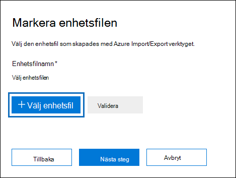

# <a name="use-drive-shipping-to-import-your-organizations-pst-files"></a>Använd skicka in en hårddisk för att importera organisationens PST-filer

**Den här artikeln är för administratörer. Försöker du importera PST-filer till din egen postlåda? Läs [Importera e-post, kontakter och kalender från en Outlook PST-fil](https://go.microsoft.com/fwlink/p/?LinkID=785075)**
   
Använd tjänsten Office 365 och skicka in en hårddisk för att massimportering av PST-filer till användarnas postlådor. Skicka in en hårddisk innebär att du kopierar PST-filerna till en hårddisk och sedan skickar den fysiskt till Microsoft. När Microsoft får hårddisken kopierar datacenterpersonal data från hårddisken till ett lagringsutrymme i Microsoft-molnet. Sedan har du möjlighet att trimma de PST-data som importeras till målpostlådorna genom att ange filter som styr vilka data som importeras. När du startar importjobbet importerar importtjänsten PST-data från lagringsplatsen till användarnas postlådor. Att använda hårddiskleverans för att importera PST-filer till användarpostlådor är ett sätt att migrera organisationens e-post till Office 365.
  
Här är stegen som krävs för att använda hårddiskleverans för att importera PST-filer Microsoft 365 postlådor:
  
[Steg 1: Ladda ned nyckel för säker lagring och verktyget PST-import](#step-1-download-the-secure-storage-key-and-pst-import-tool)

[Steg 2: Kopiera PST-filerna till hårddisken](#step-2-copy-the-pst-files-to-the-hard-drive)

[Steg 3: Skapa mappningsfilen för PST-import](#step-3-create-the-pst-import-mapping-file)

[Steg 4: Skapa ett PST-importjobb i Office 365](#step-4-create-a-pst-import-job-in-office-365)

[Steg 5: Skicka hårddisken till Microsoft](#step-5-ship-the-hard-drive-to-microsoft)

[Steg 6: Filtrera data och starta PST-importjobbet](#step-6-filter-data-and-start-the-pst-import-job)
  
> [!IMPORTANT]
> Du måste utföra steg 1 en gång för att läsa in säker lagringsnyckel och importverktyget. När du har utför de här stegen följer du steg 2 till steg 6 varje gång du vill skicka en hårddisk till Microsoft. 
  
Vanliga frågor och svar om hur du använder hårddiskleverans för att importera PST-filer till Office 365 finns i Vanliga frågor och svar om hur du använder hårddiskleverans [för att importera PST-filer.](./faqimporting-pst-files-to-office-365.yml#using-drive-shipping-to-import-pst-files) 
  
## <a name="before-you-import-pst-files"></a>Innan du importerar PST-filer

- Du måste vara tilldelad rollen Import/export av postlåda i Exchange Online för att kunna importera PST-filer till Microsoft 365-postlådor. Som standard är den här rollen inte tilldelad någon rollgrupp i Exchange Online. Du kan lägga till rollen Import/export av postlåda i rollgruppen Organisationshantering. Eller så kan du skapa en rollgrupp, tilldela rollen Import/export av postlåda och sedan lägga till dig själv som medlem. Mer information finns i avsnitten ”Lägg till en roll i rollgrupp” och ”Skapa en rollgrupp” i [Hantera rollgrupper](/Exchange/permissions-exo/role-groups).
    
    Om du vill skapa importjobb i Microsoft 365 kompatibilitetscenter måste dessutom något av följande stämma:
    
  - Du har tilldelats rollen E-postmottagare i Exchange Online. Som standard är den här rollen tilldelad rollgrupperna Organisationshantering och Hantering av mottagare.
    
    Eller
    
  - Du måste vara global administratör i din organisation.
    
    > [!TIP]
    > Du kan skapa en ny rollgrupp i Exchange Online som är specifikt avsedd att importera PST-filer till Office 365. För den lägsta nivån av behörighet som krävs för att importera PST-filer tilldelar du rollerna Import/export av postlåda och E-postmottagare till den nya rollgruppen och lägger sedan till medlemmar. 
  
- Du måste lagra PST-filer som du vill kopiera till en hårddisk på en filserver eller delad mapp i organisationen. I steg 2 kör du verktyget Azure Import Export (WAImportExport.exe) som kopierar de PST-filer som lagras på den här filservern eller den delade mappen till hårddisken.

- Stora PST-filer kan påverka prestandan för PST-importprocessen. Vi rekommenderar därför att varje PST-fil du kopierar till hårddisken i steg 2 inte ska vara större än 20 GB.
    
- Endast 2,5-tums SSD (Solid-state Drives) eller 2,5- eller 3,5-tums SATA II/III interna hårddiskar stöds för användning med Office 365-importtjänsten. Du kan använda hårddiskar på upp till 10 TB. För importjobb är det endast den första datavolymen på hårddisken som bearbetas. Datavolymen måste vara formaterad med NTFS. När du kopierar data till en hårddisk kan du ansluta den direkt med en 2,5-tums SSD- eller 2,5- eller 3,5-tums SATA II/III-koppling eller så kan du ansluta den externt med hjälp av en extern 2,5-tums SSD- eller 2,5- eller 3,5-tums SATA II/III USB-adapter.
    
    > [!IMPORTANT]
    > Externa hårddiskar som har en inbyggd USB-adapter stöds inte av Office 365-importtjänsten. Det går inte heller att använda disken inuti en extern hårddisks hölje. Skicka inte in externa hårddiskar. 
  
- Hårddisken där du kopierar PST-filerna till måste vara krypterad med BitLocker. Verktyget WAImportExport.exe som du kör i steg 2 hjälper dig att konfigurera BitLocker. Den genererar också en BitLocker-krypteringsnyckel som Microsofts datacenterpersonal använder för att komma åt enheten för att ladda upp PST-filer till Azure Storage-området i Microsoft-molnet.
    
- Skicka in en hårddisk är tillgänglig via en Microsoft-företagsavtal (EA). Möjligheten att skicka in en hårddisk är inte tillgänglig via ett MPSA-avtal (Microsoft Products and Services Agreement).
    
- Kostnaden för att importera PST-filer Microsoft 365 postlådor som använder leverans är 2 USD per GB data. Om du till exempel skickar in en hårddisk som innehåller 1 000 GB (1 TB) PST-filer är kostnaden 2 000 USD. Du kan samarbeta med en partner för att betala importavgiften. Information om hur du hittar en partner finns i [Hitta en Microsoft-partner eller återförsäljare](../admin/manage/find-your-partner-or-reseller.md).
    
- Du eller din organisation måste ha ett konto hos FedEx eller DHL.
    
  - Organisationer i USA, Brasilien och Europa måste ha FedEx-konton.
    
  - Organisationer i Östasien, Sydostasien, Japan, Republiken Korea och Australien måste ha DHL-konton.
    
    Microsoft använder (och debiterar) det här kontot för att returnera hårddisken till dig.
    
- Hårddisken som du skickar till Microsoft kan korsa internationella gränslinjer. I det här fallet är du ansvarig för att säkerställa att hårddisken och de data den innehåller importeras och/eller exporteras i enlighet med gällande lagstiftning. Kontrollera med dina rådgivare att din hårddisk och dina data lagligt kan skickas till det identifierade Microsoft-datacentret innan du skickar hårddisken. På så sätt kan du se till att det når Microsoft i tid.
    
- I den här proceduren ingår att kopiera och spara en säker lagringsnyckel och BitLocker krypteringsnyckel. Se till att vidta vissa åtgärder för att skydda dessa nycklar på samma sätt som du skyddar lösenord eller annan säkerhetsrelaterad information. Du kan till exempel spara dem i ett lösenordsskyddat Microsoft Word eller spara dem på en krypterad USB-enhet. I avsnittet [Mer information](#more-information) finns ett exempel på dessa nycklar. 
    
- När PST-filer importerats till Microsoft 365 postlåda aktiveras inställningen för bevarande av postlådan under en obegränsad tid. Det innebär att den kvarhållningsprincip som tilldelats postlådan inte bearbetas förrän du inaktiverar kvarhållningsundantaget eller anger ett datum då undantaget ska inaktiveras. Varför gör vi det här? Om meddelanden som importerats till en postlåda är gamla kanske de tas bort permanent (rensas) eftersom deras kvarhållningsperiod har upphört att gälla baserat på de kvarhållningsinställningar som har konfigurerats för postlådan. Om ett kvarhållningsundantag tillämpas för postlådan ger det postlådans ägare tid att hantera de nya importerade meddelandena eller dig tid att ändra kvarhållningsinställningarna för postlådan. I avsnittet [Mer information finns](#more-information) förslag om hur du hanterar bevarandet. 
    
- Som standard är den största meddelandestorleken som kan tas emot av en Microsoft 365-postlåda 35 MB. Det beror på att standardvärdet för egenskapen  *MaxReceiveSize*  för en postlåda är inställt på 35 MB. Gränsen för den största storleken för mottagna meddelanden i Microsoft 365 är 150 MB. Så om du importerar en PST-fil som innehåller ett objekt som är större än 35 MB ändrar Office 365-importtjänsten automatiskt värdet för egenskapen  *MaxReceiveSize*  för målpostlådan till 150 MB. Tack vare detta kan meddelanden på upp till 150 MB importeras till användarnas postlådor. 
    
    > [!TIP]
    > Om du vill identifiera storleken för mottagna meddelanden för en postlåda kan du köra det här kommandot i Exchange Online PowerShell:  `Get-Mailbox <user mailbox> | FL MaxReceiveSize`. 
  
- Du kan importera PST-filer till en inaktiv postlåda i Office 365. Det gör du genom att ange GUID för den inaktiva postlådan i parametern  `Mailbox` i mappningsfilen för PST-import. Mer [information finns i Steg 3: Skapa mappningsfilen](#step-3-create-the-pst-import-mapping-file) för PST-import. 
    
- I en Exchange-hybriddistribution kan du importera PST-filer till en molnbaserad arkivpostlåda för en användare vars primära postlåda är lokal. Det gör du genom att göra följande i mappningsfilen för PST-import:
    
  - Ange e-postadressen för användarens lokala postlåda i parametern  `Mailbox`. 
    
  - Ange värdet **TRUE** i parametern  `IsArchive`. 
    
    Mer [information finns i Steg 3: Skapa mappningsfilen](#step-3-create-the-pst-import-mapping-file) för PST-import. 

## <a name="step-1-download-the-secure-storage-key-and-pst-import-tool"></a>Steg 1: Ladda ned nyckel för säker lagring och verktyget PST-import

Det första steget är att ladda ned den säkra lagringsnyckeln och verktyget, och att du använder det i steg 2, för att kopiera PST-filer till hårddisken.
  
> [!IMPORTANT]
> Du måste använda Azure Import/Export tool version 1 (WAimportExportV1) för att kunna importera PST-filer med metoden för att skicka in en hårddisk. Version 2 av Azure Import/Export stöds inte och användning av det leder till att hårddisken förbereds felaktigt för importjobbet. Se till att ladda ned Azure Import/Export-verktyget från Microsoft 365 genom att följa procedurerna i det här steget. 
  
1. Gå till <https://compliance.microsoft.com> och logga in med autentiseringsuppgifterna för ett administratörskonto i organisationen.

2. I det vänstra navigeringsfönstret i kompatibilitetscentret Microsoft 365 du på **Import av informationsstyrning.** \> 
    
    > [!NOTE]
    > Som tidigare nämnts måste du ha rätt behörighet för att få åtkomst till sidan **Importera** i Microsoft 365 kompatibilitetscenter. 
  
3. På fliken **Importera** klickar du på ikonen  **Nytt importjobb**.
    
4. Ange ett namn för PST-importjobbet i guiden för importjobbet och klicka sedan på **Nästa.** Använd gemener, siffror, bindestreck och understreck. Du kan inte använda versaler eller blanksteg i namnet.
    
5. På sidan **Välj typ av importjobb** klickar du på Skicka hårddiskar **till en av våra fysiska platser** och klickar sedan på **Nästa.**
    
    
  
6. På sidan **Importera data** gör du följande två saker: 
    
    
  
    a. I steg 2 klickar du **på Visa nyckeln för säker lagring.** När lagringsnyckeln visas klickar du på Kopiera till **Urklipp** och klistrar sedan in den och sparar den i en fil så att du kan komma åt den senare.
    
    b. I steg 3 laddar **du ned Azure Import/Export-verktyget för** att ladda ned och installera verktyget Azure Import/Export (version 1).
    
    - I popup-fönstret klickar du på **Spara** \> **spara som för** att spara WaImportExportV1.zip i en mapp på den lokala datorn. 
    
    - Extrahera WaImportExportV1.zip filen.
    
7. Stäng **guiden genom** att klicka på Avbryt. 
    
    Du kommer tillbaka till **sidan Importera** i Microsoft 365 kompatibilitetscenter när du skapar importjobbet i steg 4. 

## <a name="step-2-copy-the-pst-files-to-the-hard-drive"></a>Steg 2: Kopiera PST-filerna till hårddisken

Nästa steg är att använda verktyget WAImportExport.exe kopiera PST-filer till hårddisken. Verktyget krypterar hårddisken med BitLocker, kopierar PST-filer till hårddisken och skapar en journalfil som lagrar information om kopieringsprocessen. För att slutföra det här steget måste PST-filerna finnas i en filresurs eller på en filserver i din organisation. Det här kallas för källkatalogen i följande procedur. 

 Som tidigare nämnts ska varje PST-fil som du kopierar till hårddisken inte vara större än 20 GB. PST-filer som är större än 20 GB kan påverka prestandan för PST-importprocessen som du startar i steg 6.
  
> [!IMPORTANT]
> När du kör WAImportExport.exe första gången för en hårddisk måste du använda olika syntax varje gång. Den här syntaxen förklaras i steg 4 i den här proceduren för att kopiera PST-filer till hårddisken. 
  
1. Öppna Kommandotolken på den lokala datorn.
    
    > [!TIP]
    > Om du kör kommandotolken som administratör (genom att välja Kör som administratör när du öppnar det) visas felmeddelanden i kommandotolken. Det kan hjälpa dig att felsöka problem med att WAImportExport.exe verktyget. 
  
2. Gå till katalogen där du installerade WAImportExport.exe i steg 1.
    
3. Kör följande kommando första gången du använder kommandot WAImportExport.exe kopiera PST-filer till en hårddisk.

    ```powershell
    WAImportExport.exe PrepImport /j:<Name of journal file> /t:<Drive letter> /id:<Name of session> /srcdir:<Location of PST files> /dstdir:<PST file path> /sk:<Storage account key> /blobtype:BlockBlob /encrypt /logdir:<Log file location>
    ```

    I följande tabell beskrivs parametrarna och deras obligatoriska värden.
    
    |**Parameter**|**Beskrivning**|**Exempel**|
    |:-----|:-----|:-----|
    | `/j:` <br/> |Anger namnet på journalfilen. Den här filen sparas i samma mapp där WAImportExport.exe finns. Varje hårddisk som du skickar till Microsoft måste ha en journalfil. Varje gång du kör WAImportTool.exe för att kopiera PST-filer till en hårddisk läggs information till i journalfilen för enheten.  <br/> Microsofts datacenterpersonal använder informationen i journalfilen för att associera hårddisken med importjobbet som du skapade i steg 4 och för att ladda upp PST-filerna till Azure Storage-området i Microsoft-molnet.  <br/> | `/j:PSTHDD1.jrn` <br/> |
    | `/t:` <br/> |Anger enhetsbeteckningen för hårddisken när den är ansluten till den lokala datorn.  <br/> | `/t:h` <br/> |
    | `/id:` <br/> |Anger namnet på kopieringssessionen. En session definieras som varje gång du kör WAImportExport.exe för att kopiera filer till hårddisken. PST-filerna kopieras till en mapp med sessionsnamnet som anges av den här parametern.  <br/> | `/id:driveship1` <br/> |
    | `/srcdir:` <br/> |Anger källkatalogen i organisationen som innehåller PST-filerna som ska kopieras under sessionen. Se till att omge värdet för den här parametern med dubbla citattecken (" ").  <br/> | `/srcdir:"\\FILESERVER01\PSTs"` <br/> |
    | `/dstdir:` <br/> |Anger målkatalogen i det Azure Storage i Microsoft-molnet dit PST-filer ska laddas upp. Du måste använda värdet  `ingestiondata/` . Se till att omge värdet för den här parametern med dubbla citattecken (" ").  <br/> Du kan också lägga till en extra sökväg till parameterns värde. Du kan till exempel använda filsökvägen för källkatalogen på hårddisken (konverteras till ett URL-format), som anges i  `/srcdir:` parametern. Ändras till  `\\FILESERVER01\PSTs` exempel till  `FILESERVER01/PSTs` . I det här fallet måste du fortfarande inkludera  `ingestiondata` i sökvägen. I det här exemplet skulle parametervärdet  `/dstdir:` alltså vara  `"ingestiondata/FILESERVER01/PSTs"` .  <br/> En orsak till att lägga till den extra sökvägen är om du har PSTs-filer med samma filnamn.  <br/> > [!NOTE]> Om du tar med den valfria sökvägen innehåller namnområdet för en PST-fil efter att den laddats upp till Azure Storage-området sökvägen och namnet på PST-filen. till exempel `FILESERVER01/PSTs/annb.pst` . Om du inte har ett sökväg är namnområdet bara PST-filnamnet. till exempel  `annb.pst` .           | `/dstdir:"ingestiondata/"` <br/> Eller  <br/>  `/dstdir:"ingestiondata/FILESERVER01/PSTs"` <br/> |
    | `/sk:` <br/> |Anger lagringskontonyckeln som du fick i steg 1. Se till att omge värdet för den här parametern med dubbla citattecken (" ").  <br/> | `"yaNIIs9Uy5g25Yoak+LlSHfqVBGOeNwjqtBEBGqRMoidq6/e5k/VPkjOXdDIXJHxHvNoNoFH5NcVUJXHwu9ZxQ=="` <br/> |
    | `/blobtype:` <br/> |Anger vilken typ av blobbar i området Azure Storage ska importera PST-filerna till. För att importera PST-filer använder du värdet **BlockBlob.** Den här parametern är obligatorisk.   <br/> | `/blobtype:BlockBlob` <br/> |
    | `/encrypt` <br/> |Den här växeln BitLocker för hårddisken. Den här parametern krävs första gången du kör det WAImportExport.exe verktyget.  <br/> Krypteringsnyckeln BitLocker kopieras till journalfilen och loggfilen som skapas om du använder `/logfile:` parametern. Som tidigare förklarats sparas journalfilen i samma mapp där WAImportExport.exe finns.  <br/> | `/encrypt` <br/> |
    | `/logdir:` <br/> |Den här valfria parametern anger en mapp där loggfilerna ska sparas. Om den inte anges sparas loggfilerna i samma mapp där WAImportExport.exe finns. Se till att omge värdet för den här parametern med dubbla citattecken (" ").  <br/> | `/logdir:"c:\users\admin\desktop\PstImportLogs"` <br/> |
   
    Här är ett exempel på syntaxen för verktyget WAImportExport.exe faktiska värden för varje parameter:
    
    ```powershell
    WAImportExport.exe PrepImport /j:PSTHDD1.jrn /t:f /id:driveship1 /srcdir:"\\FILESERVER01\PSTs" /dstdir:"ingestiondata/" /sk:"yaNIIs9Uy5g25Yoak+LlSHfqVBGOeNwjqtBEBGqRMoidq6/e5k/VPkjOXdDIXJHxHvNoNoFH5NcVUJXHwu9ZxQ==" blobtype:BlockBlob /encrypt /logdir:"c:\users\admin\desktop\PstImportLogs"
    ```

    När du har kört kommandot visas statusmeddelanden som visar förloppet för kopiering av PST-filer till hårddisken. Ett slutligt statusmeddelande visar det totala antalet filer som har kopierats.
    
4. Kör det här kommandot varje gång du kör verktyget WAImportExport.ext för att kopiera PST-filer till samma hårddisk.

    ```powershell
    WAImportExport.exe PrepImport /j:<Name of journal file> /id:<Name of new session> /srcdir:<Location of PST files> /dstdir:<PST file path> /blobtype:BlockBlob 
    ```

    Här är ett exempel på syntaxen för att köra efterföljande sessioner för att kopiera PST-filer till samma hårddisk.

    ```powershell
    WAImportExport.exe PrepImport /j:PSTHDD1.jrn /id:driveship2 /srcdir:"\\FILESERVER01\PSTs\SecondBatch" /dstdir:"ingestiondata/" /blobtype:BlockBlob
    ```

## <a name="step-3-create-the-pst-import-mapping-file"></a>Steg 3: Skapa mappningsfilen för PST-import

När Microsofts datacenterpersonal har laddat upp PST-filerna från hårddisken till Azure Storage-området använder importtjänsten informationen i PST-importmappningsfilen, som är en fil med kommaavgränsade värden (CSV), som anger till vilka användarpostlådor PST-filerna importeras. Du skickar den här CSV-filen i nästa steg när du skapar ett PST-importjobb.
  
1. [Ladda ned en kopia av mappningsfilen för PST-import](https://go.microsoft.com/fwlink/p/?LinkId=544717).
    
2. Öppna eller spara CSV-filen på den lokala datorn. I följande exempel visas en slutförd mappningsfil för PST-import (öppnad i Anteckningar). Det är mycket enklare att använda Microsoft Excel för att redigera CSV-filen.

    ```text
    Workload,FilePath,Name,Mailbox,IsArchive,TargetRootFolder,ContentCodePage,SPFileContainer,SPManifestContainer,SPSiteUrl
    Exchange,FILESERVER01/PSTs,annb.pst,annb@contoso.onmicrosoft.com,FALSE,/,,,,
    Exchange,FILESERVER01/PSTs,annb_archive.pst,annb@contoso.onmicrosoft.com,TRUE,/ImportedPst,,,,
    Exchange,FILESERVER01/PSTs,donh.pst,donh@contoso.onmicrosoft.com,FALSE,/,,,,
    Exchange,FILESERVER01/PSTs,donh_archive.pst,donh@contoso.onmicrosoft.com,TRUE,/ImportedPst,,,,
    Exchange,FILESERVER01/PSTs,pilarp.pst,pilarp@contoso.onmicrosoft.com,FALSE,/,,,,
    Exchange,FILESERVER01/PSTs,pilarp_archive.pst,pilarp@contoso.onmicrosoft.com,TRUE,/ImportedPst,,,,
    Exchange,,tonyk.pst,tonyk@contoso.onmicrosoft.com,FALSE,/,,,,
    Exchange,,tonyk_archive.pst,tonyk@contoso.onmicrosoft.com,TRUE,,,,,
    Exchange,,zrinkam.pst,zrinkam@contoso.onmicrosoft.com,FALSE,/,,,,
    Exchange,,zrinkam_archive.pst,zrinkam@contoso.onmicrosoft.com,TRUE,,,,,
    ```

    Den första raden, eller rubrikraden, i CSV-filen innehåller de parametrar som ska användas av PST-importtjänsten för att importera PST-filerna till användarpostlådorna. Varje parameternamn avgränsas med ett kommatecken. Varje rad under rubrikraden representerar parametervärdena för importering av en PST-fil till en viss postlåda. Du behöver en rad för varje PST-fil som kopierades till hårddisken. Se till att ersätta platshållardata i mappningsfilen med faktiska data.

    > [!NOTE]
    > Ändra inget i rubrikraden, inklusive SharePoint-parametrarna. De ignoreras under PST-importprocessen. 
  
3. Använd informationen i följande tabell och fyll i CSV-filen med den information som krävs.
    
    |**Parameter**|**Beskrivning**|**Exempel**|
    |:-----|:-----|:-----|
    | `Workload` <br/> |Anger vilken tjänst som data ska importeras till. Om du vill importera PST-filer till användarpostlådor använder du  `Exchange`.  <br/> | `Exchange` <br/> |
    | `FilePath` <br/> | Anger mappplatsen i området Azure Storage som PST-filer kopieras till när hårddisken levereras till Microsoft.  <br/>  Vad du lägger till i den här kolumnen i CSV-filen beror på vad du angav  `/dstdir:` för parametern i föregående steg. Om det finns undermappar på källplatsen måste värdet i parametern innehålla den relativa sökvägen för undermappen, till exempel `FilePath` /mapp1/användare1/.  <br/>  Om du använde  `/dstdir:"ingestiondata/"` lämna den här parametern tom i CSV-filen.  <br/>  Om du inkluderade ett valfritt sökväg för parameterns värde (till exempel , använder du det sökvägen (utan att inkludera  `/dstdir:`  `/dstdir:"ingestiondata/FILESERVER01/PSTs"` "ingestiondata") för den här parametern i CSV-filen. Värdet för den här parametern är skiftlägeskänsligt.  <br/>  Ta hur som helst  *inte*  med ”ingestiondata” i värdet för parametern  `FilePath`. Lämna parametern tom eller ange bara det valfria sökvägen.  <br/> > [!IMPORTANT]> Namnet på sökvägen för filen måste vara samma sak som du angav  `/dstdir:` i parametern i föregående steg. Om du till exempel använde för undermappens namn i föregående steg, men sedan använde den i parametern i  `"ingestiondata/FILESERVER01/PSTs"`  `fileserver01/psts`  `FilePath` CSV-filen, misslyckas importen för PST-filen. Se till att använda samma skiftläge i båda fallen.           |(lämna tomt)  <br/> Eller  <br/>  `FILESERVER01/PSTs` <br/> |
    | `Name` <br/> |Anger namnet på PST-filen som ska importeras till användarpostlådan. Värdet för den här parametern är skiftlägeskänsligt.  <br/> > [!IMPORTANT]> Namnet på PST-filen i CSV-filen måste vara detsamma som den PST-fil som laddades upp till platsen för Azure Storage i steg 2. Om du till exempel använder i parametern i CSV-filen, men namnet på den faktiska PST-filen är , misslyckas importen för den  `annb.pst`  `Name`  `AnnB.pst` PST-filen. Se till att PST-namnet i CSV-filen har samma skiftläge som den faktiska PST-filen.           | `annb.pst` <br/> |
    | `Mailbox` <br/> |Anger e-postadressen för postlådan som PST-filen ska importeras till. Du kan inte ange en gemensam mapp eftersom PST-importtjänsten inte stöder importering av PST-filer till gemensamma mappar.  <br/> För att importera en PST-fil till en inaktiv postlåda måste du ange postlådans GUID för den här parametern. Om du vill hämta detta GUID kör du följande PowerShell-kommando i Exchange Online:  `Get-Mailbox <identity of inactive mailbox> -InactiveMailboxOnly | FL Guid` <br/> > [!NOTE]> Ibland kan du ha flera postlådor med samma e-postadress, där en postlåda är en aktiv postlåda och den andra är i ett mjukt borttagna (eller inaktiva) tillstånd. I sådana fall måste du ange postlådans GUID för att unikt identifiera postlådan som PST-filen ska importeras till. Om du vill hämta detta GUID för aktiva postlådor kör du följande PowerShell-kommando:  `Get-Mailbox <identity of active mailbox> | FL Guid`. Om du vill hämta GUID för mjukt borttagna (eller inaktiva) postlådor kör du det här kommandot:  `Get-Mailbox <identity of soft-deleted or inactive mailbox> -SoftDeletedMailbox | FL Guid` .           | `annb@contoso.onmicrosoft.com` <br/> Eller  <br/>  `2d7a87fe-d6a2-40cc-8aff-1ebea80d4ae7` <br/> |
    | `IsArchive` <br/> | Anger om PST-filen ska importeras till användarens arkivpostlåda. Det finns två alternativ:  <br/> **FALSE** Importerar PST-filen till användarens primära postlåda.  <br/> **TRUE** Importerar PST-filen till användarens arkivpostlåda. Detta förutsätter att [användarens arkivpostlåda har aktiverats](enable-archive-mailboxes.md). Om du anger  `TRUE` för den här parametern och användarens arkivpostlåda inte är aktiverad kommer importen för den användaren att misslyckas. Om en import misslyckas för en användare (på grund av att denna egenskap har angetts som  `TRUE` men arkivet inte är aktiverat), påverkas inte importen för övriga användare.  <br/>  Om du lämnar parametern tom importeras PST-filen till användarens primära postlåda.  <br/> **Obs!** Om du vill importera en PST-fil till en molnbaserad arkivpostlåda för en användare vars primära postlåda är lokal, anger du  `TRUE` för den här parametern och anger e-postadressen till användarens lokala postlåda för parametern  `Mailbox`.  <br/> | `FALSE` <br/> Eller  <br/>  `TRUE` <br/> |
    | `TargetRootFolder` <br/> | Anger postlådans mapp som PST-filen importeras till.  <br/>  Om du låter den här parametern vara tom  importeras PST-filen till en ny mapp med namnet Importerad, på rotnivån i postlådan (samma nivå som mappen Inkorgen och de andra standardmapparna i postlådan).  <br/>  Om du  `/` anger importeras objekt i PST-filen direkt till användarens inkorgsmapp.  <br/>  Om du anger  `/<foldername>` kommer objekt i PST-filen att importeras till en mapp med namnet  *\<foldername\>* . Om du till exempel använder  `/ImportedPst` importeras objekt till en mapp med namnet **ImportedPst**. Den här mappen finns på samma nivå som Inkorgen i användarens postlåda.  <br/> |(lämna tomt)  <br/> Eller  <br/>  `/` <br/> Eller  <br/>  `/ImportedPst` <br/> |
    | `ContentCodePage` <br/> |Den här valfria parametern anger ett numeriskt värde för teckentabellen som ska användas för import av PST-filer i ANSI-filformatet. Den här parametern används för att importera PST-filer från kinesiska, japanska och koreanska (CJK) organisationer eftersom dessa språk normalt använder en teckenuppsättning med dubbla byte (DBCS) för teckenkodning. Om den här parametern inte används för att importera PST-filer för språk som använder DBCS för postlådemappnamn är mappnamnen ofta förvrängda efter att de importerats.  <br/> En lista med värden som stöds för den här parametern finns i artikeln om [identifierare för teckentabeller](/windows/win32/intl/code-page-identifiers).  <br/> > [!NOTE]> ovan är det här en valfri parameter och du behöver inte inkludera den i CSV-filen. Eller så kan du ta med den och lämna värdet tomt för en eller flera rader.           |(lämna tomt)  <br/> Eller  <br/>  `932` (som är identifieraren för teckentabellen för ANSI/OEM för japanska)  <br/> |
    | `SPFileContainer` <br/> |Lämna den här parametern tom för PST-import.  <br/> |Ej tillämpligt  <br/> |
    | `SPManifestContainer` <br/> |Lämna den här parametern tom för PST-import.  <br/> |Ej tillämpligt  <br/> |
    | `SPSiteUrl` <br/> |Lämna den här parametern tom för PST-import.  <br/> |Ej tillämpligt  <br/> |

## <a name="step-4-create-a-pst-import-job-in-office-365"></a>Steg 4: Skapa ett PST-importjobb i Office 365

Nästa steg är att skapa PST-importjobbet i importtjänsten i Office 365. Som tidigare förklarats skickar du mappningsfilen för PST-import som du skapade i steg 3. När du har skapat jobbet använder importtjänsten informationen i mappningsfilen för att importera PST-filerna till den angivna användarpostlådan när PST-filerna kopieras från hårddisken till Azure Storage-området och du skapar och startar importjobbet.
  
1. Gå till <https://compliance.microsoft.com> och logga in med autentiseringsuppgifterna för ett administratörskonto i organisationen.

2. I det vänstra navigeringsfönstret i kompatibilitetscentret Microsoft 365 du på **Import av informationsstyrning.** \> 

3. På fliken **Importera** klickar du på ikonen  **Nytt importjobb**.

    > [!NOTE]
    > Som tidigare nämnts måste du ha rätt behörighet för att få åtkomst till sidan **Importera** i Microsoft 365 kompatibilitetscenter.
  
4. Skriv ett namn för PST-importjobbet och klicka sedan på **Nästa**. Använd gemener, siffror, bindestreck och understreck. Du kan inte använda versaler eller blanksteg i namnet.

5. På sidan **Välj typ av importjobb** klickar du på Skicka hårddiskar **till en av våra fysiska platser** och klickar sedan på **Nästa.**
  
6. I steg 6  klickar du på kryssrutorna Jag har förberett  mina hårddiskar och har åtkomst till nödvändiga journalfiler och jag har åtkomst till kryssrutorna för mappningsfilen och klickar sedan på **Nästa.**

    
  
7. På sidan **Välj enhetsfil** klickar du på Välj **enhetsfil** och går sedan till den mapp där WAImportExport.exe finns. Journalfilen som skapades i steg 2 kopierades till den här mappen.

    
  
8. Välj journalfilen. till exempel `PSTHDD1.jrn` .

    > [!TIP]
    > När du körde WAImportExport.exe i steg 2 angavs namnet på journalfilen av  `/j:` parametern.
  
9. När namnet på enhetsfilen visas under Drive **filnamn klickar** du på **Verifiera** för att leta efter fel i enhetsfilen.

    
  
    Enhetsfilen måste valideras för att skapa ett PST-importjobb. Filnamnet ändras till grönt när den har validerats. Om valideringen misslyckas klickar du på länken **Visa logg**. En verifieringsfelrapport öppnas med ett felmeddelande med information om varför filen misslyckades. 

    > [!NOTE]
    > Du måste lägga till och verifiera en journalfil för varje hårddisk som du skickar till Microsoft. 
  
10. När du har lagt till och validerat en journalfil för varje hårddisk som du skickar till Microsoft klickar du på **Nästa.**
    
11. Klicka  **mappningsfil** för att skicka PST-importmappningsfilen som du skapade i steg 3. 

    
  
12. När namnet på CSV-filen visas under **Namn på mappningsfil** klickar du på **Validera** och kontrollerar om det finns några fel i CSV-filen. 

    
  
    CSV-filen måste valideras för att kunna skapa ett PST-importjobb. Filnamnet ändras till grönt när den har validerats. Om valideringen misslyckas klickar du på länken **Visa logg**. En rapport över valideringsfel öppnas med ett felmeddelande för varje rad i filen som misslyckades. 

13. När PST-mappningsfilen har verifierats klickar du på **Nästa.**

14. På sidan **Ange kontaktinformation** skriver du din kontaktinformation i tillämpliga rutor. 

    Adressen till den Microsoft-plats du skickar hårddisken till visas. Den här adressen genereras automatiskt baserat på din Microsoft-datacenterplats. Kopiera adressen till en fil eller ta en skärmbild.

15. Läs villkoren i dokumentet, klicka på kryssrutan och klicka sedan på Spara **för** att skicka importjobbet. 

    När importjobbet har skapats visas en statussida som förklarar nästa steg i processen för att skicka in en hårddisk.

16. På fliken **Importera** klickar du på  **för** att visa det nya importjobbet för enhetsleverans i listan med importjobb. Statusen är inställd på **Väntar på spårningsnummer**. Du kan också klicka på importjobbet för att visa den utfällade statussidan, som innehåller mer detaljerad information om importjobbet.

## <a name="step-5-ship-the-hard-drive-to-microsoft"></a>Steg 5: Skicka hårddisken till Microsoft

Nästa steg är att skicka hårddisken till Microsoft och sedan ange spårningsnumret för leveransen och skicka tillbaka leveransinformationen för jobbet för hårddiskleveransen. När enheten tagits emot av Microsoft tar det mellan 7 och 10 arbetsdagar för datacenterpersonalen att ladda upp dina PST-filer till Azure Storage för din organisation.
  
> [!NOTE]
> Om du inte anger spårningsnummer och returnerar leveransinformation inom 14 dagar efter att importjobbet har skapats, upphör importjobbet att gälla. Om det händer måste du skapa ett nytt importjobb för att skicka in en hårddisk (se steg 4: Skapa ett [PST-importjobb](#step-4-create-a-pst-import-job-in-office-365)i Office 365) och skicka in enhetsfilen och PST-importmappningsfilen igen.
  
### <a name="ship-the-hard-drive"></a>Skicka hårddisken

Tänk på följande när du skickar hårddiskar till Microsoft:
  
- Skicka inte SATA-till-USB-adaptern. du behöver bara skicka hårddisken.

- Paketera hårddisken på rätt sätt. Du kan till exempel använda en anti-statisk bag eller bubbelbyte.

- Använd valfri leveransoperatör för att skicka hårddisken till Microsoft.

- Skicka hårddisken till adressen för Microsoft-platsen som visades när du skapade importjobbet i steg 4. Se till att inkludera "Office 365 importtjänsten" i leveransadressen.

- När du har skickar in hårddisken skriver du ned namnet på leveransoperatören och spårningsnumret. Du anger dem i nästa steg.
    
### <a name="enter-the-tracking-number-and-other-shipping-information"></a>Ange spårningsnummer och annan leveransinformation

När du har skickat hårddisken till Microsoft slutför du följande procedur på sidan Importera tjänst.
  
1. Gå till <https://compliance.microsoft.com> och logga in med autentiseringsuppgifterna för ett administratörskonto i organisationen.

2. I det vänstra navigeringsfönstret i kompatibilitetscentret Microsoft 365 du på **Informationsstyrning > Importera.**

3. På fliken **Importera** klickar du på jobbet för den enhetsleverans som du vill ange spårningsnummer för.

4. På den utfällade statussidan klickar du **på Ange spårningsnummer**.

5. Ange följande leveransinformation:

   1. **Leveransoperatör** Skriv namnet på den leveransoperatör som du använde för att skicka hårddisken till Microsoft. 

   2. **Spårningsnummer** Skriv spårningsnumret för hårddiskleveransen. 

   3. **Kontonummer för returoperatör** Ange din organisations kontonummer för det operatör som visas under **Returoperatör.** Microsoft använder (och debiterar) det här kontot för att skicka tillbaka hårddisken till dig. Organisationer i USA och Europa måste ha ett konto hos FedEx. Organisationer i Asien och resten av världen måste ha ett konto med DHL.

6. Spara **informationen** för importjobbet genom att klicka på Spara. 

    På fliken **Importera** klickar du på  **för** att uppdatera informationen för importjobbet för hårddiskleveransen. Observera att status är nu inställd på **Enheter under överföring.**

## <a name="step-6-filter-data-and-start-the-pst-import-job"></a>Steg 6: Filtrera data och starta PST-importjobbet

När hårddisken har tagits emot av Microsoft ändras statusen för importjobbet på sidan Importera **PST-filer** till **Enheter som tagits emot.** Personalen på datacentret använder informationen i journalfilen för att ladda upp PST-filer till Azure Storage för din organisation. I det här läget ändras **statusen till Import pågår.** Som tidigare nämnts tar det mellan 7 och 10 arbetsdagar efter att du fått hårddisken att ladda upp PST-filerna.
  
När PST-filer har laddats upp till Azure ändras statusen till **Analys pågår.** Det här indikerar att Microsoft 365 analyserar data i PST-filerna (på ett säkert sätt) för att identifiera åldern på objekten och de olika meddelandetyperna som ingår i PST-filerna. När analysen är klar och data är klara att importeras ändras importjobbens status till **Analys slutförd.** I det här läget kan du importera alla data som finns i PST-filerna eller så kan du trimma de data som importeras genom att ange filter som styr vilka data som importeras.
  
1. Gå till <https://compliance.microsoft.com> och logga in med autentiseringsuppgifterna för ett administratörskonto i organisationen.

2. I det vänstra navigeringsfönstret i Microsoft 365 kompatibilitetscenter klickar du på **Informationsstyrning** \> **Import****.

3. På fliken **Importera** väljer du importjobbet som du skapade i steg 4 och klickar på **Importera för att Office 365**.
  
    En utfällbar sida visas med information om PST-filerna och annan information om importjobbet.

4. Klicka **på Importera för att Office 365**.

5. Sidan **Filtrera data** visas. Den innehåller datainsikter från analysen som har utförts på PST-filerna av Office 365, bland annat information om åldern på data. I det här läget kan du filtrera de data som ska importeras eller importera alla data som de är. 

    
  
6. Gör något av följande:

    a. Om du vill trimma de data du importerar klickar du på **Ja, jag vill filtrera innan jag importerar**.

    Detaljerade stegvisa instruktioner om hur du filtrerar data i PST-filerna och sedan startar importjobbet finns i [Filtrera data vid import av PST-filer till Office 365](filter-data-when-importing-pst-files.md).

    Eller

    b. Om du vill importera alla data i PST-filerna klickar du på **Nej, jag vill importera allt** och klickar sedan på **Nästa**.

7. Om du väljer att importera alla data klickar du på **Importera data**, så startas importjobbet. 

    Status för importjobbet visas på sidan **Importera PST-filer.** Klicka på  **Uppdatera** om du vill uppdatera statusinformationen som visas i kolumnen **Status**. Klicka på importjobbet om du vill visa den utfällbara statussidan med statusinformation om varje PST-fil som importeras. När importen är klar och PST-filer har importerats till användarnas postlådor ändras statusen till **Slutförd**.

## <a name="view-a-list-of-the-pst-files-uploaded-to-microsoft-365"></a>Visa en lista över PST-filer som laddats upp till Microsoft 365

Du kan installera och använda Microsoft Azure Storage Explorer (ett kostnadsfritt verktyg med öppen källkod) för att visa listan över PST-filer som vi har laddat upp (av Microsofts datacenterpersonal) till Azure Storage-området för din organisation. Det kan du göra för att verifiera att PST-filer från hårddiskar som du har skickat till Microsoft har laddats upp till Azure Storage området.
  
> [!IMPORTANT]
> Du kan inte använda Azure Storage Explorer för att ladda upp eller ändra PST-filer. Den enda metoden att importera PST-filer till en Microsoft 365 är att använda AzCopy. Du kan inte heller ta bort PST-filer som du har laddat upp till Azure-blobben. Om du försöker ta bort en PST-fil får du ett felmeddelande om att du inte har den behörighet som krävs. Alla PST-filer tas automatiskt bort från ditt Azure Storage. Om inga importjobb pågår tas alla PST-filer i behållaren ** ingestiondata ** bort 30 dagar efter att det senaste importjobbet skapades.
  
Utför följande steg för att hämta SAS-URL:en (Shared Access Signature) för din organisation. Den här URL:en är en kombination av nätverks-URL:en för Azure Storage i Microsoft-molnet för din organisation och en SAS-nyckel. Den här nyckeln ger dig de behörigheter som krävs för att komma åt organisationens Azure Storage plats.

Så här installerar du Azure Storage Explorer och ansluter till ditt Azure Storage-område:

1. Gå till <https://compliance.microsoft.com> och logga in med autentiseringsuppgifterna för ett administratörskonto i organisationen.

2. Klicka på **Informationsstyrning > Importera** i vänster fönsterruta i Microsoft 365 Efterlevnadscenter.

3. På fliken **Importera** klickar du på ikonen  **Nytt importjobb**.

4. Ange ett namn för PST-importjobbet i guiden för importjobbet och klicka sedan på **Nästa.** Använd gemener, siffror, bindestreck och understreck. Du kan inte använda versaler eller blanksteg i namnet.

5. Klicka på **Importera jobbtyp på** sidan Välj **Upload dina data** och klicka sedan på **Nästa.**

6. I steg 2 klickar du på **Visa SAS-URL för uppladdning över nätverket**.

7. När URL:en visas kopierar du den och sparar den i en fil. Se till att kopiera hela URL-adressen.

    > [!IMPORTANT]
    > Se till att vidta försiktighetsåtgärder för att skydda SAS-URL:en. Vem som helst kan använda det för att komma åt Organisationens Azure-lagringsplats.
  
8. Klicka **på Avbryt** för att stänga guiden för importjobb.

9. Ladda ned och installera [Microsoft Azure Storage Explorer-verktyget](https://go.microsoft.com/fwlink/p/?LinkId=544842).

10. Starta Microsoft Azure Storage Explorer, högerklicka på **Storage konton** i den vänstra rutan och klicka sedan på Lägg **Anslut att Azure Storage**.

    
  
11. Klicka **på Använd en SAS-URI (Shared Access Signature) eller anslutningssträng och** klicka sedan på **Nästa.**

12. Klicka **på Använd en SAS URI**, klistra in SAS URL-adressen som du fick i steg 1 in i rutan under **URI** och klicka sedan på **Nästa.**

13. På sidan **Anslutningssammanfattning** kan du granska anslutningsinformationen och sedan klicka på **Anslut**.

    Containern **ingestiondata** öppnas. Den innehåller PST-filerna från hårddisken. Behållaren **för pågestiondata** finns under Storage **Accounts** \> **(SAS-Attached Services)** \> **Blob Containers.**

    
  
14. När du är klar med Microsoft Azure Storage Explorer högerklickar du på **ingestiondata** och klickar sedan på **Koppla från** för att koppla från ditt Azure Storage-område. Annars får du ett felmeddelande nästa gång du försöker ansluta. 

    

## <a name="troubleshooting-tips"></a>Felsökningstips

- **Vad händer om importjobbet misslyckas på grund av fel i CSV-mappningsfilen för PST-import?** Om ett importjobb misslyckas på grund av fel i mappningsfilen behöver du inte koppla hårddisken till Microsoft för att skapa ett importjobb. Det beror på att PST-filerna från hårddisken du skickade för att kunna skicka in en hårddisk redan har laddats upp till Azure Storage för organisationen. I det här fallet behöver du bara åtgärda felen i CSV-mappningsfilen för PST-import och sedan skapa ett nytt importjobb för nätverksuppladdning och skicka den reviderade CSV-mappningsfilen. Om du vill skapa och starta ett nytt importjobb för nätverksuppladdning kan du gå till Steg 5: Skapa ett [PST-importjobb](use-network-upload-to-import-pst-files.md#step-5-create-a-pst-import-job) i Microsoft 365 och steg [6: Filtrera data](use-network-upload-to-import-pst-files.md#step-6-filter-data-and-start-the-pst-import-job) och starta PST-importjobbet i avsnittet "Använd nätverksuppladdning för att importera PST-filer till Office 365". 
    
    > [!NOTE]
    > Om du vill felsöka CSV-mappningsfilen för PST-import kan du använda [Azure Storage Explorer-verktyget](#view-a-list-of-the-pst-files-uploaded-to-microsoft-365) för att visa mappstrukturen i behållaren **för pågestiondata** för PST-filerna från hårddisken som har laddats upp till Azure-lagringsutrymmet. Mappningsfilfel orsakas vanligtvis av ett felaktigt värde i parametern FilePath. Den här parametern anger platsen för en PST-fil i Azure-lagringsplatsen. Se beskrivningen av parametern FilePath i tabell i [steg 3.](#step-3-create-the-pst-import-mapping-file) Som tidigare förklarats angavs platsen för PST-filer i Azure-lagringsplatsen av parametern när du `/dstdir:` körde WAImportExport.exe i steg [2.](#step-2-copy-the-pst-files-to-the-hard-drive) 
  
## <a name="more-information"></a>Mer information

- Att skicka in en hårddisk är ett effektivt sätt att importera stora mängder arkiveringsdata till Microsoft 365 för att kunna dra nytta av de efterlevnadsfunktioner som är tillgängliga för organisationen. När arkivdata har importerats till användarnas postlådor kan du:

  - Aktivera [arkivpostlådor](enable-archive-mailboxes.md) och [automatiskt expanderande arkivering för](enable-unlimited-archiving.md) att ge användarna mer lagringsutrymme för data. 

  - Placera postlådor i Bevarande [av juridiska skäl](./create-a-litigation-hold.md) om du vill behålla data. 

  - Använd Microsoft [eDiscovery-verktyg för](search-for-content.md) att söka efter data. 

  - Använd [Microsoft 365 för att](retention.md) styra hur länge data ska behållas och vilka åtgärder som ska vidtas efter att de har förfallit. 

  - Sök i [granskningsloggen](search-the-audit-log-in-security-and-compliance.md) efter händelser som är relaterade till dessa data. 

  - Importera data till [inaktiva postlådor](create-and-manage-inactive-mailboxes.md) för att arkivera data i efterlevnadssyfte. 

  - Skydda organisationen mot [dataförlust med](dlp-learn-about-dlp.md) känslig information. 

- Här är ett exempel på nyckel för säker lagringskonto och en BitLocker krypteringsnyckel. Det här exemplet innehåller också syntaxen för WAImportExport.exe som du kör för att kopiera PST-filer till en hårddisk. Se till att vidta vissa åtgärder för att skydda dem på samma sätt som du skyddar lösenord eller annan säkerhetsrelaterad information.

    ```text
    Secure storage account key: 

    yaNIIs9Uy5g25Yoak+LlSHfqVBGOeNwjqtBEBGqRMoidq6/e5k/VPkjOXdDIXJHxHvNoNoFH5NcVUJXHwu9ZxQ==

    BitLocker encryption key:

    397386-221353-718905-535249-156728-127017-683716-083391

  COMMAND SYNTAX

  First time:

  WAImportExport.exe PrepImport /j:<Name of journal file> /t:<Drive letter> /id:<Name of session> /srcdir:<Location of PST files> /dstdir:<PST file path> /sk:<Storage account key> /blobtype:BlockBlob /encrypt /logdir:<Log file location>

  Subsequent times:

  WAImportExport.exe PrepImport /j:<Name of journal file> /id:<Name of new session> /srcdir:<Location of PST files> /dstdir:<PST file path> /blobtype:BlockBlob 

  EXAMPLES

  First time:

  WAImportExport.exe PrepImport /j:PSTHDD1.jrn /t:f /id:driveship1 /srcdir:"\\FILESERVER1\PSTs" /dstdir:"ingestiondata/" /sk:"yaNIIs9Uy5g25Yoak+LlSHfqVBGOeNwjqtBEBGqRMoidq6/e5k/VPkjOXdDIXJHxHvNoNoFH5NcVUJXHwu9ZxQ==" /blobtype:BlockBlob /encrypt /logdir:"c:\users\admin\desktop\PstImportLogs"

  Subsequent times:

  WAImportExport.exe PrepImport /j:PSTHDD1.jrn /id:driveship2 /srcdir:"\\FILESERVER1\PSTs\SecondBatch" /dstdir:"ingestiondata/" /blobtype:BlockBlob
    ```

- Som tidigare beskrivits aktiverar Office 365-importtjänsten inställningen för kvarhållningsundantag (på obestämd tid) efter att PST-filer har importerats till en postlåda. Det innebär att  *egenskapen RentionHoldEnabled*  är inställd på så att den bevarandeprincip som tilldelats till postlådan  `True` inte bearbetas. Det ger postlådans ägare tid att hantera de nya importerade meddelandena genom att förhindra att en borttagnings- eller arkiveringsprincip tar bort eller arkiverar äldre meddelanden. Här är några steg du kan vidta för att hantera det här kvarhållningsundantaget: 

  - Efter en viss tidsperiod kan du inaktivera bevarandet genom att köra  `Set-Mailbox -RetentionHoldEnabled $false` kommandot. Anvisningar finns i artikeln om att [tillämpa kvarhållningsundantag för en postlåda](/exchange/security-and-compliance/messaging-records-management/mailbox-retention-hold).

  - Du kan konfigurera kvarhållningsundantaget så att det inaktiveras på ett datum i framtiden. Det gör du genom att köra  `Set-Mailbox -EndDateForRetentionHold <date>` kommandot. Om du till exempel antar att dagens datum är den 1 juni 2016 och du vill att bevarandet ska inaktiveras om 30 dagar, kör du följande kommando:  `Set-Mailbox -EndDateForRetentionHold 7/1/2016` . I det här scenariot anger *du egenskapen RentionHoldEnabled* till *True.* Mer information finns i [Set-Mailbox](/powershell/module/exchange/set-mailbox).

  - Du kan ändra inställningarna för den kvarhållningsprincip som tilldelats postlådan så att äldre objekt som har importerats inte genast tas bort eller flyttas till användarens arkivpostlåda. Du kan till exempel förlänga kvarhållningsåldern för en borttagnings- eller arkiveringsprincip som tilldelats till postlådan. I det här scenariot inaktiverar du kvarhållningsundantaget för postlådan när du har ändrat inställningarna för kvarhållningsprincipen. Mer information finns i [Konfigurera en princip för arkivering och borttagning för postlådor i din organisation](set-up-an-archive-and-deletion-policy-for-mailboxes.md).
