# Skicka e-postaviseringar och visa principtips för DLP-principer

Du kan använda en DLP-princip (Data Loss Prevention) för att identifiera, övervaka och skydda känslig information Office 365. Du vill att alla organisationen som arbetar med den här känsliga informationen ska uppfylla reglerna som följer DLP-principerna, men du vill heller inte skapa blockeringar i onödan som gör att de inte får jobbet gjort. Det är här e-postaviseringar och principtips kan vara till hjälp.

Ett principtips är ett meddelande eller en varning som visas när någon arbetar med innehåll som står i konflikt med en DLP-princip – till exempel innehåll som en Excel-arbetsbok på en OneDrive för företag-webbplats som innehåller personligt identifierbar information och delas med en extern användare.

Du kan använda e-postaviseringar och policytips för att öka medvetenheten hos människor om organisationens principer. Du kan också ge användare möjlighet att åsidosätta principen, så att de inte blockeras om de har giltigt affärs behov eller om principen identifierar en felaktig positiv identifiering.

När du skapar en DLP-princip i efterlevnadscentret kan du konfigurera användarmeddelanden till följande:

- Skicka en e-postavisering till de personer som du väljer som beskriver problemet.
> [!NOTE]
> E-postmeddelanden skickas oskyddade.

- Visa ett principtips för innehåll som står i konflikt med DLP-principen:

  - För e-Outlook på webben och Outlook 2013 och senare visas principtipset högst upp i meddelandet ovanför mottagarna medan meddelandet består.

  - För dokument i OneDrive för företag-konto SharePoint onlinewebbplats visas principtipset med en varningsikon som visas för objektet. Om du vill visa mer information kan  du markera ett objekt och sedan välja ikonen för informationsfönstret i det övre högra hörnet på sidan för  informationsfönstret.

  - För Excel-, PowerPoint- och Word-dokument som lagras på en OneDrive för företag-webbplats eller SharePoint Online-webbplats som ingår i DLP-principen visas principtipset i meddelandefältet och Backstage-vyn (Arkiv-menyn \> **Info).**

## Lägga till användarmeddelanden i en DLP-princip

När du skapar en DLP-princip kan du aktivera **användarmeddelanden.** När användarmeddelanden är aktiverade skickar Microsoft 365 både e-postaviseringar och principtips. Du kan anpassa vilka aviseringar som skickas till, e-posttexten och policytipstexten.

1. Gå till [https://protection.office.com](https://protection.office.com).

2. Logga in med ditt arbets- eller skolkonto. Nu är du i &amp; säkerhetsefterlevnadscentret.

3. I det vänstra &amp; \> navigeringscentret för \> **säkerhetsefterlevnad finns Policy för** \> **dataförlustskydd** + Skapa en \> **princip.**

    

4. Välj den DLP-principmall som skyddar de typer av känslig information som du behöver \> **.**

    Om du vill börja med en tom mall väljer **du Anpassad** \> **anpassad princip** – \> **Nästa.**

5. Namnge principen \> **Nästa.**

6. Välj platser som du vill att DLP-principen ska skydda genom att göra något av följande:

   - Välj **Alla platser i Office 365** \> **Nästa.**

   - Välj **Let me choose specific locations** \> **Next**.

   Om du vill inkludera eller exkludera en hel plats, till exempel all e Exchange post eller alla OneDrive-konton, ska du slå på eller stänga av **statusen** för den platsen.

   Om du bara vill SharePoint specifika webbplatser eller konton  OneDrive-konton, växlar du status till på och klickar sedan på länkarna **under** Inkludera för att välja specifika webbplatser eller konton.

7. Välj **Använd avancerade inställningar** \> **Nästa.**

8. Välj **+ Ny regel**.

9. I regelredigeraren, under **Användarmeddelanden,** slår du på statusen.

    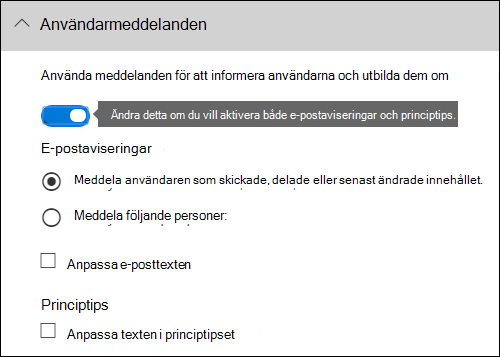

> [!NOTE]
> DLP-principer gäller för alla dokument som matchar principen, oavsett om de är nya eller befintliga. Men en e-postavisering skapas bara när nytt innehåll matchar en befintlig DLP-princip. Befintligt innehåll är skyddat, men genererar inte ett användarmeddelande via e-post.

## Alternativ för konfigurering av e-postaviseringar

För varje regel i en DLP-princip kan du:

- Skicka aviseringen till de personer du väljer. De här personerna kan inkludera ägaren av innehållet, den person som senast ändrade innehållet, ägaren av webbplatsen där innehållet lagras eller en viss användare.

- Anpassa texten som tas med i meddelandet med hjälp av HTML eller token. Mer information finns i avsnittet nedan.

> [!NOTE]
>  E-postaviseringar kan endast skickas till enskilda mottagare, inte till grupper eller distributionslistor. Endast nytt innehåll utlöser en e-postavisering. När du redigerar befintligt innehåll utlöses principtips, men inte ett e-postmeddelande.

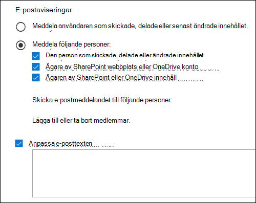

### Standardavisering om e-post

Aviseringar har en ämnesrad som börjar med den åtgärd som vidtas, till exempel "Meddelande", "Meddelande blockerat" för e-post eller "Åtkomst blockerad" för dokument. Om meddelandet handlar om ett dokument innehåller meddelandetexten en länk som tar dig till den webbplats där dokumentet lagras och öppnar principtipset för dokumentet, där du kan lösa eventuella problem (se avsnittet nedan om principtips). Om meddelandet handlar om ett meddelande innehåller meddelandet som en bifogad fil det meddelande som matchar en DLP-princip.

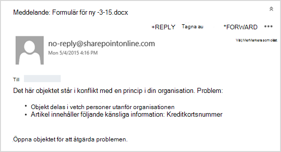

Som standard visar meddelanden text som liknar följande för ett objekt på en webbplats. Meddelandetexten konfigureras separat för varje regel, så texten som visas varierar beroende på vilken regel som matchas.

|**Om DLP-principregeln gör det här...**|**Standardmeddelandet för en SharePoint eller OneDrive för företag det här ...**|**Standardmeddelandet för meddelandena Outlook det här ...**|
|:-----|:-----|:-----|
|Skickar ett meddelande men tillåter inte åsidosättning    |Det här objektet står i konflikt med en princip i din organisation.    |Ditt e-postmeddelande står i konflikt med en princip i din organisation.    |
|Blockerar åtkomst, skickar ett meddelande och tillåter åsidosättning    |Det här objektet står i konflikt med en princip i din organisation. Om du inte löser konflikten kan åtkomsten till den här filen blockeras.    |Ditt e-postmeddelande står i konflikt med en princip i din organisation. Meddelandet levererades inte till alla mottagare.    |
|Blockerar åtkomst och skickar ett meddelande    |Det här objektet står i konflikt med en princip i din organisation. Åtkomst till det här objektet blockeras för alla utom ägaren, den senaste modifieringen och den primära administratören för webbplatssamlingen.    |Ditt e-postmeddelande står i konflikt med en princip i din organisation. Meddelandet levererades inte till alla mottagare.    |

### Anpassad e-postavisering

Du kan skapa en anpassad e-postavisering i stället för att skicka standardaviseringen för e-post till slutanvändarna eller administratörerna. Det anpassade e-postmeddelandet har stöd för HTML och har en gräns på 5 000 tecken. Du kan använda HTML för att ta med bilder, formatering och annan profilering i meddelandet.

Du kan också använda följande tokens för att anpassa e-postaviseringen. Dessa tokens är variabler som ersätts med specifik information i meddelandet som skickas.

|**Token**|**Beskrivning**|
|:-----|:-----|
|%%AppliedActions%%    |Åtgärderna som tillämpas på innehållet.    |
|%%ContentURL%%    |URL-adressen till dokumentet på webbplatsen SharePoint online eller OneDrive för företag webbplatsen.    |
|%%MatchedConditions%%    |Villkoren som matchades av innehållet. Använd den här token för att informera personer om möjliga problem med innehållet.    |

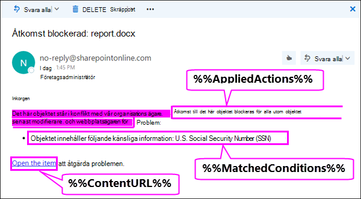

## Alternativ för konfigurering av principtips

För varje regel i en DLP-princip kan du konfigurera principtips så att de:

- Informera bara personen om att innehållet står i konflikt med en DLP-princip, så att de kan vidta åtgärder för att lösa konflikten. Du kan använda standardtexten (se tabellerna nedan) eller ange anpassad text om organisationens specifika principer.

- Tillåt personen att åsidosätta DLP-principen. Om du vill kan du:

  - Kräv att personen anger en affärs justering för att åsidosätta principen. Den här informationen loggas och du kan visa den i DLP-rapporter i **avsnittet** Rapporter i &amp; Säkerhetsefterlevnad.

  - Tillåt att personen rapporterar en felaktig spärr och åsidosätter DLP-principen. Den här informationen loggas även för rapportering, så att du kan använda falska positiva resultat för att finjustera dina regler.

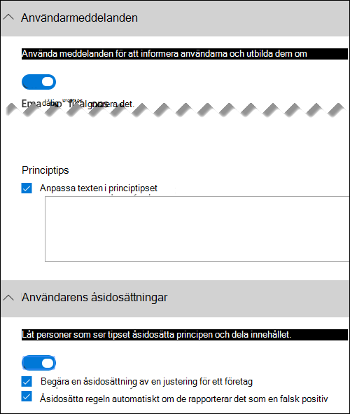

Du kan till exempel tillämpa en DLP-princip på OneDrive för företag webbplatser som identifierar personligt identifierbar information (PII), och denna princip har tre regler:

1. Första regeln: Om färre än fem instanser av den här känsliga informationen identifieras i ett dokument  och dokumentet delas med personer inom organisationen visas ett principtips i åtgärden Skicka ett meddelande. För principtips krävs inga åsidosättningsalternativ eftersom den här regeln bara informerar användarna och inte blockerar åtkomsten.

2. Andra regeln: Om fler än fem instanser av den här känsliga informationen identifieras i ett dokument  och dokumentet delas med personer inom organisationen  begränsar åtgärden Blockera åtkomst till innehåll filens behörigheter och med åtgärden Skicka ett meddelande kan andra åsidosätta åtgärderna i den här regeln genom att ange en affärsre justering. Ibland kräver organisationens företag att interna användare delar pii-data och du inte vill att DLP-principen ska blockera det här arbetet.

3. Tredje regeln: Om större än fem instanser av den här känsliga informationen identifieras i ett dokument  och dokumentet delas med personer utanför organisationen  begränsar åtgärden Blockera åtkomst till innehåll filens behörigheter och åtgärden Skicka ett meddelande tillåter inte att personer åsidosätter åtgärderna i den här regeln eftersom informationen delas externt. Under inga omständigheter ska personer i organisationen tillåtas att dela PII-data utanför organisationen.

Här är några bra saker att förstå om att använda ett principtips för att åsidosätta en regel:

- Alternativet att åsidosätta är per regel och det åsidosätter alla åtgärder i regeln (förutom att skicka ett meddelande, vilket inte kan åsidosättas).

- Innehållet kan matcha flera regler i en DLP-princip, men endast principtipset från den högst prioriterade regeln visas. Till exempel kommer ett principtips från en regel som blockerar åtkomst till innehåll att visas över ett principtips från en regel som helt enkelt skickar ett meddelande. Det gör att det inte går att se en störtlapp av principtips.

- Om principtipset i den mest restriktiva regeln tillåter att användare åsidosätter regeln åsidosätter den här regeln även eventuella andra regler som det matchade innehållet.

## Principtips för OneDrive för företag webbplatser och SharePoint onlinewebbplatser

När ett dokument på en OneDrive för företag-webbplats eller SharePoint Online-webbplats matchar en regel i en DLP-princip och den regeln använder principtips, visar principtipsen särskilda ikoner i dokumentet:

1. Om regeln skickar ett meddelande om filen visas varningsikonen.

2. Om regeln blockerar åtkomsten till dokumentet visas den blockerade ikonen.

   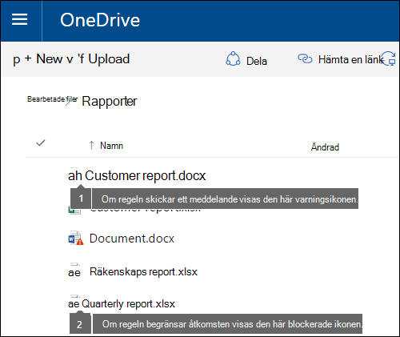

Om du vill vidta åtgärder för ett dokument kan du markera ett objekt genom att välja ikonen för fönstret Informationsinformation i det övre högra hörnet på sidan för att öppna informationsfönstret \>   \> **principtips.**

Principtipset innehåller alla problem med innehållet och om principtipsen har konfigurerats med  de här alternativen  kan du välja Lös och sedan Åsidosätta principtipset eller Rapportera en felaktig positiv inställning. 

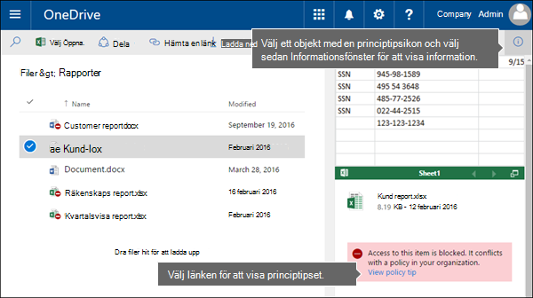

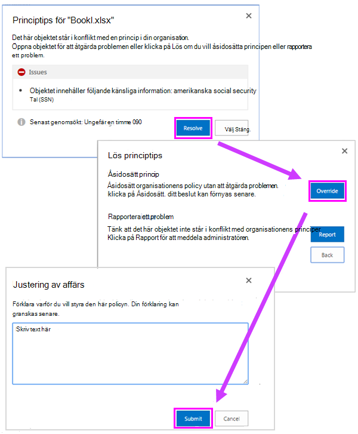

DLP-principer synkroniseras med webbplatser och innehåll utvärderas mot dem med jämna mellanrum och asynkront, så det kan uppstå en kort fördröjning mellan det att du skapar DLP-principen och den tid då du börjar se principtips. Det kan uppstå en liknande fördröjning från när du löser eller åsidosätter ett principtips till när ikonen i dokumentet på webbplatsen försvinner.

### Standardtext för principtips på webbplatser

Som standard visar principtips text som liknar följande för ett objekt på en webbplats. Meddelandetexten konfigureras separat för varje regel, så texten som visas varierar beroende på vilken regel som matchas.

|**Om DLP-principregeln gör det här...**|**Då står det i standardprinciptipset här ...**|
|:-----|:-----|
|Skickar ett meddelande men tillåter inte åsidosättning    |Det här objektet står i konflikt med en princip i din organisation.    |
|Blockerar åtkomst, skickar ett meddelande och tillåter åsidosättning    |Det här objektet står i konflikt med en princip i din organisation. Om du inte löser konflikten kan åtkomsten till den här filen blockeras.    |
|Blockerar åtkomst och skickar ett meddelande    |Det här objektet står i konflikt med en princip i din organisation. Åtkomst till det här objektet blockeras för alla utom ägaren, den senaste modifieringen och den primära administratören för webbplatssamlingen.    |

### Anpassad text för principtips på webbplatser

Du kan anpassa texten för principtips separat från e-postaviseringen. Till skillnad från anpassad text för e-postaviseringar (se avsnittet ovan) accepterar inte anpassad text för principtips HTML eller token. I stället är anpassad text för principtips oformaterad text endast med en begränsning på 256 tecken.

## Principtips i Outlook på webben och Outlook 2013 och senare

När du skriver ett nytt e-postmeddelande i Outlook på webben och Outlook 2013 och senare visas ett principtips om du lägger till innehåll som matchar en regel i en DLP-princip och den regeln använder principtips. Principtipset visas högst upp i meddelandet, ovanför mottagarna, medan meddelandet består.

Principtips fungerar oavsett om känslig information visas i meddelandets brödtext, på ämnesraden eller i ett meddelande som visas här.

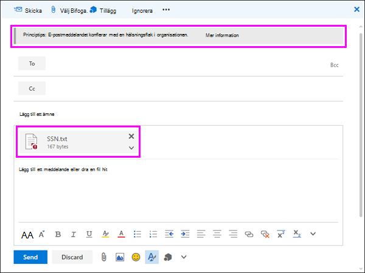

Om principtipsen har konfigurerats för att  tillåta åsidosättning kan du välja Visa åsidosättning av detaljer och ange en justering för ett företag eller rapportera \>  \> en felaktig \> **åsidosättning** av principen.

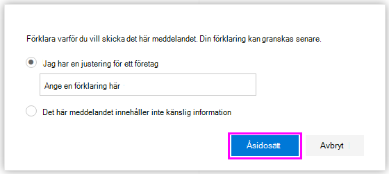

Observera att när du lägger till känslig information i ett e-postmeddelande kan det uppstå fördröjningar mellan när känslig information läggs till och när principtipset visas.

### Outlook 2013 och senare har stöd för att visa principtips endast för vissa villkor

För närvarande stöds Outlook 2013 och senare med policytips endast för dessa villkor:

- Innehållet innehåller
- Innehåll delas

Observera att undantag anses vara villkor och att alla dessa villkor fungerar i Outlook, där de matchar innehåll och tillämpar skyddsåtgärder för innehåll. Men det finns ännu inte stöd för att visa principtips för användare.

### Principtips i Exchange administrationscenter och &amp; Säkerhetsefterlevnadscenter

Principtips kan antingen fungera med DLP-principer och e-postflödesregler som skapats i Exchange-administrationscentret eller med DLP-principer som skapats i Säkerhetsefterlevnadscenter, men inte &amp; båda. Det beror på att dessa principer lagras på olika platser, men principtips kan endast ritas från en enda plats.

Om du har konfigurerat principtips i administrationscentret för Exchange visas inte principtips som du konfigurerar i säkerhetsefterlevnadscentret för användare i Outlook på webben och Outlook 2013 eller senare förrän du inaktiverar tipsen i administrationscentret för &amp; Exchange. Det säkerställer att Exchange för e-postflödesregler (kallas även transportregler) fortsätter att fungera tills du väljer att växla över till &amp; Säkerhetsefterlevnadscenter.

Observera att även om principtips bara kan ritas från en enda plats skickas alltid e-postmeddelanden, även om du använder DLP-principer i både säkerhets- och Exchange &amp; administrationscenter.

### Standardtext för principtips i e-post

Som standard visar principtips text som liknar följande för e-post.

|**Om DLP-principregeln gör det här...**|**Då står det i standardprinciptipset här ...**|
|:-----|:-----|
|Skickar ett meddelande men tillåter inte åsidosättning    |Din e-post står i konflikt med en princip i din organisation.    |
|Blockerar åtkomst, skickar ett meddelande och tillåter åsidosättning    |Din e-post står i konflikt med en princip i din organisation.    |
|Blockerar åtkomst och skickar ett meddelande    |Din e-post står i konflikt med en princip i din organisation.    |

## Principtips i Excel, PowerPoint och Word

När personer arbetar med känsligt innehåll i skrivbordsversionerna av Excel, PowerPoint och Word kan principtips informera dem i realtid om att innehållet står i konflikt med en DLP-princip. Detta kräver att:

- Dokumentet Office lagras på en webbplats OneDrive för företag eller på en SharePoint Online-webbplats.

- Webbplatsen ingår i en DLP-princip som är konfigurerad för att använda principtips.

Office synkroniserar automatiskt DLP-principerna direkt från Office 365 och skannar sedan dokumenten för att säkerställa att de inte står i konflikt med DLP-principerna och visa principtips i realtid.

> [!NOTE]
> Office genom dokument i programmen för att avgöra om tips för DLP-principen ska visas. De visar inte principtips som SharePoint onlinewebbplatser eller OneDrive för företag webbplatser redan har fastställt ska visas i en fil. Därför kanske du inte alltid ser ett tips för DLP-principen i skrivbordsapparna som visas på SharePoint Online-webbplatserna OneDrive för företag webbplatser. Däremot visar Office-programmen på webben endast DLP-principtips som SharePoint Online-webbplatser eller OneDrive för företag-webbplatser redan har fastställt bör visas.

Beroende på hur du konfigurerar principtipsen i DLP-principen kan andra välja att helt enkelt ignorera principtipset, åsidosätta principen med eller utan en affärsre justering eller rapportera en felaktig positiv.

Principtips visas i meddelandefältet.

Dessutom visas principtips i Backstage-vyn (på **fliken** Arkiv).

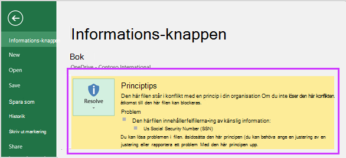

Om principtipsen i DLP-principen är konfigurerade  med  de här alternativen kan du välja Lös om du vill åsidosätta ett principtips eller **Rapportera** en felaktig positiv inställning.

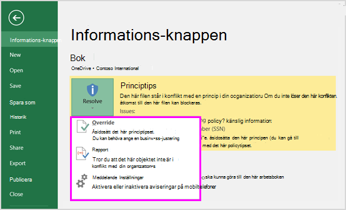

I alla Office datorprogram kan man välja att inaktivera principtips. Om de är inaktiverade visas inte principtips som är enkla meddelanden i meddelandefältet eller Backstage-vyn (på **fliken** Arkiv). Principtips om blockering och åsidosättning visas dock fortfarande, och de kommer fortfarande att få e-postaviseringen. När principtips inaktiveras undantas inte dokumentet från de DLP-principer som har tillämpats på det.

### Standardtext för principtips i Excel 2016, PowerPoint 2016 och Word 2016

Som standard visar principtips text som liknar följande i meddelandefältet och Backstage-vyn i ett öppet dokument. Meddelandetexten konfigureras separat för varje regel, så texten som visas varierar beroende på vilken regel som matchas.

|**Om DLP-principregeln gör det här...**|**Då står det i standardprinciptipset här ...**|
|:-----|:-----|
|Skickar ett meddelande men tillåter inte åsidosättning    |Den här filen står i konflikt med en princip i din organisation. Gå till **Arkiv-menyn** för mer information.    |
|Blockerar åtkomst, skickar ett meddelande och tillåter åsidosättning    |Den här filen står i konflikt med en princip i din organisation. Om du inte löser konflikten kan åtkomsten till den här filen blockeras. Gå till **Arkiv-menyn** för mer information.    |
|Blockerar åtkomst och skickar ett meddelande    |Den här filen står i konflikt med en princip i din organisation. Om du inte löser konflikten kan åtkomsten till den här filen blockeras. Gå till **Arkiv-menyn** för mer information.    |

### Anpassad text för principtips i Excel, PowerPoint och Word

Du kan anpassa texten för principtips separat från e-postaviseringen. Till skillnad från anpassad text för e-postaviseringar (se avsnittet ovan) accepterar inte anpassad text för principtips HTML eller token. I stället är anpassad text för principtips oformaterad text endast med en begränsning på 256 tecken.

## Mer information

- [Mer information om skydd mot dataförlust](dlp-learn-about-dlp.md)
- [Skapa en DLP-princip från en mall](create-a-dlp-policy-from-a-template.md)
- [Villkor, undantag och åtgärder för DLP-princip (förhandsversion)](./dlp-microsoft-teams.md)
- [Skapa en DLP-princip för att skydda dokument med FCI eller andra egenskaper](protect-documents-that-have-fci-or-other-properties.md)
- [Det här innehåller DLP-principmallarna](what-the-dlp-policy-templates-include.md)
- [Entitetsdefinitioner för typer av känslig information](sensitive-information-type-entity-definitions.md)