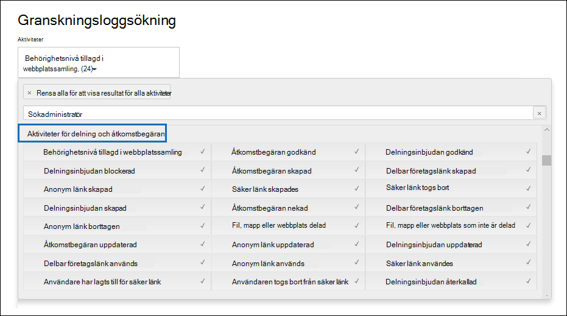

# Använda delningsgranskning i granskningsloggenUse sharing auditing in the audit log

Delning är en viktig aktivitet i SharePoint online och OneDrive för företag, och används ofta i organisationer.Sharing is a key activity in SharePoint Online and OneDrive for Business, and it's widely used in organizations. Administratörer kan använda delningsgranskning i granskningsloggen för att avgöra hur delning används i organisationen.Administrators can use sharing auditing in the audit log to determine how sharing is used in their organization. 
  
## Schemat SharePoint delningThe SharePoint Sharing schema

Delningshändelser (inte händelser relaterade till delningsprincip och delningslänkar) skiljer sig från fil- och mapprelaterade händelser på ett primärt sätt: en användare utför en åtgärd som påverkar en annan användare.Sharing events (not including events related to sharing policy and sharing links) are different from file- and folder-related events in one primary way: one user is performing an action that has an effect on another user. Till exempel när en resurs användare A ger användare B åtkomst till en fil.For example, when a resource User A gives User B access to a file. I det här exemplet är användare A den *agerande användaren* och användare B *är målanvändaren.*In this example, User A is the  *acting user*  and User B is the  *target user*. I SharePoint filschemat påverkar den agerande användarens åtgärd endast själva filen.In the SharePoint File schema, the acting user's action only affects the file itself. När användare A öppnar en fil är den agerande användaren den enda information som behövs i **FileAccessed-händelsen.**When User A opens a file, the only information needed in the **FileAccessed** event is the acting user. För att åtgärda den här skillnaden finns ett separat schema, som kallas SharePoint-delningsschema, som innehåller mer information om delning av händelser. To address this difference, there is a separate schema, called the  *SharePoint Sharing schema*, that captures more information about sharing events. Det här säkerställer att administratörerna har tillgång till vem som har delat en resurs och användaren som resursen har delats med.This ensures that administrators have visibility into who shared a resource and the user the resource was shared with. 
  
I delningsschemat finns ytterligare två fält i en granskningspost som är relaterad till delningshändelser:The Sharing schema provides two additional fields in an audit record related to sharing events: 
  
- **TargetUserOrGroupType:** Identifierar om målanvändaren eller gruppen är medlem, gäst, SharePointGroup, säkerhetsgrupp eller partner.**TargetUserOrGroupType:** Identifies whether the target user or group is a Member, Guest, SharePointGroup, SecurityGroup, or Partner.

- **TargetUserOrGroupName:** Lagrar UPN eller namn för målanvändaren eller gruppen som en resurs delades med (användare B i föregående exempel).**TargetUserOrGroupName:** Stores the UPN or name of the target user or group that a resource was shared with (User B in the previous example). 

De här två fälten kan, förutom andra egenskaper från granskningsloggschemat som Användare, Åtgärd  och Datum, ge information om vilken användare som har delat vilken resurs med vem *och*  *när*.These two fields, in addition to other properties from the audit log schema such as User, Operation, and Date can tell the full story about  *which*  user shared  *what*  resource with  *whom*  and  *when*. 
  
Det finns en annan schemaegenskap som är viktig för delningsartikeln.There's another schema property that's important to the sharing story. När du exporterar granskningsloggsökningsresultat **lagrar kolumnen Information** i den exporterade CSV-filen information om delningshändelser.When you export audit log search results, the **AuditData** column in the exported CSV file stores information about sharing events. När en användare till exempel delar en webbplats med en annan användare sker detta genom att han/hon lägger till målanvändaren i en SharePoint grupp.For example, when a user shares a site with another user, this is accomplished by adding the target user to a SharePoint group. Kolumnen **Information** samlar in den här informationen för att skapa sammanhang för administratörer.The **AuditData** column captures this information to provide context for administrators. I [steg 2](#step-2-use-the-powerquery-editor-to-format-the-exported-audit-log) finns anvisningar om hur du parsar informationen i **kolumnen Information.**See [Step 2](#step-2-use-the-powerquery-editor-to-format-the-exported-audit-log) for instructions on how to parse the information in the **AuditData** column.

## SharePoint delningshändelserSharePoint sharing events

Delning definieras av när en användare (den *agerande* användaren) vill dela en resurs med en annan användare *(målanvändaren).*Sharing is defined by when a user (the *acting* user) wants to share a resource with another user (the *target* user). Granskningsposter som är relaterade till att dela en resurs med en extern användare (en användare som finns utanför organisationen och inte har ett gästkonto i organisationens Azure Active Directory) identifieras med följande händelser som loggas i granskningsloggen:Audit records related to sharing a resource with an external user (a user who is outside of your organization and doesn't have a guest account in your organization's Azure Active Directory) are identified by the following events, which are logged in the audit log:

- **SharingInvitationCreated:** En användare i organisationen försökte dela en resurs (förmodligen en webbplats) med en extern användare.**SharingInvitationCreated:** A user in your organization tried to share a resource (likely a site) with an external user. Det leder till att en extern delningsinbjudan skickas till målanvändaren.This results in an external sharing invitation sent to the target user. Ingen åtkomst till resursen beviljas i det här läget.No access to the resource is granted at this point.

- **SharingInvitationAccepted:** Den externa användaren har accepterat delningsinbjudan som skickats av den agerande användaren och har nu åtkomst till resursen.**SharingInvitationAccepted:** The external user has accepted the sharing invitation sent by the acting user and now has access to the resource.

- **AnonymousLinkCreated:** En anonym länk (även kallad "Alla"-länk) skapas för en resurs.**AnonymousLinkCreated:** An anonymous link (also called an "Anyone" link) is created for a resource. Eftersom en anonym länk kan skapas och sedan kopieras är det lämpligt att anta att alla dokument som har en anonym länk har delats med en målanvändare.Because an anonymous link can be created and then copied, it's reasonable to assume that any document that has an anonymous link has been shared with a target user.

- **AnonymousLinkUsed:** Som namnet antyder loggas händelsen när en anonym länk används för att komma åt en resurs.**AnonymousLinkUsed:** As the name implies, this event is logged when an anonymous link is used to access a resource. 

- **SecureLinkCreated:** En användare har skapat en länk för "specifika personer" för att dela en resurs med en viss person.**SecureLinkCreated:** A user has created a "specific people link" to share a resource with a specific person. Den här målanvändaren kan vara någon utanför organisationen.This target user may be someone who is external to your organization. Den person som resursen delas med identifieras i granskningsposten för **händelsen AddedToSecureLink.**The person that the resource is shared with is identified in the audit record for the **AddedToSecureLink** event. Tidsstämplarna för dessa två händelser är nästan identiska.The time stamps for these two events are nearly identical.

- **AddedToSecureLink:** En användare har lagts till i en länk för specifika personer.**AddedToSecureLink:** A user was added to a specific people link. Använd fältet **TargetUserOrGroupName** i den här händelsen för att identifiera användaren som lagts till i motsvarande länk för personer.Use the **TargetUserOrGroupName** field in this event to identify the user added to the corresponding specific people link. Den här målanvändaren kan vara någon utanför organisationen.This target user may be someone who is external to your organization.

## Arbetsflöde för delning av granskningSharing auditing work flow
  
När en användare (den agerande användaren) vill dela en resurs med en annan användare (målanvändaren), SharePoint (eller OneDrive för företag) kontrollerar han/hon först om målanvändarens e-postadress redan är kopplad till ett användarkonto i organisationens katalog.When a user (the acting user) wants to share a resource with another user (the target user), SharePoint (or OneDrive for Business) first checks if the email address of the target user is already associated with a user account in the organization's directory. Om målanvändaren finns i katalogen (och har ett motsvarande gästanvändarkonto) SharePoint följande:If the target user is in the directory (and has a corresponding guest user account), SharePoint does the following things:
  
-  Tilldelar omedelbart målanvändaren behörigheter för åtkomst till resursen genom att lägga till målanvändaren i rätt SharePoint och loggar en **AddedToGroup-händelse.**Immediately assigns the target user permissions to access the resource by adding the target user to the appropriate SharePoint group, and logs an **AddedToGroup** event. 
    
- Skickar ett delningsmeddelande till målanvändareens e-postadress.Sends a sharing notification to the email address of the target user.
    
- Loggar en **SharingSet-händelse.**Logs a **SharingSet** event. Den här händelsen har ett eget namn som är "Delad fil, mapp eller webbplats" **under** Aktiviteter för delning och åtkomstbegäran i väljaren för granskningsloggens sökverktyg.This event has a friendly name of "Shared file, folder, or site" under **Sharing and access request activities** in the activities picker of the audit log search tool. Se skärmbilden i [Steg 1.](#step-1-search-for-sharing-events-and-export-the-results-to-a-csv-file)See the screenshot in [Step 1](#step-1-search-for-sharing-events-and-export-the-results-to-a-csv-file). 
    
Om målanvändaren inte har ett användarkonto i katalogen gör SharePoint följande:If a user account for the target user isn't in the directory, SharePoint does the following: 
    
   - Loggar någon av följande händelser, baserat på hur resursen delas:Logs one of the following events, based on how the resource is shared:
   
      - **AnonymousLinkCreated****AnonymousLinkCreated**
   
      - **SecureLinkCreated****SecureLinkCreated**
   
      - **AddedToSecureLink****AddedToSecureLink** 

      - **SharingInvitationCreated** (händelsen loggas bara när den delade resursen är en webbplats)**SharingInvitationCreated** (this event is logged only when the shared resource is a site)
    
   - När målanvändaren accepterar delningsinbjudan som skickas till honom/hon (genom att klicka på länken i inbjudan) loggar SharePoint en **SharingInvitationAccepted-händelse** och tilldelar målanvändaren behörigheter för åtkomst till resursen.When the target user accepts the sharing invitation that's sent to them (by clicking the link in the invitation), SharePoint logs a **SharingInvitationAccepted** event and assigns the target user permissions to access the resource. Om målanvändaren skickas en anonym länk loggas **händelsen AnonymousLinkUsed** när målanvändaren använder länken för åtkomst till resursen.If the target user is sent an anonymous link, the **AnonymousLinkUsed** event is logged after the target user uses the link to access the resource. För säkra länkar loggas **en FileAccessed-händelse** när en extern användare använder länken för att komma åt resursen.For secure links, a **FileAccessed** event is logged when an external user uses the link to access the resource.

Ytterligare information om målanvändaren loggas också, till exempel identiteten för användaren som inbjudan är till och användaren som accepterar inbjudan.Additional information about the target user is also logged, such as the identity of the user the invitation is to and the user who accepts the invitation. I vissa fall kan de här användarna (eller e-postadresserna) vara olika.In some case, these users (or email addresses) can be different. 

## Identifiera resurser som delas med externa användareHow to identify resources shared with external users

Ett vanligt krav för administratörer är att skapa en lista över alla resurser som har delats med användare utanför organisationen.A common requirement for administrators is creating a list of all resources that have been shared with users outside of the organization. Med delningsgranskning i Office 365 kan administratörer skapa den här listan.By using sharing auditing in Office 365, administrators can generate this list. Gör så här:Here's how.
  
### Steg 1: Sök efter delningshändelser och exportera resultaten till en CSV-filStep 1: Search for sharing events and export the results to a CSV file

Det första steget är att söka i granskningsloggen efter delningshändelser.The first step is to search the audit log for sharing events. Mer information (inklusive vilka behörigheter som krävs) för att söka i granskningsloggen finns i Söka i granskningsloggen i [& Säkerhets- och efterlevnadscenter.](search-the-audit-log-in-security-and-compliance.md)For more information (including the required permissions) about searching the audit log, see [Search the audit log in the Security & Compliance Center](search-the-audit-log-in-security-and-compliance.md).
  
1. Gå till [https://protection.office.com](https://protection.office.com).Go to [https://protection.office.com](https://protection.office.com).
    
2. Logga in med ditt arbets- eller skolkonto.Sign in using your work or school account.
    
3. I den vänstra rutan i säkerhets- & säkerhets- och efterlevnadscenter klickar du **på Sök i**   >  **granskningsloggsökning**.In the left pane of the Security & Compliance Center, click **Search**  > **Audit log search**.
    
    Sidan **Granskningsloggsökning** visas.The **Audit log search** page is displayed. 
    
4. Under **Aktiviteter** klickar du på **Aktiviteter för delning och åtkomstbegäran** för att söka efter delningsrelaterade händelser.Under **Activities**, click **Sharing and access request activities** to search for sharing-related events. 
    
    
  
5.  Välj ett datum- och tidsintervall för att hitta delningshändelserna som inträffat under perioden.Select a date and time range to find the sharing events that occurred within that period. 
    
6. Klicka **på Sök** för att köra sökningen.Click **Search** to run the search. 
    
7. När sökningen har körts och resultatet visas klickar du på Exportera **resultat Ladda** ned \> **alla resultat.**When the search is finished running and the results are displayed, click **Export results** \> **Download all results**.
    
    När du har valt exportalternativ uppmanas du att öppna eller spara CSV-filen i ett meddelande längst ned i fönstret.After you select the export option, a message at the bottom of the window prompts you to open or save the CSV file.
    
8. Klicka **på** \> **Spara som** och spara CSV-filen i en mapp på den lokala datorn.Click **Save** \> **Save as** and save the CSV file to a folder on your local computer. 

### Steg 2: Använda PowerQuery-redigeraren för att formatera den exporterade granskningsloggenStep 2: Use the PowerQuery Editor to format the exported audit log

Nästa steg är att använda transformeringsfunktionen JSON i Power Query-redigeraren i Excel för att dela upp varje egenskap i kolumnen **Information** (som består av ett JSON-objekt med flera egendom) i en egen kolumn.The next step is to use the JSON transform feature in the Power Query Editor in Excel to split each property in the **AuditData** column (which consists of a multi-property JSON object) into its own column. Då kan du filtrera kolumner för att visa poster som är relaterade till delningThis lets you filter columns to view records related to sharing

Stegvisa instruktioner finns i "Steg 2: Formatera den exporterade granskningsloggen med Power Query-redigeraren" i Exportera, konfigurera och visa [granskningsloggposter.](export-view-audit-log-records.md#step-2-format-the-exported-audit-log-using-the-power-query-editor)For step-by-step instructions, see "Step 2: Format the exported audit log using the Power Query Editor" in [Export, configure, and view audit log records](export-view-audit-log-records.md#step-2-format-the-exported-audit-log-using-the-power-query-editor).

### Steg 3: Filtrera CSV-filen efter resurser som delas med externa användareStep 3: Filter the CSV file for resources shared with external users

Nästa steg är att filtrera CSV-filen efter de olika delningsrelaterade händelser som tidigare beskrivits [i SharePoint för delningshändelser.](#sharepoint-sharing-events)The next step is to filter the CSV for the different sharing-related events that were previously described in the [SharePoint sharing events](#sharepoint-sharing-events) section. Alternativt kan du filtrera kolumnen **TargetUserOrGroupType** för att visa alla poster där egenskapens värde är **Gäst.**Alternatively, you can filter the **TargetUserOrGroupType** column to display all records where the value of this property is **Guest**. 

När du har följt instruktionerna i föregående steg för att förbereda CSV-filen med hjälp av PowerQuery-redigeraren gör du följande:After you've followed the instructions in the previous step to prepare the CSV file by using the PowerQuery editor, do the following:
    
1. Öppna Excel som du skapade i steg 2.Open the Excel file that you created in Step 2. 

2. På fliken **Start** klickar du på **Sortera & filter** och sedan på **Filtrera**.On the **Home** tab, click **Sort & Filter**, and then click **Filter**.
    
3. I **listrutan &** Sortera och filtrera  i kolumnen Åtgärder avmarkerar du alla val, markerar en eller flera av följande delningsrelaterade händelser och klickar sedan på **Ok.**In the **Sort & Filter** dropdown list on the **Operations** column, clear all selections, then select one or more the following sharing-related events and then click **Ok**.
 
   - **SharingInvitationCreated****SharingInvitationCreated**
   
   - **AnonymousLinkCreated****AnonymousLinkCreated**
   
   - **SecureLinkCreated****SecureLinkCreated**
   
   - **AddedToSecureLink****AddedToSecureLink** 
    
    Excel visas raderna för de händelser du har markerat.Excel displays the rows for the events you selected.
    
4. Gå till kolumnen **TargetUserOrGroupType och** markera den.Go to the column named **TargetUserOrGroupType** and select it. 
    
5. I **listrutan & Sortera** och filtrera avmarkerar du alla val, väljer sedan **TargetUserOrGroupType:Guest** och klickar på **Ok.**In the **Sort & Filter** dropdown list, clear all selections, then select **TargetUserOrGroupType:Guest**, and click **Ok**.
    
    Nu Excel rader för delningshändelser OCH var målanvändaren finns utanför organisationen, eftersom externa användare identifieras av värdet **TargetUserOrGroupType:Guest.**Now Excel displays the rows for sharing events AND where the target user is outside of your organization, because external users are identified by the value **TargetUserOrGroupType:Guest**. 
  
> [!TIP]
> För de granskningsposter som visas identifierar **kolumnen ObjectId** den resurs som delades med målanvändaren. till exempel  `ObjectId:https:\/\/contoso-my.sharepoint.com\/personal\/sarad_contoso_com\/Documents\/Southwater Proposal.docx` .For the audit records that are displayed, the **ObjectId** column identifies the resource that was shared with the target user; for example  `ObjectId:https:\/\/contoso-my.sharepoint.com\/personal\/sarad_contoso_com\/Documents\/Southwater Proposal.docx`.
