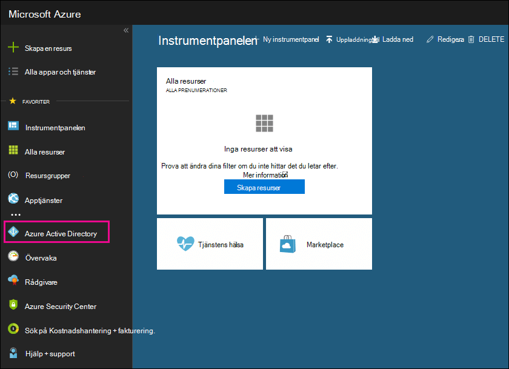

# Använda din kostnadsfria Azure Active Directory-prenumerationUse your free Azure Active Directory subscription

Om din organisation har en betald prenumeration på Microsoft 365, Microsoft Dynamics CRM Online, Enterprise Mobility Suite eller andra Microsoft-tjänster, har du en kostnadsfri prenumeration på Microsoft Azure Active Directory.If your organization has a paid subscription to Microsoft 365, Microsoft Dynamics CRM Online, Enterprise Mobility Suite, or other Microsoft services, you have a free subscription to Microsoft Azure Active Directory. Du och andra administratörer kan använda Azure AD för att skapa och hantera användar- och gruppkonton.You and other admins can use Azure AD to create and manage user and group accounts. Om du vill använda Azure AD går du bara till Azure-portalen och loggar in på ditt konto.To use Azure AD, just go to the Azure portal and sign in to your account.

## Öppna en privat webbläsarsessionOpen a private browsing session

Använd en privat webbläsarsession (inte en vanlig session) för att komma åt Azure-portalen (i steg 1 nedan).Use a private browsing session (not a regular session) to access the Azure portal (in step 1 below). Det förhindrar att autentiseringsuppgifterna som du är inloggad med överförs till Azure.This prevents the credentials that you're currently logged on with from being passed to Azure. För att öppna en privat webbläsarsession:To open a private browsing session:

- I Microsoft Edge (äldre version), Internet Explorer eller Mozilla FireFox trycker du på `CTRL+SHIFT+P`.In Microsoft Edge (legacy version), Internet Explorer, or Mozilla FireFox, press `CTRL+SHIFT+P`.

- I Microsoft Edge (senaste versionen) eller Google Chrome trycker du på `CTRL+SHIFT+N`.In Microsoft Edge (newest version) or Google Chrome, press `CTRL+SHIFT+N`.

## Åtkomst till Azure Active DirectoryAccess Azure Active Directory

1. Gå till [portal.azure.com](https://portal.azure.com) och logga in med ditt arbets- eller studentkonto.Go to [portal.azure.com](https://portal.azure.com) and sign in with your work or student account.

2. I det vänstra navigeringsfönstret i Azure-portalen klickar du på **Azure Active Directory**.In the left navigation pane in the Azure portal, click **Azure Active Directory**.

    

    Då visas administrationscentret för **Azure Active Directory**.The **Azure Active Directory** admin center is displayed.

## Mer informationMore information

- En kostnadsfri Azure Active Directory-prenumeration innehåller inte rapporten om inloggningsaktivitet.A free Azure Active Directory subscription does not include the Sign-ins activity report. Om du vill registrera inloggningsaktivitet (vilket kan vara användbart vid dataintrång) behöver du en Azure Active Directory Premium-prenumeration.To record sign-in activity (which can be useful in a data breach), you need an Azure Active Directory Premium subscription. Mer information finns i [Hur länge lagras data i Azure AD?](/azure/active-directory/reports-monitoring/reference-reports-data-retention#how-long-does-azure-ad-store-the-data).For more information, see [How long does Azure AD store the data?](/azure/active-directory/reports-monitoring/reference-reports-data-retention#how-long-does-azure-ad-store-the-data).

- Du kan också öppna administrationscentret för **Azure Active Directory** i administrationscentret för Microsoft 365.You can also access the **Azure Active Directory** admin center from the Microsoft 365 admin center. I det vänstra navigeringsfönstret i administrationscentret för Microsoft 365 klickar du på **Administrationscenter** \> **Azure Active Directory**.In the left navigation pane of the Microsoft 365 admin center, click **Admin centers** \> **Azure Active Directory**.

- Information om hur du hanterar användare och grupper och utför andra kataloghanteringsuppgifter finns i [Hantera din Azure Active Directory](/azure/active-directory/active-directory-administer).For information about managing users and groups and performing other directory management tasks, see [Manage your Azure AD directory](/azure/active-directory/active-directory-administer).