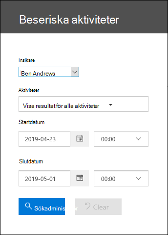
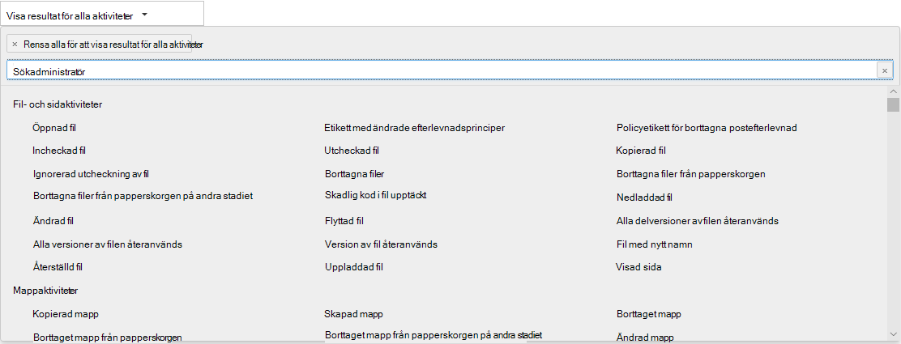

# Visa visningsaktiviteter för granskareView custodian audit activity

Behöver du ta reda på om en användare har visat ett visst dokument eller tagit bort ett objekt från postlådan?Need to find if a user viewed a specific document or purged an item from their mailbox? Advanced eDiscovery nu integrerats med det befintliga sökverktyget i granskningsloggen i Säkerhets- & Säkerhets- och efterlevnadscenter.Advanced eDiscovery is now integrated with the existing audit log search tool in the Security & Compliance Center. Med hjälp av den här inbäddade upplevelsen kan du använda verktyget Advanced eDiscovery Uppsåtande hantering för att underlätta din undersökning genom att enkelt komma åt och söka i aktiviteten för biblioteks uppringare i ditt ärende.Using this embedded experience, you can use the Advanced eDiscovery Custodian Management tool to facilitate your investigation by easily accessing and searching the activity for custodians within your case.

## Få behörigheterGet permissions

Du måste ha tilldelats rollen Skrivskyddade granskningsloggar eller Granskningsloggar i Exchange Online för att söka i granskningsloggen.You have to be assigned the View-Only Audit Logs or Audit Logs role in Exchange Online to search the audit log. Som standard tilldelas de här rollerna till rollgrupperna Efterlevnadshantering och Organisationshantering på sidan Behörigheter i administrationscentret för Exchange.By default, these roles are assigned to the Compliance Management and Organization Management role groups on the Permissions page in the Exchange admin center. Om du vill ge en användare möjlighet att söka i Advanced eDiscovery-granskningsloggen med den lägsta behörighetsnivån kan du skapa en anpassad rollgrupp i Exchange Online, lägga till rollen View-Only-granskningsloggar eller granskningsloggar och sedan lägga till användaren som medlem i den nya rollgruppen.To give a user the ability to search the Advanced eDiscovery audit log with the minimum level of privileges, you can create a custom role group in Exchange Online, add the View-Only Audit Logs or Audit Logs role, and then add the user as a member of the new role group. Mer information finns i Hantera rollgrupper i Exchange Online.For more information, see Manage role groups in Exchange Online.

> [!IMPORTANT]
> Om du tilldelar en användare rollen View-Only granskningsloggar eller granskningsloggar på sidan Behörigheter i säkerhets- och efterlevnadscentret för & kan de inte söka i granskningsloggen.If you assign a user the View-Only Audit Logs or Audit Logs role on the Permissions page in the Security & Compliance Center, they won't be able to search the audit log. Du måste tilldela behörigheterna i Exchange Online.You have to assign the permissions in Exchange Online. Det beror på att den underliggande cmdleten som används för att söka i granskningsloggen är en Exchange Online-cmdlet.This is because the underlying cmdlet used to search the audit log is an Exchange Online cmdlet.

## Steg 1: Sök i granskningsloggen efter aktiviteter som utförts av en vårdnadshavareStep 1: Search the audit log for activities performed by a custodian

1. Gå till **eDiscovery > Advanced eDiscovery** och öppna ärendet.Go to  **eDiscovery > Advanced eDiscovery** and open the case.
  
2. Klicka på **fliken** Källor.Click the **Sources** tab.
  
3. På sidan **The Förserer** väljer du en vårdnadshavare i listan och klickar sedan på **Visa** läsaktiviteter på den utfällade sidan.On the **Custodians** page, select a custodian from the list, and then click **View custodian activity** on the flyout page.

    Söksidan Förskanningsaktiviteter visas.The Custodian activities search page is displayed. Observera att den vårdnadshavare du valde i föregående steg visas **i** listrutan Förn eller inte.Note the custodian you selected in the previous step is displayed in the **Custodian** drop-down box. Du kan välja olika språk i listrutan, men du kan bara söka efter aktiviteter åt gången för att hitta en vårdnadshavare.You can select different custodians in the drop-down box, but you can only search for activities for one custodian at a time.

    
   
4. Konfigurera följande sökvillkor:Configure the following search criteria:
      
   1. **Aktiviteter** – Klicka på listrutan för att visa de aktiviteter som du kan söka efter.**Activities** - Click the drop-down list to display the activities that you can search for. När du har kört sökningen visas bara granskningsposterna för de markerade aktiviteterna.After you run the search, only the audit records for the selected activities are displayed. Om **du markerar Visa resultat för alla** aktiviteter visas resultat för alla aktiviteter som utförts av den som är den som matchar de andra sökvillkoren.Selecting **Show results for all activities** will display results for all activities performed by the custodian that match the other search criteria.

      
      
   1. **Startdatum och Slutdatum – Välj** ett datum- och tidsintervall för att visa händelser som inträffat under perioden.**Start date and End date** - Select a date and time range to display the events that occurred within that period. De senaste sju dagarna är valda som standard.The last seven days are selected by default. Datum och tid presenteras i UTC-format (Coordinated Universal Time).The date and time are presented in Coordinated Universal Time (UTC) format. Det maximala datumintervall som du kan ange är ett år.The maximum date range that you can specify is one year.
      
   1. **Torer** – Klicka i den här rutan och välj sedan en specifik objekt att visa sökresultat för.**Custodians** - Click in this box and then select a specific custodian to display search results for. Granskningsposter för den valda aktiviteten som utförts av de användare du väljer i den här rutan visas i resultatlistan.Audit records for the selected activity performed by the users you select in this box are displayed in the list of results.
      
5. Klicka påClick   om du vill köra sökningen enligt dina sökvillkor.to run the search using your search criteria. Sökresultaten läses in och efter en liten stund visas de under Resultat på söksidan Förnärendeaktiviteter.The search results are loaded, and after a few moments they are displayed under Results on the Custodian Activities search page. 

## Steg 2: Visa granskningsloggens sökresultatStep 2: View the audit log search results

Resultatet av en granskningslogg visas under Resultat på sidan Kontroll av granskningslogg.The results of an audit log search are displayed under Results on the Custodian Audit log page. Maximalt 5 000 (senaste) händelser visas i steg om 150 händelser.A maximum of 5,000 (newest) events are displayed in increments of 150 events. Om du vill visa fler händelser kan du använda rullningslisten i fönstret Resultat eller så kan du trycka på Skift + End för att visa de nästa 150 händelserna.To display more events you can use the scroll bar in the Results pane or you can press Shift + End to display the next 150 events.

Resultatet innehåller följande information om varje händelse som returneras av sökningen.The results contain the following information about each event returned by the search.
- **Datum:** Datum och tid (i UTC-format) när händelsen inträffade.**Date**: The date and time (in UTC format) when the event occurred.

- **IP-adress**: IP-adressen för den enhet som användes när aktiviteten loggades.**IP address**: The IP address of the device that was used when the activity was logged. IP-adressen visas i IPv4- eller IPv6-adressformat.The IP address is displayed in either an IPv4 or IPv6 address format.

- **Användare**: Användaren (eller tjänstkontot) som utförde åtgärden som utlöste händelsen.**User**: The user (or service account) who performed the action that triggered the event.

- **Aktivitet**: Den aktivitet som användaren utförde.**Activity**: The activity performed by the user. Det här värdet motsvarar de aktiviteter som du valde i listrutan Aktiviteter.This value corresponds to the activities that you selected in the Activities drop down list. För en händelse från granskningsloggen för Exchange-administratören är värdet i den här kolumnen en Exchange-cmdlet.For an event from the Exchange admin audit log, the value in this column is an Exchange cmdlet.

- **Objekt**: Objektet som skapades eller ändrades som ett resultat av motsvarande aktivitet.**Item**: The object that was created or modified as a result of the corresponding activity. Exempelvis den fil som visades eller ändrades eller det användarkonto som uppdaterades.For example, the file that was viewed or modified or the user account that was updated. Alla aktiviteter har inte ett värde i den här kolumnen.Not all activities have a value in this column.

- **Information:** Ytterligare information om en aktivitet.**Detail**: Additional detail about an activity. Inte heller här har alla aktiviteter ett värde.Again, not all activities will have a value.

## Steg 3: Filtrera sökresultatetStep 3: Filter the search results

Förutom att sortera kan du också filtrera resultatet av en granskningsloggsökning.In addition to sorting, you can also filter the results of an audit log search. Det kan hjälpa dig att snabbt filtrera resultatet för en viss användare eller aktivitet.This can help you quickly filter the results for a specific user or activity. 

Så här filtrerar du resultatet:To filter the results:

 1. Skapa och kör en granskningsloggsökning.Create and run an audit log search.
  
2. När resultatet visas klickar du på **Filtrera resultat**.When the results are displayed, click **Filter results**.
 
3. Nyckelordsrutor visas under varje kolumnrubrik.Keyword boxes are displayed under each column header.
  
4. Klicka på någon av rutorna under en kolumnrubrik och skriv ett ord eller en fras, beroende på vilken kolumn du filtrerar på.Click one of the boxes under a column header and type a word or phrase, depending on the column you're filtering on. Resultatet justeras dynamiskt och visar händelser som matchar filtret.The results will dynamically readjust to display the events that match your filter.
  
5. Om du vill ta bort ett filter klickar **du på X** i filterrutan eller så klickar du bara på Dölj **filtrering**.To clear a filter, click the **X** in the filter box or just click **Hide filtering**.

## Exportera sökresultatet till en filExport the search results to a file

Du kan exportera resultatet av en granskningsloggsökning till en fil med kommaavgränsade värden (CSV) på den lokala datorn.You can export the results of an audit log search to a comma separated value (CSV) file on your local computer. Du kan öppna den här filen i Microsoft Excel och använda funktioner som att söka, sortera, filtrera och dela en enstaka kolumn (som innehåller celler med flera värden) i flera kolumner.You can open this file in Microsoft Excel and use features such as search, sorting, filtering, and splitting a single column (that contains multi-value cells) into multiple columns.

1. Kör en granskningsloggsökning och ändra sedan sökvillkoren tills du fått önskat resultat.Run an audit log search, and then revise the search criteria until you have the desired results.
  
2. Klicka på Exportera resultat och välj något av följande alternativ:Click Export results and select one of the following options:

    - **Spara inlästa resultat:** Välj det här alternativet om du bara vill exportera de poster som visas under **Resultat** på sidan **Datagranskningsloggsökning.****Save loaded results:** Choose this option to export only the entries that are displayed under **Results** on the **Custodian Audit log search** page. CSV-filen som laddas ned innehåller samma kolumner (och data) som visas på sidan (Datum, Användare, Aktivitet, Objekt och Information).The CSV file that is downloaded contains the same columns (and data) displayed on the page (Date, User, Activity, Item, and Details). En extra kolumn (mer **som heter**) ingår i CSV-filen som innehåller mer information från granskningsloggposten.An additional column (titled **More**) is included in the CSV file that contains more information from the audit log entry. Eftersom du exporterar samma resultat som är inlästa (och går att visa) på sidan Sökning i granskningslogg exporteras högst 5 000 poster.Because you're exporting the same results that are loaded (and viewable) on the Audit log search page, a maximum of 5,000 entries are exported.
        
    - **Ladda ned alla resultat:** Välj det här alternativet om du vill exportera alla poster från granskningsloggen som uppfyller sökvillkoren.**Download all results:** Choose this option to export all entries from the audit log that meet the search criteria. Om du har en stor uppsättning sökresultat väljer du det här alternativet om du vill ladda ned alla poster  från granskningsloggen utöver de 5 000 resultat som kan visas på sidan Kontrollboksloggsökning.For a large set of search results, choose this option to download all entries from the audit log in addition to the 5,000 results that can be displayed on the **Custodian Audit log** search page. Det här alternativet laddar ned rådata från granskningsloggen till en CSV-fil och innehåller ytterligare information från granskningsloggposten i en kolumn med namnet Information.This option will download the raw data from the audit log to a CSV file, and contains additional information from the audit log entry in a column named AuditData. Det kan ta längre tid att ladda ned filen om du väljer det här exportalternativet eftersom filen kan vara mycket större än den som laddas ned om du väljer det andra alternativet.It may take longer to download the file if you choose this export option because the file may be much larger than the one that's downloaded if you choose the other option.
    
      > [!IMPORTANT]
      > Du kan ladda ned högst 50 000 poster till en CSV-fil från en enstaka granskningsloggsökning.You can download a maximum of 50,000 entries to a CSV file from a single audit log search. Om 50 000 poster laddas ned till CSV-filen kan du antagligen förutsätta att det finns fler än 50 000 händelser som uppfyller sökkriterierna.If 50,000 entries are downloaded to the CSV file, you can probably assume there are more than 50,000 events that met the search criteria. Om du vill exportera fler poster än så kan du prova att använda ett datumintervall för att minska antalet granskningsloggposter.To export more than this limit, try using a date range to reduce the number of audit log entries. Du kan behöva köra flera sökningar med mindre datumintervall för att exportera mer än 50 000 poster.You might have to run multiple searches with smaller date ranges to export more than 50,000 entries.
        

3. När du har valt exportalternativ visas ett meddelande längst ned i fönstret som uppmanar dig att öppna CSV-filen, spara den i mappen Hämtade filer eller spara den i en särskild mappAfter you select an export option, a message is displayed at the bottom of the window that prompts you to open the CSV file, save it to the Downloads folder, or save it to a specific folder

Mer information om hur du visar, filtrerar eller exporterar granskningsloggsökningsresultat finns i Söka i granskningsloggen i [& Säkerhets- och efterlevnadscenter.](search-the-audit-log-in-security-and-compliance.md)For more information about viewing, filtering, or exporting audit log search results, see [Search the audit log in the Security & Compliance Center](search-the-audit-log-in-security-and-compliance.md).
