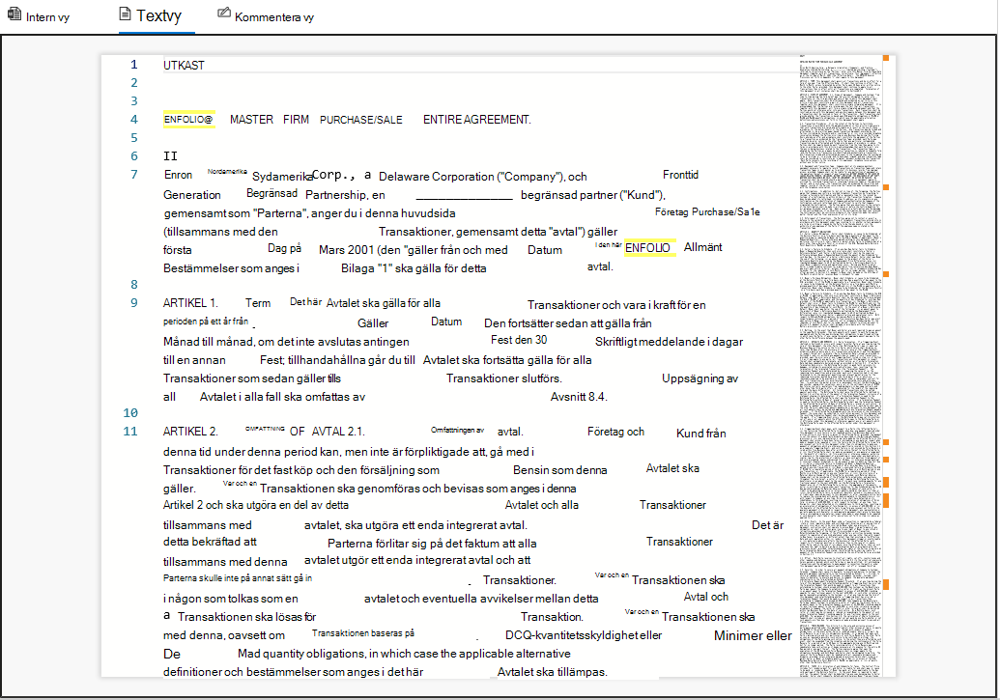
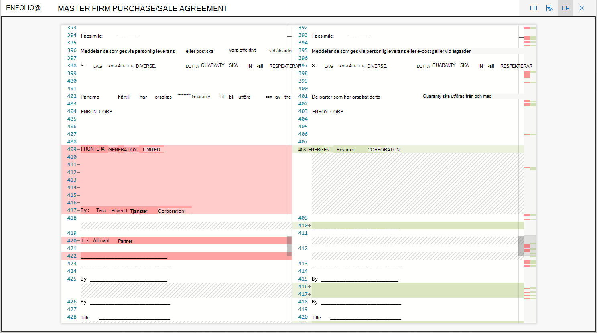
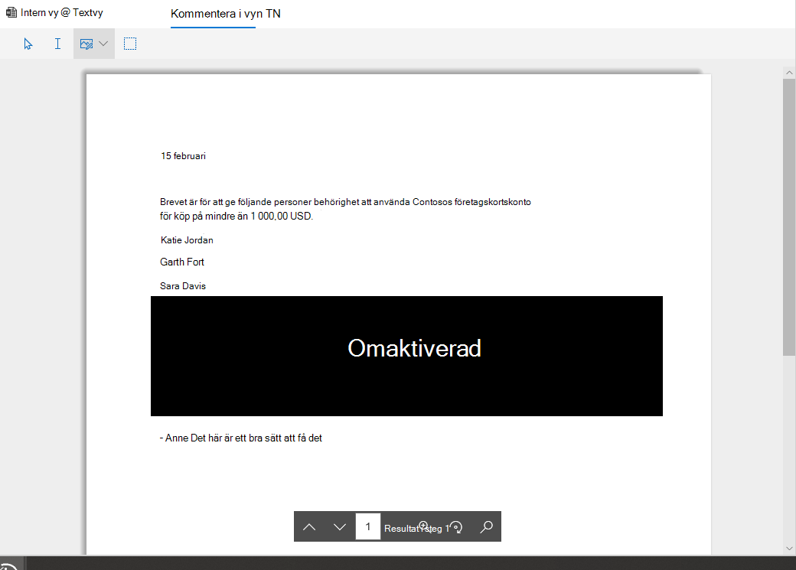

# Visa dokument i en granskningsuppsättning i Advanced eDiscoveryView documents in a review set in Advanced eDiscovery

Advanced eDiscovery visar innehåll via flera läsare som har olika syften.Advanced eDiscovery displays content via several viewers each with different purposes. De olika läsarna kan användas genom att klicka på ett dokument i en granskningsuppsättning.The various viewers can be used by clicking on any document within a review set. De visningsprogram som för närvarande visas är:The viewers currently provided are:

- FilmetadataFile metadata
- Intern vyNative view
- TextvyText view
- Kommentera i vynAnnotate view

## FilmetadataFile metadata

Du kan inaktivera/inaktivera den här panelen om du vill visa olika metadata som är kopplade till dokumentet.This panel can be toggled on/off to display various metadata associated with the document. Även om sökresultatrutnätet kan anpassas för att visa specifika metadata finns det fall där det kan vara svårt att bläddra vågrätt medan du granskar data.Although the search results grid can be customized to display specific metadata, there are instances where scrolling horizontally can be difficult while reviewing data. På panelen Filmetadata kan en användare växla mellan en vy i visningsprogrammet.The File metadata panel allows a user to toggle on a view within the viewer.

## Intern vyNative view

I det inbyggda visningsprogrammet visas den största vyn i ett dokument.The Native viewer displays the richest view of a document. Den har stöd för hundratals filtyper och är avsedd att visa så sant som möjligt som möjligt.It supports hundreds of file types and is meant to display the truest to native experience possible. För Microsoft Office-filer använder visningsprogrammet webbversionen av Office-appar för att visa innehåll som dokumentkommentarer, Excel-formler, dolda rader/kolumner och PowerPoint anteckningar.For Microsoft Office files, the viewer uses the web version of Office apps to display content such as document comments, Excel formulas, hidden rows/columns, and PowerPoint notes.

## TextvyText view

I textvisningsprogrammet visas den extraherade texten i en fil.The Text viewer provides a view of the extracted text of a file. Den ignorerar inbäddade bilder och all formatering men är mycket effektivt om du försöker förstå innehållet snabbt.It ignores any embedded images and formatting but is very effective if you are trying to understand the content quickly. Textvyn innehåller även följande funktioner:Text view also includes these features:

- Med linjeräknare blir det enklare att referera till vissa delar av ett dokumentLine counter makes it easier to reference specific portions of a document
- Sökmarkering där termer i dokumentet och rullningslisten markerasSearch hit highlighting that will highlight terms within the document as well as the scrollbar
- Med diff-vyn får du en jämförelsevy som markerar textskillnaderna när du visar nära dubblettdokumentDiff view provides a comparison view that highlights textual differences when viewing Near Duplicate documents

## Kommentera i vynAnnotate view

Anteckningsvyn innehåller funktioner som gör att användare kan använda markeringar i ett dokument, till exempel:The Annotate view provides features that allow users to apply markup on a document including:

- Områdesredigering – användarna kan rita en ruta i dokumentet för att dölja känsligt innehållArea redactions – users can draw a box on the document in order to hide sensitive content
- Pencil – användare kan fritt rita på ett dokument för att uppmärksamma vissa delar av ett dokumentPencil – users can free-hand draw on a document in order to bring attention to certain portions of a document
- Markera anteckningar – användarna kan markera anteckningar i ett dokument för att ta bort demSelect annotations - users can select annotations on a document in order to delete
- Växla anteckningsgenomskinlighet – gör anteckningar halvgenomskinliga för att visa innehållet bakom anteckningenToggle annotation transparency – makes annotations semi-transparent in order to view the content behind the annotation
- Föregående sida – navigerar till föregående sidaPrevious page – navigates to previous page
- Nästa sida – navigerar till nästa sidaNext page – navigates to the next page
- Gå till sidan – användaren kan ange ett specifikt sidnummer för att gå tillGo to page – user can enter a specific page number to navigate to
- Zooma – ange zoomnivån för kommentarvynZoom – set zoom level for annotate view
- Rotera – användaren kan rotera dokumentet medursRotate – user can rotate document clockwise
- Sökning – användaren kan söka i ett dokument och navigera till de olika träffarna i dokumentetSearch – user can search within a document and navigate to the various hits within the document

  

## InstrumentpanelsvyDashboard View

Med instrumentpanelsvyn kan du visualisera och sammanfatta data i sökresultatrutnätet.The dashboard view allows you to visualize and summarize the data in your search results grid. I den här vyn kan du skapa anpassade widgetar för att göra det intuitivt och enkelt att analysera och rapportera din granskning.In this view, you can create custom widgets to make analyzing and reporting on your review set intuitive and easy. När du har skapat widgetarna kan du interagera med dem för att räkna objekt eller skapa en sökning.Once you have created your widgets, you can interact with them to get item counts or to create a search.
