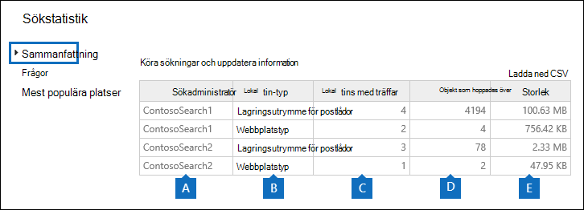
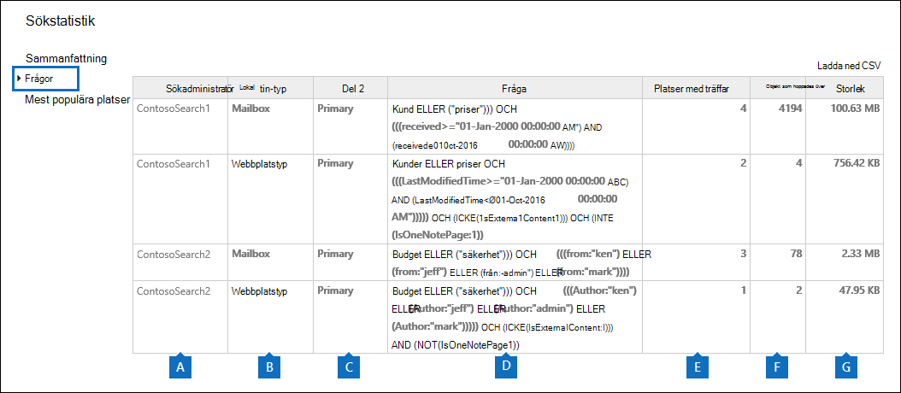
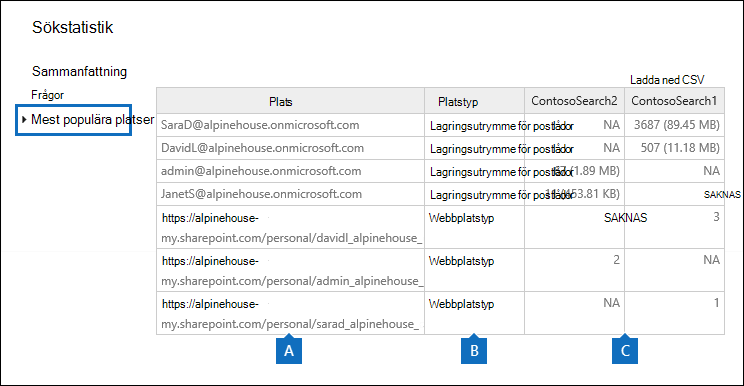
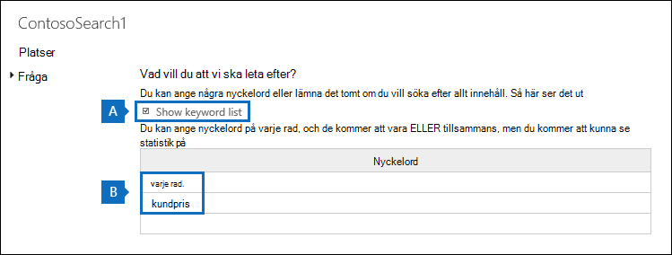

# Visa nyckelordsstatistik för resultat i innehållssökningView keyword statistics for Content Search results

När du har skapat och kört en innehållssökning kan du visa statistik om det uppskattade sökresultatet.After you create and run a Content Search, you can view statistics about the estimated search results. Det inkluderar en sammanfattning av sökresultaten (ungefär som sammanfattningen av det uppskattade sökresultatet som visas i informationsfönstret), frågestatistik som antalet innehållsplatser med objekt som matchar sökfrågan och namnet på de innehållsplatser som har de mest matchande objekten.This includes a summary of the search results (similar to the summary of the estimated search results displayed in the details pane), the query statistics such as the number of content locations with items that match the search query, and the name of content locations that have the most matching items. Du kan visa statistik för en eller flera innehållssökningar.You can display statistics for one or more content searches. På så sätt kan du snabbt jämföra resultat för flera sökningar och fatta beslut om hur effektivt dina sökfrågor är.This lets you to quickly compare the results for multiple searches and make decisions about the effectiveness of your search queries.
  
Du kan dessutom konfigurera nya och befintliga sökningar för att returnera statistik för varje nyckelord i en sökfråga.Additionally, you can configure new and existing searches to return statistics for each keyword in a search query. Då kan du jämföra antalet resultat för varje nyckelord i en fråga och jämföra nyckelordsstatistik från flera sökningar.This lets you compare the number of results for each keyword in a query and to compare the keyword statistics from multiple searches.
  
Du kan också ladda ned sökstatistik och nyckelordsstatistik till en CSV-fil.You can also download the search statistics and keyword statistics to a CSV file. På så sätt kan du använda funktionerna för filtrering och sortering Excel att jämföra resultat och förbereda rapporter för sökresultaten.This lets you use the filtering and sorting features in Excel to compare results, and prepare reports for your search results.
  
## Hämta statistik för innehållssökningarGet statistics for Content Searches

Så här visar du statistik för innehållssökningar:To display statistics for Content searches:
  
1. I Microsoft 365 kompatibilitetscenter går du till **Visa all**  >  **innehållssökning**.In the Microsoft 365 compliance center, go to **Show all** > **Content search**.

2. Markera två eller fler sökningar i listan med sökningar och klicka sedan på **Sök statistik** på sidan **Massåtgärder.**In the list of searches, select two or more searches, and then click **Search statistics** on the **Bulk actions** flyout page.
    
    
  
3. På sidan **Sök statistik** klickar du på någon av följande länkar för att visa statistik om de markerade sökningarna.On the **Search statistics** page, click one of the following links to display statistics about the selected searches. 
    
    **Sammanfattning****Summary**
    
    På den här sidan visas statistik som liknar den som visas i informationsfönstret på **sidan Innehållssökning.**This page displays statistics similar to the ones displayed in the details pane on the **Content search** page. Statistik för alla valda sökningar visas.Statistics for all selected searches are displayed. Observera att du även kan köra de markerade sökningarna från den här sidan om du vill uppdatera statistiken.Note that you can also re-run the selected searches from this page to update the statistics. 
    
    
  
    a.a.  Namnet på innehållssökningen.The name of the Content Search. Som tidigare nämnts kan du visa och jämföra statistik för flera sökningar.As previously stated, you can display and compare statistics for multiple searches.
    
    b.b. Den typ av innehållsplats som har sökts igenom.The type of content location that was searched. Varje rad visar statistik för postlådor, webbplatser och gemensamma mappar från den angivna sökningen.Each row displays statistics for mailboxes, sites, and public folders from the specified search.
    
    c.c. Antalet innehållsplatser som innehåller objekt som matchar sökfrågan.The number of content locations containing items that match the search query. För postlådor innehåller den här statistiken även antalet arkivpostlådor som innehåller objekt som matchar sökfrågan.For mailboxes, this statistic also includes the number of archive mailboxes that contain items that match the search query.
    
    d.d. Det totala antalet objekt för alla angivna innehållsplatser som matchar sökfrågan.The total number of items of all specified content locations that match the search query. Exempel på objekttyper är e-postmeddelanden, kalenderobjekt och dokument.Examples of item types include email messages, calendar items, and documents. Om ett objekt innehåller flera förekomster av ett nyckelord som genomsöks räknas det bara en gång i det totala antalet objekt.If an item contains multiple instances of a keyword that is being searched for, it's only counted once in the total number of items. Om du till exempel söker efter orden "aktie" eller "bedrägeri" och ett e-postmeddelande innehåller tre förekomster av ordet "aktie" räknas det bara en gång i kolumnen **Objekt.**For example, if you're searching for words "stock" or "fraud" and an email message contains three instances of the word "stock", it's only counted once in the **Items** column. 
    
    e.e. Den totala storleken på alla objekt som hittades på den angivna innehållsplatsen som matchar sökfrågan.The total size of all items that were found in the specified content location that match the search query. 
    
    **Frågor****Queries**
    
    På den här sidan visas statistik om sökfrågan.This page displays statistics about the search query.
    
    
  
    a.a. Namnet på den innehållssökning som raden innehåller frågestatistik för.The name of the Content Search that the row contains query statistics for.
    
    b.b. Den typ av innehållsplats som frågestatistiken gäller för.The type of content location that the query statistics are applicable to.
    
    c.c. Den här kolumnen anger vilken del av sökfrågan som statistiken ska tillämpas på.This column indicates which part of the search query the statistics are applicable to. **Primär** anger hela sökfrågan.**Primary** indicates the entire search query. Om du använder en nyckelordslista när du skapar eller redigerar en sökfråga inkluderas statistik för varje komponent i frågan i den här tabellen.If you use a keyword list when you create or edit a search query, statistics for each component of the query are included in this table. Mer information [finns i avsnittet Hämta nyckelordsstatistik](#get-keyword-statistics-for-content-searches) för innehållssökningar i den här artikeln.See the [Get keyword statistics for Content Searches](#get-keyword-statistics-for-content-searches) section in this article for more information. 
    
    d.d. Den här kolumnen innehåller den faktiska sökfrågan som körs av verktyget Innehållssökning.This column contains the actual search query that run by the Content Search tool. Observera att verktyget automatiskt lägger till några ytterligare komponenter i frågan som du skapar.Note that the tool automatically adds a few additional components to the query that you create. 

    - När du söker efter allt innehåll i postlådor (genom att inte ange några nyckelord) är den faktiska nyckelordsfrågan så  `size>=0` att alla objekt returneras.When you search for all content in mailboxes (by not specifying any keywords), the actual key word query is  `size>=0` so that all items are returned. 
    
     - När du söker SharePoint Online OneDrive för företag webbplatser läggs de två följande komponenterna till:When you search SharePoint Online and OneDrive for Business sites, the two following components are added:
    
          **NOT IsExternalContent:1** – Exkluderar allt innehåll från en lokal SharePoint organisation.**NOT IsExternalContent:1** - Excludes any content from an on-premises SharePoint organization. 
    
          **NOT IsOneNotePage:1** – Undantar alla OneNote eftersom det skulle vara dubbletter av alla dokument som matchar sökfrågan.**NOT IsOneNotePage:1** - Excludes all OneNote files because these would be duplicates of any document that matches the search query. 

    
    e.e. Numret på innehållsplatserna (som anges av \*\* Platstyp \*\* kolumnen) som innehåller objekt som matchar sökfrågan som visas i **frågekolumnen.**The number of the content locations (specified by the \*\* Location type \*\* column) that contain items that match the search query listed in the **Query** column. 
    
    f.f. Det antal objekt (från den angivna innehållsplatsen) som matchar sökfrågan som visas i **kolumnen** Fråga.The number of items (from the specified content location) that match the search query listed in the **Query** column. Som tidigare förklarats räknas ett objekt bara en gång i den här kolumnen om det innehåller flera förekomster av ett nyckelord som söks igenom.As previously explained, if an item contains multiple instances of a keyword that is being searched for, it's only counted once in the this column. 
    
    g.g. Den totala storleken på alla objekt som hittades (på den angivna innehållsplatsen) som matchar sökfrågan i **frågekolumnen.**The total size of all items that were found (in the specified content location) that match the search query in the **Query** column. 
    
    **Mest populära platserna****Top locations**
    
    På den här sidan visas statistik för antalet objekt som matchar sökfrågan på varje innehållsplats som har sökts.This page displays statistics about the number of items that match the search query in each content location that was searched. De 1 000 översta platserna visas.The top 1,000 locations are displayed. Om du visar statistik för flera sökningar visas de 1 000 bästa platserna för varje sökning.If you view statistics for multiple searches, the top 1,000 locations for each search are displayed. Observera att en innehållsplats inte finns på den här sidan om den inte innehåller några objekt som matchar sökfrågan.Note that a content location isn't included on this page if it doesn't contain any items that match the search query.
    
    
  
    a.a. Namnet på innehållsplatsen.The name of the content location.
    
    b.b. Den typ av innehållsplats som platsstatistiken gäller för.The type of content location that the location statistics are applicable to.
    
    c.c. Det finns kolumner för varje sökning som du visar statistik för.There are columns for each search that you're displaying statistics for. I den här kolumnen visas antalet (och den totala storleken) för objekt som matchar sökfrågan på varje innehållsplats.This column shows the number (and total size) of items that match the search query in each content location. Observera att när du visar statistik för flera sökningar anger "-" i den här kolumnen att innehållsplatsen inte inkluderades i sökningen.Note that when you're displaying statistics for multiple searches, the "NA" in this column indicates that the content location wasn't included in that search. 

## Hämta nyckelordsstatistik för innehållssökningarGet keyword statistics for Content Searches

Som tidigare **förklarats visar sidan** Frågor sökfrågan och antalet (och storleken) objekt som matchar frågan.As previous explained, the **Queries** page shows the search query and the number (and size) of items that match the query. Om du använder en nyckelordslista när du skapar eller redigerar en sökfråga kan du få utökad statistik som visar hur många objekt som matchar varje nyckelord eller nyckelordsfras.If you use a keyword list when you create or edit a search query, you can get enhanced statistics that show how many items match each keyword or keyword phrase. Det kan hjälpa dig att snabbt identifiera vilka delar av frågan som är mest (och minst) effektiva.This can help you quickly identify which parts of the query are the most (and least) effective. Om ett nyckelord till exempel returnerar ett stort antal objekt kan du välja att förfina nyckelordsfrågan för att begränsa sökresultatet.For example, if a keyword returns a large number of items, you might choose to refine the keyword query to narrow the search results. Du kan konfigurera en nyckelordslista när du skapar eller redigerar en innehållssökning.You can set up a keyword list when you create or edit a Content Search. 

Så här skapar du en nyckelordslista och visar nyckelordsstatistik för en innehållssökning:To create a keyword list and view keyword statistics for a Content Search:
  
1. I Microsoft 365 kompatibilitetscenter går du till **Visa all**  >  **innehållssökning**.In the Microsoft 365 compliance center, go to **Show all** > **Content search**.
    
2. Klicka och en sökning i listan med innehållssökningar och klicka sedan på redigera   .In the list of content searches, click and a search, and then click **Edit** .
    
3. Klicka **på** Fråga och gör sedan följande:Click **Query** and then do the following things: 
    
    
  
    a.a. Klicka på **kryssrutan Visa nyckelordslista.**Click the **Show keyword list** check box. 
    
    b.b. Skriv ett nyckelord eller en nyckelordsfas på en rad i tabellen nyckelord.Type a keyword or keyword phase in a row in the keywords table. Skriv till exempel **budget på** den första raden och skriv sedan **säkerhet** på den andra raden.For example, type **budget** in the first row and then type **security** in the second row. 
    
4. När du har lagt till de nyckelord som du vill söka efter och få statistik för klickar du **på Sök** för att köra den ändrade sökningen.After adding the keywords that you want to search and get statistics for, click **Search** to run the revised search. 
    
5. När sökningen är klar markerar du den i listan med sökningar och klickar sedan på knappen **Sök statistik.** When the search is completed, select it in the list of searches, and then click **Search statistics** . Du kan också visa och jämföra nyckelordsstatistik för flera sökningar.You can also display and compare keyword statistics for multiple searches.
    
6. På sidan **Sök statistik** klickar du på **Fråga för** att visa nyckelordsstatistik för de markerade sökningarna.On the **Search statistics** page, click **Query** to display the keyword statistics for the selected searches. 
    
    
  
    Som du ser i föregående skärmbild visas statistiken för varje nyckelord. detta omfattar:As shown in the previous screenshot, the statistics for each keyword are displayed; this includes: 
    
    - Nyckelordsstatistik för varje typ av innehållsplats som ingår i sökningen.The keyword statistics for each type of content location included in the search.
    
    - Den faktiska sökfrågan för varje nyckelord, som innehåller alla villkor från sökfrågan.The actual search query for each keyword, which includes any conditions from the search query. 
    
    - Den fullständiga sökfrågan (identifieras **som primär** i **kolumnen Del)** och statistik för hela frågan.The complete search query (identified as **Primary** in the **Part** column) and the statistics for the complete query. Observera att detta är samma statistik som visas på **sidan** Sammanfattning.Note these are the same statistics displayed on the **Summary** page. 

> [!NOTE]
> För att minska problemen som orsakas av stora nyckelordslistor är du nu begränsad till högst 20 rader i nyckelordslistan för en sökfråga.To help reduce issues caused by large keyword lists, you're now limited to a maximum of 20 rows in the keyword list of a search query.
