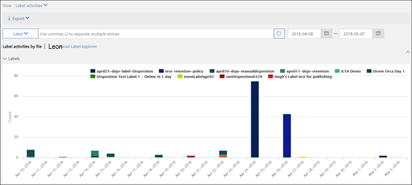
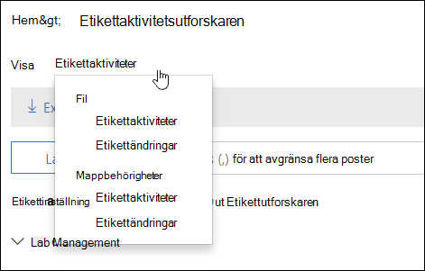
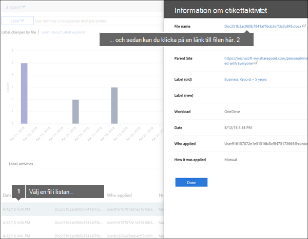
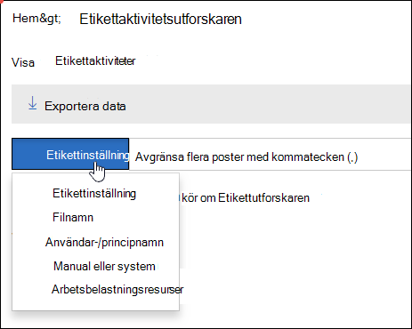

# Visa etikettaktivitet för dokumentView label activity for documents

När du har skapat dina etiketter bör du kontrollera att de används på innehållet som du tänkt dig.After you create your labels, you'll want to verify that they're being applied to content as you intended. Med utforskaren för etikettaktivitet i Säkerhets- &amp; efterlevnadscenter kan du snabbt söka efter och visa etikettaktivitet för allt innehåll i SharePoint och OneDrive för företag under de senaste 30 dagarna.With the Label Activity Explorer in the Security &amp; Compliance Center, you can quickly search and view label activity for all content across SharePoint and OneDrive for Business over the past 30 days. Det här är realtidsdata som ger dig en tydlig bild av vad som händer i klientorganisationen.This is real-time data that gives you a clear view into what's happening in your tenant.
  
Med utforskaren för etikettaktivitet kan du till exempel:For example, with the Label Activity Explorer, you can:
  
- Se hur många gånger varje etikett har använts varje dag (upp till 30 dagar).View how many times each label was applied on each day (up to 30 days).
    
- Se vem som har etiketterat exakt vilken fil på vilket datum, samt en länk till webbplatsen där filen finns.See who labeled exactly which file on which date, along with a link to the site where that file resides.
    
- Se vilka filer där etiketterna har ändrats eller tagits bort, vilka de gamla och nya etiketterna är och vem som har gjort ändringen.View which files had labels changed or removed, what the old and new labels are, and who made the change.
    
- Filtrera data för att se all etikettaktivitet för en viss etikett, fil eller användare.Filter the data to see all the label activity for a specific label, file, or user. Du kan också filtrera etikettaktiviteten efter plats (SharePoint eller OneDrive för företag) och om etiketten har använts manuellt eller automatiskt.You can also filter label activity by location (SharePoint or OneDrive for Business) and whether the label was applied manually or auto-applied.
    
- Se etikettaktiviteten för både mappar och enskilda dokument.View label activity for folders as well as individual documents. Snart kommer även möjligheten att se hur många filer i mappen som har etiketterats när mappen etiketterades.Coming soon is the ability to show how many files inside that folder got labeled as a result of the folder getting labeled.
    
Du hittar utforskaren för etikettaktivitet i Säkerhets- &amp; efterlevnadscenter > **Informationsstyrning** > **Utforskaren för etikettaktivitet**.You can find the Label Activity Explorer in the Security &amp; Compliance Center > **Information governance** > **Label activity explorer**.
  
Observera att utforskaren för etikettaktivitet kräver en Office 365 Enterprise E5-prenumeration.Note that the Label Activity Explorer requires an Office 365 Enterprise E5 subscription.
  

  
## Visa etikettaktiviteter för filer eller mapparView label activities for files or folders

Längst upp i utforskaren för etikettaktivitet kan du välja om du vill visa aktiviteter för filer eller mappar.At the top of the Label Activity Explorer, you can choose whether to view activities for files or folders. Observera att mappaktiviteten bara omfattar själva mappen, inte filerna i mappen.Note that folder activity includes only the folder itself, not the files inside the folder.
  
Du kanske vill se etikettaktiviteten för mappar eftersom om du anger en etikett för en mapp får även alla filer i mappen den etiketten (förutom filer där en etikett uttryckligen har tillämpats).You might want to see label activity for folders because if you label a folder, all files inside that folder also get that label (except for files that have had a label applied explicitly to them). Därför kan etikettering av mappar påverka ett betydande antal filer.Therefore, labeling folders might affect a significant number of files. Mer information finns i [Använda en standardkvarhållningsetikett på allt innehåll i ett SharePoint-bibliotek, en mapp eller en dokumentuppsättning](create-apply-retention-labels.md#applying-a-default-retention-label-to-all-content-in-a-sharepoint-library-folder-or-document-set).For more information, see [Applying a default retention label to all content in a SharePoint library, folder, or document set](create-apply-retention-labels.md#applying-a-default-retention-label-to-all-content-in-a-sharepoint-library-folder-or-document-set).
  

  
### EtikettaktiviteterLabel activities

 **Etikettaktiviteter** inkluderar alla etikettåtgärder: **lägga till**, **ta bort** eller **ändra** en etikett.**Label activities** includes all label actions: **adding**, **removing**, or **changing** a label. Du kan använda vyn för att få en översikt för hur många filer varje etikett har tillämpats på per dag.You can use this view to get a comprehensive look at how many files each label's been applied to per day. 
  
### EtikettändringarLabel changes

 **Etikettändringar** omfattar potentiellt riskabla åtgärder för att **ta bort** eller **ändra** en etikett.**Label changes** includes the potentially risky actions of **removing** or **changing** a label. Du kan använda vyn för att snabbt se sådana riskabla åtgärder och användaren som utförde dem.You can use this view to quickly see such risky actions and the user who performed them. I aktivitetslistan under diagrammet kan du markera en fil och sedan klicka på en länk till filen i informationsfönstret till höger.In the activity list below the chart, you can select a file, and then click a link to that file in the details pane on the right. 
  

  
## Filtrera etikettaktivitetFilter label activity

Du kan snabbt filtrera data för att se all etikettaktivitet för en viss etikett, fil eller användare.You can quickly filter the data to see all the label activity for a specific label, file, or user. Du kan också filtrera etikettaktiviteten efter plats (SharePoint eller OneDrive för företag) och om etiketten har använts manuellt eller automatiskt.You can also filter label activity by location (SharePoint or OneDrive for Business) and whether the label was applied manually or auto-applied.
  

  

