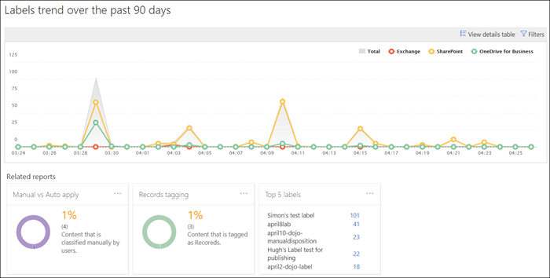
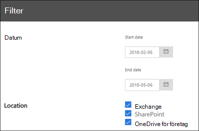

# Visa datastyrningsrapporterView the data governance reports

När du har skapat dina etiketter bör du kontrollera att de används på innehållet som du tänkt dig.After you create your labels, you'll want to verify that they're being applied to content as you intended. Med datastyrningsrapporterna i Säkerhets- &amp; Efterlevnadscenter kan du snabbt visa:With the data governance reports in the Security &amp; Compliance Center, you can quickly view:
  
- **De topp 5 etiketterna** I den här rapporten visas antalet av de topp 5 etiketterna som har tillämpats på innehåll.**Top 5 labels** This report shows the count of the top 5 labels that have been applied to content. Klicka på den här rapporten om du vill visa en lista med alla etiketter som nyligen tillämpats på innehåll.Click this report to view a list of all labels that have been recently applied to content. Du kan se antal och plats för varje etikett, hur den tillämpats, dess kvarhållningsåtgärder, om det är en post och dess dispositionstyp.You can see each label's count, location, how it was applied, its retention actions, whether it's a record, and its disposition type. 
    
- **Manuell kontra Auto applikation** I den här rapporten visas antalet på all innehåll som har etiketterats manuellt eller automatiskt, och procentandelen innehåll som har etiketterats manuellt jämfört med automatiskt.**Manual vs Auto apply** This report shows the count of all content that's been labeled manually or automatically, and the percentage of content that's been labeled manually vs automatically. 
    
- **Taggning av post** I den här rapporten visas antalet på all innehåll som har taggats som en post eller icke-post och procentandelen innehåll som har taggats som en post jämfört med icke-post.**Records tagging** This report shows the count of all content that's been tagged as a record or non-record, and the percentage of content that's been tagged as a record vs. non-record. 
    
- **Trend för etiketter under de senaste 90 dagarna** I den här rapporten visas antal och plats för alla etiketter som har tillämpats de senaste 90 dagarna.**Labels trend over the past 90 days** This report shows the count and location of all labels that have been applied in the last 90 days. 
    
Alla de här rapporterna visar etiketterade innehåll från Exchange, SharePoint och OneDrive för företag.All these reports show labeled content from Exchange, SharePoint, and OneDrive for Business.
  
Du hittar rapporterna i Säkerhets &amp; Efterlevnadscenter \> **Informationsstyrning** \> [**Instrumentpanel**](https://protection.office.com/datamanagement/dashboard).You can find these reports in the Security &amp; Compliance Center \> **Information governance** \> [**Dashboard**](https://protection.office.com/datamanagement/dashboard).
  

  
Du kan filtrera datastyrningsrapporterna efter datum (upp till 90 dagar) och plats (Exchange, SharePoint och OneDrive för företag).You can filter the data governance reports by date (up to 90 days) and location (Exchange, SharePoint, and OneDrive for Business). Det kan ta upp till 24 timmar innan de senaste data visas i rapporterna.The most recent data can take up to 24 hours to appear in the reports.
  

  

