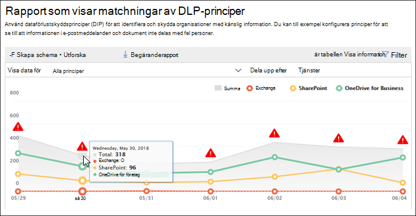
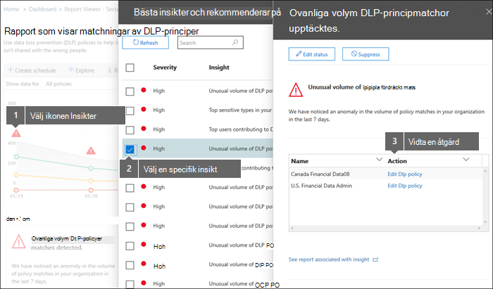

# Visa rapporter för dataförlustskydd

När du har skapat dina principer för dataförlustskydd (DLP) ska du kontrollera att de fungerar som de ska och hjälper dig att hålla dig uppdaterad. Med DLP-rapporterna i &amp; Säkerhetsefterlevnadscenter kan du snabbt visa:
  
- **DLP-principmatchning** Den här rapporten visar antalet DLP-principmatchningar över tid. Du kan filtrera rapporten efter datum, plats, princip eller åtgärd. Du kan använda den här rapporten för att: 
    
  - Finjustera eller förfina DLP-principerna när du kör dem i testläge. Du kan visa den specifika regel som matchade innehållet.
    
  - Fokusera på vissa tidsperioder och förstå orsakerna till toppar och trender.
    
  - Upptäck affärsprocesser som strider mot organisationens DLP-principer.
    
  - Förstå DLP-principernas eventuella affärseffekter genom att se vilka åtgärder som tillämpas på innehållet.
    
  - Kontrollera efterlevnaden med en särskild DLP-princip genom att visa de olika matchningarna för den principen.
    
  - Visa en lista över de största användarna och upprepa användare som bidrar till incidenter i organisationen.
    
  - Visa en lista över de vanligaste typerna av känslig information i organisationen.
    
- **DLP-incidenter** Den här rapporten visar även principmatchningar över tid, t.ex. rapporten principmatchningar. Men rapporten principmatchningar visar matchningar på en regelnivå. Om till exempel ett e-postmeddelande matchade tre olika regler, visas tre olika radobjekt i rapporten principmatchningar. Incidentrapporten visar däremot matchningar på objektnivå. Om till exempel ett e-postmeddelande matchade tre olika regler, visar incidentrapporten ett enda radobjekt för innehållsbiten. 
    
  Eftersom rapportantalen aggregeras olika är rapportmatchningen bättre för att identifiera matchningar med specifika regler och finjustera DLP-principer. Med incidentrapporten kan du bättre identifiera specifika innehållsdelar som är problematiska för DLP-principerna.
    
- **DLP falska positiva resultat och åsidosättningar** Om DLP-principen tillåter att användare åsidosätter den eller rapporterar en felaktig positiv inställning visas antalet sådana instanser över tid i den här rapporten. Du kan filtrera rapporten efter datum, plats eller princip. Du kan använda den här rapporten för att: 
    
  - Finjustera eller förfina DLP-principerna genom att se vilka principer som medför ett stort antal falska positiva resultat.
    
  - Visa argument som skickats av användare när de löser ett principtips genom att åsidosätta principen.
    
  - Upptäck var DLP-principerna står i konflikt med giltiga affärsprocesser genom att ett stort antal användare åsidosätts.
    
Alla DLP-rapporter kan visa data från den senaste tidsperioden på fyra månader. Det kan ta upp till 24 timmar innan de senaste data visas i rapporterna.
  
Du hittar dessa rapporter i instrumentpanelen för rapporter &amp; i \> **Säkerhetsefterlevnadscenter.** \> 
  

  
## Visa en användares justering för en åsidosättning

Om DLP-principen tillåter att användare åsidosätter den kan du använda den falska positiva inställningen och åsidosättningen av rapporten om du vill visa texten som skickats in av användare i principtipset.
  

  
## Vidta åtgärder för insikter och rekommendationer

Rapporter kan visa insikter och rekommendationer där du kan klicka på den röda varningsikonen för att se information om potentiella problem och vidta möjliga åtgärder.
  

  
## Behörigheter för DLP-rapporter

För att kunna visa DLP-rapporter i & säkerhets- och efterlevnadscenter måste du tilldelas:

- **Rollen Säkerhetsläsare** i Exchange administrationscentret. Som standard är den här rollen tilldelad rollgrupperna Organisationshantering och Säkerhetsläsare i Exchange administrationscentret.

- **Rollen Endast visad DLP-efterlevnadshantering** i Säkerhets- & Efterlevnadscenter. Som standard tilldelas den här rollen rollgrupperna Efterlevnadsadministratör, Organisationshantering, Säkerhetsadministratör och Säkerhetsläsare i säkerhets- & Säkerhets- och efterlevnadscenter.

- **Rollen Endast visa mottagare** i Exchange administrationscentret. Som standard är den här rollen tilldelad rollgrupperna Efterlevnadshantering, Organisationshantering och View-Only Organisationshantering i Exchange administrationscenter.

## Hitta cmdletarna för DLP-rapporterna

Om du vill använda de flesta cmdlets för &amp; Säkerhetsefterlevnadscenter måste du:
  
1. [Anslut till &amp; Säkerhetsefterlevnadscenter med fjärr-PowerShell](/powershell/exchange/connect-to-scc-powershell&amp;clcid=0x409)
    
2. Använda någon av följande [ &amp; cmdlets för Säkerhetsefterlevnadscenter](/powershell/exchange/exchange-online-powershell)
    
Men DLP-rapporter behöver hämta data från hela Office 365, inklusive Exchange Online. Därför är cmdlet:arna för DLP-rapporterna tillgängliga i Exchange Online Powershell – inte i Powershell för &amp; säkerhetsefterlevnad. Om du vill använda cmdlet:ar för DLP-rapporterna måste du därför:
  
1. [Ansluta till Exchange Online med fjärr-PowerShell](/powershell/exchange/connect-to-exchange-online-powershell)
    
2. Använd någon av följande cmdlets för DLP-rapporter:
    
      - [Get-DlpDetectionsReport](/powershell/module/exchange/get-dlpdetectionsreport)
    
      - [Get-DlpDetailReport](/powershell/module/exchange/get-dlpdetailreport)
