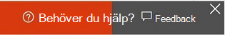

# Nyheter i Microsoft 365 EfterlevnadWhat's new in Microsoft 365 compliance

Oavsett om det handlar om att lägga till nya lösningar till efterlevnadscentret i [Microsoft 365,](microsoft-365-compliance-center.md)uppdatera befintliga funktioner baserat på din feedback eller distribuera ny och uppdaterad dokumentation hjälper Microsoft 365 dig att hålla dig uppdaterad om de ständigt föränderliga efterlevnadsmiljö.Whether it be adding new solutions to the [Microsoft 365 compliance center](microsoft-365-compliance-center.md), updating existing features based on your feedback, or rolling out fresh and updated documentation, Microsoft 365 helps you stay on top of the ever-changing compliance landscape. Ta en titt nedan för att se vad som är nytt i Microsoft 365 efterlevnad i dag.Take a look below to see what’s new in Microsoft 365 compliance today.

> [!NOTE]
> Vissa efterlevnadsfunktioner distribueras i olika hastigheter för våra kunder.Some compliance features get rolled out at different speeds to our customers. Om du inte ser en funktion ännu kan du prova att lägga till dig själv i [den riktade versionen](/office365/admin/manage/release-options-in-office-365).If you aren't seeing a feature yet, try adding yourself to [targeted release](/office365/admin/manage/release-options-in-office-365).

> [!TIP]
> Vill du veta vad som händer i andra administrationscenter?Interested in what's going on in other admin centers? Läs följande artiklar:Check out these articles: [Vad är nytt i Microsoft 365 administrationscenterWhat's new in the Microsoft 365 admin center](/office365/admin/whats-new-in-preview) [Vad är nytt i SharePoint administrationscenterWhat's new in the SharePoint admin center](/sharepoint/what-s-new-in-admin-center) [Nyheter i Microsoft 365 DefenderWhat's new in Microsoft 365 Defender](../security/defender/whats-new.md)  
Besök även [Microsoft 365 Översikt](https://www.microsoft.com/en-us/microsoft-365/roadmap) och lär dig Microsoft 365 funktioner som släppts, håller på att lanseras, är under utveckling, har avbrutits eller släppts tidigare.And visit the [Microsoft 365 Roadmap](https://www.microsoft.com/en-us/microsoft-365/roadmap) to learn about Microsoft 365 features that were launched, are rolling out, are in development, have been cancelled, or previously released.

## Mars 2021March 2021

Här är några av de ändringar Microsoft 365 av efterlevnadslösningar och innehåll för mars månad.Here are a few of the changes to Microsoft 365 compliance solutions and content for the month of March.

### Advanced eDiscoveryAdvanced eDiscovery

- **Advanced eDiscovery nu** med stöd för verktyget [och arbetsflödet för nya samlingar.](https://docs.microsoft.com/microsoft-365/compliance/collections-overview)**Advanced eDiscovery collections** now supports the [new collections tool and workflow](https://docs.microsoft.com/microsoft-365/compliance/collections-overview). Andra nya ämnen är [att skapa ett utkast ,](https://docs.microsoft.com/microsoft-365/compliance/create-draft-collection)spara ett utkast [till](https://docs.microsoft.com/microsoft-365/compliance/commit-draft-collection)en granskningsuppsättning och samla in statistik [och rapporter.](https://docs.microsoft.com/microsoft-365/compliance/collection-statistics-reports)Other new topics include [create a draft collection](https://docs.microsoft.com/microsoft-365/compliance/create-draft-collection), [commit a draft collection to a review set](https://docs.microsoft.com/microsoft-365/compliance/commit-draft-collection), and [collection statistics and reports](https://docs.microsoft.com/microsoft-365/compliance/collection-statistics-reports).
- **Exportera dokument** i en granskning som är inställd på [Azure Storage](https://docs.microsoft.com/microsoft-365/compliance/download-export-jobs) konto.**Export documents** in a review set to an [Azure Storage](https://docs.microsoft.com/microsoft-365/compliance/download-export-jobs) account.
- **Prediktiv kodningsmodul för Advanced eDiscovery**.**Predictive coding module for Advanced eDiscovery**. Titta först på de nya [funktionerna för förutsägelsekodning](https://docs.microsoft.com/microsoft-365/compliance/predictive-coding-overview) som ersätter den indragna relevansmodulen.First look at the new [predictive coding](https://docs.microsoft.com/microsoft-365/compliance/predictive-coding-overview) functionality that replaces the retired Relevance module.

### DataklassificeringData classification

- **Dataklassificeringsutforskaren**.**Data classification explorer**. [Komma igång med](https://docs.microsoft.com/microsoft-365/compliance/data-classification-activity-explorer) dataklassificeringsutforskaren.[Get started](https://docs.microsoft.com/microsoft-365/compliance/data-classification-activity-explorer) with data classification explorer.

### DatakopplingarData connectors

- **Privata nycklar**.**Private keys**. Stöd för privata nycklar har lagts till i [Bloomberg Message-data,](https://docs.microsoft.com/microsoft-365/compliance/archive-bloomberg-message-data#set-up-a-connector-using-public-keys) [ICE-chattdata](https://docs.microsoft.com/microsoft-365/compliance/archive-icechat-data#set-up-a-connector-using-public-keys) och [snabbkopplingar för Bloomberg-data.](https://docs.microsoft.com/microsoft-365/compliance/archive-instant-bloomberg-data#set-up-a-connector-using-public-keys)Support for private keys has been added to [Bloomberg Message](https://docs.microsoft.com/microsoft-365/compliance/archive-bloomberg-message-data#set-up-a-connector-using-public-keys) data, [ICE Chat](https://docs.microsoft.com/microsoft-365/compliance/archive-icechat-data#set-up-a-connector-using-public-keys) data, and [Instant Bloomberg](https://docs.microsoft.com/microsoft-365/compliance/archive-instant-bloomberg-data#set-up-a-connector-using-public-keys) data connectors.

### Skydd mot dataförlustData loss prevention

- **Microsoft Teams support**.**Microsoft Teams support**. Stöd för dataförlustskydd utökad [till Microsoft Teams.](https://docs.microsoft.com/microsoft-365/compliance/dlp-teams-default-policy)Data loss prevention support extended to [Microsoft Teams](https://docs.microsoft.com/microsoft-365/compliance/dlp-teams-default-policy).
- **Microsoft Compliance-tillägg.****Microsoft Compliance extension**. Komma igång med tillägget [Microsoft Compliance](https://docs.microsoft.com/microsoft-365/compliance/dlp-chrome-get-started).Get started with the [Microsoft Compliance extension](https://docs.microsoft.com/microsoft-365/compliance/dlp-chrome-get-started).

### KrypteringEncryption

- **Kundnyckel för Microsoft 365**.**Customer Key for Microsoft 365**. [Översikt över kundnyckeln för](https://docs.microsoft.com/microsoft-365/compliance/customer-key-tenant-level) Microsoft 365 på innehavarnivå (offentlig förhandsversion).[Overview of the Customer Key](https://docs.microsoft.com/microsoft-365/compliance/customer-key-tenant-level) for Microsoft 365 at the tenant level (public preview).
- **Dubbelnyckelkryptering**.**Double Key Encryption**. Läs mer om [hur du aktiverar stöd för etiketterade och skyddade dokument](https://docs.microsoft.com/microsoft-365/compliance/double-key-encryption) i SharePoint och OneDrive för företag.Learn more about [enabling support for labeled and protected documents](https://docs.microsoft.com/microsoft-365/compliance/double-key-encryption) in SharePoint and OneDrive for Business.

### Hantering av insiderriskInsider risk management

Följande uppdateringar av insider-riskhanteringsfunktionerna släpptes för offentlig förhandsversion i mars:The following insider risk management feature updates were released for public preview in March:

- Ny analysfunktion för att identifiera risker innan du skapar insider-riskprinciperNew analytics feature for identifying risks before creating insider risk policies
- Nytt stöd och hantering av riskaktivitetssekvenserNew risk activity sequence detection support and management
- Stöd för ny kumulativ exfiltrationsidentifieringNew cumulative exfiltration detection support
- Ny hälsorapportering och rekommendation i programmetNew in-app policy health reporting and recommendation support
- Ny granskningsloggfunktion och rapporteringNew auditing log feature and reporting
- Förbättringar av guiden för att skapa principEnhancements to the policy creation wizard
- Uppdateringar i InnehållsutforskarenContent explorer updates
- Ny användarhanteringsprocess/-support (lägg till/ta bort användare från principer)New user management process/support (add/remove users from policies)
- Nytt stöd för AAD-integrering (avgående stöd för användarprincip)New support for AAD integration (departing user policy support)
- Uppdaterat domänstöd i principer (REGEX)Updated domain support in policies (REGEX)
- Förbättringar och förbättringar av principmallenPolicy template enhancements and improvements

Följande avsnitt har uppdaterats eller lagts till som stöd för dessa nya funktioner:The following topics were updated or added to support these new features:

- [Lär dig mer om hantering av insiderriskerLearn about insider risk management](https://docs.microsoft.com/microsoft-365/compliance/insider-risk-management)
- [Planera för hantering av insiderriskerPlan for insider risk management](https://docs.microsoft.com/microsoft-365/compliance/insider-risk-management-plan)
- [Komma igång med inställningar för Insider-riskhanteringGet started with insider risk management settings](https://docs.microsoft.com/microsoft-365/compliance/insider-risk-management-settings)
- [Komma igång med hantering av Insider-riskhanteringGet started with insider risk management](https://docs.microsoft.com/microsoft-365/compliance/insider-risk-management-configure)
- [Skapa och hantera principer för hantering av insiderriskerCreate and manage insider risk policies](https://docs.microsoft.com/microsoft-365/compliance/insider-risk-management-policies)
- [Undersöka aviseringar för insiderriskerInvestigate insider risk alerts](https://docs.microsoft.com/microsoft-365/compliance/insider-risk-management-alerts)
- [Vidta åtgärder för insiderriskärendenTake action on insider risk cases](https://docs.microsoft.com/microsoft-365/compliance/insider-risk-management-cases)
- [Granska aktiviteter med granskningsloggen för Insider-riskerReview activities with the insider risk audit log](https://docs.microsoft.com/microsoft-365/compliance/insider-risk-management-audit-log)
- [Granska data med innehållsutforskaren för insiderriskerReview data with the insider risk content explorer](https://docs.microsoft.com/microsoft-365/compliance/insider-risk-management-content-explorer)
- [Hantera arbetsflödet med instrumentpanelen AnvändareManage the workflow with the Users Dashboard](https://docs.microsoft.com/microsoft-365/compliance/insider-risk-management-users)

### Hantering av arkivhandlingarRecords management

- **Förbättringar av arkivplanen.****File plan improvements**. En uppdatering av [filplanen tar](file-plan-manager.md) bort eller förbättrar de tidigare längdbegränsningarna för import.An update to [file plan](file-plan-manager.md) removes or improves the previous length restrictions for import.
- **Ta bort bevarandeetiketter för arkivhandlingar**.**Delete retention labels for records**. En förhandsversion har stöd för möjligheten att ta [bort bevarandeetiketter](create-apply-retention-labels.md#deleting-retention-labels) som markerar objekt som arkivhandlingar.A preview release supports the ability to [delete retention labels](create-apply-retention-labels.md#deleting-retention-labels) that mark items as records.

### Typer av känslig informationSensitive information types

Innehållet har lagts till eller uppdaterats i följande avsnitt:Content was added or updated in the following topics:

- [Komma igång med anpassad typ av känslig informationGet started with custom sensitive information type](https://docs.microsoft.com/microsoft-365/compliance/create-a-custom-sensitive-information-type)
- [Läs mer om typer av känslig informationLearn about sensitive information types](https://docs.microsoft.com/microsoft-365/compliance/sensitive-information-type-learn-about)
- [Skapa anpassade typer av känslig information med exakt datamatchning baserad klassificeringCreate custom sensitive information types with Exact Data Match based classification](https://docs.microsoft.com/microsoft-365/compliance/create-custom-sensitive-information-types-with-exact-data-match-based-classification)
- [Skapa meddelanden för exakt datamatchningCreate notifications for exact data match activities](https://docs.microsoft.com/microsoft-365/compliance/sit-edm-notifications-activities)
- [Definitioner för typ av känslig informationSensitive Information Type entity definitions](https://docs.microsoft.com/microsoft-365/compliance/sensitive-information-type-entity-definitions)
- [Skapa en anpassad typ av känslig information med PowerShellCreate a Custom Sensitive Information Type using PowerShell](https://docs.microsoft.com/microsoft-365/compliance/create-a-custom-sensitive-information-type-in-scc-powershell)
- [Skapa en nyckelordsordlistaCreate a keyword dictionary](https://docs.microsoft.com/microsoft-365/compliance/create-a-keyword-dictionary)

### KänslighetsetiketterSensitivity labels

- **DoD-stöd**.**DoD support**. Stöd för amerikanska myndigheter med DoD-miljöer.Support for US government tenants with DoD environments.
- **Kryptera endast för Outlook**.**Encrypt-Only for Outlook**. Krypteringsalternativ för Outlook nu att Encrypt-Only när du väljer [Låt användare tilldela behörigheter.](encryption-sensitivity-labels.md#let-users-assign-permissions)Encryption options for Outlook now include Encrypt-Only when you select [Let users assign permissions](encryption-sensitivity-labels.md#let-users-assign-permissions).
- **Tillämpa inbyggda etiketter i Office appar.****Enforcing built-in labels in Office apps**. Uppdaterad [vägledning](sensitivity-labels-office-apps.md#office-built-in-labeling-client-and-the-azure-information-protection-client) om hur du framtvingar inbyggda etiketter i Office-appar när du har installerat Azure Information Protection-unified labeling-klienten.Updated [guidance](sensitivity-labels-office-apps.md#office-built-in-labeling-client-and-the-azure-information-protection-client) how to enforce built-in labels in Office apps when you have the Azure Information Protection unified labeling client installed.

## Februari 2021February 2021

Här är några av de ändringar Microsoft 365 av efterlevnadslösningar och -innehåll för månaden februari.Here are a few of the changes to Microsoft 365 compliance solutions and content for the month of February.

### GranskningAuditing

- **Hantera bevarandeprinciper för granskningsloggar.****Manage audit log retention policies**. Läs mer om den nya [instrumentpanelen för granskningsbevarandeprinciper.](https://docs.microsoft.com/microsoft-365/compliance/audit-log-retention-policies#manage-audit-log-retention-policies-1)Learn more about the new [Audit retention policies dashboard](https://docs.microsoft.com/microsoft-365/compliance/audit-log-retention-policies#manage-audit-log-retention-policies-1).
- **Söka i granskningsloggen**.**Search the audit log**. [Använd PowerShell-skript för att söka i granskningsloggen](https://docs.microsoft.com/microsoft-365/compliance/audit-log-search-script).[Use PowerShell script to search the audit log](https://docs.microsoft.com/microsoft-365/compliance/audit-log-search-script).

### Dataklassificering – InnehållsutforskarenData Classification Content Explorer

Innehållet har lagts till eller uppdaterats i följande avsnitt:Content was added or updated in the following topics:

- [Kom igång med innehållsutforskarenGet started with content explorer](https://docs.microsoft.com/microsoft-365/compliance/data-classification-content-explorer)
- [Viktig information för dataklassificeringData classification release notes](https://docs.microsoft.com/microsoft-365/compliance/data-classification-pub-preview-relnotes)

### Skydd mot dataförlustData loss prevention

Innehållet har lagts till eller uppdaterats i följande avsnitt:Content was added or updated in the following topics:

- [Läs mer om Slutpunkt DLPLearn about Endpoint DLP](https://docs.microsoft.com/microsoft-365/compliance/endpoint-dlp-learn-about)
- [Skicka e-postaviseringar och visa principtips för DLP-principerSend email notifications and show policy tips for DLP policies](https://docs.microsoft.com/microsoft-365/compliance/use-notifications-and-policy-tips)
- [Lär dig mer Microsoft 365 skanner för dataförlustskydd på en lokal skannerLearn about the Microsoft 365 data loss prevention on-premises scanner](https://docs.microsoft.com/microsoft-365/compliance/dlp-on-premises-scanner-learn)
- [Komma igång med dataförlustskydd i lokal skannerGet started with the data loss prevention on-premises scanner](https://docs.microsoft.com/microsoft-365/compliance/dlp-on-premises-scanner-get-started)
- [Skapa en DLP-princip för att skydda dokument med FCI eller andra egenskaperCreate a DLP policy to protect documents with FCI or other properties](https://docs.microsoft.com/microsoft-365/compliance/protect-documents-that-have-fci-or-other-properties)
- [Använda skydd mot Endpoint data förlustUsing Endpoint data loss prevention](https://docs.microsoft.com/microsoft-365/compliance/endpoint-dlp-using)
- [Komma igång med data förlust skydd för EndpointGet started with Endpoint data loss prevention](https://docs.microsoft.com/microsoft-365/compliance/endpoint-dlp-getting-started)

### eDiscoveryeDiscovery

Innehållet har lagts till eller uppdaterats i följande avsnitt:Content was added or updated in the following topics:

- [Dekryptering i Microsoft 365 eDiscovery-verktygDecryption in Microsoft 365 eDiscovery tools](https://docs.microsoft.com/microsoft-365/compliance/ediscovery-decryption)
- [Nyckelordsfrågor och sökvillkorKeyword queries and search conditions](https://docs.microsoft.com/microsoft-365/compliance/keyword-queries-and-search-conditions#limitations-for-searching-sensitive-data-types)
- [Relevansmodulen i Advanced eDiscoveryRetirement of the Relevance module in Advanced eDiscovery](https://docs.microsoft.com/microsoft-365/compliance/relevance-module-retirement)
- [Använda ett skript för att lägga till användare i ett ärende för bas-eDiscoveryUse a script to add users to a hold in a Core eDiscovery case](https://docs.microsoft.com/microsoft-365/compliance/use-a-script-to-add-users-to-a-hold-in-ediscovery)

### KrypteringEncryption

Innehållet har lagts till eller uppdaterats i följande avsnitt:Content was added or updated in the following topics:

#### Azure Rights Management Service (RMS)Azure Rights Management Service (RMS)

- [Kundhanterade krypterings funktionerCustomer-managed encryption features](https://docs.microsoft.com/microsoft-365/compliance/office-365-customer-managed-encryption-features)
- [Exchange Online e-postkryptering med AD RMS](https://docs.microsoft.com/microsoft-365/compliance/information-rights-management-in-exchange-online).[Exchange Online mail encryption with AD RMS](https://docs.microsoft.com/microsoft-365/compliance/information-rights-management-in-exchange-online). Supporten för den här tjänsten har tagits bort.Support for this service has been deprecated. Du kan inte längre använda AD RMS i en Exchange-hybridmiljö.You can no longer use AD RMS in an Exchange hybrid environment. Migrera i stället till Azure RMS.Instead, migrate to Azure RMS.

#### Customer KeyCustomer Key

- [Kundnyckel för Microsoft 365 på innehavarnivåCustomer Key for Microsoft 365 at the tenant level](https://docs.microsoft.com/microsoft-365/compliance/customer-key-tenant-level)
- [Översikt över säkerhet och efterlevnadOverview of security and compliance](https://docs.microsoft.com/microsoftteams/security-compliance-overview)

#### IRM (Information Rights Management)Information Rights Management (IRM)

- [Tillämpa IRM (Information Rights Management) på en lista eller ett bibliotek.](https://docs.microsoft.com/microsoft-365/compliance/configure-irm-to-use-an-on-premises-ad-rms-server)[Apply Information Rights Management (IRM) to a list or library](https://docs.microsoft.com/microsoft-365/compliance/configure-irm-to-use-an-on-premises-ad-rms-server). De här nationella molnen stöder inte den här inställningen:These national clouds do not support this setting:
    - Microsoft Cloud for US GovernmentMicrosoft Cloud for US Government
    - Microsoft Cloud GermanyMicrosoft Cloud Germany
    - Azure och Microsoft 365 som drivs av 21Vianet i Kina)Azure and Microsoft 365 operated by 21Vianet in China)
- [Konfigurera IRM för användning av en lokal AD RMS-server](https://docs.microsoft.com/microsoft-365/compliance/configure-irm-to-use-an-on-premises-ad-rms-server).[Configure IRM to use an on-premises AD RMS server](https://docs.microsoft.com/microsoft-365/compliance/configure-irm-to-use-an-on-premises-ad-rms-server). Stöd för den här tjänsten Exchange en e-posthybridmiljö har tagits bort.Support for this service in an Exchange hybrid environment has been deprecated.

### Typer av känslig informationSensitive Information Types

Innehållet har lagts till eller uppdaterats i följande avsnitt:Content was added or updated in the following topics:

- [Läs mer om typer av känslig informationLearn about sensitive information types](https://docs.microsoft.com/microsoft-365/compliance/sensitive-information-type-learn-about)
- [Skapa en anpassad typ av känslig information med PowerShellCreate a custom sensitive information type using PowerShell](https://docs.microsoft.com/microsoft-365/compliance/create-a-custom-sensitive-information-type-in-scc-powershell)
- [Skapa en anpassad typ av känslig information med exakt datamatchning baserad klassificeringCreate a custom sensitive information types with Exact Data Match based classification](https://docs.microsoft.com/microsoft-365/compliance/create-custom-sensitive-information-types-with-exact-data-match-based-classification)
- [Entitetsdefinitioner för typer av känslig informationSensitive information type entity definitions](https://docs.microsoft.com/microsoft-365/compliance/sensitive-information-type-entity-definitions)

### KänslighetsetiketterSensitivity labels

Innehållet har lagts till eller uppdaterats i följande avsnitt:Content was added or updated in the following topics:

- **SharePoint extern delning**.**SharePoint external sharing**. För [behållaretiketter](sensitivity-labels-teams-groups-sites.md) är alternativet för extern delning från SharePoint nu tillgängligt som allmänt tillgänglig.For [container labels](sensitivity-labels-teams-groups-sites.md) the option for external sharing from SharePoint sites is now released as generally available. Dessutom har administrationscentret Microsoft 365 och Planner nu stöd för att använda känslighetsetiketterna.Additionally, the Microsoft 365 admin center and Planner now support applying these sensitivity labels. 
- **Samtidig redigering och spara automatiskt**.**Co-authoring and AutoSave**. Stöd för [samtidig redigering och spara automatiskt](sensitivity-labels-coauthoring.md) för krypterade filer släpps som förhandsversion för testning i icke-produktionsklienter.Support for [co-authoring and AutoSave](sensitivity-labels-coauthoring.md) for encrypted files is released as preview for testing in non-production tenants.

## Januari 2021January 2021

### Stöd för kortinnehåll i TeamsSupport for card content in Teams

Följande lösningar Microsoft 365 efterlevnad har nu stöd för identifiering av [kortinnehåll som](/microsoftteams/platform/task-modules-and-cards/what-are-cards) genererats via appar i Teams meddelanden:The following Microsoft 365 compliance solutions now support the detection of [card content](/microsoftteams/platform/task-modules-and-cards/what-are-cards) generated through apps in Teams messages:

- **Kärn- och Advanced eDiscovery**.**Core and Advanced eDiscovery**. Kortinnehåll kan nu [sätts i is](create-ediscovery-holds.md#preserve-card-content) eller ingå [i sökningar](/microsoftteams/ediscovery-investigation#search-for-card-content) (gäller även innehållssökning).Card content can now be [placed on hold](create-ediscovery-holds.md#preserve-card-content) or included in [searches](/microsoftteams/ediscovery-investigation#search-for-card-content) (applies to content search as well).
- **Granska**.**Audit**. Kortaktivitet registreras [nu i granskningsloggen](/microsoftteams/audit-log-events#teams-activities).Card activity is now [recorded to the audit log](/microsoftteams/audit-log-events#teams-activities).
- **Bevarandeprinciper.****Retention policies**. Bevarandeprinciper kan nu användas för [att behålla och ta bort kortinnehåll.](retention-policies-teams.md#whats-included-for-retention-and-deletion)Can now use retention policies to [retain and delete card content](retention-policies-teams.md#whats-included-for-retention-and-deletion).

### Informationsstyrning och hantering av arkivhandlingarInformation governance and records management

[Ny bedömning för](retention-regulatory-requirements.md#new-zealand-public-records-act) att hantera användning av informationsstyrning och hantering av arkivhandlingar för att uppfylla efterlevnadsskyldigheter för New Zealand Public Records Act.[New assessment](retention-regulatory-requirements.md#new-zealand-public-records-act) to address using information governance and records management to help meet compliance obligations for the New Zealand Public Records Act.

### KänslighetsetiketterSensitivity labels

- Känslighetsetiketter stöds nu för amerikanska myndigheters GCC och GCC–H).Sensitivity labels are now supported for US Government tenants (GCC and GCC-H).
- Nytt [automatiskt etikettstöd](sensitivity-labels-office-apps.md) för macOS.New [automatic labeling](sensitivity-labels-office-apps.md) support for macOS.

## December 2020December 2020

### Spotlight: Nytt innehåll för Insider Risk-lösningarSpotlight: New content for insider risk solutions

Teamet Microsoft 365 kompatibilitetsinnehåll arbetar hårt med att skapa dokument för "innehållslösning" för att främja hur efterlevnadsfunktioner kan användas tillsammans för att hjälpa dig att uppfylla dina efterlevnadsmål.The Microsoft 365 compliance content team is hard at work creating ‘content solution’ docs to promote how compliance capabilities can be used together to help meet your compliance goals.

Först och främst är innehåll som binder samman våra Insider-risklösningar: kommunikationsefterlevnad, insider-riskhantering, informationsbarriärer och behörighetshantering.First up is content that ties together our insider risk solutions: communication compliance, insider risk management, information barriers, and privileged access management. Här är en översikt över vad du hittar:Here’s a peek at what you’ll find:

- [Ny landningssida för insiderrisklösningar](insider-risk-solution-overview.md).[New landing page for insider risk solutions](insider-risk-solution-overview.md). Innehåller information om risker som lösningarna kan hjälpa till att minimera, licenskrav, distributionssekvens, arkitekturbilder, utbildningsresurser med mera.Includes details about risks that the solutions can help mitigate, licensing requirements, deployment sequence, architecture illustrations, training resources, and more.
- Nya översiktsartiklar för varje insider-risklösning.New overview articles for each insider risk solution. Vägledning och länkar till artiklar som hjälper dig att lära dig mer om, planera, distribuera och hantera varje lösning:Guidance and links to articles that help you learn about, plan, deploy, and manage each solution:
  - [Efterlevnad av kommunikationCommunication compliance](communication-compliance-solution-overview.md)
  - [Hantering av insiderriskInsider risk management](insider-risk-management-solution-overview.md)
  - [InformationsbarriärerInformation barriers](information-barriers-solution-overview.md)
  - [Privilegierad åtkomsthanteringPrivileged access management](privileged-access-management-solution-overview.md)
  
Fler innehållslösningsdokument kommer snart!More content solution docs coming soon!

### Advanced eDiscoveryAdvanced eDiscovery

Förbättrat arbetsflöde och förbättrade funktioner för [att lägga till dokument](add-custodians-to-case.md) och [icke-dokumentade datakällor](non-custodial-data-sources.md) till ett Advanced eDiscovery fall.Improved workflow and functionality for [adding custodians](add-custodians-to-case.md) and [non-custodial data sources](non-custodial-data-sources.md) to an Advanced eDiscovery case.

### DatakopplingarData connectors

[Fyra nya Veritas-kopplingar som släppts](archiving-third-party-data.md#third-party-data-connectors): Redtail Speak, Salesforce Chatter, ServiceNow och Yieldbroker.[Four new Veritas connectors released](archiving-third-party-data.md#third-party-data-connectors): Redtail Speak, Salesforce Chatter, ServiceNow, and Yieldbroker.

### KrypteringEncryption

Vi [presenterar kundnyckel för Microsoft 365 på innehavarnivå.](customer-key-tenant-level.md)Introducing [Customer Key for Microsoft 365 at the tenant level](customer-key-tenant-level.md). Med nycklar som du anger kan du skapa en datakrypteringsprincip (DEP) och tilldela den till klientorganisationen.Using keys you provide, you can create a data encryption policy (DEP) and assign it to the tenant. Data krypteras i klientorganisationen för dessa arbetsbelastningar:The DEP encrypts data across the tenant for these workloads:

- Teams dina chattmeddelanden (1:1-chattar, gruppchattar, möteschattar och kanalkonversationer)Teams chat messages (1:1 chats, group chats, meeting chats and channel conversations)
- Teams mediemeddelanden (bilder, kodstycken, videor, wiki-bilder)Teams media messages (images, code snippets, videos, wiki images)
- Teams samtals- och mötesinspelningar som lagras Teams lagringsutrymmeTeams call and meeting recordings stored in Teams storage
- Teams chattaviseringarTeams chat notifications
- Teams förslag på chattar av CortanaTeams chat suggestions by Cortana
- Teams statusmeddelandenTeams status messages
- Information om användare och Exchange OnlineUser and signal information for Exchange Online

### Hantering av arkivhandlingarRecords management

Rollgruppen [för hantering av arkivhandlingar beviljar](get-started-with-records-management.md#permissions-required-for-records-management) nu behörigheter för alla funktioner för hantering av arkivhandlingar, inklusive dispositionsgranskning.The [Records Management admin role group](get-started-with-records-management.md#permissions-required-for-records-management) now grants permissions for all records management features, including disposition review.

### KänslighetsetiketterSensitivity labels

- [Automatiskt märka data i Azure Purview (förhandsversion).](/azure/purview/create-sensitivity-label)[Automatically label data in Azure Purview (preview)](/azure/purview/create-sensitivity-label). Nu kan du skapa och automatiskt tillämpa känslighetsetiketter på tillgångar i Azure Purview, till exempel filer i Azure Blob-lagring och databaskolumner i SQL Server.You can now create and automatically apply sensitivity labels to assets in Azure Purview, such as files in Azure Blob storage and database columns in SQL Server.
- [Kräv att användare använder en etikett för objekt](sensitivity-labels-office-apps.md#require-users-to-apply-a-label-to-their-email-and-documents).[Require users to apply a label to items](sensitivity-labels-office-apps.md#require-users-to-apply-a-label-to-their-email-and-documents). Det här nya alternativet kallas även för obligatorisk märkning och kräver att användarna väljer och använder en känslighetsetikett under de specifika scenarierna.Also known as ‘mandatory labeling’, this new option requires users to choose and apply a sensitivity label under the specific scenarios.

## November 2020November 2020
Vi vill påminna om att vi ofta släpper nya och uppdaterade funktioner i förhandsversioner för att lära oss hur de används så att vi kan finslipa och förbättra dem innan de släpps till allmän tillgänglighet.Just a reminder that we often release new and updated features in a preview state to learn how they're being used so we can hone and improve them before releasing to general availability. Din feedback är viktig under förhandsversionen (och därefter), så se till att berätta för oss vad du tycker genom att öppna Feedback-kortet längst ned till höger i efterlevnadscentret.Your feedback is critical during preview (and beyond), so be sure to let us know what you think by opening the Feedback card at the bottom right of the compliance center.

### Spotlight: Dataförlustskydd i slutpunkt (DLP) har släpptsSpotlight: Endpoint data loss prevention (DLP) released

[Slutpunkt DLP](endpoint-dlp-learn-about.md) utökar funktionerna för övervakning och skydd av aktiviteter i DLP till känslig information på Windows 10 enheter.[Endpoint DLP](endpoint-dlp-learn-about.md) extends the activity monitoring and protection capabilities of DLP to sensitive info on Windows 10 devices. När enheter har [introducerats](dlp-configure-endpoints.md) till Microsoft 365 efterlevnadscenter kan du konfigurera DLP-principer för att skydda känslig information på dessa enheter.After devices are [onboarded](dlp-configure-endpoints.md) to the Microsoft 365 compliance center, you can set up DLP policies to protect the sensitive info on those devices.

### Advanced eDiscoveryAdvanced eDiscovery

För att göra det enklare att hantera krypterat innehåll i eDiscovery-arbetsflödet införlivar Microsoft 365 eDiscovery-verktygen nu [dekryptering](ediscovery-decryption.md) av krypterade filer som bifogas i e-postmeddelanden och skickas i Exchange.To make it easier to manage encrypted content in the eDiscovery workflow, Microsoft 365 eDiscovery tools now incorporate [decryption of encrypted files](ediscovery-decryption.md) that are attached to email messages and sent in Exchange. Dessutom kan krypterade dokument som lagras SharePoint och OneDrive dekrypteras i Advanced eDiscovery.Additionally, encrypted documents stored in SharePoint and OneDrive are decrypted in Advanced eDiscovery.

### EfterlevnadshanterarenCompliance Manager

- [Stöd för Microsoft 365 för myndigheter.](compliance-manager.md)[Support for Microsoft 365 Government subscriptions](compliance-manager.md). Efterlevnadshanteraren är nu tillgänglig för kunder i amerikanska government community (GCC) måttliga och höga kunder.Compliance Manager is now available to US Government Community (GCC) Moderate and High customers.
- [Microsoft Compliance Configuration Analyzer för Efterlevnadshanteraren.](compliance-manager-mcca.md)[Microsoft Compliance Configuration Analyzer for Compliance Manager](compliance-manager-mcca.md). Nytt PowerShell-baserat verktyg som hjälper dig att komma igång med Efterlevnadshanteraren genom att skanna organisationens aktuella konfigurationer och validera dem mot Microsoft 365 rekommenderade metodtips.New PowerShell-based tool that helps you get started with Compliance Manager by scanning your organization’s current configurations and validating them against Microsoft 365 recommended best practices.
- [Nya mallar](compliance-manager-templates-list.md).[New templates](compliance-manager-templates-list.md). Lade till 56 nya mallar, vilket innebär att totalt antal mallar för Efterlevnadshanteraren läggs till i över 230.Added 56 new templates, bringing total Compliance Manager templates to over 230.

### DatakopplingarData connectors

[Fem nya Veritas-kopplingar i förhandsgranskning](archiving-third-party-data.md#third-party-data-connectors).[Five new Veritas connectors in preview](archiving-third-party-data.md#third-party-data-connectors). Nya kopplingar är Reuters Dealing, Reuters FX, CellTrust, XIP, generic MS SQL Database data.New connectors include Reuters Dealing, Reuters FX, CellTrust, XIP, generic MS SQL Database data.

### Bevarandeetiketter (dispositionsgranskning)Retention labels (disposition review)

För att visa objekt under en dispositionsgranskning måste användarna nu vara medlemmar i rollgrupperna Innehållsutforskaren Innehållsvisare och [Visningsprogram för innehållsutforskaren.](disposition.md#permissions-for-disposition)To view items during a disposition review, users must now be members of the [Content Explorer Content Viewer and Content Explorer List Viewer role groups](disposition.md#permissions-for-disposition). Även om det krävs för att granska objekt, är de här rollgrupperna inte nödvändiga för att slutföra dispositionsgranskningen.Although required to review items, these role groups aren’t necessary for completing the disposition review.

### KänslighetsetiketterSensitivity labels

- [(Förhandsgranska) Inställningar för extern delning SharePoint webbplatser](sensitivity-labels-teams-groups-sites.md#how-to-configure-groups-and-site-settings).[(Preview) External sharing settings for SharePoint sites](sensitivity-labels-teams-groups-sites.md#how-to-configure-groups-and-site-settings). När du skapar en etikett som ska användas för grupper och webbplatser visas ett alternativ för att styra extern delning för SharePoint webbplatser där etiketten används.When creating a label that will be used for groups and sites, you’ll see an option to control external sharing for SharePoint sites that have the label applied. Du kan ange att delning tillåts för alla, nya och befintliga gäster, endast befintliga gäster eller bara för användare i organisationen.You can specify that sharing is allowed for anyone, new and existing guests, existing guests only, or just users in your organization. När etiketten används ersätter etikettinställningarna alla inställningar för extern delning som konfigurerats i SharePoint [administrationscenter.](/sharepoint/change-external-sharing-site)When the label is applied, the label settings will replace any external sharing settings [configured in the SharePoint admin center](/sharepoint/change-external-sharing-site).
- [Ta bort etikett och kryptering från ett etiketterat dokument](sensitivity-labels-sharepoint-onedrive-files.md#remove-encryption-for-a-labeled-document).[Remove label and encryption from a labeled document](sensitivity-labels-sharepoint-onedrive-files.md#remove-encryption-for-a-labeled-document). Om du vill ta bort både en etikett och krypteringen som används från ett etiketterat dokument i SharePoint kan globala administratörer och SharePoint-administratörer köra den nya `Unlock-SPOSensitivityLabelEncryptedFile` cmdleten.To remove both a label and the encryption it enforces from a labeled document in SharePoint, global admins and SharePoint admins can run the new `Unlock-SPOSensitivityLabelEncryptedFile` cmdlet. Den här cmdleten körs även om administratören inte har åtkomstbehörighet till webbplatsen eller filen, eller om Azure Rights Management-tjänsten inte är tillgänglig.This cmdlet runs even if the admin doesn't have access permissions to the site or file, or if the Azure Rights Management service is unavailable.

## Oktober 2020October 2020

### Advanced eDiscoveryAdvanced eDiscovery

[CJK-språkstöd](ediscovery-cjk-support.md).[CJK language support](ediscovery-cjk-support.md). Advanced eDiscovery har nu stöd för språk med teckenuppsättning med dubbla byte, som gemensamt kallas CJK-språk (inklusive förenklad kinesiska, traditionell kinesiska, japanska och koreanska).Advanced eDiscovery now supports double-byte character set languages, collectively known as CJK languages (includes Simplified Chinese, Traditional Chinese, Japanese, and Korean). De kan användas i flera avancerade granskningsscenarier.These can be used in several advanced review set scenarios.

### KänslighetsetiketterSensitivity labels

- [Etikettomfattning](sensitivity-labels.md#label-scopes).[Label scope](sensitivity-labels.md#label-scopes). När du skapar en känslighetsetikett ser du ett nytt alternativ som definierar etikettens omfattning.When creating a sensitivity label, you’ll see a new option to define the scope for the label. Med det här alternativet kan du konfigurera etiketter bara för filer och e-postmeddelanden, behållare (som SharePoint webbplatser och Teams) eller båda.This option lets you configure labels just for files and emails, containers (like SharePoint sites and Teams), or both.
- [Dynamisk innehållsmarkering](sensitivity-labels-office-apps.md#dynamic-markings-with-variables).[Dynamic content marking](sensitivity-labels-office-apps.md#dynamic-markings-with-variables). När du konfigurerar innehållsmarkering för en känslighetsetikett kan du nu använda de dynamiska variablerna, till exempel och i textsträngen för sidhuvudet, sidfoten `${Item.Label}` `${Item.Location}` eller vattenstämpeln.When configuring content marking for a sensitivity label, you can now use the dynamic variables such as `${Item.Label}` and `${Item.Location}` in the text string for your header, footer, or watermark.
